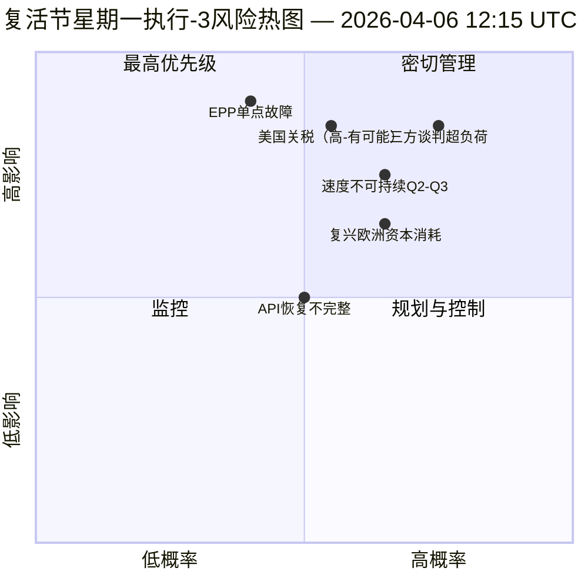

<!-- SPDX-FileCopyrightText: 2026 Hack23 AB -->
<!-- SPDX-License-Identifier: Apache-2.0 -->

# 执行情报简报 — 复活节星期一 执行3：API恢复 + 汇聚区 | 2026-04-06

**分类：** OSINT — 公开议会记录
**置信度：** 🟡 中等（休会期间；API端点首次确认恢复；三方谈判超负荷风险高）
**执行：** `analysis/daily/2026-04-06/breaking-3/`（12:15 UTC）
**覆盖范围：** 复活节休会日 11/18 正午；采用文本信息流首次确认恢复
**生成日期：** 2026-05-16（回溯性摘要，无新MCP调用）
**主要来源：** 采用文本信息流（86条，已恢复）；6种新方法（结果树、立法中断、速度风险、资本风险、投票模式、代理风险）。

---

## 🎯 核心结论

**执行-3产生了当日最重要的运营发现——11天休会期间*欧洲议会API端点的首次确认恢复*：采用文本信息流从模式-B（06:45 UTC的JSON解析错误）转变为成功响应（12:15 UTC返回86条记录），验证了执行-2的"后端重启"假设。** 除监控信号外，本次执行还完成了之前未涵盖的6种剩余分析方法，并提供三项结构性贡献：**(甲) 结果树**绘制三条级联效应链——立法冲刺 → 实施瀑布、API恢复 → 数据透明度瀑布、EPP双轨道 → 政治资本瀑布——在4月14~23日汇聚形成**"汇聚区"**，届时委员会周、欧洲央行利率决定和休会后首次全体投票同时发生；**(乙) 立法速度风险**将EP10第2年记录为**每次会议2.11项法案，同比+44%，为2012年EP7欧元区危机应对以来最高水平**——标注为第2~3季度的可持续性隐患；**(丙) 政治资本风险**识别集团级别的资本动态——**EPP积累中，绿党/欧洲自由联盟下降中，"复兴欧洲"消耗最快**——系统韧性6/10，EPP存在单点故障。本次执行风险登记册共15项（0项严重、4项高、7项中、4项低），三方谈判超负荷（高，可能）和美国关税（高，有可能）位列前两位。韧性评分5.8/10表明可测量但非严重的紧张态势。

---

## 🧭 本简报支持的3项决策

| # | 决策 | 决策者 | 截止日期 | 证据 |
|:-:|------|--------|:--------:|------|
| 1 | **加强汇聚区监控** — 4月14~23日需要T+0/+1/+2触发器 | EP情报运营；新闻服务 | 4月12日前 | §结果树（汇聚区） |
| 2 | **速度可持续性审查** — 每次会议2.11项在第2季度后不可持续 | 议长会议 | 第2季度持续中 | §速度风险（同比+44%） |
| 3 | **"复兴欧洲"资本消耗监控** — 消耗最快的集团；任期中期稳定性关切 | 复兴欧洲领导层；EPP协调 | 持续中 | §政治资本风险（复兴欧洲） |

---

## 📰 60秒速读

- 🔴 **API端点首次确认恢复** — 采用文本信息流：模式-B → 成功（86条）。
- 🟠 **汇聚区4月14~23日** — 委员会周 + 欧洲央行 + 全体会议同时到来。
- 🟢 **速度异常：每次会议2.11项（同比+44%）** — 2012年EP7欧元区应对以来最高。
- 🟡 **政治资本：** EPP积累中 · 绿党下降中 · 复兴欧洲消耗最快。
- 🔵 **系统韧性6/10** — EPP存在单点故障。
- 🟣 **15项风险登记：** 严重0 · 高4 · 中7 · 低4；韧性5.8/10。
- 🩷 **前2大风险：** 三方谈判超负荷（高，可能）· 美国关税（高，有可能）。
- ⚪ **置信度：中等** — 主要恢复观测；结构性读数高。

---

## 🌳 三条级联效应链（执行-3的独特贡献）

| 链条 | 触发因素 | 级联 | 汇聚点 |
|------|---------|------|--------|
| **立法冲刺 → 实施瀑布** | 3月26日休会前突击处理 | EP10-2026的42份文件进入第2季度实施 | 4月14~17日委员会周 |
| **API恢复 → 数据透明度瀑布** | 采用文本：模式-B → 干净恢复 | 其他端点跟进；完全透明度恢复 | 预计4月8~10日 |
| **EPP双轨道 → 政治资本瀑布** | 3月26日双轨道采纳 | EPP中资本积累；复兴欧洲中消耗 | 4月20~23日首次全体会议 |

**汇聚区：** 4月14~23日 — 三条链条在同一个10天窗口内汇聚。

---

## ⚠️ 风险快照

---

## 🔮 主要未来触发因素（未来14天）

1. **4月8~10日 — 预期完整API恢复**（执行-3模型55%概率）。
2. **4月14日 — 委员会周开幕** — 汇聚区第1天。
3. **4月17日 — 欧洲央行利率决定** — 经济背景变量。
4. **4月20~23日 — 休会后首次全体会议** — 双轨道验证。
5. **第2季度末 — 速度可持续性审查** — 每次会议2.11项测试。

---

## 🛡️ 信息来源质量评估

- **API恢复（A1）：** 执行-3直接观测；端点首次确认重启。
- **速度每次会议2.11项（A1）：** 预先计算的统计数据；历史比较可验证。
- **资本消耗排名（A2）：** 集团级别资本方法论；中等置信度排序。
- **15项风险登记（A2）：** 系统化方法论；韧性评分5.8/10可验证。
- **净置信度：** 🟢 API恢复为高；🟡 资本消耗预测为中等。

---

## 📎 执行成果

| 层级 | 成果 | 原因 |
|------|------|------|
| 文章 | `article.md` | 执行-3公开叙述 |
| 综合 | `synthesis-summary.md` | API恢复 + 6种新方法 |
| 方法论 | 结果树 · 立法中断 · 速度风险 · 政治资本风险 · 投票模式 · 代理风险流 | 六种新方法（本次执行） |
| 同期 | breaking (00:33) · breaking-2 (06:45) · 委员会报告 (05:03) · 提案 (05:47) | 复活节星期一集群 |

---

**文档管理**
- **模板参考：** `analysis/templates/executive-brief.md`
- **成果路径：** `analysis/daily/2026-04-06/breaking-3/executive-brief.md`
- **分类：** 公开
- **回溯性说明：** 摘要于2026-05-16根据已归档的执行成果编写；**未进行新的MCP调用**。
