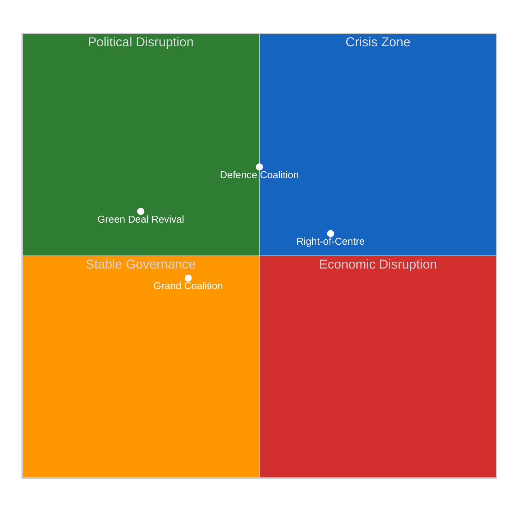
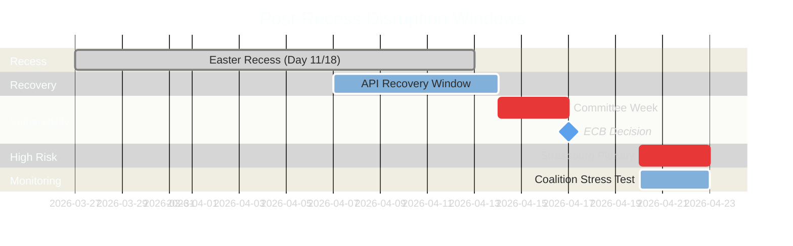

# ⚡ Legislative Disruption Analysis — Post-Recess Vulnerability Assessment

**Date:** 6 April 2026 (Easter Monday — Midday Update) | **Confidence:** 🟡 MEDIUM
**Recess Day:** 11/18 | **Run:** breaking-3 (12:15 UTC) | **Article Type:** breaking

---

## Executive Summary

| Disruption Vector | Severity | Probability | Timeline | Key Actor |
|-------------------|----------|-------------|----------|-----------|
| **Trilogue Overload** | HIGH | Likely (>65%) | April-June 2026 | Council Presidency |
| **Coalition Fragmentation** | MEDIUM | Possible (40-55%) | 20-23 April | PPE-S&D axis |
| **External Shock (US Tariffs)** | HIGH | Possible (35-50%) | Ongoing | INTA Committee |
| **API Data Blackout Legacy** | LOW | Likely (>70%) | 7-13 April | EP IT Services |
| **ECB Rate Decision Spillover** | MEDIUM | Possible (40-60%) | 17 April | ECON Committee |
| **Member State Election Cycles** | LOW | Possible (30-45%) | Q2-Q3 2026 | National delegations |

---

## Disruption Vector 1: Trilogue Pipeline Overload

### Threat Assessment

The pre-recess legislative sprint produced 104 adopted texts in Q1 2026. Multiple major files now require trilogue negotiations simultaneously:

| File | EP Position | Council Status | Complexity | Deadline Pressure |
|------|------------|----------------|------------|-------------------|
| **SRMR3** (Banking Resolution) | Adopted (right-of-centre) | Awaiting position | 🔴 HIGH | Q2 2026 |
| **Anti-Corruption Directive** | Adopted (grand coalition) | Awaiting position | 🟡 MEDIUM | Open |
| **Copyright & AI Resolution** | In pipeline | Pre-negotiation | 🔴 HIGH | Q3 2026 |
| **EU Talent Pool** | Adopted | Member state consultations | 🟡 MEDIUM | Q4 2026 |
| **Defence Single Market** | Committee stage | Early drafting | 🔴 HIGH | 2027 |

### Disruption Mechanism

The Council's negotiating bandwidth is finite. With 3+ major files in trilogue simultaneously, the risk is:

1. **Priority ranking forced:** Council must choose which files to advance first — creating winners and losers among EP committees
2. **Rapporteur burnout:** MEPs leading trilogue delegations face overlapping schedules
3. **Package deal pressure:** Council may attempt to link unrelated files for leverage
4. **Quality degradation:** Time pressure leads to weaker compromises

**Confidence:** 🟡 MEDIUM — the exact trilogue timeline depends on Council positioning, which is not yet public.

### Mitigation Indicators

- Watch for Council General Affairs configuration scheduling post-Easter
- EP Conference of Presidents meeting (first post-recess) will set trilogue priority order
- Committee coordinators' meetings (14-17 April) reveal MEP-level bandwidth

---

## Disruption Vector 2: Coalition Fragmentation Risk

### Dual-Track Sustainability Assessment

### Fragmentation Triggers

1. **S&D Red Lines:** If PPE uses the right-of-centre track for >3 consecutive files post-recess, S&D's cooperation on governance files becomes untenable. The current ratio (5 right-of-centre: 3 grand coalition from pre-recess) is near the tolerance boundary.
   - **Indicator:** Watch S&D's procedural motions in April plenary — procedural obstruction is the early warning signal.
   - **Probability:** Possible (40-55%)
   - **Confidence:** 🟡 MEDIUM

2. **ECR Over-Reach:** As ECR gains mainstream legitimacy through the right-of-centre track, its more radical members may push for positions that PPE cannot accept without losing Renew support.
   - **Indicator:** Watch ECR amendment strategies on economic files — aggressive amendments signal over-reach.
   - **Probability:** Possible (30-45%)
   - **Confidence:** 🔴 LOW

3. **Renew Squeeze:** Renew participates in both tracks, giving it leverage but creating internal tensions between its liberal-economic and social-liberal wings.
   - **Indicator:** Watch Renew group cohesion in the first post-recess roll-call votes.
   - **Probability:** Possible (35-50%)
   - **Confidence:** 🟡 MEDIUM

### Impact Assessment

If the dual-track pattern fragments:
- **Best case:** PPE reverts to grand coalition default, legislative output slows but remains orderly
- **Worst case:** No stable majority pattern for 2-3 sessions, creating a "legislative vacuum" where only consensus items advance
- **Most likely:** Partial fragmentation — one track breaks while the other holds, PPE adapts

---

## Disruption Vector 3: US Tariff Escalation

### External Shock Analysis

The US tariff adjustments addressed by the pre-recess INTA committee work represent an ongoing disruption vector that operates outside the EP's control:

| Scenario | Probability | EP Impact | Timeline |
|----------|-------------|-----------|----------|
| **Tariff stabilization** | Likely (>50%) | INTA maintains current track | Q2 2026 |
| **Tariff escalation** | Possible (30-40%) | Emergency debate, legislative fast-track | Any time |
| **Trade war** | Unlikely (<15%) | Full legislative priority reset | Q3 2026 |

**Key Vulnerability:** A US tariff escalation during the April 20-23 plenary would force the EP to choose between scheduled legislative work and emergency trade response — consuming the limited post-recess floor time.

**Evidence:** T10-0095 through T10-0098 range includes trade-related adopted texts from the pre-recess period. The INTA committee's April 14-17 agenda will signal how much bandwidth remains for tariff response.

**Confidence:** 🟡 MEDIUM — dependent on external US policy decisions.

---

## Disruption Vector 4: API Data Blackout Legacy

### Data Transparency Threat

The 11-day API degradation (28 March - 6 April) creates a unique disruption to parliamentary transparency:

1. **Monitoring Gap:** Civil society, media, and parliamentary oversight actors have had limited access to EP data for 11 days
2. **Backlog Processing:** When APIs fully recover, the backlog of unprocessed documents, events, and procedures will create an information overload
3. **Analytical Discontinuity:** Time-series analyses (voting patterns, attendance trends) will have an 18-day gap

**Recovery Signal (NEW — this run):** The adopted texts feed recovered from JSON parse errors to clean success between 06:45 and 12:15 UTC today. This is the first confirmed endpoint recovery during the recess.

| Recovery Phase | Expected Timing | Confidence |
|---------------|----------------|------------|
| Adopted texts + MEPs | ✅ Recovered | 🟢 HIGH |
| Documents & questions | 7-10 April | 🟡 MEDIUM |
| Events & procedures | 10-14 April | 🔴 LOW |
| Full API health | 14 April (Committee Week) | 🟡 MEDIUM |

**Confidence:** 🟡 MEDIUM — based on the adopted texts recovery pattern and the Mode C (timeout) transition observed for document endpoints.

---

## Disruption Vector 5: ECB Rate Decision Spillover

### Cross-Institutional Disruption

The ECB rate decision on 17 April falls on the final day of Committee Week, directly impacting ECON committee work:

- **If ECB cuts:** Supports the case for SRMR3's market-friendly approach, strengthening the right-of-centre coalition
- **If ECB holds:** Neutral to legislative dynamics but may shift media attention away from EP
- **If ECB signals tightening:** Creates tension with the legislative assumption of accommodative policy environment

**Impact on SRMR3 Trilogue:** The ECB decision will set the macroeconomic context for the Council's negotiating position on banking resolution reform. A rate cut makes the EP's stronger centralized resolution authority more palatable; a hold or tightening makes national regulators more defensive.

**Confidence:** 🔴 LOW — ECB decisions are independent of EP legislative cycle.

---

## Disruption Vulnerability Timeline

---

## Disruption Resilience Score

| Dimension | Score | Rationale |
|-----------|-------|-----------|
| **Legislative Pipeline** | 6/10 | High volume but organized; trilogue bottleneck risk |
| **Coalition Stability** | 7/10 | Dual-track functional but untested post-recess |
| **External Shock Preparedness** | 5/10 | US tariffs unpredictable; ECB decision pending |
| **Data Infrastructure** | 4/10 | 11-day API degradation with partial recovery only |
| **Institutional Capacity** | 7/10 | EP secretariat experienced with heavy agendas |
| **Overall Resilience** | **5.8/10** | 🟡 MEDIUM — functional but vulnerable at multiple points |

---

## Sources & Attribution

- **Adopted Texts:** 86 items from EP Open Data Portal feed (confirmed 12:15 UTC, 6 April 2026)
- **Precomputed Statistics:** 114 acts projected for 2026 (EP activity stats, generated 3 March 2026)
- **Coalition Analysis:** Dual-track pattern from 21+ monitoring runs, cross-session intelligence
- **API Monitoring:** Longitudinal tracking since 28 March 2026 (21+ data points)
- **Early Warning System:** 3 warnings, stability 84/100 (EP MCP analytical tool)

---

*Analysis generated by EU Parliament Monitor breaking news pipeline — Run 3 (12:15 UTC)*
