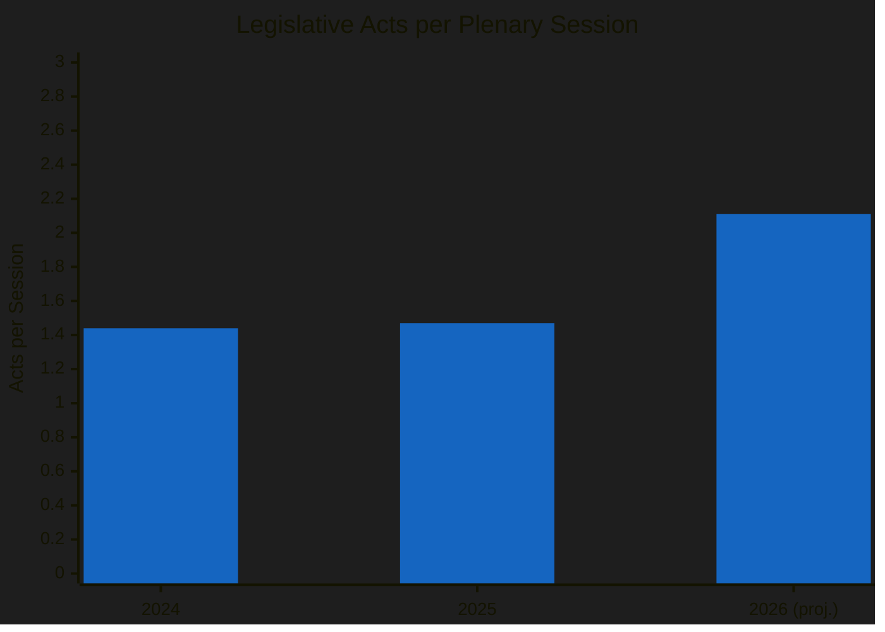
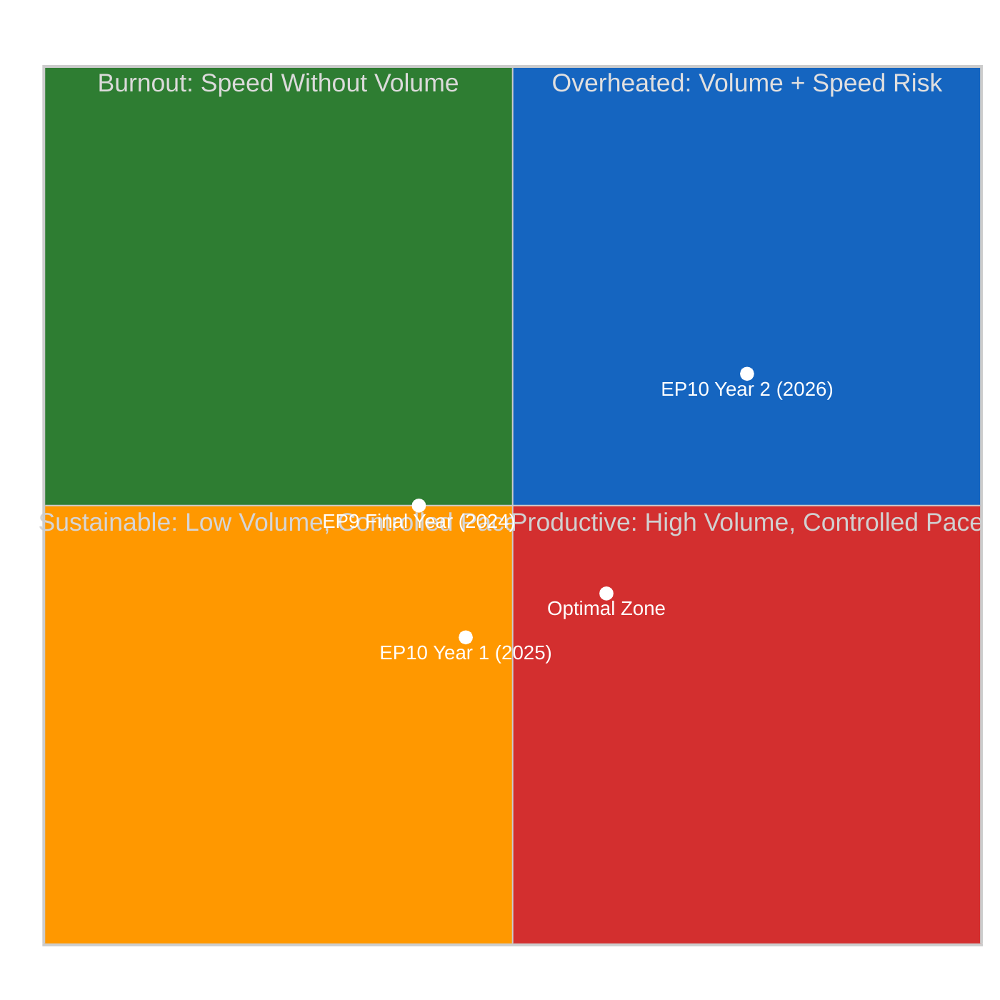

# 🏎️ Legislative Velocity Risk — EP10 Year 2 Pace Sustainability Analysis

**Date:** 6 April 2026 (Easter Monday — Midday Update) | **Confidence:** 🟡 MEDIUM
**Recess Day:** 11/18 | **Run:** breaking-3 (12:15 UTC) | **Article Type:** breaking

---

## Executive Summary

| Metric | 2024 (EP9/EP10) | 2025 (EP10 Y1) | 2026 (EP10 Y2 proj.) | Trend |
|--------|-----------------|-----------------|----------------------|-------|
| **Legislative Acts** | 72 | 78 | **114** (+46%) | ↑ Accelerating |
| **Adopted Texts** | 459 | 347 | **498** (+44%) | ↑ Accelerating |
| **Roll-Call Votes** | 375 | 420 | **567** (+35%) | ↑ Accelerating |
| **Plenary Sessions** | 50 | 53 | **54** (+2%) | → Stable |
| **Speeches** | 7,800 | 8,200 | **8,500** (+4%) | → Stable |
| **Parliamentary Questions** | 3,950 | 4,100 | **4,500** (+10%) | ↑ Moderate |

**Key Finding:** EP10 Year 2 shows a **legislative acceleration anomaly** — output is growing 35-46% year-over-year while session count remains nearly flat. This means significantly more legislative work per session, raising sustainability and quality concerns.

---

## Velocity Analysis

### Output-Per-Session Ratio

| Year | Acts | Sessions | Acts/Session | YoY Change |
|------|------|----------|-------------|------------|
| 2024 | 72 | 50 | 1.44 | — |
| 2025 | 78 | 53 | 1.47 | +2% |
| 2026 | 114 | 54 | **2.11** | **+44%** |

The acts-per-session ratio jumps 44% in 2026, suggesting either:
1. ✅ More efficient legislative processing (positive — better use of floor time)
2. ⚠️ Less deliberation time per act (risk — quality degradation)
3. ⚠️ More fast-tracked or simplified procedures (risk — democratic scrutiny gaps)

**Confidence:** 🟡 MEDIUM — the projection is based on Q1 trajectory extrapolation; actual full-year may differ.

### Velocity Risk Matrix

**Assessment:** EP10 Year 2 is trending toward the "Overheated" quadrant. The combination of high volume AND accelerating pace creates compounding risks.

---

## Risk Dimensions

### 1. Quality Risk — Scrutiny Depth per Act

**Concern:** With 2.11 acts per session (vs 1.47 in 2025), each act receives approximately 30% less average floor time for debate.

**Mitigating factors:**
- Committee-level scrutiny may compensate for reduced plenary debate
- Some acts are procedurally straightforward (consent procedures, technical updates)
- Rapporteur workload distribution across 20 committees spreads the load

**Risk Rating:** 🟡 MEDIUM — the aggregate metric masks variation between contested and consensus files.

### 2. Coalition Fatigue Risk — Negotiation Bandwidth

**Concern:** The dual-track coalition pattern requires PPE to simultaneously manage two distinct majority-building processes. At 114 acts/year, this means approximately 2-3 coalition negotiations per working week.

**Evidence:** Pre-recess sprint showed PPE successfully managing both tracks, but the pace was compressed into the final pre-recess week. Sustained year-round dual-track management at this velocity is unprecedented in EP10.

**Risk Rating:** 🟡 MEDIUM — PPE's internal coordination capacity is the binding constraint.

### 3. Rapporteur Burnout Risk

**Concern:** 114 acts spread across ~720 active MEPs means a higher rapporteur assignment frequency. Senior MEPs in key committees (ECON, ENVI, LIBE) may face overlapping assignments.

**Indicators to watch:**
- Rapporteur substitution rate in Q2 2026
- Shadow rapporteur availability
- Committee meeting cancellations or postponements

**Risk Rating:** 🔴 LOW (currently) — but escalates to MEDIUM if pace continues through Q3.

### 4. Trilogue Throughput Risk

**Concern:** Not all 114 acts require trilogue, but the proportion that does (estimated 40-60%) creates a pipeline of 45-68 trilogue files. The Council's institutional bandwidth for parallel trilogues is approximately 15-20 per quarter.

| Quarter | Estimated Trilogue Files | Council Capacity | Gap |
|---------|------------------------|------------------|-----|
| Q1 2026 | ~25 | 15-20 | ⚠️ 5-10 excess |
| Q2 2026 | ~20 | 15-20 | → At capacity |
| Q3 2026 | ~15 | 15-20 | ✅ Within capacity |
| Q4 2026 | ~8 | 15-20 | ✅ Within capacity |

**Risk Rating:** 🟡 MEDIUM — Q1-Q2 bottleneck is the primary concern; Q3-Q4 normalizes.

---

## Historical Comparison

### Velocity Benchmarks Across Parliamentary Terms

| Term | Year | Acts | Sessions | Acts/Session | Velocity Rating |
|------|------|------|----------|-------------|-----------------|
| EP7 (2012) | Mid-term | 95 | 48 | 1.98 | HIGH |
| EP8 (2017) | Mid-term | 88 | 50 | 1.76 | MODERATE |
| EP9 (2022) | Mid-term | 82 | 49 | 1.67 | MODERATE |
| EP9 (2024) | Final year | 72 | 50 | 1.44 | LOW |
| **EP10 (2026)** | **Year 2** | **114** | **54** | **2.11** | **VERY HIGH** |

**Context:** EP10 Year 2's velocity exceeds all comparable mid-term periods. The closest comparator is EP7's 2012 (1.98 acts/session) during the Eurozone crisis legislative response. Today's acceleration appears driven by:

1. **Commission White Paper agenda** — Von der Leyen II's more ambitious legislative programme
2. **Geopolitical pressure** — defence, trade, and energy files accelerated by external events
3. **PPE's dual-track efficiency** — simultaneous majority-building reduces parliamentary time per file
4. **Institutional learning** — EP10 building on EP9's procedural innovations

**Confidence:** 🟡 MEDIUM — historical comparisons are approximate (different counting methodologies across terms).

---

## Forward Projections

### Scenario 1: Sustained Acceleration (Probability: Possible, 35-45%)
- Full-year output exceeds 114 acts (reaches 120-130)
- Quality concerns emerge in Q3 as complex files face insufficient scrutiny
- Coalition fatigue becomes visible in declining roll-call participation
- MEP burnout reflected in attendance drops

### Scenario 2: Natural Deceleration (Probability: Likely, 45-55%)
- Q1 sprint was front-loaded; Q2-Q4 normalize to 78-85 acts pace
- Full-year lands at 90-100 acts — still above 2025 but more sustainable
- Trilogue pipeline absorbs some output, reducing new file introductions
- Dual-track pattern stabilizes with clearer file-type routing

### Scenario 3: External Disruption (Probability: Possible, 10-20%)
- US tariff escalation or Ukraine developments force legislative priority reset
- Emergency procedures consume floor time, crowding out scheduled acts
- Full-year output drops to 70-80 acts (below 2025)
- Grand coalition reactivated for crisis management

---

## Sources & Attribution

- **Precomputed Statistics:** EP Open Data Portal — yearly stats 2024-2026 (generated 3 March 2026)
- **Adopted Texts Feed:** 86 items from one-week fallback (confirmed 12:15 UTC, 6 April 2026)
- **Historical Benchmarks:** EP7-EP10 legislative output data (EP Open Data Portal)
- **Coalition Analysis:** Cross-session intelligence from 21+ monitoring runs
- **Velocity Calculations:** Acts/session ratio computed from precomputed statistics

---

*Analysis generated by EU Parliament Monitor breaking news pipeline — Run 3 (12:15 UTC)*
