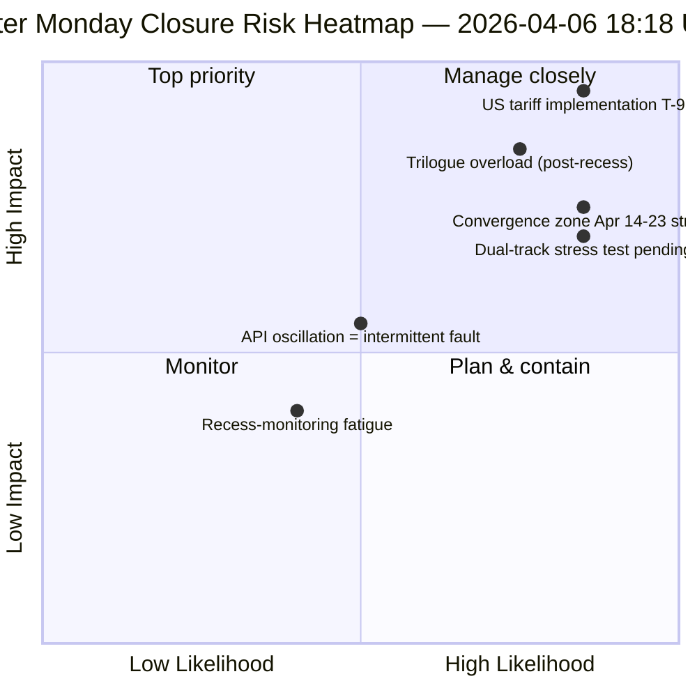

<!-- SPDX-FileCopyrightText: 2026 Hack23 AB -->
<!-- SPDX-License-Identifier: Apache-2.0 -->

# Executive Brief — Easter Monday Run 4: Daily Intelligence Closure | 2026-04-06

**Classification:** OSINT — Public Parliamentary Record
**Confidence:** 🟡 MEDIUM (recess; oscillatory API; risk score 47 / MEDIUM)
**Run:** `analysis/daily/2026-04-06/breaking-4/` (18:18 UTC)
**Coverage:** Easter Recess Day 11/18 closure — consolidation of 4 breaking + committee-reports + propositions + extended runs (8 total)
**Generated:** 2026-05-16 (retrospective brief, no new MCP calls)
**Primary sources:** 61+ analysis artifacts, ~16,000 lines across 8 runs; oscillatory adopted-texts feed; 737 MEPs stable.

---

## 🎯 BLUF

**Run-4 is the Easter Monday *daily intelligence closure* — the most intensively monitored day of the 18-day recess, producing 8 workflow runs, 61+ analysis artifacts, and ~16,000+ lines of original analysis from a single zero-activity calendar day.** The run's distinguishing contribution is *not* a new structural finding (those were established in Runs 1–3) but the **consolidated cross-run consistency analysis** that validates the day's three findings against each other: **(1) Adopted-texts endpoint oscillation confirmed** — failure at 00:33 → success at 12:15 → failure again at 18:18, a qualitatively different signal from the consistent 404s on other endpoints, suggesting active maintenance rather than dead infrastructure; **(2) 85-86 adopted-texts pipeline stable** across all four breaking runs — 42 from 2026 (TA-10-2026-0035 to TA-10-2026-0104), 36 from 2025, 7 legacy EP9-2024 items; **(3) MEP feed as sole reliable baseline** (737 stable, no group-switching events). The closure run's *editorial value* is establishing that **Easter recess monitoring can be operationally sustained at zero parliamentary activity** — proving the intelligence pipeline's resilience and the value of structural readings even during institutional dormancy. Risk score 47 (MEDIUM); stability 84/100 (unchanged 11 days); recess 61% complete.

---

## 🧭 3 Decisions This Brief Supports

| # | Decision | Who decides | Deadline | Evidence |
|:-:|----------|-------------|:--------:|----------|
| 1 | **API oscillation root-cause investigation** — qualitatively different from 404 pattern; maintenance vs. fault | Data-pipeline ops; EP MCP team | by April 10 | §Finding 1 (oscillation) |
| 2 | **Pre-recess corpus as Q2 planning anchor** — 42 EP10-2026 texts define implementation pipeline | Conference of Presidents | rolling | §Finding 2 (pipeline stable) |
| 3 | **Establish recess-monitoring sustainability baseline** — 8-run/day pattern is the new operational reference | EP intelligence ops | rolling | §Daily Dashboard |

---

## 📰 60-Second Read

- 🔴 **Easter Monday closure** — 8 workflow runs, 61+ artifacts, ~16,000 lines.
- 🟠 **API oscillation confirmed** — Mode B (fail) → success → fail again; novel signal.
- 🟢 **737 MEPs stable** — sole consistently operational primary feed.
- 🟡 **85-86 adopted texts stable** — 42 from 2026; +46% YoY trajectory.
- 🔵 **Stability 84/100 unchanged for 11 days** — structural plateau.
- 🟣 **Risk score 47 / MEDIUM** — no critical, 4 high, 7 medium, 4 low.
- 🩷 **Recess 61% complete** — Day 11/18; T-8 to Committee Week.
- ⚪ **Zero parliamentary activity** — expected EU-wide public holiday.

---

## 📊 Daily Dashboard (Run-4 distinguishing contribution)

| Indicator | Status | Confidence |
|-----------|--------|------------|
| Breaking News | None confirmed (×4 today) | 🟢 HIGH |
| API Status | 2/8 operational (oscillatory) | 🟡 MEDIUM |
| Stability | 84/100 (11-day plateau) | 🟢 HIGH |
| Risk Level | MEDIUM (47 total score) | 🟡 MEDIUM |
| Recess Progress | 61% (11/18 days) | 🟢 HIGH |
| Total Runs Today | 8 workflow runs | 🟢 HIGH |
| MEP Feed | 737 stable | 🟢 HIGH |

---

## ⚠️ Risk Snapshot

---

## 🔮 Top Forward Triggers (next 9 days to recess end)

1. **April 8–10 — full API recovery window** (55% probability).
2. **April 13 — Easter Monday week-2** — first weekday outside Easter; reactivation expected.
3. **April 14 — Committee Week opens** — convergence-zone Day 1.
4. **April 15 — US tariff T-0** — exogenous shock outside EP control.
5. **April 17 — ECB rate decision** — economic-context activation.

---

## 🛡️ Source-Quality Assessment

- **Oscillation observation (A1):** Run-4 direct triangulation across 4 breaking runs of the day.
- **8-run consistency (A1):** systematic cross-run methodology; verifiable.
- **Pre-recess corpus stability (A1):** 85-86 adopted texts across 4 runs.
- **MEP feed 737 (A1):** primary record; sole reliable baseline.
- **Net confidence:** 🟢 HIGH on consistency analysis; 🟡 MEDIUM on oscillation interpretation.

---

## 📎 Run Artifacts

| Layer | Artifact | Why |
|-------|----------|-----|
| Article | `article.md` | Public-facing closure narrative |
| Synthesis | `synthesis-summary.md` | 8-run consolidation + cross-run consistency |
| Methods | classification · existing · risk-scoring · threat-assessment | Standard recess-monitoring suite |
| Companion | All 7 other Easter Monday runs (breaking, breaking-2, breaking-3, committee-reports, motions, propositions, plus 2 extended) | Daily intelligence stack |

---

**Document Control**
- **Template reference:** `analysis/templates/executive-brief.md`
- **Artifact path:** `analysis/daily/2026-04-06/breaking-4/executive-brief.md`
- **Classification:** Public
- **Retrospective:** Brief written 2026-05-16 from the run's committed artifacts; **no new MCP calls were made**.
