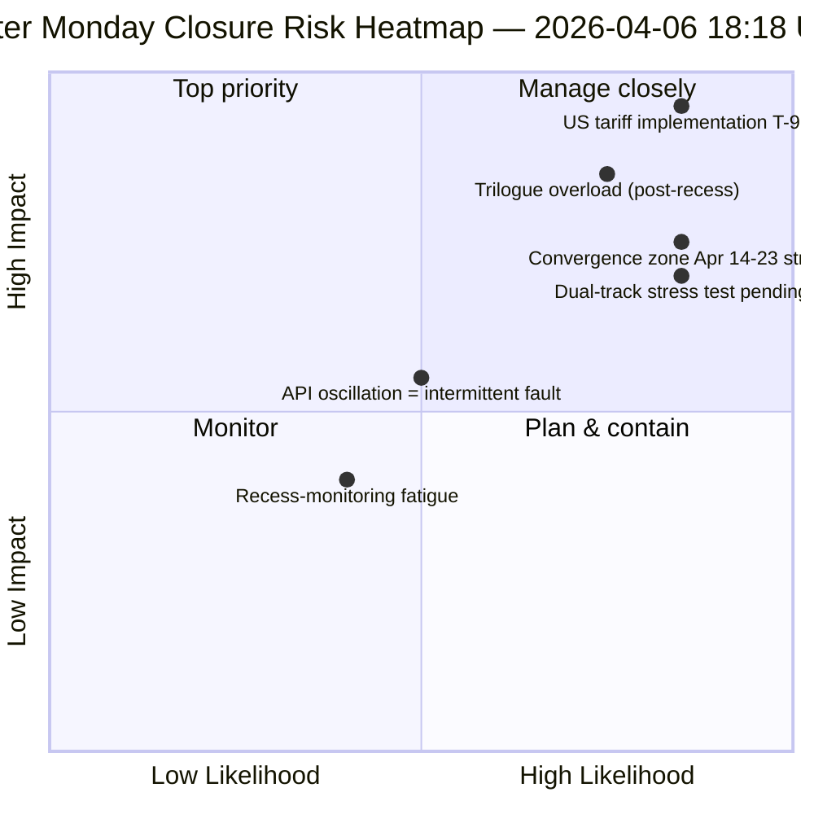

<!-- SPDX-FileCopyrightText: 2026 Hack23 AB -->
<!-- SPDX-License-Identifier: Apache-2.0 -->

# الملخص التنفيذي — جلسة اثنين عيد الفصح الرابعة: الإغلاق اليومي للاستخبارات | 2026-04-06

**التصنيف:** OSINT — السجل البرلماني العام
**الثقة:** 🟡 MEDIUM (استراحة؛ API متذبذب؛ نقاط المخاطرة 47 / MEDIUM)
**الجلسة:** `analysis/daily/2026-04-06/breaking-4/` (18:18 UTC)
**التغطية:** استراحة عيد الفصح اليوم 11/18 الإغلاق — توحيد 4 breaking + committee-reports + propositions + جلسات موسعة (8 إجمالاً)
**تاريخ الإنشاء:** 2026-05-16 (ملخص استعادي، دون استدعاءات MCP جديدة)
**المصادر الأولية:** أكثر من 61 حافظة تحليلية، ~16,000 سطر في 8 جلسات؛ تغذية adopted-texts متذبذبة؛ 737 عضواً مستقرون.

---

## 🎯 الخلاصة الفورية (BLUF)

**الجلسة 4 هي *الإغلاق اليومي للاستخبارات* ليوم اثنين عيد الفصح — أكثر أيام الاستراحة التي مدتها 18 يوماً مراقبةً، إذ أنتجت 8 جلسات سير عمل، وأكثر من 61 حافظة تحليلية، و~16,000+ سطر من التحليل الأصلي في يوم تقويمي واحد دون أي نشاط برلماني.** الإسهام المميز لهذه الجلسة ليس *اكتشافاً* هيكلياً جديداً (تم إرساء هذه الاكتشافات في الجلسات 1–3) بل **تحليل الاتساق المُوحَّد عبر الجلسات** الذي يُصادِق الاكتشافات الثلاثة لليوم ويُقيِّم كلاً منها في ضوء الأخرى: **(1) تأكيد تذبذب نقطة نهاية adopted-texts** — فشل 00:33 ← نجاح 12:15 ← فشل مجدداً 18:18، إشارة مغايرة نوعياً للأخطاء 404 المتواصلة على نقاط نهاية أخرى، مما يوحي بصيانة نشطة لا بنية تحتية متعطلة؛ **(2) استقرار مسار 85–86 adopted-texts** عبر جميع جلسات breaking الأربع — 42 من عام 2026 (TA-10-2026-0035 إلى TA-10-2026-0104)، 36 من عام 2025، 7 بنود إرثية EP9-2024؛ **(3) تغذية أعضاء البرلمان الأوروبي بوصفها الخط الأساسي الموثوق الوحيد** (737 مستقراً، لا أحداث تغيير مجموعات). *القيمة التحريرية* لجلسة الإغلاق هي إثبات أن **مراقبة فترة الاستراحة يمكن الحفاظ عليها تشغيلياً بنشاط برلماني صفري** — مما يُثبت مرونة مسار الاستخبارات وقيمة القراءات الهيكلية حتى في أوقات الخمول المؤسسي. نقاط المخاطرة 47 (MEDIUM)؛ الاستقرار 84/100 (دون تغيير 11 يوماً)؛ الاستراحة مكتملة 61%.

---

## 🧭 3 قرارات يدعمها هذا الملخص

| # | القرار | من يقرر | الموعد النهائي | الأدلة |
|:-:|--------|---------|:-------------:|--------|
| 1 | **التحقيق في السبب الجذري لتذبذب API** — مغاير نوعياً لنمط 404؛ صيانة مقابل عطل | عمليات مسار البيانات؛ فريق EP MCP | قبل 10 أبريل | §الاكتشاف 1 (التذبذب) |
| 2 | **مجموعة ما قبل الاستراحة كمرساة تخطيط الربع الثاني** — 42 نصاً EP10-2026 تحدد مسار التنفيذ | مؤتمر الرؤساء | متجدد | §الاكتشاف 2 (المسار مستقر) |
| 3 | **تأسيس خط أساسي لاستدامة مراقبة الاستراحة** — نمط 8 جلسات/يوم هو المرجع التشغيلي الجديد | عمليات استخبارات البرلمان الأوروبي | متجدد | §لوحة المعلومات اليومية |

---

## 📰 القراءة في 60 ثانية

- 🔴 **إغلاق اثنين عيد الفصح** — 8 جلسات سير عمل، أكثر من 61 حافظة، ~16,000 سطر.
- 🟠 **تذبذب API مؤكَّد** — النمط B (فشل) ← نجاح ← فشل مجدداً؛ إشارة جديدة.
- 🟢 **737 عضواً مستقرون** — التغذية الأولية الوحيدة التي تعمل باستمرار.
- 🟡 **85–86 نصاً مُعتمَداً مستقرون** — 42 من 2026؛ مسار +46% سنوياً.
- 🔵 **الاستقرار 84/100 دون تغيير 11 يوماً** — هضبة هيكلية.
- 🟣 **نقاط المخاطرة 47 / MEDIUM** — لا حرجة، 4 عالية، 7 متوسطة، 4 منخفضة.
- 🩷 **الاستراحة مكتملة 61%** — اليوم 11/18؛ T-8 حتى أسبوع اللجان.
- ⚪ **نشاط برلماني صفري** — عطلة رسمية أوروبية متوقعة.

---

## 📊 لوحة المعلومات اليومية (الإسهام المميز لجلسة 4)

| المؤشر | الحالة | الثقة |
|--------|--------|-------|
| الأخبار العاجلة | لا مؤكَّدة (×4 اليوم) | 🟢 HIGH |
| حالة API | 2/8 تعمل (متذبذبة) | 🟡 MEDIUM |
| الاستقرار | 84/100 (هضبة 11 يوماً) | 🟢 HIGH |
| مستوى المخاطرة | MEDIUM (47 إجمالاً) | 🟡 MEDIUM |
| تقدم الاستراحة | 61% (11/18 يوماً) | 🟢 HIGH |
| إجمالي جلسات اليوم | 8 جلسات سير عمل | 🟢 HIGH |
| تغذية الأعضاء | 737 مستقرون | 🟢 HIGH |

---

## ⚠️ لقطة المخاطر

---

## 🔮 أبرز المحفزات المستقبلية (9 أيام القادمة حتى نهاية الاستراحة)

1. **8–10 أبريل — نافذة استعادة كاملة لـ API** (احتمال 55%).
2. **13 أبريل — اثنين عيد الفصح الأسبوع 2** — أول يوم عمل خارج عيد الفصح؛ إعادة التشغيل متوقعة.
3. **14 أبريل — افتتاح أسبوع اللجان** — اليوم 1 من منطقة التقارب.
4. **15 أبريل — رسوم أمريكية T-0** — صدمة خارجية خارج سيطرة البرلمان الأوروبي.
5. **17 أبريل — قرار أسعار الفائدة للبنك المركزي الأوروبي** — تفعيل السياق الاقتصادي.

---

## 🛡️ تقييم جودة المصادر

- **ملاحظة التذبذب (A1):** تثليث مباشر للجلسة 4 عبر 4 جلسات breaking في نفس اليوم.
- **اتساق 8 جلسات (A1):** منهجية منهجية عبر الجلسات؛ قابلة للتحقق.
- **استقرار مجموعة ما قبل الاستراحة (A1):** 85–86 نصاً مُعتمَداً في 4 جلسات.
- **تغذية الأعضاء 737 (A1):** السجل الأولي؛ الخط الأساسي الموثوق الوحيد.
- **الثقة الصافية:** 🟢 HIGH لتحليل الاتساق؛ 🟡 MEDIUM لتفسير التذبذب.

---

## 📎 حافظات الجلسة

| الطبقة | الحافظة | السبب |
|--------|---------|-------|
| المقال | `article.md` | السرد العام للإغلاق |
| التوليف | `synthesis-summary.md` | توحيد 8 جلسات + اتساق عبر الجلسات |
| المنهجيات | classification · existing · risk-scoring · threat-assessment | مجموعة مراقبة الاستراحة القياسية |
| المرافق | جميع جلسات اثنين عيد الفصح السبع الأخرى (breaking, breaking-2, breaking-3, committee-reports, motions, propositions, plus 2 extended) | مكدس الاستخبارات اليومي |

---

**ضبط الوثيقة**
- **مرجع القالب:** `analysis/templates/executive-brief.md`
- **مسار الحافظة:** `analysis/daily/2026-04-06/breaking-4/executive-brief.md`
- **التصنيف:** عام
- **استعادي:** كُتب الملخص في 2026-05-16 من الحافظات المُؤكَّدة للجلسة؛ **لم تُجرَ أي استدعاءات MCP جديدة**.
