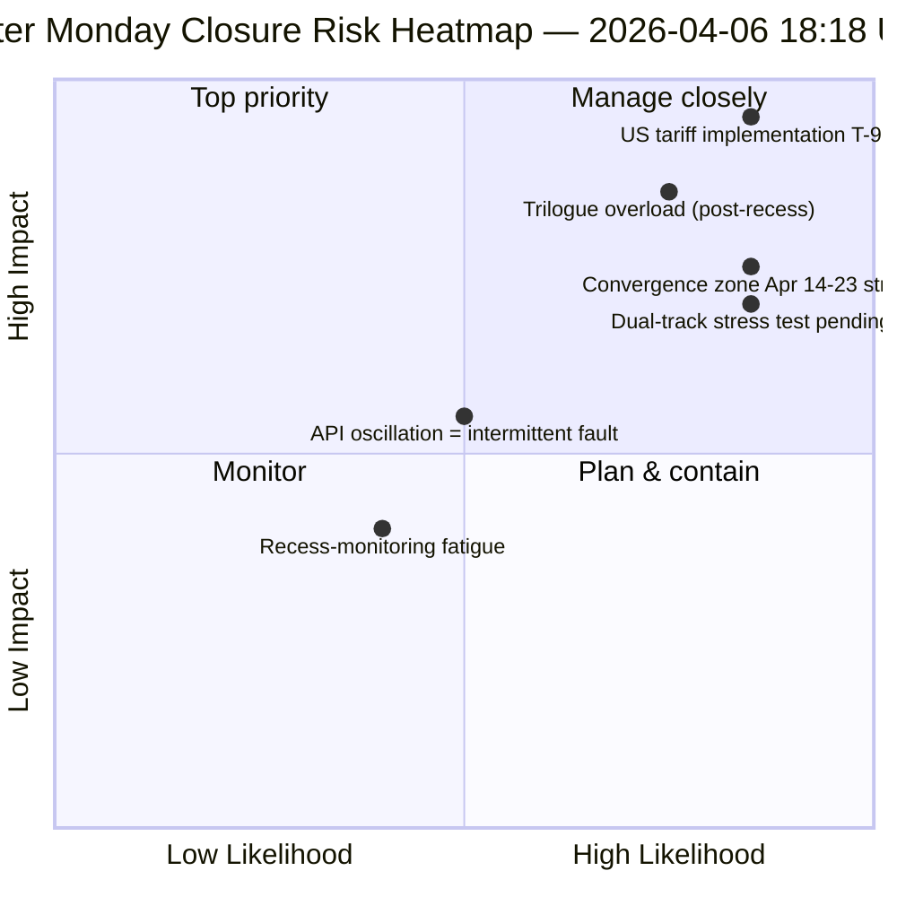

<!-- SPDX-FileCopyrightText: 2026 Hack23 AB -->
<!-- SPDX-License-Identifier: Apache-2.0 -->

# Eksekutiv Briefing — Påskemandag Kørsel 4: Daglig Efterretningsluksel | 2026-04-06

**Klassificering:** OSINT — Offentlig parlamentarisk rekord
**Tillid:** 🟡 MEDIUM (pause; oscillerende API; risikoscore 47 / MEDIUM)
**Kørsel:** `analysis/daily/2026-04-06/breaking-4/` (18:18 UTC)
**Dækning:** Påskepause dag 11/18 lukning — konsolidering af 4 breaking + committee-reports + propositions + udvidede kørsel (8 i alt)
**Genereret:** 2026-05-16 (retrospektiv brief, ingen nye MCP-kald)
**Primære kilder:** 61+ analyseartefakter, ~16.000 linjer på tværs af 8 kørsel; oscillerende adopted-texts-feed; 737 MEP'er stabile.

---

## 🎯 BLUF

**Kørsel 4 er påskemandagens *daglige efterretningsluksel* — den mest intensivt overvågede dag i 18-dages pausen, med 8 workflowkørsler, 61+ analyseartefakter og ~16.000+ linjer original analyse fra én enkelt kalenderdag uden parlamentarisk aktivitet.** Kørslens afgørende bidrag er *ikke* et nyt strukturelt fund (disse blev fastslået i kørsel 1–3), men den **konsoliderede krydskørselsanalyse**, der validerer dagens tre fund mod hinanden: **(1) Oscillation i adopted-texts-endpoint bekræftet** — fejl 00:33 → succes 12:15 → fejl igen 18:18, et kvalitativt anderledes signal end konsekvente 404-fejl på andre endpoints, hvilket tyder på aktiv vedligeholdelse snarere end dødlagt infrastruktur; **(2) 85–86 adopted-texts pipeline stabil** på tværs af alle fire breaking-kørsler — 42 fra 2026 (TA-10-2026-0035 til TA-10-2026-0104), 36 fra 2025, 7 ældre EP9-2024 poster; **(3) MEP-feed som eneste pålidelige basislinje** (737 stabile, ingen grupperingsskift). Lukkekørslens *redaktionelle værdi* er at fastslå, at **pauseovervågning kan opretholdes operationelt ved nul parlamentarisk aktivitet** — hvilket beviser efterretningspipelinen ens resiliens og værdien af strukturelle aflæsninger selv under institutionel dvale. Risikoscore 47 (MEDIUM); stabilitet 84/100 (uændret i 11 dage); pause 61% gennemført.

---

## 🧭 3 Beslutninger, denne brief understøtter

| # | Beslutning | Hvem bestemmer | Frist | Bevis |
|:-:|------------|----------------|:-----:|-------|
| 1 | **Rodårsagsundersøgelse af API-oscillation** — kvalitativt anderledes end 404-mønstret; vedligeholdelse vs. fejl | Data-pipeline ops; EP MCP-team | inden 10. april | §Fund 1 (oscillation) |
| 2 | **Pre-pause-korpus som Q2-planlægningsanker** — 42 EP10-2026 tekster definerer implementeringspipeline | Formandskabskonferencen | løbende | §Fund 2 (pipeline stabil) |
| 3 | **Etabler bæredygtighedsbasislinje for pauseovervågning** — 8-kørsel/dag-mønstret er den nye operationelle reference | EP efterretningsops | løbende | §Dagligt Dashboard |

---

## 📰 60-Sekunders Læsning

- 🔴 **Påskemandag lukning** — 8 workflowkørsler, 61+ artefakter, ~16.000 linjer.
- 🟠 **API-oscillation bekræftet** — Tilstand B (fejl) → succes → fejl igen; nyt signal.
- 🟢 **737 MEP'er stabile** — eneste konsekvent operationelt primærfeed.
- 🟡 **85–86 vedtagne tekster stabile** — 42 fra 2026; +46% ÅtÅ-udvikling.
- 🔵 **Stabilitet 84/100 uændret i 11 dage** — strukturelt plateau.
- 🟣 **Risikoscore 47 / MEDIUM** — ingen kritiske, 4 høje, 7 middel, 4 lave.
- 🩷 **Pause 61% gennemført** — Dag 11/18; T-8 til udvalgsuge.
- ⚪ **Nul parlamentarisk aktivitet** — forventet EU-dækkende helligdag.

---

## 📊 Dagligt Dashboard (Kørsel 4s særskilte bidrag)

| Indikator | Status | Tillid |
|-----------|--------|--------|
| Breaking News | Ingen bekræftet (×4 i dag) | 🟢 HIGH |
| API-status | 2/8 operative (oscillerende) | 🟡 MEDIUM |
| Stabilitet | 84/100 (11-dages plateau) | 🟢 HIGH |
| Risikoniveau | MEDIUM (47 totalt) | 🟡 MEDIUM |
| Pausefremgang | 61% (11/18 dage) | 🟢 HIGH |
| Samlede kørsler i dag | 8 workflowkørsler | 🟢 HIGH |
| MEP-feed | 737 stabile | 🟢 HIGH |

---

## ⚠️ Risikooverblik

---

## 🔮 Top Fremadrettede Udløsere (næste 9 dage til pausens afslutning)

1. **8.–10. april — fuldt API-gendannelsesvindue** (55% sandsynlighed).
2. **13. april — Påskemandag uge 2** — første hverdag uden for påsken; reaktivering forventet.
3. **14. april — Udvalgsuge åbner** — konvergenszone dag 1.
4. **15. april — US-told T-0** — eksogen chok uden for EP's kontrol.
5. **17. april — ECB-rentebeslutning** — aktivering af økonomisk kontekst.

---

## 🛡️ Kildekvalitetsvurdering

- **Oscillationsobservation (A1):** Kørsel 4 direkte triangulering på tværs af 4 breaking-kørsler fra dagen.
- **8-kørsel konsistens (A1):** systematisk krydskørselsmetodik; verificerbar.
- **Pre-pause-korpusstabilitet (A1):** 85–86 vedtagne tekster på tværs af 4 kørsler.
- **MEP-feed 737 (A1):** primærpost; eneste pålidelige basislinje.
- **Nettotillid:** 🟢 HIGH for konsistensanalyse; 🟡 MEDIUM for oscillationstolkning.

---

## 📎 Kørselaartefakter

| Lag | Artefakt | Hvorfor |
|-----|----------|---------|
| Artikel | `article.md` | Offentlig lukkefortælling |
| Syntese | `synthesis-summary.md` | 8-kørsel konsolidering + krydskørsels-konsistens |
| Metoder | classification · existing · risk-scoring · threat-assessment | Standard pauseovervågningssuite |
| Ledsager | Alle 7 andre påskemandagskørsler (breaking, breaking-2, breaking-3, committee-reports, motions, propositions, plus 2 extended) | Daglig efterretningsstak |

---

**Dokumentkontrol**
- **Skabelonreference:** `analysis/templates/executive-brief.md`
- **Artefaktsti:** `analysis/daily/2026-04-06/breaking-4/executive-brief.md`
- **Klassificering:** Offentlig
- **Retrospektiv:** Brief skrevet 2026-05-16 fra kørslens committede artefakter; **ingen nye MCP-kald blev foretaget**.
