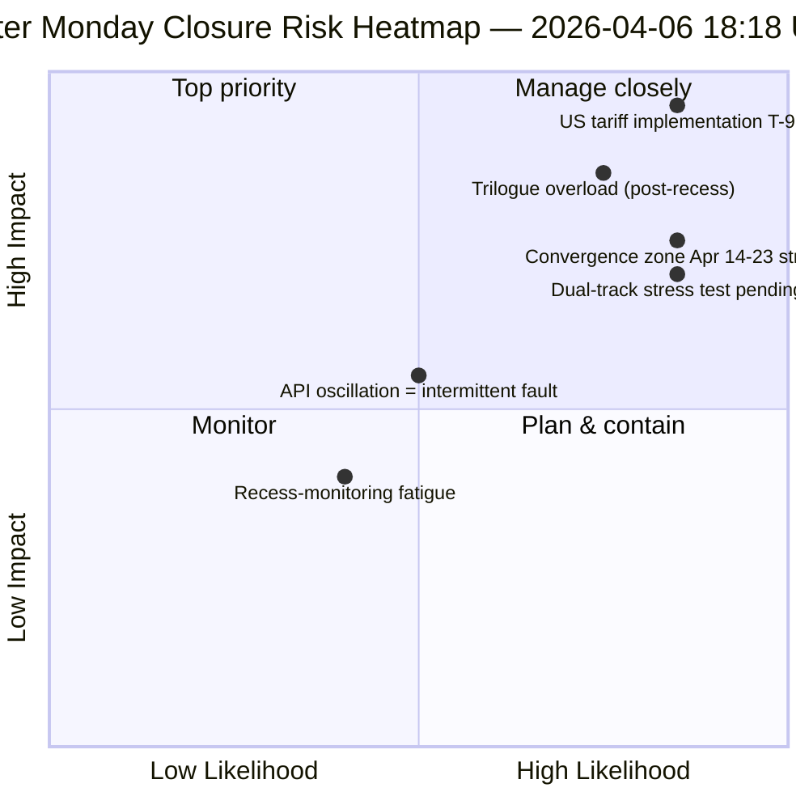

<!-- SPDX-FileCopyrightText: 2026 Hack23 AB -->
<!-- SPDX-License-Identifier: Apache-2.0 -->

# Exekutive Zusammenfassung — Ostermontag Lauf 4: Täglicher Geheimdienstabschluss | 2026-04-06

**Klassifizierung:** OSINT — Öffentliche parlamentarische Aufzeichnungen
**Konfidenz:** 🟡 MEDIUM (Pause; oszillierendes API; Risikopunktzahl 47 / MEDIUM)
**Lauf:** `analysis/daily/2026-04-06/breaking-4/` (18:18 UTC)
**Abdeckung:** Osterpause Tag 11/18 Abschluss — Konsolidierung von 4 Breaking + Committee-Reports + Propositions + erweiterte Läufe (8 insgesamt)
**Erstellt:** 2026-05-16 (retrospektive Zusammenfassung, keine neuen MCP-Aufrufe)
**Primärquellen:** 61+ Analyseartefakte, ~16.000 Zeilen über 8 Läufe; oszillierender Adopted-Texts-Feed; 737 MdEPs stabil.

---

## 🎯 BLUF

**Lauf 4 ist der *tägliche Geheimdienstabschluss* des Ostermontags — der intensivst überwachte Tag der 18-tägigen Pause, mit 8 Workflow-Läufen, 61+ Analyseartefakten und ~16.000+ Zeilen Originalanalyse an einem einzigen parlamentarisch inaktiven Kalendertag.** Der auszeichnende Beitrag des Laufs ist *kein* neuer struktureller Befund (diese wurden in den Läufen 1–3 festgestellt), sondern die **konsolidierte Querläufe-Konsistenzanalyse**, die die drei Tagesbefunde gegenseitig validiert: **(1) Oszillation des Adopted-Texts-Endpunkts bestätigt** — Fehler 00:33 → Erfolg 12:15 → Fehler wieder 18:18, ein qualitativ anderes Signal als konsistente 404-Fehler bei anderen Endpunkten, was auf aktive Wartung statt toter Infrastruktur hindeutet; **(2) 85–86 Adopted-Texts-Pipeline stabil** über alle vier Breaking-Läufe — 42 aus 2026 (TA-10-2026-0035 bis TA-10-2026-0104), 36 aus 2025, 7 ältere EP9-2024-Einträge; **(3) MdEP-Feed als einzige zuverlässige Basislinie** (737 stabil, keine Gruppenwechsel-Ereignisse). Der redaktionelle Wert des Abschlusslaufs besteht darin festzustellen, dass **Pausenüberwachung operativ bei null parlamentarischer Aktivität aufrechterhalten werden kann** — was die Resilienz der Geheimdienstpipeline und den Wert struktureller Messwerte selbst während institutioneller Ruhephasen belegt. Risikopunktzahl 47 (MEDIUM); Stabilität 84/100 (unverändert seit 11 Tagen); Pause 61% abgeschlossen.

---

## 🧭 3 Entscheidungen, die diese Zusammenfassung unterstützt

| # | Entscheidung | Wer entscheidet | Frist | Belege |
|:-:|--------------|-----------------|:-----:|--------|
| 1 | **Ursachenuntersuchung zur API-Oszillation** — qualitativ anderes als 404-Muster; Wartung vs. Fehler | Data-Pipeline-Ops; EP MCP-Team | bis 10. April | §Befund 1 (Oszillation) |
| 2 | **Vorpausen-Korpus als Q2-Planungsanker** — 42 EP10-2026-Texte definieren Implementierungspipeline | Konferenz der Präsidenten | laufend | §Befund 2 (Pipeline stabil) |
| 3 | **Nachhaltigkeitsbasislinie für Pausenüberwachung etablieren** — 8-Läufe/Tag-Muster ist neue operative Referenz | EP-Geheimdienstops | laufend | §Tages-Dashboard |

---

## 📰 60-Sekunden-Lesepause

- 🔴 **Ostermontag-Abschluss** — 8 Workflow-Läufe, 61+ Artefakte, ~16.000 Zeilen.
- 🟠 **API-Oszillation bestätigt** — Modus B (Fehler) → Erfolg → Fehler wieder; neuartiges Signal.
- 🟢 **737 MdEPs stabil** — einziger konsistent operativer Primärfeed.
- 🟡 **85–86 angenommene Texte stabil** — 42 aus 2026; +46% JzJ-Entwicklung.
- 🔵 **Stabilität 84/100 seit 11 Tagen unverändert** — strukturelles Plateau.
- 🟣 **Risikopunktzahl 47 / MEDIUM** — keine kritischen, 4 hohe, 7 mittlere, 4 niedrige.
- 🩷 **Pause 61% abgeschlossen** — Tag 11/18; T-8 bis Ausschusswoche.
- ⚪ **Null parlamentarische Aktivität** — erwarteter EU-weiter Feiertag.

---

## 📊 Tages-Dashboard (Auszeichnender Beitrag von Lauf 4)

| Indikator | Status | Konfidenz |
|-----------|--------|-----------|
| Breaking News | Keine bestätigt (×4 heute) | 🟢 HIGH |
| API-Status | 2/8 operativ (oszillierend) | 🟡 MEDIUM |
| Stabilität | 84/100 (11-Tage-Plateau) | 🟢 HIGH |
| Risikoniveau | MEDIUM (47 insgesamt) | 🟡 MEDIUM |
| Pausenfortschritt | 61% (11/18 Tage) | 🟢 HIGH |
| Gesamtläufe heute | 8 Workflow-Läufe | 🟢 HIGH |
| MdEP-Feed | 737 stabil | 🟢 HIGH |

---

## ⚠️ Risikoübersicht

---

## 🔮 Top Vorausschauende Auslöser (nächste 9 Tage bis Pausenende)

1. **8.–10. April — volles API-Wiederherstellungsfenster** (55% Wahrscheinlichkeit).
2. **13. April — Ostermontag Woche 2** — erster Werktag außerhalb Osterns; Reaktivierung erwartet.
3. **14. April — Ausschusswoche beginnt** — Konvergenzzone Tag 1.
4. **15. April — US-Zölle T-0** — exogener Schock außerhalb EP-Kontrolle.
5. **17. April — EZB-Zinsentscheidung** — Aktivierung des wirtschaftlichen Kontexts.

---

## 🛡️ Quellenqualitätsbewertung

- **Oszillationsbeobachtung (A1):** Lauf 4 direkte Triangulation über 4 Breaking-Läufe des Tages.
- **8-Läufe-Konsistenz (A1):** systematische Querläufe-Methodik; verifizierbar.
- **Vorpausen-Korpusstabilität (A1):** 85–86 angenommene Texte über 4 Läufe.
- **MdEP-Feed 737 (A1):** Primäraufzeichnung; einzige zuverlässige Basislinie.
- **Netto-Konfidenz:** 🟢 HIGH für Konsistenzanalyse; 🟡 MEDIUM für Oszillationsinterpretation.

---

## 📎 Laufartefakte

| Ebene | Artefakt | Warum |
|-------|----------|-------|
| Artikel | `article.md` | Öffentliche Abschlusserzählung |
| Synthese | `synthesis-summary.md` | 8-Läufe-Konsolidierung + Querläufe-Konsistenz |
| Methoden | classification · existing · risk-scoring · threat-assessment | Standard-Pausenüberwachungspaket |
| Begleiter | Alle 7 anderen Ostermontag-Läufe (breaking, breaking-2, breaking-3, committee-reports, motions, propositions, plus 2 extended) | Täglicher Geheimdienststapel |

---

**Dokumentenkontrolle**
- **Vorlagenreferenz:** `analysis/templates/executive-brief.md`
- **Artefaktpfad:** `analysis/daily/2026-04-06/breaking-4/executive-brief.md`
- **Klassifizierung:** Öffentlich
- **Retrospektiv:** Zusammenfassung am 2026-05-16 aus den committed Artefakten des Laufs erstellt; **keine neuen MCP-Aufrufe wurden gemacht**.
