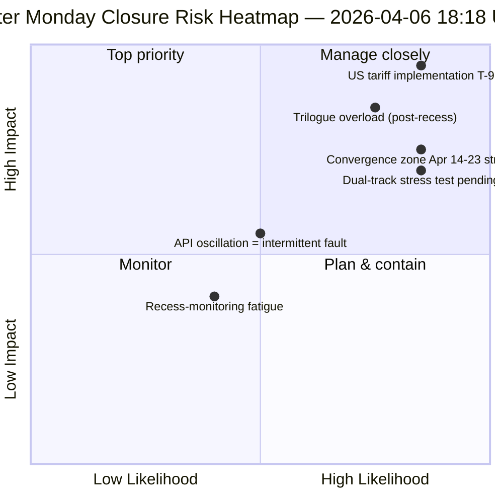

<!-- SPDX-FileCopyrightText: 2026 Hack23 AB -->
<!-- SPDX-License-Identifier: Apache-2.0 -->

# Resumen Ejecutivo — Lunes de Pascua Ejecución 4: Cierre Diario de Inteligencia | 2026-04-06

**Clasificación:** OSINT — Registro parlamentario público
**Confianza:** 🟡 MEDIUM (receso; API oscilatorio; puntuación de riesgo 47 / MEDIUM)
**Ejecución:** `analysis/daily/2026-04-06/breaking-4/` (18:18 UTC)
**Cobertura:** Receso de Pascua día 11/18 cierre — consolidación de 4 breaking + committee-reports + propositions + ejecuciones extendidas (8 en total)
**Generado:** 2026-05-16 (informe retrospectivo, sin nuevas llamadas MCP)
**Fuentes primarias:** 61+ artefactos de análisis, ~16.000 líneas en 8 ejecuciones; feed adopted-texts oscilatorio; 737 eurodiputados estables.

---

## 🎯 BLUF

**La ejecución 4 es el *cierre diario de inteligencia* del lunes de Pascua — el día más intensamente monitoreado de los 18 días de receso, produciendo 8 ejecuciones de flujo de trabajo, 61+ artefactos de análisis y ~16.000+ líneas de análisis original en un único día de calendario sin actividad parlamentaria.** La contribución distintiva de la ejecución no es *un nuevo* hallazgo estructural (estos se establecieron en las ejecuciones 1–3) sino el **análisis consolidado de consistencia entre ejecuciones** que valida los tres hallazgos del día entre sí: **(1) Oscilación del endpoint adopted-texts confirmada** — fallo 00:33 → éxito 12:15 → fallo nuevamente 18:18, una señal cualitativamente diferente a los errores 404 consistentes en otros endpoints, lo que sugiere mantenimiento activo en lugar de infraestructura muerta; **(2) Pipeline de 85–86 adopted-texts estable** en las cuatro ejecuciones breaking — 42 de 2026 (TA-10-2026-0035 a TA-10-2026-0104), 36 de 2025, 7 elementos heredados EP9-2024; **(3) Feed de eurodiputados como única línea de base confiable** (737 estables, sin eventos de cambio de grupo). El *valor editorial* de la ejecución de cierre es establecer que **la monitorización del receso puede mantenerse operativamente con cero actividad parlamentaria** — demostrando la resiliencia del pipeline de inteligencia y el valor de las lecturas estructurales incluso durante la dormancia institucional. Puntuación de riesgo 47 (MEDIUM); estabilidad 84/100 (sin cambios durante 11 días); receso 61% completado.

---

## 🧭 3 Decisiones que este informe respalda

| # | Decisión | Quién decide | Plazo | Evidencias |
|:-:|----------|--------------|:-----:|------------|
| 1 | **Investigación de causa raíz de la oscilación API** — cualitativamente diferente del patrón 404; mantenimiento vs. fallo | Ops data-pipeline; equipo EP MCP | antes del 10 de abril | §Hallazgo 1 (oscilación) |
| 2 | **Corpus previo al receso como ancla de planificación Q2** — 42 textos EP10-2026 definen el pipeline de implementación | Conferencia de Presidentes | continuo | §Hallazgo 2 (pipeline estable) |
| 3 | **Establecer línea de base de sostenibilidad para monitorización del receso** — el patrón de 8 ejecuciones/día es la nueva referencia operativa | Ops inteligencia EP | continuo | §Panel diario |

---

## 📰 Lectura de 60 Segundos

- 🔴 **Cierre del lunes de Pascua** — 8 ejecuciones de flujo de trabajo, 61+ artefactos, ~16.000 líneas.
- 🟠 **Oscilación API confirmada** — Modo B (fallo) → éxito → fallo nuevamente; señal novedosa.
- 🟢 **737 eurodiputados estables** — único feed primario consistentemente operativo.
- 🟡 **85–86 textos adoptados estables** — 42 de 2026; trayectoria +46% YoY.
- 🔵 **Estabilidad 84/100 sin cambios durante 11 días** — meseta estructural.
- 🟣 **Puntuación de riesgo 47 / MEDIUM** — ninguno crítico, 4 altos, 7 medios, 4 bajos.
- 🩷 **Receso 61% completado** — Día 11/18; T-8 hasta la semana de comisiones.
- ⚪ **Cero actividad parlamentaria** — festivo europeo esperado.

---

## 📊 Panel Diario (Contribución distintiva de la ejecución 4)

| Indicador | Estado | Confianza |
|-----------|--------|-----------|
| Noticias urgentes | Ninguna confirmada (×4 hoy) | 🟢 HIGH |
| Estado API | 2/8 operativos (oscilatorio) | 🟡 MEDIUM |
| Estabilidad | 84/100 (meseta de 11 días) | 🟢 HIGH |
| Nivel de riesgo | MEDIUM (47 en total) | 🟡 MEDIUM |
| Progreso del receso | 61% (11/18 días) | 🟢 HIGH |
| Total ejecuciones hoy | 8 ejecuciones de flujo de trabajo | 🟢 HIGH |
| Feed eurodiputados | 737 estables | 🟢 HIGH |

---

## ⚠️ Instantánea de Riesgos

---

## 🔮 Principales Desencadenantes Prospectivos (próximos 9 días hasta el final del receso)

1. **8–10 de abril — ventana completa de recuperación API** (55% de probabilidad).
2. **13 de abril — Lunes de Pascua semana 2** — primer día laborable fuera de Pascua; reactivación esperada.
3. **14 de abril — Semana de comisiones se abre** — zona de convergencia día 1.
4. **15 de abril — Aranceles de EE. UU. T-0** — choque exógeno fuera del control del PE.
5. **17 de abril — Decisión de tipos del BCE** — activación del contexto económico.

---

## 🛡️ Evaluación de la Calidad de las Fuentes

- **Observación de oscilación (A1):** Triangulación directa de la ejecución 4 a través de 4 ejecuciones breaking del día.
- **Consistencia en 8 ejecuciones (A1):** metodología sistemática entre ejecuciones; verificable.
- **Estabilidad del corpus previo al receso (A1):** 85–86 textos adoptados en 4 ejecuciones.
- **Feed eurodiputados 737 (A1):** registro primario; única línea de base confiable.
- **Confianza neta:** 🟢 HIGH para el análisis de consistencia; 🟡 MEDIUM para la interpretación de la oscilación.

---

## 📎 Artefactos de la Ejecución

| Capa | Artefacto | Por qué |
|------|-----------|---------|
| Artículo | `article.md` | Narrativa de cierre público |
| Síntesis | `synthesis-summary.md` | Consolidación de 8 ejecuciones + consistencia entre ejecuciones |
| Métodos | classification · existing · risk-scoring · threat-assessment | Suite estándar de monitorización del receso |
| Compañero | Las otras 7 ejecuciones del lunes de Pascua (breaking, breaking-2, breaking-3, committee-reports, motions, propositions, plus 2 extended) | Pila de inteligencia diaria |

---

**Control del Documento**
- **Referencia de plantilla:** `analysis/templates/executive-brief.md`
- **Ruta del artefacto:** `analysis/daily/2026-04-06/breaking-4/executive-brief.md`
- **Clasificación:** Público
- **Retrospectivo:** Informe redactado el 2026-05-16 a partir de los artefactos confirmados de la ejecución; **no se realizaron nuevas llamadas MCP**.
