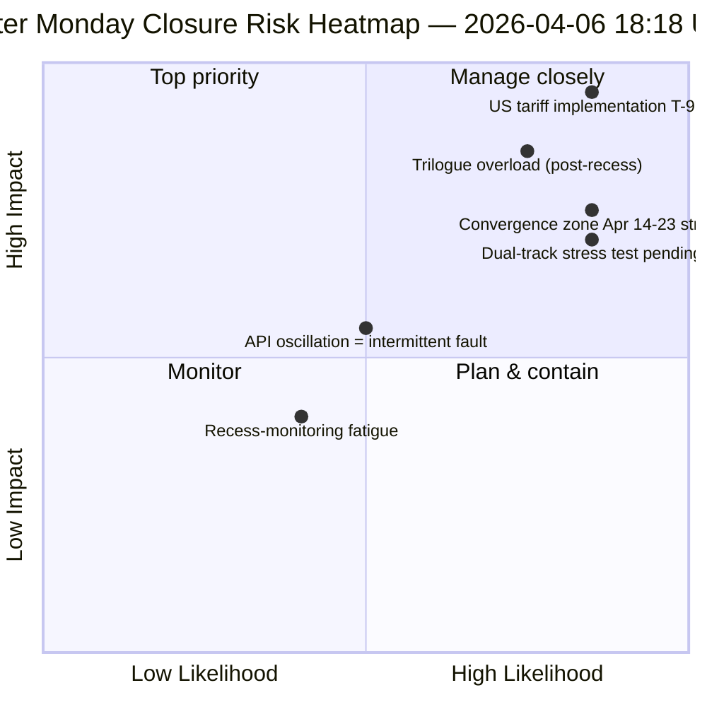

<!-- SPDX-FileCopyrightText: 2026 Hack23 AB -->
<!-- SPDX-License-Identifier: Apache-2.0 -->

# Johtava Tilannekatsaus — Pääsiäismaanantai Ajo 4: Päivittäinen Tiedustelun Sulkeminen | 2026-04-06

**Luokitus:** OSINT — Julkinen parlamentaarinen rekisteri
**Luotettavuus:** 🟡 MEDIUM (tauko; oskillöivä API; riskipisteet 47 / MEDIUM)
**Ajo:** `analysis/daily/2026-04-06/breaking-4/` (18:18 UTC)
**Kattavuus:** Pääsiäistauko päivä 11/18 sulkeminen — 4 breaking + committee-reports + propositions + laajennetut ajot (yhteensä 8) konsolidointi
**Luotu:** 2026-05-16 (retrospektiivinen katsaus, ei uusia MCP-kutsuja)
**Ensisijaiset lähteet:** 61+ analyysiartefaktia, ~16 000 riviä kahdeksassa ajossa; oskillöivä adopted-texts-syöte; 737 EP:n jäsentä vakaana.

---

## 🎯 BLUF

**Ajo 4 on pääsiäismaanantain *päivittäinen tiedustelun sulkeminen* — 18 päivän tauon intensiivisimmin seurattu päivä, joka tuotti 8 työnkulkuajoa, yli 61 analyysiartefaktia ja ~16 000+ riviä alkuperäisanalyysiä yksittäisenä kalenteripäivänä ilman parlamentaarista toimintaa.** Ajon erottava panos ei ole *uusi* rakenteellinen löydös (ne vahvistettiin ajoissa 1–3), vaan **konsolidoitu ristiinvertailuanalyysi**, joka validoi päivän kolme löydöstä toisiaan vasten: **(1) Adopted-texts-päätepisteen oskillaatio vahvistettu** — virhe 00:33 → onnistuminen 12:15 → virhe uudelleen 18:18, laadullisesti erilainen signaali kuin johdonmukaiset 404-virheet muissa päätepisteissä, viitaten aktiiviseen huoltoon eikä kuolleeseen infrastruktuuriin; **(2) 85–86 adopted-texts-liukuhihna vakaa** kaikissa neljässä breaking-ajossa — 42 vuodelta 2026 (TA-10-2026-0035 alkaen TA-10-2026-0104 saakka), 36 vuodelta 2025, 7 vanhaa EP9-2024-kohdetta; **(3) EP-jäsensyöte ainoana luotettavana peruslinjana** (737 vakaana, ei ryhmänvaihtotapahtumia). Sulkemisajon *toimituksellinen arvo* on todeta, että **tauon valvontaa voidaan ylläpitää operatiivisesti nollan parlamentaarisen toiminnan aikana** — mikä todistaa tiedusteluputkilinjan resilienssin ja rakenteellisten lukemien arvon jopa institutionaalisen lepotilan aikana. Riskipisteet 47 (MEDIUM); vakaus 84/100 (muuttumaton 11 päivää); tauko 61% suoritettu.

---

## 🧭 3 Päätöstä, joita tämä katsaus tukee

| # | Päätös | Kuka päättää | Määräaika | Todisteet |
|:-:|--------|--------------|:---------:|-----------|
| 1 | **API-oskillaation juurisyytutkimus** — laadullisesti erilainen kuin 404-malli; huolto vs. vika | Data-pipeline ops; EP MCP-tiimi | 10. huhtikuuta mennessä | §Löydös 1 (oskillaatio) |
| 2 | **Ennen taukoa koottu aineisto Q2-suunnittelun ankkurina** — 42 EP10-2026-tekstiä määrittävät toteutusputkilinjan | Puheenjohtajakonferenssi | juoksevasti | §Löydös 2 (liukuhihna vakaa) |
| 3 | **Tauon valvonnan kestävyysperuslinja** — 8 ajoa/päivä on uusi operatiivinen viite | EP-tiedusteluops | juoksevasti | §Päivittäinen kojelauta |

---

## 📰 60 Sekunnin Luenta

- 🔴 **Pääsiäismaanantain sulkeminen** — 8 työnkulkuajoa, 61+ artefaktia, ~16 000 riviä.
- 🟠 **API-oskillaatio vahvistettu** — Tila B (virhe) → onnistuminen → virhe uudelleen; uusi signaali.
- 🟢 **737 EP:n jäsentä vakaana** — ainoa johdonmukaisesti toimiva ensisijäinen syöte.
- 🟡 **85–86 hyväksyttyä tekstiä vakaana** — 42 vuodelta 2026; +46% VoV-kehitys.
- 🔵 **Vakaus 84/100 muuttumaton 11 päivää** — rakenteellinen tasanko.
- 🟣 **Riskipisteet 47 / MEDIUM** — ei kriittisiä, 4 korkeaa, 7 keskitasoa, 4 matalaa.
- 🩷 **Tauko 61% suoritettu** — Päivä 11/18; T-8 valiokuntaviikkoon.
- ⚪ **Nolla parlamentaarista toimintaa** — odotettu EU:n laajuinen vapaapäivä.

---

## 📊 Päivittäinen Kojelauta (Ajon 4 erottava panos)

| Indikaattori | Tila | Luotettavuus |
|--------------|------|-------------|
| Uutisia | Ei vahvistettuja (×4 tänään) | 🟢 HIGH |
| API-tila | 2/8 toiminnassa (oskillöivä) | 🟡 MEDIUM |
| Vakaus | 84/100 (11 päivän tasanko) | 🟢 HIGH |
| Riskitaso | MEDIUM (47 yhteensä) | 🟡 MEDIUM |
| Taukoedistyminen | 61% (11/18 päivää) | 🟢 HIGH |
| Ajoja yhteensä tänään | 8 työnkulkuajoa | 🟢 HIGH |
| EP-jäsensyöte | 737 vakaana | 🟢 HIGH |

---

## ⚠️ Riskikatsaus

---

## 🔮 Tärkeimmät Tulevat Laukaisijat (seuraavat 9 päivää tauon loppuun)

1. **8.–10. huhtikuuta — täysi API-palautumisikkuna** (55% todennäköisyys).
2. **13. huhtikuuta — Pääsiäismaanantai viikko 2** — ensimmäinen arkipäivä pääsiäisen ulkopuolella; reaktivointi odotettavissa.
3. **14. huhtikuuta — Valiokuntaviikko alkaa** — konvergenssivyöhyke päivä 1.
4. **15. huhtikuuta — USA:n tullit T-0** — eksogeeinen shokki EP:n kontrollin ulkopuolella.
5. **17. huhtikuuta — EKP:n korkopäätös** — taloudellisen kontekstin aktivointi.

---

## 🛡️ Lähdekvaliteetin Arviointi

- **Oskillaatiohavainto (A1):** Ajo 4 suora kolmiomittaus neljän päivän breaking-ajon välillä.
- **8 ajon johdonmukaisuus (A1):** systemaattinen ristiinvertailumenetelmä; todennettavissa.
- **Ennen taukoa kootun aineiston vakaus (A1):** 85–86 hyväksyttyä tekstiä neljässä ajossa.
- **EP-jäsensyöte 737 (A1):** ensisijainen rekisteri; ainoa luotettava peruslinja.
- **Nettovarmuus:** 🟢 HIGH johdonmukaisuusanalyysille; 🟡 MEDIUM oskillaatiotulkinnalle.

---

## 📎 Ajoartefaktit

| Kerros | Artefakti | Miksi |
|--------|-----------|-------|
| Artikkeli | `article.md` | Julkinen sulkemiskertomus |
| Synteesi | `synthesis-summary.md` | 8-ajon konsolidointi + ristiinjohdonmukaisuus |
| Menetelmät | classification · existing · risk-scoring · threat-assessment | Vakiomuotoinen taukojen valvontasarja |
| Kumppani | Kaikki 7 muuta pääsiäismaanantaiajoa (breaking, breaking-2, breaking-3, committee-reports, motions, propositions, plus 2 extended) | Päivittäinen tiedustelupino |

---

**Asiakirjan hallinta**
- **Malliviite:** `analysis/templates/executive-brief.md`
- **Artefaktipolku:** `analysis/daily/2026-04-06/breaking-4/executive-brief.md`
- **Luokitus:** Julkinen
- **Retrospektiivi:** Katsaus kirjoitettu 2026-05-16 ajon vahvistettujen artefaktien pohjalta; **uusia MCP-kutsuja ei tehty**.
