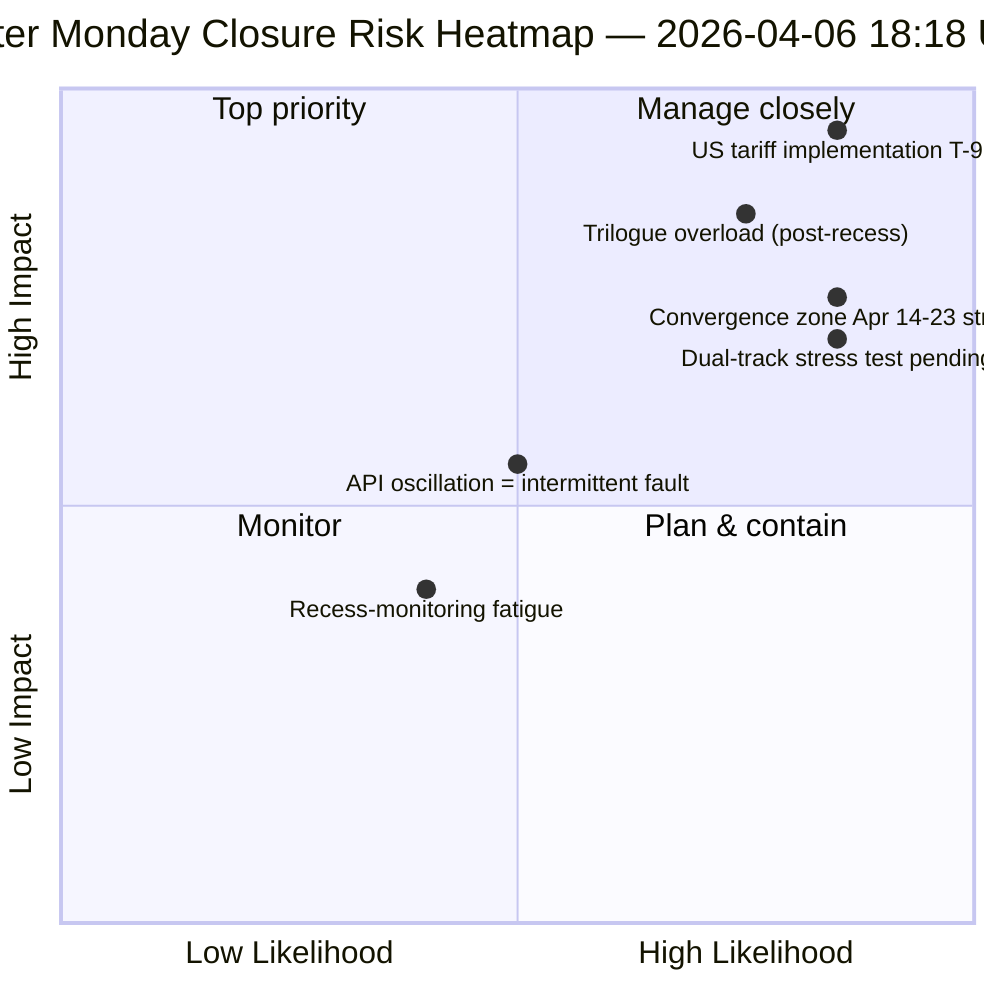

<!-- SPDX-FileCopyrightText: 2026 Hack23 AB -->
<!-- SPDX-License-Identifier: Apache-2.0 -->

# Note de Synthèse Exécutive — Lundi de Pâques Exécution 4 : Clôture Quotidienne du Renseignement | 2026-04-06

**Classification :** OSINT — Registre parlementaire public
**Confiance :** 🟡 MEDIUM (suspension ; API oscillatoire ; score de risque 47 / MEDIUM)
**Exécution :** `analysis/daily/2026-04-06/breaking-4/` (18:18 UTC)
**Couverture :** Suspension de Pâques jour 11/18 clôture — consolidation de 4 breaking + committee-reports + propositions + exécutions étendues (8 au total)
**Générée :** 2026-05-16 (note rétrospective, aucun nouvel appel MCP)
**Sources primaires :** 61+ artefacts d'analyse, ~16 000 lignes sur 8 exécutions ; flux adopted-texts oscillatoire ; 737 eurodéputés stables.

---

## 🎯 BLUF

**L'exécution 4 est la *clôture quotidienne du renseignement* du lundi de Pâques — le jour le plus intensément surveillé des 18 jours de suspension, produisant 8 exécutions de workflow, 61+ artefacts d'analyse et ~16 000+ lignes d'analyse originale d'une seule journée civile sans activité parlementaire.** La contribution distinctive de l'exécution n'est *pas* un nouveau constat structurel (ceux-ci ont été établis dans les exécutions 1–3) mais l'**analyse de cohérence inter-exécutions consolidée** qui valide les trois constats de la journée les uns contre les autres : **(1) Oscillation du point de terminaison adopted-texts confirmée** — échec 00:33 → succès 12:15 → échec à nouveau 18:18, un signal qualitativement différent des erreurs 404 constantes sur d'autres points de terminaison, suggérant une maintenance active plutôt qu'une infrastructure morte ; **(2) Pipeline de 85–86 adopted-texts stable** sur les quatre exécutions breaking — 42 de 2026 (TA-10-2026-0035 à TA-10-2026-0104), 36 de 2025, 7 éléments hérités EP9-2024 ; **(3) Flux MEP comme seule base de référence fiable** (737 stables, aucun changement de groupe). La *valeur éditoriale* de l'exécution de clôture est d'établir que **la surveillance de la suspension peut être opérationnellement maintenue à zéro activité parlementaire** — prouvant la résilience du pipeline de renseignement et la valeur des lectures structurelles même pendant la dormance institutionnelle. Score de risque 47 (MEDIUM) ; stabilité 84/100 (inchangée depuis 11 jours) ; suspension à 61%.

---

## 🧭 3 Décisions que cette note soutient

| # | Décision | Qui décide | Échéance | Preuves |
|:-:|----------|------------|:--------:|---------|
| 1 | **Enquête sur la cause profonde de l'oscillation API** — qualitativement différent du schéma 404 ; maintenance vs. défaillance | Ops data-pipeline ; équipe EP MCP | avant le 10 avril | §Constat 1 (oscillation) |
| 2 | **Corpus pré-suspension comme ancre de planification Q2** — 42 textes EP10-2026 définissent le pipeline d'implémentation | Conférence des présidents | continu | §Constat 2 (pipeline stable) |
| 3 | **Établir une base de référence de durabilité pour la surveillance de la suspension** — le schéma 8 exécutions/jour est la nouvelle référence opérationnelle | Ops renseignement EP | continu | §Tableau de bord quotidien |

---

## 📰 Lecture en 60 Secondes

- 🔴 **Clôture du lundi de Pâques** — 8 exécutions de workflow, 61+ artefacts, ~16 000 lignes.
- 🟠 **Oscillation API confirmée** — Mode B (échec) → succès → échec à nouveau ; signal inédit.
- 🟢 **737 eurodéputés stables** — seul flux primaire constamment opérationnel.
- 🟡 **85–86 textes adoptés stables** — 42 de 2026 ; trajectoire +46% AoA.
- 🔵 **Stabilité 84/100 inchangée depuis 11 jours** — plateau structurel.
- 🟣 **Score de risque 47 / MEDIUM** — aucun critique, 4 élevés, 7 moyens, 4 faibles.
- 🩷 **Suspension à 61%** — Jour 11/18 ; T-8 avant la semaine de commission.
- ⚪ **Zéro activité parlementaire** — jour férié européen attendu.

---

## 📊 Tableau de Bord Quotidien (Contribution distinctive de l'exécution 4)

| Indicateur | Statut | Confiance |
|------------|--------|-----------|
| Dernières Nouvelles | Aucune confirmée (×4 aujourd'hui) | 🟢 HIGH |
| Statut API | 2/8 opérationnels (oscillatoire) | 🟡 MEDIUM |
| Stabilité | 84/100 (plateau de 11 jours) | 🟢 HIGH |
| Niveau de risque | MEDIUM (47 au total) | 🟡 MEDIUM |
| Avancement suspension | 61% (11/18 jours) | 🟢 HIGH |
| Total exécutions aujourd'hui | 8 exécutions de workflow | 🟢 HIGH |
| Flux eurodéputés | 737 stables | 🟢 HIGH |

---

## ⚠️ Aperçu des Risques

---

## 🔮 Principaux Déclencheurs Prospectifs (9 prochains jours avant la fin de la suspension)

1. **8–10 avril — fenêtre complète de récupération API** (55% de probabilité).
2. **13 avril — Semaine 2 du lundi de Pâques** — premier jour ouvrable hors Pâques ; réactivation attendue.
3. **14 avril — Semaine de commission s'ouvre** — zone de convergence jour 1.
4. **15 avril — Droits de douane américains T-0** — choc exogène hors contrôle du PE.
5. **17 avril — Décision de taux de la BCE** — activation du contexte économique.

---

## 🛡️ Évaluation de la Qualité des Sources

- **Observation d'oscillation (A1) :** Triangulation directe de l'exécution 4 sur 4 exécutions breaking de la journée.
- **Cohérence sur 8 exécutions (A1) :** méthodologie systématique inter-exécutions ; vérifiable.
- **Stabilité du corpus pré-suspension (A1) :** 85–86 textes adoptés sur 4 exécutions.
- **Flux eurodéputés 737 (A1) :** enregistrement primaire ; seule base de référence fiable.
- **Confiance nette :** 🟢 HIGH pour l'analyse de cohérence ; 🟡 MEDIUM pour l'interprétation de l'oscillation.

---

## 📎 Artefacts de l'Exécution

| Couche | Artefact | Pourquoi |
|--------|----------|---------|
| Article | `article.md` | Narration de clôture publique |
| Synthèse | `synthesis-summary.md` | Consolidation 8 exécutions + cohérence inter-exécutions |
| Méthodes | classification · existing · risk-scoring · threat-assessment | Suite standard de surveillance de la suspension |
| Compagnon | Les 7 autres exécutions du lundi de Pâques (breaking, breaking-2, breaking-3, committee-reports, motions, propositions, plus 2 extended) | Pile de renseignement quotidien |

---

**Contrôle du Document**
- **Référence du modèle :** `analysis/templates/executive-brief.md`
- **Chemin de l'artefact :** `analysis/daily/2026-04-06/breaking-4/executive-brief.md`
- **Classification :** Public
- **Rétrospectif :** Note rédigée le 2026-05-16 à partir des artefacts committés de l'exécution ; **aucun nouvel appel MCP n'a été effectué**.
