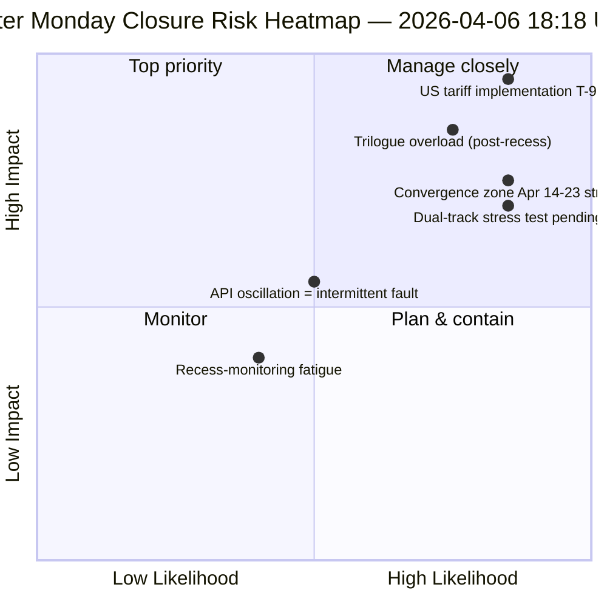

<!-- SPDX-FileCopyrightText: 2026 Hack23 AB -->
<!-- SPDX-License-Identifier: Apache-2.0 -->

# סיכום מנהלים — יום שני של פסחא ריצה 4: סגירה יומית של מודיעין | 2026-04-06

**סיווג:** OSINT — רשומה פרלמנטרית ציבורית
**רמת ביטחון:** 🟡 MEDIUM (הפסקה; API תנודתי; ציון סיכון 47 / MEDIUM)
**ריצה:** `analysis/daily/2026-04-06/breaking-4/` (18:18 UTC)
**כיסוי:** הפסקת פסחא יום 11/18 סגירה — איחוד 4 breaking + committee-reports + propositions + ריצות מורחבות (8 בסך הכל)
**נוצר:** 2026-05-16 (סיכום רטרוספקטיבי, ללא קריאות MCP חדשות)
**מקורות ראשוניים:** 61+ חפצי ניתוח, ~16,000 שורות על פני 8 ריצות; עדכון adopted-texts תנודתי; 737 חברי הפרלמנט האירופי יציבים.

---

## 🎯 BLUF

**ריצה 4 היא *הסגירה המודיעינית היומית* של יום שני של פסחא — היום המנוטר ביותר בהפסקה של 18 יום, עם 8 ריצות של תהליך עבודה, 61+ חפצי ניתוח ו~16,000+ שורות ניתוח מקורי ביום לוח שנה אחד ללא פעילות פרלמנטרית.** התרומה הייחודית של הריצה אינה *ממצא מבני חדש* (אלה נקבעו בריצות 1–3) אלא **ניתוח עקביות מאוחד בין ריצות** המאמת את שלושת ממצאי היום זה כנגד זה: **(1) תנודה בנקודת הקצה של adopted-texts אושרה** — כשל 00:33 ← הצלחה 12:15 ← כשל שוב 18:18, אות שונה מבחינה איכותית מטעויות 404 עקביות בנקודות קצה אחרות, המרמז על תחזוקה פעילה ולא תשתית מתה; **(2) צינור 85–86 adopted-texts יציב** בכל ארבע ריצות breaking — 42 מ-2026 (TA-10-2026-0035 עד TA-10-2026-0104), 36 מ-2025, 7 פריטי EP9-2024 ישנים; **(3) עדכון חברי הפרלמנט כבסיס הסמוך היחיד** (737 יציבים, ללא אירועי מעבר קבוצה). *הערך העריכתי* של ריצת הסגירה הוא לקבוע ש**ניטור ההפסקה יכול להיות מתוחזק תפעולית בפעילות פרלמנטרית אפסית** — הוכחת חוסן צינור המודיעין וערך הקריאות המבניות אפילו בתקופות של שינה מוסדית. ציון סיכון 47 (MEDIUM); יציבות 84/100 (ללא שינוי 11 יום); הפסקה 61% הושלמה.

---

## 🧭 3 החלטות שסיכום זה תומך בהן

| # | החלטה | מי מחליט | מועד אחרון | עדויות |
|:-:|-------|---------|:----------:|--------|
| 1 | **חקירת גורם שורש של תנודת API** — שונה מבחינה איכותית מדפוס 404; תחזוקה לעומת תקלה | Ops של צינור הנתונים; צוות EP MCP | עד 10 באפריל | §ממצא 1 (תנודה) |
| 2 | **אוסף לפני ההפסקה כעוגן תכנון Q2** — 42 טקסטים EP10-2026 מגדירים את צינור היישום | ועידת הנשיאים | מתמשך | §ממצא 2 (צינור יציב) |
| 3 | **הקמת קו בסיס קיימות לניטור הפסקה** — דפוס 8 ריצות/יום הוא ייחוס תפעולי חדש | Ops מודיעין EP | מתמשך | §לוח מחוונים יומי |

---

## 📰 קריאה של 60 שניות

- 🔴 **סגירת יום שני של פסחא** — 8 ריצות של תהליך עבודה, 61+ חפצים, ~16,000 שורות.
- 🟠 **תנודת API אושרה** — מצב B (כשל) ← הצלחה ← כשל שוב; אות חדש.
- 🟢 **737 חברי הפרלמנט יציבים** — עדכון ראשוני פעיל באופן עקבי בלבד.
- 🟡 **85–86 טקסטים שאומצו יציבים** — 42 מ-2026; מסלול +46% שנה לשנה.
- 🔵 **יציבות 84/100 ללא שינוי 11 יום** — רמה מבנית.
- 🟣 **ציון סיכון 47 / MEDIUM** — ללא קריטיים, 4 גבוהים, 7 בינוניים, 4 נמוכים.
- 🩷 **הפסקה 61% הושלמה** — יום 11/18; T-8 לשבוע הוועדות.
- ⚪ **פעילות פרלמנטרית אפסית** — חג רחב-אירופי צפוי.

---

## 📊 לוח מחוונים יומי (תרומה ייחודית של ריצה 4)

| מחוון | סטטוס | רמת ביטחון |
|-------|-------|------------|
| חדשות אחרונות | אין מאושרות (×4 היום) | 🟢 HIGH |
| סטטוס API | 2/8 פעילים (תנודתי) | 🟡 MEDIUM |
| יציבות | 84/100 (רמה של 11 יום) | 🟢 HIGH |
| רמת סיכון | MEDIUM (47 סה"כ) | 🟡 MEDIUM |
| התקדמות הפסקה | 61% (11/18 ימים) | 🟢 HIGH |
| סה"כ ריצות היום | 8 ריצות של תהליך עבודה | 🟢 HIGH |
| עדכון חברים | 737 יציבים | 🟢 HIGH |

---

## ⚠️ תמונת מצב סיכונים

---

## 🔮 טריגרים עתידיים מובילים (9 הימים הבאים עד סוף ההפסקה)

1. **8–10 באפריל — חלון שיחזור API מלא** (הסתברות 55%).
2. **13 באפריל — שבוע 2 של יום שני של פסחא** — יום עבודה ראשון מחוץ לחג; שחזור פעילות צפוי.
3. **14 באפריל — פתיחת שבוע הוועדות** — יום 1 של אזור ההתכנסות.
4. **15 באפריל — מכסי ארה"ב T-0** — זעזוע אקסוגני מחוץ לשליטת הפרלמנט האירופי.
5. **17 באפריל — החלטת ריבית של הבנק המרכזי האירופי** — הפעלת הקשר כלכלי.

---

## 🛡️ הערכת איכות המקורות

- **תצפית תנודה (A1):** ריצה 4 בשיטת משולש ישיר על פני 4 ריצות breaking של היום.
- **עקביות 8 ריצות (A1):** מתודולוגיה שיטתית בין ריצות; ניתנת לאימות.
- **יציבות אוסף לפני ההפסקה (A1):** 85–86 טקסטים שאומצו על פני 4 ריצות.
- **עדכון חברים 737 (A1):** רשומה ראשונית; בסיס הסמוך היחיד הניתן לסמוך עליו.
- **ביטחון נטו:** 🟢 HIGH לניתוח עקביות; 🟡 MEDIUM לפרשנות תנודה.

---

## 📎 חפצי הריצה

| שכבה | חפץ | מדוע |
|------|-----|------|
| מאמר | `article.md` | נרטיב סגירה ציבורי |
| סינתזה | `synthesis-summary.md` | איחוד 8 ריצות + עקביות בין ריצות |
| שיטות | classification · existing · risk-scoring · threat-assessment | ערכת ניטור הפסקה סטנדרטית |
| מלווה | כל 7 ריצות יום שני של פסחא האחרות (breaking, breaking-2, breaking-3, committee-reports, motions, propositions, plus 2 extended) | מחסנית מודיעין יומית |

---

**בקרת מסמך**
- **אסמכתת תבנית:** `analysis/templates/executive-brief.md`
- **נתיב חפץ:** `analysis/daily/2026-04-06/breaking-4/executive-brief.md`
- **סיווג:** ציבורי
- **רטרוספקטיבי:** הסיכום נכתב ב-2026-05-16 מחפצי הריצה שהועברו; **לא בוצעו קריאות MCP חדשות**.
