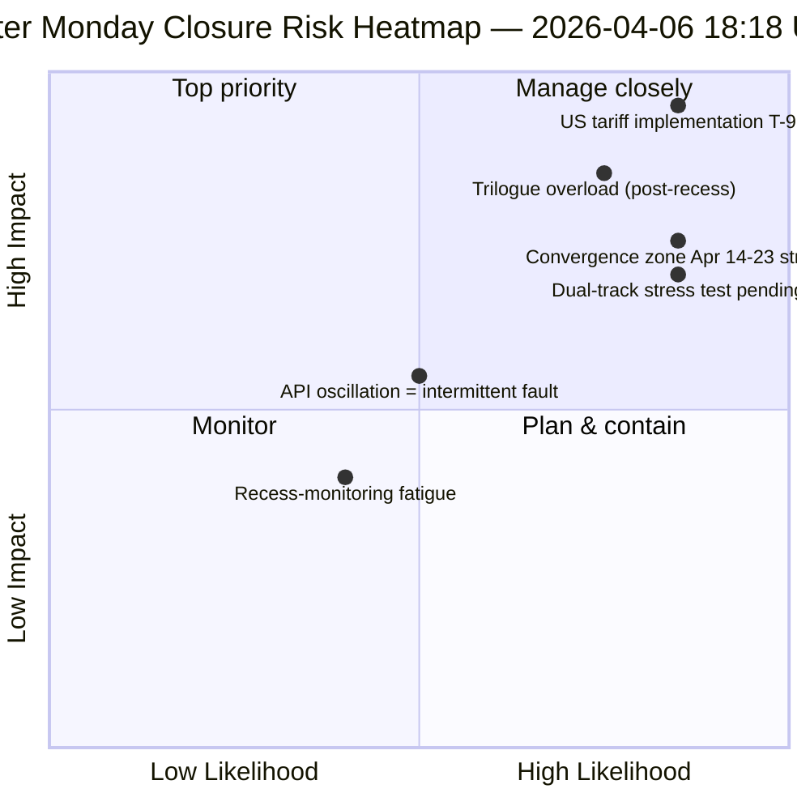

<!-- SPDX-FileCopyrightText: 2026 Hack23 AB -->
<!-- SPDX-License-Identifier: Apache-2.0 -->

# エグゼクティブ・ブリーフ — イースターマンデー第4回実行：日次インテリジェンス・クロージング | 2026-04-06

**分類：** OSINT — 公開議会記録
**信頼度：** 🟡 MEDIUM（休会期間；API振動；リスクスコア 47 / MEDIUM）
**実行：** `analysis/daily/2026-04-06/breaking-4/`（18:18 UTC）
**対象範囲：** イースター休会 第11/18日 クロージング — 4回のbreaking + committee-reports + propositions + 拡張実行（計8回）の統合
**生成：** 2026-05-16（遡及的ブリーフ、新規MCPコールなし）
**主要ソース：** 61件以上の分析アーティファクト、8回の実行にわたる約16,000行；振動するadopted-textsフィード；737名のMEPが安定。

---

## 🎯 BLUF（結論先行）

**第4回実行は、イースターマンデーの*日次インテリジェンス・クロージング*であり、18日間の休会中で最も集中的に監視された日である。8回のワークフロー実行、61件以上の分析アーティファクト、そして議会活動がゼロの1日に約16,000行以上の独自分析を生み出した。** この実行の特筆すべき貢献は、新しい構造的知見（これらは第1〜3回実行で確立された）ではなく、今日の3つの知見を相互に検証する**統合的クロスラン一貫性分析**である。**(1) adopted-textsエンドポイントの振動が確認された** — 00:33 失敗 → 12:15 成功 → 18:18 再び失敗。これは他のエンドポイントで継続する404エラーとは質的に異なるシグナルであり、インフラ障害ではなく積極的なメンテナンスを示唆する。**(2) 85〜86件のadopted-textsパイプラインは全4回のbreaking実行を通じて安定** — 2026年から42件（TA-10-2026-0035からTA-10-2026-0104まで）、2025年から36件、EP9-2024のレガシーアイテム7件。**(3) MEPフィードが唯一の信頼できるベースライン**（737名安定、グループ変更イベントなし）。クロージング実行の*編集上の価値*は、**議会活動がゼロの状態でも休会監視を運用的に維持できること**を確立したことにある。これにより、インテリジェンスパイプラインのレジリエンスと、機関が休眠状態にある時でも構造的読取が価値を持つことが証明された。リスクスコア 47（MEDIUM）；安定度 84/100（11日間変化なし）；休会 61%完了。

---

## 🧭 このブリーフが支援する3つの意思決定

| # | 決定事項 | 意思決定者 | 期限 | 根拠 |
|:-:|---------|----------|:---:|------|
| 1 | **API振動の根本原因調査** — 404パターンとは質的に異なる；メンテナンスか障害か | データパイプラインOps；EP MCPチーム | 4月10日まで | §知見1（振動） |
| 2 | **休会前コーパスをQ2計画の錨として活用** — 42件のEP10-2026テキストが実装パイプラインを定義 | 議長会議 | 継続中 | §知見2（パイプライン安定） |
| 3 | **休会監視の持続可能性ベースラインの確立** — 1日8回実行パターンが新たな運用上の基準 | EPインテリジェンスOps | 継続中 | §日次ダッシュボード |

---

## 📰 60秒で読む

- 🔴 **イースターマンデー・クロージング** — 8回のワークフロー実行、61件以上のアーティファクト、約16,000行。
- 🟠 **API振動確認** — モードB（失敗）→ 成功 → 再び失敗；新しいシグナル。
- 🟢 **737名のMEP安定** — 唯一の継続的に運用中の主要フィード。
- 🟡 **85〜86件の採択テキスト安定** — 2026年から42件；前年比+46%軌道。
- 🔵 **安定度 84/100、11日間変化なし** — 構造的プラトー。
- 🟣 **リスクスコア 47 / MEDIUM** — 重大なし、高4件、中7件、低4件。
- 🩷 **休会 61%完了** — 第11/18日；委員会週まであとT-8。
- ⚪ **議会活動ゼロ** — EU全域の祝日のため想定内。

---

## 📊 日次ダッシュボード（第4回実行の特筆すべき貢献）

| 指標 | ステータス | 信頼度 |
|-----|----------|--------|
| ブレイキングニュース | 確認なし（本日×4） | 🟢 HIGH |
| APIステータス | 2/8 運用中（振動） | 🟡 MEDIUM |
| 安定度 | 84/100（11日間のプラトー） | 🟢 HIGH |
| リスクレベル | MEDIUM（合計47） | 🟡 MEDIUM |
| 休会進捗 | 61%（11/18日） | 🟢 HIGH |
| 本日の総実行回数 | 8回のワークフロー実行 | 🟢 HIGH |
| MEPフィード | 737名安定 | 🟢 HIGH |

---

## ⚠️ リスクスナップショット

---

## 🔮 上位先行トリガー（休会終了まで残り9日間）

1. **4月8〜10日 — 完全なAPI復旧ウィンドウ**（確率55%）。
2. **4月13日 — イースターマンデー第2週** — イースター明け最初の平日；再稼働が見込まれる。
3. **4月14日 — 委員会週開幕** — 収束ゾーン第1日。
4. **4月15日 — 米国関税T-0** — EP制御外の外生的ショック。
5. **4月17日 — ECB金利決定** — 経済的コンテキストの発動。

---

## 🛡️ ソース品質評価

- **振動観測（A1）：** 第4回実行が当日の4回のbreaking実行を直接三角測量。
- **8回実行の一貫性（A1）：** 体系的なクロスラン手法；検証可能。
- **休会前コーパスの安定性（A1）：** 4回の実行で85〜86件の採択テキスト。
- **MEPフィード 737（A1）：** 主要記録；唯一の信頼できるベースライン。
- **総合信頼度：** 🟢 HIGH（一貫性分析）；🟡 MEDIUM（振動解釈）。

---

## 📎 実行アーティファクト

| レイヤー | アーティファクト | 理由 |
|---------|---------------|------|
| 記事 | `article.md` | 公開クロージングナラティブ |
| 統合 | `synthesis-summary.md` | 8回実行統合 + クロスラン一貫性 |
| 方法論 | classification · existing · risk-scoring · threat-assessment | 標準的な休会監視スイート |
| コンパニオン | その他7回のイースターマンデー実行（breaking, breaking-2, breaking-3, committee-reports, motions, propositions, plus 2 extended） | 日次インテリジェンスパイプライン |

---

**文書管理**
- **テンプレート参照：** `analysis/templates/executive-brief.md`
- **アーティファクトパス：** `analysis/daily/2026-04-06/breaking-4/executive-brief.md`
- **分類：** 公開
- **遡及的記録：** このブリーフは、実行のコミット済みアーティファクトから2026-05-16に作成；**新規MCPコールは行われなかった**。
