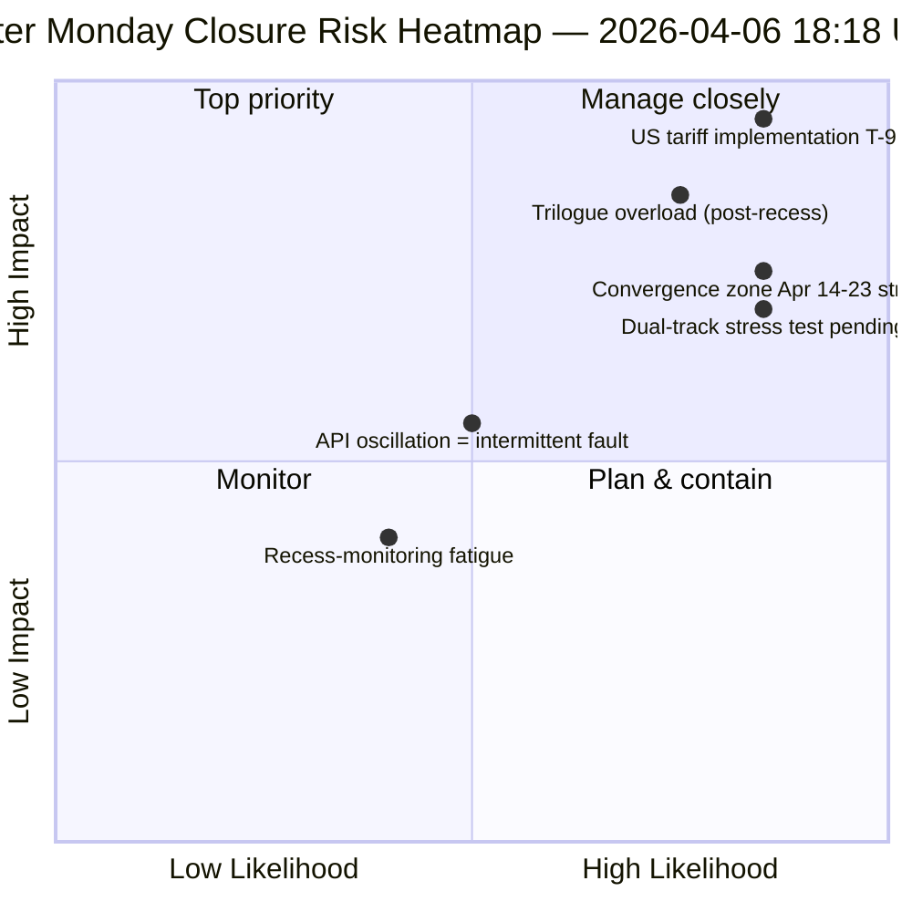

<!-- SPDX-FileCopyrightText: 2026 Hack23 AB -->
<!-- SPDX-License-Identifier: Apache-2.0 -->

# 집행 요약 — 부활절 월요일 실행 4: 일일 정보 마감 | 2026-04-06

**분류:** OSINT — 공개 의회 기록
**신뢰도:** 🟡 MEDIUM (휴회; API 진동; 위험 점수 47 / MEDIUM)
**실행:** `analysis/daily/2026-04-06/breaking-4/` (18:18 UTC)
**적용 범위:** 부활절 휴회 11/18일 마감 — 4회 breaking + committee-reports + propositions + 확장 실행(총 8회) 통합
**생성:** 2026-05-16 (소급 요약, 새 MCP 호출 없음)
**주요 출처:** 61개 이상의 분석 아티팩트, 8회 실행에 걸친 약 16,000줄; 진동하는 adopted-texts 피드; 737명의 유럽의회 의원 안정.

---

## 🎯 BLUF(결론 요약)

**4번째 실행은 부활절 월요일의 *일일 정보 마감*으로 — 18일 휴회 기간 중 가장 집중적으로 모니터링된 날이다. 의회 활동이 전혀 없는 단 하루에 8회의 워크플로 실행, 61개 이상의 분석 아티팩트, ~16,000줄 이상의 독창적인 분석물을 산출했다.** 이번 실행의 독특한 기여는 *새로운* 구조적 발견이 아니라(이는 1~3번 실행에서 확립됨), 하루의 세 가지 발견을 상호 검증하는 **통합된 교차 실행 일관성 분석**이다. **(1) adopted-texts 엔드포인트 진동 확인** — 실패 00:33 → 성공 12:15 → 다시 실패 18:18. 이는 다른 엔드포인트의 일관된 404 오류와는 질적으로 다른 신호로, 죽은 인프라가 아닌 능동적 유지보수를 시사한다. **(2) 85~86개의 adopted-texts 파이프라인 안정** — 4회의 breaking 실행 전체에 걸쳐: 2026년의 42건(TA-10-2026-0035~TA-10-2026-0104), 2025년의 36건, EP9-2024 레거시 7건. **(3) MEP 피드가 유일하게 신뢰할 수 있는 기준선**(737명 안정, 그룹 변경 없음). 마감 실행의 *편집 가치*는 **의회 활동이 제로인 상태에서도 휴회 모니터링을 운영적으로 유지할 수 있음**을 확립한 것이다. 이는 정보 파이프라인의 탄력성과 기관 휴면 기간에도 구조적 판독이 가치 있음을 증명한다. 위험 점수 47(MEDIUM); 안정성 84/100(11일간 변화 없음); 휴회 61% 완료.

---

## 🧭 이 요약이 지원하는 3가지 결정

| # | 결정 사항 | 결정권자 | 기한 | 근거 |
|:-:|---------|---------|:---:|------|
| 1 | **API 진동 근본 원인 조사** — 404 패턴과 질적으로 다름; 유지보수 대 장애 | 데이터 파이프라인 운영; EP MCP 팀 | 4월 10일까지 | §발견 1 (진동) |
| 2 | **휴회 이전 코퍼스를 Q2 계획의 닻으로 활용** — 42개의 EP10-2026 텍스트가 구현 파이프라인을 정의 | 의장단 회의 | 지속 | §발견 2 (파이프라인 안정) |
| 3 | **휴회 모니터링 지속 가능성 기준선 수립** — 하루 8회 실행 패턴이 새로운 운영 기준 | EP 정보 운영 | 지속 | §일일 대시보드 |

---

## 📰 60초 읽기

- 🔴 **부활절 월요일 마감** — 8회 워크플로 실행, 61개 이상 아티팩트, ~16,000줄.
- 🟠 **API 진동 확인** — 모드 B(실패) → 성공 → 다시 실패; 새로운 신호.
- 🟢 **737명의 의원 안정** — 유일하게 지속적으로 운영 중인 주요 피드.
- 🟡 **85~86개의 채택 텍스트 안정** — 2026년 42건; 전년 대비 +46% 궤도.
- 🔵 **안정성 84/100 — 11일간 변화 없음** — 구조적 고원.
- 🟣 **위험 점수 47 / MEDIUM** — 치명적 없음, 높음 4건, 중간 7건, 낮음 4건.
- 🩷 **휴회 61% 완료** — 11/18일; 위원회 주간까지 T-8.
- ⚪ **의회 활동 제로** — 예상되는 EU 전체 공휴일.

---

## 📊 일일 대시보드 (4번 실행의 독특한 기여)

| 지표 | 상태 | 신뢰도 |
|-----|------|--------|
| 속보 | 확인 없음 (오늘 ×4) | 🟢 HIGH |
| API 상태 | 2/8 운영 중 (진동) | 🟡 MEDIUM |
| 안정성 | 84/100 (11일 고원) | 🟢 HIGH |
| 위험 수준 | MEDIUM (총 47) | 🟡 MEDIUM |
| 휴회 진행률 | 61% (11/18일) | 🟢 HIGH |
| 오늘 총 실행 횟수 | 8회 워크플로 실행 | 🟢 HIGH |
| MEP 피드 | 737명 안정 | 🟢 HIGH |

---

## ⚠️ 위험 스냅샷

---

## 🔮 상위 선행 트리거 (휴회 종료까지 남은 9일)

1. **4월 8~10일 — 완전한 API 복구 창** (확률 55%).
2. **4월 13일 — 부활절 월요일 2주차** — 부활절 이후 첫 평일; 재활성화 예상.
3. **4월 14일 — 위원회 주간 개막** — 수렴 구역 1일차.
4. **4월 15일 — 미국 관세 T-0** — EP 통제 밖의 외생적 충격.
5. **4월 17일 — ECB 금리 결정** — 경제적 맥락 활성화.

---

## 🛡️ 출처 품질 평가

- **진동 관측(A1):** 당일 4회 breaking 실행 전체에 걸친 4번 실행의 직접 삼각 측량.
- **8회 실행 일관성(A1):** 체계적인 교차 실행 방법론; 검증 가능.
- **휴회 이전 코퍼스 안정성(A1):** 4회 실행에 걸쳐 85~86개의 채택 텍스트.
- **MEP 피드 737(A1):** 주요 기록; 유일하게 신뢰할 수 있는 기준선.
- **순 신뢰도:** 🟢 HIGH(일관성 분석); 🟡 MEDIUM(진동 해석).

---

## 📎 실행 아티팩트

| 레이어 | 아티팩트 | 이유 |
|-------|---------|------|
| 기사 | `article.md` | 공개 마감 서술 |
| 종합 | `synthesis-summary.md` | 8회 실행 통합 + 교차 실행 일관성 |
| 방법론 | classification · existing · risk-scoring · threat-assessment | 표준 휴회 모니터링 패키지 |
| 동반 | 다른 7회의 부활절 월요일 실행 (breaking, breaking-2, breaking-3, committee-reports, motions, propositions, plus 2 extended) | 일일 정보 스택 |

---

**문서 관리**
- **템플릿 참조:** `analysis/templates/executive-brief.md`
- **아티팩트 경로:** `analysis/daily/2026-04-06/breaking-4/executive-brief.md`
- **분류:** 공개
- **소급적:** 이 요약은 실행의 커밋된 아티팩트로부터 2026-05-16에 작성됨; **새로운 MCP 호출은 이루어지지 않았습니다**.
