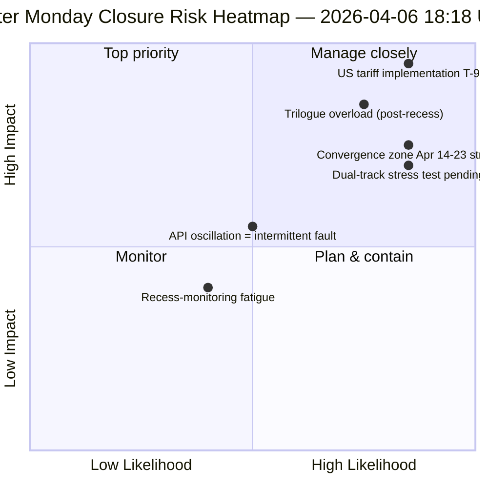

<!-- SPDX-FileCopyrightText: 2026 Hack23 AB -->
<!-- SPDX-License-Identifier: Apache-2.0 -->

# Uitvoerende Samenvatting — Tweede Paasdag Uitvoering 4: Dagelijkse Inlichtingenafsluiting | 2026-04-06

**Classificatie:** OSINT — Openbaar parlementair record
**Betrouwbaarheid:** 🟡 MEDIUM (reces; oscillerende API; risicoscore 47 / MEDIUM)
**Uitvoering:** `analysis/daily/2026-04-06/breaking-4/` (18:18 UTC)
**Dekking:** Paasreces dag 11/18 afsluiting — consolidatie van 4 breaking + committee-reports + propositions + uitgebreide uitvoeringen (8 totaal)
**Gegenereerd:** 2026-05-16 (retrospectieve samenvatting, geen nieuwe MCP-aanroepen)
**Primaire bronnen:** 61+ analyseartefacten, ~16.000 regels over 8 uitvoeringen; oscillerende adopted-texts-feed; 737 EP-leden stabiel.

---

## 🎯 BLUF

**Uitvoering 4 is de *dagelijkse inlichtingenafsluiting* van Tweede Paasdag — de meest intensief gemonitorde dag van de 18-daagse reces, met 8 workflowuitvoeringen, 61+ analyseartefacten en ~16.000+ regels originele analyse van één enkele kalenderdag zonder parlementaire activiteit.** De onderscheidende bijdrage van de uitvoering is *geen* nieuw structureel bevinding (die werden vastgesteld in uitvoeringen 1–3) maar de **geconsolideerde kruisuitvoeringsanalyse** die de drie bevindingen van de dag tegen elkaar valideert: **(1) Oscillatie van het adopted-texts-eindpunt bevestigd** — fout 00:33 → succes 12:15 → fout opnieuw 18:18, een kwalitatief ander signaal dan consistente 404-fouten op andere eindpunten, wat duidt op actief onderhoud in plaats van dode infrastructuur; **(2) 85–86 adopted-texts pipeline stabiel** over alle vier breaking-uitvoeringen — 42 uit 2026 (TA-10-2026-0035 tot TA-10-2026-0104), 36 uit 2025, 7 legacy EP9-2024 items; **(3) EP-ledenfeed als enige betrouwbare basislijn** (737 stabiel, geen groepswisselevenementen). De *redactionele waarde* van de afsluitingsuitvoering is vast te stellen dat **recesmonitoring operationeel kan worden gehandhaafd bij nul parlementaire activiteit** — wat de veerkracht van de inlichtingenpipeline en de waarde van structurele metingen zelfs tijdens institutionele slaapstand bewijst. Risicoscore 47 (MEDIUM); stabiliteit 84/100 (onveranderd gedurende 11 dagen); reces 61% voltooid.

---

## 🧭 3 Beslissingen die deze samenvatting ondersteunt

| # | Beslissing | Wie beslist | Deadline | Bewijs |
|:-:|------------|-------------|:--------:|--------|
| 1 | **Grondoorzaakonderzoek naar API-oscillatie** — kwalitatief anders dan 404-patroon; onderhoud vs. fout | Data-pipeline ops; EP MCP-team | voor 10 april | §Bevinding 1 (oscillatie) |
| 2 | **Pre-reces corpus als Q2-planningsanker** — 42 EP10-2026 teksten definiëren implementatiepipeline | Conferentie van Voorzitters | doorlopend | §Bevinding 2 (pipeline stabiel) |
| 3 | **Duurzaamheidsbasislijn voor recesmonitoring vaststellen** — 8-uitvoeringen/dag patroon is de nieuwe operationele referentie | EP inlichtingenops | doorlopend | §Dagelijks dashboard |

---

## 📰 60-Seconden Lezen

- 🔴 **Tweede Paasdag afsluiting** — 8 workflowuitvoeringen, 61+ artefacten, ~16.000 regels.
- 🟠 **API-oscillatie bevestigd** — Modus B (fout) → succes → fout opnieuw; nieuw signaal.
- 🟢 **737 EP-leden stabiel** — enige consistent operationele primaire feed.
- 🟡 **85–86 aangenomen teksten stabiel** — 42 uit 2026; +46% JoJ-traject.
- 🔵 **Stabiliteit 84/100 onveranderd gedurende 11 dagen** — structureel plateau.
- 🟣 **Risicoscore 47 / MEDIUM** — geen kritieke, 4 hoge, 7 gemiddelde, 4 lage.
- 🩷 **Reces 61% voltooid** — Dag 11/18; T-8 naar commissieweek.
- ⚪ **Nul parlementaire activiteit** — verwachte EU-brede feestdag.

---

## 📊 Dagelijks Dashboard (Onderscheidende bijdrage van uitvoering 4)

| Indicator | Status | Betrouwbaarheid |
|-----------|--------|-----------------|
| Laatste Nieuws | Geen bevestigd (×4 vandaag) | 🟢 HIGH |
| API-status | 2/8 operationeel (oscillerend) | 🟡 MEDIUM |
| Stabiliteit | 84/100 (11-daags plateau) | 🟢 HIGH |
| Risiconiveau | MEDIUM (47 totaal) | 🟡 MEDIUM |
| Recesvoortgang | 61% (11/18 dagen) | 🟢 HIGH |
| Totale uitvoeringen vandaag | 8 workflowuitvoeringen | 🟢 HIGH |
| EP-ledenfeed | 737 stabiel | 🟢 HIGH |

---

## ⚠️ Risico-overzicht

---

## 🔮 Top Vooruitblikkende Triggers (volgende 9 dagen tot recesseinde)

1. **8–10 april — volledig API-herstelvenster** (55% kans).
2. **13 april — Tweede Paasdag week 2** — eerste werkdag buiten Pasen; reactivering verwacht.
3. **14 april — Commissieweek opent** — convergentiezone dag 1.
4. **15 april — VS-tarieven T-0** — exogene schok buiten EP-controle.
5. **17 april — ECB-rentebesluit** — activering van economische context.

---

## 🛡️ Beoordeling van Bronnenkwaliteit

- **Oscillatieobservatie (A1):** Uitvoering 4 directe triangulatie over 4 breaking-uitvoeringen van de dag.
- **8-uitvoeringen consistentie (A1):** systematische kruisuitvoeringsmethodologie; verifieerbaar.
- **Pre-reces corpusstabiliteit (A1):** 85–86 aangenomen teksten over 4 uitvoeringen.
- **EP-ledenfeed 737 (A1):** primaire record; enige betrouwbare basislijn.
- **Netto-betrouwbaarheid:** 🟢 HIGH voor consistentieanalyse; 🟡 MEDIUM voor oscillatie-interpretatie.

---

## 📎 Uitvoeringsartefacten

| Laag | Artefact | Waarom |
|------|----------|--------|
| Artikel | `article.md` | Openbare afsluitingsnarratief |
| Synthese | `synthesis-summary.md` | 8-uitvoeringen consolidatie + kruisuitvoeringsconsisentie |
| Methoden | classification · existing · risk-scoring · threat-assessment | Standaard recesmonitoringssuite |
| Metgezel | Alle 7 andere Tweede Paasdag uitvoeringen (breaking, breaking-2, breaking-3, committee-reports, motions, propositions, plus 2 extended) | Dagelijkse inlichtingenstack |

---

**Documentbeheer**
- **Sjabloonreferentie:** `analysis/templates/executive-brief.md`
- **Artefactpad:** `analysis/daily/2026-04-06/breaking-4/executive-brief.md`
- **Classificatie:** Openbaar
- **Retrospectief:** Samenvatting geschreven op 2026-05-16 vanuit de gecommitte artefacten van de uitvoering; **er werden geen nieuwe MCP-aanroepen gedaan**.
