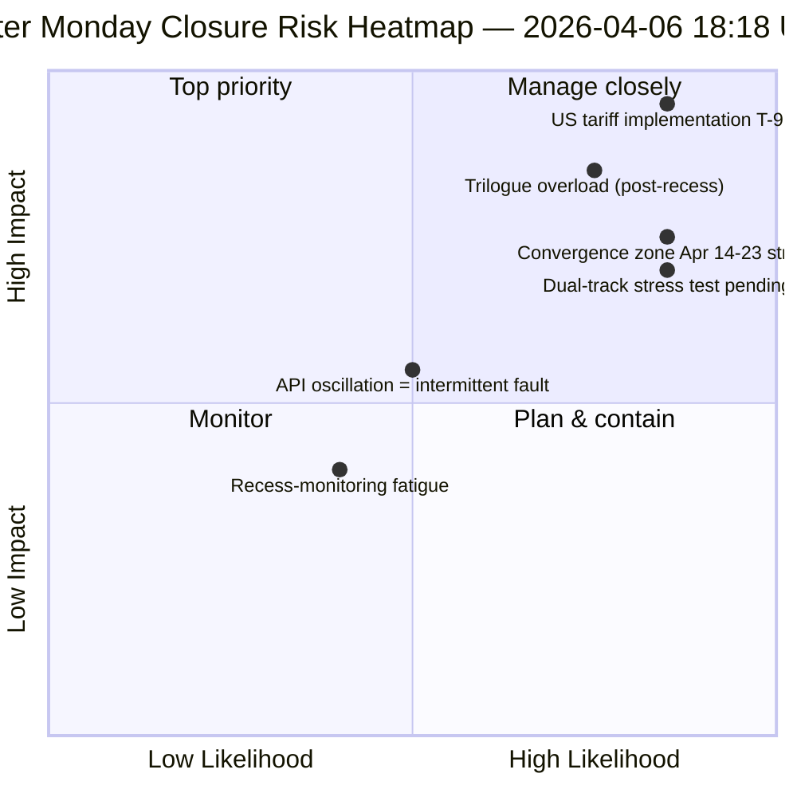

<!-- SPDX-FileCopyrightText: 2026 Hack23 AB -->
<!-- SPDX-License-Identifier: Apache-2.0 -->

# Utøvende Kortfattet Rapport — Påskemandag Kjøring 4: Daglig Etterretningslukking | 2026-04-06

**Klassifisering:** OSINT — Offentlig parlamentarisk rekord
**Konfidens:** 🟡 MEDIUM (pause; oscillerende API; risikoscore 47 / MEDIUM)
**Kjøring:** `analysis/daily/2026-04-06/breaking-4/` (18:18 UTC)
**Dekning:** Påskepause dag 11/18 lukking — konsolidering av 4 breaking + committee-reports + propositions + utvidede kjøringer (8 totalt)
**Generert:** 2026-05-16 (retrospektiv rapport, ingen nye MCP-kall)
**Primærkilder:** 61+ analyseartefakter, ~16 000 linjer fordelt på 8 kjøringer; oscillerende adopted-texts-feed; 737 EU-parlamentarikere stabile.

---

## 🎯 BLUF

**Kjøring 4 er påskemandagens *daglige etterretningslukking* — den mest intensivt overvåkede dagen i 18-dagers pausen, med 8 arbeidsflytskjøringer, 61+ analyseartefakter og ~16 000+ linjer original analyse fra én enkelt kalenderdag uten parlamentarisk aktivitet.** Kjøringens avgjørende bidrag er *ikke* et nytt strukturelt funn (disse ble fastslått i kjøring 1–3), men den **konsoliderte krysskjøringsanalysen** som validerer dagens tre funn mot hverandre: **(1) Oscillasjon i adopted-texts-endpoint bekreftet** — feil 00:33 → suksess 12:15 → feil igjen 18:18, et kvalitativt annerledes signal enn konsistente 404-feil på andre endpoints, noe som tyder på aktiv vedlikehold snarere enn død infrastruktur; **(2) 85–86 adopted-texts pipeline stabil** på tvers av alle fire breaking-kjøringer — 42 fra 2026 (TA-10-2026-0035 til TA-10-2026-0104), 36 fra 2025, 7 eldre EP9-2024 poster; **(3) EU-parlamentarikerfeed som eneste pålitelige basislinje** (737 stabile, ingen grupperingsbytter). Lukkekjøringens *redaksjonelle verdi* er å fastslå at **pauseovervåking kan opprettholdes operativt ved null parlamentarisk aktivitet** — noe som beviser etterretningspipelinens robusthet og verdien av strukturelle avlesninger selv under institusjonell dvale. Risikoscore 47 (MEDIUM); stabilitet 84/100 (uendret i 11 dager); pause 61% gjennomført.

---

## 🧭 3 Beslutninger denne rapporten støtter

| # | Beslutning | Hvem bestemmer | Frist | Bevis |
|:-:|------------|----------------|:-----:|-------|
| 1 | **Rotårsaksundersøkelse av API-oscillasjon** — kvalitativt annerledes enn 404-mønsteret; vedlikehold vs. feil | Data-pipeline ops; EP MCP-team | innen 10. april | §Funn 1 (oscillasjon) |
| 2 | **Pre-pause-korpus som Q2-planleggingsanker** — 42 EP10-2026 tekster definerer implementeringspipeline | Presidentkonferansen | løpende | §Funn 2 (pipeline stabil) |
| 3 | **Etabler bærekraftsbasislinje for pauseovervåking** — 8-kjøringer/dag-mønsteret er ny operativ referanse | EP etterretningsops | løpende | §Daglig Dashboard |

---

## 📰 60-Sekunders Lesning

- 🔴 **Påskemandag lukking** — 8 arbeidsflytskjøringer, 61+ artefakter, ~16 000 linjer.
- 🟠 **API-oscillasjon bekreftet** — Modus B (feil) → suksess → feil igjen; nytt signal.
- 🟢 **737 EU-parlamentarikere stabile** — eneste konsekvent operativt primærfeed.
- 🟡 **85–86 vedtatte tekster stabile** — 42 fra 2026; +46% ÅtÅ-utvikling.
- 🔵 **Stabilitet 84/100 uendret i 11 dager** — strukturelt platå.
- 🟣 **Risikoscore 47 / MEDIUM** — ingen kritiske, 4 høye, 7 middels, 4 lave.
- 🩷 **Pause 61% gjennomført** — Dag 11/18; T-8 til komitéuke.
- ⚪ **Null parlamentarisk aktivitet** — forventet EU-felles helligdag.

---

## 📊 Daglig Dashboard (Kjøring 4s særskilte bidrag)

| Indikator | Status | Konfidens |
|-----------|--------|-----------|
| Breaking News | Ingen bekreftet (×4 i dag) | 🟢 HIGH |
| API-status | 2/8 operative (oscillerende) | 🟡 MEDIUM |
| Stabilitet | 84/100 (11-dagers platå) | 🟢 HIGH |
| Risikonivå | MEDIUM (47 totalt) | 🟡 MEDIUM |
| Pausefremgang | 61% (11/18 dager) | 🟢 HIGH |
| Totale kjøringer i dag | 8 arbeidsflytskjøringer | 🟢 HIGH |
| EU-parlamentarikerfeed | 737 stabile | 🟢 HIGH |

---

## ⚠️ Risikooversikt

---

## 🔮 Topp Fremoverrettede Utløsere (neste 9 dager til pausens slutt)

1. **8.–10. april — fullt API-gjenopprettingsvindu** (55% sannsynlighet).
2. **13. april — Påskemandag uke 2** — første hverdag utenfor påsken; reaktivering forventet.
3. **14. april — Komitéuke åpner** — konvergenssone dag 1.
4. **15. april — US-toll T-0** — eksogen sjokk utenfor EPs kontroll.
5. **17. april — ECB-rentebeslutning** — aktivering av økonomisk kontekst.

---

## 🛡️ Kildekvalitetsvurdering

- **Oscillasjonsobservasjon (A1):** Kjøring 4 direkte triangulering på tvers av 4 breaking-kjøringer fra dagen.
- **8-kjøring konsistens (A1):** systematisk krysskjøringsmetodikk; verifiserbar.
- **Pre-pause-korpusstabilitet (A1):** 85–86 vedtatte tekster på tvers av 4 kjøringer.
- **EU-parlamentarikerfeed 737 (A1):** primæroppføring; eneste pålitelige basislinje.
- **Nettokonfidens:** 🟢 HIGH for konsistensanalyse; 🟡 MEDIUM for oscillasjonstolkning.

---

## 📎 Kjøringsartefakter

| Lag | Artefakt | Hvorfor |
|-----|----------|---------|
| Artikkel | `article.md` | Offentlig lukkefortelling |
| Syntese | `synthesis-summary.md` | 8-kjøring konsolidering + krysskjøringskonsistens |
| Metoder | classification · existing · risk-scoring · threat-assessment | Standard pauseovervåkingssuite |
| Ledsager | Alle 7 andre påskemandagskjøringer (breaking, breaking-2, breaking-3, committee-reports, motions, propositions, plus 2 extended) | Daglig etterretningsstack |

---

**Dokumentkontroll**
- **Mallreferanse:** `analysis/templates/executive-brief.md`
- **Artefaktsti:** `analysis/daily/2026-04-06/breaking-4/executive-brief.md`
- **Klassifisering:** Offentlig
- **Retrospektiv:** Rapport skrevet 2026-05-16 fra kjøringens committede artefakter; **ingen nye MCP-kall ble gjort**.
