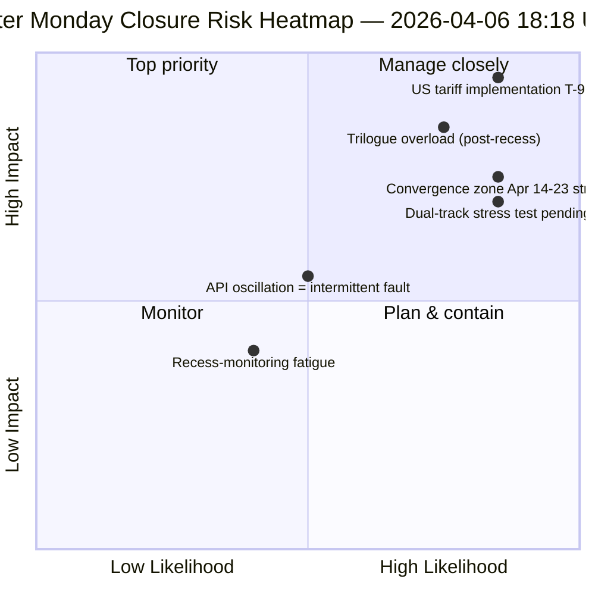

<!-- SPDX-FileCopyrightText: 2026 Hack23 AB -->
<!-- SPDX-License-Identifier: Apache-2.0 -->

# Exekutiv Sammanfattning — Påskdagen Körning 4: Daglig Underrättelsestängning | 2026-04-06

**Klassificering:** OSINT — Offentliga parlamentariska uppgifter
**Tillförlitlighet:** 🟡 MEDIUM (uppehåll; oscillerande API; riskvärde 47 / MEDIUM)
**Körning:** `analysis/daily/2026-04-06/breaking-4/` (18:18 UTC)
**Täckning:** Påskuppehåll dag 11/18 stängning — konsolidering av 4 breaking + committee-reports + propositions + utökade körningar (8 totalt)
**Genererad:** 2026-05-16 (retrospektiv sammanfattning, inga nya MCP-anrop)
**Primära källor:** 61+ analysartefakter, ~16 000 rader fördelat på 8 körningar; oscillerande adopted-texts-flöde; 737 ledamöter stabila.

---

## 🎯 BLUF

**Körning 4 är påskdagens *dagliga underrättelsestängning* — den mest intensivt övervakade dagen under 18-dagarsuppehållet, med 8 arbetsflödeskörningar, 61+ analysartefakter och ~16 000+ rader originalanalys från en enda kalenderdag utan parlamentarisk aktivitet.** Körningens viktigaste bidrag är *inte* ett nytt strukturellt fynd (dessa fastslogs i körningarna 1–3) utan den **konsoliderade tvärkörsanalys** som validerar dagens tre fynd mot varandra: **(1) Oscillation i adopted-texts-endpoint bekräftad** — fel 00:33 → framgång 12:15 → fel igen 18:18, en kvalitativt annorlunda signal jämfört med konsekventa 404-fel på andra endpoints, vilket tyder på aktiv underhåll snarare än driftlös infrastruktur; **(2) 85–86 adopted-texts i pipeline stabil** under alla fyra breaking-körningarna — 42 från 2026 (TA-10-2026-0035 till TA-10-2026-0104), 36 från 2025, 7 äldre EP9-2024-poster; **(3) MEP-flöde som enda tillförlitlig baslinje** (737 stabila, inga grupperingsbyten). Stängningskörningens *redaktionella värde* är att fastslå att **övervakning under påskuppehåll kan upprätthållas operativt vid noll parlamentarisk aktivitet** — vilket bevisar intelligenspiplelinens resiliens och värdet av strukturella avläsningar även under institutionell dvala. Riskvärde 47 (MEDIUM); stabilitet 84/100 (oförändrat i 11 dagar); uppehåll 61% genomfört.

---

## 🧭 3 Beslut som denna sammanfattning stödjer

| # | Beslut | Vem beslutar | Tidsgräns | Bevis |
|:-:|--------|--------------|:---------:|-------|
| 1 | **Rotorsaksutredning av API-oscillation** — kvalitativt annorlunda från 404-mönster; underhåll kontra fel | Data-pipeline ops; EP MCP-team | senast 10 april | §Fynd 1 (oscillation) |
| 2 | **Pre-uppehåll-korpus som Q2-planeringsankare** — 42 EP10-2026-texter definierar implementeringspipeline | Ordförandekonferensen | löpande | §Fynd 2 (pipeline stabil) |
| 3 | **Upprätta hållbarhetsbaslinje för uppehållsövervakning** — 8-körningar/dag-mönster är ny operativ referens | EP underrättelseops | löpande | §Daglig instrumentpanel |

---

## 📰 60-Sekunders Läsning

- 🔴 **Påskdagens stängning** — 8 arbetsflödeskörningar, 61+ artefakter, ~16 000 rader.
- 🟠 **API-oscillation bekräftad** — Läge B (fel) → framgång → fel igen; ny signal.
- 🟢 **737 ledamöter stabila** — enda konsekvent fungerande primärflöde.
- 🟡 **85–86 antagna texter stabila** — 42 från 2026; +46% ÅoÅ-utveckling.
- 🔵 **Stabilitet 84/100 oförändrat i 11 dagar** — strukturellt platå.
- 🟣 **Riskvärde 47 / MEDIUM** — inga kritiska, 4 höga, 7 medel, 4 låga.
- 🩷 **Uppehåll 61% genomfört** — Dag 11/18; T-8 till kommittévecka.
- ⚪ **Noll parlamentarisk aktivitet** — förväntad EU-gemensam helgdag.

---

## 📊 Daglig Instrumentpanel (Körning 4:s särskiljande bidrag)

| Indikator | Status | Tillförlitlighet |
|-----------|--------|-----------------|
| Bry Nyheter | Inga bekräftade (×4 idag) | 🟢 HIGH |
| API-status | 2/8 operativa (oscillerande) | 🟡 MEDIUM |
| Stabilitet | 84/100 (11-dagars platå) | 🟢 HIGH |
| Risknivå | MEDIUM (47 totalt) | 🟡 MEDIUM |
| Uppehållsframsteg | 61% (11/18 dagar) | 🟢 HIGH |
| Totala körningar idag | 8 arbetsflödeskörningar | 🟢 HIGH |
| Ledamötsflöde | 737 stabila | 🟢 HIGH |

---

## ⚠️ Risköversikt

---

## 🔮 Topp Framåtblickande Utlösare (nästa 9 dagar till uppehållets slut)

1. **8–10 april — fullt API-återhämtningsfönster** (55% sannolikhet).
2. **13 april — Påskdagens vecka 2** — första vardagen utanför påsk; reaktivering förväntad.
3. **14 april — Kommittévecka öppnar** — konvergenszon dag 1.
4. **15 april — US-tullar T-0** — exogen chock utanför EP:s kontroll.
5. **17 april — ECB-räntebeslut** — aktivering av ekonomiskt sammanhang.

---

## 🛡️ Källkvalitetsbedömning

- **Oscillationsobservation (A1):** Körning 4 direkt triangulering mellan 4 breaking-körningar under dagen.
- **8-körningars konsekvens (A1):** systematisk tvärkörsmetodik; verifierbar.
- **Pre-uppehåll-korpusstabilitet (A1):** 85–86 antagna texter under 4 körningar.
- **MEP-flöde 737 (A1):** primäruppgift; enda tillförlitliga baslinjen.
- **Nettotillförlitlighet:** 🟢 HIGH för konsekvensanalys; 🟡 MEDIUM för oscillationstolkning.

---

## 📎 Körningartefakter

| Lager | Artefakt | Varför |
|-------|----------|--------|
| Artikel | `article.md` | Offentlig stängningsberättelse |
| Syntes | `synthesis-summary.md` | 8-körningskonsolidering + tvärkörskonsekvens |
| Metoder | classification · existing · risk-scoring · threat-assessment | Standardsvit för uppehållsövervakning |
| Kompanjon | Alla 7 andra påskdagskörningar (breaking, breaking-2, breaking-3, committee-reports, motions, propositions, plus 2 extended) | Daglig underrättelsestack |

---

**Dokumentkontroll**
- **Mallreferens:** `analysis/templates/executive-brief.md`
- **Artefaktsökväg:** `analysis/daily/2026-04-06/breaking-4/executive-brief.md`
- **Klassificering:** Offentlig
- **Retrospektiv:** Sammanfattning skriven 2026-05-16 från körningens committade artefakter; **inga nya MCP-anrop gjordes**.
