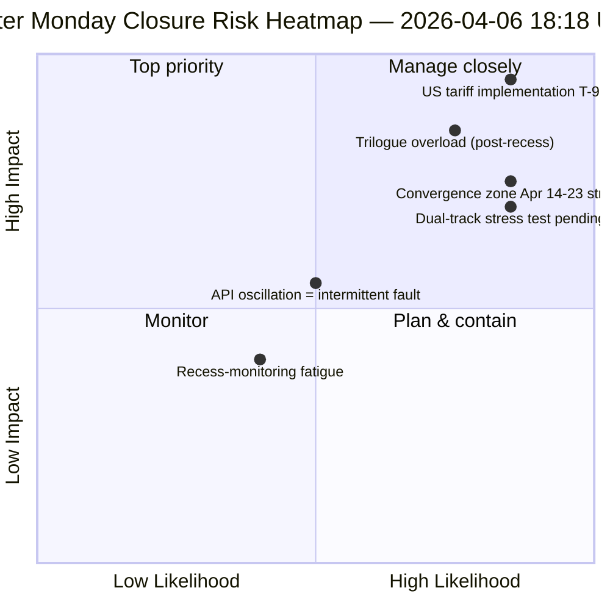

<!-- SPDX-FileCopyrightText: 2026 Hack23 AB -->
<!-- SPDX-License-Identifier: Apache-2.0 -->

# 执行简报 — 复活节星期一第4次运行：每日情报收尾 | 2026-04-06

**分类：** OSINT — 公开议会记录
**置信度：** 🟡 MEDIUM（休会期；API振荡；风险评分 47 / MEDIUM）
**运行：** `analysis/daily/2026-04-06/breaking-4/`（18:18 UTC）
**覆盖范围：** 复活节休会第11/18天收尾 — 4次breaking + committee-reports + propositions + 扩展运行（共8次）的整合
**生成时间：** 2026-05-16（回顾性简报，未进行新的MCP调用）
**主要来源：** 61个以上分析制品，8次运行共约16,000行；adopted-texts数据流振荡；737名欧洲议会议员稳定。

---

## 🎯 直接结论（BLUF）

**第4次运行是复活节星期一的*每日情报收尾* — 18天休会期中监控最密集的一天，在议会活动为零的单个日历日产出了8次工作流运行、61个以上分析制品以及约16,000行以上的原创分析。** 本次运行的独特贡献并非新的结构性发现（这些已在第1至3次运行中确立），而是**整合的跨运行一致性分析**，将当天的三项发现相互验证：**(1) adopted-texts端点振荡已确认** — 00:33失败 → 12:15成功 → 18:18再次失败，这是与其他端点上持续的404错误在性质上截然不同的信号，表明系统处于积极维护状态而非基础设施失效；**(2) 85至86个adopted-texts流水线在全部4次breaking运行中保持稳定** — 2026年42个（TA-10-2026-0035至TA-10-2026-0104），2025年36个，7个EP9-2024历史遗留条目；**(3) 欧洲议会议员数据流是唯一可靠基准**（737名稳定，无政治组更换事件）。收尾运行的*编辑价值*在于确认：**即使在议会活动完全停止期间，也可以持续运营休会监控** — 这证明了情报流水线的韧性以及结构性读数即便在机构休眠期间也具有重要价值。风险评分47（MEDIUM）；稳定性84/100（11天未变化）；休会完成61%。

---

## 🧭 本简报支持的3项决策

| # | 决策 | 决策者 | 截止日期 | 证据 |
|:-:|------|--------|:-------:|------|
| 1 | **API振荡根本原因调查** — 与404模式有质的区别；维护与故障之分 | 数据流水线运营；EP MCP团队 | 4月10日前 | §发现1（振荡） |
| 2 | **休会前语料库作为Q2规划锚点** — 42个EP10-2026文本定义了实施流水线 | 议长会议 | 持续滚动 | §发现2（流水线稳定） |
| 3 | **建立休会监控可持续性基准** — 每天8次运行模式是新的运营参考标准 | EP情报运营 | 持续滚动 | §每日仪表板 |

---

## 📰 60秒速读

- 🔴 **复活节星期一收尾** — 8次工作流运行，61个以上制品，约16,000行。
- 🟠 **API振荡已确认** — 模式B（失败）→ 成功 → 再次失败；全新信号。
- 🟢 **737名议员稳定** — 唯一持续运作的主要数据流。
- 🟡 **85至86个采纳文本稳定** — 2026年42个；同比+46%走势。
- 🔵 **稳定性84/100，11天未变化** — 结构性高原期。
- 🟣 **风险评分47 / MEDIUM** — 无关键风险，4个高风险，7个中风险，4个低风险。
- 🩷 **休会完成61%** — 第11/18天；距委员会周T-8。
- ⚪ **议会活动为零** — 欧盟全境预期公共假日。

---

## 📊 每日仪表板（第4次运行的独特贡献）

| 指标 | 状态 | 置信度 |
|------|------|--------|
| 突发新闻 | 无已确认（今日×4） | 🟢 HIGH |
| API状态 | 2/8在线（振荡） | 🟡 MEDIUM |
| 稳定性 | 84/100（11天高原） | 🟢 HIGH |
| 风险等级 | MEDIUM（总计47） | 🟡 MEDIUM |
| 休会进度 | 61%（11/18天） | 🟢 HIGH |
| 今日总运行次数 | 8次工作流运行 | 🟢 HIGH |
| 议员数据流 | 737名稳定 | 🟢 HIGH |

---

## ⚠️ 风险快照

---

## 🔮 顶级前向触发因素（至休会结束的9天内）

1. **4月8日至10日 — 完整API恢复窗口**（概率55%）。
2. **4月13日 — 复活节星期一第2周** — 复活节后首个工作日；预计重新激活。
3. **4月14日 — 委员会周开幕** — 收敛区第1天。
4. **4月15日 — 美国关税T-0** — EP控制范围以外的外生冲击。
5. **4月17日 — 欧洲央行利率决定** — 激活经济背景分析。

---

## 🛡️ 信息来源质量评估

- **振荡观测（A1）：** 第4次运行对当天4次breaking运行的直接三角交叉验证。
- **8次运行一致性（A1）：** 系统性跨运行方法论；可验证。
- **休会前语料库稳定性（A1）：** 4次运行中85至86个采纳文本。
- **议员数据流 737（A1）：** 主要记录；唯一可靠基准。
- **综合置信度：** 🟢 HIGH（一致性分析）；🟡 MEDIUM（振荡解读）。

---

## 📎 运行制品

| 层级 | 制品 | 原因 |
|------|------|------|
| 文章 | `article.md` | 公开收尾叙述 |
| 综合 | `synthesis-summary.md` | 8次运行整合 + 跨运行一致性 |
| 方法 | classification · existing · risk-scoring · threat-assessment | 标准休会监控套件 |
| 配套 | 其他7次复活节星期一运行（breaking, breaking-2, breaking-3, committee-reports, motions, propositions, plus 2 extended） | 每日情报堆栈 |

---

**文档控制**
- **模板参考：** `analysis/templates/executive-brief.md`
- **制品路径：** `analysis/daily/2026-04-06/breaking-4/executive-brief.md`
- **分类：** 公开
- **回顾性说明：** 本简报于2026-05-16根据该运行的已提交制品撰写；**未进行新的MCP调用**。
