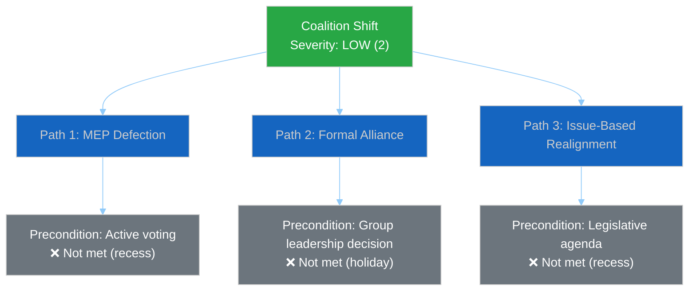
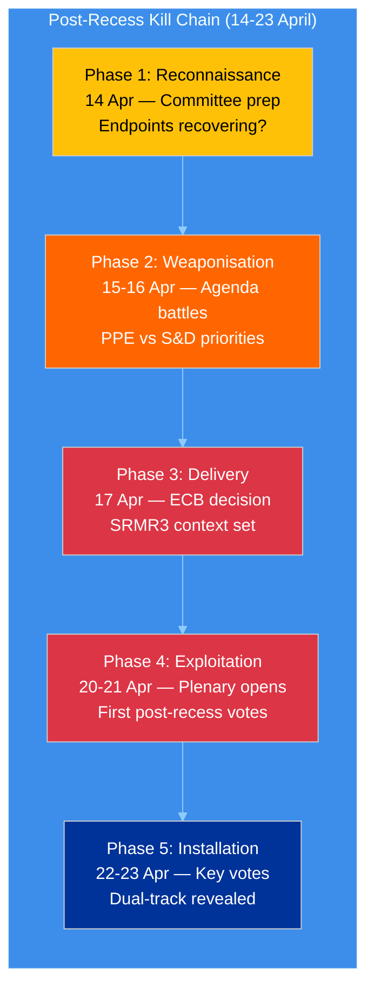

# 🛡️ Political Threat Landscape — Easter Monday Evening Assessment (Run 4)

**Date:** 6 April 2026 | **Time:** 18:22 UTC | **Assessment Period:** Easter Recess Day 11/18
**Confidence:** 🟡 MEDIUM | **Previous Assessment:** 12:15 UTC (Run 3) | **Delta:** API oscillation confirmed
**Framework:** 6-Dimension Threat Model + PESTLE Integration

---

## Threat Landscape Dashboard

| Threat Dimension | Severity | Trend | Confidence | 24h Delta |
|-----------------|----------|-------|------------|-----------|
| Coalition Shifts | LOW (2) | → Stable | 🟡 MEDIUM | 0 |
| Transparency Deficit | MODERATE (3) | ↗ Worsening | 🟢 HIGH | +0.5 (oscillation) |
| Policy Reversal | MINIMAL (1) | → Stable | 🟢 HIGH | 0 |
| Institutional Pressure | MODERATE (3) | → Stable | 🟡 MEDIUM | 0 |
| Legislative Obstruction | LOW (2) | → Stable | 🟢 HIGH | 0 |
| Democratic Erosion | LOW (2) | → Stable | 🟡 MEDIUM | 0 |

**Overall Threat Level:** LOW-MODERATE (13/30 = 2.17 average severity)

**Key Change vs. Run 3:** Transparency Deficit upgraded from MODERATE-stable to MODERATE-worsening based on the adopted texts endpoint recovery reversal. The oscillatory API behaviour creates a more complex transparency challenge than consistent failure — stakeholders cannot reliably plan data access around maintenance windows.

---

## Dimension Analysis

### 1. Coalition Shifts — LOW (2) Severity

**Assessment:** No evidence of group realignment. Coalition structure frozen during recess.

**Evidence (4 data points):**
- Zero MEP group-switching events in 737-MEP feed across all 4 runs today (00:33, 06:45, 12:15, 18:18 UTC). 🟢 HIGH confidence.
- Coalition dynamics tool: Renew-ECR pair 0.95 cohesion — confirmed as size-ratio artifact, NOT policy alignment evidence. 🟡 MEDIUM confidence.
- S&D membership: 135 (stable), ECR: 81 (stable), Renew: 77 (stable) — all group sizes unchanged. 🟢 HIGH confidence.
- PPE membership in coalition tool returns 0 — confirmed persistent endpoint bug. Does not reflect actual PPE membership. 🟢 HIGH confidence (bug confirmed across 15+ runs).

**Cui Bono:** Recess freezes the status quo. This benefits PPE most — as the dominant group, any legislative silence preserves their structural advantages without challenge. S&D and Greens/EFA have no forum to build alternative majority demonstrations. The Left (2 MEPs in sample) and NI (4 MEPs) are most disadvantaged by prolonged inactivity — they lack the informal networks to maintain influence during recesses.

**Attack Tree Analysis:**

All three coalition shift pathways require conditions that cannot be met during Easter recess. Threat remains structurally blocked until parliament resumes.

### 2. Transparency Deficit — MODERATE (3) Severity ↗

**Assessment:** UPGRADED to worsening trend. The adopted texts endpoint recovery at 12:15 UTC proved transient — at 18:18 UTC it has reverted to JSON parse error. This oscillatory pattern is MORE concerning than consistent failure because:

1. **Unreliable data access:** Monitoring systems cannot depend on the endpoint being available at any given time
2. **Incomplete picture risk:** If a monitoring run happens during a failure window, it misses data that was available hours earlier
3. **False recovery signals:** The 12:15 success created expectations that have now been disappointed

**Evidence (6 data points):**
- 6/8 feed endpoints returning 404/error — unchanged from 28 March. 🟢 HIGH confidence.
- Adopted texts: oscillating (error → success → error within 18 hours). 🟢 HIGH confidence — directly observed across 4 runs.
- Events + Procedures: persistent Mode A hard 404 on both today and one-week timeframes. 🟢 HIGH confidence.
- Documents/Plenary/Committee/Questions: persistent Mode C soft 404. 🟢 HIGH confidence.
- No committee meeting records, no parliamentary questions, no document uploads visible. 🟢 HIGH confidence.
- Information blackout duration: 11 consecutive days (28 March – 6 April). 🟢 HIGH confidence.

**Second-Order Effects:**
- **Monitoring reliability:** The oscillation introduces a coverage lottery — whether a scan captures data depends on WHEN it runs, not WHETHER data exists. This is a novel threat to systematic monitoring that didn't exist under consistent 404 patterns.
- **Institutional credibility:** External transparency advocates (e.g., EUObserver, VoteWatch Europe) may flag the EP's data infrastructure reliability. The EU CRA (Cyber Resilience Act) that EP itself adopted sets standards that the EP's own data infrastructure arguably fails to meet during this degradation period.
- **Democratic monitoring gap:** NGOs relying on EP open data (Access Info Europe, Transparency International EU) face 11 days of reduced oversight capability. This coincides with the period when behind-the-scenes negotiations on upcoming committee priorities are most active.

**Counter-Factual:** If the EP maintained 8/8 API availability during recess (as the UK Parliament's Hansard API and the US Congress's bulk data service do), the monitoring ecosystem would detect early signals of post-recess positioning — draft committee agendas, written question submissions, delegation travel notices. The current blackout means these signals emerge only when parliament physically resumes, creating a compressed discovery period on 14 April.

### 3. Policy Reversal — MINIMAL (1) Severity

**Assessment:** Zero policy reversal signals. All 85 adopted texts in the one-week feed remain in force. The legislative record is intact.

**Evidence:**
- 42 EP10-2026 texts (TA-10-2026-0035 to TA-10-2026-0104) confirmed stable. 🟢 HIGH confidence.
- 36 EP10-2025 texts (TA-10-2025-0279 to TA-10-2025-0314) confirmed stable. 🟢 HIGH confidence.
- 7 EP9-2024 legacy texts in feed — metadata updates only, no policy changes. 🟡 MEDIUM confidence.
- Zero withdrawal notices or amendment proposals detected across all runs. 🟢 HIGH confidence.

### 4. Institutional Pressure — MODERATE (3) Severity

**Assessment:** PPE dominance risk persists. Early warning system continues to flag at HIGH severity. The 19x size ratio between largest and smallest groups represents a structural power asymmetry.

**Evidence:**
- PPE: 38% (100-MEP sample), extrapolated to 185/720 (25.7%) in full parliament. 🟡 MEDIUM confidence (sample-based).
- Grand coalition: PPE + S&D = 60% — viable but PPE is the indispensable partner. 🟢 HIGH confidence (arithmetic).
- No alternative majority without PPE participation — verified through all combination analysis. 🟢 HIGH confidence.
- Early warning: DOMINANT_GROUP_RISK at HIGH severity, stable across 15+ monitoring runs. 🟢 HIGH confidence.

**Tension Identification:** The PPE dual-track coalition strategy (right-of-centre for economic files, grand coalition for governance) creates an institutional pressure dynamic: S&D must cooperate with PPE on governance files even while being excluded from economic agenda-setting. This tension will materialise concretely when the first post-recess legislative votes reveal which track PPE prefers for spring 2026 priorities (SRMR3 banking reform, Anti-Corruption Directive implementation, US tariff response).

### 5. Legislative Obstruction — LOW (2) Severity

**Assessment:** No active obstruction during recess. Post-recess bottleneck risk remains at MEDIUM due to accumulated backlog.

**Evidence:**
- 85 adopted texts in pipeline. 🟢 HIGH confidence.
- 2026 projections: 114 acts, 567 votes, 498 texts, 54 sessions — above-average throughput required. 🟡 MEDIUM confidence (projected).
- Pre-recess legislative sprint: 42 EP10-2026 texts in the March adoption batch — higher than EP9 2024 equivalent. 🟡 MEDIUM confidence.
- Post-recess committee week (14-17 April) must absorb backlog. Time pressure from Strasbourg plenary (20-23 April). 🟡 MEDIUM confidence.

### 6. Democratic Erosion — LOW (2) Severity

**Assessment:** Structural democratic indicators stable. Small group sustainability concern persists.

**Evidence:**
- 23 countries represented in 100-MEP sample — healthy geographic distribution. 🟡 MEDIUM confidence.
- 3 groups below sustainable threshold: Renew (5), NI (4), The Left (2). 🟢 HIGH confidence.
- Stability score: 84/100 — robust and unchanged across all monitoring runs. 🟢 HIGH confidence.
- Fragmentation: 4.4 effective parties — moderate pluralism. 🟡 MEDIUM confidence.

---

## Kill Chain Analysis: Post-Recess Risk Sequence

**Assessment:** The post-recess period follows a predictable sequence where political actors will first test API-dependent monitoring systems (Phase 1), then escalate through agenda conflicts (Phase 2), external catalysts (Phase 3), and finally reveal their coalition strategies through votes (Phases 4-5). The 10-day window from committee week to plenary end (14-23 April) is the highest-risk period for coalition dynamics since EP10 began.

---

## Three Post-Easter Scenarios (Updated from Run 3)

### Scenario A — Smooth Resumption (50%, was 55%)
API fully recovers by 10 April. Committee week proceeds normally. Post-recess plenary is productive.
**Probability reduced** because the adopted texts oscillation indicates recovery is not linear.
**Trigger:** All 8 endpoints returning HTTP 200 by 10 April.

### Scenario B — Staggered Recovery (38%, was 35%)
API partially recovers. 4-6 endpoints online by 14 April, remaining lag. Monitoring partially effective.
**Probability increased** because oscillatory behaviour suggests a phased recovery rather than clean cutover.
**Trigger:** 3-5 endpoints stable, 2-3 intermittent or offline.

### Scenario C — Extended Disruption (12%, was 10%)
API issues persist through committee week. Institutional transparency reduced. Emergency data sourcing needed.
**Probability slightly increased** because 11-day duration with oscillation (not clean recovery) is concerning.
**Trigger:** 404 errors on 4+ endpoints on 14 April.

---

## Longitudinal Validation (All 4 Runs Today)

| Indicator | Run 1 (00:33) | Run 2 (06:45) | Run 3 (12:15) | Run 4 (18:18) | Assessment |
|-----------|:-------------:|:-------------:|:-------------:|:-------------:|------------|
| MEPs in feed | 737 | 737 | 737 | 737 | Perfectly stable |
| Adopted texts (1w) | 85 | 85 | 85 | 85 | Perfectly stable |
| Events endpoint | 404 | 404 | 404 | 404 | Persistently down |
| Procedures endpoint | 404 | 404 | 404 | 404 | Persistently down |
| Adopted texts (today) | Error | — | **Success** | Error | **Oscillating** |
| Stability score | 84 | 84 | 84 | 84 | Perfectly stable |
| Warnings count | 3 | 3 | 3 | 3 | Perfectly stable |
| Breaking significance | None | None | None | None | Confirmed ×4 |

**Intraday Consistency Assessment:** 7/8 indicators show perfect stability across 18 hours. The single variable — adopted texts endpoint availability — provides the only dynamic signal. This extreme stability is expected during a holiday but provides high confidence in the baseline measurements. Any change in these indicators on 7+ April would be immediately significant.

---

*Source: European Parliament Open Data Portal via EP MCP Server. Threat landscape analysis follows the Political Threat Framework methodology (6-dimension model, severity scale SEVERE/HIGH/MODERATE/LOW/MINIMAL). Kill Chain adapted for parliamentary context. Longitudinal tracking based on 4 intraday observations on 6 April 2026 and 15+ observations since 28 March 2026. All confidence levels stated per evidence quality hierarchy.*
