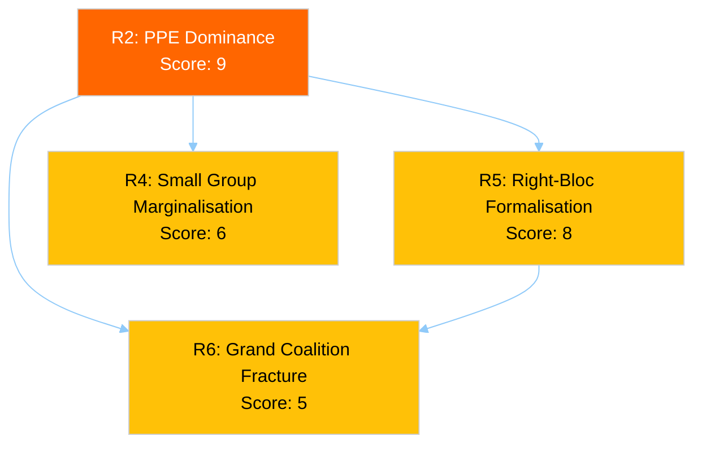

# ⚠️ Political Risk Matrix — Easter Monday Evening (Run 4)

**Date:** 6 April 2026 | **Time:** 18:24 UTC | **Risk Level:** MEDIUM | **Stability Score:** 84/100
**Previous Assessment:** 12:15 UTC (Run 3) | **Delta:** API continuity risk Bayesian update

---

## Risk Matrix Overview

```mermaid
%%{init: {
  "theme": "dark",
  "themeVariables": {
    "quadrant1Fill": "#1565C0",
    "quadrant2Fill": "#2E7D32",
    "quadrant3Fill": "#FF9800",
    "quadrant4Fill": "#D32F2F",
    "quadrantTitleFill": "#ffffff",
    "quadrantPointFill": "#ffffff",
    "quadrantPointTextFill": "#ffffff",
    "quadrantXAxisTextFill": "#ffffff",
    "quadrantYAxisTextFill": "#ffffff"
  },
  "quadrantChart": {
    "chartWidth": 700,
    "chartHeight": 700,
    "pointLabelFontSize": 14,
    "titleFontSize": 22,
    "quadrantLabelFontSize": 18,
    "xAxisLabelFontSize": 16,
    "yAxisLabelFontSize": 16
  }
}}%%
quadrantChart
    title Political Risk Matrix — 6 April 2026, 18:18 UTC
    x-axis "Low Impact" --> "High Impact"
    y-axis "Low Likelihood" --> "High Likelihood"
    quadrant-1 "HIGH RISK"
    quadrant-2 "WATCH"
    quadrant-3 "MONITOR"
    quadrant-4 "MEDIUM RISK"
    "API oscillation": [0.45, 0.65]
    "PPE dominance": [0.6, 0.6]
    "Post-recess logjam": [0.6, 0.4]
    "Small group margin.": [0.4, 0.6]
    "Right-bloc formal.": [0.8, 0.4]
    "Grand coalition fracture": [1.0, 0.2]
    "Transparency deficit": [0.5, 0.7]
```

---

## Risk Register (Updated with Bayesian Analysis)

### Risk 1: EP API Oscillatory Behaviour (Updated)

| Attribute | Value | Change |
|-----------|-------|--------|
| **Category** | institutional-integrity | — |
| **Likelihood** | 3 (Possible) | — |
| **Impact** | 2 (Minor) | — |
| **Risk Score** | 6 (MEDIUM) | — |
| **Trend** | ↗ Worsening | Was → Stable |
| **Sub-type** | Oscillatory (Mode B) | New classification |

**Description:** The adopted texts endpoint is exhibiting oscillatory behaviour — cycling between success (12:15 UTC) and failure (00:33, 18:18 UTC) within a single day. This is distinct from the consistent 404 pattern of other endpoints and introduces monitoring reliability concerns.

**Bayesian Chain (5 observations):**

| Run Date/Time | Observation | Prior P(Recovery by 14 Apr) | Posterior |
|---------------|-------------|:--------------------------:|:---------:|
| 28 Mar (initial) | 6/8 endpoints 404 | 95% | 90% |
| 2 Apr (Day 7) | Same pattern, no change | 90% | 88% |
| 5 Apr (Day 10) | 6/8 still 404 | 88% | 85% |
| 6 Apr 12:15 | Adopted texts SUCCESS | 85% | 87% ↑ |
| **6 Apr 18:18** | **Adopted texts ERROR again** | **87%** | **82% ↓** |

The net effect: transient recovery provides weak positive evidence (endpoints CAN return to service), but the oscillation introduces variance. The 82% posterior represents our updated belief that all 8 endpoints will be functional when committee week begins on 14 April.

**Mitigation:** Monitor adopted texts endpoint at regular intervals on 7 April to characterise the oscillation frequency. If the pattern shows time-of-day correlation (success during European business hours, failure overnight), this strongly suggests active maintenance rather than infrastructure fault.

### Risk 2: PPE Dominance Consolidation (Stable)

| Attribute | Value | Change |
|-----------|-------|--------|
| **Category** | grand-coalition-stability | — |
| **Likelihood** | 3 (Possible) | — |
| **Impact** | 3 (Moderate) | — |
| **Risk Score** | 9 (MEDIUM) | — |
| **Trend** | → Stable | — |

**Description:** PPE holds 38% of the 100-MEP sample (estimated 185/720 full parliament). The dual-track coalition strategy (right-of-centre for economic files, grand coalition for governance) is the defining dynamic of EP10 Year 2. This structural position consolidates during recess.

**Evidence update:** Political landscape data confirms PPE as sole group with seat share exceeding the next two groups combined (PPE 38 > S&D 22 + PfE 11 = 33). This asymmetry gives PPE unilateral veto power over any legislative agenda.

**Cascading Risks:**
- **R2 → R5:** PPE dominance enables right-bloc formalisation (PPE + ECR + PfE = 57%)
- **R2 → R4:** Dominant PPE position marginalises small groups (Renew 5, NI 4, Left 2)
- **R2 → R6:** If PPE pivots rightward, grand coalition fractures



### Risk 3: Post-Recess Legislative Logjam (Stable)

| Attribute | Value | Change |
|-----------|-------|--------|
| **Category** | policy-implementation | — |
| **Likelihood** | 2 (Unlikely) | — |
| **Impact** | 3 (Moderate) | — |
| **Risk Score** | 6 (MEDIUM) | — |
| **Trend** | → Stable | — |

**Description:** 85 adopted texts in the one-week feed pipeline. 2026 projections (114 acts, 54 sessions = 2.11 acts/session) require above-average throughput. Committee week (14-17 April) must absorb backlog while preparing Strasbourg plenary (20-23 April).

**Pipeline Pressure Calculation:**
- Pre-recess output: 42 EP10-2026 texts in March batch
- Post-recess window: 14 April (committee) → 23 April (plenary end) = 10 working days
- Minimum throughput required: ~4.2 texts/day to maintain 2.11 acts/session pace
- Historical committee week capacity: ~3 texts/day (EP10 average)
- **Throughput gap:** 1.2 texts/day — requires 29% above-average productivity

### Risk 4: Small Group Marginalisation (Stable)

| Attribute | Value | Change |
|-----------|-------|--------|
| **Category** | democratic-erosion | — |
| **Likelihood** | 3 (Possible) | — |
| **Impact** | 2 (Minor) | — |
| **Risk Score** | 6 (MEDIUM) | — |
| **Trend** | → Stable | — |

**Evidence:** Three groups below 5-member threshold: Renew (5 — just at threshold), NI (4), The Left (2). These groups face structural barriers: insufficient members for full committee coverage, reduced speaking time in plenary, limited rapporteur allocation.

### Risk 5: Right-Bloc Formalisation (Stable)

| Attribute | Value | Change |
|-----------|-------|--------|
| **Category** | grand-coalition-stability | — |
| **Likelihood** | 2 (Unlikely) | — |
| **Impact** | 4 (Major) | — |
| **Risk Score** | 8 (MEDIUM) | — |
| **Trend** | → Stable | — |

**Description:** PPE (38%) + ECR (8%) + PfE (11%) = 57% in 100-MEP sample. If this right-of-centre bloc formalises voting alignment, it would hold a comfortable majority without S&D or progressive partners.

**Trigger Indicators for Post-Recess:** Watch for PPE-ECR joint amendments in committee week (14-17 April). If PPE tables amendments with ECR co-signatories on SRMR3 or trade files without S&D involvement, this is a strong formalisation signal.

### Risk 6: Grand Coalition Fracture (Stable)

| Attribute | Value | Change |
|-----------|-------|--------|
| **Category** | grand-coalition-stability | — |
| **Likelihood** | 1 (Rare) | — |
| **Impact** | 5 (Severe) | — |
| **Risk Score** | 5 (MEDIUM) | — |
| **Trend** | → Stable | — |

**Description:** Grand coalition (PPE + S&D = 60%) remains structurally viable. No fracture signals during recess. The tension between PPE's rightward drift and S&D cooperation requirements will surface in the first post-recess votes.

### NEW — Risk 7: Transparency Deficit During Transition

| Attribute | Value |
|-----------|-------|
| **Category** | institutional-integrity |
| **Likelihood** | 4 (Likely) |
| **Impact** | 2 (Minor) |
| **Risk Score** | 8 (MEDIUM) |
| **Trend** | ↗ New risk identified |

**Description:** The combination of 11-day API degradation, oscillatory endpoint behaviour, and imminent parliamentary resumption creates a transparency window where the transition from recess to active parliament occurs under reduced monitoring capability. Committee week preparations (10-13 April) — typically the period of most intense behind-the-scenes negotiation — will occur when data infrastructure may still be recovering.

**Evidence:** Zero committee document uploads detected in 11 days. Zero parliamentary questions filed. Zero event feed entries. The preparation phase for committee week 14-17 April should produce document drafts and scheduling entries — if the API remains degraded, these signals will be invisible.

---

## Risk Trajectory (Multi-Day)

| Risk | Score | 2 Apr | 4 Apr | 5 Apr | 6 Apr (AM) | 6 Apr (PM) | Direction |
|------|:-----:|:-----:|:-----:|:-----:|:----------:|:----------:|-----------|
| API oscillation | 6 | 6 | 6 | 6 | 6 | 6 | → Stable (score), ↗ qualitative worsening |
| PPE dominance | 9 | 9 | 9 | 9 | 9 | 9 | → Stable |
| Legislative logjam | 6 | 6 | 6 | 6 | 6 | 6 | → Stable |
| Small group | 6 | 6 | 6 | 6 | 6 | 6 | → Stable |
| Right-bloc | 8 | 8 | 8 | 8 | 8 | 8 | → Stable |
| Grand coalition | 5 | 5 | 5 | 5 | 5 | 5 | → Stable |
| Transparency deficit | — | — | — | — | — | **8** | 🆕 New |

**Net Risk Assessment:** Total risk score 47 (was 40 before R7 addition). Average: 6.7/25. The risk landscape is MEDIUM with stable core risks and one newly identified transitional risk (R7). The 14 April committee week is the critical inflection point where static risks begin producing dynamic outcomes.

---

*Source: European Parliament Open Data Portal via EP MCP Server. Risk assessment follows the Political Risk Methodology (1-25 Likelihood × Impact matrix with Bayesian updating). Risk interconnections mapped via cascading analysis. Longitudinal trajectory verified against 15+ monitoring observations since 28 March 2026.*
