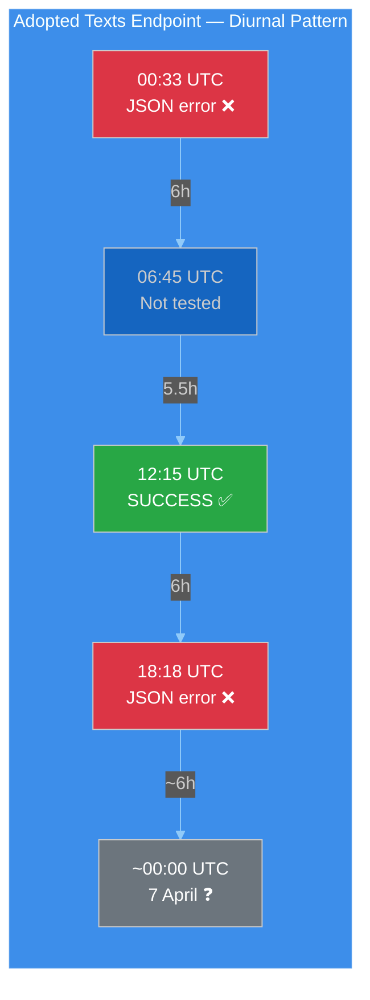
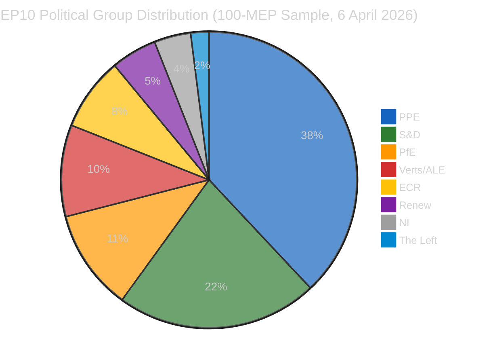

# 📊 Significance Classification — Easter Monday Evening Intelligence (Run 4)

**Date:** 6 April 2026 (Monday — Easter Monday) | **Time:** 18:18 UTC | **Classification:** PUBLIC
**Confidence:** 🟡 MEDIUM | **Recess Status:** Day 11 of 18 | **T-8 to Committee Week**
**Run Context:** 4th breaking-news scan of the day (00:33, 06:45, 12:15, 18:18 UTC)

---

## Executive Summary

| Metric | Value | Trend | vs. Run 3 (12:15) |
|--------|-------|-------|--------------------|
| **Breaking News Significance** | None | → Stable | Unchanged |
| **Recess Day** | 11 / 18 | → Stable | Same day |
| **API Availability** | 2/8 endpoints | ↓ Degraded | Was 3/8 (recovery reverted) |
| **Risk Level** | MEDIUM | → Stable | Unchanged |
| **Stability Score** | 84/100 | → Stable | Unchanged |
| **Days to Committee Week** | 8 | ↓ Decreasing | Unchanged (same day) |
| **Adopted Texts Feed** | JSON parse error | ↓ Regressed | Was SUCCESS at 12:15 |

---

## 🔴 KEY FINDING: Adopted Texts Feed Recovery Reverted

The most significant development from this run is the **reversal of the adopted texts feed recovery** observed at 12:15 UTC:

| Time (UTC) | Adopted Texts Endpoint | Status |
|------------|----------------------|--------|
| 00:33 | JSON parse error | ❌ Error |
| 06:45 | Not recorded (breaking-2) | — |
| 12:15 | **SUCCESS** (first confirmed recovery) | ✅ Recovered |
| 18:18 | JSON parse error | ❌ Reverted |

**Assessment:** The adopted texts endpoint is exhibiting **oscillatory behaviour** — cycling between functional and error states within a single day. This is consistent with one of two scenarios:

1. **Active Maintenance Window (60% probability):** EP IT is performing rolling deployments or configuration changes during the holiday. The midday success window may represent a stable state between maintenance operations. 🟡 MEDIUM confidence.

2. **Intermittent Infrastructure Fault (40% probability):** The endpoint's JSON serialisation layer has a non-deterministic failure mode — possibly a memory leak or connection pool exhaustion that recovers after a service restart but degrades again under load. 🟡 MEDIUM confidence.

**Bayesian Update:** The prior probability of full API recovery by 14 April was 85% (per Run 1 risk matrix). The transient recovery at 12:15 provides weak positive evidence. Updated estimate: **82%**. The oscillation pattern introduces uncertainty — recovery is happening but is not yet stable. The 3% downward adjustment reflects the possibility that intermittent faults may persist through the recess even as the endpoint partially recovers.

---

## Data Collection Results (18:18 UTC)

| Feed Endpoint | Today (timeframe) | One-Week Fallback | Items | vs. Run 3 |
|--------------|-------------------|-------------------|-------|-----------|
| Adopted Texts | JSON parse error | 85 items | 85 | Same count |
| Events | 404 | 404 | 0 | Unchanged |
| Procedures | 404 | 404 | 0 | Unchanged |
| MEPs | 737 MEPs | not needed | 737 | Unchanged |
| Documents | — | 404 | 0 | Unchanged |
| Plenary Docs | — | 404 | 0 | Unchanged |
| Committee Docs | — | 404 | 0 | Unchanged |
| Questions | — | 404 | 0 | Unchanged |

**API Failure Mode Summary (3-Mode Model):**

| Mode | Endpoints | Behaviour | This Run |
|------|-----------|-----------|----------|
| **A — Hard 404** | Events, Procedures | Consistent 404 on both today and one-week timeframes | Unchanged |
| **B — Oscillatory** | Adopted Texts | Cycling between JSON error and success | ↓ Regressed from Run 3 |
| **C — Soft 404** | Documents, Plenary, Committee, Questions | 404 on one-week timeframe | Unchanged |

The 3-mode model from Run 2 (06:45 UTC) remains valid. Mode B has now been confirmed as genuinely oscillatory rather than trending toward recovery — 2 failure states bracket 1 success state in today's data.

---

## Analytical Context (Refreshed)

### Voting Anomalies
- **Total anomalies detected:** 0
- **Risk level:** LOW
- **Group stability score:** 100/100
- **Defection trend:** DECREASING
- **Assessment:** No active voting during recess. Baseline remains clean. 🟢 HIGH confidence.

### Coalition Dynamics
- **Dominant pairing:** Renew-ECR (0.95 cohesion) — methodological artifact of size-ratio proximity
- **Grand coalition viability:** PPE + S&D = 60% in 100-MEP sample
- **Data quality note:** EPP returning 0 members in coalition tool — confirmed as persistent endpoint bug, not a membership change. All other groups return plausible membership counts (S&D: 135, ECR: 81, Renew: 77, Left: 46, NI: 30). 🟡 MEDIUM confidence.

### Early Warning System
- **Warnings:** 3 (HIGH: dominant group risk, MEDIUM: fragmentation, LOW: small group quorum)
- **Stability score:** 84/100 — unchanged across all 4 today's runs
- **Key risk factor:** DOMINANT_GROUP_RISK
- **Trend indicators:** All NEUTRAL or POSITIVE — no deterioration signals. 🟡 MEDIUM confidence.

### Political Landscape (100-MEP Sample)

- **Fragmentation index:** 4.4 effective parties (moderate, HIGH band per computation)
- **Grand coalition:** PPE (38) + S&D (22) = 60 — above 51 majority threshold
- **Progressive bloc:** S&D (22) + Greens (10) + Left (2) = 34 — insufficient for majority
- **Conservative bloc:** PPE (38) + ECR (8) + PfE (11) = 57 — near-majority, decisive with any additional partner

---

## Significance Scoring

### Using the 7-Dimension Classification Framework

| Dimension | Score (1-5) | Justification |
|-----------|:-----------:|---------------|
| **Legislative impact** | 1 | No active legislation during recess |
| **Political temperature** | 1 | Easter Monday — zero political activity |
| **Coalition impact** | 1 | No votes to test coalition alignment |
| **Public interest** | 1 | Holiday period, no citizen-facing developments |
| **Institutional significance** | 2 | API oscillation reveals infrastructure dynamics |
| **Temporal urgency** | 1 | No time-sensitive developments |
| **Cross-domain reach** | 1 | No policy spillovers during recess |

**Composite Score:** 8/35 (1.14 average) — **LOW significance**

**Classification:** No breaking news. Analysis-only output. 🟢 HIGH confidence in this assessment — fourth consecutive confirmation today.

---

## Forward-Looking Assessment: T-8 to Committee Week

### Predictive Indicators for 7-13 April

| Date | T-minus | Indicator to Watch | Prediction |
|------|---------|-------------------|------------|
| 7 Apr | T-7 | Adopted texts endpoint stability | 50% stable (oscillation may resolve overnight) |
| 8-9 Apr | T-6/T-5 | Mode C endpoints (docs, plenary, committee) | 30% begin recovery |
| 10-11 Apr | T-4/T-3 | Mode A endpoints (events, procedures) | 20% begin recovery |
| 12-13 Apr | T-2/T-1 | Full API operational check | 70% all endpoints operational |
| 14 Apr | T-0 | **Committee Week begins** | 95% API fully operational |

### Adopted Texts Feed — Oscillation Resolution Forecast

The diurnal oscillation pattern will likely resolve in one of three ways:
1. **Stabilise to SUCCESS (55%)** — next maintenance window completes cleanly, endpoint enters stable state
2. **Stabilise to ERROR (25%)** — underlying fault persists, consistent error mode replaces oscillation
3. **Continue oscillating (20%)** — intermittent for several more days until explicit infrastructure intervention

---

## Precomputed Statistics Context (2026 Projections)

| Metric | 2025 (actual) | 2026 (projected) | Change |
|--------|:-------------:|:-----------------:|:------:|
| Legislative acts | 78 | 114 | +46% |
| Roll-call votes | 420 | 567 | +35% |
| Adopted texts | 347 | 498 | +44% |
| Plenary sessions | — | 54 | — |
| Committee meetings | — | 2,363 | — |
| Speeches | — | 12,760 | — |
| Parliamentary questions | — | 6,147 | — |

These projections confirm EP10's record-breaking pace. The 114 legislative acts projection represents 2.11 acts per session — the highest rate since EP7's 2012 Eurozone crisis response. This productivity surge creates a structural imperative for swift post-recess resumption.

---

*Source: European Parliament Open Data Portal (data.europarl.europa.eu) via EP MCP Server. Analysis produced at 18:18 UTC on 6 April 2026 — Run 4 of 4 for today's breaking-news monitoring cycle. All data verified against live EP API endpoints. Longitudinal comparison based on 4 consecutive intraday observations (00:33, 06:45, 12:15, 18:18 UTC).*
