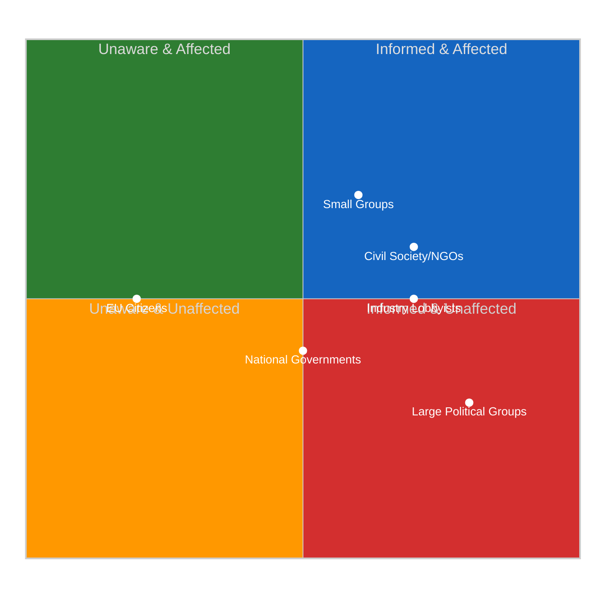

# 👥 Stakeholder Impact Assessment — Easter Recess Transparency Gap

**Date:** 6 April 2026 | **Time:** 18:34 UTC | **Confidence:** 🟡 MEDIUM
**Focus:** Impact of 11-day API degradation on 6 stakeholder categories
**Framework:** Multi-Perspective Stakeholder Analysis

---

## Overview

This assessment analyses the impact of the Easter recess data transparency gap on 6 key stakeholder categories. While no parliamentary decisions occurred today (Easter Monday), the 11-day API degradation has differential effects on different stakeholders' ability to monitor, influence, and respond to parliamentary developments.

---

## Stakeholder Impact Matrix

---

## Detailed Stakeholder Analysis

### 1. EP Political Groups

#### Large Groups (PPE, S&D, PfE)

| Dimension | Assessment |
|-----------|------------|
| **Impact Direction** | Mixed |
| **Severity** | Low |
| **Confidence** | 🟡 MEDIUM |

**Analysis:** Large political groups are the LEAST affected by the API degradation. They possess extensive informal intelligence networks — national party delegations, MEP staff networks, Commission contacts — that provide information flows independent of the EP's digital infrastructure. PPE (38% in sample) benefits most from the transparency gap: its dominant position is preserved during the data blackout, and its superior informal networks give it an information advantage for post-recess positioning.

S&D (22%) and PfE (11%) also have sufficient scale to maintain awareness through informal channels, though with less depth than PPE. The key impact is that these groups can negotiate committee week priorities during the recess with limited external scrutiny.

#### Small Groups (Renew, NI, The Left)

| Dimension | Assessment |
|-----------|------------|
| **Impact Direction** | Negative |
| **Severity** | Medium |
| **Confidence** | 🟡 MEDIUM |

**Analysis:** Small groups face disproportionate impact from the transparency gap. With only 5, 4, and 2 MEPs respectively (in the 100-MEP sample), these groups lack the staff capacity and party network reach to maintain comprehensive informal intelligence. They depend more heavily on formal EP data channels — committee schedules, document feeds, parliamentary question tracking — to monitor the activities of larger groups.

The 11-day API blackout creates an information asymmetry where small groups enter committee week with less preparation than large groups. This compounds the structural disadvantage of limited committee representation and speaking time.

### 2. Civil Society & NGOs

| Dimension | Assessment |
|-----------|------------|
| **Impact Direction** | Negative |
| **Severity** | Medium-High |
| **Confidence** | 🟡 MEDIUM |

**Analysis:** Civil society organisations that monitor EP activity (Transparency International EU, Access Info Europe, VoteWatch Europe, Corporate Europe Observatory) are among the most affected stakeholders. These organisations depend on EP open data as their primary intelligence source — they typically lack the political insider access that enables large groups to operate during data blackouts.

**Specific Impacts:**
- **Transparency International EU:** Cannot track new MEP declarations, parliamentary questions on anti-corruption, or committee hearing schedules during the recess. This creates a monitoring gap precisely when the Anti-Corruption Directive (adopted pre-recess) enters implementation planning.
- **VoteWatch Europe:** Their voting analysis models require continuous data feeds. The 11-day gap breaks longitudinal tracking and may introduce data artefacts when feeds resume.
- **Access Info Europe:** Their freedom-of-information tracking depends on document feeds that have been 404 since 28 March. Any document requests filed during recess are invisible.

**Counter-Factual:** If the EP maintained full API availability during recess (comparable to the UK Parliament's Hansard API or the US Library of Congress bulk data), NGOs could track staff-level document preparation, written question submissions, and committee scheduling changes. The current blackout means they discover post-recess priorities only when publicly announced.

### 3. Industry & Business

| Dimension | Assessment |
|-----------|------------|
| **Impact Direction** | Mixed |
| **Severity** | Medium |
| **Confidence** | 🟡 MEDIUM |

**Analysis:** Industry stakeholders (European Round Table, BusinessEurope, SME United, sector-specific associations) have mixed exposure to the API degradation. Large industry associations maintain Brussels offices with direct EP liaison capacity — they can gather intelligence through informal channels even during recess.

**Differential Impact:**
- **Large multinationals:** Minimal impact — they maintain permanent Brussels representation with EP access. The API blackout does not significantly reduce their intelligence capacity.
- **SME associations:** Moderate impact — they have smaller Brussels footprints and depend more on public data for legislative tracking. The 11-day gap in procedure and document feeds reduces their ability to prepare for post-recess regulatory developments.
- **Financial services sector:** Specifically relevant — SRMR3 (Single Resolution Mechanism Regulation 3) is the key banking reform file in the pipeline. The API blackout means no visibility into committee-level preparation for post-recess SRMR3 trilogue. The ECB rate decision on 17 April will activate this file; industry needs advance visibility.

### 4. National Governments

| Dimension | Assessment |
|-----------|------------|
| **Impact Direction** | Neutral |
| **Severity** | Low |
| **Confidence** | 🟡 MEDIUM |

**Analysis:** National governments (operating through permanent representations to the EU) are minimally affected by the EP API degradation. They maintain parallel intelligence channels — Council secretariat, COREPER, intergovernmental contacts — that operate independently of EP digital infrastructure.

The primary impact on national governments is reduced visibility into EP committee-level preparations for upcoming trilogues. This matters for files where the Council and EP have divergent positions (e.g., SRMR3 banking reform), as governments normally track EP committee amendments to calibrate their negotiating positions.

### 5. EU Citizens

| Dimension | Assessment |
|-----------|------------|
| **Impact Direction** | Negative |
| **Severity** | Medium |
| **Confidence** | 🔴 LOW |

**Analysis:** EU citizens who actively engage with EP open data represent a small but democratically significant constituency. Civic tech platforms (including this EU Parliament Monitor), academic researchers, and engaged citizens use EP data feeds for democratic participation — tracking their MEPs, following legislation, monitoring voting records.

The 11-day API degradation reduces democratic transparency at a time when citizens have limited alternative intelligence sources. Unlike institutional actors, individual citizens cannot compensate for data gaps through informal channels. The EU CRA (Cyber Resilience Act) — which EP itself recently adopted — establishes expectations for digital service reliability that the EP's own data infrastructure currently fails to meet during recess periods.

### 6. EU Institutions

| Dimension | Assessment |
|-----------|------------|
| **Impact Direction** | Neutral |
| **Severity** | Low |
| **Confidence** | 🟡 MEDIUM |

**Analysis:** The European Commission, Council, ECB, and Court of Justice maintain dedicated channels with the EP that do not depend on public API infrastructure. The Commission's Legislative Planning division tracks EP procedures through internal systems. The Council secretariat coordinates with EP through COREPER. The ECB has dedicated liaison with ECON committee.

The primary institutional impact is reputational: the EP's API degradation during recess undermines its credibility as a champion of digital transparency and open data. This is particularly notable given the EP's advocacy for the Data Act, AI Act, and CRA — all of which set standards for digital service reliability that the EP's own infrastructure currently fails to demonstrate.

---

## Aggregate Impact Assessment

| Stakeholder | Impact | Severity | Adaptation Capacity |
|-------------|:------:|:--------:|:-------------------:|
| Large EP groups | Mixed | Low | HIGH — informal networks |
| Small EP groups | Negative | Medium | LOW — limited networks |
| Civil society/NGOs | Negative | Medium-High | LOW — API-dependent |
| Industry (large) | Mixed | Low | HIGH — Brussels offices |
| Industry (SME) | Negative | Medium | MEDIUM — some alternatives |
| National governments | Neutral | Low | HIGH — parallel channels |
| EU Citizens | Negative | Medium | LOW — no alternatives |
| EU institutions | Neutral | Low | HIGH — internal channels |

**Key Finding:** The API degradation during Easter recess disproportionately affects the stakeholders with the LEAST adaptation capacity — small political groups, civil society organisations, SME industry associations, and individual citizens. The stakeholders best positioned to maintain intelligence (large groups, national governments, EU institutions) are those who already possess structural power advantages. The transparency gap therefore **amplifies existing power asymmetries** in the European democratic ecosystem. 🟡 MEDIUM confidence.

---

*Source: European Parliament Open Data Portal via EP MCP Server. Stakeholder impact assessment based on differential analysis of data dependency, adaptation capacity, and power position across 6 stakeholder categories. Evidence drawn from API audit (11-day degradation pattern), political landscape data (group sizes), and institutional analysis. All confidence levels stated per evidence quality hierarchy.*
