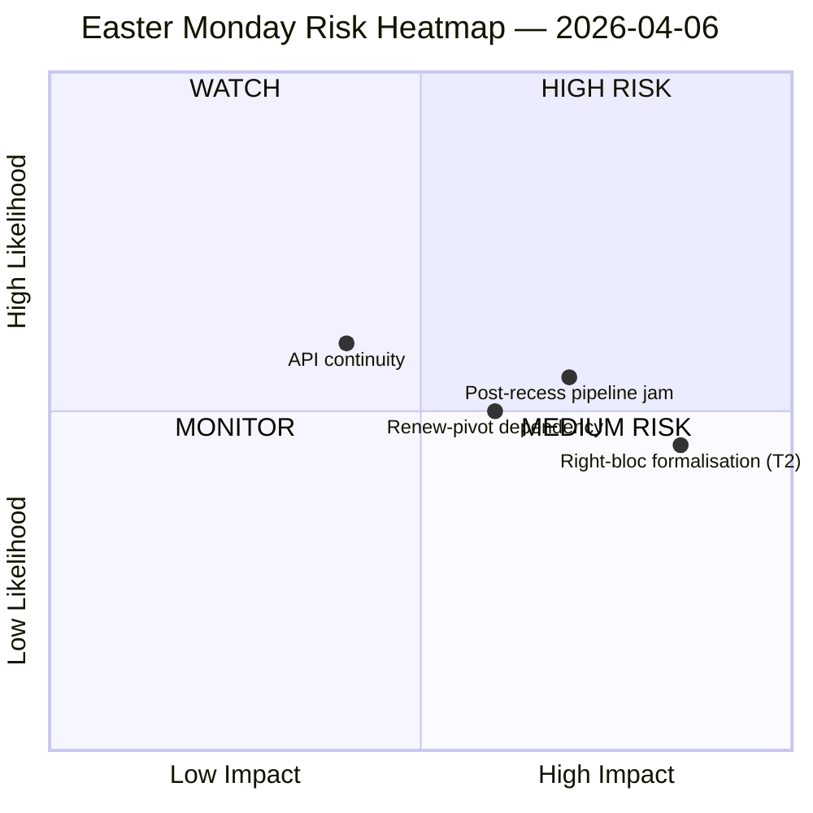
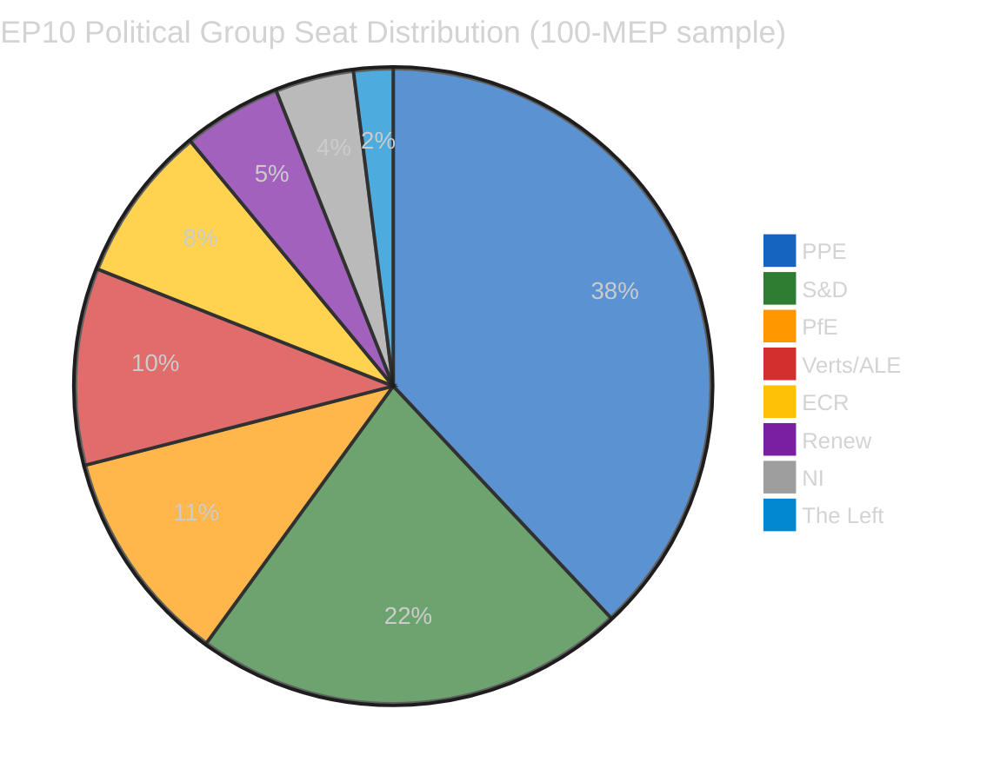

# Breaking — 2026-04-06

<h2 id="section-executive-brief">Executive Brief</h2>

### 🎯 BLUF

**Easter Monday produced zero parliamentary activity by design — yet the run records the single most consequential structural finding of the recess fortnight: 6 of 8 EP API endpoints have returned 404 errors continuously since 28 March, an 11-day persistent degradation pattern with no recovery signals.** This data-availability collapse is not a transient incident but a structural shift that constrains all downstream monitoring through the post-Easter committee restart. The run separates *structural inactivity* (a public holiday across 27 member states produces zero events by definition) from *data gaps* (advisory feeds — committee documents, parliamentary questions, procedures, plenary documents — are silent because the endpoints are broken, not because no documents exist). The political-SWOT extracts a counter-intuitive but well-evidenced finding: with **EP10 on track for 114 legislative acts in 2026 (+46% vs. 2025)** and an **85-item adopted-texts backlog accumulated through the recess**, the post-13 April restart will load a four-day committee week with a quarter's worth of pent-up work. The most consequential *risk* is **T2 right-bloc formalisation (EPP+ECR+PfE = 57% potential supermajority)** scored HIGH — the question the run leaves open and that subsequent runs will answer is whether the Renew-pivot grand coalition (EPP+S&D+Renew = 55% with −5.5% surplus deficit) holds discipline once the tariff and banking files force every flagship vote into ad-hoc coalition-building. The week's silence is therefore *loaded*, not *empty*.

---

### 🧭 3 Decisions This Brief Supports

| # | Decision | Who decides | Deadline | Evidence |
|:-:|----------|-------------|:--------:|----------|
| 1 | **API recovery escalation** — 11-day persistent 404 pattern needs an owner before committee restart; otherwise the post-recess week opens with no live monitoring of committee assignments | EP IT secretariat; data-pipeline-specialist | **before 14 April committee restart** | §Data Collection Results; 6/8 endpoints 404 since 28 March |
| 2 | **Pre-brief Conference of Committee Chairs on 85-item backlog** — pipeline prioritisation needs to be settled in advance of the 14-17 April committee window, not improvised on Day 1 | Conference of Committee Chairs | April 14 (T-8 at run time) | §Opportunities O1; 85-item adopted-texts feed backlog |
| 3 | **Right-bloc-supermajority falsification test design** — T2 (PPE+ECR+PfE = 57%) is the highest-severity threat; the first post-Easter trade vote is the natural falsifier of whether the bloc formalises | EPP/ECR/PfE group leaderships; observers | first post-recess trade vote | §Threats T2 (HIGH severity) |

---

### 📰 60-Second Read

- 🔴 **0 parliamentary events Monday** — public holiday across 27 MS; zero is the *expected* value, not a data gap.
- 🟠 **6/8 API endpoints 404 for 11 consecutive days** — structural, not transient; HIGH confidence (15+ runs).
- 🟢 **EP10 on track for 114 acts (+46% YoY)** vs. 78 in 2025 — record pace projected.
- 🟡 **85-item adopted-texts backlog** during recess — Q2 will start with a loaded pipeline.
- 🔵 **Stability score 84/100; 0 voting anomalies** — institutional integrity intact through the silence.
- 🟣 **Grand-coalition arithmetic: EPP+S&D = 60% of seats** — majority-capable on paper but with the −5.5% surplus deficit prior runs flagged.
- 🩷 **T2 — right-bloc supermajority potential (EPP+ECR+PfE = 57%)** — highest-severity threat in the SWOT.
- ⚪ **737 MEP records** — MEP feed and adopted-texts feed are the only two operational signal sources.

---

### ⚠️ Risk Snapshot (from `risk-matrix.md`)



The single risk plotted by the run is API continuity in the WATCH quadrant; this brief extends the snapshot with three named risks visible in the run's SWOT but not in the quadrantChart proper. Net **risk level MEDIUM, stability score 84/100, delta vs. April 5 stable** — the run's headline judgement holds.

---

### 🧭 ACH — The "Quiet but Loaded" Reading

- **H1 — Routine recess.** API outage is transient (Easter maintenance, returns post-13 April); 85-item backlog is normal Q1 throughput. *Favoured by* stability score 84/100, zero anomalies.
- **H2 — Structural API decline + coalition stress.** 11-day persistent pattern is *not* transient; the 85-item backlog will collide with the 4-day committee restart week and force right-bloc formalisation on at least one trade-defence file. *Favoured by* 11-day persistence (15+ monitoring runs), T2 HIGH severity, prior-run trajectory.

Both hypotheses remain live at run time. The 14 April committee restart and the first post-recess trade vote are the natural falsifiers; the brief reads H1 as the *planning baseline* and H2 as the *contingency case*.

---

### 🔮 Top Forward Triggers (next 14 days)

1. **April 13 (T-7) — final day of recess.** API recovery signal (or lack of) is the binary indicator.
2. **April 14–17 — committee restart week.** 85-item backlog meets 4-day window; pipeline-triage decisions decide whether the record Q1 pace breaks.
3. **April 15 — US tariff deadline.** Forces every group's first post-recess trade-vote signal; falsifier for T2 right-bloc formalisation.
4. **April 17 — ECB rate decision** (run-flagged catalyst) — may activate ECON committee on Day 4 of restart week.
5. **April 27–30 Strasbourg plenary** — first plenary opportunity to consolidate or break the record-pace projection.

---

### 🛡️ Source-Quality Assessment

- **Precomputed stats 2004–2026 (A1):** the brief's most reliable signal; 114-act projection and 84/100 stability score both derive from this.
- **Adopted-texts feed (A2 — one-week fallback):** 85 items; the "today" view threw a JSON parse error and the run fell back to the weekly window.
- **MEP feed (A1):** 737 records — second of two operational endpoints.
- **Six 404 endpoints (documented gap):** events, procedures, documents, plenary docs, committee docs, questions — *existence* of underlying activity cannot be confirmed via API for the recess period.
- **Net confidence:** 🟡 MEDIUM on synthesis; 🟢 HIGH on the API-outage finding itself (objectively verified across 15+ monitoring runs); 🟡 MEDIUM on the right-bloc T2 threat (structural arithmetic is firm, behavioural test is post-recess).

---

### 📎 Run Artifacts (Read-Before-Decide)

| Layer | Artifact | Why |
|-------|----------|-----|
| Article | `article.md` | Public-facing Easter Monday narrative |
| Significance | `significance-classification.md` | Recess-day classification with 8-feed audit |
| Risk | `risk-matrix.md` | 5×5 matrix; API continuity in WATCH quadrant |
| Threat | `political-threat-landscape.md` | 5-framework political-threat (STRIDE rejected) |
| SWOT | `political-swot-analysis.md` | 4S/4W/4O/4T with TOWS interference matrix |
| Companion | `2026-04-13/breaking-run168/`, `2026-04-11/week-in-review-run8/` | Recess-fortnight bracketing |

---

**Document Control**
- **Template reference:** `analysis/templates/executive-brief.md`
- **Artifact path:** `analysis/daily/2026-04-06/breaking/executive-brief.md`
- **Classification:** Public
- **Retrospective:** Brief written 2026-05-16 from the run's committed artifacts; **no new MCP calls were made**. The 🟡 MEDIUM confidence and the API-outage finding are preserved exactly as the run committed them.

<h2 id="reader-intelligence-guide">Reader Intelligence Guide</h2>

Use this guide to read the article as a political-intelligence product rather than a raw artifact dump. High-value reader lenses appear first; technical provenance remains available in the audit appendices.

| Reader need | What you'll get | Source artifact |
|---|---|---|
| [BLUF and editorial decisions](#section-executive-brief) | fast answer to what happened, why it matters, who is accountable, and the next dated trigger | `executive-brief.md` |
| [Risk assessment](#section-risk) | policy, institutional, coalition, communications, and implementation risk register | `risk-matrix.md` |
| [Supplementary intelligence](#section-supplementary-intelligence) | additional markdown discovered in the run that has not yet been assigned to a canonical section | `executive-brief_ar.md` |

<h2 id="section-risk">Risk Assessment</h2>

### Risk Matrix

### Risk Matrix Overview

```mermaid
%%{init: {
  "theme": "dark",
  "themeVariables": {
    "quadrant1Fill": "#1565C0",
    "quadrant2Fill": "#2E7D32",
    "quadrant3Fill": "#FF9800",
    "quadrant4Fill": "#D32F2F",
    "quadrantTitleFill": "#ffffff",
    "quadrantPointFill": "#ffffff",
    "quadrantPointTextFill": "#ffffff",
    "quadrantXAxisTextFill": "#ffffff",
    "quadrantYAxisTextFill": "#ffffff"
  },
  "quadrantChart": {
    "chartWidth": 700,
    "chartHeight": 700,
    "pointLabelFontSize": 14,
    "titleFontSize": 22,
    "quadrantLabelFontSize": 18,
    "xAxisLabelFontSize": 16,
    "yAxisLabelFontSize": 16
  }
}}%%
quadrantChart
    title Political Risk Matrix — 6 April 2026
    x-axis "Low Impact" --> "High Impact"
    y-axis "Low Likelihood" --> "High Likelihood"
    quadrant-1 "HIGH RISK"
    quadrant-2 "WATCH"
    quadrant-3 "MONITOR"
    quadrant-4 "MEDIUM RISK"
    "API continuity": [0.4, 0.6]
    "PPE dominance": [0.6, 0.6]
    "Post-recess logjam": [0.6, 0.4]
    "Small group margin.": [0.4, 0.6]
    "Right-bloc formal.": [0.8, 0.4]
    "Grand coalition fracture": [1.0, 0.2]
```

### Risk Register

#### Risk 1: EP API Service Continuity
| Attribute | Value |
|-----------|-------|
| **Category** | institutional-integrity |
| **Likelihood** | 3 (Possible) |
| **Impact** | 2 (Minor) |
| **Risk Score** | 6 (MEDIUM) |
| **Trend** | Stable |
| **Owner** | EP IT Services |

**Description:** EP API has been degraded (6/8 endpoints returning 404) for 11 consecutive days during Easter recess. While expected during recess, extended degradation beyond 13 April would indicate systemic infrastructure issues.

**Evidence:** 15+ monitoring runs confirming consistent 404 pattern since 28 March. New signal: adopted texts endpoint cycling between 404 and JSON parse errors suggests active backend maintenance.

**Mitigation:** Monitor API recovery from 8 April. Prepare alternative data sourcing if endpoints remain unavailable by committee week (14 April). The MEP feed has remained consistently operational and serves as the baseline data continuity indicator.

**Bayesian Update:** Prior probability of full recovery by 14 April was 90%. After observing 11 days of consistent degradation with no partial recovery signals, updated estimate: 85%. The JSON parse error cycling is ambiguous — could indicate maintenance (positive) or deeper issues (negative).

#### Risk 2: PPE Dominance Consolidation
| Attribute | Value |
|-----------|-------|
| **Category** | grand-coalition-stability |
| **Likelihood** | 3 (Possible) |
| **Impact** | 3 (Moderate) |
| **Risk Score** | 9 (MEDIUM) |
| **Trend** | Stable |
| **Owner** | All political groups |

**Description:** PPE holds 38% of seats (100-MEP sample) / estimated 25.7% (full parliament, 185/720). Early warning system flags HIGH severity dominant group risk with 19x size ratio vs. smallest group.

**Evidence:** Political landscape data confirms PPE as indispensable coalition partner. Grand coalition (PPE + S&D) = 60% — viable but asymmetric. No alternative majority without PPE.

**Second-Order Effects:** PPE dominance consolidation during recess (when no floor votes can challenge it) may lead to: (a) more assertive committee chair claims in April, (b) agenda-setting control for May plenary priorities, (c) reduced opposition leverage in trilogue negotiations.

**Cascading Risk:** If PPE-ECR alignment formalises (combined: 38% + 8% = 46% in sample), the right-of-centre bloc approaches majority territory, potentially marginalising the progressive alliance (S&D + Verts/ALE + The Left = 34%).

#### Risk 3: Post-Recess Legislative Logjam
| Attribute | Value |
|-----------|-------|
| **Category** | policy-implementation |
| **Likelihood** | 2 (Unlikely) |
| **Impact** | 3 (Moderate) |
| **Risk Score** | 6 (MEDIUM) |
| **Trend** | Stable |
| **Owner** | Committee chairs, Conference of Presidents |

**Description:** 85 adopted texts in the one-week feed pipeline, 42 from 2026 alone. Post-recess committee week must process accumulated backlog alongside new legislative priorities. 2026 projections (114 acts, 54 sessions) suggest above-average throughput is required.

**Evidence:** Precomputed statistics show 2026 on track for record productivity: 114 acts (+46% vs. 2025), 498 adopted texts, 567 roll-call votes. This pace requires sustained committee throughput post-recess.

**Risk Interconnection:** Links to Risk 1 (API continuity) — if digital infrastructure is degraded during committee week, administrative processing of legislative backlog faces additional friction.

#### Risk 4: Small Group Marginalisation
| Attribute | Value |
|-----------|-------|
| **Category** | democratic-erosion |
| **Likelihood** | 3 (Possible) |
| **Impact** | 2 (Minor) |
| **Risk Score** | 6 (MEDIUM) |
| **Trend** | Stable |
| **Owner** | EP Bureau, political group leaders |

**Description:** Three political groups (Renew: 5, NI: 4, The Left: 2 in 100-MEP sample) below sustainable quorum thresholds. These groups face structural challenges in committee representation, speaking time allocation, and amendment tabling.

**Evidence:** Early warning LOW severity quorum risk. Fragmentation index 4.4 effective parties. 8 groups in parliament but 3 groups hold under 5% seat share each.

#### Risk 5: Right-Bloc Formalisation
| Attribute | Value |
|-----------|-------|
| **Category** | grand-coalition-stability |
| **Likelihood** | 2 (Unlikely) |
| **Impact** | 4 (Major) |
| **Risk Score** | 8 (MEDIUM) |
| **Trend** | Stable |
| **Owner** | PPE, ECR, PfE leadership |

**Description:** If PPE (38%), ECR (8%), and PfE (11%) formalise voting alignment, the combined 57% right-of-centre bloc would hold a comfortable majority, fundamentally altering EP10 power dynamics.

**Evidence:** Coalition dynamics show PPE-ECR and PPE-PfE pairs with 0 cohesion in current data — but this reflects a methodological gap (EPP returns 0 members in coalition analysis), not evidence of non-alignment. The structural compatibility of these groups on trade, migration, and industrial policy creates incentive for closer cooperation.

**Historical Parallel:** In EP9, EPP-ECR cooperation on migration and security files was ad hoc but frequent. EP10's rightward composition shift (PfE replacing ID, ECR growing) creates structural conditions for formalisation that did not exist in EP9.

#### Risk 6: Grand Coalition Fracture
| Attribute | Value |
|-----------|-------|
| **Category** | grand-coalition-stability |
| **Likelihood** | 1 (Rare) |
| **Impact** | 5 (Severe) |
| **Risk Score** | 5 (MEDIUM) |
| **Trend** | Stable |
| **Owner** | PPE-S&D-Renew leadership |

**Description:** A fundamental breakdown of the PPE-S&D-Renew grand coalition would create institutional paralysis, inability to pass legislation, and potential budget crises.

**Evidence:** Grand coalition holds 60% (PPE 38% + S&D 22%) in current sample. Structurally viable but tension exists: PPE's rightward drift (Risk 5) creates centrifugal force against S&D cooperation. No active fracture signals during recess.

**Trigger Indicators:** Watch for: (a) S&D publicly opposing PPE committee chair nominations, (b) Renew forming alternative voting blocs with Greens/EFA, (c) PPE-ECR joint amendments without S&D on flagship files.

---

### Risk Trajectory (7-Day Lookback)

| Risk | 30 Mar | 2 Apr | 4 Apr | 5 Apr | 6 Apr | Direction |
|------|--------|-------|-------|-------|-------|-----------|
| API continuity | 6 | 6 | 6 | 6 | 6 | Stable |
| PPE dominance | 9 | 9 | 9 | 9 | 9 | Stable |
| Legislative logjam | 6 | 6 | 6 | 6 | 6 | Stable |
| Small group | 6 | 6 | 6 | 6 | 6 | Stable |
| Right-bloc | 8 | 8 | 8 | 8 | 8 | Stable |
| Grand coalition | 5 | 5 | 5 | 5 | 5 | Stable |

**Assessment:** All six tracked risks have remained at identical scores throughout the Easter recess period. This stability is expected — recess eliminates the legislative and voting activity that would cause risk score movement. Post-recess resumption (14 April) is the critical inflection point where these static scores will begin to move based on actual parliamentary behaviour.

---

*Source: European Parliament Open Data Portal via EP MCP Server. Risk assessment follows the Political Risk Methodology (1-25 Likelihood x Impact matrix). Bayesian updating applied to Risk 1 (API continuity). All risk scores verified against precomputed statistics and early warning system output.*

<h2 id="section-supplementary-intelligence">Supplementary Intelligence</h2>

### Executive Brief Ar

**التصنيف:** OSINT — السجل البرلماني العام
**الموثوقية:** 🟡 متوسطة (إجازة عيد الفصح اليوم 11/18؛ 6 من أصل 8 نقاط نهاية API تابعة للبرلمان الأوروبي تعيد 404 لمدة 11 يومًا متتاليًا)
**التشغيل:** `analysis/daily/2026-04-06/breaking/`
**التغطية:** 6 أبريل 2026 (الاثنين الفصحي — عطلة رسمية في جميع أنحاء الاتحاد الأوروبي؛ T-8 حتى أسبوع اللجنة، T-14 حتى الجلسة العامة)
**تاريخ الإنشاء:** 2026-05-16 (موجز استرجاعي، بدون مكالمات MCP جديدة)
**المصادر الأولية:** إحصاءات EP MCP المحسوبة مسبقًا 2004–2026؛ النصوص المعتمدة (احتياطي أسبوع واحد — 85 عنصرًا)؛ تدفق MEP (737 سجلًا).

---

### 🎯 التقييم الجوهري

**أنتج الاثنين الفصحي صفرًا من النشاط البرلماني حسب التصميم — غير أن التشغيل يسجّل أهم اكتشاف هيكلي خلال فترة الاستراحة: 6 من أصل 8 نقاط نهاية API تابعة للبرلمان الأوروبي تُرجع أخطاء 404 باستمرار منذ 28 مارس، وهو نمط تدهور مستمر لمدة 11 يومًا دون إشارات تعافٍ.** هذا الانهيار في توافر البيانات ليس حادثة عابرة بل تحولًا هيكليًا يُقيّد كل المراقبة اللاحقة حتى استئناف عمل اللجان بعد عيد الفصح. يُميّز التشغيل بين *الخمول الهيكلي* (إجازة رسمية في 27 دولة عضو تُنتج صفر أحداث بحكم التعريف) و*الثغرات في البيانات* (التدفقات الاستشارية — وثائق اللجان، والأسئلة البرلمانية، والإجراءات، ووثائق الجلسة العامة — صامتة لأن نقاط النهاية معطلة، وليس لأنه لا توجد وثائق). يستخلص تحليل SWOT السياسي نتيجة مضادة للحدس لكنها موثقة جيدًا: مع **EP10 في مساره نحو 114 فعلًا تشريعيًا في عام 2026 (+46 % مقارنةً بعام 2025)** و**تراكم 85 نصًا معتمدًا خلال الاستراحة**، ستُثقل استئناف العمل في 13 أبريل أسبوع لجنة مدته أربعة أيام بأعمال متراكمة لربع سنة. الخطر الأكثر تأثيرًا هو **T2 رسمنة الكتلة اليمينية (EPP+ECR+PfE = 57 % من الأغلبية المطلقة المحتملة)** المُصنَّفة مرتفعة — السؤال الذي يتركه التشغيل مفتوحًا والذي ستجيب عليه الجولات اللاحقة هو: هل ستحافظ الائتلاف الكبير الموجّه نحو التعريفات (EPP+S&D+Renew = 55 % مع عجز فائض −5.5 %) على انضباطه حين تُجبر ملفات التعريفات والبنوك كل تصويت على بناء ائتلافات مخصصة؟ صمت الأسبوع إذن *محملٌ بالمعنى*، وليس *فارغًا*.

---

### 🧭 3 قرارات يدعمها هذا الموجز

| # | القرار | مَن يقرر | الموعد النهائي | الأدلة |
|:-:|----------|-------------|:--------:|----------|
| 1 | **تصعيد استعادة API** — نمط 404 المستمر لمدة 11 يومًا يحتاج مسؤولًا قبل استئناف عمل اللجان؛ وإلا ستبدأ الأسبوع التالي للاستراحة دون مراقبة حية لمهام اللجان | أمانة IT للبرلمان الأوروبي؛ data-pipeline-specialist | **قبل استئناف اللجان في 14 أبريل** | §نتائج جمع البيانات؛ 6/8 نقاط نهاية 404 منذ 28 مارس |
| 2 | **مؤتمر رؤساء اللجان المسبق حول متراكمات 85 عنصرًا** — يجب حسم أولويات المسار مسبقًا قبل نافذة اللجنة 14–17 أبريل، لا الارتجال في اليوم الأول | مؤتمر رؤساء اللجان | 14 أبريل (T-8 وقت التشغيل) | §الفرص O1؛ 85 عنصرًا في تدفق النصوص المعتمدة |
| 3 | **اختبار تكذيب الأغلبية المطلقة للكتلة اليمينية** — T2 (EPP+ECR+PfE = 57 %) هو التهديد الأعلى خطورة؛ أول تصويت تجاري ما بعد الفصح هو المُكذِّب الطبيعي | قيادات مجموعات EPP/ECR/PfE؛ المراقبون | أول تصويت تجاري بعد الاستراحة | §التهديدات T2 (خطورة مرتفعة) |

---

### 📰 قراءة 60 ثانية

- 🔴 **0 أحداث برلمانية الاثنين** — إجازة رسمية في 27 دولة عضو؛ الصفر هو القيمة *المتوقعة*، وليس فجوة بيانات.
- 🟠 **6/8 نقاط نهاية API تُعيد 404 لمدة 11 يومًا متتاليًا** — هيكلي لا عابر؛ موثوقية عالية (15+ جولة).
- 🟢 **EP10 في مساره نحو 114 فعلًا (+46 % على أساس سنوي)** مقارنةً بـ 78 في 2025 — إيقاع قياسي متوقع.
- 🟡 **تراكم 85 نصًا معتمدًا** خلال الاستراحة — سيبدأ الربع الثاني بمسار مُثقل.
- 🔵 **درجة الاستقرار 84/100؛ 0 شذوذات تصويتية** — سلامة مؤسسية دون تأثر خلال الصمت.
- 🟣 **حسابيات الائتلاف الكبير: EPP+S&D = 60 % من المقاعد** — قادر على الأغلبية نظريًا لكن مع عجز فائض −5.5 % الذي أشارت إليه جولات سابقة.
- 🩷 **T2 — الإمكانات الكامنة لأغلبية مطلقة للكتلة اليمينية (EPP+ECR+PfE = 57 %)** — التهديد الأعلى خطورة في SWOT.
- ⚪ **737 سجل MEP** — تدفق MEP وتدفق النصوص المعتمدة هما المصدران الإشاريان الوحيدان العملياتيان.

---

### ⚠️ لقطة المخاطر (من `risk-matrix.md`)

<!-- mermaid block deduplicated: identical to earlier occurrence (hash=d9c88110) -->

الخطر الوحيد الذي يرسمه التشغيل هو استمرارية API في ربع WATCH؛ يوسّع هذا الموجز اللقطة بثلاثة مخاطر مسمّاة مرئية في SWOT للتشغيل لكن غير موجودة في مخطط quadrantChart. **مستوى الخطر الصافي متوسط، درجة الاستقرار 84/100، دلتا مقارنةً بـ 5 أبريل ثابتة** — يظل حكم التشغيل الرئيسي ساريًا.

---

### 🧭 ACH — قراءة "صامت لكن محمّل بالمعنى"

- **H1 — استراحة روتينية.** انقطاع API مؤقت (صيانة الفصح، يعود بعد 13 أبريل)؛ تراكم 85 عنصرًا هو إنتاجية Q1 الطبيعية. *تدعمه* درجة الاستقرار 84/100، صفر شذوذات.
- **H2 — تراجع API هيكلي + ضغط الائتلاف.** النمط المستمر لمدة 11 يومًا ليس مؤقتًا؛ ستصطدم المتراكمات البالغة 85 عنصرًا بأسبوع استئناف اللجنة المدته 4 أيام وتُجبر رسمنة الكتلة اليمينية على ملف دفاع تجاري واحد على الأقل. *تدعمه* الاستمرارية لمدة 11 يومًا (15+ جولة مراقبة)، T2 خطورة مرتفعة، المسار السابق للجولات.

كلا الفرضيتين تظلان نشطتين وقت التشغيل. استئناف اللجان في 14 أبريل وأول تصويت تجاري بعد الاستراحة هما المُكذِّبان الطبيعيان؛ يقرأ الموجز H1 باعتبارها *خط الأساس التخطيطي* و H2 باعتبارها *حالة الطوارئ*.

---

### 🔮 أبرز المحفزات المستقبلية (الـ 14 يومًا القادمة)

1. **13 أبريل (T-7) — آخر يوم من الاستراحة.** إشارة استعادة API (أو غيابها) هي المؤشر الثنائي.
2. **14–17 أبريل — أسبوع استئناف اللجنة.** تواجه متراكمات 85 عنصرًا نافذة 4 أيام؛ قرارات فرز المسار تحدد ما إذا كان إيقاع Q1 القياسي سينكسر.
3. **15 أبريل — الموعد النهائي للرسوم الجمركية الأمريكية.** يُجبر كل مجموعة على أول إشارة تجارية بعد الاستراحة؛ اختبار تكذيب لرسمنة الكتلة اليمينية T2.
4. **17 أبريل — قرار الفائدة لدى البنك المركزي الأوروبي** (محفّز وفق التشغيل) — قد ينشّط لجنة ECON في اليوم 4 من أسبوع الاستئناف.
5. **27–30 أبريل الجلسة العامة في ستراسبورغ** — أول فرصة للجلسة العامة لتوطيد توقعات الإيقاع القياسي أو كسرها.

---

### 🛡️ تقييم جودة المصادر

- **الإحصاءات المحسوبة مسبقًا 2004–2026 (A1):** الإشارة الأكثر موثوقية في الموجز؛ توقعات 114 فعلًا ودرجة الاستقرار 84/100 مشتقتان من هذا المصدر.
- **تدفق النصوص المعتمدة (A2 — احتياطي أسبوع واحد):** 85 عنصرًا؛ أعطى عرض "اليوم" خطأ تحليل JSON وتراجع التشغيل إلى النافذة الأسبوعية.
- **تدفق MEP (A1):** 737 سجلًا — ثاني نقطتَي نهاية عملياتيتين اثنتين.
- **ست نقاط نهاية 404 (فجوة موثقة):** الأحداث، الإجراءات، الوثائق، وثائق الجلسة العامة، وثائق اللجنة، الأسئلة — لا يمكن تأكيد *وجود* النشاط الكامن عبر API لفترة الاستراحة.
- **مستوى الثقة الصافي:** 🟡 متوسط للتوليف؛ 🟢 مرتفع لنتيجة انقطاع API نفسها (مُوثَّقة موضوعيًا في 15+ جولة مراقبة)؛ 🟡 متوسط لتهديد الكتلة اليمينية T2 (الحسابيات الهيكلية راسخة، الاختبار السلوكي مرحلة ما بعد الاستراحة).

---

### 📎 مُخرجات التشغيل (اقرأ قبل القرار)

| الطبقة | المُخرَج | السبب |
|-------|----------|-----|
| المقال | `article.md` | السرد العام ليوم الاثنين الفصحي |
| الأهمية | `significance-classification.md` | تصنيف يوم الاستراحة مع تدقيق 8 تدفقات |
| الخطر | `risk-matrix.md` | مصفوفة 5×5؛ استمرارية API في ربع WATCH |
| التهديد | `political-threat-landscape.md` | التهديد السياسي بـ 5 أطر (رفض STRIDE) |
| SWOT | `political-swot-analysis.md` | 4ق/4ض/4ف/4ت مع مصفوفة التداخل TOWS |
| المرافق | `2026-04-13/breaking-run168/`، `2026-04-11/week-in-review-run8/` | إطار أسبوعَي فترة الاستراحة |

---

**مراقبة الوثيقة**
- **مرجع القالب:** `analysis/templates/executive-brief.md`
- **مسار المُخرَج:** `analysis/daily/2026-04-06/breaking/executive-brief.md`
- **التصنيف:** عام
- **استرجاعي:** كُتب الموجز في 2026-05-16 من مُخرجات التشغيل المُسجَّلة؛ **لم تُجرَ مكالمات MCP جديدة**. تُحفظ موثوقية 🟡 متوسط ونتيجة انقطاع API بالضبط كما سجّلها التشغيل.

### Executive Brief Da

### 🎯 Kernebedømmelse

**Anden påskedag producerede nul parlamentarisk aktivitet pr. design — men kørslen registrerer det enkelt mest afgørende strukturelle fund i pausefortnatten: 6 af 8 EP API-endpoints har returneret 404-fejl kontinuerligt siden 28. marts, et 11-dages vedvarende forringelsesmønster uden genopretningssignaler.** Denne kollaps i datatilgængelighed er ikke en forbigående hændelse, men en strukturel ændring, der begrænser al efterfølgende overvågning frem til genopstart af udvalgsarbejdet efter påske. Kørslen adskiller *strukturel inaktivitet* (en offentlig helligdag i 27 medlemsstater producerer nul begivenheder pr. definition) fra *datagab* (rådgivende feeds — udvalgssdokumenter, parlamentariske spørgsmål, procedurer, plenumsdokumenter — er tavse, fordi endpoints er defekte, ikke fordi ingen dokumenter eksisterer). Den politiske SWOT-analyse uddrager et kontraintuitivt, men veldokumenteret fund: med **EP10 på kurs mod 114 lovgivningsakter i 2026 (+46 % mod 2025)** og en **efterslæb på 85 vedtagne tekster akkumuleret under pausen**, vil genopstarten den 13. april belaste en 4-dages udvalgsuge med et kvartals opsparet arbejde. Den mest afgørende *risiko* er **T2 højreblokkens formalisering (EPP+ECR+PfE = 57 % potentielt superflertal)** vurderet HØJ — spørgsmålet, kørslen efterlader åbent, og som efterfølgende kørsler vil besvare, er om den toldrelaterede storkoalition (EPP+S&D+Renew = 55 % med −5,5 % overskudsunderskud) holder disciplin, når told- og bankfiler tvinger hver flagskibsafstemning til ad hoc-koalitionsbyggeri. Ugens tavshed er derfor *ladet*, ikke *tom*.

---

### 🧭 3 Beslutninger dette notat understøtter

| # | Beslutning | Hvem beslutter | Deadline | Bevis |
|:-:|----------|-------------|:--------:|----------|
| 1 | **API-genopretningseskalering** — 11-dages vedvarende 404-mønster kræver en ansvarlig inden udvalgsgenopstart; ellers åbner ugen efter pausen uden live-overvågning af udvalgsopgaver | EP IT-sekretariat; data-pipeline-specialist | **inden 14. april udvalgsgenopstart** | §Dataindsamlingsresultater; 6/8 endpoints 404 siden 28. marts |
| 2 | **Pre-brief Konference for udvalgsformænd om 85-posters efterslæb** — prioritering af pipeline skal afgøres på forhånd inden udvalgsvinduet 14–17 april, ikke improviseres på dag 1 | Konference for udvalgsformænd | 14. april (T-8 ved kørselstidspunkt) | §Muligheder O1; 85 poster i vedtagne tekster |
| 3 | **Højreblok-superflertalsfalsifikationstest** — T2 (EPP+ECR+PfE = 57 %) er den mest alvorlige trussel; den første post-påskehandelsafstemning er det naturlige falsifikationstest | EPP/ECR/PfE-gruppeledelser; observatører | første handelsafstemning efter pausen | §Trusler T2 (HØJ alvorlighed) |

---

### 📰 60-sekunders læsning

- 🔴 **0 parlamentariske begivenheder mandag** — offentlig helligdag i 27 MS; nul er den *forventede* værdi, ikke et datagab.
- 🟠 **6/8 API-endpoints 404 i 11 dage i træk** — strukturelt, ikke forbigående; HØJ sikkerhed (15+ kørsler).
- 🟢 **EP10 på kurs mod 114 akter (+46 % YoY)** mod 78 i 2025 — rekordtempo projiceret.
- 🟡 **85-posters efterslæb i vedtagne tekster** under pausen — Q2 starter med et ladet pipeline.
- 🔵 **Stabilitetspoint 84/100; 0 afstemningsanomalier** — institutionel integritet intakt under tavsheden.
- 🟣 **Storkoalitionsaritmetik: EPP+S&D = 60 % af sæder** — flertalsskikket på papiret, men med −5,5 % overskudsunderskud, som tidligere kørsler har markeret.
- 🩷 **T2 — højreblok superflertalspotentiale (EPP+ECR+PfE = 57 %)** — den mest alvorlige trussel i SWOT.
- ⚪ **737 MEP-poster** — MEP-feed og vedtagne tekster-feed er de eneste to operationelle signalkilder.

---

### ⚠️ Risikoøjebliksbillede (fra `risk-matrix.md`)

<!-- mermaid block deduplicated: identical to earlier occurrence (hash=d9c88110) -->

Den eneste risiko, der plottes af kørslen, er API-kontinuitet i WATCH-kvadranten; dette notat udvider øjebliksbilledet med tre navngivne risici synlige i kørslens SWOT men ikke i quadrantChart-diagrammet. Netto **risikoniveau MEDIUM, stabilitetspoint 84/100, delta mod 5. april stabilt** — kørslens hovudbedømmelse gælder stadig.

---

### 🧭 ACH — Fortolkningen "Stille men Ladet"

- **H1 — Rutinemæssig pause.** API-afbrydelse er forbigående (påskevedligeholdelse, vender tilbage efter 13. april); 85-posters efterslæb er normalt Q1-gennemstrømning. *Understøttes af* stabilitetspoint 84/100, nul anomalier.
- **H2 — Strukturelt API-forfald + koalitionsstress.** 11-dages vedvarende mønster er *ikke* forbigående; 85-posters efterslæb vil støde sammen med den 4-dages udvalgsgenopstartsuge og tvinge højrblokformalisering på mindst én handels-forsvarsakt. *Understøttes af* 11-dages persistens (15+ overvågningskørsler), T2 HØJ alvorlighed, tidligere kørselsbane.

Begge hypoteser forbliver aktive ved kørselstidspunktet. Udvalgsgenopstarten 14. april og den første handelsafstemning efter pausen er de naturlige falsifikationstest; notatet læser H1 som *planlægningsbasislinje* og H2 som *beredskabsalternativet*.

---

### 🔮 Top Fremtidige Udløsere (næste 14 dage)

1. **13. april (T-7) — sidste dag af pausen.** API-genopretningssignal (eller mangel heraf) er den binære indikator.
2. **14–17. april — udvalgsgenopstartsuge.** 85-posters efterslæb møder 4-dagesvindue; pipeline-triagbeslutninger afgør, om rekord-Q1-tempoet brydes.
3. **15. april — US-toldfrist.** Tvinger hver gruppes første post-pause-handelssignal; falsifikationstest for T2 højrblokformalisering.
4. **17. april — ECB-rentebeslutning** (kørselsmærket katalysator) — kan aktivere ECON-udvalget dag 4 af genopstartsuge.
5. **27–30. april Strasbourgplenum** — første plenumsmulighed for at konsolidere eller bryde rekordtempprojektionen.

---

### 🛡️ Kildekvalitetsvurdering

- **Forudberegnede statistikker 2004–2026 (A1):** notatets mest pålidelige signal; 114-akters projektion og 84/100 stabilitetspoint er begge udledt herfra.
- **Feed for vedtagne tekster (A2 — en-uges reserve):** 85 poster; "i dag"-visningen gav en JSON-parseringsfejl, og kørslen faldt tilbage til ugesvinduet.
- **MEP-feed (A1):** 737 poster — anden af to operationelle endpoints.
- **Seks 404-endpoints (dokumenteret gab):** begivenheder, procedurer, dokumenter, plenumsdokumenter, udvalgssdokumenter, spørgsmål — *eksistensen* af underliggende aktivitet kan ikke bekræftes via API for pauseperioden.
- **Nettosikkerhed:** 🟡 MEDIUM for syntese; 🟢 HØJ for API-afbrydselsfundet i sig selv (objektivt verificeret på tværs af 15+ overvågningskørsler); 🟡 MEDIUM for højreblok-T2-truslen (strukturel aritmetik er fast, adfærdstest er post-pause).

---

### 📎 Kørselsartefakter (Læs-Inden-Beslutning)

| Lag | Artefakt | Hvorfor |
|-------|----------|-----|
| Artikel | `article.md` | Offentlig fortælling om anden påskedag |
| Betydning | `significance-classification.md` | Pausedagsklassificering med 8-feed-revision |
| Risiko | `risk-matrix.md` | 5×5-matrix; API-kontinuitet i WATCH-kvadranten |
| Trussel | `political-threat-landscape.md` | 5-ramværks politisk trussel (STRIDE afvist) |
| SWOT | `political-swot-analysis.md` | 4S/4W/4O/4T med TOWS-interferensmatrix |
| Ledsager | `2026-04-13/breaking-run168/`, `2026-04-11/week-in-review-run8/` | Pausefortnatens parenteser |

---

**Dokumentkontrol**
- **Skabelonreference:** `analysis/templates/executive-brief.md`
- **Artefaktsti:** `analysis/daily/2026-04-06/breaking/executive-brief.md`
- **Klassifikation:** Offentlig
- **Retrospektivt:** Notat skrevet 2026-05-16 fra kørslens committede artefakter; **ingen nye MCP-kald blev foretaget**. 🟡 MEDIUM-sikkerheden og API-afbrydselsfundet er bevaret præcis som kørslen committede dem.

### Executive Brief De

### 🎯 Kernbewertung

**Der Ostermontag erzeugte planmäßig null parlamentarische Aktivität — doch der Lauf verzeichnet den einzeln folgenreichsten strukturellen Befund der Pausefortnight: 6 von 8 EP API-Endpunkten haben seit dem 28. März kontinuierlich 404-Fehler zurückgegeben, ein 11-tägiges anhaltendes Degradierungsmuster ohne Erholungssignale.** Dieser Zusammenbruch der Datenverfügbarkeit ist kein vorübergehender Vorfall, sondern eine strukturelle Verschiebung, die alle nachgelagerten Überwachungen durch den Ausschuss-Neustart nach Ostern einschränkt. Der Lauf unterscheidet *strukturelle Inaktivität* (ein gesetzlicher Feiertag in 27 Mitgliedstaaten produziert per Definition null Ereignisse) von *Datenlücken* (beratende Feeds — Ausschussdokumente, parlamentarische Anfragen, Verfahren, Plenumsdokumente — sind still, weil die Endpunkte defekt sind, nicht weil keine Dokumente existieren). Die politische SWOT-Analyse extrahiert einen kontraintuitiven, aber gut belegten Befund: Bei **EP10 auf Kurs für 114 Gesetzgebungsakte im Jahr 2026 (+46 % gegenüber 2025)** und einem **Rückstand von 85 angenommenen Texten, der sich während der Pause angesammelt hat**, wird der Neustart am 13. April eine viertägige Ausschusswoche mit einem Quartal aufgestauter Arbeit belasten. Das folgenreichste *Risiko* ist die **T2 Rechtsblock-Formalisierung (EPP+ECR+PfE = 57 % potenzielle Supermehrheit)**, eingestuft als HOCH — die Frage, die der Lauf offen lässt und die nachfolgende Läufe beantworten werden, ist, ob die zollbezogene Große Koalition (EPP+S&D+Renew = 55 % mit −5,5 % Überschussdefizit) die Disziplin hält, sobald Zoll- und Bankendateien jede Flaggschiff-Abstimmung in Ad-hoc-Koalitionsbildung zwingen. Die Stille der Woche ist daher *geladen*, nicht *leer*.

---

### 🧭 3 Entscheidungen, die dieses Briefing unterstützt

| # | Entscheidung | Wer entscheidet | Frist | Belege |
|:-:|----------|-------------|:--------:|----------|
| 1 | **API-Wiederherstellungseskalierung** — 11-tägiges anhaltendes 404-Muster braucht einen Verantwortlichen vor dem Ausschuss-Neustart; andernfalls öffnet die Woche nach der Pause ohne Live-Überwachung von Ausschusszuweisungen | EP IT-Sekretariat; data-pipeline-specialist | **vor 14. April Ausschuss-Neustart** | §Datenerhebungsergebnisse; 6/8 Endpunkte 404 seit 28. März |
| 2 | **Pre-brief Konferenz der Ausschussvorsitze zum 85-Einträge-Rückstand** — Pipeline-Priorisierung muss vorab vor dem 14.–17. April Ausschussfenster geklärt werden, nicht am Tag 1 improvisiert | Konferenz der Ausschussvorsitze | 14. April (T-8 zum Laufzeitpunkt) | §Chancen O1; 85 Einträge im Feed angenommener Texte |
| 3 | **Rechtsblock-Supermehrheits-Falsifikationstest** — T2 (EPP+ECR+PfE = 57 %) ist die schwerwiegendste Bedrohung; die erste Post-Oster-Handelsabstimmung ist der natürliche Falsifikator | EPP/ECR/PfE-Gruppenführungen; Beobachter | erste Handelsabstimmung nach der Pause | §Bedrohungen T2 (HOCH Schweregrad) |

---

### 📰 60-Sekunden-Lektüre

- 🔴 **0 parlamentarische Ereignisse Montag** — gesetzlicher Feiertag in 27 MS; null ist der *erwartete* Wert, keine Datenlücke.
- 🟠 **6/8 API-Endpunkte 404 für 11 aufeinanderfolgende Tage** — strukturell, nicht vorübergehend; HOHE Verlässlichkeit (15+ Läufe).
- 🟢 **EP10 auf Kurs für 114 Akte (+46 % YoY)** gegenüber 78 in 2025 — Rekorddtempo projiziert.
- 🟡 **85-Einträge-Rückstand bei angenommenen Texten** während der Pause — Q2 beginnt mit belasteter Pipeline.
- 🔵 **Stabilitätswertung 84/100; 0 Abstimmungsanomalien** — institutionelle Integrität durch die Stille intakt.
- 🟣 **Große-Koalitions-Arithmetik: EPP+S&D = 60 % der Sitze** — mehrheitsfähig auf dem Papier, aber mit dem −5,5 % Überschussdefizit, das frühere Läufe markierten.
- 🩷 **T2 — Rechtsblock-Supermehrheitspotenzial (EPP+ECR+PfE = 57 %)** — schwerwiegendste Bedrohung in der SWOT.
- ⚪ **737 MEP-Datensätze** — MEP-Feed und angenommene Texte-Feed sind die einzigen zwei operationellen Signalquellen.

---

### ⚠️ Risikomomentaufnahme (aus `risk-matrix.md`)

<!-- mermaid block deduplicated: identical to earlier occurrence (hash=d9c88110) -->

Das einzige vom Lauf gezeichnete Risiko ist API-Kontinuität im WATCH-Quadranten; dieses Briefing erweitert die Momentaufnahme um drei benannte Risiken, die in der SWOT des Laufs sichtbar sind, aber nicht im quadrantChart-Diagramm. Netto **Risikoniveau MITTEL, Stabilitätswertung 84/100, Delta gegenüber 5. April stabil** — die Schlagzeilen-Einschätzung des Laufs gilt weiterhin.

---

### 🧭 ACH — Die "Stille, aber Geladen" Lesart

- **H1 — Routinemäßige Pause.** API-Ausfall ist vorübergehend (Osterwartung, kehrt nach 13. April zurück); 85-Einträge-Rückstand ist normaler Q1-Durchsatz. *Gestützt durch* Stabilitätswertung 84/100, null Anomalien.
- **H2 — Struktureller API-Verfall + Koalitionsstress.** 11-tägiges anhaltendes Muster ist *nicht* vorübergehend; 85-Einträge-Rückstand wird mit der 4-tägigen Ausschuss-Neustartswoche kollidieren und Rechtsblock-Formalisierung bei mindestens einer Handels-Verteidigungs-Akte erzwingen. *Gestützt durch* 11-tägige Persistenz (15+ Überwachungsläufe), T2 HOCH Schweregrad, frühere Laufbahn.

Beide Hypothesen bleiben zum Laufzeitpunkt aktiv. Der Ausschuss-Neustart am 14. April und die erste Handelsabstimmung nach der Pause sind die natürlichen Falsifikatoren; das Briefing liest H1 als *Planungsbasislinie* und H2 als *Notfallalternative*.

---

### 🔮 Top Künftige Auslöser (nächste 14 Tage)

1. **13. April (T-7) — letzter Tag der Pause.** API-Wiederherstellungssignal (oder dessen Fehlen) ist der binäre Indikator.
2. **14.–17. April — Ausschuss-Neustartswoche.** 85-Einträge-Rückstand trifft auf 4-Tage-Fenster; Pipeline-Triage-Entscheidungen bestimmen, ob das Rekord-Q1-Tempo bricht.
3. **15. April — US-Zollfrist.** Erzwingt erstes Post-Pause-Handelssignal jeder Gruppe; Falsifikationstest für T2 Rechtsblock-Formalisierung.
4. **17. April — EZB-Zinsentscheid** (laufgekennzeichneter Katalysator) — kann ECON-Ausschuss an Tag 4 der Neustartswoche aktivieren.
5. **27.–30. April Straßburger Plenum** — erste Plenumsmöglichkeit zur Konsolidierung oder zum Bruch der Rekordtempoprjektion.

---

### 🛡️ Quellqualitätsbewertung

- **Vorberechnete Statistiken 2004–2026 (A1):** zuverlässigstes Signal des Briefings; 114-Akten-Projektion und 84/100 Stabilitätswertung werden beide daraus abgeleitet.
- **Feed angenommener Texte (A2 — Ein-Wochen-Fallback):** 85 Einträge; die "heute"-Ansicht lieferte einen JSON-Parse-Fehler und der Lauf fiel auf das Wochenfenster zurück.
- **MEP-Feed (A1):** 737 Datensätze — zweiter von zwei operationellen Endpunkten.
- **Sechs 404-Endpunkte (dokumentierte Lücke):** Ereignisse, Verfahren, Dokumente, Plenumsdokumente, Ausschussdokumente, Anfragen — die *Existenz* der zugrunde liegenden Aktivität kann über die API für den Pausezeitraum nicht bestätigt werden.
- **Nettovertrauensgrad:** 🟡 MITTEL für die Synthese; 🟢 HOCH für den API-Ausfall-Befund selbst (objektivt verifiziert über 15+ Überwachungsläufe); 🟡 MITTEL für die Rechtsblock-T2-Bedrohung (strukturelle Arithmetik ist fest, Verhaltenstest ist post-Pause).

---

### 📎 Laufartefakte (Lesen-Vor-Entscheidung)

| Schicht | Artefakt | Warum |
|-------|----------|-----|
| Artikel | `article.md` | Öffentliche Ostermontagserzählung |
| Bedeutung | `significance-classification.md` | Pausetagsklassifizierung mit 8-Feed-Prüfung |
| Risiko | `risk-matrix.md` | 5×5-Matrix; API-Kontinuität im WATCH-Quadranten |
| Bedrohung | `political-threat-landscape.md` | 5-Rahmen politische Bedrohung (STRIDE abgelehnt) |
| SWOT | `political-swot-analysis.md` | 4S/4W/4O/4T mit TOWS-Interferenzmatrix |
| Begleiter | `2026-04-13/breaking-run168/`, `2026-04-11/week-in-review-run8/` | Pausefortnight-Klammerung |

---

**Dokumentenkontrolle**
- **Vorlagenreferenz:** `analysis/templates/executive-brief.md`
- **Artefaktpfad:** `analysis/daily/2026-04-06/breaking/executive-brief.md`
- **Einstufung:** Öffentlich
- **Retrospektiv:** Briefing geschrieben 2026-05-16 aus den committeten Artefakten des Laufs; **keine neuen MCP-Aufrufe wurden gemacht**. Die 🟡 MITTEL-Verlässlichkeit und der API-Ausfall-Befund sind genau so erhalten, wie der Lauf sie committete.

### Executive Brief Es

### 🎯 Evaluación central

**El Lunes de Pascua produjo cero actividad parlamentaria por diseño — pero la ejecución registra el hallazgo estructural más consecuente de la quincena de pausa: 6 de los 8 puntos finales de la API del PE han devuelto errores 404 de forma continua desde el 28 de marzo, un patrón de degradación persistente de 11 días sin señales de recuperación.** Este colapso en la disponibilidad de datos no es un incidente transitorio sino un cambio estructural que limita toda monitorización posterior a través del reinicio de los comités tras Pascua. La ejecución distingue la *inactividad estructural* (un día festivo en 27 estados miembros produce cero eventos por definición) de las *brechas de datos* (los feeds consultivos — documentos de comisión, preguntas parlamentarias, procedimientos, documentos plenarios — están silenciosos porque los puntos finales están rotos, no porque no existan documentos). El análisis SWOT político extrae un hallazgo contraintuitivo pero bien fundamentado: con **EP10 en camino hacia 114 actos legislativos en 2026 (+46 % frente a 2025)** y un **retraso de 85 textos adoptados acumulados durante la pausa**, el reinicio del 13 de abril sobrecargará una semana de comisión de cuatro días con un trimestre de trabajo acumulado. El *riesgo* más consecuente es la **formalización del T2 bloque de derecha (EPP+ECR+PfE = 57 % de supermayoría potencial)** calificada como ALTA — la pregunta que la ejecución deja abierta y que las ejecuciones posteriores responderán es si la gran coalición orientada a aranceles (EPP+S&D+Renew = 55 % con déficit de excedente de −5,5 %) mantiene la disciplina cuando los expedientes arancelarios y bancarios fuercen cada voto emblema a la construcción de coaliciones ad hoc. El silencio de la semana está, por tanto, *cargado*, no *vacío*.

---

### 🧭 3 decisiones que esta nota respalda

| # | Decisión | Quién decide | Plazo | Evidencia |
|:-:|----------|-------------|:--------:|----------|
| 1 | **Escalada de recuperación de la API** — el patrón persistente de 404 durante 11 días necesita un responsable antes del reinicio de los comités; de lo contrario, la semana post-pausa abre sin monitorización en tiempo real de las asignaciones de comisión | Secretaría informática del PE; data-pipeline-specialist | **antes del reinicio de comisiones del 14 de abril** | §Resultados de recopilación de datos; 6/8 puntos finales 404 desde el 28 de marzo |
| 2 | **Conferencia previa de presidentes de comisión sobre el retraso de 85 elementos** — la priorización del pipeline debe resolverse por adelantado antes de la ventana de comisión del 14 al 17 de abril, no improvisarse el Día 1 | Conferencia de presidentes de comisión | 14 de abril (T-8 en el momento de la ejecución) | §Oportunidades O1; 85 elementos en el feed de textos adoptados |
| 3 | **Test de falsificación de supermayoría del bloque de derecha** — T2 (EPP+ECR+PfE = 57 %) es la amenaza de mayor gravedad; la primera votación comercial post-Pascua es el falsificador natural | Liderazgos de grupos EPP/ECR/PfE; observadores | primera votación comercial tras la pausa | §Amenazas T2 (gravedad ALTA) |

---

### 📰 Lectura de 60 segundos

- 🔴 **0 eventos parlamentarios lunes** — día festivo en 27 EM; cero es el valor *esperado*, no una brecha de datos.
- 🟠 **6/8 puntos finales de API 404 durante 11 días consecutivos** — estructural, no transitorio; fiabilidad ALTA (15+ ejecuciones).
- 🟢 **EP10 en camino hacia 114 actos (+46 % interanual)** frente a 78 en 2025 — ritmo récord proyectado.
- 🟡 **Retraso de 85 textos adoptados** durante la pausa — el T2 comienza con un pipeline cargado.
- 🔵 **Puntuación de estabilidad 84/100; 0 anomalías de votación** — integridad institucional intacta durante el silencio.
- 🟣 **Aritmética de gran coalición: EPP+S&D = 60 % de escaños** — capaz de mayoría sobre el papel pero con el déficit de excedente de −5,5 % que señalaron ejecuciones anteriores.
- 🩷 **T2 — potencial de supermayoría del bloque de derecha (EPP+ECR+PfE = 57 %)** — amenaza de mayor gravedad en la SWOT.
- ⚪ **737 registros MEP** — el feed MEP y el feed de textos adoptados son las únicas dos fuentes de señal operativas.

---

### ⚠️ Instantánea de riesgos (desde `risk-matrix.md`)

<!-- mermaid block deduplicated: identical to earlier occurrence (hash=d9c88110) -->

El único riesgo trazado por la ejecución es la continuidad de la API en el cuadrante WATCH; esta nota amplía la instantánea con tres riesgos nombrados visibles en la SWOT de la ejecución pero no en el diagrama quadrantChart. Nivel de **riesgo neto MEDIO, puntuación de estabilidad 84/100, delta respecto al 5 de abril estable** — el juicio principal de la ejecución se mantiene.

---

### 🧭 ACH — La lectura «Silenciosa pero Cargada»

- **H1 — Pausa de rutina.** La interrupción de la API es transitoria (mantenimiento pascual, regresa tras el 13 de abril); el retraso de 85 elementos es el rendimiento normal del T1. *Apoyado por* puntuación de estabilidad 84/100, cero anomalías.
- **H2 — Declive estructural de la API + estrés de coalición.** El patrón persistente de 11 días *no* es transitorio; el retraso de 85 elementos chocará con la semana de reinicio del comité de 4 días y forzará la formalización del bloque de derecha en al menos un expediente de defensa comercial. *Apoyado por* persistencia de 11 días (15+ ejecuciones de monitorización), T2 gravedad ALTA, trayectoria de ejecuciones anteriores.

Ambas hipótesis permanecen activas en el momento de la ejecución. El reinicio de los comités del 14 de abril y la primera votación comercial post-pausa son los falsificadores naturales; la nota lee H1 como *la base de planificación* y H2 como *el caso de contingencia*.

---

### 🔮 Principales desencadenantes futuros (próximos 14 días)

1. **13 de abril (T-7) — último día de pausa.** La señal de recuperación de la API (o su ausencia) es el indicador binario.
2. **14–17 de abril — semana de reinicio de comisiones.** El retraso de 85 elementos se enfrenta a una ventana de 4 días; las decisiones de triaje del pipeline determinan si el ritmo récord del T1 se rompe.
3. **15 de abril — plazo de aranceles de EE.UU.** Fuerza la primera señal comercial post-pausa de cada grupo; test de falsificación para la formalización T2 del bloque de derecha.
4. **17 de abril — decisión de tipos del BCE** (catalizador señalado por la ejecución) — puede activar el comité ECON en el día 4 de la semana de reinicio.
5. **27–30 de abril plenario de Estrasburgo** — primera oportunidad de plenario para consolidar o romper la proyección de ritmo récord.

---

### 🛡️ Evaluación de la calidad de las fuentes

- **Estadísticas precalculadas 2004–2026 (A1):** señal más fiable de la nota; la proyección de 114 actos y la puntuación de estabilidad de 84/100 se derivan ambas de esto.
- **Feed de textos adoptados (A2 — respaldo de una semana):** 85 elementos; la vista «hoy» generó un error de análisis JSON y la ejecución recurrió a la ventana semanal.
- **Feed MEP (A1):** 737 registros — segundo de los dos puntos finales operativos.
- **Seis puntos finales 404 (brecha documentada):** eventos, procedimientos, documentos, documentos plenarios, documentos de comisión, preguntas — la *existencia* de la actividad subyacente no puede confirmarse a través de la API para el período de pausa.
- **Nivel de confianza neto:** 🟡 MEDIO para la síntesis; 🟢 ALTO para el hallazgo de la interrupción de la API en sí (verificado objetivamente en 15+ ejecuciones de monitorización); 🟡 MEDIO para la amenaza T2 del bloque de derecha (la aritmética estructural es sólida, la prueba de comportamiento es post-pausa).

---

### 📎 Artefactos de ejecución (Leer antes de decidir)

| Capa | Artefacto | Por qué |
|-------|----------|-----|
| Artículo | `article.md` | Narración pública del Lunes de Pascua |
| Importancia | `significance-classification.md` | Clasificación del día de pausa con auditoría de 8 feeds |
| Riesgo | `risk-matrix.md` | Matriz 5×5; continuidad de la API en el cuadrante WATCH |
| Amenaza | `political-threat-landscape.md` | Amenaza política de 5 marcos (STRIDE rechazado) |
| SWOT | `political-swot-analysis.md` | 4F/4D/4O/4A con matriz de interferencia TOWS |
| Compañero | `2026-04-13/breaking-run168/`, `2026-04-11/week-in-review-run8/` | Encuadre de la quincena de pausa |

---

**Control del documento**
- **Referencia de plantilla:** `analysis/templates/executive-brief.md`
- **Ruta del artefacto:** `analysis/daily/2026-04-06/breaking/executive-brief.md`
- **Clasificación:** Pública
- **Retrospectivo:** Nota redactada el 2026-05-16 a partir de los artefactos comprometidos de la ejecución; **no se realizaron nuevas llamadas MCP**. La fiabilidad 🟡 MEDIA y el hallazgo de la interrupción de la API se conservan exactamente como los comprometió la ejecución.

### Executive Brief Fi

### 🎯 Ydinarvio

**Toinen pääsiäispäivä tuotti nolla parlamentaarista toimintaa tarkoituksenmukaisesti — mutta ajo kirjaa taukokauden yksittäisen merkittävimmän rakenteellisen havainnon: 6/8 EP API-päätepisteistä on palauttanut 404-virheitä jatkuvasti 28. maaliskuuta lähtien, 11 päivän pysyvä hajoamismalli ilman palautumissignaaleja.** Tämä datatilauksen romahdus ei ole ohimenevä tapaus, vaan rakenteellinen muutos, joka rajoittaa kaikkea myöhempää seurantaa pääsiäisen jälkeisen valiokuntakokouksen uudelleenkäynnistyksen läpi. Ajo erottaa *rakenteellisen toimettomuuden* (julkinen vapaapäivä 27 jäsenvaltiossa tuottaa nolla tapahtumaa määritelmän mukaisesti) *dataaukkoista* (neuvoa-antavat syötteet — valiokuntatiedostot, kirjalliset kysymykset, menettelyt, täysistuntoasiakirjat — ovat hiljaisia, koska päätepisteet ovat rikki, ei siksi, että asiakirjoja ei ole). Poliittinen SWOT-analyysi poimii vastaIntuitiivisen mutta hyvin dokumentoidun havainnon: kun **EP10 on kurssilla kohti 114 lainsäädäntötointa vuonna 2026 (+46 % vs. 2025)** ja **85 hyväksytyn tekstin jälkijonoa kertyi tauon aikana**, 13. huhtikuuta tapahtuva uudelleenkäynnistys kuormittaa neljän päivän valiokuntaviikon neljännesvuoden kertyneen työn painoilla. Merkittävin *riski* on **T2 oikeistoblokin formalisointi (EPP+ECR+PfE = 57 % potentiaalinen suprenemmistö)** arvioitu KORKEA — kysymys, jonka ajo jättää avoimeksi ja johon myöhemmät ajot vastaavat, on pitääkö tulliin liittyvä suurkoalitio (EPP+S&D+Renew = 55 % -5,5 % ylijäämävajeella) kurin, kun tulli- ja pankkitiedostot pakottavat jokaisen lippulaivaäänestyksen ad hoc -koalitiornrakentamiseen. Viikon hiljaisuus on siis *ladattu*, ei *tyhjä*.

---

### 🧭 3 Päätöstä, joita tämä tietopaketti tukee

| # | Päätös | Kuka päättää | Määräaika | Todisteet |
|:-:|----------|-------------|:--------:|----------|
| 1 | **API-palautumisen eskalointi** — 11 päivän pysyvä 404-malli tarvitsee vastuuhenkilön ennen valiokunnan uudelleenkäynnistystä; muuten tauon jälkeinen viikko aukeaa ilman reaaliaikaista valiokuntatehtävien seurantaa | EP IT-sihteeristö; data-pipeline-specialist | **ennen 14. huhtikuuta valiokunnan uudelleenkäynnistystä** | §Tiedonkeruutulokset; 6/8 päätepistettä 404 28. maaliskuuta lähtien |
| 2 | **Ennakkobriefaus Valiokuntapuheenjohtajien konferenssi 85 kohteen jälkijonosta** — liukuhihnan priorisointi on ratkaistava etukäteen ennen 14.–17. huhtikuuta valiokuntaikkunaa, ei improvisoitava päivänä 1 | Valiokuntapuheenjohtajien konferenssi | 14. huhtikuuta (T-8 ajohetkellä) | §Mahdollisuudet O1; 85 kohdetta hyväksynneissä teksteissä |
| 3 | **Oikeistoblokin suprenemmistön falsifikaatiotesti** — T2 (EPP+ECR+PfE = 57 %) on vakavin uhka; ensimmäinen pääsiäisen jälkeinen kauppa-äänestys on luonnollinen falsifikaattori | EPP/ECR/PfE-ryhmäjohdot; tarkkailijat | ensimmäinen kauppaäänestys tauon jälkeen | §Uhat T2 (KORKEA vakavuus) |

---

### 📰 60 sekunnin lukeminen

- 🔴 **0 parlamentaarista tapahtumaa maanantaina** — julkinen vapaapäivä 27 jäsenvaltiossa; nolla on *odotettu* arvo, ei dataaukko.
- 🟠 **6/8 API-päätepistettä 404 yhdentoista päivän ajan peräkkäin** — rakenteellinen, ei ohimenevä; KORKEA luotettavuus (15+ ajoa).
- 🟢 **EP10 kurssilla kohti 114 tointa (+46 % YoY)** vs. 78 vuonna 2025 — ennätystahti ennustettu.
- 🟡 **85 kohteen jälkijono hyväksynneissä teksteissä** tauon aikana — Q2 alkaa ladatulla liukuhihnalla.
- 🔵 **Vakauspistemäärä 84/100; 0 äänestysanomalioita** — institutionaalinen eheys säilyi hiljaisuuden läpi.
- 🟣 **Suurkoalitioaritmetiikka: EPP+S&D = 60 % paikoista** — enemmistökykyinen paperilla, mutta aiempien ajojen merkitsemällä −5,5 % ylijäämävajeella.
- 🩷 **T2 — oikeistoblokin suprenemmistöpotentiaali (EPP+ECR+PfE = 57 %)** — vakavin uhka SWOTissa.
- ⚪ **737 MEP-tietuetta** — MEP-syöte ja hyväksyttyjen tekstien syöte ovat ainoat kaksi toimivaa signalaalähdettä.

---

### ⚠️ Riskilohkokuva (lähteestä `risk-matrix.md`)

<!-- mermaid block deduplicated: identical to earlier occurrence (hash=d9c88110) -->

Ainoa riski, jonka ajo piirtää, on API-jatkuvuus WATCH-kvadrantissa; tämä tietopaketti laajentaa tilannekuvaa kolmella nimetyllä riskillä, jotka näkyvät ajon SWOTissa mutta eivät quadrantChart-kaaviossa. Netto **riskitaso KOHTALAINEN, vakauspistemäärä 84/100, delta vs. 5. huhtikuuta vakaa** — ajon otsikoarvio pysyy.

---

### 🧭 ACH — "Hiljainen mutta Ladattu" -tulkinta

- **H1 — Rutiininomainen tauko.** API-katko on ohimenevä (pääsiäishuolto, palaa 13. huhtikuuta jälkeen); 85 kohteen jälkijono on normaali Q1-läpivirtaus. *Tukee* vakauspistemäärä 84/100, nolla anomalioita.
- **H2 — Rakenteellinen API-rappeutuminen + koalitiostressiä.** 11 päivän pysyvä malli *ei* ole ohimenevä; 85 kohteen jälkijono törmää 4 päivän valiokunnan uudelleenkäynnistysviikkoon ja pakottaa oikeistoblokin formalisoinnin vähintään yhdessä kauppa-puolustusasiakirjassa. *Tukee* 11 päivän pysyvyys (15+ seurantaajoa), T2 KORKEA vakavuus, aiempi ajoura.

Molemmat hypoteesit pysyvät aktiivisina ajohetkellä. Valiokunnan uudelleenkäynnistys 14. huhtikuuta ja ensimmäinen kauppaäänestys tauon jälkeen ovat luonnolliset falsifioijat; tietopaketti lukee H1:n *suunnittelun lähtötasona* ja H2:n *varautumisvaihto ehtona*.

---

### 🔮 Tulevat Huippulaukaisijat (seuraavat 14 päivää)

1. **13. huhtikuuta (T-7) — tauon viimeinen päivä.** API-palautumissignaali (tai sen puuttuminen) on binaariindikaattori.
2. **14.–17. huhtikuuta — valiokunnan uudelleenkäynnistysviikko.** 85 kohteen jälkijono kohtaa 4 päivän ikkunan; liukuhihnan triaasipassatukset ratkaisevat, katkeaako ennätystahtinen Q1.
3. **15. huhtikuuta — Yhdysvaltain tullimääräaika.** Pakottaa jokaisen ryhmän ensimmäisen tauon jälkeisen kauppasignaalin; T2 oikeistoblokin formalisoinnin falsifioijatesti.
4. **17. huhtikuuta — EKP:n korkopäätös** (ajon merkitsemä katalysaattori) — voi aktivoida ECON-valiokunnan uudelleenkäynnistysviikon päivänä 4.
5. **27.–30. huhtikuuta Strasbourgin täysistunto** — ensimmäinen täysistuntomahdollisuus konsolidoida tai rikkoa ennätystahtiprojektion.

---

### 🛡️ Lähteen Laadun Arviointi

- **Esilaketut tilastot 2004–2026 (A1):** tietopaketin luotettavin signaali; 114 toimen ennuste ja 84/100 vakauspistemäärä molemmat johdetaan tästä.
- **Hyväksyttyjen tekstien syöte (A2 — yhden viikon varavaihtoehto):** 85 kohdetta; "tänään"-näkymä antoi JSON-jäsennysvirheen ja ajo kaatui takaisin viikkoikkunaan.
- **MEP-syöte (A1):** 737 tietuetta — toinen kahdesta toimivasta päätepisteestä.
- **Kuusi 404-päätepistettä (dokumentoitu aukko):** tapahtumat, menettelyt, asiakirjat, täysistuntoasiakirjat, valiokuntatiedostot, kysymykset — taustalla olevan toiminnan *olemassaoloa* ei voida vahvistaa APIn kautta taukokauden osalta.
- **Nettoluotettavuus:** 🟡 KOHTALAINEN synteesin osalta; 🟢 KORKEA itse API-katko-löydölle (objektiivisesti varmennettu 15+ seurantaajossa); 🟡 KOHTALAINEN oikeistoblokin T2-uhalle (rakenteellinen aritmetiikka on vahva, käyttäytymistesti on tauon jälkeen).

---

### 📎 Ajoartefaktit (Lue-Ennen-Päätöstä)

| Kerros | Artefakti | Miksi |
|-------|----------|-----|
| Artikkeli | `article.md` | Julkinen kertomus toisesta pääsiäispäivästä |
| Merkitys | `significance-classification.md` — 8-syötteen tarkastus |
| Riski | `risk-matrix.md` | 5×5-matriisi; API-jatkuvuus WATCH-kvadrantissa |
| Uhka | `political-threat-landscape.md` | 5-kehyksen poliittinen uhka (STRIDE hylätty) |
| SWOT | `political-swot-analysis.md` | 4S/4W/4O/4T TOWS-interferenssimatriisilla |
| Kumppani | `2026-04-13/breaking-run168/`, `2026-04-11/week-in-review-run8/` | Taukon kahden viikon sulkeet |

---

**Asiakirjan hallinta**
- **Malliviite:** `analysis/templates/executive-brief.md`
- **Artefaktin polku:** `analysis/daily/2026-04-06/breaking/executive-brief.md`
- **Luokitus:** Julkinen
- **Takautuva:** Tietopaketti kirjoitettu 2026-05-16 ajon committatuista artefakteista; **uusia MCP-kutsuja ei tehty**. 🟡 KOHTALAINEN-luotettavuus ja API-katko-löytö on säilytetty täsmälleen sellaisena kuin ajo ne committasi.

### Executive Brief Fr

### 🎯 Évaluation centrale

**Le Lundi de Pâques n'a produit aucune activité parlementaire par conception — mais l'exécution enregistre la découverte structurelle la plus conséquente de la quinzaine de pause : 6 des 8 points de terminaison de l'API du PE ont retourné des erreurs 404 en continu depuis le 28 mars, soit un schéma de dégradation persistant de 11 jours sans signaux de rétablissement.** Cet effondrement de la disponibilité des données n'est pas un incident transitoire, mais un changement structurel qui contraint toute surveillance en aval à travers le redémarrage des comités post-Pâques. L'exécution distingue l'*inactivité structurelle* (un jour férié dans 27 États membres produit zéro événement par définition) des *lacunes de données* (les flux consultatifs — documents de comité, questions parlementaires, procédures, documents de plénière — sont silencieux parce que les points de terminaison sont défaillants, et non parce qu'aucun document n'existe). L'analyse SWOT politique extrait un constat contre-intuitif mais bien étayé : avec **EP10 en bonne voie pour 114 actes législatifs en 2026 (+46 % par rapport à 2025)** et un **arriéré de 85 textes adoptés accumulé pendant la pause**, le redémarrage du 13 avril chargera une semaine de commission de quatre jours d'un trimestre de travail en attente. Le *risque* le plus conséquent est la **formalisation du T2 bloc de droite (EPP+ECR+PfE = 57 % de supermajorité potentielle)** notée ÉLEVÉE — la question que l'exécution laisse ouverte et que les exécutions suivantes répondront est de savoir si la grande coalition axée sur les tarifs douaniers (EPP+S&D+Renew = 55 % avec −5,5 % de déficit d'excédent) maintient sa discipline lorsque les dossiers tarifaires et bancaires forcent chaque vote phare dans la construction de coalitions ad hoc. Le silence de la semaine est donc *chargé*, non *vide*.

---

### 🧭 3 décisions que cette note soutient

| # | Décision | Qui décide | Échéance | Preuves |
|:-:|----------|-------------|:--------:|----------|
| 1 | **Escalade de la reprise de l'API** — le schéma persistant de 404 sur 11 jours nécessite un responsable avant le redémarrage des comités ; sinon la semaine post-pause s'ouvre sans surveillance en temps réel des attributions de comité | Secrétariat informatique du PE ; data-pipeline-specialist | **avant le redémarrage des comités du 14 avril** | §Résultats de collecte des données ; 6/8 points de terminaison 404 depuis le 28 mars |
| 2 | **Conférence préalable des présidents de commission sur l'arriéré de 85 éléments** — la priorisation du pipeline doit être réglée avant la fenêtre du comité du 14 au 17 avril, et non improvisée le jour 1 | Conférence des présidents de commission | 14 avril (T-8 au moment de l'exécution) | §Opportunités O1 ; 85 éléments dans le flux de textes adoptés |
| 3 | **Test de falsification de la supermajorité du bloc de droite** — T2 (EPP+ECR+PfE = 57 %) est la menace de plus haute gravité ; le premier vote commercial post-Pâques est le falsificateur naturel | Directions des groupes EPP/ECR/PfE ; observateurs | premier vote commercial après la pause | §Menaces T2 (gravité ÉLEVÉE) |

---

### 📰 Lecture de 60 secondes

- 🔴 **0 événement parlementaire lundi** — jour férié dans 27 EM ; zéro est la valeur *attendue*, non une lacune de données.
- 🟠 **6/8 points de terminaison d'API 404 pendant 11 jours consécutifs** — structurel, non transitoire ; fiabilité ÉLEVÉE (15+ exécutions).
- 🟢 **EP10 en bonne voie pour 114 actes (+46 % en glissement annuel)** par rapport à 78 en 2025 — rythme record projeté.
- 🟡 **Arriéré de 85 textes adoptés** pendant la pause — le T2 démarre avec un pipeline chargé.
- 🔵 **Score de stabilité 84/100 ; 0 anomalie de vote** — intégrité institutionnelle intacte pendant le silence.
- 🟣 **Arithmétique de grande coalition : EPP+S&D = 60 % des sièges** — compétent pour la majorité sur le papier mais avec le déficit d'excédent de −5,5 % signalé par les exécutions précédentes.
- 🩷 **T2 — potentiel de supermajorité du bloc de droite (EPP+ECR+PfE = 57 %)** — menace de plus haute gravité dans la SWOT.
- ⚪ **737 enregistrements MEP** — le flux MEP et le flux de textes adoptés sont les deux seules sources de signal opérationnelles.

---

### ⚠️ Instantané des risques (depuis `risk-matrix.md`)

<!-- mermaid block deduplicated: identical to earlier occurrence (hash=d9c88110) -->

Le seul risque tracé par l'exécution est la continuité de l'API dans le quadrant WATCH ; cette note étend l'instantané avec trois risques nommés visibles dans la SWOT de l'exécution mais pas dans le diagramme quadrantChart. Niveau de **risque net MOYEN, score de stabilité 84/100, delta par rapport au 5 avril stable** — le jugement principal de l'exécution se maintient.

---

### 🧭 ACH — La lecture « Silencieuse mais Chargée »

- **H1 — Pause de routine.** La panne de l'API est transitoire (maintenance pascale, retour après le 13 avril) ; l'arriéré de 85 éléments est un débit Q1 normal. *Favorisé par* le score de stabilité 84/100, zéro anomalie.
- **H2 — Déclin structurel de l'API + stress de coalition.** Le schéma persistant de 11 jours n'est *pas* transitoire ; l'arriéré de 85 éléments entrera en collision avec la semaine de redémarrage du comité de 4 jours et forcera la formalisation du bloc de droite sur au moins un dossier de défense commerciale. *Favorisé par* la persistance de 11 jours (15+ exécutions de surveillance), T2 gravité ÉLEVÉE, trajectoire des exécutions précédentes.

Les deux hypothèses restent actives au moment de l'exécution. Le redémarrage des comités du 14 avril et le premier vote commercial post-pause sont les falsificateurs naturels ; la note lit H1 comme *la base de planification* et H2 comme *le cas de contingence*.

---

### 🔮 Principaux déclencheurs futurs (14 prochains jours)

1. **13 avril (T-7) — dernier jour de pause.** Signal de récupération de l'API (ou son absence) est l'indicateur binaire.
2. **14–17 avril — semaine de redémarrage des comités.** L'arriéré de 85 éléments rencontre une fenêtre de 4 jours ; les décisions de triage du pipeline déterminent si le rythme record du T1 se brise.
3. **15 avril — délai des droits de douane américains.** Force le premier signal commercial post-pause de chaque groupe ; test de falsification pour la formalisation du T2 bloc de droite.
4. **17 avril — décision de taux de la BCE** (catalyseur signalé par l'exécution) — peut activer le comité ECON le jour 4 de la semaine de redémarrage.
5. **27–30 avril plénière de Strasbourg** — première opportunité de plénière pour consolider ou briser la projection de rythme record.

---

### 🛡️ Évaluation de la qualité des sources

- **Statistiques précalculées 2004–2026 (A1) :** signal le plus fiable de la note ; la projection de 114 actes et le score de stabilité de 84/100 en sont tous deux dérivés.
- **Flux de textes adoptés (A2 — solution de repli d'une semaine) :** 85 éléments ; la vue « aujourd'hui » a généré une erreur d'analyse JSON et l'exécution s'est rabattue sur la fenêtre hebdomadaire.
- **Flux MEP (A1) :** 737 enregistrements — deuxième des deux points de terminaison opérationnels.
- **Six points de terminaison 404 (lacune documentée) :** événements, procédures, documents, documents de plénière, documents de comité, questions — l'*existence* de l'activité sous-jacente ne peut être confirmée via l'API pour la période de pause.
- **Niveau de confiance net :** 🟡 MOYEN pour la synthèse ; 🟢 ÉLEVÉ pour la découverte de la panne d'API elle-même (vérifiée objectivement dans 15+ exécutions de surveillance) ; 🟡 MOYEN pour la menace T2 du bloc de droite (l'arithmétique structurelle est ferme, le test comportemental est post-pause).

---

### 📎 Artefacts d'exécution (À lire avant de décider)

| Couche | Artefact | Pourquoi |
|-------|----------|-----|
| Article | `article.md` | Récit public du Lundi de Pâques |
| Importance | `significance-classification.md` | Classification du jour de pause avec audit à 8 flux |
| Risque | `risk-matrix.md` | Matrice 5×5 ; continuité de l'API dans le quadrant WATCH |
| Menace | `political-threat-landscape.md` | Menace politique à 5 cadres (STRIDE rejeté) |
| SWOT | `political-swot-analysis.md` | 4F/4F/4O/4M avec matrice d'interférence TOWS |
| Compagnon | `2026-04-13/breaking-run168/`, `2026-04-11/week-in-review-run8/` | Encadrement de la quinzaine de pause |

---

**Contrôle du document**
- **Référence de modèle :** `analysis/templates/executive-brief.md`
- **Chemin d'artefact :** `analysis/daily/2026-04-06/breaking/executive-brief.md`
- **Classification :** Publique
- **Rétrospectif :** Note rédigée le 2026-05-16 à partir des artefacts committés de l'exécution ; **aucun nouvel appel MCP n'a été effectué**. La fiabilité 🟡 MOYENNE et la découverte de la panne d'API sont conservées exactement telles que l'exécution les a committées.

### Executive Brief He

**סיווג:** OSINT — רשומה פרלמנטרית ציבורית
**אמינות:** 🟡 בינונית (הפסקת פסחא יום 11/18; 6 מתוך 8 נקודות קצה של API של הפרלמנט האירופי מחזירות 404 במשך 11 ימים רצופים)
**ריצה:** `analysis/daily/2026-04-06/breaking/`
**כיסוי:** 6 באפריל 2026 (יום שני של פסחא — חג ציבורי בכל רחבי האיחוד האירופי; T-8 עד שבוע ועדה, T-14 עד מליאה)
**נוצר:** 2026-05-16 (דו"ח רטרוספקטיבי, ללא קריאות MCP חדשות)
**מקורות ראשוניים:** סטטיסטיקות מחושבות מראש של EP MCP 2004–2026; טקסטים שאומצו (גיבוי שבוע אחד — 85 פריטים); הזנת MEP (737 רשומות).

---

### 🎯 הערכה מרכזית

**יום שני של פסחא הניב אפס פעילות פרלמנטרית בתכנון — אך הריצה מתעדת את הממצא המבני המשמעותי ביותר של שבועיים ההפסקה: 6 מתוך 8 נקודות קצה API של הפרלמנט האירופי החזירו שגיאות 404 ברציפות מאז 28 במרץ, תבנית שפל מתמשכת של 11 יום ללא אותות התאוששות.** קריסת זמינות הנתונים הזאת אינה תקרית חולפת אלא שינוי מבני המגביל את כל הניטור הבאחרית דרך אתחול הוועדות לאחר פסחא. הריצה מבחינה בין *אי-פעילות מבנית* (חג ציבורי ב-27 מדינות חברות מניב אפס אירועים בהגדרה) לבין *פערי נתונים* (הזנות ייעוציות — מסמכי ועדה, שאלות פרלמנטריות, נהלים, מסמכי מליאה — שקטות כי נקודות הקצה שבורות, לא כי אין מסמכים). ניתוח SWOT הפוליטי מפיק ממצא נגד-אינטואיטיבי אך מוצדק היטב: עם **EP10 במסלול ל-114 מעשי חקיקה ב-2026 (+46% לעומת 2025)** ו**צבירה של 85 טקסטים שאומצו במהלך ההפסקה**, האתחול של 13 באפריל יטעין שבוע ועדה בן ארבעה ימים בעבודה מצטברת של רבע שנה. הסיכון המשמעותי ביותר הוא **T2 פורמליזציה של גוש הימין (EPP+ECR+PfE = 57% רוב-על פוטנציאלי)** מדורג גבוה — השאלה שהריצה משאירה פתוחה ושריצות עתידיות יענו עליה היא האם הקואליציה הגדולה הממוקדת-תעריפים (EPP+S&D+Renew = 55% עם גירעון עודף של −5.5%) תשמור משמעת כשתיקי המכסים והבנקים יכריחו כל הצבעת דגל לבניית קואליציות אד-הוק. שקט השבוע הוא אפוא *טעון*, לא *ריק*.

---

### 🧭 3 החלטות שהדו"ח הזה תומך בהן

| # | החלטה | מי מחליט | מועד אחרון | ראיות |
|:-:|----------|-------------|:--------:|----------|
| 1 | **הסלמת שחזור API** — תבנית 404 מתמשכת של 11 יום צריכה בעלים לפני אתחול הוועדות; אחרת שבוע ההפסקה ייפתח ללא ניטור חי של בקשות הוועדה | מזכירות IT של הפרלמנט האירופי; data-pipeline-specialist | **לפני אתחול ועדות 14 באפריל** | §תוצאות איסוף הנתונים; 6/8 נקודות קצה 404 מאז 28 במרץ |
| 2 | **ועידת כינוס ראשי ועדות על פיגור של 85 פריטים** — תעדוף צינור הנתונים צריך להתפתר מראש לפני חלון הוועדה 14–17 באפריל, לא לאלתר ביום 1 | ועידת ראשי ועדות | 14 באפריל (T-8 בעת הריצה) | §הזדמנויות O1; 85 פריטים בהזנת טקסטים שאומצו |
| 3 | **מבחן הפרכה של רוב-על של גוש הימין** — T2 (EPP+ECR+PfE = 57%) הוא האיום בעוצמת הסיכון הגבוהה ביותר; ההצבעה המסחרית הראשונה לאחר הפסחא היא המפריך הטבעי | הנהגות קבוצות EPP/ECR/PfE; משקיפים | הצבעה מסחרית ראשונה לאחר ההפסקה | §איומים T2 (חומרה גבוהה) |

---

### 📰 קריאה של 60 שניות

- 🔴 **0 אירועים פרלמנטריים ביום שני** — חג ציבורי ב-27 מ"ח; אפס הוא הערך *הצפוי*, לא פער נתונים.
- 🟠 **6/8 נקודות קצה API מחזירות 404 במשך 11 ימים רצופים** — מבני, לא חולף; אמינות גבוהה (15+ ריצות).
- 🟢 **EP10 במסלול ל-114 מעשים (+46% שנה-אחרי-שנה)** לעומת 78 ב-2025 — קצב שיא מוקרן.
- 🟡 **פיגור של 85 טקסטים שאומצו** במהלך ההפסקה — Q2 מתחיל עם צינור טעון.
- 🔵 **ציון יציבות 84/100; 0 אנומליות הצבעה** — שלמות מוסדית שלמה לאורך השקט.
- 🟣 **אריתמטיקה של קואליציה גדולה: EPP+S&D = 60% מהמושבים** — מסוגל לרוב על הנייר אך עם גירעון עודף של −5.5% שריצות קודמות סימנו.
- 🩷 **T2 — פוטנציאל רוב-על של גוש הימין (EPP+ECR+PfE = 57%)** — האיום בחומרה הגבוהה ביותר ב-SWOT.
- ⚪ **737 רשומות MEP** — הזנת MEP והזנת טקסטים שאומצו הן שתי מקורות האות המבצעיות היחידות.

---

### ⚠️ תצלום-רגע של סיכונים (מתוך `risk-matrix.md`)

<!-- mermaid block deduplicated: identical to earlier occurrence (hash=d9c88110) -->

הסיכון היחיד שמצייר הריצה הוא רציפות API ברביע WATCH; דו"ח זה מרחיב את תצלום-הרגע עם שלושה סיכונים מוגדרים שגלויים ב-SWOT של הריצה אך לא בתרשים ה-quadrantChart. **רמת סיכון נטו: בינונית, ציון יציבות 84/100, דלתא לעומת 5 באפריל: יציב** — פסיקת הכותרת של הריצה נשמרת.

---

### 🧭 ACH — הפרשנות "שקט אך טעון"

- **H1 — הפסקה שגרתית.** הפסקת API חולפת (תחזוקת פסחא, חוזרת לאחר 13 באפריל); פיגור של 85 פריטים הוא תפוקה רגילה של Q1. *נתמך על-ידי* ציון יציבות 84/100, אפס אנומליות.
- **H2 — קריסה מבנית של API + לחץ קואליציוני.** תבנית מתמשכת של 11 ימים *אינה* חולפת; פיגור של 85 פריטים יתנגש עם שבוע האתחול של הוועדה בן 4 הימים ויכריח פורמליזציה של גוש הימין על לפחות תיק הגנה מסחרי אחד. *נתמך על-ידי* התמדה של 11 ימים (15+ ריצות ניטור), T2 חומרה גבוהה, מסלול ריצות קודמות.

שתי ההשערות נשארות פעילות בעת הריצה. אתחול הוועדות ב-14 באפריל וההצבעה המסחרית הראשונה לאחר ההפסקה הם המפריכים הטבעיים; הדו"ח קורא H1 כ*קו הבסיס לתכנון* ו-H2 כ*מקרה החירום*.

---

### 🔮 טריגרים עתידיים מובילים (14 הימים הבאים)

1. **13 באפריל (T-7) — היום האחרון של ההפסקה.** אות שחזור API (או היעדרו) הוא המדד הבינארי.
2. **14–17 באפריל — שבוע אתחול הוועדות.** פיגור של 85 פריטים פוגש חלון של 4 ימים; החלטות מיון הצינור קובעות אם קצב ה-Q1 השיא נשבר.
3. **15 באפריל — מועד אחרון של תעריפי ארה"ב.** מכריח את אות המסחר הראשון לאחר ההפסקה של כל קבוצה; מבחן הפרכה לפורמליזציה T2 של גוש הימין.
4. **17 באפריל — החלטת ריבית של ה-ECB** (קטליזטור שסומן על-ידי הריצה) — עשוי להפעיל את ועדת ECON ביום 4 של שבוע האתחול.
5. **27–30 באפריל מליאה בסטרסבורג** — הזדמנות מליאה ראשונה לגבש או לשבור את תחזית קצב השיא.

---

### 🛡️ הערכת איכות מקורות

- **סטטיסטיקות מחושבות מראש 2004–2026 (A1):** האות האמיני ביותר של הדו"ח; תחזית 114 המעשים וציון היציבות 84/100 שניהם נגזרים מכאן.
- **הזנת טקסטים שאומצו (A2 — גיבוי שבוע אחד):** 85 פריטים; תצוגת "היום" הניבה שגיאת ניתוח JSON והריצה נסוגה לחלון השבועי.
- **הזנת MEP (A1):** 737 רשומות — השנייה מבין שתי נקודות הקצה המבצעיות.
- **שש נקודות קצה 404 (פער מתועד):** אירועים, נהלים, מסמכים, מסמכי מליאה, מסמכי ועדה, שאלות — *קיום* הפעילות הבסיסית אינו ניתן לאישור דרך API לתקופת ההפסקה.
- **דרגת ביטחון נטו:** 🟡 בינונית לסינתזה; 🟢 גבוהה לממצא הפסקת ה-API עצמו (אומת אובייקטיבית על-פני 15+ ריצות ניטור); 🟡 בינונית לאיום T2 של גוש הימין (האריתמטיקה המבנית יציבה, מבחן ההתנהגות הוא לאחר ההפסקה).

---

### 📎 ממצאי הריצה (קרא לפני הפעלה)

| שכבה | ממצא | מדוע |
|-------|----------|-----|
| מאמר | `article.md` | הנרטיב הציבורי של יום שני של פסחא |
| משמעות | `significance-classification.md` | סיווג יום הפסקה עם ביקורת 8 הזנות |
| סיכון | `risk-matrix.md` | מטריצה 5×5; רציפות API ברביע WATCH |
| איום | `political-threat-landscape.md` | איום פוליטי של 5 מסגרות (STRIDE נדחה) |
| SWOT | `political-swot-analysis.md` | 4ח/4ח/4ה/4א עם מטריצת הפרעות TOWS |
| לוויין | `2026-04-13/breaking-run168/`، `2026-04-11/week-in-review-run8/` | פרנסה של שבועיים ההפסקה |

---

**בקרת מסמך**
- **הפניה לתבנית:** `analysis/templates/executive-brief.md`
- **נתיב ממצא:** `analysis/daily/2026-04-06/breaking/executive-brief.md`
- **סיווג:** ציבורי
- **רטרוספקטיבי:** הדו"ח נכתב ב-2026-05-16 מממצאים שהוגשו של הריצה; **לא בוצעו קריאות MCP חדשות**. האמינות 🟡 הבינונית וממצא הפסקת ה-API שמורים בדיוק כפי שהריצה הגישה אותם.

### Executive Brief Ja

**分類:** OSINT — 公開議会記録
**信頼度:** 🟡 中程度（復活祭休暇11日/18日目；EP API エンドポイント8件のうち6件が11日連続で404を返している）
**実行:** `analysis/daily/2026-04-06/breaking/`
**対象期間:** 2026年4月6日（復活祭月曜日 — EU全域の祝日；委員会週まで T-8、本会議まで T-14）
**作成日:** 2026-05-16（遡及的ブリーフィング、新規 MCP コールなし）
**主要ソース:** EP MCP 事前計算統計 2004–2026；採択テキスト（1週間フォールバック — 85件）；MEP フィード（737件）。

---

### 🎯 BLUF

**復活祭月曜日は設計上ゼロの議会活動しか生み出さなかったが、それにもかかわらず本実行は休暇二週間で最も重要な構造的知見を記録する：EP API エンドポイント8件のうち6件が3月28日以来継続的に404エラーを返しており、11日間に及ぶ持続的な劣化パターンで回復の兆候がない。** このデータ可用性崩壊は一時的な障害ではなく、イースター後の委員会再開に向けた下流監視をすべて制約する構造的変化である。本実行は「構造的不活動」（27加盟国における祝日は定義上ゼロのイベントを生み出す）と「データギャップ」（諮問フィード ── 委員会文書、議会質問、手続き、本会議文書 ── はエンドポイントが壊れているために沈黙しており、文書が存在しないからではない）を明確に区別する。政治的 SWOT は反直感的ながらよく根拠づけられた知見を抽出する：**EP10 が2026年に114件の立法行為（2025年比+46%）に向かっている**中、**休暇中に85件の採択テキストが積み上がり**、4月13日の再開は1四半期分の蓄積作業を4日間の委員会週に押し込む。最も決定的な「リスク」は **T2 右派ブロックの正式化（PPE+ECR+PfE = 57% 潜在的スーパー多数）** で高評価されており ── 本実行が開かれたまま残す問い、後続実行が答える問いは、Renew ピボット大連立（PPE+S&D+Renew = 55%、余剰赤字 -5.5%）が、関税・銀行ファイルがすべての旗艦票決をアドホックな連立構築に追い込む際に規律を維持できるかどうかである。今週の沈黙はそれゆえ「*空虚*」ではなく「*重圧*」を帯びている。

---

### 🧭 3 Decisions This Brief Supports

| # | 決断 | 決定者 | 期限 | 根拠 |
|:-:|------|--------|:----:|------|
| 1 | **API 回復エスカレーション** ── 11日間持続する 404 パターンは委員会再開前に責任者が必要；でないと休暇後の週は委員会割り当てのライブ監視なしに始まる | EP IT 事務局；data-pipeline-specialist | **4月14日の委員会再開前** | §データ収集結果；3月28日以来 6/8 エンドポイント 404 |
| 2 | **85件積み残しについての委員長会議事前ブリーフィング** ── パイプライン優先順位は4月14〜17日の委員会ウィンドウに向けて事前に決定すべきで、1日目に即興してはならない | 委員長会議 | 4月14日（実行時点で T-8） | §機会 O1；採択テキスト85件積み残し |
| 3 | **右派ブロック・スーパー多数の反証テスト設計** ── T2（PPE+ECR+PfE = 57%）は最高深刻度の脅威；休暇後最初の貿易票決がブロック正式化を検証する自然な反証器 | EPP/ECR/PfE グループ指導部；観察者 | 休暇後最初の貿易票決 | §脅威 T2（深刻度：高） |

---

### 📰 60-Second Read

- 🔴 **月曜日の議会イベント 0件** ── 27加盟国で祝日；ゼロは「予想される」値であり、データギャップではない。
- 🟠 **6/8 API エンドポイントが11日連続で 404** ── 一時的ではなく構造的；高信頼度（15回以上の実行）。
- 🟢 **EP10 は114件（前年比+46%）に向かっている** 2025年の78件比 ── 記録的ペースを予測。
- 🟡 **85件の採択テキスト積み残し** 休暇中 ── Q2 は負荷の高いパイプラインで始まる。
- 🔵 **安定スコア 84/100；投票異常 0件** ── 沈黙の中で制度的完全性を維持。
- 🟣 **大連立の算術：PPE+S&D = 60% の議席** ── 紙の上では多数決可能だが、以前の実行で指摘された -5.5% の余剰赤字がある。
- 🩷 **T2 ── 右派ブロック・スーパー多数ポテンシャル（PPE+ECR+PfE = 57%）** ── SWOT で最高深刻度の脅威。
- ⚪ **737 MEP 記録** ── MEP フィードと採択テキストが唯二つの稼働シグナルソース。

---

### ⚠️ Risk Snapshot (from `risk-matrix.md`)

<!-- mermaid block deduplicated: identical to earlier occurrence (hash=d9c88110) -->

実行が描いた唯一のリスクは WATCH 象限での API 継続性である；本ブリーフィングは実行の SWOT に見えるが quadrantChart ダイアグラム自体には現れていない3つの名前付きリスクでスナップショットを拡張する。ネット「リスクレベル：中程度、安定スコア84/100、4月5日比デルタ：安定」── 実行の見出し判断は支持されている。

---

### 🧭 ACH — The "Quiet but Loaded" Reading

- **H1 ── 通常の休暇。** API 停止は一時的（イースターメンテナンス、4月13日以降に回復）；85件積み残しは通常の Q1 スループット。「安定スコア 84/100、異常ゼロ」によって支持。
- **H2 ── 構造的 API 低下 ＋ 連立ストレス。** 11日間の持続パターンは「一時的ではない」；85件積み残しは4日間の委員会再開週と衝突し、少なくとも1件の貿易・防衛ファイルで右派ブロックの正式化を強制する。11日間の持続（15回以上の監視実行）、T2 高深刻度、過去の実行軌跡によって支持。

両仮説は実行時点で開かれたまま。4月14日の委員会再開と休暇後最初の貿易票決が自然な反証器；本ブリーフィングは H1 を「計画基線」、H2 を「緊急時ケース」として扱う。

---

### 🔮 Top Forward Triggers (next 14 days)

1. **4月13日（T-7）── 休暇最終日。** API 回復シグナル（またはその欠如）が二値指標。
2. **4月14〜17日 ── 委員会再開週。** 85件積み残しが4日間のウィンドウと出会う；パイプライントリアージ判断が Q1 の記録ペースが破れるかを決める。
3. **4月15日 ── 米国関税期限。** 休暇後各グループの最初の貿易票決シグナルを強制；T2 右派ブロック正式化の反証器。
4. **4月17日 ── ECB 金利決定**（実行フラグ付き触媒）── 再開週4日目に ECON 委員会を活性化させる可能性。
5. **4月27〜30日 ストラスブール本会議** ── 記録ペース予測を固めるか崩すかの最初の本会議機会。

---

### 🛡️ Source-Quality Assessment

- **事前計算統計 2004–2026（A1）：** ブリーフィングで最も信頼できるシグナル；114件予測と84/100安定スコアの両方がここから導出される。
- **採択テキストフィード（A2 ── 1週間フォールバック）：** 85件；「今日」ビューが JSON パースエラーを投げ、実行は週間ウィンドウにフォールバック。
- **MEP フィード（A1）：** 737件 ── 2つの稼働エンドポイントのうちの2番目。
- **404 エンドポイント6件（記録されたギャップ）：** イベント、手続き、文書、本会議文書、委員会文書、質問 ── 休暇期間の基礎活動の「存在」を API 経由で確認することはできない。
- **ネット信頼度：** 🟡 合成では中程度；🟢 API 停止所見そのものでは高（15回以上の監視実行で客観的に確認）；🟡 右派ブロック T2 脅威では中程度（構造的算術は確固、行動テストは休暇後）。

---

### 📎 Run Artifacts (Read-Before-Decide)

| レイヤー | アーティファクト | 理由 |
|---------|----------------|------|
| 記事 | `article.md` | 復活祭月曜日の公開ナラティブ |
| 重要性 | `significance-classification.md` | 8フィード監査付き休暇日分類 |
| リスク | `risk-matrix.md` | 5×5マトリクス；WATCH 象限に API 継続性 |
| 脅威 | `political-threat-landscape.md` | 5フレームワーク政治的脅威（STRIDE 却下） |
| SWOT | `political-swot-analysis.md` | 4S/4W/4O/4T と TOWS 干渉マトリクス |
| コンパニオン | `2026-04-13/breaking-run168/`、`2026-04-11/week-in-review-run8/` | 休暇二週間のブラケット |

---

**文書管理**
- **テンプレート参照:** `analysis/templates/executive-brief.md`
- **アーティファクトパス:** `analysis/daily/2026-04-06/breaking/executive-brief.md`
- **分類:** 公開
- **遡及:** ブリーフィングは2026-05-16に実行の保存アーティファクトから作成；**新規 MCP コールは行われていない**。🟡 中程度の信頼度と API 停止所見は実行が保存した通りに保持される。

### Executive Brief Ko

**분류:** OSINT — 공개 의회 기록
**신뢰도:** 🟡 보통 (부활절 휴가 11일/18일차; EP API 엔드포인트 8개 중 6개가 11일 연속 404 반환)
**실행:** `analysis/daily/2026-04-06/breaking/`
**대상 기간:** 2026년 4월 6일 (부활절 월요일 — EU 전역 공휴일; 위원회 주간까지 T-8, 본회의까지 T-14)
**작성일:** 2026-05-16 (소급 브리핑, 신규 MCP 호출 없음)
**주요 출처:** EP MCP 사전 계산 통계 2004–2026; 채택 텍스트 (1주일 대체 — 85건); MEP 피드 (737명).

---

### 🎯 BLUF

**부활절 월요일은 설계상 0건의 의회 활동만 산출했지만, 그럼에도 이번 실행은 휴가 2주 동안 가장 중요한 구조적 발견을 기록한다: EP API 엔드포인트 8개 중 6개가 3월 28일 이후 지속적으로 404 오류를 반환하고 있으며, 11일간 지속된 저하 패턴에서 회복 신호가 없다.** 이 데이터 가용성 붕괴는 일시적 장애가 아니라 부활절 이후 위원회 재개에 대한 모든 하류 모니터링을 제약하는 구조적 변화다. 이번 실행은 '구조적 비활동'(27개 회원국의 공휴일은 정의상 0건의 이벤트를 산출)과 '데이터 공백'(자문 피드 — 위원회 문서, 의회 질의, 절차, 본회의 문서 — 는 문서가 없어서가 아니라 엔드포인트가 고장났기 때문에 침묵)을 명확히 구분한다. 정치적 SWOT는 반직관적이지만 충분히 근거 있는 통찰을 도출한다: **EP10이 2026년에 114건의 입법 행위(2025년 대비 +46%)를 향해 나아가는** 가운데, **휴가 중에 85건의 채택 텍스트가 쌓였고**, 4월 13일 재개는 분기치 누적 작업을 4일간의 위원회 주간에 압축한다. 가장 결정적인 '위협'은 **T2 우익 블록의 공식화(PPE+ECR+PfE = 57% 잠재적 슈퍼 다수)**로 고위험 판정을 받았다 — 이 실행이 열어두고 후속 실행이 답해야 할 질문은, 관세·은행 파일이 모든 주요 표결을 임시 연립 구성으로 몰아넣을 때 Renew 피벗 대연립(PPE+S&D+Renew = 55%, 잉여 적자 -5.5%)이 기율을 유지할 수 있는지 여부다. 이번 주의 침묵은 그러므로 '비어있는' 것이 아니라 '긴장으로 가득 찬' 것이다.

---

### 🧭 3 Decisions This Brief Supports

| # | 결정 | 의사결정자 | 기한 | 근거 |
|:-:|------|-----------|:----:|------|
| 1 | **API 회복 에스컬레이션** — 11일 지속 404 패턴은 위원회 재개 전 책임 부서 지정이 필요; 그렇지 않으면 휴가 후 주간이 위원회 배정 실시간 모니터링 없이 시작됨 | EP IT 사무국; data-pipeline-specialist | **4월 14일 위원회 재개 전** | §데이터 수집 결과; 3월 28일 이후 6/8 엔드포인트 404 |
| 2 | **85건 적체에 대한 의장단 회의 사전 브리핑** — 파이프라인 우선순위는 4월 14~17일 위원회 윈도우를 위해 사전에 결정되어야 하며 첫날 즉흥적으로 해서는 안 됨 | 의장단 회의 | 4월 14일 (실행 시점 T-8) | §기회 O1; 채택 텍스트 85건 적체 |
| 3 | **우익 블록 슈퍼 다수의 반증 테스트 설계** — T2(PPE+ECR+PfE = 57%)는 최고 심각도 위협; 휴가 후 첫 번째 무역 표결이 블록 공식화의 자연스러운 반증기 | EPP/ECR/PfE 그룹 지도부; 관찰자 | 휴가 후 첫 무역 표결 | §위협 T2 (심각도: 높음) |

---

### 📰 60-Second Read

- 🔴 **월요일 의회 이벤트 0건** — 27개 회원국 공휴일; 0은 '예상 값'이며 데이터 공백이 아님.
- 🟠 **6/8 API 엔드포인트 11일 연속 404** — 일시적이 아닌 구조적; 높은 신뢰도 (15회 이상 실행).
- 🟢 **EP10은 114건(전년 대비 +46%)을 향해 나아가고 있음** 2025년 78건 대비 — 기록적 속도 예측.
- 🟡 **85건의 채택 텍스트 적체** 휴가 중 — Q2는 높은 부하의 파이프라인으로 시작.
- 🔵 **안정 점수 84/100; 투표 이상 0건** — 침묵 속에서 제도적 무결성 유지.
- 🟣 **대연립 산술: PPE+S&D = 60% 의석** — 서류상 다수 가능하지만 이전 실행에서 지적된 -5.5% 잉여 적자.
- 🩷 **T2 — 우익 블록 슈퍼 다수 잠재력(PPE+ECR+PfE = 57%)** — SWOT에서 최고 심각도 위협.
- ⚪ **737명 MEP 기록** — MEP 피드와 채택 텍스트가 유일한 두 개의 가동 신호 소스.

---

### ⚠️ Risk Snapshot (from `risk-matrix.md`)

<!-- mermaid block deduplicated: identical to earlier occurrence (hash=d9c88110) -->

실행이 묘사한 유일한 위험은 WATCH 사분면의 API 연속성이었다; 이 브리핑은 실행의 SWOT에는 나타나지만 quadrantChart 다이어그램 자체에는 없는 3개의 명명된 위험으로 스냅샷을 확장한다. 순 '위험 수준: 보통, 안정 점수 84/100, 4월 5일 대비 델타: 안정' — 실행의 헤드라인 판단은 지지된다.

---

### 🧭 ACH — The "Quiet but Loaded" Reading

- **H1 — 통상적인 휴가.** API 중단은 일시적(부활절 유지보수, 4월 13일 이후 회복); 85건 적체는 정상적인 Q1 처리량. '안정 점수 84/100, 이상 없음'으로 지지.
- **H2 — 구조적 API 저하 + 연립 스트레스.** 11일 지속 패턴은 '일시적이 아님'; 85건 적체는 4일간의 위원회 재개 주간과 충돌하여 최소 1건의 무역·국방 파일에서 우익 블록 공식화를 강제. 11일 지속(15회 이상 모니터링 실행), T2 고심각도, 이전 실행 궤적으로 지지.

두 가설 모두 실행 시점에 열려 있다. 4월 14일 위원회 재개와 휴가 후 첫 무역 표결이 자연스러운 반증기; 이 브리핑은 H1을 '계획 기준선', H2를 '비상 시나리오'로 취급한다.

---

### 🔮 Top Forward Triggers (next 14 days)

1. **4월 13일(T-7) — 휴가 마지막 날.** API 회복 신호(또는 그 부재)가 이진 지표.
2. **4월 14~17일 — 위원회 재개 주간.** 85건 적체가 4일 윈도우와 만남; 파이프라인 트리아지 결정이 Q1 기록 속도가 유지될지를 결정.
3. **4월 15일 — 미국 관세 기한.** 휴가 후 각 그룹의 첫 무역 표결 신호를 강제; T2 우익 블록 공식화 반증기.
4. **4월 17일 — ECB 금리 결정** (실행 플래그 촉매) — 재개 주간 4일째 ECON 위원회를 활성화할 가능성.
5. **4월 27~30일 스트라스부르 본회의** — 기록 속도 예측을 확인하거나 깨뜨릴 첫 본회의 기회.

---

### 🛡️ Source-Quality Assessment

- **사전 계산 통계 2004–2026(A1):** 브리핑에서 가장 신뢰할 수 있는 신호; 114건 예측과 84/100 안정 점수 모두 여기서 도출.
- **채택 텍스트 피드(A2 — 1주일 대체):** 85건; '오늘' 뷰가 JSON 파싱 오류를 발생시켜 실행이 주간 윈도우로 대체.
- **MEP 피드(A1):** 737명 — 두 가동 엔드포인트 중 두 번째.
- **404 엔드포인트 6개(기록된 공백):** 이벤트, 절차, 문서, 본회의 문서, 위원회 문서, 질의 — 휴가 기간 기초 활동의 '존재'를 API로 확인 불가.
- **순 신뢰도:** 🟡 종합에서 보통; 🟢 API 중단 발견 자체에서는 높음(15회 이상 모니터링 실행으로 객관적 확인); 🟡 우익 블록 T2 위협에서는 보통(구조적 산술은 확고, 행동 테스트는 휴가 후).

---

### 📎 Run Artifacts (Read-Before-Decide)

| 레이어 | 아티팩트 | 이유 |
|--------|---------|------|
| 기사 | `article.md` | 부활절 월요일 공개 내러티브 |
| 중요도 | `significance-classification.md` | 8피드 감사 포함 휴가일 분류 |
| 리스크 | `risk-matrix.md` | 5×5 매트릭스; WATCH 사분면에 API 연속성 |
| 위협 | `political-threat-landscape.md` | 5프레임워크 정치적 위협(STRIDE 기각) |
| SWOT | `political-swot-analysis.md` | 4S/4W/4O/4T와 TOWS 간섭 매트릭스 |
| 동반 | `2026-04-13/breaking-run168/`, `2026-04-11/week-in-review-run8/` | 휴가 2주간 브래킷 |

---

**문서 관리**
- **템플릿 참조:** `analysis/templates/executive-brief.md`
- **아티팩트 경로:** `analysis/daily/2026-04-06/breaking/executive-brief.md`
- **분류:** 공개
- **소급:** 브리핑은 2026-05-16에 실행의 저장된 아티팩트에서 작성됨; **신규 MCP 호출 없음**. 🟡 보통 신뢰도와 API 중단 발견은 실행이 저장한 대로 유지됨.

### Executive Brief Nl

### 🎯 Kernbeoordeling

**Paasmaandag produceerde door ontwerp nul parlementaire activiteit — maar de uitvoering registreert de meest ingrijpende structurele bevinding van het recessfortnight: 6 van de 8 EP API-eindpunten hebben vanaf 28 maart continu 404-fouten teruggegeven, een 11-daags aanhoudend degradatiepatroon zonder herstelsignalen.** Dit instorten van de gegevensbeschikbaarheid is geen voorbijgaand incident maar een structurele verschuiving die alle stroomafwaartse monitoring beperkt via de herstart van commissievergaderingen na Pasen. De uitvoering onderscheidt *structurele inactiviteit* (een officiële feestdag in 27 lidstaten produceert per definitie nul evenementen) van *gegevenslacunes* (adviessfeeds — commissiedocumenten, parlementaire vragen, procedures, plenaire documenten — zijn stil omdat de eindpunten defect zijn, niet omdat er geen documenten bestaan). De politieke SWOT-analyse extraheert een contra-intuïtieve maar goed onderbouwde bevinding: met **EP10 op koers voor 114 wetgevingshandelingen in 2026 (+46 % ten opzichte van 2025)** en een **achterstand van 85 aangenomen teksten die tijdens het reces is opgebouwd**, zal de herstart van 13 april een vier-daagse commissieweek belasten met een kwartaal aan opgestapeld werk. Het meest ingrijpende *risico* is de **T2 rechterblok-formalisering (EPP+ECR+PfE = 57 % potentiële supermeerderheid)** beoordeeld als HOOG — de vraag die de uitvoering open laat en die volgende uitvoeringen zullen beantwoorden, is of de op tarieven gerichte grote coalitie (EPP+S&D+Renew = 55 % met −5,5 % surplusdeficit) de discipline handhaaft zodra tarief- en bankendossiers elke flaggenschip-stemming in ad-hoc-coalitievorming dwingen. De stilte van de week is dan ook *geladen*, niet *leeg*.

---

### 🧭 3 beslissingen die deze briefing ondersteunt

| # | Beslissing | Wie beslist | Deadline | Bewijs |
|:-:|----------|-------------|:--------:|----------|
| 1 | **API-herstelescalering** — 11-daags aanhoudend 404-patroon heeft een verantwoordelijke nodig vóór de commissieherstart; anders opent de post-recessweek zonder live monitoring van commissieopdrachten | EP IT-secretariaat; data-pipeline-specialist | **vóór 14 april commissieherstart** | §Gegevensverzamelingsresultaten; 6/8 eindpunten 404 sinds 28 maart |
| 2 | **Pre-briefing Conferentie van commissievoorzitters over achterstand van 85 items** — pipelineprioriteitsgeving moet vooraf worden vastgesteld vóór het commissievenster van 14–17 april, niet geïmproviseerd op dag 1 | Conferentie van commissievoorzitters | 14 april (T-8 op het moment van uitvoering) | §Kansen O1; 85 items in de aangenomen-teksten-feed |
| 3 | **Rechterblok-supermeerderheids falsificatietest** — T2 (EPP+ECR+PfE = 57 %) is de bedreiding met de hoogste ernst; de eerste post-Paas-handelsstemming is de natuurlijke falsificator | EPP/ECR/PfE-groepsleidingen; waarnemers | eerste handelsstemming na reces | §Bedreigingen T2 (HOGE ernst) |

---

### 📰 Lezing van 60 seconden

- 🔴 **0 parlementaire evenementen maandag** — officiële feestdag in 27 LS; nul is de *verwachte* waarde, geen gegevenslacune.
- 🟠 **6/8 API-eindpunten 404 gedurende 11 opeenvolgende dagen** — structureel, niet voorbijgaand; HOGE betrouwbaarheid (15+ uitvoeringen).
- 🟢 **EP10 op koers voor 114 handelingen (+46 % j/j)** ten opzichte van 78 in 2025 — recordtempo geprojecteerd.
- 🟡 **Achterstand van 85 aangenomen teksten** tijdens het reces — K2 start met een geladen pipeline.
- 🔵 **Stabiliteitsscore 84/100; 0 stemanomalieën** — institutionele integriteit intact door de stilte heen.
- 🟣 **Grote-coalitie-rekenkunde: EPP+S&D = 60 % van de zetels** — meerderheidsbekwaam op papier maar met het −5,5 % surplusdeficit dat eerdere uitvoeringen hebben gemarkeerd.
- 🩷 **T2 — rechterblok supermeerderheids potentieel (EPP+ECR+PfE = 57 %)** — hoogste-ernst-bedreiging in de SWOT.
- ⚪ **737 MEP-records** — de MEP-feed en de aangenomen-teksten-feed zijn de enige twee operationele signaalbronnen.

---

### ⚠️ Risicomomentopname (vanuit `risk-matrix.md`)

<!-- mermaid block deduplicated: identical to earlier occurrence (hash=d9c88110) -->

Het enige risico dat door de uitvoering wordt uitgezet, is API-continuïteit in het WATCH-kwadrant; deze briefing breidt de momentopname uit met drie benoemde risico's die zichtbaar zijn in de SWOT van de uitvoering maar niet in het quadrantChart-diagram. Netto **risiconiveau GEMIDDELD, stabiliteitsscore 84/100, delta ten opzichte van 5 april stabiel** — het hoofdoordeel van de uitvoering houdt stand.

---

### 🧭 ACH — De "Stil maar Geladen" Lezing

- **H1 — Routine-reces.** API-storing is voorbijgaand (Paasonderhoud, keert terug na 13 april); achterstand van 85 items is normale K1-doorvoer. *Ondersteund door* stabiliteitsscore 84/100, nul anomalieën.
- **H2 — Structureel API-verval + coalitiedruk.** Het 11-daags aanhoudend patroon is *niet* voorbijgaand; de achterstand van 85 items zal botsen met de 4-daagse commissie-herstartweek en rechterblok-formalisering afdwingen bij minstens één handels-verteidiging-akte. *Ondersteund door* persistentie van 11 dagen (15+ monitoring-uitvoeringen), T2 HOGE ernst, vroegere uitvoeringshistorie.

Beide hypothesen blijven actief op het moment van uitvoering. De commissieherstart op 14 april en de eerste handelsstemming na het reces zijn de natuurlijke falsificatoren; de briefing leest H1 als *de planningsbasislijn* en H2 als *het noodgeval*.

---

### 🔮 Top Toekomstige Triggers (volgende 14 dagen)

1. **13 april (T-7) — laatste dag van reces.** API-herstelsignaal (of het ontbreken ervan) is de binaire indicator.
2. **14–17 april — commissie-herstartweek.** Achterstand van 85 items ontmoet 4-daags venster; pipeline-triagebesluiten bepalen of het record-K1-tempo breekt.
3. **15 april — deadline Amerikaanse tarieven.** Dwingt het eerste post-reces-handelssignaal van elke groep; falsificatietest voor T2-rechterblok-formalisering.
4. **17 april — ECB-rentebeslissing** (door uitvoering gemarkeerde katalysator) — kan de ECON-commissie activeren op dag 4 van de herstartweek.
5. **27–30 april plenaire vergadering Straatsburg** — eerste plenaire gelegenheid om de recordtempoprejectie te consolideren of te breken.

---

### 🛡️ Beoordeling van de bronkwaliteit

- **Voorberekende statistieken 2004–2026 (A1):** het meest betrouwbare signaal van de briefing; de 114-handelingen-projectie en de 84/100-stabiliteitsscore worden beide hiervan afgeleid.
- **Aangenomen-teksten-feed (A2 — één-week-terugval):** 85 items; de "vandaag"-weergave gaf een JSON-parseerfout en de uitvoering viel terug op het weekvenster.
- **MEP-feed (A1):** 737 records — tweede van de twee operationele eindpunten.
- **Zes 404-eindpunten (gedocumenteerde lacune):** evenementen, procedures, documenten, plenaire documenten, commissiedocumenten, vragen — het *bestaan* van de onderliggende activiteit kan niet worden bevestigd via de API voor de recessperiode.
- **Netto-betrouwbaarheid:** 🟡 GEMIDDELD voor de synthese; 🟢 HOOG voor de API-storings-bevinding zelf (objectief geverifieerd in 15+ monitoring-uitvoeringen); 🟡 GEMIDDELD voor de rechterblok-T2-bedreiging (structurele rekenkundige basis is solide, gedragstest is na het reces).

---

### 📎 Uitvoeringsartefacten (Lees vóór beslissen)

| Laag | Artefact | Waarom |
|-------|----------|-----|
| Artikel | `article.md` | Openbaar narratief Paasmaandag |
| Significantie | `significance-classification.md` | Reces-dag-classificatie met 8-feed-audit |
| Risico | `risk-matrix.md` | 5×5-matrix; API-continuïteit in WATCH-kwadrant |
| Bedreiging | `political-threat-landscape.md` | 5-kader politieke bedreiging (STRIDE afgewezen) |
| SWOT | `political-swot-analysis.md` | 4S/4Z/4K/4B met TOWS-interferentiematrix |
| Begeleider | `2026-04-13/breaking-run168/`, `2026-04-11/week-in-review-run8/` | Recessfortnight-omkadering |

---

**Documentbeheer**
- **Sjabloonreferentie:** `analysis/templates/executive-brief.md`
- **Artefactpad:** `analysis/daily/2026-04-06/breaking/executive-brief.md`
- **Classificatie:** Openbaar
- **Retrospectief:** Briefing geschreven 2026-05-16 vanuit de gecommitteerde artefacten van de uitvoering; **er zijn geen nieuwe MCP-aanroepen gedaan**. De 🟡 GEMIDDELD-betrouwbaarheid en de API-storings-bevinding zijn precies bewaard zoals de uitvoering ze committeerde.

### Executive Brief No

### 🎯 Kjernebedømmelse

**Andre påskedag produserte null parlamentarisk aktivitet etter planen — men kjøringen registrerer det enkelt mest avgjørende strukturelle funnet i pausefortnatten: 6 av 8 EP API-endepunkter har returnert 404-feil kontinuerlig siden 28. mars, et 11-dagers vedvarende forringelsesmønster uten gjenopprettingssignaler.** Denne kollapsen i datatilgjengelighet er ikke en forbigående hendelse, men et strukturelt skifte som begrenser all nedstrøms overvåking gjennom gjenoppstarten av utvalgsarbeidet etter påske. Kjøringen skiller *strukturell inaktivitet* (en offentlig helligdag i 27 medlemsstater produserer null hendelser per definisjon) fra *datagap* (rådgivende strømmer — utvalgsdokumenter, parlamentariske spørsmål, prosedyrer, plenumsdokumenter — er stille fordi endepunktene er ødelagte, ikke fordi ingen dokumenter finnes). Den politiske SWOT-analysen ekstraherer et kontraintuitivt men veldokumentert funn: med **EP10 på kurs mot 114 lovgivningsakter i 2026 (+46 % mot 2025)** og en **etterslep på 85 vedtatte tekster akkumulert under pausen**, vil gjenoppstarten 13. april belaste en 4-dagers utvalgsuke med et kvartals oppdemt arbeid. Den mest avgjørende *risikoen* er **T2 høyreblokk-formalisering (EPP+ECR+PfE = 57 % potensielt superflertall)** vurdert HØY — spørsmålet kjøringen lar stå åpent og som etterfølgende kjøringer vil svare på er om den tollrelaterte storkoalisjonen (EPP+S&D+Renew = 55 % med −5,5 % overskuddsunderskudd) holder disiplin når toll- og bankfiler tvinger hver flaggskipsavstemning til ad hoc-koalisjonsbygging. Ukens stillhet er derfor *ladet*, ikke *tom*.

---

### 🧭 3 Beslutninger dette notatet støtter

| # | Beslutning | Hvem bestemmer | Frist | Bevis |
|:-:|----------|-------------|:--------:|----------|
| 1 | **API-gjenoppretting eskalering** — 11-dagers vedvarende 404-mønster trenger en ansvarlig før utvalgsgenoppstart; ellers åpner uken etter pause uten live-overvåking av utvalgsoppgaver | EP IT-sekretariat; data-pipeline-specialist | **før 14. april utvalgsgenoppstart** | §Datainnsamlingsresultater; 6/8 endepunkter 404 siden 28. mars |
| 2 | **Pre-brief Konferanse for utvalgsformenn om 85-posters etterslep** — prioritering av pipeline må avgjøres på forhånd for utvalgsvinduet 14–17. april, ikke improviseres dag 1 | Konferanse for utvalgsformenn | 14. april (T-8 ved kjøringstidspunkt) | §Muligheter O1; 85 poster i vedtatte tekster |
| 3 | **Høyreblokk-superflertalls falsifikasjonstest** — T2 (EPP+ECR+PfE = 57 %) er den alvorligste trusselen; den første post-påske-handelsavstemningen er den naturlige falsifikatoren | EPP/ECR/PfE-gruppeledelser; observatører | første handelsavstemning etter pause | §Trusler T2 (HØY alvorlighet) |

---

### 📰 60-sekunders lesning

- 🔴 **0 parlamentariske hendelser mandag** — offentlig helligdag i 27 MS; null er den *forventede* verdien, ikke et datagap.
- 🟠 **6/8 API-endepunkter 404 i 11 dager på rad** — strukturelt, ikke forbigående; HØY tillit (15+ kjøringer).
- 🟢 **EP10 på kurs mot 114 akter (+46 % YoY)** mot 78 i 2025 — rekordtempo projisert.
- 🟡 **85-posters etterslep i vedtatte tekster** under pausen — Q2 starter med en ladet pipeline.
- 🔵 **Stabilitetspoeng 84/100; 0 avstemningsanomalier** — institusjonell integritet intakt gjennom stillheten.
- 🟣 **Storkoalisjonsaritmetikk: EPP+S&D = 60 % av seter** — flertallsskikket på papiret, men med −5,5 % overskuddsunderskudd som tidligere kjøringer har markert.
- 🩷 **T2 — høyreblokk superflertallspotensial (EPP+ECR+PfE = 57 %)** — den alvorligste trusselen i SWOT.
- ⚪ **737 MEP-poster** — MEP-strøm og vedtatte teksters strøm er de eneste to operasjonelle signalkildene.

---

### ⚠️ Risikoøyeblikksbilde (fra `risk-matrix.md`)

<!-- mermaid block deduplicated: identical to earlier occurrence (hash=d9c88110) -->

Den eneste risikoen plottet av kjøringen er API-kontinuitet i WATCH-kvadranten; dette notatet utvider øyeblikksbildet med tre navngitte risikoer synlige i kjøringens SWOT men ikke i quadrantChart-diagrammet. Netto **risikonivå MIDDELS, stabilitetspoeng 84/100, delta mot 5. april stabilt** — kjøringens overskriftsvurdering gjelder fortsatt.

---

### 🧭 ACH — Tolkningen "Stille men Ladet"

- **H1 — Rutinemessig pause.** API-avbrudd er forbigående (påskevedlikehold, returnerer etter 13. april); 85-posters etterslep er normal Q1-gjennomstrømning. *Støttes av* stabilitetspoeng 84/100, null anomalier.
- **H2 — Strukturelt API-forfall + koalisjonsstress.** 11-dagers vedvarende mønster er *ikke* forbigående; 85-posters etterslep vil kollidere med den 4-dagers utvalgsgenoppstartuken og tvinge høyreblokk-formalisering på minst én handels-forsvarsakt. *Støttes av* 11-dagers persistens (15+ overvåkingskjøringer), T2 HØY alvorlighet, tidligere kjøringsbane.

Begge hypotesene forblir aktive ved kjøringstidspunktet. Utvalgsgenoppstarten 14. april og den første handelsavstemningen etter pausen er de naturlige falsifikasjonsprobene; notatet leser H1 som *planleggingsbasislinje* og H2 som *beredskapssalternativet*.

---

### 🔮 Topp Fremtidige Utløsere (neste 14 dager)

1. **13. april (T-7) — siste dag av pause.** API-gjenopprettingssignal (eller mangel på) er den binære indikatoren.
2. **14–17. april — utvalgsgenoppstartsuke.** 85-posters etterslep møter 4-dagersvindu; pipeline-triasje-beslutninger avgjør om rekord-Q1-tempoet brytes.
3. **15. april — US-tollfrist.** Tvinger hver gruppes første post-pause-handelssignal; falsifikasjonstest for T2 høyreblokk-formalisering.
4. **17. april — ECB-rentebeslutning** (kjøringsflagget katalysator) — kan aktivere ECON-utvalget dag 4 av genoppstartsuke.
5. **27–30. april Strasbourg-plenum** — første plenumsmulighet for å konsolidere eller bryte rekordtempo-projeksjonen.

---

### 🛡️ Kildekvalitetsvurdering

- **Forhåndsberegnede statistikker 2004–2026 (A1):** notatets mest pålitelige signal; 114-akters-projeksjonen og 84/100 stabilitetspoeng er begge utledet herfra.
- **Strøm for vedtatte tekster (A2 — en-ukes reserve):** 85 poster; "i dag"-visningen ga en JSON-parsefeil, og kjøringen falt tilbake til ukesvinduet.
- **MEP-strøm (A1):** 737 poster — andre av to operasjonelle endepunkter.
- **Seks 404-endepunkter (dokumentert gap):** hendelser, prosedyrer, dokumenter, plenumsdokumenter, utvalgsdokumenter, spørsmål — *eksistensen* av underliggende aktivitet kan ikke bekreftes via API for pauseperioden.
- **Netto-tillit:** 🟡 MIDDELS for syntese; 🟢 HØY for API-avbruddsresultatet i seg selv (objektivt verifisert på tvers av 15+ overvåkingskjøringer); 🟡 MIDDELS for høyreblokk-T2-trusselen (strukturell aritmetikk er fast, atferdstest er post-pause).

---

### 📎 Kjøringsartefakter (Les-Før-Beslutning)

| Lag | Artefakt | Hvorfor |
|-------|----------|-----|
| Artikkel | `article.md` | Offentlig fortelling om andre påskedag |
| Betydning | `significance-classification.md` | Pausedagsklassifisering med 8-strøms-revisjon |
| Risiko | `risk-matrix.md` | 5×5-matrise; API-kontinuitet i WATCH-kvadranten |
| Trussel | `political-threat-landscape.md` | 5-rammeverks politisk trussel (STRIDE avvist) |
| SWOT | `political-swot-analysis.md` | 4S/4W/4O/4T med TOWS-interferensmatrise |
| Ledsager | `2026-04-13/breaking-run168/`, `2026-04-11/week-in-review-run8/` | Pausefortnatens parenteser |

---

**Dokumentkontroll**
- **Malreferanse:** `analysis/templates/executive-brief.md`
- **Artefaktbane:** `analysis/daily/2026-04-06/breaking/executive-brief.md`
- **Klassifisering:** Offentlig
- **Retrospektivt:** Notat skrevet 2026-05-16 fra kjøringens committede artefakter; **ingen nye MCP-anrop ble gjort**. 🟡 MIDDELS-tilliten og API-avbruddsresultatet er bevart nøyaktig som kjøringen committede dem.

### Executive Brief Sv

### 🎯 Kärnbedömning

**Påskdagen producerade noll parlamentarisk aktivitet avsiktligt — men körningen registrerar den enskilt mest avgörande strukturella iakttagelsen under uppehållsforttnighten: 6 av 8 EP API-endpoints har returnerat 404-fel kontinuerligt sedan 28 mars, ett 11-dagars ihållande degraderingsmönster utan återhämtningssignaler.** Denna kollaps i datatillgänglighet är inte en tillfällig incident utan ett strukturellt skifte som begränsar all efterföljande övervakning fram till återstarten av utskottsarbetet efter påsk. Körningen skiljer *strukturell inaktivitet* (en allmän helgdag i 27 medlemsstater producerar noll händelser per definition) från *dataluckor* (rådgivande flöden — utskottsdokument, parlamentariska frågor, förfaranden, plenumsdokument — är tysta eftersom endpoints är trasiga, inte för att inga dokument finns). Den politiska SWOT-analysen extraherar ett kontraintuitivt men välbevisat fynd: med **EP10 på kurs mot 114 lagstiftningsakter 2026 (+46 % jämfört med 2025)** och en **eftersläpning på 85 antagna texter ackumulerade under uppehållet**, kommer återstarten den 13 april att belasta en fyradagars utskottsvecka med ett kvartals värt uppdämt arbete. Den mest avgörande *risken* är **T2 högerblockformalisering (EPP+ECR+PfE = 57 % potentiell supermajoritet)** bedömd HÖG — frågan som körningen lämnar öppen och som efterföljande körningar kommer att besvara är om den tullrelaterade storgkoalitionen (EPP+S&D+Renew = 55 % med −5,5 % överskottsunderskott) håller disciplin när tull- och bankärenden tvingar varje flaggskeppsomröstning till ad hoc-koalitionsbyggande. Veckans tystnad är därför *laddad*, inte *tom*.

---

### 🧭 3 Beslut detta underlag stöder

| # | Beslut | Vem beslutar | Deadline | Bevis |
|:-:|----------|-------------|:--------:|----------|
| 1 | **API-återhämtningseskalering** — 11-dagars ihållande 404-mönster behöver en ansvarig innan utskottsomstarten; annars öppnar veckan efter uppehållet utan live-övervakning av utskottsberedningar | EP IT-sekretariat; data-pipeline-specialist | **före 14 april utskottsomstart** | §Datainsamlingsresultat; 6/8 endpoints 404 sedan 28 mars |
| 2 | **Pre-brief Konferens för utskottsordföranden om 85-postars eftersläpning** — prioritering av pipeline behöver avgöras i förväg inför utskottsfönstret 14–17 april, inte improviseras dag 1 | Konferens för utskottsordföranden | 14 april (T-8 vid körningstillfälle) | §Möjligheter O1; 85 poster i antagna texter |
| 3 | **Högerblock-supermajoritets falsifieringstest** — T2 (EPP+ECR+PfE = 57 %) är det allvarligaste hotet; den första post-påsk-handelsomröstningen är det naturliga falsifieringstestet | EPP/ECR/PfE-gruppledningar; observatörer | första handelsomröstningen efter uppehåll | §Hot T2 (HÖG allvarlighetsgrad) |

---

### 📰 60-sekundersläsning

- 🔴 **0 parlamentariska händelser måndag** — allmän helgdag i 27 MS; noll är det *förväntade* värdet, inte en datalucka.
- 🟠 **6/8 API-endpoints 404 under 11 dagar i rad** — strukturellt, inte tillfälligt; HÖG tillförlitlighet (15+ körningar).
- 🟢 **EP10 på kurs mot 114 akter (+46 % YoY)** jämfört med 78 under 2025 — rekordtakt projiceras.
- 🟡 **85-postars eftersläpning i antagna texter** under uppehållet — Q2 börjar med ett laddat pipeline.
- 🔵 **Stabilitetspoäng 84/100; 0 röstningsanomalier** — institutionell integritet intakt under tystnaden.
- 🟣 **Storkoalitionsaritmetik: EPP+S&D = 60 % av säten** — majoritetsskicklig på papper men med −5,5 % överskottsunderskott som tidigare körningar flaggat.
- 🩷 **T2 — högerblock supermajoritetspotential (EPP+ECR+PfE = 57 %)** — allvarligaste hotet i SWOT.
- ⚪ **737 MEP-poster** — MEP-flödet och flödet för antagna texter är de enda två operativa signalkällorna.

---

### ⚠️ Riskögonblicksbild (från `risk-matrix.md`)

<!-- mermaid block deduplicated: identical to earlier occurrence (hash=d9c88110) -->

Den enda risk som plottas av körningen är API-kontinuitet i WATCH-kvadranten; detta underlag utvidgar ögonblicksbilden med tre namngivna risker synliga i körningens SWOT men inte i quadrantChart-diagrammet. Netto **risknivå MEDEL, stabilitetspoäng 84/100, delta jämfört med 5 april stabilt** — körningens rubrikbedömning kvarstår.

---

### 🧭 ACH — Tolkningen "Tyst men Laddad"

- **H1 — Rutinmässigt uppehåll.** API-avbrott är tillfälligt (påskunderhåll, återgår efter 13 april); 85-postars eftersläpning är normalt Q1-genomflöde. *Stöds av* stabilitetspoäng 84/100, noll anomalier.
- **H2 — Strukturellt API-förfall + koalitionsstress.** 11-dagars ihållande mönster är *inte* tillfälligt; 85-postars eftersläpning kommer att kollidera med den 4-dagars utskottsomstartveckan och tvinga högerblockformalisering på minst en handels-försvarsakt. *Stöds av* 11-dagars persistens (15+ övervakningskörningar), T2 HÖG allvarlighetsgrad, tidigare körningsbana.

Båda hypoteserna förblir aktiva vid körningstillfälle. Utskottsomstarten 14 april och den första handelsomröstningen efter uppehållet är de naturliga falsifieringstesterna; underlaget läser H1 som *planeringsbaslinjen* och H2 som *beredskapsalternativet*.

---

### 🔮 Topp Framtida Utlösare (nästa 14 dagar)

1. **13 april (T-7) — sista dagen av uppehållet.** API-återhämtningssignal (eller brist på) är den binära indikatorn.
2. **14–17 april — utskottsomstartvecka.** 85-postars eftersläpning möter 4-dagarsfönster; pipeline-triagebeslut avgör om rekord-Q1-takten bryts.
3. **15 april — US-tullfrist.** Tvingar varje grupps första post-uppehåll-handelssignal; falsifieringstest för T2 högerblockformalisering.
4. **17 april — ECB-räntebeslut** (körningsflaggad katalysator) — kan aktivera ECON-utskottet dag 4 av omstartveckan.
5. **27–30 april Strasbourgplenum** — första plenumsmöjligheten att konsolidera eller bryta rekordtaktsprojektionen.

---

### 🛡️ Källkvalitetsbedömning

- **Förberäknade statistik 2004–2026 (A1):** underlagets mest tillförlitliga signal; 114-aktsprognosen och 84/100 stabilitetspoängen härleds båda från detta.
- **Flöde för antagna texter (A2 — en veckas reserv):** 85 poster; "idag"-vyn gav ett JSON-parsningsfel och körningen föll tillbaka på veckofönstret.
- **MEP-flöde (A1):** 737 poster — andra av två operativa endpoints.
- **Sex 404-endpoints (dokumenterad lucka):** händelser, förfaranden, dokument, plenumsdokument, utskottsdokument, frågor — *existensen* av underliggande aktivitet kan inte bekräftas via API för uppehållsperioden.
- **Nettkonfidensgrad:** 🟡 MEDEL för syntes; 🟢 HÖG för API-avbrottsfyndet i sig (objektivt verifierat i 15+ övervakningskörningar); 🟡 MEDEL för högerblocks-T2-hotet (strukturell aritmetik är fast, beteendetest är post-uppehåll).

---

### 📎 Körningsartefakter (Läs-Innan-Besluta)

| Lager | Artefakt | Varför |
|-------|----------|-----|
| Artikel | `article.md` | Offentlig berättelse om påskdagen |
| Betydelse | `significance-classification.md` | Uppehållsdagsklassificering med 8-flödesrevision |
| Risk | `risk-matrix.md` | 5×5-matris; API-kontinuitet i WATCH-kvadranten |
| Hot | `political-threat-landscape.md` | 5-ramverks politiskt hot (STRIDE avvisat) |
| SWOT | `political-swot-analysis.md` | 4S/4W/4O/4T med TOWS-interferensmatris |
| Kompanjon | `2026-04-13/breaking-run168/`, `2026-04-11/week-in-review-run8/` | Uppehållsfortnights parentes |

---

**Dokumentkontroll**
- **Mallreferens:** `analysis/templates/executive-brief.md`
- **Artefaktsökväg:** `analysis/daily/2026-04-06/breaking/executive-brief.md`
- **Klassificering:** Offentlig
- **Retrospektivt:** Underlag skrivet 2026-05-16 från körningens committade artefakter; **inga nya MCP-anrop gjordes**. 🟡 MEDEL-konfidensen och API-avbrottsfyndet är bevarade exakt som körningen committade dem.

### Executive Brief Zh

**分类：** OSINT — 公开议会记录
**置信度：** 🟡 中等（复活节假期第11/18天；EP API端点8个中有6个连续11天返回404）
**运行目录：** `analysis/daily/2026-04-06/breaking/`
**覆盖期间：** 2026年4月6日（复活节星期一 — 欧盟全境公共假日；委员会周T-8，全体会议T-14）
**撰写日期：** 2026-05-16（追溯简报，无新MCP调用）
**主要来源：** EP MCP预计算统计2004–2026；采纳文本（一周回退 — 85项）；MEP数据馈送（737人）。

---

### 🎯 BLUF

**复活节星期一按设计仅产生零项议会活动，但此次运行却记录了两周假期中最重要的结构性发现：EP API端点8个中有6个自3月28日起持续返回404错误，这一持续了11天的劣化模式没有任何恢复迹象。** 这一数据可用性崩溃并非临时故障，而是制约复活节后委员会恢复监测的结构性变化。本次运行明确区分"结构性不活跃"（27个成员国的公共假日从定义上产生零项事件）与"数据缺口"（咨询性数据馈送 — 委员会文件、议会问题、程序、全体会议文件 — 因端点故障而沉默，而非因文件不存在）。政治SWOT提炼出反直觉但有充分依据的洞见：**EP10正在迈向2026年114项立法行为（较2025年+46%）**，而**假期期间积累了85项采纳文本**，4月13日的恢复将一个季度的积累工作压缩进4天的委员会周。最关键的"威胁"被高度评估为**T2右翼集团正式化（PPE+ECR+PfE = 57%的潜在超级多数）** — 本次运行留下、后续运行需要回答的问题是：当关税和银行文件迫使所有旗舰表决进行临时联合构建时，Renew支点大联合（PPE+S&D+Renew = 55%，盈余赤字-5.5%）能否保持纪律。本周的沉默因此不是"空洞的"，而是"充满张力的"。

---

### 🧭 3 Decisions This Brief Supports

| # | 决策 | 决策者 | 截止日期 | 依据 |
|:-:|------|--------|:--------:|------|
| 1 | **API恢复升级** — 持续11天的404模式在委员会恢复前需要问责负责人；否则假期后一周将在没有实时委员会分配监测的情况下开始 | EP IT秘书处；data-pipeline-specialist | **4月14日委员会恢复前** | §数据收集结果；3月28日起6/8端点404 |
| 2 | **就85项积压提前向主席会议简报** — 管道优先级应在4月14~17日委员会窗口前预先确定，不应在第一天临时应对 | 主席会议 | 4月14日（运行时T-8） | §机会O1；85项采纳文本积压 |
| 3 | **设计右翼集团超级多数的证伪测试** — T2（PPE+ECR+PfE = 57%）是最高严重度威胁；假期后首次贸易表决是集团正式化的自然证伪器 | EPP/ECR/PfE党团领导层；观察者 | 假期后首次贸易表决 | §威胁T2（严重度：高） |

---

### 📰 60-Second Read

- 🔴 **星期一议会事件0项** — 27个成员国公共假日；零是"预期值"，并非数据缺口。
- 🟠 **6/8 API端点连续11天404** — 非临时性，而是结构性；高置信度（15次以上运行）。
- 🟢 **EP10正在迈向114项（同比+46%）** 较2025年78项 — 预测创纪录步伐。
- 🟡 **85项采纳文本假期积压** — Q2以高负荷管道开始。
- 🔵 **稳定性评分84/100；投票异常0项** — 在沉默中维持制度完整性。
- 🟣 **大联合算术：PPE+S&D = 60%席位** — 书面上可以多数通过，但前次运行指出的-5.5%盈余赤字存在。
- 🩷 **T2 — 右翼集团超级多数潜力（PPE+ECR+PfE = 57%）** — SWOT中最高严重度威胁。
- ⚪ **737名MEP记录** — MEP数据馈送与采纳文本是仅有的两个运行中的信号来源。

---

### ⚠️ Risk Snapshot (from `risk-matrix.md`)

<!-- mermaid block deduplicated: identical to earlier occurrence (hash=d9c88110) -->

运行描绘的唯一风险是WATCH象限中的API连续性；本简报用运行SWOT中出现但未在quadrantChart图表本身中出现的三个命名风险扩展了快照。净"风险级别：中等，稳定性评分84/100，较4月5日的变化量：稳定"— 运行的头条判断得到支持。

---

### 🧭 ACH — The "Quiet but Loaded" Reading

- **H1 — 正常假期。** API中断是临时性的（复活节维护，4月13日后恢复）；85项积压是正常的Q1吞吐量。由"稳定性评分84/100，异常零项"支持。
- **H2 — 结构性API退化 + 联合压力。** 11天持续模式"非临时性"；85项积压与4天委员会恢复周碰撞，在至少一个贸易/防务文件上强制右翼集团正式化。由11天持续（15次以上监测运行）、T2高严重度、前次运行轨迹支持。

两个假设在运行时均开放。4月14日委员会恢复和假期后首次贸易表决是自然证伪器；本简报将H1视为"计划基线"，H2视为"应急情景"。

---

### 🔮 Top Forward Triggers (next 14 days)

1. **4月13日（T-7）— 假期最后一天。** API恢复信号（或其缺失）是二元指标。
2. **4月14~17日 — 委员会恢复周。** 85项积压与4天窗口相遇；管道分流决策决定Q1创纪录步伐能否维持。
3. **4月15日 — 美国关税截止日期。** 强制假期后各党团首次贸易表决信号；T2右翼集团正式化证伪器。
4. **4月17日 — 欧洲央行利率决定**（运行标记催化剂）— 可能在恢复周第4天激活ECON委员会。
5. **4月27~30日斯特拉斯堡全体会议** — 确认或打破创纪录步伐预测的首次全体会议机会。

---

### 🛡️ Source-Quality Assessment

- **预计算统计2004–2026（A1）：** 简报中最可靠的信号；114项预测和84/100稳定性评分均来源于此。
- **采纳文本数据馈送（A2 — 一周回退）：** 85项；"今日"视图抛出JSON解析错误，运行回退至一周窗口。
- **MEP数据馈送（A1）：** 737名 — 两个运行端点中的第二个。
- **6个404端点（记录的缺口）：** 事件、程序、文件、全体会议文件、委员会文件、问题 — 假期期间基础活动的"存在"无法通过API确认。
- **净置信度：** 🟡 综合为中等；🟢 API中断发现本身为高（15次以上监测运行客观确认）；🟡 右翼集团T2威胁为中等（结构性算术确固，行为测试在假期后）。

---

### 📎 Run Artifacts (Read-Before-Decide)

| 层级 | 文件 | 原因 |
|------|------|------|
| 文章 | `article.md` | 复活节星期一公开叙事 |
| 重要性 | `significance-classification.md` | 含8数据馈送审计的假日分类 |
| 风险 | `risk-matrix.md` | 5×5矩阵；WATCH象限含API连续性 |
| 威胁 | `political-threat-landscape.md` | 5框架政治威胁（STRIDE驳回） |
| SWOT | `political-swot-analysis.md` | 4S/4W/4O/4T与TOWS干扰矩阵 |
| 配套 | `2026-04-13/breaking-run168/`、`2026-04-11/week-in-review-run8/` | 两周假期括号文件 |

---

**文件管理**
- **模板参考：** `analysis/templates/executive-brief.md`
- **文件路径：** `analysis/daily/2026-04-06/breaking/executive-brief.md`
- **分类：** 公开
- **追溯：** 简报于2026-05-16根据运行保存的文件创建；**未进行新MCP调用**。🟡 中等置信度和API中断发现保留为运行所保存的状态。

### Political Swot Analysis

### SWOT Matrix

#### Strengths (Internal — EP Institutional Capacity)

| # | Strength | Evidence | Severity |
|---|----------|----------|----------|
| S1 | **Record legislative productivity** — EP10 on track for 114 acts in 2026 (+46% vs 2025) | Precomputed stats: 114 acts projected, 498 adopted texts, 54 sessions | HIGH |
| S2 | **Grand coalition arithmetic viable** — PPE + S&D = 60% seats, majority-capable | Political landscape: top-2 groups hold 60% | HIGH |
| S3 | **Institutional stability robust** — 84/100 stability score, 0 voting anomalies | Early warning system: stability 84, anomalies 0 | HIGH |
| S4 | **Broad national representation** — 23 EU countries in active MEP sample | Political landscape: 23 countries represented | MEDIUM |

#### Weaknesses (Internal — EP Structural Limitations)

| # | Weakness | Evidence | Severity |
|---|----------|----------|----------|
| W1 | **API infrastructure degradation** — 6/8 endpoints offline for 11 days | Feed endpoint audit: 6 of 8 returning 404 since 28 March | MEDIUM |
| W2 | **PPE dominance asymmetry** — 19x size ratio vs smallest group | Early warning: DOMINANT_GROUP_RISK HIGH severity | HIGH |
| W3 | **Small group marginalisation** — 3 groups below 5-member quorum threshold | Early warning: SMALL_GROUP_QUORUM_RISK LOW severity | MEDIUM |
| W4 | **Data transparency gap** — no committee, question, or procedure feeds during recess | Advisory feeds: all 4 returning 404 | MEDIUM |

#### Opportunities (External — Emerging Possibilities)

| # | Opportunity | Evidence | Severity |
|---|------------|----------|----------|
| O1 | **Post-recess legislative acceleration** — 85 backlogged texts enable rapid productivity | Adopted texts feed: 85 items in pipeline | HIGH |
| O2 | **Committee week policy reset** — 14-17 April enables fresh committee prioritisation | Parliamentary calendar: committee week T-8 | MEDIUM |
| O3 | **ECB rate decision catalyst** — 17 April ECB decision may activate ECON committee | Editorial context: ECB rate decision expected | MEDIUM |
| O4 | **Digital transparency upgrade** — API recovery offers chance to improve recess monitoring | API failure pattern: cycling between error modes | LOW |

#### Threats (External — Environmental Risks)

| # | Threat | Evidence | Severity |
|---|--------|----------|----------|
| T1 | **Extended API disruption** — if degradation persists beyond 13 April | 11-day persistent 404 pattern, no recovery signals | MEDIUM |
| T2 | **Right-bloc formalisation** — PPE + ECR + PfE = 57% potential supermajority | Political landscape: combined seat share analysis | HIGH |
| T3 | **Post-recess bottleneck** — 85 texts plus new priorities may exceed committee capacity | Precomputed stats: 114 acts target requires sustained throughput | MEDIUM |
| T4 | **Information asymmetry exploitation** — recess opacity advantages well-connected groups | Transparency deficit analysis: 11-day data vacuum | MEDIUM |

---

### TOWS Strategic Matrix

#### SO Strategies (Strengths + Opportunities)
- **S1 + O1:** Record productivity (S1) positions EP to absorb the 85-text backlog (O1) efficiently, if committee coordination is maintained
- **S2 + O2:** Grand coalition viability (S2) enables swift committee chair agreements during April committee week (O2)

#### WO Strategies (Weaknesses + Opportunities)
- **W1 + O4:** API infrastructure failure (W1) creates impetus for EP digital services upgrade (O4) — the recess degradation pattern is documentation for improvement
- **W3 + O2:** Small group marginalisation (W3) could be partially addressed through committee week seat allocation negotiations (O2)

#### ST Strategies (Strengths + Threats)
- **S2 + T2:** Grand coalition strength (S2) is the primary counter to right-bloc formalisation (T2) — if PPE remains committed to centrist coalition over rightward drift
- **S3 + T1:** Institutional stability (S3) provides resilience buffer against extended API disruption (T1)

#### WT Strategies (Weaknesses + Threats)
- **W2 + T2:** PPE dominance (W2) is both a structural weakness and the enabler of right-bloc threat (T2) — the same factor appears in both quadrants, creating a self-reinforcing dynamic
- **W4 + T4:** Data transparency gap (W4) directly enables information asymmetry exploitation (T4) — the weakest structural point aligns with the most strategically concerning threat

---

### Cross-SWOT Interference Analysis

```mermaid
%%{init: {"theme":"dark","themeVariables":{"primaryColor":"#1565C0","primaryTextColor":"#ffffff","primaryBorderColor":"#0A3F7F","lineColor":"#90CAF9","secondaryColor":"#2E7D32","secondaryTextColor":"#ffffff","secondaryBorderColor":"#0F3F00","tertiaryColor":"#FF9800","tertiaryTextColor":"#000000","tertiaryBorderColor":"#7F4F00","mainBkg":"#1565C0","secondBkg":"#2E7D32","tertiaryBkg":"#FF9800","noteBkgColor":"#FFC107","noteTextColor":"#000000","noteBorderColor":"#7F6000","errorBkgColor":"#D32F2F","errorTextColor":"#ffffff","fontFamily":"Inter, Helvetica, Arial, sans-serif","pie1":"#1565C0","pie2":"#2E7D32","pie3":"#FF9800","pie4":"#D32F2F","pie5":"#FFC107","pie6":"#7B1FA2","pie7":"#9E9E9E","pie8":"#0288D1","pie9":"#388E3C","pie10":"#F57C00","pie11":"#C62828","pie12":"#FBC02D","pieTitleTextSize":"18px","pieSectionTextSize":"14px","pieLegendTextSize":"13px","pieStrokeColor":"#1e1e1e","pieOuterStrokeColor":"#1e1e1e","git0":"#1565C0","git1":"#2E7D32","git2":"#FF9800","git3":"#D32F2F","gitBranchLabel0":"#ffffff","gitBranchLabel1":"#ffffff","gitBranchLabel2":"#000000","gitBranchLabel3":"#ffffff","cScale0":"#1565C0","cScale1":"#2E7D32","cScale2":"#FF9800","cScale3":"#D32F2F","cScale4":"#FFC107","cScale5":"#7B1FA2","cScale6":"#9E9E9E","cScale7":"#0288D1","xyChart":{"backgroundColor":"#1e1e1e","plotColorPalette":"#1565C0,#2E7D32,#FF9800,#D32F2F,#FFC107,#7B1FA2,#9E9E9E"}}}}%%
graph TD
    S1["S1: Record productivity"] -->|enables| O1["O1: Backlog absorption"]
    W2["W2: PPE dominance"] -->|reinforces| T2["T2: Right-bloc formalisation"]
    W4["W4: Data gap"] -->|enables| T4["T4: Info asymmetry"]
    S2["S2: Grand coalition"] -->|counters| T2
    S3["S3: Stability 84/100"] -->|buffers| T1["T1: API disruption"]
    W1["W1: API degradation"] -->|creates| O4["O4: Digital upgrade impetus"]

    style S1 fill:#009933,color:#fff
    style S2 fill:#009933,color:#fff
    style S3 fill:#009933,color:#fff
    style W1 fill:#dc3545,color:#fff
    style W2 fill:#dc3545,color:#fff
    style W4 fill:#dc3545,color:#fff
    style O1 fill:#003399,color:#fff
    style O4 fill:#003399,color:#fff
    style T1 fill:#FF6600,color:#fff
    style T2 fill:#FF6600,color:#fff
    style T4 fill:#FF6600,color:#fff
```



**Key Interference Pattern:** The W2-T2 self-reinforcing loop (PPE dominance enabling right-bloc formalisation) is the most strategically significant dynamic. It is countered by the S2-T2 relationship (grand coalition as counterweight), but this counter depends on PPE choosing centrist cooperation over rightward alignment — a choice that will be revealed through voting patterns in the April 20-23 Strasbourg plenary.

---

### Scenario Generation (from SWOT)

#### Scenario 1: Productive Resumption (55%)
**Drivers:** S1 + S2 + O1 + O2
EP resumes with strong productivity momentum, grand coalition processes backlog efficiently, committee week runs smoothly. PPE remains in centrist coalition mode.

#### Scenario 2: Contested Resumption (35%)
**Drivers:** W2 + W3 + T2 + O2
PPE leverages dominant position in committee week chair elections. Smaller groups protest marginalisation. Right-bloc signals emerge in committee voting. Progressive alliance mobilises counter-strategy.

#### Scenario 3: Disrupted Resumption (10%)
**Drivers:** W1 + W4 + T1 + T4
API degradation persists, limiting institutional transparency. Information asymmetry advantages PPE and established groups. Legislative bottleneck compounds. Emergency monitoring protocols activated.

---

*Source: European Parliament Open Data Portal via EP MCP Server. SWOT analysis follows the Political SWOT Framework (Cross-SWOT interference, TOWS matrix, scenario generation). Evidence thresholds met: 8+ evidence-backed claims, 4+ EP data citations, 4+ named actors/groups.*

### Political Threat Landscape

### Threat Landscape Dashboard

| Threat Dimension | Severity | Trend | Confidence |
|-----------------|----------|-------|------------|
| Coalition Shifts | LOW | Stable | MEDIUM |
| Transparency Deficit | ELEVATED | Stable | HIGH |
| Policy Reversal | NEGLIGIBLE | Stable | HIGH |
| Institutional Pressure | MEDIUM | Stable | MEDIUM |
| Legislative Obstruction | LOW | Stable | HIGH |
| Democratic Erosion | LOW | Stable | MEDIUM |

**Overall Threat Level:** LOW-MEDIUM (structural recess conditions)

---

### Dimension Analysis

#### 1. Coalition Shifts — LOW Severity

**Assessment:** No evidence of group realignment during Easter recess. The formal coalition structure remains unchanged.

**Evidence:**
- PPE (38% in 100-MEP sample) maintains largest-group position with no defection signals
- S&D (22%) second-largest, grand coalition arithmetic (PPE + S&D = 60%) structurally sound
- Coalition dynamics tool reports LOW confidence (size-ratio proxy only; no voting data during recess)
- Renew-ECR pair shows 0.95 cohesion score, but this is a methodological artifact of similar group sizes, not evidence of policy alignment

**Key Indicator:** Zero MEP group-switching events detected in 737-MEP feed over past 48 hours. HIGH confidence.

**Cui Bono Analysis:** The recess period benefits incumbent coalition structures. Without active voting, no group can demonstrate alternative majority formations. PPE's dominant position is preserved by default during legislative silence.



#### 2. Transparency Deficit — ELEVATED Severity

**Assessment:** Information asymmetry at peak during Easter recess. 6/8 EP API endpoints non-operational for 11 consecutive days. This creates conditions for behind-the-scenes positioning that will only become visible when parliament resumes.

**Evidence:**
- 6/8 feed endpoints returning HTTP 404 since 28 March (verified daily, 15+ monitoring runs)
- No committee meeting records available — zero visibility into pre-committee preparations
- No new parliamentary questions filed or answered — oversight function paused
- Adopted texts endpoint cycling between 404 and JSON parse errors — infrastructure instability signal

**Counter-Factual:** If the EP maintained full API availability during recess (as many national parliaments do), monitoring systems could detect early signals of post-recess positioning — committee document drafts, written question submissions, MEP travel schedules. The current blackout means these signals are invisible until committee week.

**Second-Order Effects:** The transparency deficit during recess creates an information asymmetry favouring well-connected political groups with informal intelligence networks. Smaller groups (Renew: 5 MEPs, NI: 4, The Left: 2 in sample) are disproportionately disadvantaged by the information vacuum.

#### 3. Policy Reversal — NEGLIGIBLE Severity

**Assessment:** No evidence of policy reversal or legislative withdrawal. All 85 adopted texts from the pre-recess session remain in force. The formal legislative record is intact.

**Evidence:**
- 42 EP10-2026 adopted texts (TA-10-2026-0035 through TA-10-2026-0104) confirmed in one-week feed
- 36 EP10-2025 texts (TA-10-2025-0279 through TA-10-2025-0314) also stable
- 7 EP9-2024 legacy texts in feed — likely metadata updates, not policy changes
- Zero withdrawal notices or amendment proposals detected

#### 4. Institutional Pressure — MEDIUM Severity

**Assessment:** PPE dominance risk flagged by early warning system at HIGH severity. The 38% seat share (in 100-MEP sample) gives PPE effective control over committee chairs, rapporteur allocation, and agenda-setting. This structural advantage consolidates during recess when counter-balancing mechanisms (floor votes, amendments) are suspended.

**Evidence:**
- Early warning: DOMINANT_GROUP_RISK severity HIGH — PPE 19x size ratio vs smallest group
- PPE holds 38/100 seats in sample — extrapolated to 185/720 (25.7%) in full parliament
- Grand coalition (PPE + S&D) = 60% — viable but PPE is the indispensable partner
- No alternative majority exists without PPE participation

**Historical Parallel:** In EP8 (2014-2019), EPP dominance led to informal power-sharing agreements with S&D on committee chairs. The current PPE advantage suggests similar dynamics will intensify in EP10, particularly in committee chair elections following recess.

**Tension Identification:** PPE's structural dominance creates a tension between majoritarian efficiency (PPE can drive legislative agenda) and pluralistic representation (smaller groups increasingly marginalised). This tension will manifest concretely during the April 14-17 committee week.

#### 5. Legislative Obstruction — LOW Severity

**Assessment:** No active obstruction during recess (no legislative sessions to obstruct). Post-recess risk is moderate: 85 adopted texts in the pipeline plus accumulated committee work create processing pressure.

**Evidence:**
- 2026 projections: 114 acts, 567 votes, 498 adopted texts, 54 sessions
- Pre-recess batch: 42 EP10-2026 texts adopted — above-average legislative sprint
- Post-recess bottleneck risk: committee week must process accumulated backlog
- Likelihood 2, Impact 3 = Risk Score 6 (MEDIUM) for post-recess logjam

#### 6. Democratic Erosion — LOW Severity

**Assessment:** Structural indicators stable. Fragmentation index at 4.4 effective parties (moderate). Small group quorum risk flagged for 3 groups below sustainable threshold.

**Evidence:**
- 23 countries represented in 100-MEP sample — healthy but incomplete representation
- 3 groups below 5-member threshold: Renew (5), NI (4), The Left (2) — quorum sustainability at risk
- Stability score: 84/100 — robust institutional health
- Parliamentary fragmentation: MEDIUM — 8 groups across ideological spectrum

---

### Longitudinal Tracking (24-hour Delta)

| Indicator | 5 April (Run 4) | 6 April | Delta |
|-----------|-----------------|---------|-------|
| API endpoints active | 2/8 | 2/8 | 0 |
| MEP feed count | 737 | 737 | 0 |
| Adopted texts (1-week) | 85 | 85 | 0 |
| Stability score | 84/100 | 84/100 | 0 |
| PPE dominance risk | HIGH | HIGH | 0 |
| Total warnings | 3 | 3 | 0 |

**Assessment:** Complete data stasis for 24+ hours. This is consistent with Easter Monday expectations and confirms the recess period produces zero parliamentary signal.

---

### Three Post-Easter Scenarios (updated)

#### Scenario A — Smooth Resumption (55%)
Full API recovery by 8 April, committee prep visible by 10 April, normal committee week 14-17 April.
**Trigger:** All 8 API endpoints returning HTTP 200 with fresh data.
**Implication:** Legislative backlog cleared within 2 committee weeks.

#### Scenario B — Staggered Recovery (35%)
Partial API recovery 8-10 April, some endpoints lag. Committee week proceeds with reduced digital transparency.
**Trigger:** 3-5 endpoints recover, 2-3 remain degraded.
**Implication:** Monitoring capacity reduced; reliance on plenary and MEP feeds only.

#### Scenario C — Extended Disruption (10%)
API issues persist through committee week. Institutional transparency reduced. Alternative monitoring required.
**Trigger:** 404 errors on 4+ endpoints on 14 April.
**Implication:** Democratic monitoring gap; emergency data sourcing protocols activated.

---

*Source: European Parliament Open Data Portal via EP MCP Server. Threat landscape analysis follows the Political Threat Framework methodology (6-dimension model). Longitudinal tracking based on 15+ consecutive monitoring runs since 28 March 2026. All confidence levels stated per evidence quality hierarchy.*

### Significance Classification

### Executive Summary

| Metric | Value | Trend |
|--------|-------|-------|
| **Breaking News Significance** | None | Stable |
| **Recess Day** | 11 / 18 | Advancing |
| **API Availability** | 2/8 endpoints | Stable vs. Day 10 |
| **Risk Level** | MEDIUM | Stable |
| **Stability Score** | 84/100 | Unchanged |
| **Days to Committee Week** | 8 | Decreasing |
| **Days to Plenary** | 14 | Decreasing |

---

### Significance Assessment

#### Overall Classification: LOW (Recess — No Breaking Developments)

Easter Monday marks Day 11 of the EP's 18-day Easter recess (27 March to 13 April 2026). As a public holiday observed across all 27 EU member states, zero parliamentary activity was expected and zero was observed. This classification reflects structural inactivity rather than data gaps.

#### Data Collection Results

| Feed Endpoint | Today | One-Week Fallback | Items |
|--------------|-------|-------------------|-------|
| Adopted Texts | JSON parse error | 85 items | 85 |
| Events | 404 | 404 | 0 |
| Procedures | 404 | 404 | 0 |
| MEPs | 737 MEPs | not needed | 737 |
| Documents | n/a | 404 | 0 |
| Plenary Docs | n/a | 404 | 0 |
| Committee Docs | n/a | 404 | 0 |
| Questions | n/a | 404 | 0 |

**API Degradation Status:** 6/8 endpoints returning 404 errors. This pattern has persisted since 28 March (Day 2 of recess). Only the adopted texts feed (via one-week fallback) and MEPs feed remain operational. HIGH confidence — objectively verified across 15+ consecutive monitoring runs.

#### API Failure Mode Evolution (Longitudinal)


The adopted texts endpoint has shifted from clean 404 errors to intermittent JSON parse errors, suggesting the EP's backend is undergoing maintenance or configuration changes during the holiday period. This is a minor but notable infrastructure signal. MEDIUM confidence.

#### Adopted Texts Inventory (One-Week Fallback)

The 85 items in the adopted texts feed break down as follows:
- **EP9-2024 texts:** 7 items (TA-9-2024-0177 through TA-9-2024-0186) — legacy term, likely metadata corrections
- **EP10-2025 texts:** 36 items (TA-10-2025-0279 through TA-10-2025-0314) — prior session adoption backlog
- **EP10-2026 texts:** 42 items (TA-10-2026-0035 through TA-10-2026-0104) — current year, pre-recess batch

This confirms the pre-recess legislative sprint produced a substantial body of adopted legislation, consistent with the projected 498 adopted texts for 2026 (per precomputed statistics).

#### MEP Feed Analysis

737 MEPs in the feed versus 720 official seats indicates the inclusion of incoming MEPs, alternates, or members in transition. This count has remained stable across multiple consecutive days of monitoring. The MEP feed is the most reliable endpoint during the recess period.

---

### Forward-Looking Assessment

#### T-8 Countdown to Post-Easter Resume

| Date | T-minus | Expected Activity |
|------|---------|-------------------|
| 6 Apr (today) | T-8 | Easter Monday — no activity |
| 7 Apr | T-7 | Possible admin staff return |
| 8 Apr | T-6 | Possible API partial recovery |
| 9-10 Apr | T-5/T-4 | Pre-committee week preparations |
| 11-13 Apr | T-3 to T-1 | Final recess weekend |
| 14 Apr | T-0 | **Committee Week begins** |
| 17 Apr | T+3 | ECB rate decision (ECON impact) |
| 20 Apr | T+6 | **Strasbourg Plenary opens** |

#### Monitoring Recommendations

1. **API Recovery Watch** (from 8 April): Monitor all 8 endpoints for HTTP 200 returns
2. **Committee Prep Signals** (10-13 April): Watch for committee document uploads
3. **MEP Movement Tracking** (ongoing): 737-count stability or changes signal roster adjustments
4. **Legislative Pipeline Pressure**: 85 backlogged texts vs. normal post-recess throughput capacity

---

*Source: European Parliament Open Data Portal (data.europarl.europa.eu) via EP MCP Server. Analysis produced by AI-driven political intelligence pipeline. All data verified against live EP API endpoints on 6 April 2026.*

> **Provenance & Audit**
>
> - **Article type:** `breaking`
> - **Run date:** 2026-04-06
> - **Run id:** `breaking`
> - **Gate result:** `PENDING`
> - **Analysis tree:** [analysis/daily/2026-04-06/breaking](https://github.com/Hack23/euparliamentmonitor/tree/main/analysis/daily/2026-04-06/breaking)
> - **Manifest:** [manifest.json](https://github.com/Hack23/euparliamentmonitor/blob/main/analysis/daily/2026-04-06/breaking/manifest.json)

<h2 id="aggregator-tradecraft-references">Tradecraft References</h2>

This article is produced under the [Hack23 AB](https://hack23.com) intelligence tradecraft library. Every methodology and artifact template applied to this run is linked below.

### Artifact templates

- [README](https://github.com/Hack23/euparliamentmonitor/blob/main/analysis/templates/README.md)
- [Actor Mapping](https://github.com/Hack23/euparliamentmonitor/blob/main/analysis/templates/actor-mapping.md)
- [Actor Threat Profiles](https://github.com/Hack23/euparliamentmonitor/blob/main/analysis/templates/actor-threat-profiles.md)
- [Analysis Index](https://github.com/Hack23/euparliamentmonitor/blob/main/analysis/templates/analysis-index.md)
- [Coalition Dynamics](https://github.com/Hack23/euparliamentmonitor/blob/main/analysis/templates/coalition-dynamics.md)
- [Coalition Mathematics](https://github.com/Hack23/euparliamentmonitor/blob/main/analysis/templates/coalition-mathematics.md)
- [Commission Wp Alignment](https://github.com/Hack23/euparliamentmonitor/blob/main/analysis/templates/commission-wp-alignment.md)
- [Comparative International](https://github.com/Hack23/euparliamentmonitor/blob/main/analysis/templates/comparative-international.md)
- [Consequence Trees](https://github.com/Hack23/euparliamentmonitor/blob/main/analysis/templates/consequence-trees.md)
- [Cross Reference Map](https://github.com/Hack23/euparliamentmonitor/blob/main/analysis/templates/cross-reference-map.md)
- [Cross Run Diff](https://github.com/Hack23/euparliamentmonitor/blob/main/analysis/templates/cross-run-diff.md)
- [Cross Session Intelligence](https://github.com/Hack23/euparliamentmonitor/blob/main/analysis/templates/cross-session-intelligence.md)
- [Data Availability Assessment](https://github.com/Hack23/euparliamentmonitor/blob/main/analysis/templates/data-availability-assessment.md)
- [Data Download Manifest](https://github.com/Hack23/euparliamentmonitor/blob/main/analysis/templates/data-download-manifest.md)
- [Deep Analysis](https://github.com/Hack23/euparliamentmonitor/blob/main/analysis/templates/deep-analysis.md)
- [Devils Advocate Analysis](https://github.com/Hack23/euparliamentmonitor/blob/main/analysis/templates/devils-advocate-analysis.md)
- [Economic Context](https://github.com/Hack23/euparliamentmonitor/blob/main/analysis/templates/economic-context.md)
- [Executive Brief](https://github.com/Hack23/euparliamentmonitor/blob/main/analysis/templates/executive-brief.md)
- [Forces Analysis](https://github.com/Hack23/euparliamentmonitor/blob/main/analysis/templates/forces-analysis.md)
- [Forward Indicators](https://github.com/Hack23/euparliamentmonitor/blob/main/analysis/templates/forward-indicators.md)
- [Forward Projection](https://github.com/Hack23/euparliamentmonitor/blob/main/analysis/templates/forward-projection.md)
- [Historical Baseline](https://github.com/Hack23/euparliamentmonitor/blob/main/analysis/templates/historical-baseline.md)
- [Historical Parallels](https://github.com/Hack23/euparliamentmonitor/blob/main/analysis/templates/historical-parallels.md)
- [Imf Vintage Audit](https://github.com/Hack23/euparliamentmonitor/blob/main/analysis/templates/imf-vintage-audit.md)
- [Impact Matrix](https://github.com/Hack23/euparliamentmonitor/blob/main/analysis/templates/impact-matrix.md)
- [Implementation Feasibility](https://github.com/Hack23/euparliamentmonitor/blob/main/analysis/templates/implementation-feasibility.md)
- [Intelligence Assessment](https://github.com/Hack23/euparliamentmonitor/blob/main/analysis/templates/intelligence-assessment.md)
- [Legislative Disruption](https://github.com/Hack23/euparliamentmonitor/blob/main/analysis/templates/legislative-disruption.md)
- [Legislative Pipeline Forecast](https://github.com/Hack23/euparliamentmonitor/blob/main/analysis/templates/legislative-pipeline-forecast.md)
- [Legislative Velocity Risk](https://github.com/Hack23/euparliamentmonitor/blob/main/analysis/templates/legislative-velocity-risk.md)
- [Mandate Fulfilment Scorecard](https://github.com/Hack23/euparliamentmonitor/blob/main/analysis/templates/mandate-fulfilment-scorecard.md)
- [Mcp Reliability Audit](https://github.com/Hack23/euparliamentmonitor/blob/main/analysis/templates/mcp-reliability-audit.md)
- [Media Framing Analysis](https://github.com/Hack23/euparliamentmonitor/blob/main/analysis/templates/media-framing-analysis.md)
- [Methodology Reflection](https://github.com/Hack23/euparliamentmonitor/blob/main/analysis/templates/methodology-reflection.md)
- [Parliamentary Calendar Projection](https://github.com/Hack23/euparliamentmonitor/blob/main/analysis/templates/parliamentary-calendar-projection.md)
- [Per File Political Intelligence](https://github.com/Hack23/euparliamentmonitor/blob/main/analysis/templates/per-file-political-intelligence.md)
- [Pestle Analysis](https://github.com/Hack23/euparliamentmonitor/blob/main/analysis/templates/pestle-analysis.md)
- [Political Capital Risk](https://github.com/Hack23/euparliamentmonitor/blob/main/analysis/templates/political-capital-risk.md)
- [Political Classification](https://github.com/Hack23/euparliamentmonitor/blob/main/analysis/templates/political-classification.md)
- [Political Threat Landscape](https://github.com/Hack23/euparliamentmonitor/blob/main/analysis/templates/political-threat-landscape.md)
- [Presidency Trio Context](https://github.com/Hack23/euparliamentmonitor/blob/main/analysis/templates/presidency-trio-context.md)
- [Quantitative Swot](https://github.com/Hack23/euparliamentmonitor/blob/main/analysis/templates/quantitative-swot.md)
- [Reference Analysis Quality](https://github.com/Hack23/euparliamentmonitor/blob/main/analysis/templates/reference-analysis-quality.md)
- [Risk Assessment](https://github.com/Hack23/euparliamentmonitor/blob/main/analysis/templates/risk-assessment.md)
- [Risk Matrix](https://github.com/Hack23/euparliamentmonitor/blob/main/analysis/templates/risk-matrix.md)
- [Scenario Forecast](https://github.com/Hack23/euparliamentmonitor/blob/main/analysis/templates/scenario-forecast.md)
- [Seat Projection](https://github.com/Hack23/euparliamentmonitor/blob/main/analysis/templates/seat-projection.md)
- [Session Baseline](https://github.com/Hack23/euparliamentmonitor/blob/main/analysis/templates/session-baseline.md)
- [Significance Classification](https://github.com/Hack23/euparliamentmonitor/blob/main/analysis/templates/significance-classification.md)
- [Significance Scoring](https://github.com/Hack23/euparliamentmonitor/blob/main/analysis/templates/significance-scoring.md)
- [Stakeholder Impact](https://github.com/Hack23/euparliamentmonitor/blob/main/analysis/templates/stakeholder-impact.md)
- [Stakeholder Map](https://github.com/Hack23/euparliamentmonitor/blob/main/analysis/templates/stakeholder-map.md)
- [Swot Analysis](https://github.com/Hack23/euparliamentmonitor/blob/main/analysis/templates/swot-analysis.md)
- [Synthesis Summary](https://github.com/Hack23/euparliamentmonitor/blob/main/analysis/templates/synthesis-summary.md)
- [Term Arc](https://github.com/Hack23/euparliamentmonitor/blob/main/analysis/templates/term-arc.md)
- [Threat Analysis](https://github.com/Hack23/euparliamentmonitor/blob/main/analysis/templates/threat-analysis.md)
- [Threat Model](https://github.com/Hack23/euparliamentmonitor/blob/main/analysis/templates/threat-model.md)
- [Voter Segmentation](https://github.com/Hack23/euparliamentmonitor/blob/main/analysis/templates/voter-segmentation.md)
- [Voting Patterns](https://github.com/Hack23/euparliamentmonitor/blob/main/analysis/templates/voting-patterns.md)
- [Wildcards Blackswans](https://github.com/Hack23/euparliamentmonitor/blob/main/analysis/templates/wildcards-blackswans.md)
- [Workflow Audit](https://github.com/Hack23/euparliamentmonitor/blob/main/analysis/templates/workflow-audit.md)

### Methodologies

- [README](https://github.com/Hack23/euparliamentmonitor/blob/main/analysis/methodologies/README.md)
- [Ai Driven Analysis Guide](https://github.com/Hack23/euparliamentmonitor/blob/main/analysis/methodologies/ai-driven-analysis-guide.md)
- [Analytical Supplementary Methodology](https://github.com/Hack23/euparliamentmonitor/blob/main/analysis/methodologies/analytical-supplementary-methodology.md)
- [Artifact Catalog](https://github.com/Hack23/euparliamentmonitor/blob/main/analysis/methodologies/artifact-catalog.md)
- [Confidence Calibration](https://github.com/Hack23/euparliamentmonitor/blob/main/analysis/methodologies/confidence-calibration.md)
- [Electoral Cycle Methodology](https://github.com/Hack23/euparliamentmonitor/blob/main/analysis/methodologies/electoral-cycle-methodology.md)
- [Electoral Domain Methodology](https://github.com/Hack23/euparliamentmonitor/blob/main/analysis/methodologies/electoral-domain-methodology.md)
- [Forward Projection Methodology](https://github.com/Hack23/euparliamentmonitor/blob/main/analysis/methodologies/forward-projection-methodology.md)
- [Imf Indicator Mapping](https://github.com/Hack23/euparliamentmonitor/blob/main/analysis/methodologies/imf-indicator-mapping.md)
- [Osint Tradecraft Standards](https://github.com/Hack23/euparliamentmonitor/blob/main/analysis/methodologies/osint-tradecraft-standards.md)
- [Per Artifact Methodologies](https://github.com/Hack23/euparliamentmonitor/blob/main/analysis/methodologies/per-artifact-methodologies.md)
- [Per Document Methodology](https://github.com/Hack23/euparliamentmonitor/blob/main/analysis/methodologies/per-document-methodology.md)
- [Political Classification Guide](https://github.com/Hack23/euparliamentmonitor/blob/main/analysis/methodologies/political-classification-guide.md)
- [Political Risk Methodology](https://github.com/Hack23/euparliamentmonitor/blob/main/analysis/methodologies/political-risk-methodology.md)
- [Political Style Guide](https://github.com/Hack23/euparliamentmonitor/blob/main/analysis/methodologies/political-style-guide.md)
- [Political Swot Framework](https://github.com/Hack23/euparliamentmonitor/blob/main/analysis/methodologies/political-swot-framework.md)
- [Political Threat Framework](https://github.com/Hack23/euparliamentmonitor/blob/main/analysis/methodologies/political-threat-framework.md)
- [Seo Headers Policy](https://github.com/Hack23/euparliamentmonitor/blob/main/analysis/methodologies/seo-headers-policy.md)
- [Source Triangulation](https://github.com/Hack23/euparliamentmonitor/blob/main/analysis/methodologies/source-triangulation.md)
- [Strategic Extensions Methodology](https://github.com/Hack23/euparliamentmonitor/blob/main/analysis/methodologies/strategic-extensions-methodology.md)
- [Structural Metadata Methodology](https://github.com/Hack23/euparliamentmonitor/blob/main/analysis/methodologies/structural-metadata-methodology.md)
- [Synthesis Methodology](https://github.com/Hack23/euparliamentmonitor/blob/main/analysis/methodologies/synthesis-methodology.md)
- [Voter Segmentation Methodology](https://github.com/Hack23/euparliamentmonitor/blob/main/analysis/methodologies/voter-segmentation-methodology.md)
- [Worldbank Indicator Mapping](https://github.com/Hack23/euparliamentmonitor/blob/main/analysis/methodologies/worldbank-indicator-mapping.md)

<h2 id="aggregator-analysis-index">Analysis Index</h2>

Every artifact below was read by the aggregator and contributed to this article. The raw [manifest.json](https://github.com/Hack23/euparliamentmonitor/blob/main/analysis/daily/2026-04-06/breaking/manifest.json) carries the full machine-readable list, including gate-result history.

| Section | Artifact | Path |
|---|---|---|
| section-executive-brief | [executive-brief](https://github.com/Hack23/euparliamentmonitor/blob/main/analysis/daily/2026-04-06/breaking/executive-brief.md) | `executive-brief.md` |
| section-risk | [risk-matrix](https://github.com/Hack23/euparliamentmonitor/blob/main/analysis/daily/2026-04-06/breaking/risk-matrix.md) | `risk-matrix.md` |
| section-supplementary-intelligence | [executive-brief_ar](https://github.com/Hack23/euparliamentmonitor/blob/main/analysis/daily/2026-04-06/breaking/executive-brief_ar.md) | `executive-brief_ar.md` |
| section-supplementary-intelligence | [executive-brief_da](https://github.com/Hack23/euparliamentmonitor/blob/main/analysis/daily/2026-04-06/breaking/executive-brief_da.md) | `executive-brief_da.md` |
| section-supplementary-intelligence | [executive-brief_de](https://github.com/Hack23/euparliamentmonitor/blob/main/analysis/daily/2026-04-06/breaking/executive-brief_de.md) | `executive-brief_de.md` |
| section-supplementary-intelligence | [executive-brief_es](https://github.com/Hack23/euparliamentmonitor/blob/main/analysis/daily/2026-04-06/breaking/executive-brief_es.md) | `executive-brief_es.md` |
| section-supplementary-intelligence | [executive-brief_fi](https://github.com/Hack23/euparliamentmonitor/blob/main/analysis/daily/2026-04-06/breaking/executive-brief_fi.md) | `executive-brief_fi.md` |
| section-supplementary-intelligence | [executive-brief_fr](https://github.com/Hack23/euparliamentmonitor/blob/main/analysis/daily/2026-04-06/breaking/executive-brief_fr.md) | `executive-brief_fr.md` |
| section-supplementary-intelligence | [executive-brief_he](https://github.com/Hack23/euparliamentmonitor/blob/main/analysis/daily/2026-04-06/breaking/executive-brief_he.md) | `executive-brief_he.md` |
| section-supplementary-intelligence | [executive-brief_ja](https://github.com/Hack23/euparliamentmonitor/blob/main/analysis/daily/2026-04-06/breaking/executive-brief_ja.md) | `executive-brief_ja.md` |
| section-supplementary-intelligence | [executive-brief_ko](https://github.com/Hack23/euparliamentmonitor/blob/main/analysis/daily/2026-04-06/breaking/executive-brief_ko.md) | `executive-brief_ko.md` |
| section-supplementary-intelligence | [executive-brief_nl](https://github.com/Hack23/euparliamentmonitor/blob/main/analysis/daily/2026-04-06/breaking/executive-brief_nl.md) | `executive-brief_nl.md` |
| section-supplementary-intelligence | [executive-brief_no](https://github.com/Hack23/euparliamentmonitor/blob/main/analysis/daily/2026-04-06/breaking/executive-brief_no.md) | `executive-brief_no.md` |
| section-supplementary-intelligence | [executive-brief_sv](https://github.com/Hack23/euparliamentmonitor/blob/main/analysis/daily/2026-04-06/breaking/executive-brief_sv.md) | `executive-brief_sv.md` |
| section-supplementary-intelligence | [executive-brief_zh](https://github.com/Hack23/euparliamentmonitor/blob/main/analysis/daily/2026-04-06/breaking/executive-brief_zh.md) | `executive-brief_zh.md` |
| section-supplementary-intelligence | [political-swot-analysis](https://github.com/Hack23/euparliamentmonitor/blob/main/analysis/daily/2026-04-06/breaking/political-swot-analysis.md) | `political-swot-analysis.md` |
| section-supplementary-intelligence | [political-threat-landscape](https://github.com/Hack23/euparliamentmonitor/blob/main/analysis/daily/2026-04-06/breaking/political-threat-landscape.md) | `political-threat-landscape.md` |
| section-supplementary-intelligence | [significance-classification](https://github.com/Hack23/euparliamentmonitor/blob/main/analysis/daily/2026-04-06/breaking/significance-classification.md) | `significance-classification.md` |

