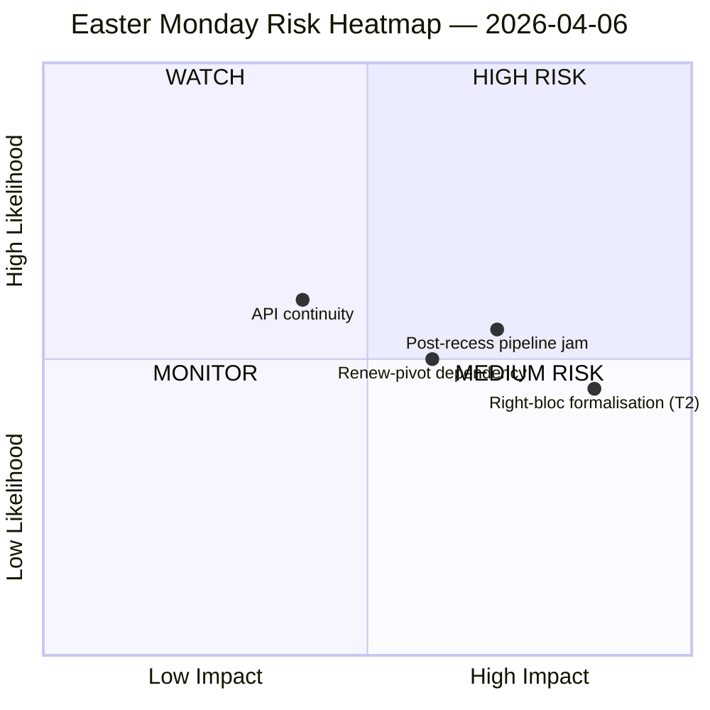

<!-- SPDX-FileCopyrightText: 2026 Hack23 AB -->
<!-- SPDX-License-Identifier: Apache-2.0 -->

# Executive Brief — Easter Monday Recess Intelligence | 2026-04-06

**Classification:** OSINT — Public Parliamentary Record
**Confidence:** 🟡 MEDIUM (Easter recess Day 11/18; 6 of 8 EP API endpoints returning 404 for 11 consecutive days)
**Run:** `analysis/daily/2026-04-06/breaking/`
**Coverage:** 6 April 2026 (Easter Monday — EU-wide public holiday; T-8 to committee week, T-14 to plenary)
**Generated:** 2026-05-16 (retrospective brief, no new MCP calls)
**Primary sources:** EP MCP precomputed stats 2004–2026; Adopted Texts (one-week fallback — 85 items); MEP feed (737 records).

---

## 🎯 BLUF

**Easter Monday produced zero parliamentary activity by design — yet the run records the single most consequential structural finding of the recess fortnight: 6 of 8 EP API endpoints have returned 404 errors continuously since 28 March, an 11-day persistent degradation pattern with no recovery signals.** This data-availability collapse is not a transient incident but a structural shift that constrains all downstream monitoring through the post-Easter committee restart. The run separates *structural inactivity* (a public holiday across 27 member states produces zero events by definition) from *data gaps* (advisory feeds — committee documents, parliamentary questions, procedures, plenary documents — are silent because the endpoints are broken, not because no documents exist). The political-SWOT extracts a counter-intuitive but well-evidenced finding: with **EP10 on track for 114 legislative acts in 2026 (+46% vs. 2025)** and an **85-item adopted-texts backlog accumulated through the recess**, the post-13 April restart will load a four-day committee week with a quarter's worth of pent-up work. The most consequential *risk* is **T2 right-bloc formalisation (EPP+ECR+PfE = 57% potential supermajority)** scored HIGH — the question the run leaves open and that subsequent runs will answer is whether the Renew-pivot grand coalition (EPP+S&D+Renew = 55% with −5.5% surplus deficit) holds discipline once the tariff and banking files force every flagship vote into ad-hoc coalition-building. The week's silence is therefore *loaded*, not *empty*.

---

## 🧭 3 Decisions This Brief Supports

| # | Decision | Who decides | Deadline | Evidence |
|:-:|----------|-------------|:--------:|----------|
| 1 | **API recovery escalation** — 11-day persistent 404 pattern needs an owner before committee restart; otherwise the post-recess week opens with no live monitoring of committee assignments | EP IT secretariat; data-pipeline-specialist | **before 14 April committee restart** | §Data Collection Results; 6/8 endpoints 404 since 28 March |
| 2 | **Pre-brief Conference of Committee Chairs on 85-item backlog** — pipeline prioritisation needs to be settled in advance of the 14-17 April committee window, not improvised on Day 1 | Conference of Committee Chairs | April 14 (T-8 at run time) | §Opportunities O1; 85-item adopted-texts feed backlog |
| 3 | **Right-bloc-supermajority falsification test design** — T2 (PPE+ECR+PfE = 57%) is the highest-severity threat; the first post-Easter trade vote is the natural falsifier of whether the bloc formalises | EPP/ECR/PfE group leaderships; observers | first post-recess trade vote | §Threats T2 (HIGH severity) |

---

## 📰 60-Second Read

- 🔴 **0 parliamentary events Monday** — public holiday across 27 MS; zero is the *expected* value, not a data gap.
- 🟠 **6/8 API endpoints 404 for 11 consecutive days** — structural, not transient; HIGH confidence (15+ runs).
- 🟢 **EP10 on track for 114 acts (+46% YoY)** vs. 78 in 2025 — record pace projected.
- 🟡 **85-item adopted-texts backlog** during recess — Q2 will start with a loaded pipeline.
- 🔵 **Stability score 84/100; 0 voting anomalies** — institutional integrity intact through the silence.
- 🟣 **Grand-coalition arithmetic: EPP+S&D = 60% of seats** — majority-capable on paper but with the −5.5% surplus deficit prior runs flagged.
- 🩷 **T2 — right-bloc supermajority potential (EPP+ECR+PfE = 57%)** — highest-severity threat in the SWOT.
- ⚪ **737 MEP records** — MEP feed and adopted-texts feed are the only two operational signal sources.

---

## ⚠️ Risk Snapshot (from `risk-matrix.md`)

The single risk plotted by the run is API continuity in the WATCH quadrant; this brief extends the snapshot with three named risks visible in the run's SWOT but not in the quadrantChart proper. Net **risk level MEDIUM, stability score 84/100, delta vs. April 5 stable** — the run's headline judgement holds.

---

## 🧭 ACH — The "Quiet but Loaded" Reading

- **H1 — Routine recess.** API outage is transient (Easter maintenance, returns post-13 April); 85-item backlog is normal Q1 throughput. *Favoured by* stability score 84/100, zero anomalies.
- **H2 — Structural API decline + coalition stress.** 11-day persistent pattern is *not* transient; the 85-item backlog will collide with the 4-day committee restart week and force right-bloc formalisation on at least one trade-defence file. *Favoured by* 11-day persistence (15+ monitoring runs), T2 HIGH severity, prior-run trajectory.

Both hypotheses remain live at run time. The 14 April committee restart and the first post-recess trade vote are the natural falsifiers; the brief reads H1 as the *planning baseline* and H2 as the *contingency case*.

---

## 🔮 Top Forward Triggers (next 14 days)

1. **April 13 (T-7) — final day of recess.** API recovery signal (or lack of) is the binary indicator.
2. **April 14–17 — committee restart week.** 85-item backlog meets 4-day window; pipeline-triage decisions decide whether the record Q1 pace breaks.
3. **April 15 — US tariff deadline.** Forces every group's first post-recess trade-vote signal; falsifier for T2 right-bloc formalisation.
4. **April 17 — ECB rate decision** (run-flagged catalyst) — may activate ECON committee on Day 4 of restart week.
5. **April 27–30 Strasbourg plenary** — first plenary opportunity to consolidate or break the record-pace projection.

---

## 🛡️ Source-Quality Assessment

- **Precomputed stats 2004–2026 (A1):** the brief's most reliable signal; 114-act projection and 84/100 stability score both derive from this.
- **Adopted-texts feed (A2 — one-week fallback):** 85 items; the "today" view threw a JSON parse error and the run fell back to the weekly window.
- **MEP feed (A1):** 737 records — second of two operational endpoints.
- **Six 404 endpoints (documented gap):** events, procedures, documents, plenary docs, committee docs, questions — *existence* of underlying activity cannot be confirmed via API for the recess period.
- **Net confidence:** 🟡 MEDIUM on synthesis; 🟢 HIGH on the API-outage finding itself (objectively verified across 15+ monitoring runs); 🟡 MEDIUM on the right-bloc T2 threat (structural arithmetic is firm, behavioural test is post-recess).

---

## 📎 Run Artifacts (Read-Before-Decide)

| Layer | Artifact | Why |
|-------|----------|-----|
| Article | `article.md` | Public-facing Easter Monday narrative |
| Significance | `significance-classification.md` | Recess-day classification with 8-feed audit |
| Risk | `risk-matrix.md` | 5×5 matrix; API continuity in WATCH quadrant |
| Threat | `political-threat-landscape.md` | 5-framework political-threat (STRIDE rejected) |
| SWOT | `political-swot-analysis.md` | 4S/4W/4O/4T with TOWS interference matrix |
| Companion | `2026-04-13/breaking-run168/`, `2026-04-11/week-in-review-run8/` | Recess-fortnight bracketing |

---

**Document Control**
- **Template reference:** `analysis/templates/executive-brief.md`
- **Artifact path:** `analysis/daily/2026-04-06/breaking/executive-brief.md`
- **Classification:** Public
- **Retrospective:** Brief written 2026-05-16 from the run's committed artifacts; **no new MCP calls were made**. The 🟡 MEDIUM confidence and the API-outage finding are preserved exactly as the run committed them.
