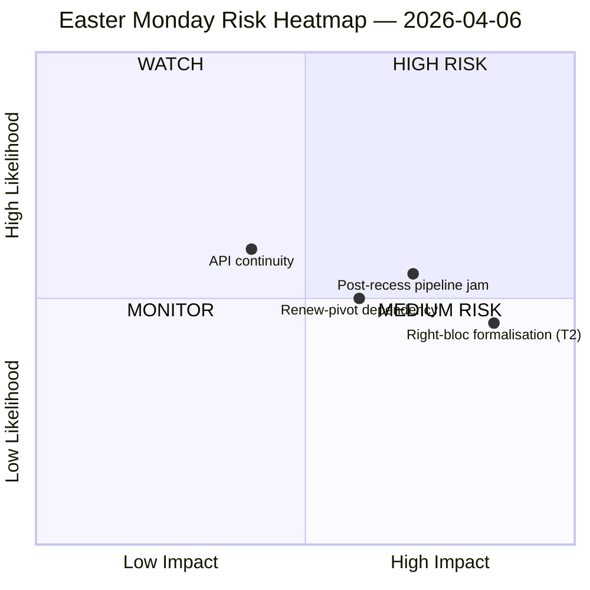

<!-- SPDX-FileCopyrightText: 2026 Hack23 AB -->
<!-- SPDX-License-Identifier: Apache-2.0 -->

# موجز تنفيذي — استخبارات عطلة عيد الفصح | 2026-04-06

**التصنيف:** OSINT — السجل البرلماني العام
**الموثوقية:** 🟡 متوسطة (إجازة عيد الفصح اليوم 11/18؛ 6 من أصل 8 نقاط نهاية API تابعة للبرلمان الأوروبي تعيد 404 لمدة 11 يومًا متتاليًا)
**التشغيل:** `analysis/daily/2026-04-06/breaking/`
**التغطية:** 6 أبريل 2026 (الاثنين الفصحي — عطلة رسمية في جميع أنحاء الاتحاد الأوروبي؛ T-8 حتى أسبوع اللجنة، T-14 حتى الجلسة العامة)
**تاريخ الإنشاء:** 2026-05-16 (موجز استرجاعي، بدون مكالمات MCP جديدة)
**المصادر الأولية:** إحصاءات EP MCP المحسوبة مسبقًا 2004–2026؛ النصوص المعتمدة (احتياطي أسبوع واحد — 85 عنصرًا)؛ تدفق MEP (737 سجلًا).

---

## 🎯 التقييم الجوهري

**أنتج الاثنين الفصحي صفرًا من النشاط البرلماني حسب التصميم — غير أن التشغيل يسجّل أهم اكتشاف هيكلي خلال فترة الاستراحة: 6 من أصل 8 نقاط نهاية API تابعة للبرلمان الأوروبي تُرجع أخطاء 404 باستمرار منذ 28 مارس، وهو نمط تدهور مستمر لمدة 11 يومًا دون إشارات تعافٍ.** هذا الانهيار في توافر البيانات ليس حادثة عابرة بل تحولًا هيكليًا يُقيّد كل المراقبة اللاحقة حتى استئناف عمل اللجان بعد عيد الفصح. يُميّز التشغيل بين *الخمول الهيكلي* (إجازة رسمية في 27 دولة عضو تُنتج صفر أحداث بحكم التعريف) و*الثغرات في البيانات* (التدفقات الاستشارية — وثائق اللجان، والأسئلة البرلمانية، والإجراءات، ووثائق الجلسة العامة — صامتة لأن نقاط النهاية معطلة، وليس لأنه لا توجد وثائق). يستخلص تحليل SWOT السياسي نتيجة مضادة للحدس لكنها موثقة جيدًا: مع **EP10 في مساره نحو 114 فعلًا تشريعيًا في عام 2026 (+46 % مقارنةً بعام 2025)** و**تراكم 85 نصًا معتمدًا خلال الاستراحة**، ستُثقل استئناف العمل في 13 أبريل أسبوع لجنة مدته أربعة أيام بأعمال متراكمة لربع سنة. الخطر الأكثر تأثيرًا هو **T2 رسمنة الكتلة اليمينية (EPP+ECR+PfE = 57 % من الأغلبية المطلقة المحتملة)** المُصنَّفة مرتفعة — السؤال الذي يتركه التشغيل مفتوحًا والذي ستجيب عليه الجولات اللاحقة هو: هل ستحافظ الائتلاف الكبير الموجّه نحو التعريفات (EPP+S&D+Renew = 55 % مع عجز فائض −5.5 %) على انضباطه حين تُجبر ملفات التعريفات والبنوك كل تصويت على بناء ائتلافات مخصصة؟ صمت الأسبوع إذن *محملٌ بالمعنى*، وليس *فارغًا*.

---

## 🧭 3 قرارات يدعمها هذا الموجز

| # | القرار | مَن يقرر | الموعد النهائي | الأدلة |
|:-:|----------|-------------|:--------:|----------|
| 1 | **تصعيد استعادة API** — نمط 404 المستمر لمدة 11 يومًا يحتاج مسؤولًا قبل استئناف عمل اللجان؛ وإلا ستبدأ الأسبوع التالي للاستراحة دون مراقبة حية لمهام اللجان | أمانة IT للبرلمان الأوروبي؛ data-pipeline-specialist | **قبل استئناف اللجان في 14 أبريل** | §نتائج جمع البيانات؛ 6/8 نقاط نهاية 404 منذ 28 مارس |
| 2 | **مؤتمر رؤساء اللجان المسبق حول متراكمات 85 عنصرًا** — يجب حسم أولويات المسار مسبقًا قبل نافذة اللجنة 14–17 أبريل، لا الارتجال في اليوم الأول | مؤتمر رؤساء اللجان | 14 أبريل (T-8 وقت التشغيل) | §الفرص O1؛ 85 عنصرًا في تدفق النصوص المعتمدة |
| 3 | **اختبار تكذيب الأغلبية المطلقة للكتلة اليمينية** — T2 (EPP+ECR+PfE = 57 %) هو التهديد الأعلى خطورة؛ أول تصويت تجاري ما بعد الفصح هو المُكذِّب الطبيعي | قيادات مجموعات EPP/ECR/PfE؛ المراقبون | أول تصويت تجاري بعد الاستراحة | §التهديدات T2 (خطورة مرتفعة) |

---

## 📰 قراءة 60 ثانية

- 🔴 **0 أحداث برلمانية الاثنين** — إجازة رسمية في 27 دولة عضو؛ الصفر هو القيمة *المتوقعة*، وليس فجوة بيانات.
- 🟠 **6/8 نقاط نهاية API تُعيد 404 لمدة 11 يومًا متتاليًا** — هيكلي لا عابر؛ موثوقية عالية (15+ جولة).
- 🟢 **EP10 في مساره نحو 114 فعلًا (+46 % على أساس سنوي)** مقارنةً بـ 78 في 2025 — إيقاع قياسي متوقع.
- 🟡 **تراكم 85 نصًا معتمدًا** خلال الاستراحة — سيبدأ الربع الثاني بمسار مُثقل.
- 🔵 **درجة الاستقرار 84/100؛ 0 شذوذات تصويتية** — سلامة مؤسسية دون تأثر خلال الصمت.
- 🟣 **حسابيات الائتلاف الكبير: EPP+S&D = 60 % من المقاعد** — قادر على الأغلبية نظريًا لكن مع عجز فائض −5.5 % الذي أشارت إليه جولات سابقة.
- 🩷 **T2 — الإمكانات الكامنة لأغلبية مطلقة للكتلة اليمينية (EPP+ECR+PfE = 57 %)** — التهديد الأعلى خطورة في SWOT.
- ⚪ **737 سجل MEP** — تدفق MEP وتدفق النصوص المعتمدة هما المصدران الإشاريان الوحيدان العملياتيان.

---

## ⚠️ لقطة المخاطر (من `risk-matrix.md`)

الخطر الوحيد الذي يرسمه التشغيل هو استمرارية API في ربع WATCH؛ يوسّع هذا الموجز اللقطة بثلاثة مخاطر مسمّاة مرئية في SWOT للتشغيل لكن غير موجودة في مخطط quadrantChart. **مستوى الخطر الصافي متوسط، درجة الاستقرار 84/100، دلتا مقارنةً بـ 5 أبريل ثابتة** — يظل حكم التشغيل الرئيسي ساريًا.

---

## 🧭 ACH — قراءة "صامت لكن محمّل بالمعنى"

- **H1 — استراحة روتينية.** انقطاع API مؤقت (صيانة الفصح، يعود بعد 13 أبريل)؛ تراكم 85 عنصرًا هو إنتاجية Q1 الطبيعية. *تدعمه* درجة الاستقرار 84/100، صفر شذوذات.
- **H2 — تراجع API هيكلي + ضغط الائتلاف.** النمط المستمر لمدة 11 يومًا ليس مؤقتًا؛ ستصطدم المتراكمات البالغة 85 عنصرًا بأسبوع استئناف اللجنة المدته 4 أيام وتُجبر رسمنة الكتلة اليمينية على ملف دفاع تجاري واحد على الأقل. *تدعمه* الاستمرارية لمدة 11 يومًا (15+ جولة مراقبة)، T2 خطورة مرتفعة، المسار السابق للجولات.

كلا الفرضيتين تظلان نشطتين وقت التشغيل. استئناف اللجان في 14 أبريل وأول تصويت تجاري بعد الاستراحة هما المُكذِّبان الطبيعيان؛ يقرأ الموجز H1 باعتبارها *خط الأساس التخطيطي* و H2 باعتبارها *حالة الطوارئ*.

---

## 🔮 أبرز المحفزات المستقبلية (الـ 14 يومًا القادمة)

1. **13 أبريل (T-7) — آخر يوم من الاستراحة.** إشارة استعادة API (أو غيابها) هي المؤشر الثنائي.
2. **14–17 أبريل — أسبوع استئناف اللجنة.** تواجه متراكمات 85 عنصرًا نافذة 4 أيام؛ قرارات فرز المسار تحدد ما إذا كان إيقاع Q1 القياسي سينكسر.
3. **15 أبريل — الموعد النهائي للرسوم الجمركية الأمريكية.** يُجبر كل مجموعة على أول إشارة تجارية بعد الاستراحة؛ اختبار تكذيب لرسمنة الكتلة اليمينية T2.
4. **17 أبريل — قرار الفائدة لدى البنك المركزي الأوروبي** (محفّز وفق التشغيل) — قد ينشّط لجنة ECON في اليوم 4 من أسبوع الاستئناف.
5. **27–30 أبريل الجلسة العامة في ستراسبورغ** — أول فرصة للجلسة العامة لتوطيد توقعات الإيقاع القياسي أو كسرها.

---

## 🛡️ تقييم جودة المصادر

- **الإحصاءات المحسوبة مسبقًا 2004–2026 (A1):** الإشارة الأكثر موثوقية في الموجز؛ توقعات 114 فعلًا ودرجة الاستقرار 84/100 مشتقتان من هذا المصدر.
- **تدفق النصوص المعتمدة (A2 — احتياطي أسبوع واحد):** 85 عنصرًا؛ أعطى عرض "اليوم" خطأ تحليل JSON وتراجع التشغيل إلى النافذة الأسبوعية.
- **تدفق MEP (A1):** 737 سجلًا — ثاني نقطتَي نهاية عملياتيتين اثنتين.
- **ست نقاط نهاية 404 (فجوة موثقة):** الأحداث، الإجراءات، الوثائق، وثائق الجلسة العامة، وثائق اللجنة، الأسئلة — لا يمكن تأكيد *وجود* النشاط الكامن عبر API لفترة الاستراحة.
- **مستوى الثقة الصافي:** 🟡 متوسط للتوليف؛ 🟢 مرتفع لنتيجة انقطاع API نفسها (مُوثَّقة موضوعيًا في 15+ جولة مراقبة)؛ 🟡 متوسط لتهديد الكتلة اليمينية T2 (الحسابيات الهيكلية راسخة، الاختبار السلوكي مرحلة ما بعد الاستراحة).

---

## 📎 مُخرجات التشغيل (اقرأ قبل القرار)

| الطبقة | المُخرَج | السبب |
|-------|----------|-----|
| المقال | `article.md` | السرد العام ليوم الاثنين الفصحي |
| الأهمية | `significance-classification.md` | تصنيف يوم الاستراحة مع تدقيق 8 تدفقات |
| الخطر | `risk-matrix.md` | مصفوفة 5×5؛ استمرارية API في ربع WATCH |
| التهديد | `political-threat-landscape.md` | التهديد السياسي بـ 5 أطر (رفض STRIDE) |
| SWOT | `political-swot-analysis.md` | 4ق/4ض/4ف/4ت مع مصفوفة التداخل TOWS |
| المرافق | `2026-04-13/breaking-run168/`، `2026-04-11/week-in-review-run8/` | إطار أسبوعَي فترة الاستراحة |

---

**مراقبة الوثيقة**
- **مرجع القالب:** `analysis/templates/executive-brief.md`
- **مسار المُخرَج:** `analysis/daily/2026-04-06/breaking/executive-brief.md`
- **التصنيف:** عام
- **استرجاعي:** كُتب الموجز في 2026-05-16 من مُخرجات التشغيل المُسجَّلة؛ **لم تُجرَ مكالمات MCP جديدة**. تُحفظ موثوقية 🟡 متوسط ونتيجة انقطاع API بالضبط كما سجّلها التشغيل.
