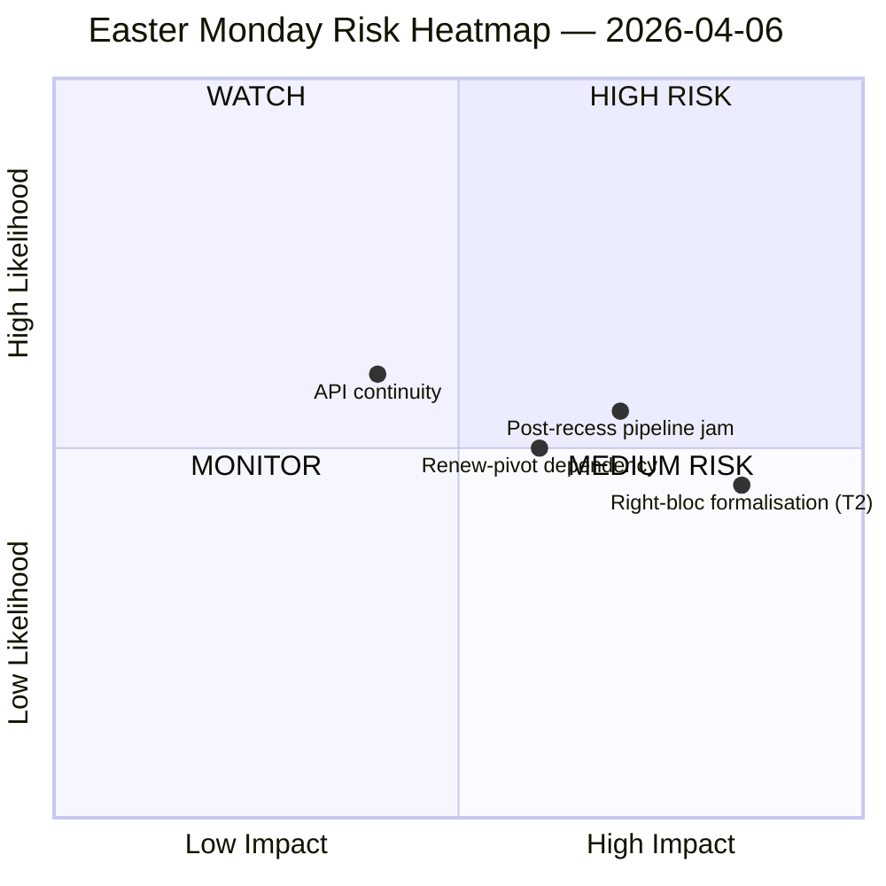

<!-- SPDX-FileCopyrightText: 2026 Hack23 AB -->
<!-- SPDX-License-Identifier: Apache-2.0 -->

# Efterretningsoversigt — Påskedag Pause | 2026-04-06

**Klassifikation:** OSINT — Offentlig parlamentarisk protokol
**Sikkerhed:** 🟡 MEDIUM (Påskepause dag 11/18; 6 af 8 EP API-endpoints returnerer 404 i 11 dage i træk)
**Kørsel:** `analysis/daily/2026-04-06/breaking/`
**Dækning:** 6. april 2026 (Anden påskedag — EU-dækkende offentlig helligdag; T-8 til udvalgsuge, T-14 til plenum)
**Genereret:** 2026-05-16 (retrospektivt notat, ingen nye MCP-kald)
**Primære kilder:** EP MCP forudberegnede statistikker 2004–2026; Vedtagne tekster (en-uges reserve — 85 poster); MEP-feed (737 poster).

---

## 🎯 Kernebedømmelse

**Anden påskedag producerede nul parlamentarisk aktivitet pr. design — men kørslen registrerer det enkelt mest afgørende strukturelle fund i pausefortnatten: 6 af 8 EP API-endpoints har returneret 404-fejl kontinuerligt siden 28. marts, et 11-dages vedvarende forringelsesmønster uden genopretningssignaler.** Denne kollaps i datatilgængelighed er ikke en forbigående hændelse, men en strukturel ændring, der begrænser al efterfølgende overvågning frem til genopstart af udvalgsarbejdet efter påske. Kørslen adskiller *strukturel inaktivitet* (en offentlig helligdag i 27 medlemsstater producerer nul begivenheder pr. definition) fra *datagab* (rådgivende feeds — udvalgssdokumenter, parlamentariske spørgsmål, procedurer, plenumsdokumenter — er tavse, fordi endpoints er defekte, ikke fordi ingen dokumenter eksisterer). Den politiske SWOT-analyse uddrager et kontraintuitivt, men veldokumenteret fund: med **EP10 på kurs mod 114 lovgivningsakter i 2026 (+46 % mod 2025)** og en **efterslæb på 85 vedtagne tekster akkumuleret under pausen**, vil genopstarten den 13. april belaste en 4-dages udvalgsuge med et kvartals opsparet arbejde. Den mest afgørende *risiko* er **T2 højreblokkens formalisering (EPP+ECR+PfE = 57 % potentielt superflertal)** vurderet HØJ — spørgsmålet, kørslen efterlader åbent, og som efterfølgende kørsler vil besvare, er om den toldrelaterede storkoalition (EPP+S&D+Renew = 55 % med −5,5 % overskudsunderskud) holder disciplin, når told- og bankfiler tvinger hver flagskibsafstemning til ad hoc-koalitionsbyggeri. Ugens tavshed er derfor *ladet*, ikke *tom*.

---

## 🧭 3 Beslutninger dette notat understøtter

| # | Beslutning | Hvem beslutter | Deadline | Bevis |
|:-:|----------|-------------|:--------:|----------|
| 1 | **API-genopretningseskalering** — 11-dages vedvarende 404-mønster kræver en ansvarlig inden udvalgsgenopstart; ellers åbner ugen efter pausen uden live-overvågning af udvalgsopgaver | EP IT-sekretariat; data-pipeline-specialist | **inden 14. april udvalgsgenopstart** | §Dataindsamlingsresultater; 6/8 endpoints 404 siden 28. marts |
| 2 | **Pre-brief Konference for udvalgsformænd om 85-posters efterslæb** — prioritering af pipeline skal afgøres på forhånd inden udvalgsvinduet 14–17 april, ikke improviseres på dag 1 | Konference for udvalgsformænd | 14. april (T-8 ved kørselstidspunkt) | §Muligheder O1; 85 poster i vedtagne tekster |
| 3 | **Højreblok-superflertalsfalsifikationstest** — T2 (EPP+ECR+PfE = 57 %) er den mest alvorlige trussel; den første post-påskehandelsafstemning er det naturlige falsifikationstest | EPP/ECR/PfE-gruppeledelser; observatører | første handelsafstemning efter pausen | §Trusler T2 (HØJ alvorlighed) |

---

## 📰 60-sekunders læsning

- 🔴 **0 parlamentariske begivenheder mandag** — offentlig helligdag i 27 MS; nul er den *forventede* værdi, ikke et datagab.
- 🟠 **6/8 API-endpoints 404 i 11 dage i træk** — strukturelt, ikke forbigående; HØJ sikkerhed (15+ kørsler).
- 🟢 **EP10 på kurs mod 114 akter (+46 % YoY)** mod 78 i 2025 — rekordtempo projiceret.
- 🟡 **85-posters efterslæb i vedtagne tekster** under pausen — Q2 starter med et ladet pipeline.
- 🔵 **Stabilitetspoint 84/100; 0 afstemningsanomalier** — institutionel integritet intakt under tavsheden.
- 🟣 **Storkoalitionsaritmetik: EPP+S&D = 60 % af sæder** — flertalsskikket på papiret, men med −5,5 % overskudsunderskud, som tidligere kørsler har markeret.
- 🩷 **T2 — højreblok superflertalspotentiale (EPP+ECR+PfE = 57 %)** — den mest alvorlige trussel i SWOT.
- ⚪ **737 MEP-poster** — MEP-feed og vedtagne tekster-feed er de eneste to operationelle signalkilder.

---

## ⚠️ Risikoøjebliksbillede (fra `risk-matrix.md`)

Den eneste risiko, der plottes af kørslen, er API-kontinuitet i WATCH-kvadranten; dette notat udvider øjebliksbilledet med tre navngivne risici synlige i kørslens SWOT men ikke i quadrantChart-diagrammet. Netto **risikoniveau MEDIUM, stabilitetspoint 84/100, delta mod 5. april stabilt** — kørslens hovudbedømmelse gælder stadig.

---

## 🧭 ACH — Fortolkningen "Stille men Ladet"

- **H1 — Rutinemæssig pause.** API-afbrydelse er forbigående (påskevedligeholdelse, vender tilbage efter 13. april); 85-posters efterslæb er normalt Q1-gennemstrømning. *Understøttes af* stabilitetspoint 84/100, nul anomalier.
- **H2 — Strukturelt API-forfald + koalitionsstress.** 11-dages vedvarende mønster er *ikke* forbigående; 85-posters efterslæb vil støde sammen med den 4-dages udvalgsgenopstartsuge og tvinge højrblokformalisering på mindst én handels-forsvarsakt. *Understøttes af* 11-dages persistens (15+ overvågningskørsler), T2 HØJ alvorlighed, tidligere kørselsbane.

Begge hypoteser forbliver aktive ved kørselstidspunktet. Udvalgsgenopstarten 14. april og den første handelsafstemning efter pausen er de naturlige falsifikationstest; notatet læser H1 som *planlægningsbasislinje* og H2 som *beredskabsalternativet*.

---

## 🔮 Top Fremtidige Udløsere (næste 14 dage)

1. **13. april (T-7) — sidste dag af pausen.** API-genopretningssignal (eller mangel heraf) er den binære indikator.
2. **14–17. april — udvalgsgenopstartsuge.** 85-posters efterslæb møder 4-dagesvindue; pipeline-triagbeslutninger afgør, om rekord-Q1-tempoet brydes.
3. **15. april — US-toldfrist.** Tvinger hver gruppes første post-pause-handelssignal; falsifikationstest for T2 højrblokformalisering.
4. **17. april — ECB-rentebeslutning** (kørselsmærket katalysator) — kan aktivere ECON-udvalget dag 4 af genopstartsuge.
5. **27–30. april Strasbourgplenum** — første plenumsmulighed for at konsolidere eller bryde rekordtempprojektionen.

---

## 🛡️ Kildekvalitetsvurdering

- **Forudberegnede statistikker 2004–2026 (A1):** notatets mest pålidelige signal; 114-akters projektion og 84/100 stabilitetspoint er begge udledt herfra.
- **Feed for vedtagne tekster (A2 — en-uges reserve):** 85 poster; "i dag"-visningen gav en JSON-parseringsfejl, og kørslen faldt tilbage til ugesvinduet.
- **MEP-feed (A1):** 737 poster — anden af to operationelle endpoints.
- **Seks 404-endpoints (dokumenteret gab):** begivenheder, procedurer, dokumenter, plenumsdokumenter, udvalgssdokumenter, spørgsmål — *eksistensen* af underliggende aktivitet kan ikke bekræftes via API for pauseperioden.
- **Nettosikkerhed:** 🟡 MEDIUM for syntese; 🟢 HØJ for API-afbrydselsfundet i sig selv (objektivt verificeret på tværs af 15+ overvågningskørsler); 🟡 MEDIUM for højreblok-T2-truslen (strukturel aritmetik er fast, adfærdstest er post-pause).

---

## 📎 Kørselsartefakter (Læs-Inden-Beslutning)

| Lag | Artefakt | Hvorfor |
|-------|----------|-----|
| Artikel | `article.md` | Offentlig fortælling om anden påskedag |
| Betydning | `significance-classification.md` | Pausedagsklassificering med 8-feed-revision |
| Risiko | `risk-matrix.md` | 5×5-matrix; API-kontinuitet i WATCH-kvadranten |
| Trussel | `political-threat-landscape.md` | 5-ramværks politisk trussel (STRIDE afvist) |
| SWOT | `political-swot-analysis.md` | 4S/4W/4O/4T med TOWS-interferensmatrix |
| Ledsager | `2026-04-13/breaking-run168/`, `2026-04-11/week-in-review-run8/` | Pausefortnatens parenteser |

---

**Dokumentkontrol**
- **Skabelonreference:** `analysis/templates/executive-brief.md`
- **Artefaktsti:** `analysis/daily/2026-04-06/breaking/executive-brief.md`
- **Klassifikation:** Offentlig
- **Retrospektivt:** Notat skrevet 2026-05-16 fra kørslens committede artefakter; **ingen nye MCP-kald blev foretaget**. 🟡 MEDIUM-sikkerheden og API-afbrydselsfundet er bevaret præcis som kørslen committede dem.
