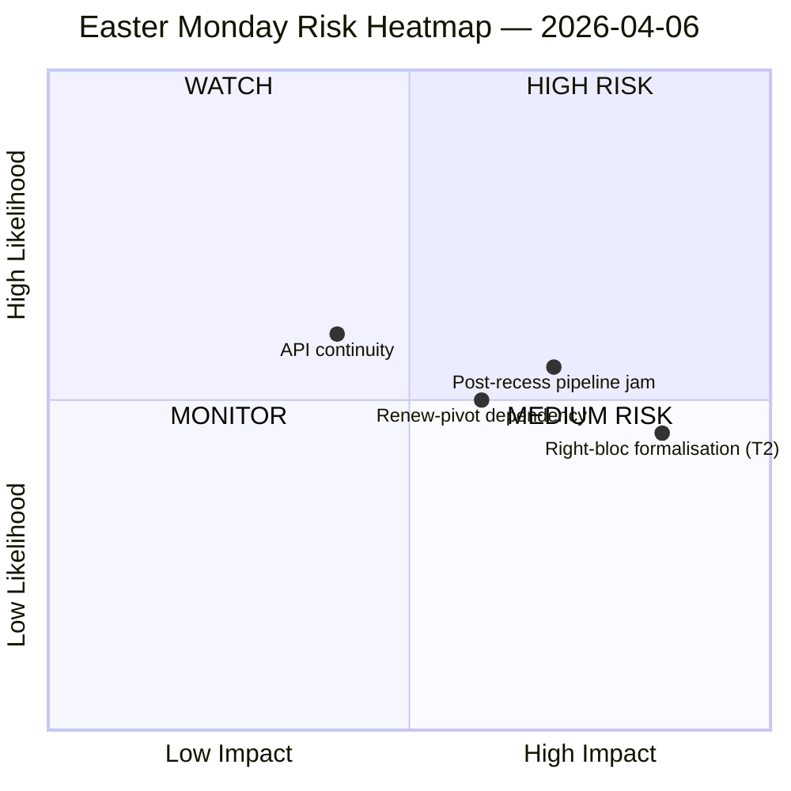

<!-- SPDX-FileCopyrightText: 2026 Hack23 AB -->
<!-- SPDX-License-Identifier: Apache-2.0 -->

# Geheimdienstliches Kurzgutachten — Ostermontag-Parlamentspause | 2026-04-06

**Einstufung:** OSINT — Öffentliches parlamentarisches Protokoll
**Verlässlichkeit:** 🟡 MITTEL (Osterpause Tag 11/18; 6 von 8 EP API-Endpunkten liefern 404 für 11 aufeinanderfolgende Tage)
**Lauf:** `analysis/daily/2026-04-06/breaking/`
**Abdeckung:** 6. April 2026 (Ostermontag — EU-weiter gesetzlicher Feiertag; T-8 bis Ausschusswoche, T-14 bis Plenum)
**Erstellt:** 2026-05-16 (retrospektiver Bericht, keine neuen MCP-Aufrufe)
**Primärquellen:** EP MCP vorberechnete Statistiken 2004–2026; Angenommene Texte (Ein-Wochen-Fallback — 85 Einträge); MEP-Feed (737 Datensätze).

---

## 🎯 Kernbewertung

**Der Ostermontag erzeugte planmäßig null parlamentarische Aktivität — doch der Lauf verzeichnet den einzeln folgenreichsten strukturellen Befund der Pausefortnight: 6 von 8 EP API-Endpunkten haben seit dem 28. März kontinuierlich 404-Fehler zurückgegeben, ein 11-tägiges anhaltendes Degradierungsmuster ohne Erholungssignale.** Dieser Zusammenbruch der Datenverfügbarkeit ist kein vorübergehender Vorfall, sondern eine strukturelle Verschiebung, die alle nachgelagerten Überwachungen durch den Ausschuss-Neustart nach Ostern einschränkt. Der Lauf unterscheidet *strukturelle Inaktivität* (ein gesetzlicher Feiertag in 27 Mitgliedstaaten produziert per Definition null Ereignisse) von *Datenlücken* (beratende Feeds — Ausschussdokumente, parlamentarische Anfragen, Verfahren, Plenumsdokumente — sind still, weil die Endpunkte defekt sind, nicht weil keine Dokumente existieren). Die politische SWOT-Analyse extrahiert einen kontraintuitiven, aber gut belegten Befund: Bei **EP10 auf Kurs für 114 Gesetzgebungsakte im Jahr 2026 (+46 % gegenüber 2025)** und einem **Rückstand von 85 angenommenen Texten, der sich während der Pause angesammelt hat**, wird der Neustart am 13. April eine viertägige Ausschusswoche mit einem Quartal aufgestauter Arbeit belasten. Das folgenreichste *Risiko* ist die **T2 Rechtsblock-Formalisierung (EPP+ECR+PfE = 57 % potenzielle Supermehrheit)**, eingestuft als HOCH — die Frage, die der Lauf offen lässt und die nachfolgende Läufe beantworten werden, ist, ob die zollbezogene Große Koalition (EPP+S&D+Renew = 55 % mit −5,5 % Überschussdefizit) die Disziplin hält, sobald Zoll- und Bankendateien jede Flaggschiff-Abstimmung in Ad-hoc-Koalitionsbildung zwingen. Die Stille der Woche ist daher *geladen*, nicht *leer*.

---

## 🧭 3 Entscheidungen, die dieses Briefing unterstützt

| # | Entscheidung | Wer entscheidet | Frist | Belege |
|:-:|----------|-------------|:--------:|----------|
| 1 | **API-Wiederherstellungseskalierung** — 11-tägiges anhaltendes 404-Muster braucht einen Verantwortlichen vor dem Ausschuss-Neustart; andernfalls öffnet die Woche nach der Pause ohne Live-Überwachung von Ausschusszuweisungen | EP IT-Sekretariat; data-pipeline-specialist | **vor 14. April Ausschuss-Neustart** | §Datenerhebungsergebnisse; 6/8 Endpunkte 404 seit 28. März |
| 2 | **Pre-brief Konferenz der Ausschussvorsitze zum 85-Einträge-Rückstand** — Pipeline-Priorisierung muss vorab vor dem 14.–17. April Ausschussfenster geklärt werden, nicht am Tag 1 improvisiert | Konferenz der Ausschussvorsitze | 14. April (T-8 zum Laufzeitpunkt) | §Chancen O1; 85 Einträge im Feed angenommener Texte |
| 3 | **Rechtsblock-Supermehrheits-Falsifikationstest** — T2 (EPP+ECR+PfE = 57 %) ist die schwerwiegendste Bedrohung; die erste Post-Oster-Handelsabstimmung ist der natürliche Falsifikator | EPP/ECR/PfE-Gruppenführungen; Beobachter | erste Handelsabstimmung nach der Pause | §Bedrohungen T2 (HOCH Schweregrad) |

---

## 📰 60-Sekunden-Lektüre

- 🔴 **0 parlamentarische Ereignisse Montag** — gesetzlicher Feiertag in 27 MS; null ist der *erwartete* Wert, keine Datenlücke.
- 🟠 **6/8 API-Endpunkte 404 für 11 aufeinanderfolgende Tage** — strukturell, nicht vorübergehend; HOHE Verlässlichkeit (15+ Läufe).
- 🟢 **EP10 auf Kurs für 114 Akte (+46 % YoY)** gegenüber 78 in 2025 — Rekorddtempo projiziert.
- 🟡 **85-Einträge-Rückstand bei angenommenen Texten** während der Pause — Q2 beginnt mit belasteter Pipeline.
- 🔵 **Stabilitätswertung 84/100; 0 Abstimmungsanomalien** — institutionelle Integrität durch die Stille intakt.
- 🟣 **Große-Koalitions-Arithmetik: EPP+S&D = 60 % der Sitze** — mehrheitsfähig auf dem Papier, aber mit dem −5,5 % Überschussdefizit, das frühere Läufe markierten.
- 🩷 **T2 — Rechtsblock-Supermehrheitspotenzial (EPP+ECR+PfE = 57 %)** — schwerwiegendste Bedrohung in der SWOT.
- ⚪ **737 MEP-Datensätze** — MEP-Feed und angenommene Texte-Feed sind die einzigen zwei operationellen Signalquellen.

---

## ⚠️ Risikomomentaufnahme (aus `risk-matrix.md`)

Das einzige vom Lauf gezeichnete Risiko ist API-Kontinuität im WATCH-Quadranten; dieses Briefing erweitert die Momentaufnahme um drei benannte Risiken, die in der SWOT des Laufs sichtbar sind, aber nicht im quadrantChart-Diagramm. Netto **Risikoniveau MITTEL, Stabilitätswertung 84/100, Delta gegenüber 5. April stabil** — die Schlagzeilen-Einschätzung des Laufs gilt weiterhin.

---

## 🧭 ACH — Die "Stille, aber Geladen" Lesart

- **H1 — Routinemäßige Pause.** API-Ausfall ist vorübergehend (Osterwartung, kehrt nach 13. April zurück); 85-Einträge-Rückstand ist normaler Q1-Durchsatz. *Gestützt durch* Stabilitätswertung 84/100, null Anomalien.
- **H2 — Struktureller API-Verfall + Koalitionsstress.** 11-tägiges anhaltendes Muster ist *nicht* vorübergehend; 85-Einträge-Rückstand wird mit der 4-tägigen Ausschuss-Neustartswoche kollidieren und Rechtsblock-Formalisierung bei mindestens einer Handels-Verteidigungs-Akte erzwingen. *Gestützt durch* 11-tägige Persistenz (15+ Überwachungsläufe), T2 HOCH Schweregrad, frühere Laufbahn.

Beide Hypothesen bleiben zum Laufzeitpunkt aktiv. Der Ausschuss-Neustart am 14. April und die erste Handelsabstimmung nach der Pause sind die natürlichen Falsifikatoren; das Briefing liest H1 als *Planungsbasislinie* und H2 als *Notfallalternative*.

---

## 🔮 Top Künftige Auslöser (nächste 14 Tage)

1. **13. April (T-7) — letzter Tag der Pause.** API-Wiederherstellungssignal (oder dessen Fehlen) ist der binäre Indikator.
2. **14.–17. April — Ausschuss-Neustartswoche.** 85-Einträge-Rückstand trifft auf 4-Tage-Fenster; Pipeline-Triage-Entscheidungen bestimmen, ob das Rekord-Q1-Tempo bricht.
3. **15. April — US-Zollfrist.** Erzwingt erstes Post-Pause-Handelssignal jeder Gruppe; Falsifikationstest für T2 Rechtsblock-Formalisierung.
4. **17. April — EZB-Zinsentscheid** (laufgekennzeichneter Katalysator) — kann ECON-Ausschuss an Tag 4 der Neustartswoche aktivieren.
5. **27.–30. April Straßburger Plenum** — erste Plenumsmöglichkeit zur Konsolidierung oder zum Bruch der Rekordtempoprjektion.

---

## 🛡️ Quellqualitätsbewertung

- **Vorberechnete Statistiken 2004–2026 (A1):** zuverlässigstes Signal des Briefings; 114-Akten-Projektion und 84/100 Stabilitätswertung werden beide daraus abgeleitet.
- **Feed angenommener Texte (A2 — Ein-Wochen-Fallback):** 85 Einträge; die "heute"-Ansicht lieferte einen JSON-Parse-Fehler und der Lauf fiel auf das Wochenfenster zurück.
- **MEP-Feed (A1):** 737 Datensätze — zweiter von zwei operationellen Endpunkten.
- **Sechs 404-Endpunkte (dokumentierte Lücke):** Ereignisse, Verfahren, Dokumente, Plenumsdokumente, Ausschussdokumente, Anfragen — die *Existenz* der zugrunde liegenden Aktivität kann über die API für den Pausezeitraum nicht bestätigt werden.
- **Nettovertrauensgrad:** 🟡 MITTEL für die Synthese; 🟢 HOCH für den API-Ausfall-Befund selbst (objektivt verifiziert über 15+ Überwachungsläufe); 🟡 MITTEL für die Rechtsblock-T2-Bedrohung (strukturelle Arithmetik ist fest, Verhaltenstest ist post-Pause).

---

## 📎 Laufartefakte (Lesen-Vor-Entscheidung)

| Schicht | Artefakt | Warum |
|-------|----------|-----|
| Artikel | `article.md` | Öffentliche Ostermontagserzählung |
| Bedeutung | `significance-classification.md` | Pausetagsklassifizierung mit 8-Feed-Prüfung |
| Risiko | `risk-matrix.md` | 5×5-Matrix; API-Kontinuität im WATCH-Quadranten |
| Bedrohung | `political-threat-landscape.md` | 5-Rahmen politische Bedrohung (STRIDE abgelehnt) |
| SWOT | `political-swot-analysis.md` | 4S/4W/4O/4T mit TOWS-Interferenzmatrix |
| Begleiter | `2026-04-13/breaking-run168/`, `2026-04-11/week-in-review-run8/` | Pausefortnight-Klammerung |

---

**Dokumentenkontrolle**
- **Vorlagenreferenz:** `analysis/templates/executive-brief.md`
- **Artefaktpfad:** `analysis/daily/2026-04-06/breaking/executive-brief.md`
- **Einstufung:** Öffentlich
- **Retrospektiv:** Briefing geschrieben 2026-05-16 aus den committeten Artefakten des Laufs; **keine neuen MCP-Aufrufe wurden gemacht**. Die 🟡 MITTEL-Verlässlichkeit und der API-Ausfall-Befund sind genau so erhalten, wie der Lauf sie committete.
