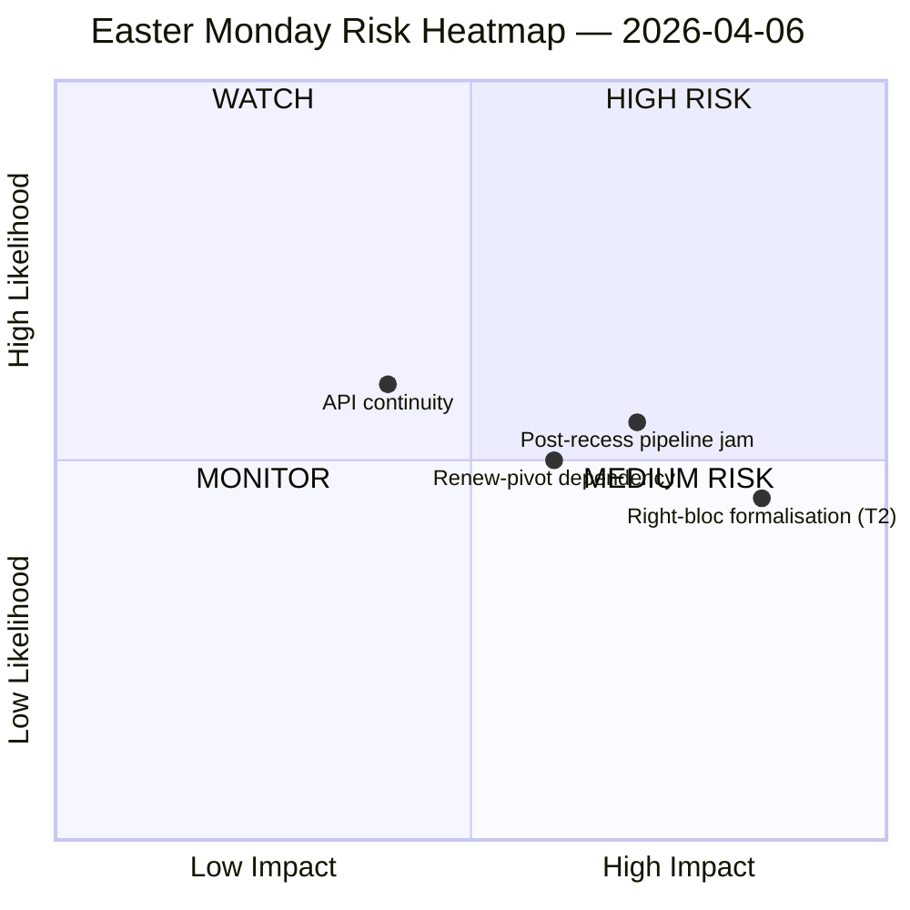

<!-- SPDX-FileCopyrightText: 2026 Hack23 AB -->
<!-- SPDX-License-Identifier: Apache-2.0 -->

# Nota Ejecutiva — Inteligencia de la Pausa del Lunes de Pascua | 2026-04-06

**Clasificación:** OSINT — Registro parlamentario público
**Fiabilidad:** 🟡 MEDIA (Pausa pascual día 11/18; 6 de los 8 puntos finales de la API del PE devuelven 404 durante 11 días consecutivos)
**Ejecución:** `analysis/daily/2026-04-06/breaking/`
**Cobertura:** 6 de abril de 2026 (Lunes de Pascua — día festivo en toda la UE; T-8 hasta semana de comisión, T-14 hasta plenario)
**Generada:** 2026-05-16 (nota retrospectiva, sin nuevas llamadas MCP)
**Fuentes primarias:** Estadísticas precalculadas EP MCP 2004–2026; Textos adoptados (solución de respaldo de una semana — 85 elementos); Feed MEP (737 registros).

---

## 🎯 Evaluación central

**El Lunes de Pascua produjo cero actividad parlamentaria por diseño — pero la ejecución registra el hallazgo estructural más consecuente de la quincena de pausa: 6 de los 8 puntos finales de la API del PE han devuelto errores 404 de forma continua desde el 28 de marzo, un patrón de degradación persistente de 11 días sin señales de recuperación.** Este colapso en la disponibilidad de datos no es un incidente transitorio sino un cambio estructural que limita toda monitorización posterior a través del reinicio de los comités tras Pascua. La ejecución distingue la *inactividad estructural* (un día festivo en 27 estados miembros produce cero eventos por definición) de las *brechas de datos* (los feeds consultivos — documentos de comisión, preguntas parlamentarias, procedimientos, documentos plenarios — están silenciosos porque los puntos finales están rotos, no porque no existan documentos). El análisis SWOT político extrae un hallazgo contraintuitivo pero bien fundamentado: con **EP10 en camino hacia 114 actos legislativos en 2026 (+46 % frente a 2025)** y un **retraso de 85 textos adoptados acumulados durante la pausa**, el reinicio del 13 de abril sobrecargará una semana de comisión de cuatro días con un trimestre de trabajo acumulado. El *riesgo* más consecuente es la **formalización del T2 bloque de derecha (EPP+ECR+PfE = 57 % de supermayoría potencial)** calificada como ALTA — la pregunta que la ejecución deja abierta y que las ejecuciones posteriores responderán es si la gran coalición orientada a aranceles (EPP+S&D+Renew = 55 % con déficit de excedente de −5,5 %) mantiene la disciplina cuando los expedientes arancelarios y bancarios fuercen cada voto emblema a la construcción de coaliciones ad hoc. El silencio de la semana está, por tanto, *cargado*, no *vacío*.

---

## 🧭 3 decisiones que esta nota respalda

| # | Decisión | Quién decide | Plazo | Evidencia |
|:-:|----------|-------------|:--------:|----------|
| 1 | **Escalada de recuperación de la API** — el patrón persistente de 404 durante 11 días necesita un responsable antes del reinicio de los comités; de lo contrario, la semana post-pausa abre sin monitorización en tiempo real de las asignaciones de comisión | Secretaría informática del PE; data-pipeline-specialist | **antes del reinicio de comisiones del 14 de abril** | §Resultados de recopilación de datos; 6/8 puntos finales 404 desde el 28 de marzo |
| 2 | **Conferencia previa de presidentes de comisión sobre el retraso de 85 elementos** — la priorización del pipeline debe resolverse por adelantado antes de la ventana de comisión del 14 al 17 de abril, no improvisarse el Día 1 | Conferencia de presidentes de comisión | 14 de abril (T-8 en el momento de la ejecución) | §Oportunidades O1; 85 elementos en el feed de textos adoptados |
| 3 | **Test de falsificación de supermayoría del bloque de derecha** — T2 (EPP+ECR+PfE = 57 %) es la amenaza de mayor gravedad; la primera votación comercial post-Pascua es el falsificador natural | Liderazgos de grupos EPP/ECR/PfE; observadores | primera votación comercial tras la pausa | §Amenazas T2 (gravedad ALTA) |

---

## 📰 Lectura de 60 segundos

- 🔴 **0 eventos parlamentarios lunes** — día festivo en 27 EM; cero es el valor *esperado*, no una brecha de datos.
- 🟠 **6/8 puntos finales de API 404 durante 11 días consecutivos** — estructural, no transitorio; fiabilidad ALTA (15+ ejecuciones).
- 🟢 **EP10 en camino hacia 114 actos (+46 % interanual)** frente a 78 en 2025 — ritmo récord proyectado.
- 🟡 **Retraso de 85 textos adoptados** durante la pausa — el T2 comienza con un pipeline cargado.
- 🔵 **Puntuación de estabilidad 84/100; 0 anomalías de votación** — integridad institucional intacta durante el silencio.
- 🟣 **Aritmética de gran coalición: EPP+S&D = 60 % de escaños** — capaz de mayoría sobre el papel pero con el déficit de excedente de −5,5 % que señalaron ejecuciones anteriores.
- 🩷 **T2 — potencial de supermayoría del bloque de derecha (EPP+ECR+PfE = 57 %)** — amenaza de mayor gravedad en la SWOT.
- ⚪ **737 registros MEP** — el feed MEP y el feed de textos adoptados son las únicas dos fuentes de señal operativas.

---

## ⚠️ Instantánea de riesgos (desde `risk-matrix.md`)

El único riesgo trazado por la ejecución es la continuidad de la API en el cuadrante WATCH; esta nota amplía la instantánea con tres riesgos nombrados visibles en la SWOT de la ejecución pero no en el diagrama quadrantChart. Nivel de **riesgo neto MEDIO, puntuación de estabilidad 84/100, delta respecto al 5 de abril estable** — el juicio principal de la ejecución se mantiene.

---

## 🧭 ACH — La lectura «Silenciosa pero Cargada»

- **H1 — Pausa de rutina.** La interrupción de la API es transitoria (mantenimiento pascual, regresa tras el 13 de abril); el retraso de 85 elementos es el rendimiento normal del T1. *Apoyado por* puntuación de estabilidad 84/100, cero anomalías.
- **H2 — Declive estructural de la API + estrés de coalición.** El patrón persistente de 11 días *no* es transitorio; el retraso de 85 elementos chocará con la semana de reinicio del comité de 4 días y forzará la formalización del bloque de derecha en al menos un expediente de defensa comercial. *Apoyado por* persistencia de 11 días (15+ ejecuciones de monitorización), T2 gravedad ALTA, trayectoria de ejecuciones anteriores.

Ambas hipótesis permanecen activas en el momento de la ejecución. El reinicio de los comités del 14 de abril y la primera votación comercial post-pausa son los falsificadores naturales; la nota lee H1 como *la base de planificación* y H2 como *el caso de contingencia*.

---

## 🔮 Principales desencadenantes futuros (próximos 14 días)

1. **13 de abril (T-7) — último día de pausa.** La señal de recuperación de la API (o su ausencia) es el indicador binario.
2. **14–17 de abril — semana de reinicio de comisiones.** El retraso de 85 elementos se enfrenta a una ventana de 4 días; las decisiones de triaje del pipeline determinan si el ritmo récord del T1 se rompe.
3. **15 de abril — plazo de aranceles de EE.UU.** Fuerza la primera señal comercial post-pausa de cada grupo; test de falsificación para la formalización T2 del bloque de derecha.
4. **17 de abril — decisión de tipos del BCE** (catalizador señalado por la ejecución) — puede activar el comité ECON en el día 4 de la semana de reinicio.
5. **27–30 de abril plenario de Estrasburgo** — primera oportunidad de plenario para consolidar o romper la proyección de ritmo récord.

---

## 🛡️ Evaluación de la calidad de las fuentes

- **Estadísticas precalculadas 2004–2026 (A1):** señal más fiable de la nota; la proyección de 114 actos y la puntuación de estabilidad de 84/100 se derivan ambas de esto.
- **Feed de textos adoptados (A2 — respaldo de una semana):** 85 elementos; la vista «hoy» generó un error de análisis JSON y la ejecución recurrió a la ventana semanal.
- **Feed MEP (A1):** 737 registros — segundo de los dos puntos finales operativos.
- **Seis puntos finales 404 (brecha documentada):** eventos, procedimientos, documentos, documentos plenarios, documentos de comisión, preguntas — la *existencia* de la actividad subyacente no puede confirmarse a través de la API para el período de pausa.
- **Nivel de confianza neto:** 🟡 MEDIO para la síntesis; 🟢 ALTO para el hallazgo de la interrupción de la API en sí (verificado objetivamente en 15+ ejecuciones de monitorización); 🟡 MEDIO para la amenaza T2 del bloque de derecha (la aritmética estructural es sólida, la prueba de comportamiento es post-pausa).

---

## 📎 Artefactos de ejecución (Leer antes de decidir)

| Capa | Artefacto | Por qué |
|-------|----------|-----|
| Artículo | `article.md` | Narración pública del Lunes de Pascua |
| Importancia | `significance-classification.md` | Clasificación del día de pausa con auditoría de 8 feeds |
| Riesgo | `risk-matrix.md` | Matriz 5×5; continuidad de la API en el cuadrante WATCH |
| Amenaza | `political-threat-landscape.md` | Amenaza política de 5 marcos (STRIDE rechazado) |
| SWOT | `political-swot-analysis.md` | 4F/4D/4O/4A con matriz de interferencia TOWS |
| Compañero | `2026-04-13/breaking-run168/`, `2026-04-11/week-in-review-run8/` | Encuadre de la quincena de pausa |

---

**Control del documento**
- **Referencia de plantilla:** `analysis/templates/executive-brief.md`
- **Ruta del artefacto:** `analysis/daily/2026-04-06/breaking/executive-brief.md`
- **Clasificación:** Pública
- **Retrospectivo:** Nota redactada el 2026-05-16 a partir de los artefactos comprometidos de la ejecución; **no se realizaron nuevas llamadas MCP**. La fiabilidad 🟡 MEDIA y el hallazgo de la interrupción de la API se conservan exactamente como los comprometió la ejecución.
