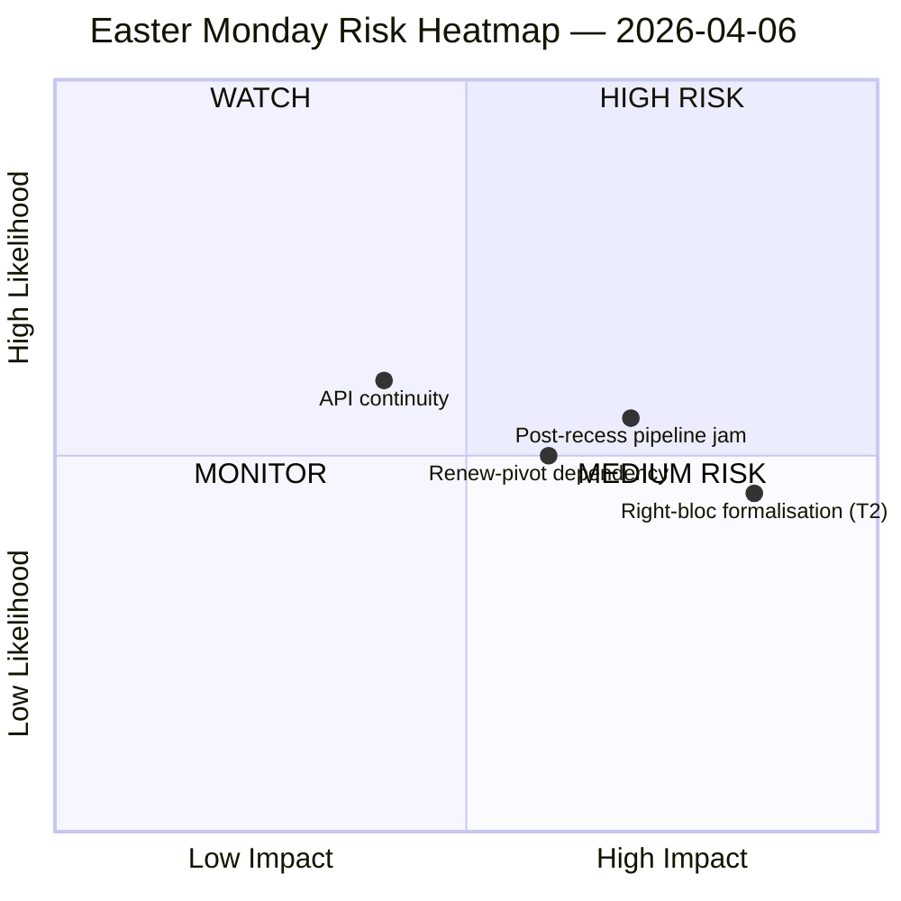

<!-- SPDX-FileCopyrightText: 2026 Hack23 AB -->
<!-- SPDX-License-Identifier: Apache-2.0 -->

# Tiedustelukatsaus — Toinen Pääsiäispäivä Tauko | 2026-04-06

**Luokitus:** OSINT — Julkinen parlamentaarinen pöytäkirja
**Luotettavuus:** 🟡 KOHTALAINEN (Pääsiäistauko päivä 11/18; 6/8 EP API-päätepisteistä palauttaa 404 yhdentoista päivän ajan peräkkäin)
**Ajo:** `analysis/daily/2026-04-06/breaking/`
**Kattavuus:** 6. huhtikuuta 2026 (Toinen pääsiäispäivä — koko EU:n yleinen vapaapäivä; T-8 valiokuntaviikkoon, T-14 täysistuntoon)
**Luotu:** 2026-05-16 (takautuva tietopaketti, ei uusia MCP-kutsuja)
**Ensisijaiset lähteet:** EP MCP esilaketut tilastot 2004–2026; Hyväksytyt tekstit (yhden viikon varavaihtoehto — 85 kohdetta); MEP-syöte (737 tietuetta).

---

## 🎯 Ydinarvio

**Toinen pääsiäispäivä tuotti nolla parlamentaarista toimintaa tarkoituksenmukaisesti — mutta ajo kirjaa taukokauden yksittäisen merkittävimmän rakenteellisen havainnon: 6/8 EP API-päätepisteistä on palauttanut 404-virheitä jatkuvasti 28. maaliskuuta lähtien, 11 päivän pysyvä hajoamismalli ilman palautumissignaaleja.** Tämä datatilauksen romahdus ei ole ohimenevä tapaus, vaan rakenteellinen muutos, joka rajoittaa kaikkea myöhempää seurantaa pääsiäisen jälkeisen valiokuntakokouksen uudelleenkäynnistyksen läpi. Ajo erottaa *rakenteellisen toimettomuuden* (julkinen vapaapäivä 27 jäsenvaltiossa tuottaa nolla tapahtumaa määritelmän mukaisesti) *dataaukkoista* (neuvoa-antavat syötteet — valiokuntatiedostot, kirjalliset kysymykset, menettelyt, täysistuntoasiakirjat — ovat hiljaisia, koska päätepisteet ovat rikki, ei siksi, että asiakirjoja ei ole). Poliittinen SWOT-analyysi poimii vastaIntuitiivisen mutta hyvin dokumentoidun havainnon: kun **EP10 on kurssilla kohti 114 lainsäädäntötointa vuonna 2026 (+46 % vs. 2025)** ja **85 hyväksytyn tekstin jälkijonoa kertyi tauon aikana**, 13. huhtikuuta tapahtuva uudelleenkäynnistys kuormittaa neljän päivän valiokuntaviikon neljännesvuoden kertyneen työn painoilla. Merkittävin *riski* on **T2 oikeistoblokin formalisointi (EPP+ECR+PfE = 57 % potentiaalinen suprenemmistö)** arvioitu KORKEA — kysymys, jonka ajo jättää avoimeksi ja johon myöhemmät ajot vastaavat, on pitääkö tulliin liittyvä suurkoalitio (EPP+S&D+Renew = 55 % -5,5 % ylijäämävajeella) kurin, kun tulli- ja pankkitiedostot pakottavat jokaisen lippulaivaäänestyksen ad hoc -koalitiornrakentamiseen. Viikon hiljaisuus on siis *ladattu*, ei *tyhjä*.

---

## 🧭 3 Päätöstä, joita tämä tietopaketti tukee

| # | Päätös | Kuka päättää | Määräaika | Todisteet |
|:-:|----------|-------------|:--------:|----------|
| 1 | **API-palautumisen eskalointi** — 11 päivän pysyvä 404-malli tarvitsee vastuuhenkilön ennen valiokunnan uudelleenkäynnistystä; muuten tauon jälkeinen viikko aukeaa ilman reaaliaikaista valiokuntatehtävien seurantaa | EP IT-sihteeristö; data-pipeline-specialist | **ennen 14. huhtikuuta valiokunnan uudelleenkäynnistystä** | §Tiedonkeruutulokset; 6/8 päätepistettä 404 28. maaliskuuta lähtien |
| 2 | **Ennakkobriefaus Valiokuntapuheenjohtajien konferenssi 85 kohteen jälkijonosta** — liukuhihnan priorisointi on ratkaistava etukäteen ennen 14.–17. huhtikuuta valiokuntaikkunaa, ei improvisoitava päivänä 1 | Valiokuntapuheenjohtajien konferenssi | 14. huhtikuuta (T-8 ajohetkellä) | §Mahdollisuudet O1; 85 kohdetta hyväksynneissä teksteissä |
| 3 | **Oikeistoblokin suprenemmistön falsifikaatiotesti** — T2 (EPP+ECR+PfE = 57 %) on vakavin uhka; ensimmäinen pääsiäisen jälkeinen kauppa-äänestys on luonnollinen falsifikaattori | EPP/ECR/PfE-ryhmäjohdot; tarkkailijat | ensimmäinen kauppaäänestys tauon jälkeen | §Uhat T2 (KORKEA vakavuus) |

---

## 📰 60 sekunnin lukeminen

- 🔴 **0 parlamentaarista tapahtumaa maanantaina** — julkinen vapaapäivä 27 jäsenvaltiossa; nolla on *odotettu* arvo, ei dataaukko.
- 🟠 **6/8 API-päätepistettä 404 yhdentoista päivän ajan peräkkäin** — rakenteellinen, ei ohimenevä; KORKEA luotettavuus (15+ ajoa).
- 🟢 **EP10 kurssilla kohti 114 tointa (+46 % YoY)** vs. 78 vuonna 2025 — ennätystahti ennustettu.
- 🟡 **85 kohteen jälkijono hyväksynneissä teksteissä** tauon aikana — Q2 alkaa ladatulla liukuhihnalla.
- 🔵 **Vakauspistemäärä 84/100; 0 äänestysanomalioita** — institutionaalinen eheys säilyi hiljaisuuden läpi.
- 🟣 **Suurkoalitioaritmetiikka: EPP+S&D = 60 % paikoista** — enemmistökykyinen paperilla, mutta aiempien ajojen merkitsemällä −5,5 % ylijäämävajeella.
- 🩷 **T2 — oikeistoblokin suprenemmistöpotentiaali (EPP+ECR+PfE = 57 %)** — vakavin uhka SWOTissa.
- ⚪ **737 MEP-tietuetta** — MEP-syöte ja hyväksyttyjen tekstien syöte ovat ainoat kaksi toimivaa signalaalähdettä.

---

## ⚠️ Riskilohkokuva (lähteestä `risk-matrix.md`)

Ainoa riski, jonka ajo piirtää, on API-jatkuvuus WATCH-kvadrantissa; tämä tietopaketti laajentaa tilannekuvaa kolmella nimetyllä riskillä, jotka näkyvät ajon SWOTissa mutta eivät quadrantChart-kaaviossa. Netto **riskitaso KOHTALAINEN, vakauspistemäärä 84/100, delta vs. 5. huhtikuuta vakaa** — ajon otsikoarvio pysyy.

---

## 🧭 ACH — "Hiljainen mutta Ladattu" -tulkinta

- **H1 — Rutiininomainen tauko.** API-katko on ohimenevä (pääsiäishuolto, palaa 13. huhtikuuta jälkeen); 85 kohteen jälkijono on normaali Q1-läpivirtaus. *Tukee* vakauspistemäärä 84/100, nolla anomalioita.
- **H2 — Rakenteellinen API-rappeutuminen + koalitiostressiä.** 11 päivän pysyvä malli *ei* ole ohimenevä; 85 kohteen jälkijono törmää 4 päivän valiokunnan uudelleenkäynnistysviikkoon ja pakottaa oikeistoblokin formalisoinnin vähintään yhdessä kauppa-puolustusasiakirjassa. *Tukee* 11 päivän pysyvyys (15+ seurantaajoa), T2 KORKEA vakavuus, aiempi ajoura.

Molemmat hypoteesit pysyvät aktiivisina ajohetkellä. Valiokunnan uudelleenkäynnistys 14. huhtikuuta ja ensimmäinen kauppaäänestys tauon jälkeen ovat luonnolliset falsifioijat; tietopaketti lukee H1:n *suunnittelun lähtötasona* ja H2:n *varautumisvaihto ehtona*.

---

## 🔮 Tulevat Huippulaukaisijat (seuraavat 14 päivää)

1. **13. huhtikuuta (T-7) — tauon viimeinen päivä.** API-palautumissignaali (tai sen puuttuminen) on binaariindikaattori.
2. **14.–17. huhtikuuta — valiokunnan uudelleenkäynnistysviikko.** 85 kohteen jälkijono kohtaa 4 päivän ikkunan; liukuhihnan triaasipassatukset ratkaisevat, katkeaako ennätystahtinen Q1.
3. **15. huhtikuuta — Yhdysvaltain tullimääräaika.** Pakottaa jokaisen ryhmän ensimmäisen tauon jälkeisen kauppasignaalin; T2 oikeistoblokin formalisoinnin falsifioijatesti.
4. **17. huhtikuuta — EKP:n korkopäätös** (ajon merkitsemä katalysaattori) — voi aktivoida ECON-valiokunnan uudelleenkäynnistysviikon päivänä 4.
5. **27.–30. huhtikuuta Strasbourgin täysistunto** — ensimmäinen täysistuntomahdollisuus konsolidoida tai rikkoa ennätystahtiprojektion.

---

## 🛡️ Lähteen Laadun Arviointi

- **Esilaketut tilastot 2004–2026 (A1):** tietopaketin luotettavin signaali; 114 toimen ennuste ja 84/100 vakauspistemäärä molemmat johdetaan tästä.
- **Hyväksyttyjen tekstien syöte (A2 — yhden viikon varavaihtoehto):** 85 kohdetta; "tänään"-näkymä antoi JSON-jäsennysvirheen ja ajo kaatui takaisin viikkoikkunaan.
- **MEP-syöte (A1):** 737 tietuetta — toinen kahdesta toimivasta päätepisteestä.
- **Kuusi 404-päätepistettä (dokumentoitu aukko):** tapahtumat, menettelyt, asiakirjat, täysistuntoasiakirjat, valiokuntatiedostot, kysymykset — taustalla olevan toiminnan *olemassaoloa* ei voida vahvistaa APIn kautta taukokauden osalta.
- **Nettoluotettavuus:** 🟡 KOHTALAINEN synteesin osalta; 🟢 KORKEA itse API-katko-löydölle (objektiivisesti varmennettu 15+ seurantaajossa); 🟡 KOHTALAINEN oikeistoblokin T2-uhalle (rakenteellinen aritmetiikka on vahva, käyttäytymistesti on tauon jälkeen).

---

## 📎 Ajoartefaktit (Lue-Ennen-Päätöstä)

| Kerros | Artefakti | Miksi |
|-------|----------|-----|
| Artikkeli | `article.md` | Julkinen kertomus toisesta pääsiäispäivästä |
| Merkitys | `significance-classification.md` — 8-syötteen tarkastus |
| Riski | `risk-matrix.md` | 5×5-matriisi; API-jatkuvuus WATCH-kvadrantissa |
| Uhka | `political-threat-landscape.md` | 5-kehyksen poliittinen uhka (STRIDE hylätty) |
| SWOT | `political-swot-analysis.md` | 4S/4W/4O/4T TOWS-interferenssimatriisilla |
| Kumppani | `2026-04-13/breaking-run168/`, `2026-04-11/week-in-review-run8/` | Taukon kahden viikon sulkeet |

---

**Asiakirjan hallinta**
- **Malliviite:** `analysis/templates/executive-brief.md`
- **Artefaktin polku:** `analysis/daily/2026-04-06/breaking/executive-brief.md`
- **Luokitus:** Julkinen
- **Takautuva:** Tietopaketti kirjoitettu 2026-05-16 ajon committatuista artefakteista; **uusia MCP-kutsuja ei tehty**. 🟡 KOHTALAINEN-luotettavuus ja API-katko-löytö on säilytetty täsmälleen sellaisena kuin ajo ne committasi.
