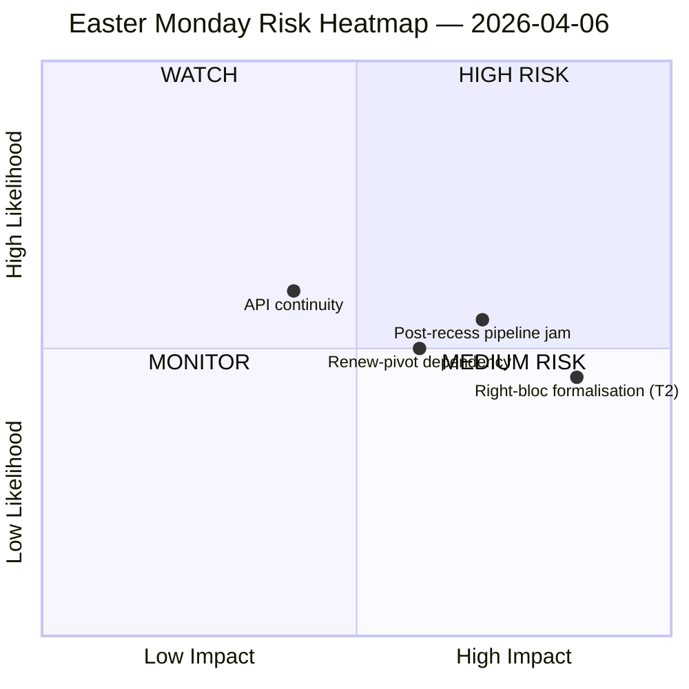

<!-- SPDX-FileCopyrightText: 2026 Hack23 AB -->
<!-- SPDX-License-Identifier: Apache-2.0 -->

# Note de synthèse — Renseignement de la Pause du Lundi de Pâques | 2026-04-06

**Classification :** OSINT — Dossier parlementaire public
**Fiabilité :** 🟡 MOYENNE (Pause pascale jour 11/18 ; 6 des 8 points de terminaison de l'API du PE retournent 404 depuis 11 jours consécutifs)
**Exécution :** `analysis/daily/2026-04-06/breaking/`
**Couverture :** 6 avril 2026 (Lundi de Pâques — jour férié dans l'ensemble de l'UE ; T-8 avant la semaine de commission, T-14 avant la plénière)
**Générée :** 2026-05-16 (note rétrospective, aucun nouvel appel MCP)
**Sources primaires :** Statistiques précalculées EP MCP 2004–2026 ; Textes adoptés (solution de repli d'une semaine — 85 éléments) ; Flux MEP (737 enregistrements).

---

## 🎯 Évaluation centrale

**Le Lundi de Pâques n'a produit aucune activité parlementaire par conception — mais l'exécution enregistre la découverte structurelle la plus conséquente de la quinzaine de pause : 6 des 8 points de terminaison de l'API du PE ont retourné des erreurs 404 en continu depuis le 28 mars, soit un schéma de dégradation persistant de 11 jours sans signaux de rétablissement.** Cet effondrement de la disponibilité des données n'est pas un incident transitoire, mais un changement structurel qui contraint toute surveillance en aval à travers le redémarrage des comités post-Pâques. L'exécution distingue l'*inactivité structurelle* (un jour férié dans 27 États membres produit zéro événement par définition) des *lacunes de données* (les flux consultatifs — documents de comité, questions parlementaires, procédures, documents de plénière — sont silencieux parce que les points de terminaison sont défaillants, et non parce qu'aucun document n'existe). L'analyse SWOT politique extrait un constat contre-intuitif mais bien étayé : avec **EP10 en bonne voie pour 114 actes législatifs en 2026 (+46 % par rapport à 2025)** et un **arriéré de 85 textes adoptés accumulé pendant la pause**, le redémarrage du 13 avril chargera une semaine de commission de quatre jours d'un trimestre de travail en attente. Le *risque* le plus conséquent est la **formalisation du T2 bloc de droite (EPP+ECR+PfE = 57 % de supermajorité potentielle)** notée ÉLEVÉE — la question que l'exécution laisse ouverte et que les exécutions suivantes répondront est de savoir si la grande coalition axée sur les tarifs douaniers (EPP+S&D+Renew = 55 % avec −5,5 % de déficit d'excédent) maintient sa discipline lorsque les dossiers tarifaires et bancaires forcent chaque vote phare dans la construction de coalitions ad hoc. Le silence de la semaine est donc *chargé*, non *vide*.

---

## 🧭 3 décisions que cette note soutient

| # | Décision | Qui décide | Échéance | Preuves |
|:-:|----------|-------------|:--------:|----------|
| 1 | **Escalade de la reprise de l'API** — le schéma persistant de 404 sur 11 jours nécessite un responsable avant le redémarrage des comités ; sinon la semaine post-pause s'ouvre sans surveillance en temps réel des attributions de comité | Secrétariat informatique du PE ; data-pipeline-specialist | **avant le redémarrage des comités du 14 avril** | §Résultats de collecte des données ; 6/8 points de terminaison 404 depuis le 28 mars |
| 2 | **Conférence préalable des présidents de commission sur l'arriéré de 85 éléments** — la priorisation du pipeline doit être réglée avant la fenêtre du comité du 14 au 17 avril, et non improvisée le jour 1 | Conférence des présidents de commission | 14 avril (T-8 au moment de l'exécution) | §Opportunités O1 ; 85 éléments dans le flux de textes adoptés |
| 3 | **Test de falsification de la supermajorité du bloc de droite** — T2 (EPP+ECR+PfE = 57 %) est la menace de plus haute gravité ; le premier vote commercial post-Pâques est le falsificateur naturel | Directions des groupes EPP/ECR/PfE ; observateurs | premier vote commercial après la pause | §Menaces T2 (gravité ÉLEVÉE) |

---

## 📰 Lecture de 60 secondes

- 🔴 **0 événement parlementaire lundi** — jour férié dans 27 EM ; zéro est la valeur *attendue*, non une lacune de données.
- 🟠 **6/8 points de terminaison d'API 404 pendant 11 jours consécutifs** — structurel, non transitoire ; fiabilité ÉLEVÉE (15+ exécutions).
- 🟢 **EP10 en bonne voie pour 114 actes (+46 % en glissement annuel)** par rapport à 78 en 2025 — rythme record projeté.
- 🟡 **Arriéré de 85 textes adoptés** pendant la pause — le T2 démarre avec un pipeline chargé.
- 🔵 **Score de stabilité 84/100 ; 0 anomalie de vote** — intégrité institutionnelle intacte pendant le silence.
- 🟣 **Arithmétique de grande coalition : EPP+S&D = 60 % des sièges** — compétent pour la majorité sur le papier mais avec le déficit d'excédent de −5,5 % signalé par les exécutions précédentes.
- 🩷 **T2 — potentiel de supermajorité du bloc de droite (EPP+ECR+PfE = 57 %)** — menace de plus haute gravité dans la SWOT.
- ⚪ **737 enregistrements MEP** — le flux MEP et le flux de textes adoptés sont les deux seules sources de signal opérationnelles.

---

## ⚠️ Instantané des risques (depuis `risk-matrix.md`)

Le seul risque tracé par l'exécution est la continuité de l'API dans le quadrant WATCH ; cette note étend l'instantané avec trois risques nommés visibles dans la SWOT de l'exécution mais pas dans le diagramme quadrantChart. Niveau de **risque net MOYEN, score de stabilité 84/100, delta par rapport au 5 avril stable** — le jugement principal de l'exécution se maintient.

---

## 🧭 ACH — La lecture « Silencieuse mais Chargée »

- **H1 — Pause de routine.** La panne de l'API est transitoire (maintenance pascale, retour après le 13 avril) ; l'arriéré de 85 éléments est un débit Q1 normal. *Favorisé par* le score de stabilité 84/100, zéro anomalie.
- **H2 — Déclin structurel de l'API + stress de coalition.** Le schéma persistant de 11 jours n'est *pas* transitoire ; l'arriéré de 85 éléments entrera en collision avec la semaine de redémarrage du comité de 4 jours et forcera la formalisation du bloc de droite sur au moins un dossier de défense commerciale. *Favorisé par* la persistance de 11 jours (15+ exécutions de surveillance), T2 gravité ÉLEVÉE, trajectoire des exécutions précédentes.

Les deux hypothèses restent actives au moment de l'exécution. Le redémarrage des comités du 14 avril et le premier vote commercial post-pause sont les falsificateurs naturels ; la note lit H1 comme *la base de planification* et H2 comme *le cas de contingence*.

---

## 🔮 Principaux déclencheurs futurs (14 prochains jours)

1. **13 avril (T-7) — dernier jour de pause.** Signal de récupération de l'API (ou son absence) est l'indicateur binaire.
2. **14–17 avril — semaine de redémarrage des comités.** L'arriéré de 85 éléments rencontre une fenêtre de 4 jours ; les décisions de triage du pipeline déterminent si le rythme record du T1 se brise.
3. **15 avril — délai des droits de douane américains.** Force le premier signal commercial post-pause de chaque groupe ; test de falsification pour la formalisation du T2 bloc de droite.
4. **17 avril — décision de taux de la BCE** (catalyseur signalé par l'exécution) — peut activer le comité ECON le jour 4 de la semaine de redémarrage.
5. **27–30 avril plénière de Strasbourg** — première opportunité de plénière pour consolider ou briser la projection de rythme record.

---

## 🛡️ Évaluation de la qualité des sources

- **Statistiques précalculées 2004–2026 (A1) :** signal le plus fiable de la note ; la projection de 114 actes et le score de stabilité de 84/100 en sont tous deux dérivés.
- **Flux de textes adoptés (A2 — solution de repli d'une semaine) :** 85 éléments ; la vue « aujourd'hui » a généré une erreur d'analyse JSON et l'exécution s'est rabattue sur la fenêtre hebdomadaire.
- **Flux MEP (A1) :** 737 enregistrements — deuxième des deux points de terminaison opérationnels.
- **Six points de terminaison 404 (lacune documentée) :** événements, procédures, documents, documents de plénière, documents de comité, questions — l'*existence* de l'activité sous-jacente ne peut être confirmée via l'API pour la période de pause.
- **Niveau de confiance net :** 🟡 MOYEN pour la synthèse ; 🟢 ÉLEVÉ pour la découverte de la panne d'API elle-même (vérifiée objectivement dans 15+ exécutions de surveillance) ; 🟡 MOYEN pour la menace T2 du bloc de droite (l'arithmétique structurelle est ferme, le test comportemental est post-pause).

---

## 📎 Artefacts d'exécution (À lire avant de décider)

| Couche | Artefact | Pourquoi |
|-------|----------|-----|
| Article | `article.md` | Récit public du Lundi de Pâques |
| Importance | `significance-classification.md` | Classification du jour de pause avec audit à 8 flux |
| Risque | `risk-matrix.md` | Matrice 5×5 ; continuité de l'API dans le quadrant WATCH |
| Menace | `political-threat-landscape.md` | Menace politique à 5 cadres (STRIDE rejeté) |
| SWOT | `political-swot-analysis.md` | 4F/4F/4O/4M avec matrice d'interférence TOWS |
| Compagnon | `2026-04-13/breaking-run168/`, `2026-04-11/week-in-review-run8/` | Encadrement de la quinzaine de pause |

---

**Contrôle du document**
- **Référence de modèle :** `analysis/templates/executive-brief.md`
- **Chemin d'artefact :** `analysis/daily/2026-04-06/breaking/executive-brief.md`
- **Classification :** Publique
- **Rétrospectif :** Note rédigée le 2026-05-16 à partir des artefacts committés de l'exécution ; **aucun nouvel appel MCP n'a été effectué**. La fiabilité 🟡 MOYENNE et la découverte de la panne d'API sont conservées exactement telles que l'exécution les a committées.
