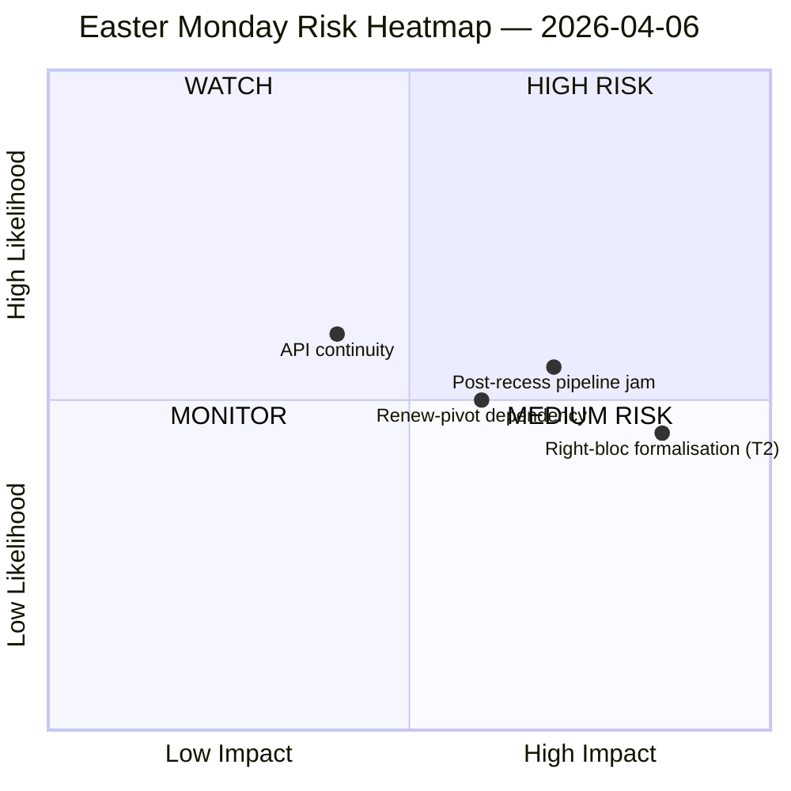

<!-- SPDX-FileCopyrightText: 2026 Hack23 AB -->
<!-- SPDX-License-Identifier: Apache-2.0 -->

# סיכום מנהלים — מודיעין הפסקת יום שני של פסחא | 2026-04-06

**סיווג:** OSINT — רשומה פרלמנטרית ציבורית
**אמינות:** 🟡 בינונית (הפסקת פסחא יום 11/18; 6 מתוך 8 נקודות קצה של API של הפרלמנט האירופי מחזירות 404 במשך 11 ימים רצופים)
**ריצה:** `analysis/daily/2026-04-06/breaking/`
**כיסוי:** 6 באפריל 2026 (יום שני של פסחא — חג ציבורי בכל רחבי האיחוד האירופי; T-8 עד שבוע ועדה, T-14 עד מליאה)
**נוצר:** 2026-05-16 (דו"ח רטרוספקטיבי, ללא קריאות MCP חדשות)
**מקורות ראשוניים:** סטטיסטיקות מחושבות מראש של EP MCP 2004–2026; טקסטים שאומצו (גיבוי שבוע אחד — 85 פריטים); הזנת MEP (737 רשומות).

---

## 🎯 הערכה מרכזית

**יום שני של פסחא הניב אפס פעילות פרלמנטרית בתכנון — אך הריצה מתעדת את הממצא המבני המשמעותי ביותר של שבועיים ההפסקה: 6 מתוך 8 נקודות קצה API של הפרלמנט האירופי החזירו שגיאות 404 ברציפות מאז 28 במרץ, תבנית שפל מתמשכת של 11 יום ללא אותות התאוששות.** קריסת זמינות הנתונים הזאת אינה תקרית חולפת אלא שינוי מבני המגביל את כל הניטור הבאחרית דרך אתחול הוועדות לאחר פסחא. הריצה מבחינה בין *אי-פעילות מבנית* (חג ציבורי ב-27 מדינות חברות מניב אפס אירועים בהגדרה) לבין *פערי נתונים* (הזנות ייעוציות — מסמכי ועדה, שאלות פרלמנטריות, נהלים, מסמכי מליאה — שקטות כי נקודות הקצה שבורות, לא כי אין מסמכים). ניתוח SWOT הפוליטי מפיק ממצא נגד-אינטואיטיבי אך מוצדק היטב: עם **EP10 במסלול ל-114 מעשי חקיקה ב-2026 (+46% לעומת 2025)** ו**צבירה של 85 טקסטים שאומצו במהלך ההפסקה**, האתחול של 13 באפריל יטעין שבוע ועדה בן ארבעה ימים בעבודה מצטברת של רבע שנה. הסיכון המשמעותי ביותר הוא **T2 פורמליזציה של גוש הימין (EPP+ECR+PfE = 57% רוב-על פוטנציאלי)** מדורג גבוה — השאלה שהריצה משאירה פתוחה ושריצות עתידיות יענו עליה היא האם הקואליציה הגדולה הממוקדת-תעריפים (EPP+S&D+Renew = 55% עם גירעון עודף של −5.5%) תשמור משמעת כשתיקי המכסים והבנקים יכריחו כל הצבעת דגל לבניית קואליציות אד-הוק. שקט השבוע הוא אפוא *טעון*, לא *ריק*.

---

## 🧭 3 החלטות שהדו"ח הזה תומך בהן

| # | החלטה | מי מחליט | מועד אחרון | ראיות |
|:-:|----------|-------------|:--------:|----------|
| 1 | **הסלמת שחזור API** — תבנית 404 מתמשכת של 11 יום צריכה בעלים לפני אתחול הוועדות; אחרת שבוע ההפסקה ייפתח ללא ניטור חי של בקשות הוועדה | מזכירות IT של הפרלמנט האירופי; data-pipeline-specialist | **לפני אתחול ועדות 14 באפריל** | §תוצאות איסוף הנתונים; 6/8 נקודות קצה 404 מאז 28 במרץ |
| 2 | **ועידת כינוס ראשי ועדות על פיגור של 85 פריטים** — תעדוף צינור הנתונים צריך להתפתר מראש לפני חלון הוועדה 14–17 באפריל, לא לאלתר ביום 1 | ועידת ראשי ועדות | 14 באפריל (T-8 בעת הריצה) | §הזדמנויות O1; 85 פריטים בהזנת טקסטים שאומצו |
| 3 | **מבחן הפרכה של רוב-על של גוש הימין** — T2 (EPP+ECR+PfE = 57%) הוא האיום בעוצמת הסיכון הגבוהה ביותר; ההצבעה המסחרית הראשונה לאחר הפסחא היא המפריך הטבעי | הנהגות קבוצות EPP/ECR/PfE; משקיפים | הצבעה מסחרית ראשונה לאחר ההפסקה | §איומים T2 (חומרה גבוהה) |

---

## 📰 קריאה של 60 שניות

- 🔴 **0 אירועים פרלמנטריים ביום שני** — חג ציבורי ב-27 מ"ח; אפס הוא הערך *הצפוי*, לא פער נתונים.
- 🟠 **6/8 נקודות קצה API מחזירות 404 במשך 11 ימים רצופים** — מבני, לא חולף; אמינות גבוהה (15+ ריצות).
- 🟢 **EP10 במסלול ל-114 מעשים (+46% שנה-אחרי-שנה)** לעומת 78 ב-2025 — קצב שיא מוקרן.
- 🟡 **פיגור של 85 טקסטים שאומצו** במהלך ההפסקה — Q2 מתחיל עם צינור טעון.
- 🔵 **ציון יציבות 84/100; 0 אנומליות הצבעה** — שלמות מוסדית שלמה לאורך השקט.
- 🟣 **אריתמטיקה של קואליציה גדולה: EPP+S&D = 60% מהמושבים** — מסוגל לרוב על הנייר אך עם גירעון עודף של −5.5% שריצות קודמות סימנו.
- 🩷 **T2 — פוטנציאל רוב-על של גוש הימין (EPP+ECR+PfE = 57%)** — האיום בחומרה הגבוהה ביותר ב-SWOT.
- ⚪ **737 רשומות MEP** — הזנת MEP והזנת טקסטים שאומצו הן שתי מקורות האות המבצעיות היחידות.

---

## ⚠️ תצלום-רגע של סיכונים (מתוך `risk-matrix.md`)

הסיכון היחיד שמצייר הריצה הוא רציפות API ברביע WATCH; דו"ח זה מרחיב את תצלום-הרגע עם שלושה סיכונים מוגדרים שגלויים ב-SWOT של הריצה אך לא בתרשים ה-quadrantChart. **רמת סיכון נטו: בינונית, ציון יציבות 84/100, דלתא לעומת 5 באפריל: יציב** — פסיקת הכותרת של הריצה נשמרת.

---

## 🧭 ACH — הפרשנות "שקט אך טעון"

- **H1 — הפסקה שגרתית.** הפסקת API חולפת (תחזוקת פסחא, חוזרת לאחר 13 באפריל); פיגור של 85 פריטים הוא תפוקה רגילה של Q1. *נתמך על-ידי* ציון יציבות 84/100, אפס אנומליות.
- **H2 — קריסה מבנית של API + לחץ קואליציוני.** תבנית מתמשכת של 11 ימים *אינה* חולפת; פיגור של 85 פריטים יתנגש עם שבוע האתחול של הוועדה בן 4 הימים ויכריח פורמליזציה של גוש הימין על לפחות תיק הגנה מסחרי אחד. *נתמך על-ידי* התמדה של 11 ימים (15+ ריצות ניטור), T2 חומרה גבוהה, מסלול ריצות קודמות.

שתי ההשערות נשארות פעילות בעת הריצה. אתחול הוועדות ב-14 באפריל וההצבעה המסחרית הראשונה לאחר ההפסקה הם המפריכים הטבעיים; הדו"ח קורא H1 כ*קו הבסיס לתכנון* ו-H2 כ*מקרה החירום*.

---

## 🔮 טריגרים עתידיים מובילים (14 הימים הבאים)

1. **13 באפריל (T-7) — היום האחרון של ההפסקה.** אות שחזור API (או היעדרו) הוא המדד הבינארי.
2. **14–17 באפריל — שבוע אתחול הוועדות.** פיגור של 85 פריטים פוגש חלון של 4 ימים; החלטות מיון הצינור קובעות אם קצב ה-Q1 השיא נשבר.
3. **15 באפריל — מועד אחרון של תעריפי ארה"ב.** מכריח את אות המסחר הראשון לאחר ההפסקה של כל קבוצה; מבחן הפרכה לפורמליזציה T2 של גוש הימין.
4. **17 באפריל — החלטת ריבית של ה-ECB** (קטליזטור שסומן על-ידי הריצה) — עשוי להפעיל את ועדת ECON ביום 4 של שבוע האתחול.
5. **27–30 באפריל מליאה בסטרסבורג** — הזדמנות מליאה ראשונה לגבש או לשבור את תחזית קצב השיא.

---

## 🛡️ הערכת איכות מקורות

- **סטטיסטיקות מחושבות מראש 2004–2026 (A1):** האות האמיני ביותר של הדו"ח; תחזית 114 המעשים וציון היציבות 84/100 שניהם נגזרים מכאן.
- **הזנת טקסטים שאומצו (A2 — גיבוי שבוע אחד):** 85 פריטים; תצוגת "היום" הניבה שגיאת ניתוח JSON והריצה נסוגה לחלון השבועי.
- **הזנת MEP (A1):** 737 רשומות — השנייה מבין שתי נקודות הקצה המבצעיות.
- **שש נקודות קצה 404 (פער מתועד):** אירועים, נהלים, מסמכים, מסמכי מליאה, מסמכי ועדה, שאלות — *קיום* הפעילות הבסיסית אינו ניתן לאישור דרך API לתקופת ההפסקה.
- **דרגת ביטחון נטו:** 🟡 בינונית לסינתזה; 🟢 גבוהה לממצא הפסקת ה-API עצמו (אומת אובייקטיבית על-פני 15+ ריצות ניטור); 🟡 בינונית לאיום T2 של גוש הימין (האריתמטיקה המבנית יציבה, מבחן ההתנהגות הוא לאחר ההפסקה).

---

## 📎 ממצאי הריצה (קרא לפני הפעלה)

| שכבה | ממצא | מדוע |
|-------|----------|-----|
| מאמר | `article.md` | הנרטיב הציבורי של יום שני של פסחא |
| משמעות | `significance-classification.md` | סיווג יום הפסקה עם ביקורת 8 הזנות |
| סיכון | `risk-matrix.md` | מטריצה 5×5; רציפות API ברביע WATCH |
| איום | `political-threat-landscape.md` | איום פוליטי של 5 מסגרות (STRIDE נדחה) |
| SWOT | `political-swot-analysis.md` | 4ח/4ח/4ה/4א עם מטריצת הפרעות TOWS |
| לוויין | `2026-04-13/breaking-run168/`، `2026-04-11/week-in-review-run8/` | פרנסה של שבועיים ההפסקה |

---

**בקרת מסמך**
- **הפניה לתבנית:** `analysis/templates/executive-brief.md`
- **נתיב ממצא:** `analysis/daily/2026-04-06/breaking/executive-brief.md`
- **סיווג:** ציבורי
- **רטרוספקטיבי:** הדו"ח נכתב ב-2026-05-16 מממצאים שהוגשו של הריצה; **לא בוצעו קריאות MCP חדשות**. האמינות 🟡 הבינונית וממצא הפסקת ה-API שמורים בדיוק כפי שהריצה הגישה אותם.
