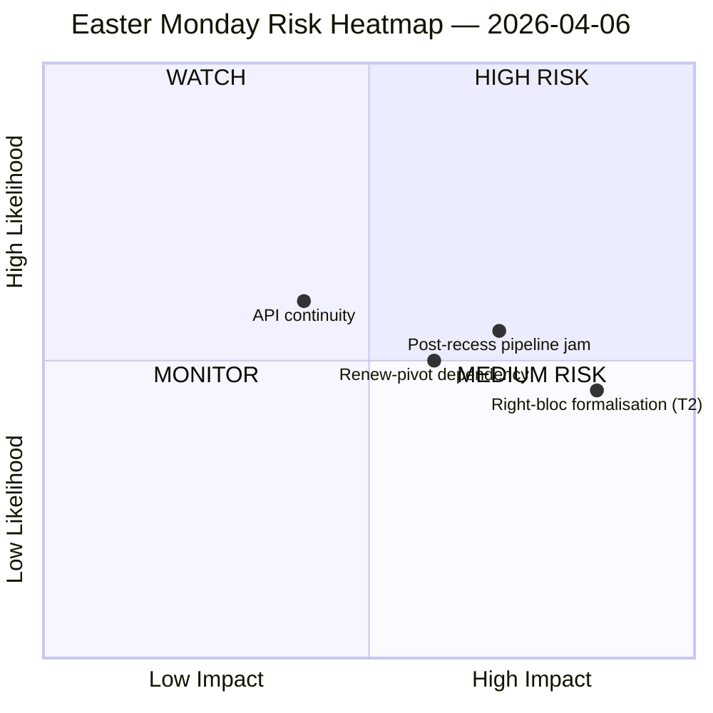

<!-- SPDX-FileCopyrightText: 2026 Hack23 AB -->
<!-- SPDX-License-Identifier: Apache-2.0 -->

# 幹部向けブリーフィング — 復活祭休暇中の情報 | 2026-04-06

**分類:** OSINT — 公開議会記録
**信頼度:** 🟡 中程度（復活祭休暇11日/18日目；EP API エンドポイント8件のうち6件が11日連続で404を返している）
**実行:** `analysis/daily/2026-04-06/breaking/`
**対象期間:** 2026年4月6日（復活祭月曜日 — EU全域の祝日；委員会週まで T-8、本会議まで T-14）
**作成日:** 2026-05-16（遡及的ブリーフィング、新規 MCP コールなし）
**主要ソース:** EP MCP 事前計算統計 2004–2026；採択テキスト（1週間フォールバック — 85件）；MEP フィード（737件）。

---

## 🎯 BLUF

**復活祭月曜日は設計上ゼロの議会活動しか生み出さなかったが、それにもかかわらず本実行は休暇二週間で最も重要な構造的知見を記録する：EP API エンドポイント8件のうち6件が3月28日以来継続的に404エラーを返しており、11日間に及ぶ持続的な劣化パターンで回復の兆候がない。** このデータ可用性崩壊は一時的な障害ではなく、イースター後の委員会再開に向けた下流監視をすべて制約する構造的変化である。本実行は「構造的不活動」（27加盟国における祝日は定義上ゼロのイベントを生み出す）と「データギャップ」（諮問フィード ── 委員会文書、議会質問、手続き、本会議文書 ── はエンドポイントが壊れているために沈黙しており、文書が存在しないからではない）を明確に区別する。政治的 SWOT は反直感的ながらよく根拠づけられた知見を抽出する：**EP10 が2026年に114件の立法行為（2025年比+46%）に向かっている**中、**休暇中に85件の採択テキストが積み上がり**、4月13日の再開は1四半期分の蓄積作業を4日間の委員会週に押し込む。最も決定的な「リスク」は **T2 右派ブロックの正式化（PPE+ECR+PfE = 57% 潜在的スーパー多数）** で高評価されており ── 本実行が開かれたまま残す問い、後続実行が答える問いは、Renew ピボット大連立（PPE+S&D+Renew = 55%、余剰赤字 -5.5%）が、関税・銀行ファイルがすべての旗艦票決をアドホックな連立構築に追い込む際に規律を維持できるかどうかである。今週の沈黙はそれゆえ「*空虚*」ではなく「*重圧*」を帯びている。

---

## 🧭 3 Decisions This Brief Supports

| # | 決断 | 決定者 | 期限 | 根拠 |
|:-:|------|--------|:----:|------|
| 1 | **API 回復エスカレーション** ── 11日間持続する 404 パターンは委員会再開前に責任者が必要；でないと休暇後の週は委員会割り当てのライブ監視なしに始まる | EP IT 事務局；data-pipeline-specialist | **4月14日の委員会再開前** | §データ収集結果；3月28日以来 6/8 エンドポイント 404 |
| 2 | **85件積み残しについての委員長会議事前ブリーフィング** ── パイプライン優先順位は4月14〜17日の委員会ウィンドウに向けて事前に決定すべきで、1日目に即興してはならない | 委員長会議 | 4月14日（実行時点で T-8） | §機会 O1；採択テキスト85件積み残し |
| 3 | **右派ブロック・スーパー多数の反証テスト設計** ── T2（PPE+ECR+PfE = 57%）は最高深刻度の脅威；休暇後最初の貿易票決がブロック正式化を検証する自然な反証器 | EPP/ECR/PfE グループ指導部；観察者 | 休暇後最初の貿易票決 | §脅威 T2（深刻度：高） |

---

## 📰 60-Second Read

- 🔴 **月曜日の議会イベント 0件** ── 27加盟国で祝日；ゼロは「予想される」値であり、データギャップではない。
- 🟠 **6/8 API エンドポイントが11日連続で 404** ── 一時的ではなく構造的；高信頼度（15回以上の実行）。
- 🟢 **EP10 は114件（前年比+46%）に向かっている** 2025年の78件比 ── 記録的ペースを予測。
- 🟡 **85件の採択テキスト積み残し** 休暇中 ── Q2 は負荷の高いパイプラインで始まる。
- 🔵 **安定スコア 84/100；投票異常 0件** ── 沈黙の中で制度的完全性を維持。
- 🟣 **大連立の算術：PPE+S&D = 60% の議席** ── 紙の上では多数決可能だが、以前の実行で指摘された -5.5% の余剰赤字がある。
- 🩷 **T2 ── 右派ブロック・スーパー多数ポテンシャル（PPE+ECR+PfE = 57%）** ── SWOT で最高深刻度の脅威。
- ⚪ **737 MEP 記録** ── MEP フィードと採択テキストが唯二つの稼働シグナルソース。

---

## ⚠️ Risk Snapshot (from `risk-matrix.md`)

実行が描いた唯一のリスクは WATCH 象限での API 継続性である；本ブリーフィングは実行の SWOT に見えるが quadrantChart ダイアグラム自体には現れていない3つの名前付きリスクでスナップショットを拡張する。ネット「リスクレベル：中程度、安定スコア84/100、4月5日比デルタ：安定」── 実行の見出し判断は支持されている。

---

## 🧭 ACH — The "Quiet but Loaded" Reading

- **H1 ── 通常の休暇。** API 停止は一時的（イースターメンテナンス、4月13日以降に回復）；85件積み残しは通常の Q1 スループット。「安定スコア 84/100、異常ゼロ」によって支持。
- **H2 ── 構造的 API 低下 ＋ 連立ストレス。** 11日間の持続パターンは「一時的ではない」；85件積み残しは4日間の委員会再開週と衝突し、少なくとも1件の貿易・防衛ファイルで右派ブロックの正式化を強制する。11日間の持続（15回以上の監視実行）、T2 高深刻度、過去の実行軌跡によって支持。

両仮説は実行時点で開かれたまま。4月14日の委員会再開と休暇後最初の貿易票決が自然な反証器；本ブリーフィングは H1 を「計画基線」、H2 を「緊急時ケース」として扱う。

---

## 🔮 Top Forward Triggers (next 14 days)

1. **4月13日（T-7）── 休暇最終日。** API 回復シグナル（またはその欠如）が二値指標。
2. **4月14〜17日 ── 委員会再開週。** 85件積み残しが4日間のウィンドウと出会う；パイプライントリアージ判断が Q1 の記録ペースが破れるかを決める。
3. **4月15日 ── 米国関税期限。** 休暇後各グループの最初の貿易票決シグナルを強制；T2 右派ブロック正式化の反証器。
4. **4月17日 ── ECB 金利決定**（実行フラグ付き触媒）── 再開週4日目に ECON 委員会を活性化させる可能性。
5. **4月27〜30日 ストラスブール本会議** ── 記録ペース予測を固めるか崩すかの最初の本会議機会。

---

## 🛡️ Source-Quality Assessment

- **事前計算統計 2004–2026（A1）：** ブリーフィングで最も信頼できるシグナル；114件予測と84/100安定スコアの両方がここから導出される。
- **採択テキストフィード（A2 ── 1週間フォールバック）：** 85件；「今日」ビューが JSON パースエラーを投げ、実行は週間ウィンドウにフォールバック。
- **MEP フィード（A1）：** 737件 ── 2つの稼働エンドポイントのうちの2番目。
- **404 エンドポイント6件（記録されたギャップ）：** イベント、手続き、文書、本会議文書、委員会文書、質問 ── 休暇期間の基礎活動の「存在」を API 経由で確認することはできない。
- **ネット信頼度：** 🟡 合成では中程度；🟢 API 停止所見そのものでは高（15回以上の監視実行で客観的に確認）；🟡 右派ブロック T2 脅威では中程度（構造的算術は確固、行動テストは休暇後）。

---

## 📎 Run Artifacts (Read-Before-Decide)

| レイヤー | アーティファクト | 理由 |
|---------|----------------|------|
| 記事 | `article.md` | 復活祭月曜日の公開ナラティブ |
| 重要性 | `significance-classification.md` | 8フィード監査付き休暇日分類 |
| リスク | `risk-matrix.md` | 5×5マトリクス；WATCH 象限に API 継続性 |
| 脅威 | `political-threat-landscape.md` | 5フレームワーク政治的脅威（STRIDE 却下） |
| SWOT | `political-swot-analysis.md` | 4S/4W/4O/4T と TOWS 干渉マトリクス |
| コンパニオン | `2026-04-13/breaking-run168/`、`2026-04-11/week-in-review-run8/` | 休暇二週間のブラケット |

---

**文書管理**
- **テンプレート参照:** `analysis/templates/executive-brief.md`
- **アーティファクトパス:** `analysis/daily/2026-04-06/breaking/executive-brief.md`
- **分類:** 公開
- **遡及:** ブリーフィングは2026-05-16に実行の保存アーティファクトから作成；**新規 MCP コールは行われていない**。🟡 中程度の信頼度と API 停止所見は実行が保存した通りに保持される。
