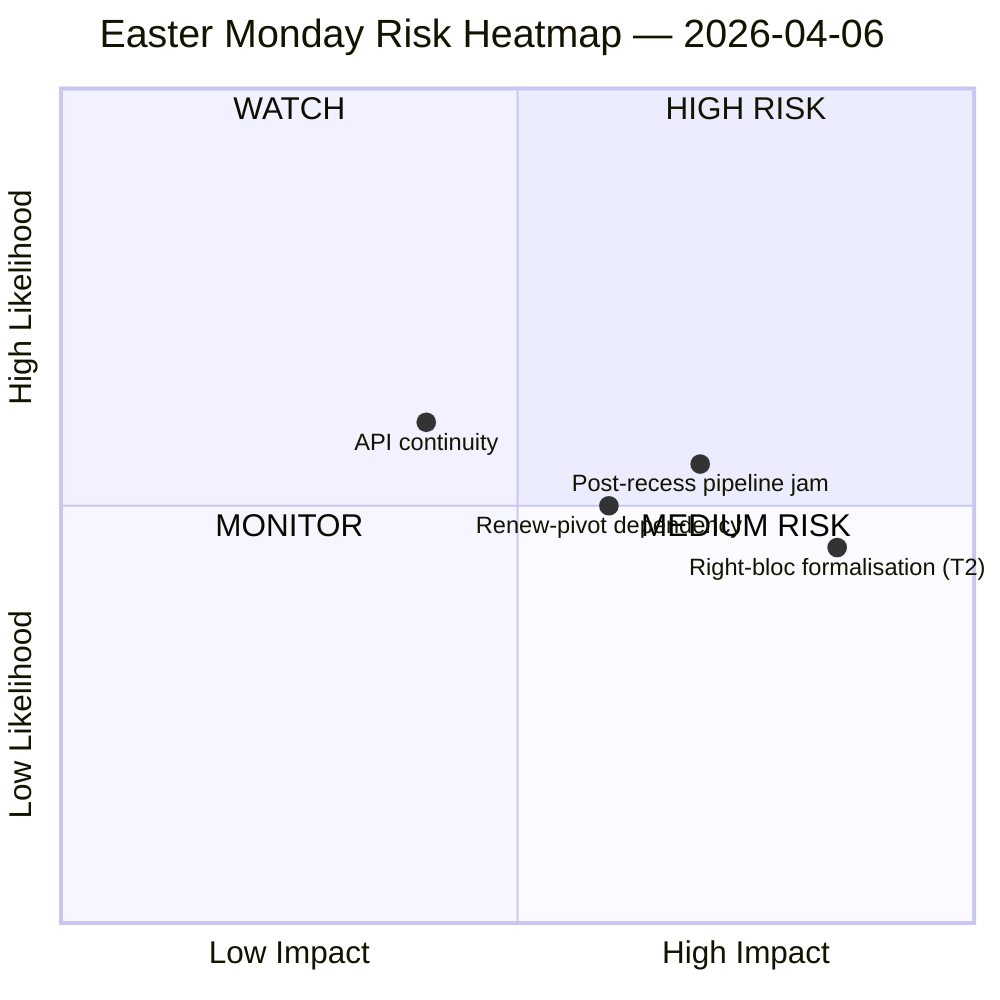

<!-- SPDX-FileCopyrightText: 2026 Hack23 AB -->
<!-- SPDX-License-Identifier: Apache-2.0 -->

# 임원 브리핑 — 부활절 휴가 중 | 2026-04-06

**분류:** OSINT — 공개 의회 기록
**신뢰도:** 🟡 보통 (부활절 휴가 11일/18일차; EP API 엔드포인트 8개 중 6개가 11일 연속 404 반환)
**실행:** `analysis/daily/2026-04-06/breaking/`
**대상 기간:** 2026년 4월 6일 (부활절 월요일 — EU 전역 공휴일; 위원회 주간까지 T-8, 본회의까지 T-14)
**작성일:** 2026-05-16 (소급 브리핑, 신규 MCP 호출 없음)
**주요 출처:** EP MCP 사전 계산 통계 2004–2026; 채택 텍스트 (1주일 대체 — 85건); MEP 피드 (737명).

---

## 🎯 BLUF

**부활절 월요일은 설계상 0건의 의회 활동만 산출했지만, 그럼에도 이번 실행은 휴가 2주 동안 가장 중요한 구조적 발견을 기록한다: EP API 엔드포인트 8개 중 6개가 3월 28일 이후 지속적으로 404 오류를 반환하고 있으며, 11일간 지속된 저하 패턴에서 회복 신호가 없다.** 이 데이터 가용성 붕괴는 일시적 장애가 아니라 부활절 이후 위원회 재개에 대한 모든 하류 모니터링을 제약하는 구조적 변화다. 이번 실행은 '구조적 비활동'(27개 회원국의 공휴일은 정의상 0건의 이벤트를 산출)과 '데이터 공백'(자문 피드 — 위원회 문서, 의회 질의, 절차, 본회의 문서 — 는 문서가 없어서가 아니라 엔드포인트가 고장났기 때문에 침묵)을 명확히 구분한다. 정치적 SWOT는 반직관적이지만 충분히 근거 있는 통찰을 도출한다: **EP10이 2026년에 114건의 입법 행위(2025년 대비 +46%)를 향해 나아가는** 가운데, **휴가 중에 85건의 채택 텍스트가 쌓였고**, 4월 13일 재개는 분기치 누적 작업을 4일간의 위원회 주간에 압축한다. 가장 결정적인 '위협'은 **T2 우익 블록의 공식화(PPE+ECR+PfE = 57% 잠재적 슈퍼 다수)**로 고위험 판정을 받았다 — 이 실행이 열어두고 후속 실행이 답해야 할 질문은, 관세·은행 파일이 모든 주요 표결을 임시 연립 구성으로 몰아넣을 때 Renew 피벗 대연립(PPE+S&D+Renew = 55%, 잉여 적자 -5.5%)이 기율을 유지할 수 있는지 여부다. 이번 주의 침묵은 그러므로 '비어있는' 것이 아니라 '긴장으로 가득 찬' 것이다.

---

## 🧭 3 Decisions This Brief Supports

| # | 결정 | 의사결정자 | 기한 | 근거 |
|:-:|------|-----------|:----:|------|
| 1 | **API 회복 에스컬레이션** — 11일 지속 404 패턴은 위원회 재개 전 책임 부서 지정이 필요; 그렇지 않으면 휴가 후 주간이 위원회 배정 실시간 모니터링 없이 시작됨 | EP IT 사무국; data-pipeline-specialist | **4월 14일 위원회 재개 전** | §데이터 수집 결과; 3월 28일 이후 6/8 엔드포인트 404 |
| 2 | **85건 적체에 대한 의장단 회의 사전 브리핑** — 파이프라인 우선순위는 4월 14~17일 위원회 윈도우를 위해 사전에 결정되어야 하며 첫날 즉흥적으로 해서는 안 됨 | 의장단 회의 | 4월 14일 (실행 시점 T-8) | §기회 O1; 채택 텍스트 85건 적체 |
| 3 | **우익 블록 슈퍼 다수의 반증 테스트 설계** — T2(PPE+ECR+PfE = 57%)는 최고 심각도 위협; 휴가 후 첫 번째 무역 표결이 블록 공식화의 자연스러운 반증기 | EPP/ECR/PfE 그룹 지도부; 관찰자 | 휴가 후 첫 무역 표결 | §위협 T2 (심각도: 높음) |

---

## 📰 60-Second Read

- 🔴 **월요일 의회 이벤트 0건** — 27개 회원국 공휴일; 0은 '예상 값'이며 데이터 공백이 아님.
- 🟠 **6/8 API 엔드포인트 11일 연속 404** — 일시적이 아닌 구조적; 높은 신뢰도 (15회 이상 실행).
- 🟢 **EP10은 114건(전년 대비 +46%)을 향해 나아가고 있음** 2025년 78건 대비 — 기록적 속도 예측.
- 🟡 **85건의 채택 텍스트 적체** 휴가 중 — Q2는 높은 부하의 파이프라인으로 시작.
- 🔵 **안정 점수 84/100; 투표 이상 0건** — 침묵 속에서 제도적 무결성 유지.
- 🟣 **대연립 산술: PPE+S&D = 60% 의석** — 서류상 다수 가능하지만 이전 실행에서 지적된 -5.5% 잉여 적자.
- 🩷 **T2 — 우익 블록 슈퍼 다수 잠재력(PPE+ECR+PfE = 57%)** — SWOT에서 최고 심각도 위협.
- ⚪ **737명 MEP 기록** — MEP 피드와 채택 텍스트가 유일한 두 개의 가동 신호 소스.

---

## ⚠️ Risk Snapshot (from `risk-matrix.md`)

실행이 묘사한 유일한 위험은 WATCH 사분면의 API 연속성이었다; 이 브리핑은 실행의 SWOT에는 나타나지만 quadrantChart 다이어그램 자체에는 없는 3개의 명명된 위험으로 스냅샷을 확장한다. 순 '위험 수준: 보통, 안정 점수 84/100, 4월 5일 대비 델타: 안정' — 실행의 헤드라인 판단은 지지된다.

---

## 🧭 ACH — The "Quiet but Loaded" Reading

- **H1 — 통상적인 휴가.** API 중단은 일시적(부활절 유지보수, 4월 13일 이후 회복); 85건 적체는 정상적인 Q1 처리량. '안정 점수 84/100, 이상 없음'으로 지지.
- **H2 — 구조적 API 저하 + 연립 스트레스.** 11일 지속 패턴은 '일시적이 아님'; 85건 적체는 4일간의 위원회 재개 주간과 충돌하여 최소 1건의 무역·국방 파일에서 우익 블록 공식화를 강제. 11일 지속(15회 이상 모니터링 실행), T2 고심각도, 이전 실행 궤적으로 지지.

두 가설 모두 실행 시점에 열려 있다. 4월 14일 위원회 재개와 휴가 후 첫 무역 표결이 자연스러운 반증기; 이 브리핑은 H1을 '계획 기준선', H2를 '비상 시나리오'로 취급한다.

---

## 🔮 Top Forward Triggers (next 14 days)

1. **4월 13일(T-7) — 휴가 마지막 날.** API 회복 신호(또는 그 부재)가 이진 지표.
2. **4월 14~17일 — 위원회 재개 주간.** 85건 적체가 4일 윈도우와 만남; 파이프라인 트리아지 결정이 Q1 기록 속도가 유지될지를 결정.
3. **4월 15일 — 미국 관세 기한.** 휴가 후 각 그룹의 첫 무역 표결 신호를 강제; T2 우익 블록 공식화 반증기.
4. **4월 17일 — ECB 금리 결정** (실행 플래그 촉매) — 재개 주간 4일째 ECON 위원회를 활성화할 가능성.
5. **4월 27~30일 스트라스부르 본회의** — 기록 속도 예측을 확인하거나 깨뜨릴 첫 본회의 기회.

---

## 🛡️ Source-Quality Assessment

- **사전 계산 통계 2004–2026(A1):** 브리핑에서 가장 신뢰할 수 있는 신호; 114건 예측과 84/100 안정 점수 모두 여기서 도출.
- **채택 텍스트 피드(A2 — 1주일 대체):** 85건; '오늘' 뷰가 JSON 파싱 오류를 발생시켜 실행이 주간 윈도우로 대체.
- **MEP 피드(A1):** 737명 — 두 가동 엔드포인트 중 두 번째.
- **404 엔드포인트 6개(기록된 공백):** 이벤트, 절차, 문서, 본회의 문서, 위원회 문서, 질의 — 휴가 기간 기초 활동의 '존재'를 API로 확인 불가.
- **순 신뢰도:** 🟡 종합에서 보통; 🟢 API 중단 발견 자체에서는 높음(15회 이상 모니터링 실행으로 객관적 확인); 🟡 우익 블록 T2 위협에서는 보통(구조적 산술은 확고, 행동 테스트는 휴가 후).

---

## 📎 Run Artifacts (Read-Before-Decide)

| 레이어 | 아티팩트 | 이유 |
|--------|---------|------|
| 기사 | `article.md` | 부활절 월요일 공개 내러티브 |
| 중요도 | `significance-classification.md` | 8피드 감사 포함 휴가일 분류 |
| 리스크 | `risk-matrix.md` | 5×5 매트릭스; WATCH 사분면에 API 연속성 |
| 위협 | `political-threat-landscape.md` | 5프레임워크 정치적 위협(STRIDE 기각) |
| SWOT | `political-swot-analysis.md` | 4S/4W/4O/4T와 TOWS 간섭 매트릭스 |
| 동반 | `2026-04-13/breaking-run168/`, `2026-04-11/week-in-review-run8/` | 휴가 2주간 브래킷 |

---

**문서 관리**
- **템플릿 참조:** `analysis/templates/executive-brief.md`
- **아티팩트 경로:** `analysis/daily/2026-04-06/breaking/executive-brief.md`
- **분류:** 공개
- **소급:** 브리핑은 2026-05-16에 실행의 저장된 아티팩트에서 작성됨; **신규 MCP 호출 없음**. 🟡 보통 신뢰도와 API 중단 발견은 실행이 저장한 대로 유지됨.
