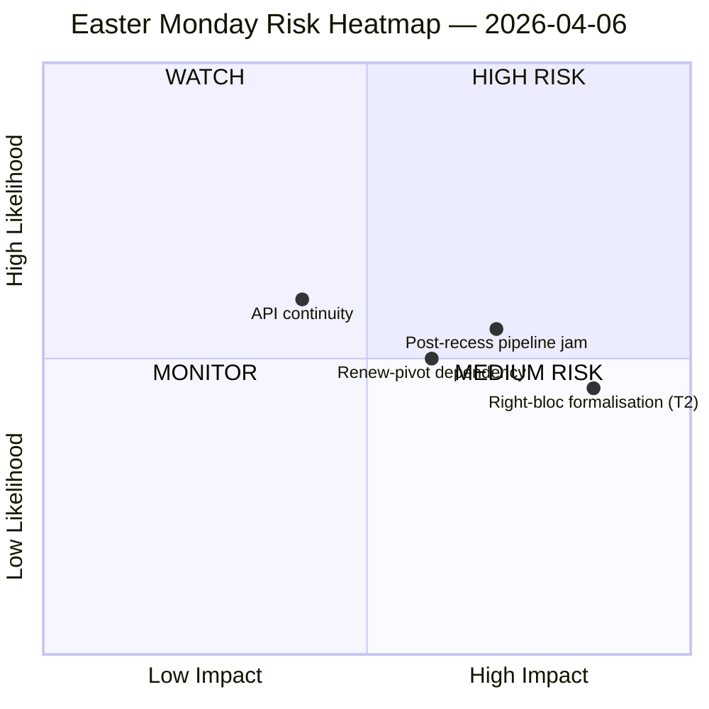

<!-- SPDX-FileCopyrightText: 2026 Hack23 AB -->
<!-- SPDX-License-Identifier: Apache-2.0 -->

# Uitvoerend Briefing — Inlichtingen Paasmaandag Reces | 2026-04-06

**Classificatie:** OSINT — Openbaar parlementair dossier
**Betrouwbaarheid:** 🟡 GEMIDDELD (Paasreces dag 11/18; 6 van de 8 EP API-eindpunten geven 404 terug gedurende 11 opeenvolgende dagen)
**Uitvoering:** `analysis/daily/2026-04-06/breaking/`
**Dekking:** 6 april 2026 (Paasmaandag — EU-brede officiële feestdag; T-8 tot commissieweek, T-14 tot plenaire vergadering)
**Gegenereerd:** 2026-05-16 (retrospectieve briefing, geen nieuwe MCP-aanroepen)
**Primaire bronnen:** EP MCP voorberekende statistieken 2004–2026; Aangenomen teksten (één-week-terugval — 85 items); MEP-feed (737 records).

---

## 🎯 Kernbeoordeling

**Paasmaandag produceerde door ontwerp nul parlementaire activiteit — maar de uitvoering registreert de meest ingrijpende structurele bevinding van het recessfortnight: 6 van de 8 EP API-eindpunten hebben vanaf 28 maart continu 404-fouten teruggegeven, een 11-daags aanhoudend degradatiepatroon zonder herstelsignalen.** Dit instorten van de gegevensbeschikbaarheid is geen voorbijgaand incident maar een structurele verschuiving die alle stroomafwaartse monitoring beperkt via de herstart van commissievergaderingen na Pasen. De uitvoering onderscheidt *structurele inactiviteit* (een officiële feestdag in 27 lidstaten produceert per definitie nul evenementen) van *gegevenslacunes* (adviessfeeds — commissiedocumenten, parlementaire vragen, procedures, plenaire documenten — zijn stil omdat de eindpunten defect zijn, niet omdat er geen documenten bestaan). De politieke SWOT-analyse extraheert een contra-intuïtieve maar goed onderbouwde bevinding: met **EP10 op koers voor 114 wetgevingshandelingen in 2026 (+46 % ten opzichte van 2025)** en een **achterstand van 85 aangenomen teksten die tijdens het reces is opgebouwd**, zal de herstart van 13 april een vier-daagse commissieweek belasten met een kwartaal aan opgestapeld werk. Het meest ingrijpende *risico* is de **T2 rechterblok-formalisering (EPP+ECR+PfE = 57 % potentiële supermeerderheid)** beoordeeld als HOOG — de vraag die de uitvoering open laat en die volgende uitvoeringen zullen beantwoorden, is of de op tarieven gerichte grote coalitie (EPP+S&D+Renew = 55 % met −5,5 % surplusdeficit) de discipline handhaaft zodra tarief- en bankendossiers elke flaggenschip-stemming in ad-hoc-coalitievorming dwingen. De stilte van de week is dan ook *geladen*, niet *leeg*.

---

## 🧭 3 beslissingen die deze briefing ondersteunt

| # | Beslissing | Wie beslist | Deadline | Bewijs |
|:-:|----------|-------------|:--------:|----------|
| 1 | **API-herstelescalering** — 11-daags aanhoudend 404-patroon heeft een verantwoordelijke nodig vóór de commissieherstart; anders opent de post-recessweek zonder live monitoring van commissieopdrachten | EP IT-secretariaat; data-pipeline-specialist | **vóór 14 april commissieherstart** | §Gegevensverzamelingsresultaten; 6/8 eindpunten 404 sinds 28 maart |
| 2 | **Pre-briefing Conferentie van commissievoorzitters over achterstand van 85 items** — pipelineprioriteitsgeving moet vooraf worden vastgesteld vóór het commissievenster van 14–17 april, niet geïmproviseerd op dag 1 | Conferentie van commissievoorzitters | 14 april (T-8 op het moment van uitvoering) | §Kansen O1; 85 items in de aangenomen-teksten-feed |
| 3 | **Rechterblok-supermeerderheids falsificatietest** — T2 (EPP+ECR+PfE = 57 %) is de bedreiding met de hoogste ernst; de eerste post-Paas-handelsstemming is de natuurlijke falsificator | EPP/ECR/PfE-groepsleidingen; waarnemers | eerste handelsstemming na reces | §Bedreigingen T2 (HOGE ernst) |

---

## 📰 Lezing van 60 seconden

- 🔴 **0 parlementaire evenementen maandag** — officiële feestdag in 27 LS; nul is de *verwachte* waarde, geen gegevenslacune.
- 🟠 **6/8 API-eindpunten 404 gedurende 11 opeenvolgende dagen** — structureel, niet voorbijgaand; HOGE betrouwbaarheid (15+ uitvoeringen).
- 🟢 **EP10 op koers voor 114 handelingen (+46 % j/j)** ten opzichte van 78 in 2025 — recordtempo geprojecteerd.
- 🟡 **Achterstand van 85 aangenomen teksten** tijdens het reces — K2 start met een geladen pipeline.
- 🔵 **Stabiliteitsscore 84/100; 0 stemanomalieën** — institutionele integriteit intact door de stilte heen.
- 🟣 **Grote-coalitie-rekenkunde: EPP+S&D = 60 % van de zetels** — meerderheidsbekwaam op papier maar met het −5,5 % surplusdeficit dat eerdere uitvoeringen hebben gemarkeerd.
- 🩷 **T2 — rechterblok supermeerderheids potentieel (EPP+ECR+PfE = 57 %)** — hoogste-ernst-bedreiging in de SWOT.
- ⚪ **737 MEP-records** — de MEP-feed en de aangenomen-teksten-feed zijn de enige twee operationele signaalbronnen.

---

## ⚠️ Risicomomentopname (vanuit `risk-matrix.md`)

Het enige risico dat door de uitvoering wordt uitgezet, is API-continuïteit in het WATCH-kwadrant; deze briefing breidt de momentopname uit met drie benoemde risico's die zichtbaar zijn in de SWOT van de uitvoering maar niet in het quadrantChart-diagram. Netto **risiconiveau GEMIDDELD, stabiliteitsscore 84/100, delta ten opzichte van 5 april stabiel** — het hoofdoordeel van de uitvoering houdt stand.

---

## 🧭 ACH — De "Stil maar Geladen" Lezing

- **H1 — Routine-reces.** API-storing is voorbijgaand (Paasonderhoud, keert terug na 13 april); achterstand van 85 items is normale K1-doorvoer. *Ondersteund door* stabiliteitsscore 84/100, nul anomalieën.
- **H2 — Structureel API-verval + coalitiedruk.** Het 11-daags aanhoudend patroon is *niet* voorbijgaand; de achterstand van 85 items zal botsen met de 4-daagse commissie-herstartweek en rechterblok-formalisering afdwingen bij minstens één handels-verteidiging-akte. *Ondersteund door* persistentie van 11 dagen (15+ monitoring-uitvoeringen), T2 HOGE ernst, vroegere uitvoeringshistorie.

Beide hypothesen blijven actief op het moment van uitvoering. De commissieherstart op 14 april en de eerste handelsstemming na het reces zijn de natuurlijke falsificatoren; de briefing leest H1 als *de planningsbasislijn* en H2 als *het noodgeval*.

---

## 🔮 Top Toekomstige Triggers (volgende 14 dagen)

1. **13 april (T-7) — laatste dag van reces.** API-herstelsignaal (of het ontbreken ervan) is de binaire indicator.
2. **14–17 april — commissie-herstartweek.** Achterstand van 85 items ontmoet 4-daags venster; pipeline-triagebesluiten bepalen of het record-K1-tempo breekt.
3. **15 april — deadline Amerikaanse tarieven.** Dwingt het eerste post-reces-handelssignaal van elke groep; falsificatietest voor T2-rechterblok-formalisering.
4. **17 april — ECB-rentebeslissing** (door uitvoering gemarkeerde katalysator) — kan de ECON-commissie activeren op dag 4 van de herstartweek.
5. **27–30 april plenaire vergadering Straatsburg** — eerste plenaire gelegenheid om de recordtempoprejectie te consolideren of te breken.

---

## 🛡️ Beoordeling van de bronkwaliteit

- **Voorberekende statistieken 2004–2026 (A1):** het meest betrouwbare signaal van de briefing; de 114-handelingen-projectie en de 84/100-stabiliteitsscore worden beide hiervan afgeleid.
- **Aangenomen-teksten-feed (A2 — één-week-terugval):** 85 items; de "vandaag"-weergave gaf een JSON-parseerfout en de uitvoering viel terug op het weekvenster.
- **MEP-feed (A1):** 737 records — tweede van de twee operationele eindpunten.
- **Zes 404-eindpunten (gedocumenteerde lacune):** evenementen, procedures, documenten, plenaire documenten, commissiedocumenten, vragen — het *bestaan* van de onderliggende activiteit kan niet worden bevestigd via de API voor de recessperiode.
- **Netto-betrouwbaarheid:** 🟡 GEMIDDELD voor de synthese; 🟢 HOOG voor de API-storings-bevinding zelf (objectief geverifieerd in 15+ monitoring-uitvoeringen); 🟡 GEMIDDELD voor de rechterblok-T2-bedreiging (structurele rekenkundige basis is solide, gedragstest is na het reces).

---

## 📎 Uitvoeringsartefacten (Lees vóór beslissen)

| Laag | Artefact | Waarom |
|-------|----------|-----|
| Artikel | `article.md` | Openbaar narratief Paasmaandag |
| Significantie | `significance-classification.md` | Reces-dag-classificatie met 8-feed-audit |
| Risico | `risk-matrix.md` | 5×5-matrix; API-continuïteit in WATCH-kwadrant |
| Bedreiging | `political-threat-landscape.md` | 5-kader politieke bedreiging (STRIDE afgewezen) |
| SWOT | `political-swot-analysis.md` | 4S/4Z/4K/4B met TOWS-interferentiematrix |
| Begeleider | `2026-04-13/breaking-run168/`, `2026-04-11/week-in-review-run8/` | Recessfortnight-omkadering |

---

**Documentbeheer**
- **Sjabloonreferentie:** `analysis/templates/executive-brief.md`
- **Artefactpad:** `analysis/daily/2026-04-06/breaking/executive-brief.md`
- **Classificatie:** Openbaar
- **Retrospectief:** Briefing geschreven 2026-05-16 vanuit de gecommitteerde artefacten van de uitvoering; **er zijn geen nieuwe MCP-aanroepen gedaan**. De 🟡 GEMIDDELD-betrouwbaarheid en de API-storings-bevinding zijn precies bewaard zoals de uitvoering ze committeerde.
