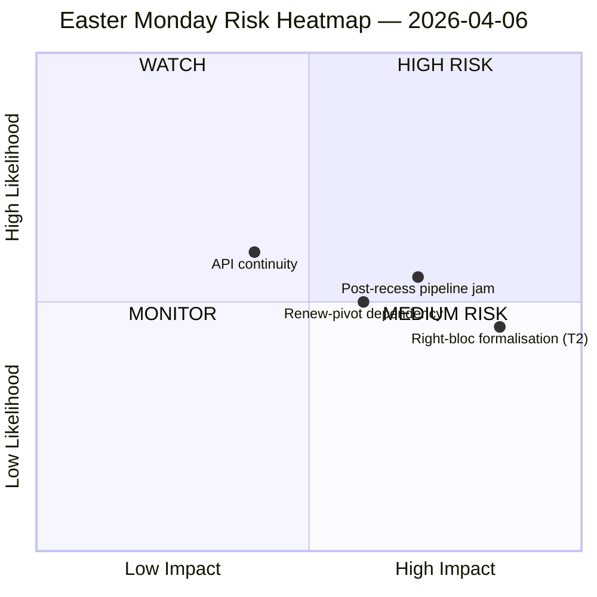

<!-- SPDX-FileCopyrightText: 2026 Hack23 AB -->
<!-- SPDX-License-Identifier: Apache-2.0 -->

# Etterretningsoversikt — Andre Påskedag Pause | 2026-04-06

**Klassifisering:** OSINT — Offentlig parlamentarisk protokoll
**Tillit:** 🟡 MIDDELS (Påskepause dag 11/18; 6 av 8 EP API-endepunkter returnerer 404 i 11 dager på rad)
**Kjøring:** `analysis/daily/2026-04-06/breaking/`
**Dekning:** 6. april 2026 (Andre påskedag — EU-dekkende offentlig helligdag; T-8 til utvalgsuke, T-14 til plenum)
**Generert:** 2026-05-16 (retrospektivt notat, ingen nye MCP-anrop)
**Primære kilder:** EP MCP forhåndsberegnede statistikker 2004–2026; Vedtatte tekster (en-ukes reserve — 85 poster); MEP-strøm (737 poster).

---

## 🎯 Kjernebedømmelse

**Andre påskedag produserte null parlamentarisk aktivitet etter planen — men kjøringen registrerer det enkelt mest avgjørende strukturelle funnet i pausefortnatten: 6 av 8 EP API-endepunkter har returnert 404-feil kontinuerlig siden 28. mars, et 11-dagers vedvarende forringelsesmønster uten gjenopprettingssignaler.** Denne kollapsen i datatilgjengelighet er ikke en forbigående hendelse, men et strukturelt skifte som begrenser all nedstrøms overvåking gjennom gjenoppstarten av utvalgsarbeidet etter påske. Kjøringen skiller *strukturell inaktivitet* (en offentlig helligdag i 27 medlemsstater produserer null hendelser per definisjon) fra *datagap* (rådgivende strømmer — utvalgsdokumenter, parlamentariske spørsmål, prosedyrer, plenumsdokumenter — er stille fordi endepunktene er ødelagte, ikke fordi ingen dokumenter finnes). Den politiske SWOT-analysen ekstraherer et kontraintuitivt men veldokumentert funn: med **EP10 på kurs mot 114 lovgivningsakter i 2026 (+46 % mot 2025)** og en **etterslep på 85 vedtatte tekster akkumulert under pausen**, vil gjenoppstarten 13. april belaste en 4-dagers utvalgsuke med et kvartals oppdemt arbeid. Den mest avgjørende *risikoen* er **T2 høyreblokk-formalisering (EPP+ECR+PfE = 57 % potensielt superflertall)** vurdert HØY — spørsmålet kjøringen lar stå åpent og som etterfølgende kjøringer vil svare på er om den tollrelaterte storkoalisjonen (EPP+S&D+Renew = 55 % med −5,5 % overskuddsunderskudd) holder disiplin når toll- og bankfiler tvinger hver flaggskipsavstemning til ad hoc-koalisjonsbygging. Ukens stillhet er derfor *ladet*, ikke *tom*.

---

## 🧭 3 Beslutninger dette notatet støtter

| # | Beslutning | Hvem bestemmer | Frist | Bevis |
|:-:|----------|-------------|:--------:|----------|
| 1 | **API-gjenoppretting eskalering** — 11-dagers vedvarende 404-mønster trenger en ansvarlig før utvalgsgenoppstart; ellers åpner uken etter pause uten live-overvåking av utvalgsoppgaver | EP IT-sekretariat; data-pipeline-specialist | **før 14. april utvalgsgenoppstart** | §Datainnsamlingsresultater; 6/8 endepunkter 404 siden 28. mars |
| 2 | **Pre-brief Konferanse for utvalgsformenn om 85-posters etterslep** — prioritering av pipeline må avgjøres på forhånd for utvalgsvinduet 14–17. april, ikke improviseres dag 1 | Konferanse for utvalgsformenn | 14. april (T-8 ved kjøringstidspunkt) | §Muligheter O1; 85 poster i vedtatte tekster |
| 3 | **Høyreblokk-superflertalls falsifikasjonstest** — T2 (EPP+ECR+PfE = 57 %) er den alvorligste trusselen; den første post-påske-handelsavstemningen er den naturlige falsifikatoren | EPP/ECR/PfE-gruppeledelser; observatører | første handelsavstemning etter pause | §Trusler T2 (HØY alvorlighet) |

---

## 📰 60-sekunders lesning

- 🔴 **0 parlamentariske hendelser mandag** — offentlig helligdag i 27 MS; null er den *forventede* verdien, ikke et datagap.
- 🟠 **6/8 API-endepunkter 404 i 11 dager på rad** — strukturelt, ikke forbigående; HØY tillit (15+ kjøringer).
- 🟢 **EP10 på kurs mot 114 akter (+46 % YoY)** mot 78 i 2025 — rekordtempo projisert.
- 🟡 **85-posters etterslep i vedtatte tekster** under pausen — Q2 starter med en ladet pipeline.
- 🔵 **Stabilitetspoeng 84/100; 0 avstemningsanomalier** — institusjonell integritet intakt gjennom stillheten.
- 🟣 **Storkoalisjonsaritmetikk: EPP+S&D = 60 % av seter** — flertallsskikket på papiret, men med −5,5 % overskuddsunderskudd som tidligere kjøringer har markert.
- 🩷 **T2 — høyreblokk superflertallspotensial (EPP+ECR+PfE = 57 %)** — den alvorligste trusselen i SWOT.
- ⚪ **737 MEP-poster** — MEP-strøm og vedtatte teksters strøm er de eneste to operasjonelle signalkildene.

---

## ⚠️ Risikoøyeblikksbilde (fra `risk-matrix.md`)

Den eneste risikoen plottet av kjøringen er API-kontinuitet i WATCH-kvadranten; dette notatet utvider øyeblikksbildet med tre navngitte risikoer synlige i kjøringens SWOT men ikke i quadrantChart-diagrammet. Netto **risikonivå MIDDELS, stabilitetspoeng 84/100, delta mot 5. april stabilt** — kjøringens overskriftsvurdering gjelder fortsatt.

---

## 🧭 ACH — Tolkningen "Stille men Ladet"

- **H1 — Rutinemessig pause.** API-avbrudd er forbigående (påskevedlikehold, returnerer etter 13. april); 85-posters etterslep er normal Q1-gjennomstrømning. *Støttes av* stabilitetspoeng 84/100, null anomalier.
- **H2 — Strukturelt API-forfall + koalisjonsstress.** 11-dagers vedvarende mønster er *ikke* forbigående; 85-posters etterslep vil kollidere med den 4-dagers utvalgsgenoppstartuken og tvinge høyreblokk-formalisering på minst én handels-forsvarsakt. *Støttes av* 11-dagers persistens (15+ overvåkingskjøringer), T2 HØY alvorlighet, tidligere kjøringsbane.

Begge hypotesene forblir aktive ved kjøringstidspunktet. Utvalgsgenoppstarten 14. april og den første handelsavstemningen etter pausen er de naturlige falsifikasjonsprobene; notatet leser H1 som *planleggingsbasislinje* og H2 som *beredskapssalternativet*.

---

## 🔮 Topp Fremtidige Utløsere (neste 14 dager)

1. **13. april (T-7) — siste dag av pause.** API-gjenopprettingssignal (eller mangel på) er den binære indikatoren.
2. **14–17. april — utvalgsgenoppstartsuke.** 85-posters etterslep møter 4-dagersvindu; pipeline-triasje-beslutninger avgjør om rekord-Q1-tempoet brytes.
3. **15. april — US-tollfrist.** Tvinger hver gruppes første post-pause-handelssignal; falsifikasjonstest for T2 høyreblokk-formalisering.
4. **17. april — ECB-rentebeslutning** (kjøringsflagget katalysator) — kan aktivere ECON-utvalget dag 4 av genoppstartsuke.
5. **27–30. april Strasbourg-plenum** — første plenumsmulighet for å konsolidere eller bryte rekordtempo-projeksjonen.

---

## 🛡️ Kildekvalitetsvurdering

- **Forhåndsberegnede statistikker 2004–2026 (A1):** notatets mest pålitelige signal; 114-akters-projeksjonen og 84/100 stabilitetspoeng er begge utledet herfra.
- **Strøm for vedtatte tekster (A2 — en-ukes reserve):** 85 poster; "i dag"-visningen ga en JSON-parsefeil, og kjøringen falt tilbake til ukesvinduet.
- **MEP-strøm (A1):** 737 poster — andre av to operasjonelle endepunkter.
- **Seks 404-endepunkter (dokumentert gap):** hendelser, prosedyrer, dokumenter, plenumsdokumenter, utvalgsdokumenter, spørsmål — *eksistensen* av underliggende aktivitet kan ikke bekreftes via API for pauseperioden.
- **Netto-tillit:** 🟡 MIDDELS for syntese; 🟢 HØY for API-avbruddsresultatet i seg selv (objektivt verifisert på tvers av 15+ overvåkingskjøringer); 🟡 MIDDELS for høyreblokk-T2-trusselen (strukturell aritmetikk er fast, atferdstest er post-pause).

---

## 📎 Kjøringsartefakter (Les-Før-Beslutning)

| Lag | Artefakt | Hvorfor |
|-------|----------|-----|
| Artikkel | `article.md` | Offentlig fortelling om andre påskedag |
| Betydning | `significance-classification.md` | Pausedagsklassifisering med 8-strøms-revisjon |
| Risiko | `risk-matrix.md` | 5×5-matrise; API-kontinuitet i WATCH-kvadranten |
| Trussel | `political-threat-landscape.md` | 5-rammeverks politisk trussel (STRIDE avvist) |
| SWOT | `political-swot-analysis.md` | 4S/4W/4O/4T med TOWS-interferensmatrise |
| Ledsager | `2026-04-13/breaking-run168/`, `2026-04-11/week-in-review-run8/` | Pausefortnatens parenteser |

---

**Dokumentkontroll**
- **Malreferanse:** `analysis/templates/executive-brief.md`
- **Artefaktbane:** `analysis/daily/2026-04-06/breaking/executive-brief.md`
- **Klassifisering:** Offentlig
- **Retrospektivt:** Notat skrevet 2026-05-16 fra kjøringens committede artefakter; **ingen nye MCP-anrop ble gjort**. 🟡 MIDDELS-tilliten og API-avbruddsresultatet er bevart nøyaktig som kjøringen committede dem.
