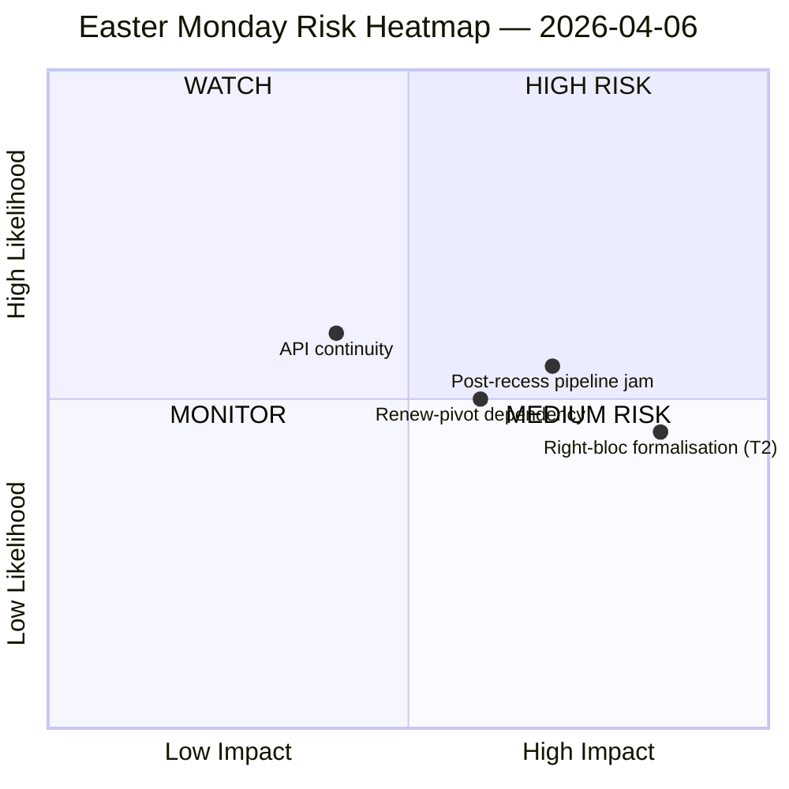

<!-- SPDX-FileCopyrightText: 2026 Hack23 AB -->
<!-- SPDX-License-Identifier: Apache-2.0 -->

# Underrättelsesammanfattning — Påskdagsuppehåll | 2026-04-06

**Klassificering:** OSINT — Offentligt parlamentariskt protokoll
**Tillförlitlighet:** 🟡 MEDEL (Påskuppehåll dag 11/18; 6 av 8 EP API-endpoints returnerar 404 under 11 dagar i rad)
**Körning:** `analysis/daily/2026-04-06/breaking/`
**Täckning:** 6 april 2026 (Påskdagen — EU-täckande allmän helgdag; T-8 till utskottsvecka, T-14 till plenum)
**Genererad:** 2026-05-16 (retrospektivt underlag, inga nya MCP-anrop)
**Primära källor:** EP MCP förberäknade statistik 2004–2026; Antagna texter (en veckas reserv — 85 poster); MEP-flöde (737 poster).

---

## 🎯 Kärnbedömning

**Påskdagen producerade noll parlamentarisk aktivitet avsiktligt — men körningen registrerar den enskilt mest avgörande strukturella iakttagelsen under uppehållsforttnighten: 6 av 8 EP API-endpoints har returnerat 404-fel kontinuerligt sedan 28 mars, ett 11-dagars ihållande degraderingsmönster utan återhämtningssignaler.** Denna kollaps i datatillgänglighet är inte en tillfällig incident utan ett strukturellt skifte som begränsar all efterföljande övervakning fram till återstarten av utskottsarbetet efter påsk. Körningen skiljer *strukturell inaktivitet* (en allmän helgdag i 27 medlemsstater producerar noll händelser per definition) från *dataluckor* (rådgivande flöden — utskottsdokument, parlamentariska frågor, förfaranden, plenumsdokument — är tysta eftersom endpoints är trasiga, inte för att inga dokument finns). Den politiska SWOT-analysen extraherar ett kontraintuitivt men välbevisat fynd: med **EP10 på kurs mot 114 lagstiftningsakter 2026 (+46 % jämfört med 2025)** och en **eftersläpning på 85 antagna texter ackumulerade under uppehållet**, kommer återstarten den 13 april att belasta en fyradagars utskottsvecka med ett kvartals värt uppdämt arbete. Den mest avgörande *risken* är **T2 högerblockformalisering (EPP+ECR+PfE = 57 % potentiell supermajoritet)** bedömd HÖG — frågan som körningen lämnar öppen och som efterföljande körningar kommer att besvara är om den tullrelaterade storgkoalitionen (EPP+S&D+Renew = 55 % med −5,5 % överskottsunderskott) håller disciplin när tull- och bankärenden tvingar varje flaggskeppsomröstning till ad hoc-koalitionsbyggande. Veckans tystnad är därför *laddad*, inte *tom*.

---

## 🧭 3 Beslut detta underlag stöder

| # | Beslut | Vem beslutar | Deadline | Bevis |
|:-:|----------|-------------|:--------:|----------|
| 1 | **API-återhämtningseskalering** — 11-dagars ihållande 404-mönster behöver en ansvarig innan utskottsomstarten; annars öppnar veckan efter uppehållet utan live-övervakning av utskottsberedningar | EP IT-sekretariat; data-pipeline-specialist | **före 14 april utskottsomstart** | §Datainsamlingsresultat; 6/8 endpoints 404 sedan 28 mars |
| 2 | **Pre-brief Konferens för utskottsordföranden om 85-postars eftersläpning** — prioritering av pipeline behöver avgöras i förväg inför utskottsfönstret 14–17 april, inte improviseras dag 1 | Konferens för utskottsordföranden | 14 april (T-8 vid körningstillfälle) | §Möjligheter O1; 85 poster i antagna texter |
| 3 | **Högerblock-supermajoritets falsifieringstest** — T2 (EPP+ECR+PfE = 57 %) är det allvarligaste hotet; den första post-påsk-handelsomröstningen är det naturliga falsifieringstestet | EPP/ECR/PfE-gruppledningar; observatörer | första handelsomröstningen efter uppehåll | §Hot T2 (HÖG allvarlighetsgrad) |

---

## 📰 60-sekundersläsning

- 🔴 **0 parlamentariska händelser måndag** — allmän helgdag i 27 MS; noll är det *förväntade* värdet, inte en datalucka.
- 🟠 **6/8 API-endpoints 404 under 11 dagar i rad** — strukturellt, inte tillfälligt; HÖG tillförlitlighet (15+ körningar).
- 🟢 **EP10 på kurs mot 114 akter (+46 % YoY)** jämfört med 78 under 2025 — rekordtakt projiceras.
- 🟡 **85-postars eftersläpning i antagna texter** under uppehållet — Q2 börjar med ett laddat pipeline.
- 🔵 **Stabilitetspoäng 84/100; 0 röstningsanomalier** — institutionell integritet intakt under tystnaden.
- 🟣 **Storkoalitionsaritmetik: EPP+S&D = 60 % av säten** — majoritetsskicklig på papper men med −5,5 % överskottsunderskott som tidigare körningar flaggat.
- 🩷 **T2 — högerblock supermajoritetspotential (EPP+ECR+PfE = 57 %)** — allvarligaste hotet i SWOT.
- ⚪ **737 MEP-poster** — MEP-flödet och flödet för antagna texter är de enda två operativa signalkällorna.

---

## ⚠️ Riskögonblicksbild (från `risk-matrix.md`)

Den enda risk som plottas av körningen är API-kontinuitet i WATCH-kvadranten; detta underlag utvidgar ögonblicksbilden med tre namngivna risker synliga i körningens SWOT men inte i quadrantChart-diagrammet. Netto **risknivå MEDEL, stabilitetspoäng 84/100, delta jämfört med 5 april stabilt** — körningens rubrikbedömning kvarstår.

---

## 🧭 ACH — Tolkningen "Tyst men Laddad"

- **H1 — Rutinmässigt uppehåll.** API-avbrott är tillfälligt (påskunderhåll, återgår efter 13 april); 85-postars eftersläpning är normalt Q1-genomflöde. *Stöds av* stabilitetspoäng 84/100, noll anomalier.
- **H2 — Strukturellt API-förfall + koalitionsstress.** 11-dagars ihållande mönster är *inte* tillfälligt; 85-postars eftersläpning kommer att kollidera med den 4-dagars utskottsomstartveckan och tvinga högerblockformalisering på minst en handels-försvarsakt. *Stöds av* 11-dagars persistens (15+ övervakningskörningar), T2 HÖG allvarlighetsgrad, tidigare körningsbana.

Båda hypoteserna förblir aktiva vid körningstillfälle. Utskottsomstarten 14 april och den första handelsomröstningen efter uppehållet är de naturliga falsifieringstesterna; underlaget läser H1 som *planeringsbaslinjen* och H2 som *beredskapsalternativet*.

---

## 🔮 Topp Framtida Utlösare (nästa 14 dagar)

1. **13 april (T-7) — sista dagen av uppehållet.** API-återhämtningssignal (eller brist på) är den binära indikatorn.
2. **14–17 april — utskottsomstartvecka.** 85-postars eftersläpning möter 4-dagarsfönster; pipeline-triagebeslut avgör om rekord-Q1-takten bryts.
3. **15 april — US-tullfrist.** Tvingar varje grupps första post-uppehåll-handelssignal; falsifieringstest för T2 högerblockformalisering.
4. **17 april — ECB-räntebeslut** (körningsflaggad katalysator) — kan aktivera ECON-utskottet dag 4 av omstartveckan.
5. **27–30 april Strasbourgplenum** — första plenumsmöjligheten att konsolidera eller bryta rekordtaktsprojektionen.

---

## 🛡️ Källkvalitetsbedömning

- **Förberäknade statistik 2004–2026 (A1):** underlagets mest tillförlitliga signal; 114-aktsprognosen och 84/100 stabilitetspoängen härleds båda från detta.
- **Flöde för antagna texter (A2 — en veckas reserv):** 85 poster; "idag"-vyn gav ett JSON-parsningsfel och körningen föll tillbaka på veckofönstret.
- **MEP-flöde (A1):** 737 poster — andra av två operativa endpoints.
- **Sex 404-endpoints (dokumenterad lucka):** händelser, förfaranden, dokument, plenumsdokument, utskottsdokument, frågor — *existensen* av underliggande aktivitet kan inte bekräftas via API för uppehållsperioden.
- **Nettkonfidensgrad:** 🟡 MEDEL för syntes; 🟢 HÖG för API-avbrottsfyndet i sig (objektivt verifierat i 15+ övervakningskörningar); 🟡 MEDEL för högerblocks-T2-hotet (strukturell aritmetik är fast, beteendetest är post-uppehåll).

---

## 📎 Körningsartefakter (Läs-Innan-Besluta)

| Lager | Artefakt | Varför |
|-------|----------|-----|
| Artikel | `article.md` | Offentlig berättelse om påskdagen |
| Betydelse | `significance-classification.md` | Uppehållsdagsklassificering med 8-flödesrevision |
| Risk | `risk-matrix.md` | 5×5-matris; API-kontinuitet i WATCH-kvadranten |
| Hot | `political-threat-landscape.md` | 5-ramverks politiskt hot (STRIDE avvisat) |
| SWOT | `political-swot-analysis.md` | 4S/4W/4O/4T med TOWS-interferensmatris |
| Kompanjon | `2026-04-13/breaking-run168/`, `2026-04-11/week-in-review-run8/` | Uppehållsfortnights parentes |

---

**Dokumentkontroll**
- **Mallreferens:** `analysis/templates/executive-brief.md`
- **Artefaktsökväg:** `analysis/daily/2026-04-06/breaking/executive-brief.md`
- **Klassificering:** Offentlig
- **Retrospektivt:** Underlag skrivet 2026-05-16 från körningens committade artefakter; **inga nya MCP-anrop gjordes**. 🟡 MEDEL-konfidensen och API-avbrottsfyndet är bevarade exakt som körningen committade dem.
