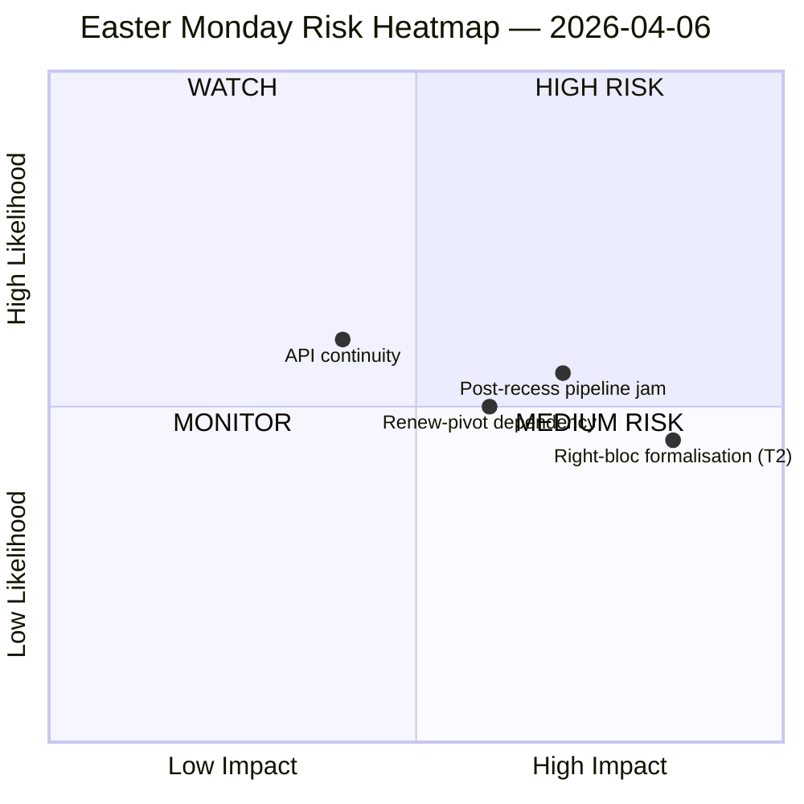

<!-- SPDX-FileCopyrightText: 2026 Hack23 AB -->
<!-- SPDX-License-Identifier: Apache-2.0 -->

# 行政简报 — 复活节假期期间 | 2026-04-06

**分类：** OSINT — 公开议会记录
**置信度：** 🟡 中等（复活节假期第11/18天；EP API端点8个中有6个连续11天返回404）
**运行目录：** `analysis/daily/2026-04-06/breaking/`
**覆盖期间：** 2026年4月6日（复活节星期一 — 欧盟全境公共假日；委员会周T-8，全体会议T-14）
**撰写日期：** 2026-05-16（追溯简报，无新MCP调用）
**主要来源：** EP MCP预计算统计2004–2026；采纳文本（一周回退 — 85项）；MEP数据馈送（737人）。

---

## 🎯 BLUF

**复活节星期一按设计仅产生零项议会活动，但此次运行却记录了两周假期中最重要的结构性发现：EP API端点8个中有6个自3月28日起持续返回404错误，这一持续了11天的劣化模式没有任何恢复迹象。** 这一数据可用性崩溃并非临时故障，而是制约复活节后委员会恢复监测的结构性变化。本次运行明确区分"结构性不活跃"（27个成员国的公共假日从定义上产生零项事件）与"数据缺口"（咨询性数据馈送 — 委员会文件、议会问题、程序、全体会议文件 — 因端点故障而沉默，而非因文件不存在）。政治SWOT提炼出反直觉但有充分依据的洞见：**EP10正在迈向2026年114项立法行为（较2025年+46%）**，而**假期期间积累了85项采纳文本**，4月13日的恢复将一个季度的积累工作压缩进4天的委员会周。最关键的"威胁"被高度评估为**T2右翼集团正式化（PPE+ECR+PfE = 57%的潜在超级多数）** — 本次运行留下、后续运行需要回答的问题是：当关税和银行文件迫使所有旗舰表决进行临时联合构建时，Renew支点大联合（PPE+S&D+Renew = 55%，盈余赤字-5.5%）能否保持纪律。本周的沉默因此不是"空洞的"，而是"充满张力的"。

---

## 🧭 3 Decisions This Brief Supports

| # | 决策 | 决策者 | 截止日期 | 依据 |
|:-:|------|--------|:--------:|------|
| 1 | **API恢复升级** — 持续11天的404模式在委员会恢复前需要问责负责人；否则假期后一周将在没有实时委员会分配监测的情况下开始 | EP IT秘书处；data-pipeline-specialist | **4月14日委员会恢复前** | §数据收集结果；3月28日起6/8端点404 |
| 2 | **就85项积压提前向主席会议简报** — 管道优先级应在4月14~17日委员会窗口前预先确定，不应在第一天临时应对 | 主席会议 | 4月14日（运行时T-8） | §机会O1；85项采纳文本积压 |
| 3 | **设计右翼集团超级多数的证伪测试** — T2（PPE+ECR+PfE = 57%）是最高严重度威胁；假期后首次贸易表决是集团正式化的自然证伪器 | EPP/ECR/PfE党团领导层；观察者 | 假期后首次贸易表决 | §威胁T2（严重度：高） |

---

## 📰 60-Second Read

- 🔴 **星期一议会事件0项** — 27个成员国公共假日；零是"预期值"，并非数据缺口。
- 🟠 **6/8 API端点连续11天404** — 非临时性，而是结构性；高置信度（15次以上运行）。
- 🟢 **EP10正在迈向114项（同比+46%）** 较2025年78项 — 预测创纪录步伐。
- 🟡 **85项采纳文本假期积压** — Q2以高负荷管道开始。
- 🔵 **稳定性评分84/100；投票异常0项** — 在沉默中维持制度完整性。
- 🟣 **大联合算术：PPE+S&D = 60%席位** — 书面上可以多数通过，但前次运行指出的-5.5%盈余赤字存在。
- 🩷 **T2 — 右翼集团超级多数潜力（PPE+ECR+PfE = 57%）** — SWOT中最高严重度威胁。
- ⚪ **737名MEP记录** — MEP数据馈送与采纳文本是仅有的两个运行中的信号来源。

---

## ⚠️ Risk Snapshot (from `risk-matrix.md`)

运行描绘的唯一风险是WATCH象限中的API连续性；本简报用运行SWOT中出现但未在quadrantChart图表本身中出现的三个命名风险扩展了快照。净"风险级别：中等，稳定性评分84/100，较4月5日的变化量：稳定"— 运行的头条判断得到支持。

---

## 🧭 ACH — The "Quiet but Loaded" Reading

- **H1 — 正常假期。** API中断是临时性的（复活节维护，4月13日后恢复）；85项积压是正常的Q1吞吐量。由"稳定性评分84/100，异常零项"支持。
- **H2 — 结构性API退化 + 联合压力。** 11天持续模式"非临时性"；85项积压与4天委员会恢复周碰撞，在至少一个贸易/防务文件上强制右翼集团正式化。由11天持续（15次以上监测运行）、T2高严重度、前次运行轨迹支持。

两个假设在运行时均开放。4月14日委员会恢复和假期后首次贸易表决是自然证伪器；本简报将H1视为"计划基线"，H2视为"应急情景"。

---

## 🔮 Top Forward Triggers (next 14 days)

1. **4月13日（T-7）— 假期最后一天。** API恢复信号（或其缺失）是二元指标。
2. **4月14~17日 — 委员会恢复周。** 85项积压与4天窗口相遇；管道分流决策决定Q1创纪录步伐能否维持。
3. **4月15日 — 美国关税截止日期。** 强制假期后各党团首次贸易表决信号；T2右翼集团正式化证伪器。
4. **4月17日 — 欧洲央行利率决定**（运行标记催化剂）— 可能在恢复周第4天激活ECON委员会。
5. **4月27~30日斯特拉斯堡全体会议** — 确认或打破创纪录步伐预测的首次全体会议机会。

---

## 🛡️ Source-Quality Assessment

- **预计算统计2004–2026（A1）：** 简报中最可靠的信号；114项预测和84/100稳定性评分均来源于此。
- **采纳文本数据馈送（A2 — 一周回退）：** 85项；"今日"视图抛出JSON解析错误，运行回退至一周窗口。
- **MEP数据馈送（A1）：** 737名 — 两个运行端点中的第二个。
- **6个404端点（记录的缺口）：** 事件、程序、文件、全体会议文件、委员会文件、问题 — 假期期间基础活动的"存在"无法通过API确认。
- **净置信度：** 🟡 综合为中等；🟢 API中断发现本身为高（15次以上监测运行客观确认）；🟡 右翼集团T2威胁为中等（结构性算术确固，行为测试在假期后）。

---

## 📎 Run Artifacts (Read-Before-Decide)

| 层级 | 文件 | 原因 |
|------|------|------|
| 文章 | `article.md` | 复活节星期一公开叙事 |
| 重要性 | `significance-classification.md` | 含8数据馈送审计的假日分类 |
| 风险 | `risk-matrix.md` | 5×5矩阵；WATCH象限含API连续性 |
| 威胁 | `political-threat-landscape.md` | 5框架政治威胁（STRIDE驳回） |
| SWOT | `political-swot-analysis.md` | 4S/4W/4O/4T与TOWS干扰矩阵 |
| 配套 | `2026-04-13/breaking-run168/`、`2026-04-11/week-in-review-run8/` | 两周假期括号文件 |

---

**文件管理**
- **模板参考：** `analysis/templates/executive-brief.md`
- **文件路径：** `analysis/daily/2026-04-06/breaking/executive-brief.md`
- **分类：** 公开
- **追溯：** 简报于2026-05-16根据运行保存的文件创建；**未进行新MCP调用**。🟡 中等置信度和API中断发现保留为运行所保存的状态。
