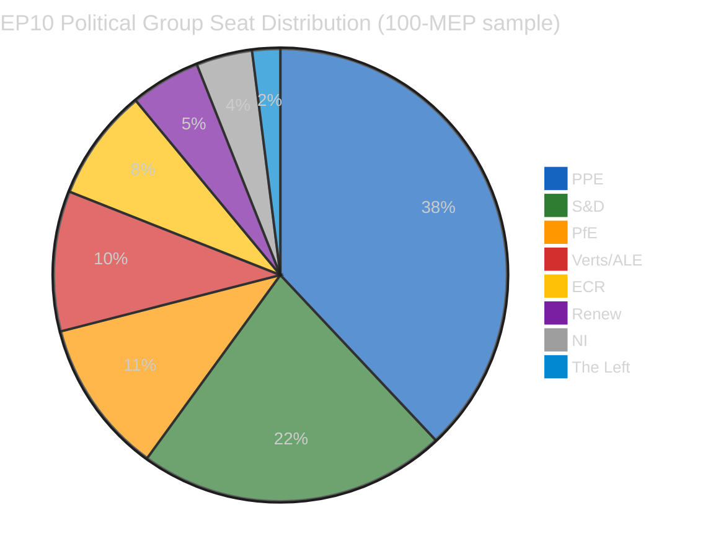

# Political Threat Landscape Assessment — Easter Monday (Day 11)

**Date:** 6 April 2026 | **Assessment Period:** Easter Recess Day 11/18 | **Confidence:** MEDIUM
**Previous Assessment:** 5 April 2026 (4 runs completed) | **Delta:** Zero substantive change

---

## Threat Landscape Dashboard

| Threat Dimension | Severity | Trend | Confidence |
|-----------------|----------|-------|------------|
| Coalition Shifts | LOW | Stable | MEDIUM |
| Transparency Deficit | ELEVATED | Stable | HIGH |
| Policy Reversal | NEGLIGIBLE | Stable | HIGH |
| Institutional Pressure | MEDIUM | Stable | MEDIUM |
| Legislative Obstruction | LOW | Stable | HIGH |
| Democratic Erosion | LOW | Stable | MEDIUM |

**Overall Threat Level:** LOW-MEDIUM (structural recess conditions)

---

## Dimension Analysis

### 1. Coalition Shifts — LOW Severity

**Assessment:** No evidence of group realignment during Easter recess. The formal coalition structure remains unchanged.

**Evidence:**
- PPE (38% in 100-MEP sample) maintains largest-group position with no defection signals
- S&D (22%) second-largest, grand coalition arithmetic (PPE + S&D = 60%) structurally sound
- Coalition dynamics tool reports LOW confidence (size-ratio proxy only; no voting data during recess)
- Renew-ECR pair shows 0.95 cohesion score, but this is a methodological artifact of similar group sizes, not evidence of policy alignment

**Key Indicator:** Zero MEP group-switching events detected in 737-MEP feed over past 48 hours. HIGH confidence.

**Cui Bono Analysis:** The recess period benefits incumbent coalition structures. Without active voting, no group can demonstrate alternative majority formations. PPE's dominant position is preserved by default during legislative silence.

### 2. Transparency Deficit — ELEVATED Severity

**Assessment:** Information asymmetry at peak during Easter recess. 6/8 EP API endpoints non-operational for 11 consecutive days. This creates conditions for behind-the-scenes positioning that will only become visible when parliament resumes.

**Evidence:**
- 6/8 feed endpoints returning HTTP 404 since 28 March (verified daily, 15+ monitoring runs)
- No committee meeting records available — zero visibility into pre-committee preparations
- No new parliamentary questions filed or answered — oversight function paused
- Adopted texts endpoint cycling between 404 and JSON parse errors — infrastructure instability signal

**Counter-Factual:** If the EP maintained full API availability during recess (as many national parliaments do), monitoring systems could detect early signals of post-recess positioning — committee document drafts, written question submissions, MEP travel schedules. The current blackout means these signals are invisible until committee week.

**Second-Order Effects:** The transparency deficit during recess creates an information asymmetry favouring well-connected political groups with informal intelligence networks. Smaller groups (Renew: 5 MEPs, NI: 4, The Left: 2 in sample) are disproportionately disadvantaged by the information vacuum.

### 3. Policy Reversal — NEGLIGIBLE Severity

**Assessment:** No evidence of policy reversal or legislative withdrawal. All 85 adopted texts from the pre-recess session remain in force. The formal legislative record is intact.

**Evidence:**
- 42 EP10-2026 adopted texts (TA-10-2026-0035 through TA-10-2026-0104) confirmed in one-week feed
- 36 EP10-2025 texts (TA-10-2025-0279 through TA-10-2025-0314) also stable
- 7 EP9-2024 legacy texts in feed — likely metadata updates, not policy changes
- Zero withdrawal notices or amendment proposals detected

### 4. Institutional Pressure — MEDIUM Severity

**Assessment:** PPE dominance risk flagged by early warning system at HIGH severity. The 38% seat share (in 100-MEP sample) gives PPE effective control over committee chairs, rapporteur allocation, and agenda-setting. This structural advantage consolidates during recess when counter-balancing mechanisms (floor votes, amendments) are suspended.

**Evidence:**
- Early warning: DOMINANT_GROUP_RISK severity HIGH — PPE 19x size ratio vs smallest group
- PPE holds 38/100 seats in sample — extrapolated to 185/720 (25.7%) in full parliament
- Grand coalition (PPE + S&D) = 60% — viable but PPE is the indispensable partner
- No alternative majority exists without PPE participation

**Historical Parallel:** In EP8 (2014-2019), EPP dominance led to informal power-sharing agreements with S&D on committee chairs. The current PPE advantage suggests similar dynamics will intensify in EP10, particularly in committee chair elections following recess.

**Tension Identification:** PPE's structural dominance creates a tension between majoritarian efficiency (PPE can drive legislative agenda) and pluralistic representation (smaller groups increasingly marginalised). This tension will manifest concretely during the April 14-17 committee week.

### 5. Legislative Obstruction — LOW Severity

**Assessment:** No active obstruction during recess (no legislative sessions to obstruct). Post-recess risk is moderate: 85 adopted texts in the pipeline plus accumulated committee work create processing pressure.

**Evidence:**
- 2026 projections: 114 acts, 567 votes, 498 adopted texts, 54 sessions
- Pre-recess batch: 42 EP10-2026 texts adopted — above-average legislative sprint
- Post-recess bottleneck risk: committee week must process accumulated backlog
- Likelihood 2, Impact 3 = Risk Score 6 (MEDIUM) for post-recess logjam

### 6. Democratic Erosion — LOW Severity

**Assessment:** Structural indicators stable. Fragmentation index at 4.4 effective parties (moderate). Small group quorum risk flagged for 3 groups below sustainable threshold.

**Evidence:**
- 23 countries represented in 100-MEP sample — healthy but incomplete representation
- 3 groups below 5-member threshold: Renew (5), NI (4), The Left (2) — quorum sustainability at risk
- Stability score: 84/100 — robust institutional health
- Parliamentary fragmentation: MEDIUM — 8 groups across ideological spectrum

---

## Longitudinal Tracking (24-hour Delta)

| Indicator | 5 April (Run 4) | 6 April | Delta |
|-----------|-----------------|---------|-------|
| API endpoints active | 2/8 | 2/8 | 0 |
| MEP feed count | 737 | 737 | 0 |
| Adopted texts (1-week) | 85 | 85 | 0 |
| Stability score | 84/100 | 84/100 | 0 |
| PPE dominance risk | HIGH | HIGH | 0 |
| Total warnings | 3 | 3 | 0 |

**Assessment:** Complete data stasis for 24+ hours. This is consistent with Easter Monday expectations and confirms the recess period produces zero parliamentary signal.

---

## Three Post-Easter Scenarios (updated)

### Scenario A — Smooth Resumption (55%)
Full API recovery by 8 April, committee prep visible by 10 April, normal committee week 14-17 April.
**Trigger:** All 8 API endpoints returning HTTP 200 with fresh data.
**Implication:** Legislative backlog cleared within 2 committee weeks.

### Scenario B — Staggered Recovery (35%)
Partial API recovery 8-10 April, some endpoints lag. Committee week proceeds with reduced digital transparency.
**Trigger:** 3-5 endpoints recover, 2-3 remain degraded.
**Implication:** Monitoring capacity reduced; reliance on plenary and MEP feeds only.

### Scenario C — Extended Disruption (10%)
API issues persist through committee week. Institutional transparency reduced. Alternative monitoring required.
**Trigger:** 404 errors on 4+ endpoints on 14 April.
**Implication:** Democratic monitoring gap; emergency data sourcing protocols activated.

---

*Source: European Parliament Open Data Portal via EP MCP Server. Threat landscape analysis follows the Political Threat Framework methodology (6-dimension model). Longitudinal tracking based on 15+ consecutive monitoring runs since 28 March 2026. All confidence levels stated per evidence quality hierarchy.*
