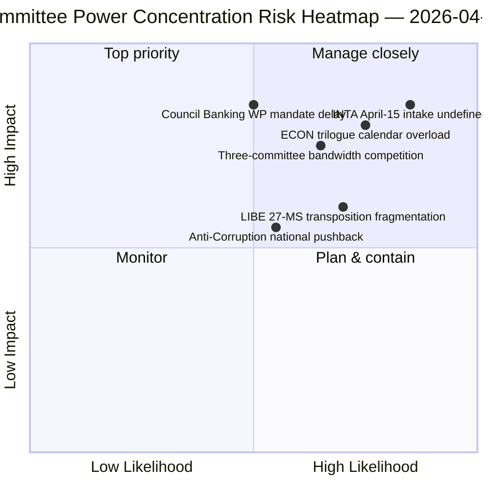
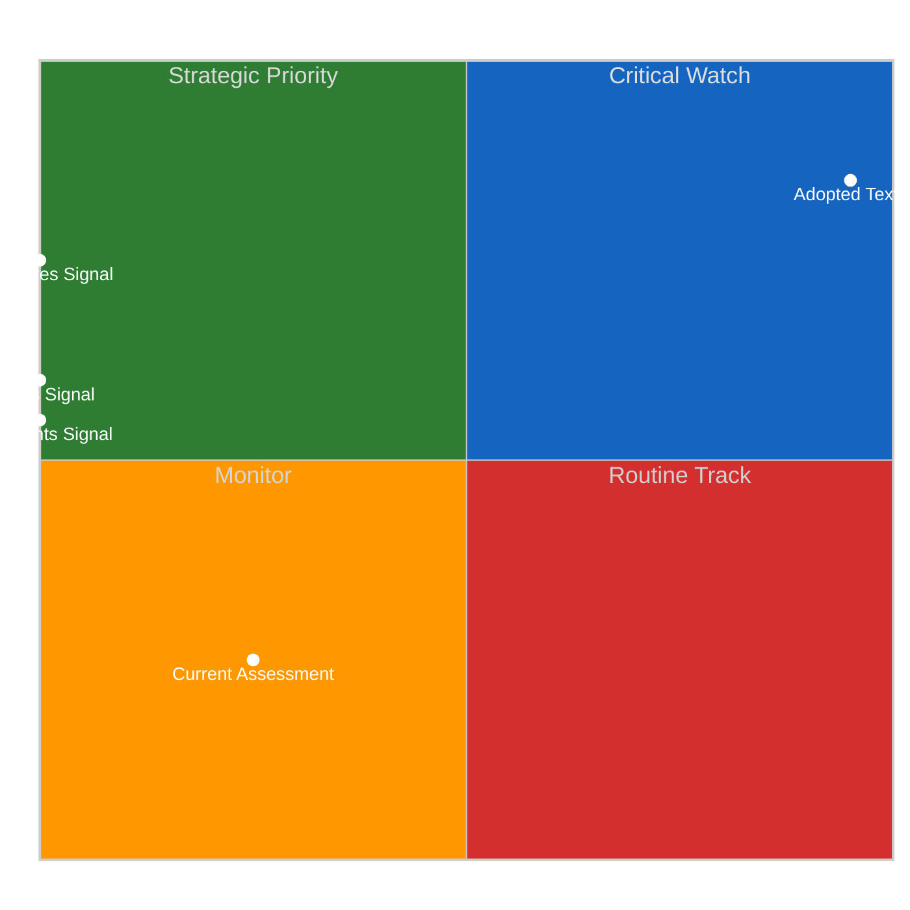
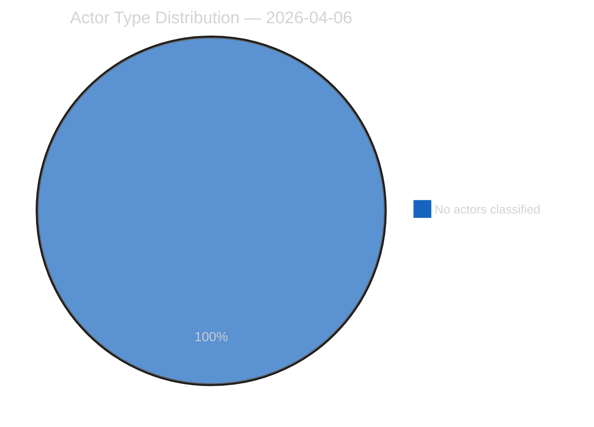
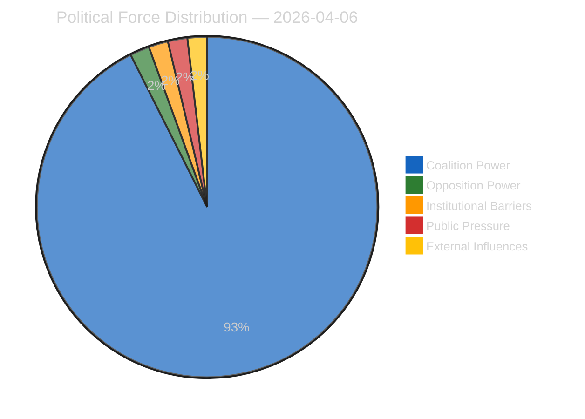
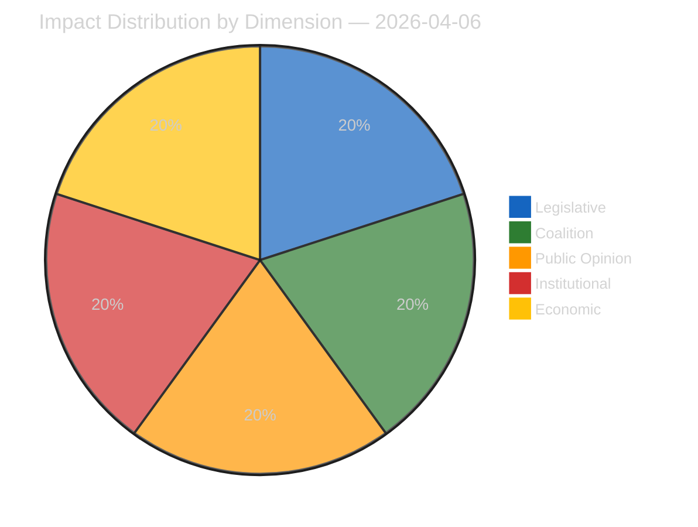
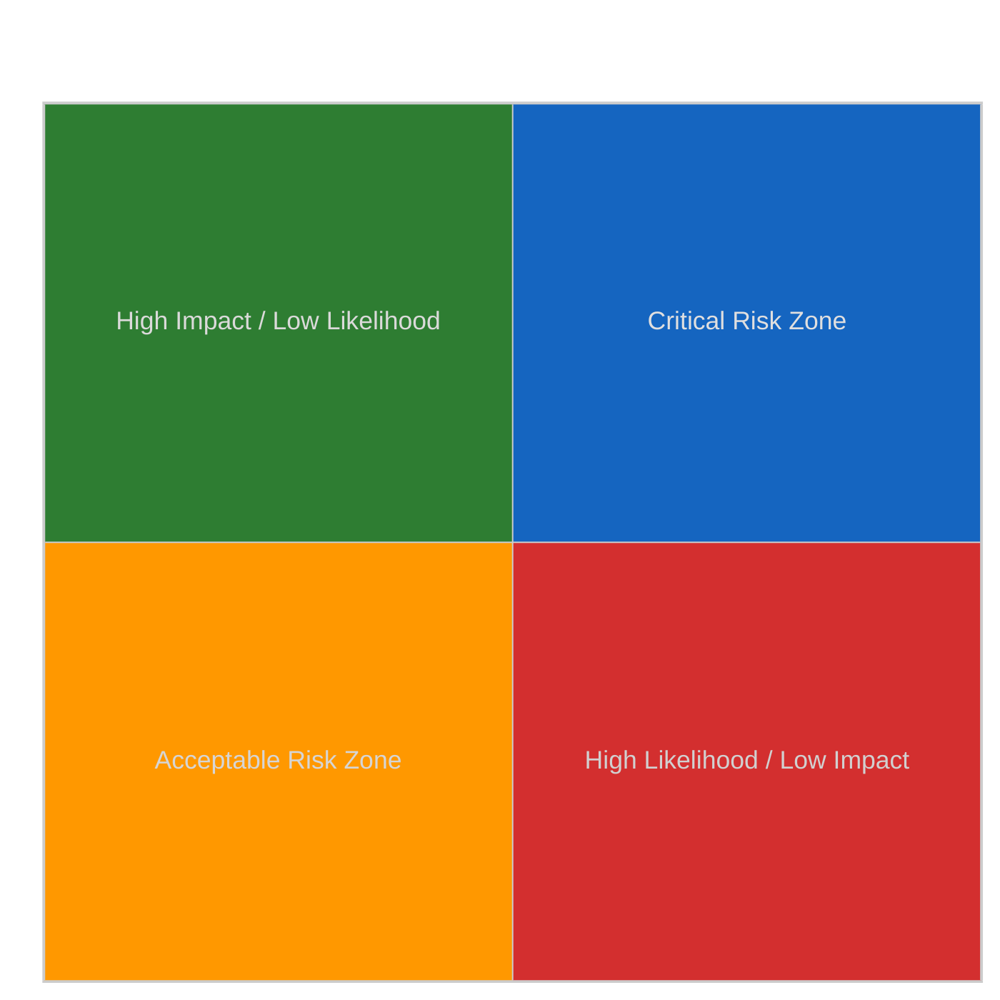
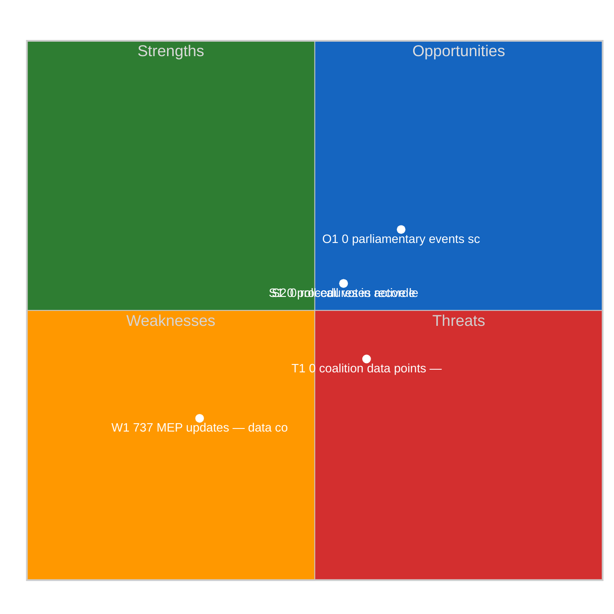
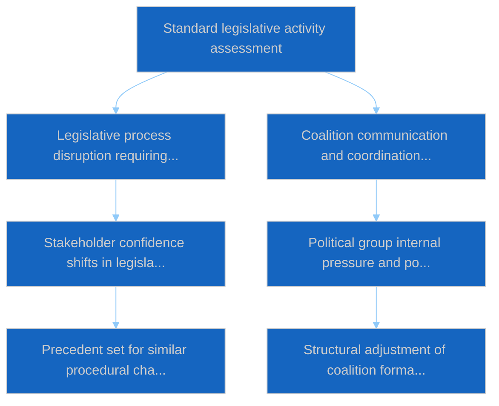

# Committee Reports — 2026-04-06

<h2 id="section-executive-brief">Executive Brief</h2>

### 🎯 BLUF

**This Easter Monday committee-reports run produces the **committee-power retrospective on the pre-recess corpus**, the analytical complement to the breaking-news cluster on the same date: where breaking-runs documented the dual-track coalition pattern, the committee-reports run documents the *committee-level concentration* that enabled it.** Three committees produced Q1 2026's most consequential output: **ECON** (Banking Union triple package: SRMR3 TA-10-2026-0092 + DGSD2 TA-10-2026-0090 + BRRD3 TA-10-2026-0091 — completion of multi-year Banking Union dossiers affecting the entire EU banking sector), **LIBE** (Anti-Corruption Directive TA-10-2026-0094 — first cross-EU criminal-law instrument since the European Public Prosecutor's Office), and **INTA** (US tariff response TA-10-2026-0096 — the file that activates April 15). The run's distinguishing contribution is the **committee-power-concentration finding**: three committees hold disproportionate Q2 institutional weight, with ECON dominating the Q2 trilogue calendar (Banking Union → Council mandates → Commission interpretation), LIBE owning the 27-MS transposition trajectory through Q2-Q4, and INTA absorbing the operational-implementation oversight role on April 15. The retrospective is published into a degraded API environment (4/8 feeds active) but rests on primary feed-confirmed records.

---

### 🧭 3 Decisions This Brief Supports

| # | Decision | Who decides | Deadline | Evidence |
|:-:|----------|-------------|:--------:|----------|
| 1 | **ECON Q2 trilogue scheduling reservation** — Banking Union triple package requires reserved Council bandwidth | ECON chair + Council Banking WP | by April 14 | §Finding 1 (ECON dominance) |
| 2 | **LIBE 27-MS transposition coordination** — first cross-EU criminal-law instrument needs national-parliament liaison | LIBE chair + national-parliament reps | rolling Q2-Q4 | §Finding 2 (LIBE first-mover) |
| 3 | **INTA scrutiny intake design** — implementation-stage role activates April 15; intake process undefined | INTA chair + coordinators | by April 14 | §Finding 3 (INTA operational role) |

---

### 📰 60-Second Read

- 🔴 **Three-committee Q1 dominance** — ECON · LIBE · INTA.
- 🟠 **ECON Banking Union triple** — SRMR3 + DGSD2 + BRRD3 (multi-year completion).
- 🟢 **LIBE Anti-Corruption** — first cross-EU criminal-law instrument since EPPO.
- 🟡 **INTA US tariff** — operational implementation activates April 15.
- 🔵 **236 adopted texts in cumulative corpus** — verifiable via one-week feed.
- 🟣 **20 analysis files** — committee-level methodology applied per file.
- 🩷 **API 4/8 feeds active** — degraded but committee data accessible.
- ⚪ **Confidence MEDIUM** — recess; pre-recess corpus high; forward forecast medium.

---

### 🏛️ Committee Power Concentration (run's distinguishing contribution)

| Committee | Flagship Q1 file(s) | Q2 institutional weight | Q2-Q4 trajectory |
|-----------|---------------------|-------------------------|------------------|
| **ECON** | TA-0090 / 0091 / 0092 (Banking Union triple) | Trilogue calendar dominance | Multi-year Banking Union completion → Council mandates Q2 |
| **LIBE** | TA-0094 (Anti-Corruption) | 27-MS transposition oversight | Q2-Q4 rolling transposition; national-parliament liaison |
| **INTA** | TA-0096 (US tariff) | Operational implementation oversight | T-0 April 15; scrutiny-window negotiation |

---

### ⚠️ Risk Snapshot

---

### 🔮 Top Forward Triggers (next 14 days)

1. **April 14 — Committee Week opens** — three-committee bandwidth competition begins.
2. **April 15 — TA-10-2026-0096 activates** — INTA operational role.
3. **April 17 — ECB rate decision** — ECON committee external trigger.
4. **Late April — Council Banking WP mandate** — ECON trilogue gate.
5. **Q2 — 27-MS transposition rolling kick-off** — LIBE oversight activation.

---

### 🛡️ Source-Quality Assessment

- **Pre-recess corpus (A1):** primary feed records; TA-IDs verifiable.
- **Three-committee concentration (A2):** committee-power methodology; medium confidence on relative weighting.
- **20 analysis files (A2):** systematic per-file methodology.
- **Net confidence:** 🟢 HIGH on Q1 records; 🟡 MEDIUM on Q2 weight forecast.

---

### 📎 Run Artifacts

| Layer | Artifact | Why |
|-------|----------|-----|
| Article | `article.md` (1,234 lines) | Public-facing committee-reports narrative |
| Synthesis | `existing/synthesis-summary.md` | Three-committee finding (authoritative) |
| Methods | classification · existing · risk-scoring · threat-assessment | Standard committee-reports methodology |
| Companion | breaking (00:33) · breaking-2 (06:45) · breaking-3 (12:15) · breaking-4 (18:18) · motions · propositions | Easter Monday cluster |

---

**Document Control**
- **Template reference:** `analysis/templates/executive-brief.md`
- **Artifact path:** `analysis/daily/2026-04-06/committee-reports/executive-brief.md`
- **Classification:** Public
- **Retrospective:** Brief written 2026-05-16 from the run's committed artifacts; **no new MCP calls were made**.

<h2 id="reader-intelligence-guide">Reader Intelligence Guide</h2>

Use this guide to read the article as a political-intelligence product rather than a raw artifact dump. High-value reader lenses appear first; technical provenance remains available in the audit appendices.

| Reader need | What you'll get | Source artifact |
|---|---|---|
| [BLUF and editorial decisions](#section-executive-brief) | fast answer to what happened, why it matters, who is accountable, and the next dated trigger | `executive-brief.md` |
| [Significance scoring](#section-significance) | why this story outranks or trails other same-day European Parliament signals | `classification/significance-classification.md` |
| [Actors and forces](#section-actors-forces) | who is driving the story, what political forces line up behind them, and which institutional levers they can pull | `classification/actor-mapping.md` |
| [Coalitions and voting](#section-coalitions-voting) | political group alignment, voting evidence, and coalition pressure points | `existing/voting-patterns.md` |
| [Stakeholder impact](#section-stakeholder-map) | who gains, who loses, and which institutions or citizens feel the policy effect | `existing/stakeholder-impact.md` |
| [Risk assessment](#section-risk) | policy, institutional, coalition, communications, and implementation risk register | `risk-scoring/risk-matrix.md` |
| [Threat landscape](#section-threat) | hostile actors, attack vectors, consequence trees, and legislative-disruption pathways | `threat-assessment/actor-threat-profiling.md` |
| [Cross-run continuity](#section-continuity) | what changed since prior sessions and how confidence shifted between runs | `existing/cross-session-intelligence.md` |
| [Deep analysis](#section-deep-analysis) | long-form Economist-style explanation for readers who want the full argument | `existing/deep-analysis.md` |
| [Supplementary intelligence](#section-supplementary-intelligence) | additional markdown discovered in the run that has not yet been assigned to a canonical section | `executive-brief_ar.md` |

<h2 id="section-significance">Significance</h2>

### Significance Classification

### Overall Significance: **ROUTINE**

### 5-Signal Model Scores

| Signal | Raw Data | Score |
|--------|----------|-------|
| Volume | 0 events, 0 documents | 0.0/5 |
| Pipeline | 0 procedures | 0.0/5 |
| Output | 236 adopted texts | 5.0/5 |
| Anomalies | Pattern deviation detection | — |
| Coalition | Group alignment analysis | — |

### Data Summary

| Metric | Value |
|--------|-------|
| Computed significance | ROUTINE |
| Total data points | 236 |
| Events | 0 |
| Documents | 0 |
| Procedures | 0 |
| Adopted texts | 236 |
| Date | 2026-04-06 |

### Date: 2026-04-06

<h2 id="section-actors-forces">Actors & Forces</h2>

### Actor Mapping

### Actors Identified: 0

### Actor Classification

| Actor | Type | Influence | Position | Role |
|-------|------|-----------|----------|------|
| — | — | — | — | — |

### Type Counts

| Type | Count |
|------|-------|
| — | 0 |

### Date: 2026-04-06

### Forces Analysis

### Forces Data

| Force | Trend | Strength | Key Actors | Confidence |
|-------|-------|----------|------------|------------|
| Coalition Power | stable | 50% | — | low |
| Opposition Power | stable | 0% | — | low |
| Institutional Barriers | stable | 0% | — | low |
| Public Pressure | stable | 0% | — | low |
| External Influences | stable | 0% | — | low |

### Balance

| Metric | Value |
|--------|-------|
| Coalition vs Opposition | 50% vs 1% |
| Dominant force | Coalition |
| Date | 2026-04-06 |

### Date: 2026-04-06

### Impact Matrix

### Overall Significance: **ROUTINE**

### Impact Dimensions

| Dimension | Level | Indicator | Numeric |
|-----------|-------|-----------|---------|
| Legislative | none | 🟢 | 5 |
| Coalition | none | 🟢 | 5 |
| Public Opinion | none | 🟢 | 5 |
| Institutional | none | 🟢 | 5 |
| Economic | none | 🟢 | 5 |

### Summary

| Metric | Value |
|--------|-------|
| Overall significance | ROUTINE |
| Highest impact | Legislative |
| Date | 2026-04-06 |

### Date: 2026-04-06

### Significance Scoring

### Summary

| Decision | Count |
|----------|:-----:|
| 📰 Publish | 0 |
| 📋 Hold | 236 |
| 🗄️ Skip | 0 |

### Batch Scoring

| Event | EP Reference | Parl. | Policy | Public | Urgency | Instit. | **Composite** | Decision |
|-------|-------------|:-----:|:------:|:------:|:-------:|:-------:|:-------------:|----------|
| T10-0054/2026 | eli/dl/doc/TA-10-2026-0054 | 7.0 | 6.0 | 5.0 | 4.0 | 6.0 | **5.75** | Hold |
| T10-0065/2026 | eli/dl/doc/TA-10-2026-0065 | 7.0 | 6.0 | 5.0 | 4.0 | 6.0 | **5.75** | Hold |
| T10-0044/2026 | eli/dl/doc/TA-10-2026-0044 | 7.0 | 6.0 | 5.0 | 4.0 | 6.0 | **5.75** | Hold |
| T10-0031/2026 | eli/dl/doc/TA-10-2026-0031 | 7.0 | 6.0 | 5.0 | 4.0 | 6.0 | **5.75** | Hold |
| T10-0287/2025 | eli/dl/doc/TA-10-2025-0287 | 7.0 | 6.0 | 5.0 | 4.0 | 6.0 | **5.75** | Hold |
| T10-0006/2026 | eli/dl/doc/TA-10-2026-0006 | 7.0 | 6.0 | 5.0 | 4.0 | 6.0 | **5.75** | Hold |
| T9-0252/2023 | eli/dl/doc/TA-9-2023-0252 | 7.0 | 6.0 | 5.0 | 4.0 | 6.0 | **5.75** | Hold |
| T9-0258/2023 | eli/dl/doc/TA-9-2023-0258 | 7.0 | 6.0 | 5.0 | 4.0 | 6.0 | **5.75** | Hold |
| T10-0335/2025 | eli/dl/doc/TA-10-2025-0335 | 7.0 | 6.0 | 5.0 | 4.0 | 6.0 | **5.75** | Hold |
| T10-0026/2026 | eli/dl/doc/TA-10-2026-0026 | 7.0 | 6.0 | 5.0 | 4.0 | 6.0 | **5.75** | Hold |
| T10-0277/2025 | eli/dl/doc/TA-10-2025-0277 | 7.0 | 6.0 | 5.0 | 4.0 | 6.0 | **5.75** | Hold |
| T9-0269/2023 | eli/dl/doc/TA-9-2023-0269 | 7.0 | 6.0 | 5.0 | 4.0 | 6.0 | **5.75** | Hold |
| T9-0263/2023 | eli/dl/doc/TA-9-2023-0263 | 7.0 | 6.0 | 5.0 | 4.0 | 6.0 | **5.75** | Hold |
| T10-0075/2026 | eli/dl/doc/TA-10-2026-0075 | 7.0 | 6.0 | 5.0 | 4.0 | 6.0 | **5.75** | Hold |
| T10-0030/2026 | eli/dl/doc/TA-10-2026-0030 | 7.0 | 6.0 | 5.0 | 4.0 | 6.0 | **5.75** | Hold |
| T10-0281/2025 | eli/dl/doc/TA-10-2025-0281 | 7.0 | 6.0 | 5.0 | 4.0 | 6.0 | **5.75** | Hold |
| T10-0017/2026 | eli/dl/doc/TA-10-2026-0017 | 7.0 | 6.0 | 5.0 | 4.0 | 6.0 | **5.75** | Hold |
| T10-0083/2026 | eli/dl/doc/TA-10-2026-0083 | 7.0 | 6.0 | 5.0 | 4.0 | 6.0 | **5.75** | Hold |
| T10-0325/2025 | eli/dl/doc/TA-10-2025-0325 | 7.0 | 6.0 | 5.0 | 4.0 | 6.0 | **5.75** | Hold |
| T10-0261/2025 | eli/dl/doc/TA-10-2025-0261 | 7.0 | 6.0 | 5.0 | 4.0 | 6.0 | **5.75** | Hold |
| T10-0010/2026 | eli/dl/doc/TA-10-2026-0010 | 7.0 | 6.0 | 5.0 | 4.0 | 6.0 | **5.75** | Hold |
| T10-0027/2026 | eli/dl/doc/TA-10-2026-0027 | 7.0 | 6.0 | 5.0 | 4.0 | 6.0 | **5.75** | Hold |
| T10-0311/2025 | eli/dl/doc/TA-10-2025-0311 | 7.0 | 6.0 | 5.0 | 4.0 | 6.0 | **5.75** | Hold |
| T9-0179/2024 | eli/dl/doc/TA-9-2024-0179 | 7.0 | 6.0 | 5.0 | 4.0 | 6.0 | **5.75** | Hold |
| T10-0294/2025 | eli/dl/doc/TA-10-2025-0294 | 7.0 | 6.0 | 5.0 | 4.0 | 6.0 | **5.75** | Hold |
| T10-0310/2025 | eli/dl/doc/TA-10-2025-0310 | 7.0 | 6.0 | 5.0 | 4.0 | 6.0 | **5.75** | Hold |
| T10-0066/2026 | eli/dl/doc/TA-10-2026-0066 | 7.0 | 6.0 | 5.0 | 4.0 | 6.0 | **5.75** | Hold |
| T10-0271/2025 | eli/dl/doc/TA-10-2025-0271 | 7.0 | 6.0 | 5.0 | 4.0 | 6.0 | **5.75** | Hold |
| T10-0092/2026 | eli/dl/doc/TA-10-2026-0092 | 7.0 | 6.0 | 5.0 | 4.0 | 6.0 | **5.75** | Hold |
| T10-0104/2026 | eli/dl/doc/TA-10-2026-0104 | 7.0 | 6.0 | 5.0 | 4.0 | 6.0 | **5.75** | Hold |
| T10-0020/2026 | eli/dl/doc/TA-10-2026-0020 | 7.0 | 6.0 | 5.0 | 4.0 | 6.0 | **5.75** | Hold |
| T10-0189/2025 | eli/dl/doc/TA-10-2025-0189 | 7.0 | 6.0 | 5.0 | 4.0 | 6.0 | **5.75** | Hold |
| T10-0301/2025 | eli/dl/doc/TA-10-2025-0301 | 7.0 | 6.0 | 5.0 | 4.0 | 6.0 | **5.75** | Hold |
| T10-0089/2026 | eli/dl/doc/TA-10-2026-0089 | 7.0 | 6.0 | 5.0 | 4.0 | 6.0 | **5.75** | Hold |
| T10-0242/2025 | eli/dl/doc/TA-10-2025-0242 | 7.0 | 6.0 | 5.0 | 4.0 | 6.0 | **5.75** | Hold |
| T10-0308/2025 | eli/dl/doc/TA-10-2025-0308 | 7.0 | 6.0 | 5.0 | 4.0 | 6.0 | **5.75** | Hold |
| T10-0312/2025 | eli/dl/doc/TA-10-2025-0312 | 7.0 | 6.0 | 5.0 | 4.0 | 6.0 | **5.75** | Hold |
| T10-0265/2025 | eli/dl/doc/TA-10-2025-0265 | 7.0 | 6.0 | 5.0 | 4.0 | 6.0 | **5.75** | Hold |
| T10-0064/2026 | eli/dl/doc/TA-10-2026-0064 | 7.0 | 6.0 | 5.0 | 4.0 | 6.0 | **5.75** | Hold |
| T10-0334/2025 | eli/dl/doc/TA-10-2025-0334 | 7.0 | 6.0 | 5.0 | 4.0 | 6.0 | **5.75** | Hold |
| T9-0257/2023 | eli/dl/doc/TA-9-2023-0257 | 7.0 | 6.0 | 5.0 | 4.0 | 6.0 | **5.75** | Hold |
| T10-0045/2026 | eli/dl/doc/TA-10-2026-0045 | 7.0 | 6.0 | 5.0 | 4.0 | 6.0 | **5.75** | Hold |
| T10-0270/2025 | eli/dl/doc/TA-10-2025-0270 | 7.0 | 6.0 | 5.0 | 4.0 | 6.0 | **5.75** | Hold |
| T10-0345/2025 | eli/dl/doc/TA-10-2025-0345 | 7.0 | 6.0 | 5.0 | 4.0 | 6.0 | **5.75** | Hold |
| T9-0268/2023 | eli/dl/doc/TA-9-2023-0268 | 7.0 | 6.0 | 5.0 | 4.0 | 6.0 | **5.75** | Hold |
| T10-0296/2025 | eli/dl/doc/TA-10-2025-0296 | 7.0 | 6.0 | 5.0 | 4.0 | 6.0 | **5.75** | Hold |
| T10-0295/2025 | eli/dl/doc/TA-10-2025-0295 | 7.0 | 6.0 | 5.0 | 4.0 | 6.0 | **5.75** | Hold |
| T10-0336/2025 | eli/dl/doc/TA-10-2025-0336 | 7.0 | 6.0 | 5.0 | 4.0 | 6.0 | **5.75** | Hold |
| T10-0021/2026 | eli/dl/doc/TA-10-2026-0021 | 7.0 | 6.0 | 5.0 | 4.0 | 6.0 | **5.75** | Hold |
| T10-0272/2025 | eli/dl/doc/TA-10-2025-0272 | 7.0 | 6.0 | 5.0 | 4.0 | 6.0 | **5.75** | Hold |
| T10-0035/2026 | eli/dl/doc/TA-10-2026-0035 | 7.0 | 6.0 | 5.0 | 4.0 | 6.0 | **5.75** | Hold |
| T10-0088/2026 | eli/dl/doc/TA-10-2026-0088 | 7.0 | 6.0 | 5.0 | 4.0 | 6.0 | **5.75** | Hold |
| T10-0159/2025 | eli/dl/doc/TA-10-2025-0159 | 7.0 | 6.0 | 5.0 | 4.0 | 6.0 | **5.75** | Hold |
| T10-0286/2025 | eli/dl/doc/TA-10-2025-0286 | 7.0 | 6.0 | 5.0 | 4.0 | 6.0 | **5.75** | Hold |
| T9-0253/2023 | eli/dl/doc/TA-9-2023-0253 | 7.0 | 6.0 | 5.0 | 4.0 | 6.0 | **5.75** | Hold |
| T10-0007/2026 | eli/dl/doc/TA-10-2026-0007 | 7.0 | 6.0 | 5.0 | 4.0 | 6.0 | **5.75** | Hold |
| T8-0388/2019 | eli/dl/doc/TA-8-2019-0388 | 7.0 | 6.0 | 5.0 | 4.0 | 6.0 | **5.75** | Hold |
| T10-0269/2025 | eli/dl/doc/TA-10-2025-0269 | 7.0 | 6.0 | 5.0 | 4.0 | 6.0 | **5.75** | Hold |
| T10-0015/2026 | eli/dl/doc/TA-10-2026-0015 | 7.0 | 6.0 | 5.0 | 4.0 | 6.0 | **5.75** | Hold |
| T9-0271/2023 | eli/dl/doc/TA-9-2023-0271 | 7.0 | 6.0 | 5.0 | 4.0 | 6.0 | **5.75** | Hold |
| T10-0073/2026 | eli/dl/doc/TA-10-2026-0073 | 7.0 | 6.0 | 5.0 | 4.0 | 6.0 | **5.75** | Hold |
| T9-0261/2023 | eli/dl/doc/TA-9-2023-0261 | 7.0 | 6.0 | 5.0 | 4.0 | 6.0 | **5.75** | Hold |
| T10-0019/2026 | eli/dl/doc/TA-10-2026-0019 | 7.0 | 6.0 | 5.0 | 4.0 | 6.0 | **5.75** | Hold |
| T10-0053/2026 | eli/dl/doc/TA-10-2026-0053 | 7.0 | 6.0 | 5.0 | 4.0 | 6.0 | **5.75** | Hold |
| T10-0262/2025 | eli/dl/doc/TA-10-2025-0262 | 7.0 | 6.0 | 5.0 | 4.0 | 6.0 | **5.75** | Hold |
| T10-0061/2026 | eli/dl/doc/TA-10-2026-0061 | 7.0 | 6.0 | 5.0 | 4.0 | 6.0 | **5.75** | Hold |
| T9-0177/2024 | eli/dl/doc/TA-9-2024-0177 | 7.0 | 6.0 | 5.0 | 4.0 | 6.0 | **5.75** | Hold |
| T10-0273/2025 | eli/dl/doc/TA-10-2025-0273 | 7.0 | 6.0 | 5.0 | 4.0 | 6.0 | **5.75** | Hold |
| T10-0079/2026 | eli/dl/doc/TA-10-2026-0079 | 7.0 | 6.0 | 5.0 | 4.0 | 6.0 | **5.75** | Hold |
| T10-0323/2025 | eli/dl/doc/TA-10-2025-0323 | 7.0 | 6.0 | 5.0 | 4.0 | 6.0 | **5.75** | Hold |
| T10-0340/2025 | eli/dl/doc/TA-10-2025-0340 | 7.0 | 6.0 | 5.0 | 4.0 | 6.0 | **5.75** | Hold |
| T10-0025/2026 | eli/dl/doc/TA-10-2026-0025 | 7.0 | 6.0 | 5.0 | 4.0 | 6.0 | **5.75** | Hold |
| T10-0316/2025 | eli/dl/doc/TA-10-2025-0316 | 7.0 | 6.0 | 5.0 | 4.0 | 6.0 | **5.75** | Hold |
| T10-0071/2026 | eli/dl/doc/TA-10-2026-0071 | 7.0 | 6.0 | 5.0 | 4.0 | 6.0 | **5.75** | Hold |
| T10-0329/2025 | eli/dl/doc/TA-10-2025-0329 | 7.0 | 6.0 | 5.0 | 4.0 | 6.0 | **5.75** | Hold |
| T10-0001/2026 | eli/dl/doc/TA-10-2026-0001 | 7.0 | 6.0 | 5.0 | 4.0 | 6.0 | **5.75** | Hold |
| T10-0046/2026 | eli/dl/doc/TA-10-2026-0046 | 7.0 | 6.0 | 5.0 | 4.0 | 6.0 | **5.75** | Hold |
| T9-0265/2023 | eli/dl/doc/TA-9-2023-0265 | 7.0 | 6.0 | 5.0 | 4.0 | 6.0 | **5.75** | Hold |
| T10-0032/2026 | eli/dl/doc/TA-10-2026-0032 | 7.0 | 6.0 | 5.0 | 4.0 | 6.0 | **5.75** | Hold |
| T10-0077/2026 | eli/dl/doc/TA-10-2026-0077 | 7.0 | 6.0 | 5.0 | 4.0 | 6.0 | **5.75** | Hold |
| T10-0330/2025 | eli/dl/doc/TA-10-2025-0330 | 7.0 | 6.0 | 5.0 | 4.0 | 6.0 | **5.75** | Hold |
| T10-0096/2026 | eli/dl/doc/TA-10-2026-0096 | 7.0 | 6.0 | 5.0 | 4.0 | 6.0 | **5.75** | Hold |
| T10-0260/2025 | eli/dl/doc/TA-10-2025-0260 | 7.0 | 6.0 | 5.0 | 4.0 | 6.0 | **5.75** | Hold |
| T10-0038/2026 | eli/dl/doc/TA-10-2026-0038 | 7.0 | 6.0 | 5.0 | 4.0 | 6.0 | **5.75** | Hold |
| T9-0341/2024 | eli/dl/doc/TA-9-2024-0341 | 7.0 | 6.0 | 5.0 | 4.0 | 6.0 | **5.75** | Hold |
| T10-0302/2025 | eli/dl/doc/TA-10-2025-0302 | 7.0 | 6.0 | 5.0 | 4.0 | 6.0 | **5.75** | Hold |
| T10-0055/2026 | eli/dl/doc/TA-10-2026-0055 | 7.0 | 6.0 | 5.0 | 4.0 | 6.0 | **5.75** | Hold |
| T10-0337/2025 | eli/dl/doc/TA-10-2025-0337 | 7.0 | 6.0 | 5.0 | 4.0 | 6.0 | **5.75** | Hold |
| T10-0084/2026 | eli/dl/doc/TA-10-2026-0084 | 7.0 | 6.0 | 5.0 | 4.0 | 6.0 | **5.75** | Hold |
| T10-0306/2025 | eli/dl/doc/TA-10-2025-0306 | 7.0 | 6.0 | 5.0 | 4.0 | 6.0 | **5.75** | Hold |
| T10-0257/2025 | eli/dl/doc/TA-10-2025-0257 | 7.0 | 6.0 | 5.0 | 4.0 | 6.0 | **5.75** | Hold |
| T10-0282/2025 | eli/dl/doc/TA-10-2025-0282 | 7.0 | 6.0 | 5.0 | 4.0 | 6.0 | **5.75** | Hold |
| T10-0098/2026 | eli/dl/doc/TA-10-2026-0098 | 7.0 | 6.0 | 5.0 | 4.0 | 6.0 | **5.75** | Hold |
| T10-0029/2026 | eli/dl/doc/TA-10-2026-0029 | 7.0 | 6.0 | 5.0 | 4.0 | 6.0 | **5.75** | Hold |
| T9-0251/2023 | eli/dl/doc/TA-9-2023-0251 | 7.0 | 6.0 | 5.0 | 4.0 | 6.0 | **5.75** | Hold |
| T10-0036/2026 | eli/dl/doc/TA-10-2026-0036 | 7.0 | 6.0 | 5.0 | 4.0 | 6.0 | **5.75** | Hold |
| T10-0339/2025 | eli/dl/doc/TA-10-2025-0339 | 7.0 | 6.0 | 5.0 | 4.0 | 6.0 | **5.75** | Hold |
| T10-0100/2026 | eli/dl/doc/TA-10-2026-0100 | 7.0 | 6.0 | 5.0 | 4.0 | 6.0 | **5.75** | Hold |
| T10-0094/2026 | eli/dl/doc/TA-10-2026-0094 | 7.0 | 6.0 | 5.0 | 4.0 | 6.0 | **5.75** | Hold |
| T10-0082/2026 | eli/dl/doc/TA-10-2026-0082 | 7.0 | 6.0 | 5.0 | 4.0 | 6.0 | **5.75** | Hold |
| T10-0279/2025 | eli/dl/doc/TA-10-2025-0279 | 7.0 | 6.0 | 5.0 | 4.0 | 6.0 | **5.75** | Hold |
| T10-0267/2025 | eli/dl/doc/TA-10-2025-0267 | 7.0 | 6.0 | 5.0 | 4.0 | 6.0 | **5.75** | Hold |
| T10-0318/2025 | eli/dl/doc/TA-10-2025-0318 | 7.0 | 6.0 | 5.0 | 4.0 | 6.0 | **5.75** | Hold |
| T10-0327/2025 | eli/dl/doc/TA-10-2025-0327 | 7.0 | 6.0 | 5.0 | 4.0 | 6.0 | **5.75** | Hold |
| T10-0280/2025 | eli/dl/doc/TA-10-2025-0280 | 7.0 | 6.0 | 5.0 | 4.0 | 6.0 | **5.75** | Hold |
| T10-0005/2026 | eli/dl/doc/TA-10-2026-0005 | 7.0 | 6.0 | 5.0 | 4.0 | 6.0 | **5.75** | Hold |
| T10-0080/2026 | eli/dl/doc/TA-10-2026-0080 | 7.0 | 6.0 | 5.0 | 4.0 | 6.0 | **5.75** | Hold |
| T10-0304/2025 | eli/dl/doc/TA-10-2025-0304 | 7.0 | 6.0 | 5.0 | 4.0 | 6.0 | **5.75** | Hold |
| T10-0259/2025 | eli/dl/doc/TA-10-2025-0259 | 7.0 | 6.0 | 5.0 | 4.0 | 6.0 | **5.75** | Hold |
| T9-0186/2024 | eli/dl/doc/TA-9-2024-0186 | 7.0 | 6.0 | 5.0 | 4.0 | 6.0 | **5.75** | Hold |
| T10-0024/2026 | eli/dl/doc/TA-10-2026-0024 | 7.0 | 6.0 | 5.0 | 4.0 | 6.0 | **5.75** | Hold |
| T10-0230/2025 | eli/dl/doc/TA-10-2025-0230 | 7.0 | 6.0 | 5.0 | 4.0 | 6.0 | **5.75** | Hold |
| T10-0009/2026 | eli/dl/doc/TA-10-2026-0009 | 7.0 | 6.0 | 5.0 | 4.0 | 6.0 | **5.75** | Hold |
| T10-0051/2026 | eli/dl/doc/TA-10-2026-0051 | 7.0 | 6.0 | 5.0 | 4.0 | 6.0 | **5.75** | Hold |
| T9-0033/2024 | eli/dl/doc/TA-9-2024-0033 | 7.0 | 6.0 | 5.0 | 4.0 | 6.0 | **5.75** | Hold |
| T10-0013/2026 | eli/dl/doc/TA-10-2026-0013 | 7.0 | 6.0 | 5.0 | 4.0 | 6.0 | **5.75** | Hold |
| T10-0298/2025 | eli/dl/doc/TA-10-2025-0298 | 7.0 | 6.0 | 5.0 | 4.0 | 6.0 | **5.75** | Hold |
| T10-0062/2026 | eli/dl/doc/TA-10-2026-0062 | 7.0 | 6.0 | 5.0 | 4.0 | 6.0 | **5.75** | Hold |
| T10-0003/2026 | eli/dl/doc/TA-10-2026-0003 | 7.0 | 6.0 | 5.0 | 4.0 | 6.0 | **5.75** | Hold |
| T9-0270/2023 | eli/dl/doc/TA-9-2023-0270 | 7.0 | 6.0 | 5.0 | 4.0 | 6.0 | **5.75** | Hold |
| T10-0033/2026 | eli/dl/doc/TA-10-2026-0033 | 7.0 | 6.0 | 5.0 | 4.0 | 6.0 | **5.75** | Hold |
| T10-0342/2025 | eli/dl/doc/TA-10-2025-0342 | 7.0 | 6.0 | 5.0 | 4.0 | 6.0 | **5.75** | Hold |
| T9-0255/2023 | eli/dl/doc/TA-9-2023-0255 | 7.0 | 6.0 | 5.0 | 4.0 | 6.0 | **5.75** | Hold |
| T10-0042/2026 | eli/dl/doc/TA-10-2026-0042 | 7.0 | 6.0 | 5.0 | 4.0 | 6.0 | **5.75** | Hold |
| T10-0288/2025 | eli/dl/doc/TA-10-2025-0288 | 7.0 | 6.0 | 5.0 | 4.0 | 6.0 | **5.75** | Hold |
| T10-0343/2025 | eli/dl/doc/TA-10-2025-0343 | 7.0 | 6.0 | 5.0 | 4.0 | 6.0 | **5.75** | Hold |
| T10-0332/2025 | eli/dl/doc/TA-10-2025-0332 | 7.0 | 6.0 | 5.0 | 4.0 | 6.0 | **5.75** | Hold |
| T10-0305/2025 | eli/dl/doc/TA-10-2025-0305 | 7.0 | 6.0 | 5.0 | 4.0 | 6.0 | **5.75** | Hold |
| T10-0034/2026 | eli/dl/doc/TA-10-2026-0034 | 7.0 | 6.0 | 5.0 | 4.0 | 6.0 | **5.75** | Hold |
| T10-0284/2025 | eli/dl/doc/TA-10-2025-0284 | 7.0 | 6.0 | 5.0 | 4.0 | 6.0 | **5.75** | Hold |
| T10-0023/2026 | eli/dl/doc/TA-10-2026-0023 | 7.0 | 6.0 | 5.0 | 4.0 | 6.0 | **5.75** | Hold |
| T10-0292/2025 | eli/dl/doc/TA-10-2025-0292 | 7.0 | 6.0 | 5.0 | 4.0 | 6.0 | **5.75** | Hold |
| T10-0338/2025 | eli/dl/doc/TA-10-2025-0338 | 7.0 | 6.0 | 5.0 | 4.0 | 6.0 | **5.75** | Hold |
| T10-0068/2026 | eli/dl/doc/TA-10-2026-0068 | 7.0 | 6.0 | 5.0 | 4.0 | 6.0 | **5.75** | Hold |
| T10-0263/2025 | eli/dl/doc/TA-10-2025-0263 | 7.0 | 6.0 | 5.0 | 4.0 | 6.0 | **5.75** | Hold |
| T9-0254/2023 | eli/dl/doc/TA-9-2023-0254 | 7.0 | 6.0 | 5.0 | 4.0 | 6.0 | **5.75** | Hold |
| T10-0297/2025 | eli/dl/doc/TA-10-2025-0297 | 7.0 | 6.0 | 5.0 | 4.0 | 6.0 | **5.75** | Hold |
| T9-0185/2024 | eli/dl/doc/TA-9-2024-0185 | 7.0 | 6.0 | 5.0 | 4.0 | 6.0 | **5.75** | Hold |
| T10-0063/2026 | eli/dl/doc/TA-10-2026-0063 | 7.0 | 6.0 | 5.0 | 4.0 | 6.0 | **5.75** | Hold |
| T10-0058/2026 | eli/dl/doc/TA-10-2026-0058 | 7.0 | 6.0 | 5.0 | 4.0 | 6.0 | **5.75** | Hold |
| T10-0047/2026 | eli/dl/doc/TA-10-2026-0047 | 7.0 | 6.0 | 5.0 | 4.0 | 6.0 | **5.75** | Hold |
| T10-0102/2026 | eli/dl/doc/TA-10-2026-0102 | 7.0 | 6.0 | 5.0 | 4.0 | 6.0 | **5.75** | Hold |
| T10-0313/2025 | eli/dl/doc/TA-10-2025-0313 | 7.0 | 6.0 | 5.0 | 4.0 | 6.0 | **5.75** | Hold |
| T10-0085/2026 | eli/dl/doc/TA-10-2026-0085 | 7.0 | 6.0 | 5.0 | 4.0 | 6.0 | **5.75** | Hold |
| T10-0275/2025 | eli/dl/doc/TA-10-2025-0275 | 7.0 | 6.0 | 5.0 | 4.0 | 6.0 | **5.75** | Hold |
| T9-0193/2024 | eli/dl/doc/TA-9-2024-0193 | 7.0 | 6.0 | 5.0 | 4.0 | 6.0 | **5.75** | Hold |
| T10-0291/2025 | eli/dl/doc/TA-10-2025-0291 | 7.0 | 6.0 | 5.0 | 4.0 | 6.0 | **5.75** | Hold |
| T10-0264/2025 | eli/dl/doc/TA-10-2025-0264 | 7.0 | 6.0 | 5.0 | 4.0 | 6.0 | **5.75** | Hold |
| T10-0048/2026 | eli/dl/doc/TA-10-2026-0048 | 7.0 | 6.0 | 5.0 | 4.0 | 6.0 | **5.75** | Hold |
| T10-0078/2026 | eli/dl/doc/TA-10-2026-0078 | 7.0 | 6.0 | 5.0 | 4.0 | 6.0 | **5.75** | Hold |
| T10-0087/2026 | eli/dl/doc/TA-10-2026-0087 | 7.0 | 6.0 | 5.0 | 4.0 | 6.0 | **5.75** | Hold |
| T10-0293/2025 | eli/dl/doc/TA-10-2025-0293 | 7.0 | 6.0 | 5.0 | 4.0 | 6.0 | **5.75** | Hold |
| T10-0331/2025 | eli/dl/doc/TA-10-2025-0331 | 7.0 | 6.0 | 5.0 | 4.0 | 6.0 | **5.75** | Hold |
| T10-0067/2026 | eli/dl/doc/TA-10-2026-0067 | 7.0 | 6.0 | 5.0 | 4.0 | 6.0 | **5.75** | Hold |
| T10-0300/2025 | eli/dl/doc/TA-10-2025-0300 | 7.0 | 6.0 | 5.0 | 4.0 | 6.0 | **5.75** | Hold |
| T9-0266/2023 | eli/dl/doc/TA-9-2023-0266 | 7.0 | 6.0 | 5.0 | 4.0 | 6.0 | **5.75** | Hold |
| T10-0041/2026 | eli/dl/doc/TA-10-2026-0041 | 7.0 | 6.0 | 5.0 | 4.0 | 6.0 | **5.75** | Hold |
| T10-0086/2026 | eli/dl/doc/TA-10-2026-0086 | 7.0 | 6.0 | 5.0 | 4.0 | 6.0 | **5.75** | Hold |
| T10-0274/2025 | eli/dl/doc/TA-10-2025-0274 | 7.0 | 6.0 | 5.0 | 4.0 | 6.0 | **5.75** | Hold |
| T10-0322/2025 | eli/dl/doc/TA-10-2025-0322 | 7.0 | 6.0 | 5.0 | 4.0 | 6.0 | **5.75** | Hold |
| T10-0012/2026 | eli/dl/doc/TA-10-2026-0012 | 7.0 | 6.0 | 5.0 | 4.0 | 6.0 | **5.75** | Hold |
| T10-0069/2026 | eli/dl/doc/TA-10-2026-0069 | 7.0 | 6.0 | 5.0 | 4.0 | 6.0 | **5.75** | Hold |
| T10-0057/2026 | eli/dl/doc/TA-10-2026-0057 | 7.0 | 6.0 | 5.0 | 4.0 | 6.0 | **5.75** | Hold |
| T10-0227/2025 | eli/dl/doc/TA-10-2025-0227 | 7.0 | 6.0 | 5.0 | 4.0 | 6.0 | **5.75** | Hold |
| T10-0314/2025 | eli/dl/doc/TA-10-2025-0314 | 7.0 | 6.0 | 5.0 | 4.0 | 6.0 | **5.75** | Hold |
| T10-0090/2026 | eli/dl/doc/TA-10-2026-0090 | 7.0 | 6.0 | 5.0 | 4.0 | 6.0 | **5.75** | Hold |
| T10-0249/2025 | eli/dl/doc/TA-10-2025-0249 | 7.0 | 6.0 | 5.0 | 4.0 | 6.0 | **5.75** | Hold |
| T10-0266/2025 | eli/dl/doc/TA-10-2025-0266 | 7.0 | 6.0 | 5.0 | 4.0 | 6.0 | **5.75** | Hold |
| T10-0321/2025 | eli/dl/doc/TA-10-2025-0321 | 7.0 | 6.0 | 5.0 | 4.0 | 6.0 | **5.75** | Hold |
| T10-0040/2026 | eli/dl/doc/TA-10-2026-0040 | 7.0 | 6.0 | 5.0 | 4.0 | 6.0 | **5.75** | Hold |
| T10-0043/2026 | eli/dl/doc/TA-10-2026-0043 | 7.0 | 6.0 | 5.0 | 4.0 | 6.0 | **5.75** | Hold |
| T10-0324/2025 | eli/dl/doc/TA-10-2025-0324 | 7.0 | 6.0 | 5.0 | 4.0 | 6.0 | **5.75** | Hold |
| T10-0018/2026 | eli/dl/doc/TA-10-2026-0018 | 7.0 | 6.0 | 5.0 | 4.0 | 6.0 | **5.75** | Hold |
| T10-0070/2026 | eli/dl/doc/TA-10-2026-0070 | 7.0 | 6.0 | 5.0 | 4.0 | 6.0 | **5.75** | Hold |
| T10-0289/2025 | eli/dl/doc/TA-10-2025-0289 | 7.0 | 6.0 | 5.0 | 4.0 | 6.0 | **5.75** | Hold |
| T10-0344/2025 | eli/dl/doc/TA-10-2025-0344 | 7.0 | 6.0 | 5.0 | 4.0 | 6.0 | **5.75** | Hold |
| T9-0264/2023 | eli/dl/doc/TA-9-2023-0264 | 7.0 | 6.0 | 5.0 | 4.0 | 6.0 | **5.75** | Hold |
| T10-0004/2026 | eli/dl/doc/TA-10-2026-0004 | 7.0 | 6.0 | 5.0 | 4.0 | 6.0 | **5.75** | Hold |
| T9-0309/2020 | eli/dl/doc/TA-9-2020-0309 | 7.0 | 6.0 | 5.0 | 4.0 | 6.0 | **5.75** | Hold |
| T10-0174/2025 | eli/dl/doc/TA-10-2025-0174 | 7.0 | 6.0 | 5.0 | 4.0 | 6.0 | **5.75** | Hold |
| T10-0299/2025 | eli/dl/doc/TA-10-2025-0299 | 7.0 | 6.0 | 5.0 | 4.0 | 6.0 | **5.75** | Hold |
| T10-0076/2026 | eli/dl/doc/TA-10-2026-0076 | 7.0 | 6.0 | 5.0 | 4.0 | 6.0 | **5.75** | Hold |
| T10-0008/2026 | eli/dl/doc/TA-10-2026-0008 | 7.0 | 6.0 | 5.0 | 4.0 | 6.0 | **5.75** | Hold |
| T9-0256/2023 | eli/dl/doc/TA-9-2023-0256 | 7.0 | 6.0 | 5.0 | 4.0 | 6.0 | **5.75** | Hold |
| T10-0050/2026 | eli/dl/doc/TA-10-2026-0050 | 7.0 | 6.0 | 5.0 | 4.0 | 6.0 | **5.75** | Hold |
| T10-0022/2026 | eli/dl/doc/TA-10-2026-0022 | 7.0 | 6.0 | 5.0 | 4.0 | 6.0 | **5.75** | Hold |
| T9-0267/2023 | eli/dl/doc/TA-9-2023-0267 | 7.0 | 6.0 | 5.0 | 4.0 | 6.0 | **5.75** | Hold |
| T10-0319/2025 | eli/dl/doc/TA-10-2025-0319 | 7.0 | 6.0 | 5.0 | 4.0 | 6.0 | **5.75** | Hold |
| T10-0011/2026 | eli/dl/doc/TA-10-2026-0011 | 7.0 | 6.0 | 5.0 | 4.0 | 6.0 | **5.75** | Hold |
| T10-0056/2026 | eli/dl/doc/TA-10-2026-0056 | 7.0 | 6.0 | 5.0 | 4.0 | 6.0 | **5.75** | Hold |
| T10-0309/2025 | eli/dl/doc/TA-10-2025-0309 | 7.0 | 6.0 | 5.0 | 4.0 | 6.0 | **5.75** | Hold |
| T10-0039/2026 | eli/dl/doc/TA-10-2026-0039 | 7.0 | 6.0 | 5.0 | 4.0 | 6.0 | **5.75** | Hold |
| T10-0268/2025 | eli/dl/doc/TA-10-2025-0268 | 7.0 | 6.0 | 5.0 | 4.0 | 6.0 | **5.75** | Hold |
| T10-0285/2025 | eli/dl/doc/TA-10-2025-0285 | 7.0 | 6.0 | 5.0 | 4.0 | 6.0 | **5.75** | Hold |
| T10-0052/2026 | eli/dl/doc/TA-10-2026-0052 | 7.0 | 6.0 | 5.0 | 4.0 | 6.0 | **5.75** | Hold |
| T10-0097/2026 | eli/dl/doc/TA-10-2026-0097 | 7.0 | 6.0 | 5.0 | 4.0 | 6.0 | **5.75** | Hold |
| T10-0099/2026 | eli/dl/doc/TA-10-2026-0099 | 7.0 | 6.0 | 5.0 | 4.0 | 6.0 | **5.75** | Hold |
| T10-0278/2025 | eli/dl/doc/TA-10-2025-0278 | 7.0 | 6.0 | 5.0 | 4.0 | 6.0 | **5.75** | Hold |
| T10-0333/2025 | eli/dl/doc/TA-10-2025-0333 | 7.0 | 6.0 | 5.0 | 4.0 | 6.0 | **5.75** | Hold |
| T10-0303/2025 | eli/dl/doc/TA-10-2025-0303 | 7.0 | 6.0 | 5.0 | 4.0 | 6.0 | **5.75** | Hold |
| T10-0091/2026 | eli/dl/doc/TA-10-2026-0091 | 7.0 | 6.0 | 5.0 | 4.0 | 6.0 | **5.75** | Hold |
| T10-0101/2026 | eli/dl/doc/TA-10-2026-0101 | 7.0 | 6.0 | 5.0 | 4.0 | 6.0 | **5.75** | Hold |
| T9-0342/2024 | eli/dl/doc/TA-9-2024-0342 | 7.0 | 6.0 | 5.0 | 4.0 | 6.0 | **5.75** | Hold |
| T10-0283/2025 | eli/dl/doc/TA-10-2025-0283 | 7.0 | 6.0 | 5.0 | 4.0 | 6.0 | **5.75** | Hold |
| T9-0178/2024 | eli/dl/doc/TA-9-2024-0178 | 7.0 | 6.0 | 5.0 | 4.0 | 6.0 | **5.75** | Hold |
| T10-0258/2025 | eli/dl/doc/TA-10-2025-0258 | 7.0 | 6.0 | 5.0 | 4.0 | 6.0 | **5.75** | Hold |
| T10-0290/2025 | eli/dl/doc/TA-10-2025-0290 | 7.0 | 6.0 | 5.0 | 4.0 | 6.0 | **5.75** | Hold |
| T10-0081/2026 | eli/dl/doc/TA-10-2026-0081 | 7.0 | 6.0 | 5.0 | 4.0 | 6.0 | **5.75** | Hold |
| T10-0326/2025 | eli/dl/doc/TA-10-2025-0326 | 7.0 | 6.0 | 5.0 | 4.0 | 6.0 | **5.75** | Hold |
| T10-0315/2025 | eli/dl/doc/TA-10-2025-0315 | 7.0 | 6.0 | 5.0 | 4.0 | 6.0 | **5.75** | Hold |
| T10-0049/2026 | eli/dl/doc/TA-10-2026-0049 | 7.0 | 6.0 | 5.0 | 4.0 | 6.0 | **5.75** | Hold |
| T10-0198/2025 | eli/dl/doc/TA-10-2025-0198 | 7.0 | 6.0 | 5.0 | 4.0 | 6.0 | **5.75** | Hold |
| T10-0307/2025 | eli/dl/doc/TA-10-2025-0307 | 7.0 | 6.0 | 5.0 | 4.0 | 6.0 | **5.75** | Hold |
| T10-0002/2026 | eli/dl/doc/TA-10-2026-0002 | 7.0 | 6.0 | 5.0 | 4.0 | 6.0 | **5.75** | Hold |
| T10-0093/2026 | eli/dl/doc/TA-10-2026-0093 | 7.0 | 6.0 | 5.0 | 4.0 | 6.0 | **5.75** | Hold |
| T10-0317/2025 | eli/dl/doc/TA-10-2025-0317 | 7.0 | 6.0 | 5.0 | 4.0 | 6.0 | **5.75** | Hold |
| T9-0181/2024 | eli/dl/doc/TA-9-2024-0181 | 7.0 | 6.0 | 5.0 | 4.0 | 6.0 | **5.75** | Hold |
| T10-0103/2026 | eli/dl/doc/TA-10-2026-0103 | 7.0 | 6.0 | 5.0 | 4.0 | 6.0 | **5.75** | Hold |
| T10-0095/2026 | eli/dl/doc/TA-10-2026-0095 | 7.0 | 6.0 | 5.0 | 4.0 | 6.0 | **5.75** | Hold |
| T10-0276/2025 | eli/dl/doc/TA-10-2025-0276 | 7.0 | 6.0 | 5.0 | 4.0 | 6.0 | **5.75** | Hold |
| T10-0037/2026 | eli/dl/doc/TA-10-2026-0037 | 7.0 | 6.0 | 5.0 | 4.0 | 6.0 | **5.75** | Hold |
| T9-0259/2023 | eli/dl/doc/TA-9-2023-0259 | 7.0 | 6.0 | 5.0 | 4.0 | 6.0 | **5.75** | Hold |
| T10-0320/2025 | eli/dl/doc/TA-10-2025-0320 | 7.0 | 6.0 | 5.0 | 4.0 | 6.0 | **5.75** | Hold |
| T10-0328/2025 | eli/dl/doc/TA-10-2025-0328 | 7.0 | 6.0 | 5.0 | 4.0 | 6.0 | **5.75** | Hold |
| T10-0072/2026 | eli/dl/doc/TA-10-2026-0072 | 7.0 | 6.0 | 5.0 | 4.0 | 6.0 | **5.75** | Hold |
| T10-0028/2026 | eli/dl/doc/TA-10-2026-0028 | 7.0 | 6.0 | 5.0 | 4.0 | 6.0 | **5.75** | Hold |
| T10-0060/2026 | eli/dl/doc/TA-10-2026-0060 | 7.0 | 6.0 | 5.0 | 4.0 | 6.0 | **5.75** | Hold |
| T10-0188/2025 | eli/dl/doc/TA-10-2025-0188 | 7.0 | 6.0 | 5.0 | 4.0 | 6.0 | **5.75** | Hold |
| T9-0183/2024 | eli/dl/doc/TA-9-2024-0183 | 7.0 | 6.0 | 5.0 | 4.0 | 6.0 | **5.75** | Hold |
| T10-0059/2026 | eli/dl/doc/TA-10-2026-0059 | 7.0 | 6.0 | 5.0 | 4.0 | 6.0 | **5.75** | Hold |
| T10-0014/2026 | eli/dl/doc/TA-10-2026-0014 | 7.0 | 6.0 | 5.0 | 4.0 | 6.0 | **5.75** | Hold |
| T9-0260/2023 | eli/dl/doc/TA-9-2023-0260 | 7.0 | 6.0 | 5.0 | 4.0 | 6.0 | **5.75** | Hold |
| T9-0262/2023 | eli/dl/doc/TA-9-2023-0262 | 7.0 | 6.0 | 5.0 | 4.0 | 6.0 | **5.75** | Hold |
| T10-0016/2026 | eli/dl/doc/TA-10-2026-0016 | 7.0 | 6.0 | 5.0 | 4.0 | 6.0 | **5.75** | Hold |
| T10-0074/2026 | eli/dl/doc/TA-10-2026-0074 | 7.0 | 6.0 | 5.0 | 4.0 | 6.0 | **5.75** | Hold |
| T10-0341/2025 | eli/dl/doc/TA-10-2025-0341 | 7.0 | 6.0 | 5.0 | 4.0 | 6.0 | **5.75** | Hold |

<h2 id="section-coalitions-voting">Coalitions & Voting</h2>

### Voting Patterns

### Detected Trends (Script-Generated Context)
| Trend ID | Direction | Confidence | Data Points |
|----------|-----------|------------|-------------|
| No trend data available from voting records | — | — | — |

### Computed Summary
- **Trends identified**: 0
- **Records analysed**: 0

### AI Analysis Prompt

> **Instructions for AI Agent (Opus 4.6):** Using the voting pattern data above and the adopted texts from EP MCP feeds, produce a voting pattern intelligence analysis. Your analysis MUST:
>
> 1. **Identify voting blocs**: Which groups consistently vote together on recent adopted texts?
> 2. **Detect anomalies**: Any unexpected votes, close margins (<50 vote difference), or high abstention rates?
> 3. **Analyse by policy domain**: Do voting patterns differ between economic, environmental, and social legislation?
> 4. **Group discipline assessment**: Rate each major group's internal cohesion (high/medium/low) with evidence
> 5. **Trend detection**: Compare recent voting patterns to historical trends — is the Parliament becoming more/less fragmented?
> 6. **Forward-looking**: Which upcoming votes are likely to be contested based on current alignment patterns?
>
> If voting records are limited, analyse the adopted texts' policy positions to infer likely voting alignments and coalition patterns.

### AI-Produced Voting Intelligence

[TO BE FILLED BY AI AGENT — Substantive voting pattern analysis with specific vote references, group cohesion ratings, and anomaly detection. Quality gate: minimum 300 words.]

### Date: 2026-04-06

<h2 id="section-stakeholder-map">Stakeholder Map</h2>

### Stakeholder Impact

### Data Available for Stakeholder Assessment (Script-Generated Context)
| Stakeholder Group | Primary Data Sources | Data Points |
|-------------------|---------------------|-------------|
| Political Groups | Procedures, Adopted Texts, Voting Records, Coalitions | 236 |
| Civil Society | Documents, Questions, Events | 0 |
| Industry | Procedures, Adopted Texts | 236 |
| National Governments | Adopted Texts, Procedures, Coalitions | 236 |
| Citizens | Questions, MEP Updates, Events | 737 |
| EU Institutions | Events, Procedures, Adopted Texts, Voting Records | 236 |

### Data Source Summary
| Source | Count |
|--------|-------|
| patterns | 0 |
| votingRecords | 0 |
| events | 0 |
| documents | 0 |
| adoptedTexts | 236 |
| procedures | 0 |
| mepUpdates | 737 |
| plenaryDocuments | 0 |
| committeeDocuments | 0 |
| plenarySessionDocuments | 0 |
| externalDocuments | 30 |
| questions | 0 |
| declarations | 498 |
| corporateBodies | 0 |

### AI Analysis Prompt

> **Instructions for AI Agent (Opus 4.6):** Using the stakeholder-impact.md template and the data inventory above, produce a stakeholder impact analysis for each of the 6 stakeholder groups. For each group:
>
> 1. **Impact direction**: positive / negative / neutral / mixed
> 2. **Impact severity**: high / medium / low
> 3. **Specific evidence**: Cite ≥2 specific EP documents, votes, or procedures that affect this stakeholder
> 4. **Reasoning**: 2-3 sentences explaining WHY this stakeholder is affected and HOW
> 5. **Action items**: What should this stakeholder watch or do in response?
> 6. **Confidence level**: 🟢 High / 🟡 Medium / 🔴 Low
>
> Focus on the MOST RECENT adopted texts and procedures. Do not produce generic stakeholder descriptions — every assessment must be grounded in specific EP data from this date period.

### AI-Produced Stakeholder Assessment

[TO BE FILLED BY AI AGENT — Each stakeholder group must have impact direction, severity, evidence citations, and reasoning. Quality gate: minimum 300 words of original analytical prose.]

### Date: 2026-04-06

<h2 id="section-risk">Risk Assessment</h2>

### Risk Matrix

### Overview

Quantitative risk scoring across 0 identified political dimensions.
This matrix uses a standardized likelihood × impact framework to quantify and
prioritize political risks affecting the European Parliament legislative process.

### Risk Heat Map

### Risk Matrix

| Risk ID | Description | Likelihood | Impact | Score | Level |
|---------|-------------|------------|--------|-------|-------|
| — | — | — | — | — | — |

> **Risk Score** = Likelihood × Impact. **Levels**: 🟢 LOW (≤1.0), 🟡 MEDIUM (≤2.0), 🟠 HIGH (≤3.5), 🔴 CRITICAL (>3.5)

### Risk Assessment Details

| — | — | — | — | — | — |

### Risk Mitigation Framework

| Risk Level | Count | Tolerance | Action Required |
|------------|-------|-----------|-----------------|
| 🔴 CRITICAL | 0 | Zero tolerance | Immediate escalation |
| 🟠 HIGH | 0 | Low tolerance | Active mitigation |
| 🟡 MEDIUM | 0 | Moderate | Enhanced monitoring |
| 🟢 LOW | 0 | Acceptable | Routine tracking |

### Date: 2026-04-06

### Quantitative Swot

### Executive Summary

**Strategic Position Score**: 3.4/10
**Overall Assessment**: Weak strategic position: weaknesses and threats dominate — urgent mitigation needed.
**Analysis Date**: 2026-04-06

> This SWOT analysis is derived from 0 procedures, 0 events, 236 adopted texts, 0 documents, 0 voting records, and 0 coalition data points fetched from the European Parliament.

### SWOT Quadrant Chart

### SWOT Overview

| Category | Items | Avg Score | Trend |
|----------|-------|-----------|-------|
| 🟢 Strengths | 2 | 0.0 | stable |
| 🔴 Weaknesses | 1 | 2.0 | stable |
| 🔵 Opportunities | 1 | 1.5 | stable |
| 🟠 Threats | 1 | 0.9 | stable |

### 🟢 Strengths

#### S1: 0 procedures in active legislative pipeline
- **Score**: 0.0/5
- **Confidence**: low
- **Trend**: stable
- **Evidence**:
  - 0 procedures tracked in current period
  - 236 texts adopted
  - 0 documents published

#### S2: 0 roll-call votes recorded with 0 questions
- **Score**: 0.0/5
- **Confidence**: low
- **Trend**: stable
- **Evidence**:
  - 0 voting records available
  - 0 parliamentary questions filed
  - 737 MEP activity updates

### 🔴 Weaknesses

#### W1: 737 MEP updates — data coverage gap assessment
- **Score**: 2.0/5
- **Confidence**: medium
- **Trend**: stable
- **Evidence**:
  - 737 MEP updates in current period
  - 0 documents vs 0 procedures ratio
  - Data freshness depends on EP feed update frequency

### 🔵 Opportunities

#### O1: 0 parliamentary events scheduled
- **Score**: 1.5/5
- **Confidence**: medium
- **Trend**: stable
- **Evidence**:
  - 0 events in analysis period
  - 236 texts adopted indicates legislative throughput
  - 0 procedures in various stages

### 🟠 Threats

#### T1: 0 coalition data points — cohesion monitoring
- **Score**: 0.9/5
- **Confidence**: low
- **Trend**: stable
- **Evidence**:
  - 0 coalition observations recorded
  - Cross-reference with 0 voting records
  - 0 procedures may be affected by coalition shifts

### Cross-Impact Matrix

| Interaction | Net Effect | Rationale |
|-------------|-----------|----------|
| strength #1 × threat #1 | 0.00 | Strength "0 procedures in active legislative pipeline" partially mitigates threat "0 coalition data points — cohesion monitoring" |
| strength #2 × threat #1 | 0.00 | Strength "0 roll-call votes recorded with 0 questions" partially mitigates threat "0 coalition data points — cohesion monitoring" |
| weakness #1 × threat #1 | 0.30 | Weakness "737 MEP updates — data coverage gap assessment" amplifies threat "0 coalition data points — cohesion monitoring" |

### Strategic Priorities Matrix

### Data Summary

| Data Source | Count |
|-------------|-------|
| Procedures | 0 |
| Events | 0 |
| Documents | 0 |
| Voting Records | 0 |
| Adopted Texts | 236 |
| Coalitions | 0 |
| Questions | 0 |
| MEP Updates | 737 |
| **Total Data Points** | **236** |

### Date: 2026-04-06

### Political Capital Risk

### Data Inventory for Capital Risk Assessment
| Data Source | Count | Relevance |
|-------------|-------|-----------|
| Coalition data points | 0 | Group cohesion indicators |
| Voting records | 0 | Voting alignment metrics |
| Voting patterns | 0 | Trend and anomaly data |
| Active procedures | 0 | Legislative engagement |

### Date: 2026-04-06

### Legislative Velocity Risk

### Overview
Risk assessment based on legislative processing speed for 0 procedures.

### Top Velocity Risks
| Procedure | Title | Stage | Days (actual/expected) | Risk Score | Level |
|-----------|-------|-------|----------------------|------------|-------|
| — | — | — | — | — | — |

### Summary
- **Procedures analysed**: 0
- **High/Critical risks**: 0
- **Date**: 2026-04-06

### Agent Risk Workflow

### Risk Heat Map

| Impact ↓ / Likelihood → | Rare | Unlikely | Possible | Likely | Almost Certain |
|--------------------------|------|----------|----------|--------|----------------|
| **Severe** | 🟢 | 🟡 | 🟠 | 🟠 | 🔴 |
| **Major** | 🟢 | 🟡 | 🟡 | 🟠 | 🔴 |
| **Moderate** | 🟢 | 🟢 | 🟡 | 🟠 | 🟠 |
| **Minor** | 🟢 | 🟢 | 🟢 | 🟡 | 🟡 |
| **Negligible** | 🟢 | 🟢 | 🟢 | 🟢 | 🟢 |

### Identified Risks

#### RISK-W00: Baseline political risk
- **Likelihood**: rare (0.1) | **Impact**: minor (2) | **Score**: 0.2 (LOW) | **Confidence**: low
- **Evidence**: Routine parliamentary activity
- **Mitigating Factors**: Stable institutional framework

### Risk Evaluation Matrix

| Rank | Risk ID | Description | Score | Level | Confidence |
|------|---------|-------------|-------|-------|------------|
| 1 | RISK-W00 | Baseline political risk | 0.2 | LOW | low |

### Risk Treatment Plan

- Monitor legislative velocity indicators
- Track coalition voting patterns

### Recommendations

- Monitor legislative velocity indicators
- Track coalition voting patterns

<h2 id="section-threat">Threat Landscape</h2>

### Actor Threat Profiling

### Overview
Individual threat profiles for 0 political actors.

### Actor Threat Matrix
| Actor | Type | Capability | Motivation | Opportunity | Threat Level |
|-------|------|------------|------------|-------------|--------------|
| — | — | — | — | — | — |

### Date: 2026-04-06

### Consequence Trees

### Overview
Structured analysis of action-consequence chains for 0 legislative procedures.

### No procedures available for consequence analysis

### Date: 2026-04-06

### Legislative Disruption

### Overview
Identification of factors disrupting the normal legislative process.

### Disruption Assessment
| Procedure ID | Title | Stage | Resilience | Disruption Points |
|-------------|-------|-------|-----------|-------------------|
| — | — | — | — | — |

### Date: 2026-04-06

### Political Threat Landscape

### Political Threat Landscape Analysis

#### Coalition Shifts
**Threat Level**: 🟢 Low

Coalition stability appears maintained. No significant realignment signals.

**Evidence:**
- No coalition shift signals detected in available data

#### Transparency Deficit
**Threat Level**: ⚠️ Moderate

Transparency concerns at moderate level. Review committee meeting records and public documentation.

**Evidence:**
- No committee activity data available — potential information gap

#### Policy Reversal
**Threat Level**: 🟢 Low

Legislative trajectory appears stable. No major reversal signals.

**Evidence:**
- No significant policy reversal signals detected

#### Institutional Pressure
**Threat Level**: 🟢 Low

Institutional balance appears maintained. Power distribution within normal parameters.

**Evidence:**
- No institutional threat signals detected

#### Legislative Obstruction
**Threat Level**: 🟢 Low

Legislative pace within normal parameters. No obstruction signals.

**Evidence:**
- No significant legislative delay signals detected

#### Democratic Erosion
**Threat Level**: 🟢 Low

Democratic norms appear stable. Institutional processes functioning within expected parameters.

**Evidence:**
- Democratic norms appear stable. No systematic erosion signals.

### Actor Threat Profiles

*No actor threat profiles generated from available data.*

### Consequence Trees

#### Consequence Tree: Standard legislative activity assessment

**Mitigating Factors:**
- Institutional resilience mechanisms
- Cross-party dialogue channels

**Amplifying Factors:**
- No significant amplifying factors identified

### Legislative Disruption Analysis

#### Procedure: General legislative pipeline

**Current Stage**: proposal | **Resilience**: high

| Stage | Threat Category | Likelihood | Risk Level |
|-------|----------------|------------|------------|
| proposal | delay | 8% | 🟢 Low |
| committee | transparency | 18% | 🟢 Low |
| plenary first reading | shift | 22% | 🟢 Low |
| council position | delay | 12% | 🟢 Low |
| plenary second reading | shift | 21% | 🟢 Low |
| conciliation | reversal | 17% | 🟢 Low |
| adoption | delay | 5% | 🟢 Low |

**Alternative Pathways:**
- Commission resubmission with revised proposal
- Enhanced informal trilogue engagement
- Interim resolution as procedural bridge

### Key Findings

- No high-priority threats detected across threat landscape dimensions

### Recommendations

- Continue routine monitoring of parliamentary activity

---
*Assessment generated by EU Parliament Monitor Political Threat Assessment Pipeline.*  
*Based on public European Parliament data. GDPR-compliant.*

<h2 id="section-continuity">Cross-Run Continuity</h2>

### Cross Session Intelligence

### Computed Stability Metrics (Script-Generated Context)
- **Overall Stability**: 0.0%
- **Forecast**: volatile
- **Patterns Analysed**: 0
- **Stable Groups**: None identified from voting data
- **Declining Groups**: None identified from voting data

### AI Analysis Prompt

> **Instructions for AI Agent (Opus 4.6):** Using the cross-session stability metrics above and the adopted texts/voting records from recent plenary sessions, produce a cross-session intelligence synthesis. Your analysis MUST:
>
> 1. **Compare coalition patterns** across the last 3-5 plenary sessions — are alliances strengthening or fragmenting?
> 2. **Identify session-over-session trends**: Which policy areas show increasing/decreasing consensus?
> 3. **Detect coalition realignment signals**: Are new voting blocs forming? Is the Grand Coalition showing stress?
> 4. **Institutional dynamics**: How are EP-Council-Commission dynamics evolving based on recent legislative outcomes?
> 5. **Predictive assessment**: Based on cross-session patterns, forecast likely coalition behavior for upcoming votes
> 6. **Confidence levels**: Rate each finding as 🟢 High / 🟡 Medium / 🔴 Low
>
> Cross-reference with adopted texts from the most recent plenary session to ground the analysis in specific legislative outcomes.

### AI-Produced Cross-Session Intelligence

[TO BE FILLED BY AI AGENT — Cross-session trend analysis with specific plenary session references, coalition evolution assessment, and predictive indicators. Quality gate: minimum 400 words.]

### Date: 2026-04-06

<h2 id="section-deep-analysis">Deep Analysis</h2>

### Raw Data Inventory (Script-Generated Context for AI)
| Data Source | Count |
|-------------|-------|
| Events | 0 |
| Procedures | 0 |
| Documents | 0 |
| Adopted Texts | 236 |
| Questions | 0 |
| MEP Updates | 737 |
| **Total** | **973** |

### Stakeholder Groups — Data Points Available
| Stakeholder Group | Data Points Available |
|-------------------|---------------------|
| Political Groups | 236 (procedures + adopted texts) |
| Civil Society | 0 (documents + questions) |
| Industry | 0 (procedures) |
| National Governments | 236 (adopted texts) |
| Citizens | 737 (questions + MEP updates) |
| EU Institutions | 0 (events + procedures) |

### AI Analysis Prompt

> **Instructions for AI Agent (Opus 4.6):** Using the data inventory above and the raw EP MCP data files, produce a deep multi-perspective analysis following the political-style-guide.md depth Level 3 format. Your analysis MUST:
>
> 1. **Identify the 3-5 most politically significant items** from the available data, citing specific document IDs
> 2. **Analyse each from ≥3 stakeholder perspectives** (Political Groups, Civil Society, Industry, National Governments, Citizens, EU Institutions)
> 3. **Apply the SWOT framework** to the overall parliamentary activity pattern for this date
> 4. **Assess coalition dynamics** — which groups are aligning/diverging based on the adopted texts?
> 5. **Rate confidence** for each analytical claim: 🟢 High / 🟡 Medium / 🔴 Low
> 6. **Provide forward-looking indicators** — what should be monitored in the next 7-14 days?
> 7. **Include a Mermaid diagram** showing key actor relationships or policy connection mapping
>
> Evidence requirement: ≥3 citations per section from EP MCP data (document IDs, vote references, procedure numbers).

### AI-Produced Analysis

[TO BE FILLED BY AI AGENT — This section must contain substantive political intelligence analysis, not data summaries. Quality gate: minimum 500 words of original analytical prose with evidence citations.]

### Date: 2026-04-06

<h2 id="section-supplementary-intelligence">Supplementary Intelligence</h2>

### Executive Brief Ar

**التصنيف:** OSINT — سجل برلماني عام
**مستوى الثقة:** 🟡 متوسط (عطلة — لا نشاط جديد للجان؛ مراجعة ما قبل العطلة 🟢 عالٍ)
**التشغيل:** `analysis/daily/2026-04-06/committee-reports/` (05:03 UTC)
**التغطية:** عطلة عيد الفصح اليوم 11/18 — تحليل استعادي لقوة اللجان على المجموعة المستندية السابقة للعطلة
**تاريخ الإنشاء:** 2026-05-16 (إحاطة استعادية، لا استدعاءات MCP جديدة)
**المصادر الأساسية:** مجموعة النصوص المعتمدة قبل العطلة (TA-10-2026-0090/0091/0092 ECON؛ TA-10-2026-0094 LIBE؛ TA-10-2026-0096 INTA)؛ 20 ملف تحليلي.

---

### 🎯 BLUF

**يُنتج تشغيل يوم الإثنين من عيد الفصح هذا التحليل الاستعادي لقوة اللجان على المجموعة المستندية السابقة للعطلة — المكمّل التحليلي لتجمّع الأخبار العاجلة في التاريخ نفسه: حيث وثّقت تشغيلات الأخبار العاجلة نمط الائتلاف ثنائي المسار، توثّق تشغيلة تقارير اللجان *التركيز على مستوى اللجان* الذي أتاح ذلك.** أنتجت ثلاث لجان النتائج الأكثر أهمية في الربع الأول من 2026: **ECON** (الحزمة الثلاثية للاتحاد المصرفي: SRMR3 TA-10-2026-0092 + DGSD2 TA-10-2026-0090 + BRRD3 TA-10-2026-0091 — إتمام ملفات الاتحاد المصرفي متعددة السنوات المؤثرة في القطاع المصرفي للاتحاد الأوروبي بأسره)، و**LIBE** (توجيه مكافحة الفساد TA-10-2026-0094 — أول أداة جنائية أوروبية شاملة منذ النيابة العامة الأوروبية EPPO)، و**INTA** (استجابة التعريفات الأمريكية TA-10-2026-0096 — الملف الذي يُفعَّل في 15 أبريل). المساهمة المميزة لهذا التشغيل هي **نتيجة تركيز قوة اللجان**: تحتل ثلاث لجان ثقلاً مؤسسياً غير متناسب في الربع الثاني، مع هيمنة ECON على طاقة تقويم المفاوضات الثلاثية للربع الثاني (الاتحاد المصرفي ← تفويضات المجلس ← تفسير المفوضية)، وامتلاك LIBE مسار التحويل لدى 27 دولة عضو عبر الربعين الثالث والرابع، وتحمّل INTA دور الإشراف على التنفيذ التشغيلي اعتباراً من 15 أبريل. تُنشر المراجعة الاستعادية في بيئة API متدهورة (4/8 تدفقات نشطة) لكنها تستند إلى سجلات مؤكدة من التدفقات الأساسية.

---

### 🧭 3 قرارات تدعمها هذه الإحاطة

| # | القرار | من يقرر | الموعد النهائي | الأدلة |
|:-:|--------|---------|:-------------:|--------|
| 1 | **حجز جدول المفاوضات الثلاثية للربع الثاني لـ ECON** — تتطلب الحزمة الثلاثية للاتحاد المصرفي طاقة محجوزة في المجلس | رئيس ECON + فريق عمل المجلس المصرفي | قبل 14 أبريل | §نتيجة 1 (هيمنة ECON) |
| 2 | **تنسيق تحويل 27 دولة عضو لـ LIBE** — تتطلب أول أداة جنائية أوروبية شاملة ارتباطاً بالبرلمانات الوطنية | رئيس LIBE + ممثلو البرلمانات الوطنية | متواصل الربع الثاني–الرابع | §نتيجة 2 (LIBE كمبادر أول) |
| 3 | **تصميم استقبال تدقيق INTA** — تُفعَّل مرحلة التنفيذ في 15 أبريل؛ عملية الاستقبال غير محددة | رئيس INTA + المنسقون | قبل 14 أبريل | §نتيجة 3 (الدور التشغيلي لـ INTA) |

---

### 📰 قراءة في 60 ثانية

- 🔴 **هيمنة ثلاث لجان في الربع الأول** — ECON · LIBE · INTA.
- 🟠 **ECON الثلاثية للاتحاد المصرفي** — SRMR3 + DGSD2 + BRRD3 (إتمام متعدد السنوات).
- 🟢 **LIBE مكافحة الفساد** — أول أداة جنائية أوروبية شاملة منذ EPPO.
- 🟡 **INTA التعريفة الأمريكية** — يُفعَّل التنفيذ التشغيلي في 15 أبريل.
- 🔵 **236 نصاً معتمداً في المجموعة التراكمية** — قابل للتحقق عبر التدفق الأسبوعي.
- 🟣 **20 ملف تحليلي** — منهجية مستوى اللجان مطبقة لكل ملف.
- 🩷 **API 4/8 تدفقات نشطة** — متدهور لكن بيانات اللجان متاحة.
- ⚪ **مستوى الثقة متوسط** — عطلة؛ مجموعة ما قبل العطلة عالية؛ التوقعات المستقبلية متوسطة.

---

### 🏛️ تركيز قوة اللجان (المساهمة المميزة للتشغيل)

| اللجنة | الملف/الملفات الرائدة الربع الأول | الثقل المؤسسي الربع الثاني | المسار الربع الثاني–الرابع |
|--------|----------------------------------|---------------------------|---------------------------|
| **ECON** | TA-0090 / 0091 / 0092 (الثلاثية للاتحاد المصرفي) | هيمنة تقويم المفاوضات الثلاثية | إتمام الاتحاد المصرفي متعدد السنوات → تفويضات المجلس الربع الثاني |
| **LIBE** | TA-0094 (مكافحة الفساد) | إشراف تحويل 27 دولة عضو | الربع الثاني–الرابع تحويل متواصل؛ ارتباط برلماني وطني |
| **INTA** | TA-0096 (التعريفة الأمريكية) | إشراف التنفيذ التشغيلي | T-0 في 15 أبريل؛ تفاوض نافذة التدقيق |

---

### ⚠️ لقطة المخاطر

<!-- mermaid block deduplicated: identical to earlier occurrence (hash=f3b3b8e9) -->

---

### 🔮 أبرز المحفزات المستقبلية (14 يوماً القادمة)

1. **14 أبريل — افتتاح أسبوع اللجان** — تبدأ منافسة طاقة اللجان الثلاث.
2. **15 أبريل — تفعيل TA-10-2026-0096** — الدور التشغيلي لـ INTA.
3. **17 أبريل — قرار أسعار الفائدة للبنك المركزي الأوروبي** — محفز خارجي لـ ECON.
4. **أواخر أبريل — تفويض فريق عمل المجلس المصرفي** — بوابة مفاوضات ECON الثلاثية.
5. **الربع الثاني — انطلاق تحويل 27 دولة عضو المتواصل** — تفعيل إشراف LIBE.

---

### 🛡️ تقييم جودة المصادر

- **مجموعة ما قبل العطلة (A1):** سجلات التدفق الأساسية؛ معرّفات TA-ID قابلة للتحقق.
- **تركيز اللجان الثلاث (A2):** منهجية قوة اللجان؛ ثقة متوسطة في الترجيح النسبي.
- **20 ملف تحليلي (A2):** منهجية منهجية لكل ملف.
- **مستوى الثقة الصافي:** 🟢 عالٍ في سجلات الربع الأول؛ 🟡 متوسط في توقعات وزن الربع الثاني.

---

### 📎 مخرجات التشغيل

| الطبقة | المخرج | السبب |
|--------|--------|-------|
| المقال | `article.md` (1,234 سطراً) | السرد العام لتقارير اللجان |
| التوليف | `existing/synthesis-summary.md` | نتيجة اللجان الثلاث (سلطوي) |
| المناهج | classification · existing · risk-scoring · threat-assessment | منهجية تقارير اللجان القياسية |
| الرفيق | breaking (00:33) · breaking-2 (06:45) · breaking-3 (12:15) · breaking-4 (18:18) · motions · propositions | تجمّع يوم الإثنين من عيد الفصح |

---

**ضبط الوثيقة**
- **مرجع القالب:** `analysis/templates/executive-brief.md`
- **مسار المخرج:** `analysis/daily/2026-04-06/committee-reports/executive-brief.md`
- **التصنيف:** عام
- **الاستعادة:** الإحاطة مكتوبة في 2026-05-16 من المخرجات المؤرشفة للتشغيل؛ **لم تُجرَ استدعاءات MCP جديدة**.

### Executive Brief Da

### 🎯 BLUF

**Denne kørsel 2. påskedag producerer den retrospektive udvalgsmagtanalyse af pre-ferie-korpusset — det analytiske komplement til breaking-klyngen på samme dato: hvor breaking-kørslerne dokumenterede det tosporskoalitionsmønster, dokumenterer udvalgsrapportkørslen den *udvalgsniveaukoncentration*, der muliggjorde det.** Tre udvalg producerede Q1 2026's mest konsekvente output: **ECON** (Bankunionens tredobbeltpakke: SRMR3 TA-10-2026-0092 + DGSD2 TA-10-2026-0090 + BRRD3 TA-10-2026-0091 — afslutning af flerårige bankunionssager med indvirkning på hele EU's banksektor), **LIBE** (Anti-korruptionsdirektiv TA-10-2026-0094 — det første tværeuropæiske strafferetsinstrument siden den Europæiske anklagemyndighed EPPO), og **INTA** (USA-toldrespons TA-10-2026-0096 — den fil der aktiveres den 15. april). Kørslens særlige bidrag er **udvalgsmagt-koncentrationsfundet**: tre udvalg besidder en uforholdsmæssig Q2 institutionel vægt, idet ECON dominerer Q2-trilogkalenderens kapacitet (Bankunionen → Rådets mandater → Kommissionens fortolkning), LIBE ejer den 27-MS-transponeringsforløb gennem Q2–Q4, og INTA absorberer den operationelle implementeringstilsynsrolle fra den 15. april. Det retrospektive resumé offentliggøres i et forringet API-miljø (4/8 feeds aktive) men hviler på primære feedbekræftede poster.

---

### 🧭 3 Beslutninger dette resumé understøtter

| # | Beslutning | Beslutningstager | Deadline | Dokumentation |
|:-:|-----------|-----------------|:--------:|---------------|
| 1 | **ECON Q2-trilogtidsplanreservation** — Bankunionens tredobbeltpakke kræver reserveret rådskapacitet | ECON-formand + Rådets bankarbeidsgruppe | inden 14. april | §Fund 1 (ECON-dominans) |
| 2 | **LIBE 27-MS-transponeringskoordinering** — første tværeuropæiske strafferetsinstrument kræver liaison til nationale parlamenter | LIBE-formand + nationale parlamentsrepræsentanter | løbende Q2–Q4 | §Fund 2 (LIBE som førstemover) |
| 3 | **INTA kontrolindtag design** — implementeringsfasen aktiveres 15. april; indtag er udefinieret | INTA-formand + koordinatorer | inden 14. april | §Fund 3 (INTA operativ rolle) |

---

### 📰 60-sekunders læsning

- 🔴 **Tre-udvalgs Q1-dominans** — ECON · LIBE · INTA.
- 🟠 **ECON Bankunionens tredobbelt** — SRMR3 + DGSD2 + BRRD3 (flerårig afslutning).
- 🟢 **LIBE Anti-korruption** — første tværeuropæiske strafferetsinstrument siden EPPO.
- 🟡 **INTA USA-told** — operationel implementering aktiveres 15. april.
- 🔵 **236 vedtagne tekster i kumulativt korpus** — verificerbar via ugedatafeed.
- 🟣 **20 analysefiler** — udvalgsniveaumetodik anvendt per fil.
- 🩷 **API 4/8 feeds aktive** — forringet men udvalgsdata tilgængeligt.
- ⚪ **Konfidensniveau MIDDEL** — ferie; pre-ferie-korpus højt; fremadrettet prognose middel.

---

### 🏛️ Udvalgsmagtkoncentration (kørslens særlige bidrag)

| Udvalg | Flagskibssag(er) Q1 | Q2 institutionel vægt | Q2–Q4-forløb |
|--------|---------------------|----------------------|--------------|
| **ECON** | TA-0090 / 0091 / 0092 (Bankunionens tredobbelt) | Trilogkalender-dominans | Flerårig bankunionsafslutning → Rådets mandater Q2 |
| **LIBE** | TA-0094 (Anti-korruption) | 27-MS-transponeringstilsyn | Q2–Q4 løbende transponering; nationalt parlamentarisk liaison |
| **INTA** | TA-0096 (USA-told) | Operationelt implementeringstilsyn | T-0 15. april; kontrolvinduforhandling |

---

### ⚠️ Risikooversigt

<!-- mermaid block deduplicated: identical to earlier occurrence (hash=f3b3b8e9) -->

---

### 🔮 Top fremadrettede udløsere (næste 14 dage)

1. **14. april — Udvalgsugen åbner** — tre-udvalgs kapacitetskonkurrence begynder.
2. **15. april — TA-10-2026-0096 aktiveres** — INTA's operationelle rolle.
3. **17. april — ECB's rentebeslutning** — ECON's eksterne udløser.
4. **Sent april — Rådets bankarbeidsgruppe mandat** — ECON's trilogport.
5. **Q2 — 27-MS-transponering løbende kickoff** — LIBE's tilsynsaktivering.

---

### 🛡️ Kildekvurdering

- **Pre-ferie-korpus (A1):** primære feedposter; TA-ID'er verificerbare.
- **Tre-udvalgskoncentration (A2):** udvalgsmagt-metodik; middel konfidens på relativ vægtning.
- **20 analysefiler (A2):** systematisk per-fil-metodik.
- **Netto konfidensniveau:** 🟢 HØJ på Q1-poster; 🟡 MIDDEL på Q2-vægtprognose.

---

### 📎 Kørselsprodukter

| Lag | Produkt | Hvorfor |
|-----|---------|---------|
| Artikel | `article.md` (1.234 linjer) | Offentligt udvalgsrapportnarrativ |
| Syntese | `existing/synthesis-summary.md` | Tre-udvalgsfund (autoritativt) |
| Metoder | classification · existing · risk-scoring · threat-assessment | Standard udvalgsrapportmetodik |
| Ledsager | breaking (00:33) · breaking-2 (06:45) · breaking-3 (12:15) · breaking-4 (18:18) · motions · propositions | Påskemandagsklynge |

---

**Dokumentkontrol**
- **Skabelonreference:** `analysis/templates/executive-brief.md`
- **Artefaktsti:** `analysis/daily/2026-04-06/committee-reports/executive-brief.md`
- **Klassifikation:** Offentlig
- **Retrospektiv:** Resumé skrevet 2026-05-16 fra kørslens arkiverede artefakter; **ingen nye MCP-kald blev foretaget**.

### Executive Brief De

### 🎯 BLUF

**Dieser Ostermontag-Lauf produziert die retrospektive Ausschussmachtanalyse des Pre-Ferien-Korpus — das analytische Komplement zum Breaking-Cluster am selben Datum: wo die Breaking-Läufe das doppelspurige Koalitionsmuster dokumentierten, dokumentiert der Ausschussberichtslauf die *Ausschussebenenkonzentration*, die dies ermöglichte.** Drei Ausschüsse produzierten Q1 2026's folgenreichste Ergebnisse: **ECON** (Bankenunions-Dreierpaket: SRMR3 TA-10-2026-0092 + DGSD2 TA-10-2026-0090 + BRRD3 TA-10-2026-0091 — Abschluss mehrjähriger Bankenunionsdossiers, die den gesamten EU-Bankensektor betreffen), **LIBE** (Anti-Korruptionsrichtlinie TA-10-2026-0094 — das erste EU-weite Strafrechtsinstument seit der Europäischen Staatsanwaltschaft EPPO), und **INTA** (US-Zollreaktion TA-10-2026-0096 — die Datei, die am 15. April aktiviert wird). Der besondere Beitrag des Laufs ist der **Ausschussmacht-Konzentrationsbefund**: Drei Ausschüsse besitzen überproportionales institutionelles Gewicht in Q2, wobei ECON die Q2-Trilog-Kalenderkapazität dominiert (Bankenunion → Ratsmandate → Kommissionsauslegung), LIBE den 27-MS-Transpositionspfad durch Q2–Q4 besitzt, und INTA die operative Implementierungsaufsichtsrolle ab dem 15. April übernimmt. Das retrospektive Briefing wird in einer degradierten API-Umgebung (4/8 Feeds aktiv) veröffentlicht, basiert aber auf primären feed-bestätigten Einträgen.

---

### 🧭 3 Entscheidungen, die dieses Briefing unterstützt

| # | Entscheidung | Entscheidungsträger | Frist | Nachweis |
|:-:|-------------|---------------------|:-----:|----------|
| 1 | **ECON Q2-Trilog-Terminplanung** — Bankenunions-Dreierpaket erfordert reservierte Ratskapazität | ECON-Vorsitzender + Rats-Bankarbeitsgruppe | bis 14. April | §Befund 1 (ECON-Dominanz) |
| 2 | **LIBE 27-MS-Transpositionskoordinierung** — erstes EU-weites Strafrechtsinstrument erfordert Verbindung zu nationalen Parlamenten | LIBE-Vorsitzender + Nationalparlamentsvertreter | laufend Q2–Q4 | §Befund 2 (LIBE als Erstmover) |
| 3 | **INTA-Prüfungsaufnahme-Design** — Implementierungsphase aktiviert sich am 15. April; Aufnahme nicht definiert | INTA-Vorsitzender + Koordinatoren | bis 14. April | §Befund 3 (INTA operative Rolle) |

---

### 📰 60-Sekunden-Lektüre

- 🔴 **Drei-Ausschuss-Q1-Dominanz** — ECON · LIBE · INTA.
- 🟠 **ECON Bankenunions-Dreierpaket** — SRMR3 + DGSD2 + BRRD3 (mehrjähriger Abschluss).
- 🟢 **LIBE Anti-Korruption** — erstes EU-weites Strafrechtsinstrument seit EPPO.
- 🟡 **INTA US-Zoll** — operative Implementierung aktiviert sich am 15. April.
- 🔵 **236 angenommene Texte im kumulativen Korpus** — über Wochenfeed überprüfbar.
- 🟣 **20 Analysedateien** — Ausschussebenen-Methodik per Datei angewendet.
- 🩷 **API 4/8 Feeds aktiv** — degradiert aber Ausschussdaten zugänglich.
- ⚪ **Vertrauensniveau MITTEL** — Ferien; Pre-Ferien-Korpus hoch; Vorwärtsprognose mittel.

---

### 🏛️ Ausschussmacht-Konzentration (besonderer Beitrag des Laufs)

| Ausschuss | Flaggschiff-Akte(n) Q1 | Institutionelles Gewicht Q2 | Trajektorie Q2–Q4 |
|-----------|-----------------------|------------------------------|-------------------|
| **ECON** | TA-0090 / 0091 / 0092 (Bankenunions-Dreierpaket) | Trilog-Kalender-Dominanz | Mehrjähriger Bankenunionsabschluss → Ratsmandate Q2 |
| **LIBE** | TA-0094 (Anti-Korruption) | 27-MS-Transpositionsaufsicht | Q2–Q4 laufende Transposition; nationales parlamentarisches Liaison |
| **INTA** | TA-0096 (US-Zoll) | Operative Implementierungsaufsicht | T-0 15. April; Prüffensterverhandlung |

---

### ⚠️ Risiko-Schnappschuss

<!-- mermaid block deduplicated: identical to earlier occurrence (hash=f3b3b8e9) -->

---

### 🔮 Top Vorwärts-Auslöser (nächste 14 Tage)

1. **14. April — Ausschusswoche beginnt** — Drei-Ausschuss-Bandbreitenkonkurrenz beginnt.
2. **15. April — TA-10-2026-0096 aktiviert sich** — INTAs operative Rolle.
3. **17. April — EZB-Zinsentscheidung** — ECONs externer Auslöser.
4. **Ende April — Rats-Bankarbeitsgruppe Mandat** — ECONs Trilog-Tor.
5. **Q2 — 27-MS-Transposition laufender Kickoff** — LIBEs Aufsichtsaktivierung.

---

### 🛡️ Quellenqualitätsbewertung

- **Pre-Ferien-Korpus (A1):** primäre Feed-Einträge; TA-IDs überprüfbar.
- **Drei-Ausschuss-Konzentration (A2):** Ausschussmacht-Methodik; mittleres Vertrauen in relative Gewichtung.
- **20 Analysedateien (A2):** systematische Per-Datei-Methodik.
- **Netto-Vertrauensniveau:** 🟢 HOCH für Q1-Einträge; 🟡 MITTEL für Q2-Gewichtsprognose.

---

### 📎 Lauf-Artefakte

| Ebene | Artefakt | Warum |
|-------|----------|-------|
| Artikel | `article.md` (1.234 Zeilen) | Öffentliches Ausschussberichtsnarrativ |
| Synthese | `existing/synthesis-summary.md` | Drei-Ausschuss-Befund (autoritativ) |
| Methoden | classification · existing · risk-scoring · threat-assessment | Standard-Ausschussberichtsmethodik |
| Begleiter | breaking (00:33) · breaking-2 (06:45) · breaking-3 (12:15) · breaking-4 (18:18) · motions · propositions | Ostermontags-Cluster |

---

**Dokumentkontrolle**
- **Vorlagereferenz:** `analysis/templates/executive-brief.md`
- **Artefaktpfad:** `analysis/daily/2026-04-06/committee-reports/executive-brief.md`
- **Klassifizierung:** Öffentlich
- **Retrospektive:** Briefing erstellt am 2026-05-16 aus den archivierten Artefakten des Laufs; **es wurden keine neuen MCP-Aufrufe gemacht**.

### Executive Brief Es

### 🎯 BLUF

**Esta ejecución del Lunes de Pascua produce el análisis retrospectivo del poder de comisiones del corpus pre-receso — el complemento analítico del clúster de noticias urgentes en la misma fecha: donde las ejecuciones urgentes documentaron el patrón de coalición de doble vía, la ejecución de informes de comisiones documenta la *concentración a nivel de comisiones* que lo hizo posible.** Tres comisiones produjeron los resultados más consecuentes del T1 2026: **ECON** (paquete triple de la Unión Bancaria: SRMR3 TA-10-2026-0092 + DGSD2 TA-10-2026-0090 + BRRD3 TA-10-2026-0091 — finalización de expedientes plurianuales de la Unión Bancaria que afectan a todo el sector bancario de la UE), **LIBE** (Directiva anticorrupción TA-10-2026-0094 — el primer instrumento penal paneuropeo desde la Fiscalía Europea EPPO), y **INTA** (respuesta arancelaria estadounidense TA-10-2026-0096 — el expediente que se activa el 15 de abril). La contribución distintiva de la ejecución es el **hallazgo de concentración del poder de las comisiones**: tres comisiones ostentan un peso institucional T2 desproporcionado, con ECON dominando el ancho de banda del calendario de trílogos T2 (Unión Bancaria → mandatos del Consejo → interpretación de la Comisión), LIBE siendo propietaria de la trayectoria de transposición de los 27 EM a través de T2–T4, y la INTA absorbiendo el papel de supervisión de la implementación operativa a partir del 15 de abril. La retrospectiva se publica en un entorno API degradado (4/8 flujos activos) pero descansa en registros primarios confirmados por flujos.

---

### 🧭 3 Decisiones que esta nota apoya

| # | Decisión | Quien decide | Plazo | Evidencia |
|:-:|---------|-------------|:-----:|-----------|
| 1 | **Reserva del calendario de trílogos T2 de ECON** — el paquete triple de la Unión Bancaria requiere capacidad del Consejo reservada | Presidente ECON + Grupo de trabajo bancario del Consejo | antes del 14 de abril | §Hallazgo 1 (dominancia ECON) |
| 2 | **Coordinación de transposición de 27 EM de LIBE** — primer instrumento penal paneuropeo necesita enlace con parlamentos nacionales | Presidente LIBE + representantes de parlamentos nacionales | continuo T2–T4 | §Hallazgo 2 (LIBE como primer motor) |
| 3 | **Diseño de admisión de escrutinio INTA** — la fase de implementación se activa el 15 de abril; proceso de admisión no definido | Presidente INTA + coordinadores | antes del 14 de abril | §Hallazgo 3 (papel operativo INTA) |

---

### 📰 Lectura de 60 segundos

- 🔴 **Dominancia de tres comisiones en T1** — ECON · LIBE · INTA.
- 🟠 **Triple ECON Unión Bancaria** — SRMR3 + DGSD2 + BRRD3 (finalización plurianual).
- 🟢 **LIBE Anticorrupción** — primer instrumento penal paneuropeo desde la EPPO.
- 🟡 **INTA Arancel EE.UU.** — implementación operativa se activa el 15 de abril.
- 🔵 **236 textos adoptados en el corpus acumulativo** — verificable a través del feed semanal.
- 🟣 **20 archivos de análisis** — metodología a nivel de comisiones aplicada por archivo.
- 🩷 **API 4/8 flujos activos** — degradado pero datos de comisiones accesibles.
- ⚪ **Nivel de confianza MEDIO** — receso; corpus pre-receso alto; pronóstico prospectivo medio.

---

### 🏛️ Concentración del poder de las comisiones (contribución distintiva de la ejecución)

| Comisión | Expediente(s) insignia T1 | Peso institucional T2 | Trayectoria T2–T4 |
|----------|--------------------------|----------------------|-------------------|
| **ECON** | TA-0090 / 0091 / 0092 (Triple Unión Bancaria) | Dominancia calendario trílogos | Finalización plurianual Unión Bancaria → mandatos del Consejo T2 |
| **LIBE** | TA-0094 (Anticorrupción) | Supervisión transposición 27 EM | T2–T4 transposición continua; enlace parlamentario nacional |
| **INTA** | TA-0096 (Arancel EE.UU.) | Supervisión implementación operativa | T-0 15 de abril; negociación ventana de escrutinio |

---

### ⚠️ Instantánea de riesgos

<!-- mermaid block deduplicated: identical to earlier occurrence (hash=f3b3b8e9) -->

---

### 🔮 Principales desencadenantes prospectivos (próximos 14 días)

1. **14 de abril — Apertura de la semana de comisiones** — competencia de ancho de banda entre tres comisiones comienza.
2. **15 de abril — TA-10-2026-0096 se activa** — papel operativo de INTA.
3. **17 de abril — Decisión de tipos del BCE** — desencadenante externo de ECON.
4. **Finales de abril — Mandato del Grupo de trabajo bancario del Consejo** — puerta trílogo de ECON.
5. **T2 — Arranque continuo de transposición de 27 EM** — activación de supervisión de LIBE.

---

### 🛡️ Evaluación de la calidad de las fuentes

- **Corpus pre-receso (A1):** registros primarios de flujos; TA-IDs verificables.
- **Concentración de tres comisiones (A2):** metodología de poder de comisiones; confianza media en la ponderación relativa.
- **20 archivos de análisis (A2):** metodología sistemática por archivo.
- **Nivel de confianza neto:** 🟢 ALTO en registros T1; 🟡 MEDIO en pronóstico de peso T2.

---

### 📎 Artefactos de la ejecución

| Capa | Artefacto | Por qué |
|------|-----------|---------|
| Artículo | `article.md` (1.234 líneas) | Narrativa pública de informes de comisiones |
| Síntesis | `existing/synthesis-summary.md` | Hallazgo de tres comisiones (autoritativo) |
| Métodos | classification · existing · risk-scoring · threat-assessment | Metodología estándar de informes de comisiones |
| Compañero | breaking (00:33) · breaking-2 (06:45) · breaking-3 (12:15) · breaking-4 (18:18) · motions · propositions | Clúster del Lunes de Pascua |

---

**Control documental**
- **Referencia de plantilla:** `analysis/templates/executive-brief.md`
- **Ruta del artefacto:** `analysis/daily/2026-04-06/committee-reports/executive-brief.md`
- **Clasificación:** Pública
- **Retrospectiva:** Nota redactada el 2026-05-16 a partir de los artefactos archivados de la ejecución; **no se realizaron nuevas llamadas MCP**.

### Executive Brief Fi

### 🎯 BLUF

**Tämä Toinen Pääsiäispäivän ajo tuottaa pre-loma-korpuksen valiokuntavaltaa koskevan retrospektiivisen analyysin — breaking-klusterin analyyttinen täydennys samana päivänä: siinä missä breaking-ajot dokumentoivat kaksoisraiteisen koaliomallin, valiokuntaraporttiajo dokumentoi sen mahdollistaneen *valiokuntatasoiseen keskittymiseen*.** Kolme valiokuntaa tuotti Q1 2026:n merkittävimmän tuloksen: **ECON** (Pankkiunionin kolmoispaketti: SRMR3 TA-10-2026-0092 + DGSD2 TA-10-2026-0090 + BRRD3 TA-10-2026-0091 — monivuotisten pankkiunioniasioiden päättäminen, joka vaikuttaa koko EU:n pankkisektoriin), **LIBE** (Korruption vastainen direktiivi TA-10-2026-0094 — ensimmäinen EU-laajuinen rikoslainsäädäntöinstrumentti Euroopan syyttäjänviraston EPPO:n jälkeen), ja **INTA** (USA:n tullitoimenpide TA-10-2026-0096 — asiakirja, joka aktivoituu 15. huhtikuuta). Ajon erityinen panos on **valiokuntavalta-konsentraatiotutkimus**: kolmella valiokunnalla on suhteettoman suuri institutionaalinen paino Q2:lla, ECON:n dominoidessa Q2:n trilogikalenterin kapasiteettia (Pankkiunioni → Neuvoston mandaatit → Komission tulkinta), LIBE:n omistaessa 27-MS-transponointipolun Q2–Q4:n läpi, ja INTA:n ottaessa operatiivisen toteutusvalvontaroolin 15. huhtikuuta alkaen. Retrospektiivinen yhteenveto julkaistaan heikentyneen API-ympäristön (4/8 feed-virtaa aktiivisena) olosuhteissa, mutta se perustuu ensisijaisiin feed-vahvistettuihin tietueisiin.

---

### 🧭 3 Päätöstä, joita tämä yhteenveto tukee

| # | Päätös | Päätöksentekijä | Määräaika | Perustelu |
|:-:|--------|-----------------|:----------:|-----------|
| 1 | **ECON Q2-trilogikalenterivaraus** — Pankkiunionin kolmoispaketti edellyttää varattua neuvoston kapasiteettia | ECON:n puheenjohtaja + Neuvoston pankkityöryhmä | 14. huhtikuuta mennessä | §Havainto 1 (ECON-dominanssi) |
| 2 | **LIBE 27-MS-transponointikoordinointi** — ensimmäinen EU-laajuinen rikoslainsäädäntöinstrumentti edellyttää yhteystyötä kansallisten parlamenttien kanssa | LIBE:n puheenjohtaja + kansallisten parlamenttien edustajat | jatkuvasti Q2–Q4 | §Havainto 2 (LIBE edelläkävijänä) |
| 3 | **INTA valvontavirran suunnittelu** — toteutusvaihe aktivoituu 15. huhtikuuta; virta ei ole määritelty | INTA:n puheenjohtaja + koordinaattorit | 14. huhtikuuta mennessä | §Havainto 3 (INTA:n operatiivinen rooli) |

---

### 📰 60 sekunnin tiivistelmä

- 🔴 **Kolmen valiokunnan Q1-dominanssi** — ECON · LIBE · INTA.
- 🟠 **ECON Pankkiunionin kolmoinen** — SRMR3 + DGSD2 + BRRD3 (monivuotinen loppuunsaattaminen).
- 🟢 **LIBE Korruption vastainen** — ensimmäinen EU-laajuinen rikoslainsäädäntöinstrumentti EPPO:n jälkeen.
- 🟡 **INTA USA:n tulli** — operatiivinen toteutus aktivoituu 15. huhtikuuta.
- 🔵 **236 hyväksyttyä tekstiä kumulatiivisessa korpuksessa** — todennettavissa viikkofedin kautta.
- 🟣 **20 analyysiasiakirjaa** — valiokuntatasoinen metodologia sovellettuna per asiakirja.
- 🩷 **API 4/8 feed-virtaa aktiivisena** — heikentynyt mutta valiokuntatiedot saatavilla.
- ⚪ **Luotettavuustaso KOHTALAINEN** — loma; pre-loma-korpus korkea; ennakoiva ennuste kohtalainen.

---

### 🏛️ Valiokuntavaltakeskittymä (ajon erityinen panos)

| Valiokunta | Lippulaiva-asiat Q1 | Q2 institutionaalinen paino | Q2–Q4-kehityskaari |
|------------|---------------------|-----------------------------|---------------------|
| **ECON** | TA-0090 / 0091 / 0092 (Pankkiunionin kolmoinen) | Trilogikalenterin dominanssi | Monivuotinen pankkiunionin loppuunsaattaminen → Neuvoston mandaatit Q2 |
| **LIBE** | TA-0094 (Korruption vastainen) | 27-MS-transponointisenvalvonta | Q2–Q4 jatkuva transponointi; kansallinen parlamentaarinen yhteystyö |
| **INTA** | TA-0096 (USA:n tulli) | Operatiivinen toteutusvalvonta | T-0 15. huhtikuuta; valvontaikkunaneuvottelu |

---

### ⚠️ Riskitiivistelmä

<!-- mermaid block deduplicated: identical to earlier occurrence (hash=f3b3b8e9) -->

---

### 🔮 Top eteenpäin suuntautuvat laukaisijat (seuraavat 14 päivää)

1. **14. huhtikuuta — Valiokuntaviikko alkaa** — kolmen valiokunnan kapasiteettikilpailu alkaa.
2. **15. huhtikuuta — TA-10-2026-0096 aktivoituu** — INTA:n operatiivinen rooli.
3. **17. huhtikuuta — EKP:n korkopäätös** — ECON:n ulkoinen laukaisija.
4. **Huhtikuun lopussa — Neuvoston pankkityöryhmän mandaatti** — ECON:n trilogportti.
5. **Q2 — 27-MS-transponoinnin jatkuva käynnistys** — LIBE:n valvonnan aktivointi.

---

### 🛡️ Lähdekvaliteetin arviointi

- **Pre-loma-korpus (A1):** ensisijaiset feed-tietueet; TA-ID:t todennettavissa.
- **Kolmen valiokunnan keskittymä (A2):** valiokuntavaltametodologia; kohtalainen luottavuus suhteelliseen painottamiseen.
- **20 analyysiasiakirjaa (A2):** systemaattinen per-asiakirja-metodologia.
- **Nettoluotettavuustaso:** 🟢 KORKEA Q1-tietueille; 🟡 KOHTALAINEN Q2-painoennusteelle.

---

### 📎 Ajon tuotokset

| Taso | Tuotos | Miksi |
|------|--------|-------|
| Artikkeli | `article.md` (1 234 riviä) | Julkinen valiokuntaraporttikertomus |
| Synteesi | `existing/synthesis-summary.md` | Kolmen valiokunnan havainto (auktoritatiivinen) |
| Menetelmät | classification · existing · risk-scoring · threat-assessment | Standardivaliokuntaraporttimetodologia |
| Kumppani | breaking (00:33) · breaking-2 (06:45) · breaking-3 (12:15) · breaking-4 (18:18) · motions · propositions | Pääsiäismaanantain klusteri |

---

**Asiakirjahallinta**
- **Mallireferenssi:** `analysis/templates/executive-brief.md`
- **Artefakttipolku:** `analysis/daily/2026-04-06/committee-reports/executive-brief.md`
- **Luokittelu:** Julkinen
- **Retrospektiivi:** Yhteenveto kirjoitettu 2026-05-16 ajon arkistoiduista artefakteista; **uusia MCP-kutsuja ei tehty**.

### Executive Brief Fr

### 🎯 BLUF

**Cette exécution du Lundi de Pâques produit l'analyse rétrospective du pouvoir des commissions sur le corpus pré-congé — le complément analytique du cluster d'actualités urgentes à la même date : là où les exécutions urgentes documentaient le schéma de coalition à deux voies, l'exécution des rapports de commissions documente la *concentration au niveau des commissions* qui l'a rendu possible.** Trois commissions ont produit les résultats les plus conséquents du T1 2026 : **ECON** (triple paquet Union bancaire : SRMR3 TA-10-2026-0092 + DGSD2 TA-10-2026-0090 + BRRD3 TA-10-2026-0091 — achèvement de dossiers pluriannuels d'Union bancaire affectant l'ensemble du secteur bancaire de l'UE), **LIBE** (Directive anti-corruption TA-10-2026-0094 — premier instrument pénal transeuropéen depuis le Parquet européen EPPO), et **INTA** (réponse tarifaire américaine TA-10-2026-0096 — le dossier qui s'active le 15 avril). La contribution distinctive de l'exécution est la **conclusion sur la concentration du pouvoir des commissions** : trois commissions détiennent un poids institutionnel T2 disproportionné, avec ECON dominant la bande passante du calendrier de trilogues T2 (Union bancaire → mandats du Conseil → interprétation de la Commission), LIBE possédant la trajectoire de transposition des 27 EM à travers T2–T4, et INTA absorbant le rôle de supervision de la mise en œuvre opérationnelle à partir du 15 avril. La rétrospective est publiée dans un environnement API dégradé (4/8 flux actifs) mais repose sur des enregistrements primaires confirmés par les flux.

---

### 🧭 3 Décisions que cette note soutient

| # | Décision | Décideur | Échéance | Preuve |
|:-:|---------|----------|:--------:|--------|
| 1 | **Réservation du calendrier des trilogues T2 pour ECON** — le triple paquet Union bancaire nécessite une capacité réservée du Conseil | Président ECON + Groupe de travail bancaire du Conseil | avant le 14 avril | §Constat 1 (dominance ECON) |
| 2 | **Coordination de la transposition des 27 EM par LIBE** — premier instrument pénal transeuropéen nécessite une liaison avec les parlements nationaux | Président LIBE + représentants des parlements nationaux | continu T2–T4 | §Constat 2 (LIBE premier entrant) |
| 3 | **Conception de l'admission du contrôle INTA** — la phase de mise en œuvre s'active le 15 avril ; procédure d'admission non définie | Président INTA + coordinateurs | avant le 14 avril | §Constat 3 (rôle opérationnel INTA) |

---

### 📰 Lecture en 60 secondes

- 🔴 **Dominance des trois commissions au T1** — ECON · LIBE · INTA.
- 🟠 **Triple Union bancaire ECON** — SRMR3 + DGSD2 + BRRD3 (achèvement pluriannuel).
- 🟢 **Anti-Corruption LIBE** — premier instrument pénal transeuropéen depuis l'EPPO.
- 🟡 **Tarif douanier US INTA** — mise en œuvre opérationnelle activée le 15 avril.
- 🔵 **236 textes adoptés dans le corpus cumulatif** — vérifiable via le flux hebdomadaire.
- 🟣 **20 fichiers d'analyse** — méthodologie de niveau commission appliquée par fichier.
- 🩷 **API 4/8 flux actifs** — dégradé mais données des commissions accessibles.
- ⚪ **Niveau de confiance MOYEN** — congé ; corpus pré-congé élevé ; prévision prospective moyenne.

---

### 🏛️ Concentration du pouvoir des commissions (contribution distinctive de l'exécution)

| Commission | Dossier(s) phare T1 | Poids institutionnel T2 | Trajectoire T2–T4 |
|------------|---------------------|-------------------------|-------------------|
| **ECON** | TA-0090 / 0091 / 0092 (Triple Union bancaire) | Dominance calendrier trilogues | Achèvement pluriannuel Union bancaire → mandats du Conseil T2 |
| **LIBE** | TA-0094 (Anti-Corruption) | Supervision transposition 27 EM | T2–T4 transposition continue ; liaison parlementaire nationale |
| **INTA** | TA-0096 (Tarif douanier US) | Supervision mise en œuvre opérationnelle | T-0 15 avril ; négociation de la fenêtre de contrôle |

---

### ⚠️ Instantané des risques

<!-- mermaid block deduplicated: identical to earlier occurrence (hash=f3b3b8e9) -->

---

### 🔮 Principaux déclencheurs prospectifs (14 prochains jours)

1. **14 avril — Ouverture de la semaine des commissions** — compétition de bande passante entre les trois commissions.
2. **15 avril — Activation de TA-10-2026-0096** — rôle opérationnel INTA.
3. **17 avril — Décision de taux de la BCE** — déclencheur externe pour ECON.
4. **Fin avril — Mandat du Groupe de travail bancaire du Conseil** — porte triloguede ECON.
5. **T2 — Lancement continu de la transposition des 27 EM** — activation de la supervision LIBE.

---

### 🛡️ Évaluation de la qualité des sources

- **Corpus pré-congé (A1) :** enregistrements primaires de flux ; TA-IDs vérifiables.
- **Concentration des trois commissions (A2) :** méthodologie du pouvoir des commissions ; confiance moyenne sur la pondération relative.
- **20 fichiers d'analyse (A2) :** méthodologie systématique par fichier.
- **Niveau de confiance net :** 🟢 ÉLEVÉ sur les enregistrements T1 ; 🟡 MOYEN sur la prévision du poids T2.

---

### 📎 Artefacts de l'exécution

| Couche | Artefact | Pourquoi |
|--------|----------|---------|
| Article | `article.md` (1 234 lignes) | Narrative publique des rapports de commissions |
| Synthèse | `existing/synthesis-summary.md` | Constat des trois commissions (autoritatif) |
| Méthodes | classification · existing · risk-scoring · threat-assessment | Méthodologie standard des rapports de commissions |
| Compagnon | breaking (00:33) · breaking-2 (06:45) · breaking-3 (12:15) · breaking-4 (18:18) · motions · propositions | Cluster du Lundi de Pâques |

---

**Contrôle documentaire**
- **Référence du modèle :** `analysis/templates/executive-brief.md`
- **Chemin d'artefact :** `analysis/daily/2026-04-06/committee-reports/executive-brief.md`
- **Classification :** Publique
- **Rétrospective :** Note rédigée le 2026-05-16 à partir des artefacts archivés de l'exécution ; **aucun nouvel appel MCP n'a été effectué**.

### Executive Brief He

**סיווג:** OSINT — תיעוד פרלמנטרי ציבורי
**רמת אמינות:** 🟡 בינוני (חופשה — אין פעילות ועדות חדשה; סקירה רטרוספקטיבית לפני החופשה 🟢 גבוה)
**הרצה:** `analysis/daily/2026-04-06/committee-reports/` (05:03 UTC)
**כיסוי:** חופשת פסחא יום 11/18 — ניתוח רטרוספקטיבי של כוח הוועדות על המאגר שלפני החופשה
**נוצר:** 2026-05-16 (סיכום רטרוספקטיבי, ללא קריאות MCP חדשות)
**מקורות ראשוניים:** מאגר טקסטים שאומצו לפני החופשה (TA-10-2026-0090/0091/0092 ECON; TA-10-2026-0094 LIBE; TA-10-2026-0096 INTA); 20 קבצי ניתוח.

---

### 🎯 BLUF

**הרצה זו של יום שני של פסחא מפיקה את הניתוח הרטרוספקטיבי של כוח הוועדות על המאגר שלפני החופשה — המשלים האנליטי לאשכול חדשות הדחיפות באותו תאריך: כאשר הרצות הדחיפות תיעדו את דפוס הקואליציה הדו-מסלולי, הרצת דוחות הוועדות מתעדת את *הריכוז ברמת הוועדות* שאיפשר זאת.** שלוש ועדות הפיקו את התוצאות המשמעותיות ביותר של הרבעון הראשון 2026: **ECON** (חבילת האיחוד הבנקאי המשולשת: SRMR3 TA-10-2026-0092 + DGSD2 TA-10-2026-0090 + BRRD3 TA-10-2026-0091 — השלמת תיקי האיחוד הבנקאי הרב-שנתיים המשפיעים על כלל המגזר הבנקאי באיחוד האירופי), **LIBE** (הנחיית מלחמה בשחיתות TA-10-2026-0094 — כלי הפלילי הפאן-אירופי הראשון מאז התביעה הציבורית האירופית EPPO), ו-**INTA** (תגובת המכסים האמריקאית TA-10-2026-0096 — התיק שמופעל ב-15 באפריל). התרומה הייחודית של ההרצה היא **הממצא על ריכוז כוח הוועדות**: שלוש ועדות מחזיקות משקל מוסדי לא פרופורציונלי ברבעון השני, כאשר ECON שולטת ברוחב הפס של לוח השנה של המשא ומתן המשולש ברבעון השני (איחוד בנקאי → מנדטים של המועצה → פרשנות הנציבות), LIBE מחזיקה במסלול ההשתלה של 27 המדינות החברות דרך הרבעון השני עד הרביעי, ו-INTA קולטת את תפקיד הפיקוח על הביצוע המבצעי החל מ-15 באפריל. הסקירה הרטרוספקטיבית מתפרסמת בסביבת API מדורגת למטה (4/8 זרמים פעילים) אך נשענת על רשומות שאושרו מזרמים ראשוניים.

---

### 🧭 3 החלטות שסיכום זה תומך בהן

| # | החלטה | מי מחליט | דד-ליין | ראיות |
|:-:|-------|---------|:--------:|-------|
| 1 | **הזמנת לוח המשא ומתן המשולש ברבעון השני של ECON** — חבילת האיחוד הבנקאי המשולשת דורשת קיבולת מועצה שמורה | יו"ר ECON + קבוצת העבודה הבנקאית של המועצה | עד 14 באפריל | §ממצא 1 (שליטת ECON) |
| 2 | **תיאום השתלת 27 המדינות החברות של LIBE** — כלי הפלילי הפאן-אירופי הראשון דורש קשר עם פרלמנטים לאומיים | יו"ר LIBE + נציגי פרלמנטים לאומיים | רציף רבעון שני–רביעי | §ממצא 2 (LIBE כמובילה ראשונה) |
| 3 | **תכנון קבלת הבדיקה של INTA** — שלב הביצוע מופעל ב-15 באפריל; תהליך הקבלה אינו מוגדר | יו"ר INTA + מתאמים | עד 14 באפריל | §ממצא 3 (תפקיד INTA המבצעי) |

---

### 📰 קריאה של 60 שניות

- 🔴 **שליטת שלוש ועדות ברבעון הראשון** — ECON · LIBE · INTA.
- 🟠 **ECON חבילת איחוד בנקאי משולשת** — SRMR3 + DGSD2 + BRRD3 (השלמה רב-שנתית).
- 🟢 **LIBE מלחמה בשחיתות** — כלי פלילי פאן-אירופי ראשון מאז EPPO.
- 🟡 **INTA מכס אמריקאי** — ביצוע מבצעי מופעל ב-15 באפריל.
- 🔵 **236 טקסטים שאומצו במאגר המצטבר** — ניתן לאימות דרך הזרם השבועי.
- 🟣 **20 קבצי ניתוח** — מתודולוגיה ברמת ועדה מיושמת לכל קובץ.
- 🩷 **API 4/8 זרמים פעילים** — מדורג למטה אך נתוני ועדות נגישים.
- ⚪ **רמת אמינות בינוני** — חופשה; מאגר לפני החופשה גבוה; תחזית קדימה בינונית.

---

### 🏛️ ריכוז כוח הוועדות (תרומה ייחודית של ההרצה)

| ועדה | תיק/תיקי דגל ברבעון הראשון | משקל מוסדי ברבעון השני | מסלול רבעון שני–רביעי |
|------|---------------------------|------------------------|----------------------|
| **ECON** | TA-0090 / 0091 / 0092 (חבילת איחוד בנקאי משולשת) | שליטה בלוח השנה של המשא ומתן | השלמת האיחוד הבנקאי הרב-שנתית → מנדטים של המועצה ברבעון השני |
| **LIBE** | TA-0094 (מלחמה בשחיתות) | פיקוח על השתלת 27 מדינות חברות | רבעון שני–רביעי השתלה רציפה; קשר פרלמנטרי לאומי |
| **INTA** | TA-0096 (מכס אמריקאי) | פיקוח על ביצוע מבצעי | T-0 15 באפריל; משא ומתן על חלון בדיקה |

---

### ⚠️ תמונת מצב סיכונים

<!-- mermaid block deduplicated: identical to earlier occurrence (hash=f3b3b8e9) -->

---

### 🔮 טריגרים עתידיים מובילים (14 הימים הקרובים)

1. **14 באפריל — שבוע הוועדות נפתח** — תחרות רוחב הפס בין שלוש הוועדות מתחילה.
2. **15 באפריל — TA-10-2026-0096 מופעל** — התפקיד המבצעי של INTA.
3. **17 באפריל — החלטת הריבית של הבנק המרכזי האירופי** — טריגר חיצוני של ECON.
4. **סוף אפריל — מנדט קבוצת העבודה הבנקאית של המועצה** — שער המשא ומתן המשולש של ECON.
5. **רבעון שני — הפעלה רציפה של השתלת 27 מדינות חברות** — הפעלת פיקוח LIBE.

---

### 🛡️ הערכת איכות מקורות

- **מאגר לפני החופשה (A1):** רשומות זרם ראשוניות; מזהי TA-ID ניתנים לאימות.
- **ריכוז שלוש הוועדות (A2):** מתודולוגיית כוח ועדות; אמינות בינונית על המשקל היחסי.
- **20 קבצי ניתוח (A2):** מתודולוגיה שיטתית לכל קובץ.
- **רמת אמינות נטו:** 🟢 גבוה על רשומות רבעון ראשון; 🟡 בינוני על תחזית משקל רבעון שני.

---

### 📎 תוצרי ההרצה

| שכבה | תוצר | מדוע |
|------|------|------|
| מאמר | `article.md` (1,234 שורות) | נרטיב דוחות הוועדות לציבור |
| סינתזה | `existing/synthesis-summary.md` | ממצא שלוש הוועדות (סמכותי) |
| שיטות | classification · existing · risk-scoring · threat-assessment | מתודולוגיית דוחות ועדות סטנדרטית |
| מלווה | breaking (00:33) · breaking-2 (06:45) · breaking-3 (12:15) · breaking-4 (18:18) · motions · propositions | אשכול יום שני של פסחא |

---

**בקרת מסמכים**
- **הפניה לתבנית:** `analysis/templates/executive-brief.md`
- **נתיב תוצר:** `analysis/daily/2026-04-06/committee-reports/executive-brief.md`
- **סיווג:** ציבורי
- **רטרוספקטיבי:** סיכום נכתב ב-2026-05-16 מהתוצרים המאורכבים של ההרצה; **לא בוצעו קריאות MCP חדשות**.

### Executive Brief Ja

**分類：** OSINT — 公開議会文書
**信頼度：** 🟡 中程度（休会中 — 新たな委員会活動なし；休会前回顧 🟢 高）
**実行：** `analysis/daily/2026-04-06/committee-reports/` (05:03 UTC)
**対象範囲：** イースター休会第11/18日 — 休会前コーパスに関する委員会権力の回顧的分析
**生成日：** 2026-05-16（回顧的ブリーフィング、新MCP呼び出しなし）
**主要ソース：** 休会前採択テキストコーパス（TA-10-2026-0090/0091/0092 ECON；TA-10-2026-0094 LIBE；TA-10-2026-0096 INTA）；分析ファイル20件。

---

### 🎯 BLUF

**この復活祭月曜日の実行は、休会前コーパスに関する委員会権力の回顧的分析を生成します — 同日の速報クラスターの分析的補完として機能します：速報の実行が二重トラック連立パターンを記録した一方、委員会報告の実行はそれを可能にした*委員会レベルの集中*を記録します。** 3つの委員会が2026年第1四半期の最も重要な成果を生み出しました：**ECON**（銀行同盟三位一体パッケージ：SRMR3 TA-10-2026-0092 + DGSD2 TA-10-2026-0090 + BRRD3 TA-10-2026-0091 — EU銀行セクター全体に影響を与える複数年にわたる銀行同盟案件の完了）、**LIBE**（汚職防止指令 TA-10-2026-0094 — 欧州検察庁EPPO以来初めての汎欧州刑事法制度）、および**INTA**（米国関税対応 TA-10-2026-0096 — 4月15日に発動するファイル）。この実行の独自の貢献は**委員会権力集中の知見**です：3つの委員会が第2四半期において不均衡な機関的重みを持ち、ECONが第2四半期の三者協議カレンダーの帯域幅を支配し（銀行同盟 → 理事会の指令 → 欧州委員会の解釈）、LIBEが第2〜4四半期にかけて27加盟国の移行経路を保有し、INTAが4月15日以降の運用的実施監督の役割を担います。この回顧的ブリーフィングは劣化したAPI環境（4/8フィードが稼働）で公開されますが、プライマリフィードで確認されたレコードに基づいています。

---

### 🧭 このブリーフィングが支える3つの意思決定

| # | 意思決定 | 決定者 | 期限 | 根拠 |
|:-:|---------|--------|:----:|------|
| 1 | **ECON第2四半期三者協議日程予約** — 銀行同盟三位一体パッケージには理事会の予約済み帯域幅が必要 | ECON委員長 + 理事会銀行作業部会 | 4月14日まで | §知見1（ECON優位） |
| 2 | **LIBE 27加盟国移行調整** — 初の汎欧州刑事法制度には各国議会との連絡が必要 | LIBE委員長 + 各国議会代表 | Q2〜Q4を通じて継続的 | §知見2（LIBEが先駆者として） |
| 3 | **INTA精査受付デザイン** — 実施段階は4月15日に発動；受付プロセス未定義 | INTA委員長 + コーディネーター | 4月14日まで | §知見3（INTAの運用的役割） |

---

### 📰 60秒で読む

- 🔴 **3委員会のQ1支配** — ECON · LIBE · INTA。
- 🟠 **ECON銀行同盟三位一体** — SRMR3 + DGSD2 + BRRD3（複数年の完了）。
- 🟢 **LIBE汚職防止** — EPPO以来初の汎欧州刑事法制度。
- 🟡 **INTA米国関税** — 4月15日に運用的実施が発動。
- 🔵 **累積コーパスで236の採択テキスト** — 週次フィードで検証可能。
- 🟣 **20分析ファイル** — ファイルごとに委員会レベルの手法を適用。
- 🩷 **API 4/8フィード稼働中** — 劣化しているが委員会データはアクセス可能。
- ⚪ **信頼度中程度** — 休会中；休会前コーパスは高；将来予測は中程度。

---

### 🏛️ 委員会権力の集中（実行の独自の貢献）

| 委員会 | Q1の主要案件 | Q2の機関的重み | Q2〜Q4の軌跡 |
|--------|------------|--------------|-------------|
| **ECON** | TA-0090 / 0091 / 0092（銀行同盟三位一体） | 三者協議カレンダー支配 | 複数年の銀行同盟完了 → Q2の理事会指令 |
| **LIBE** | TA-0094（汚職防止） | 27加盟国移行監督 | Q2〜Q4継続的移行；各国議会連絡 |
| **INTA** | TA-0096（米国関税） | 運用的実施監督 | T-0 4月15日；精査ウィンドウ交渉 |

---

### ⚠️ リスク概況

<!-- mermaid block deduplicated: identical to earlier occurrence (hash=f3b3b8e9) -->

---

### 🔮 主要な将来のトリガー（今後14日間）

1. **4月14日 — 委員会週間開始** — 3委員会の帯域幅競争が始まる。
2. **4月15日 — TA-10-2026-0096が発動** — INTAの運用的役割。
3. **4月17日 — ECB金利決定** — ECONの外部トリガー。
4. **4月下旬 — 理事会銀行作業部会の指令** — ECONの三者協議ゲート。
5. **Q2 — 27加盟国移行の継続的開始** — LIBEの監督発動。

---

### 🛡️ ソース品質評価

- **休会前コーパス（A1）：** プライマリフィードレコード；TA-IDは検証可能。
- **3委員会集中（A2）：** 委員会権力手法；相対的重みへの信頼度は中程度。
- **20分析ファイル（A2）：** ファイルごとの体系的手法。
- **正味信頼度：** 🟢 Q1レコードについては高；🟡 Q2重み予測については中程度。

---

### 📎 実行成果物

| レイヤー | 成果物 | 理由 |
|---------|--------|------|
| 記事 | `article.md`（1,234行） | 委員会報告の公開ナレーティブ |
| 統合 | `existing/synthesis-summary.md` | 3委員会の知見（権威的） |
| 手法 | classification · existing · risk-scoring · threat-assessment | 標準的な委員会報告手法 |
| 関連 | breaking (00:33) · breaking-2 (06:45) · breaking-3 (12:15) · breaking-4 (18:18) · motions · propositions | 復活祭月曜日クラスター |

---

**文書管理**
- **テンプレート参照：** `analysis/templates/executive-brief.md`
- **成果物パス：** `analysis/daily/2026-04-06/committee-reports/executive-brief.md`
- **分類：** 公開
- **回顧的：** ブリーフィングは実行のアーカイブ成果物から2026-05-16に作成；**新たなMCP呼び出しは行われませんでした。**

### Executive Brief Ko

**분류:** OSINT — 공개 의회 기록
**신뢰도:** 🟡 중간（휴회 중 — 새로운 위원회 활동 없음；휴회 전 회고 🟢 높음）
**실행:** `analysis/daily/2026-04-06/committee-reports/` (05:03 UTC)
**커버리지:** 부활절 휴회 11/18일 — 휴회 전 코퍼스에 대한 위원회 권력 회고 분석
**생성일:** 2026-05-16（회고 브리핑, 새로운 MCP 호출 없음）
**주요 출처:** 휴회 전 채택 텍스트 코퍼스（TA-10-2026-0090/0091/0092 ECON；TA-10-2026-0094 LIBE；TA-10-2026-0096 INTA）；분석 파일 20개.

---

### 🎯 BLUF

**이번 부활절 월요일 실행은 휴회 전 코퍼스에 대한 위원회 권력 회고 분석을 생성합니다 — 같은 날짜의 속보 클러스터의 분석적 보완으로서：속보 실행이 이중 트랙 연립 패턴을 기록한 반면, 위원회 보고서 실행은 그것을 가능하게 한 *위원회 수준의 집중*을 기록합니다.** 세 위원회가 2026년 1분기의 가장 중요한 결과를 생산했습니다：**ECON**（은행동맹 삼위일체 패키지：SRMR3 TA-10-2026-0092 + DGSD2 TA-10-2026-0090 + BRRD3 TA-10-2026-0091 — EU 은행 부문 전체에 영향을 미치는 다년간 은행동맹 사안의 완료）, **LIBE**（반부패 지침 TA-10-2026-0094 — 유럽검찰청 EPPO 이후 첫 범유럽 형사법 수단）, 그리고 **INTA**（미국 관세 대응 TA-10-2026-0096 — 4월 15일 발동되는 파일）. 이번 실행의 독특한 기여는 **위원회 권력 집중 결과**입니다：세 위원회가 2분기에 불균형적인 기관 비중을 보유하며, ECON이 2분기 삼자 협의 일정 대역폭을 지배하고（은행동맹 → 이사회 위임 → 집행위원회 해석）, LIBE가 2분기에서 4분기에 걸쳐 27개 회원국 전치 경로를 보유하고, INTA가 4월 15일부터 운영적 이행 감독 역할을 맡습니다. 회고 브리핑은 저하된 API 환경（4/8 피드 활성）에서 게시되지만 기본 피드 확인 레코드에 기반합니다.

---

### 🧭 이 브리핑이 지원하는 3가지 결정

| # | 결정 | 결정자 | 기한 | 근거 |
|:-:|-----|-------|:----:|------|
| 1 | **ECON 2분기 삼자 협의 일정 예약** — 은행동맹 삼위일체 패키지에는 예약된 이사회 대역폭이 필요 | ECON 의장 + 이사회 은행 작업반 | 4월 14일까지 | §결과 1（ECON 우위） |
| 2 | **LIBE 27개 회원국 전치 조정** — 첫 범유럽 형사법 수단에는 각국 의회와의 연락이 필요 | LIBE 의장 + 각국 의회 대표 | 2분기~4분기 지속 | §결과 2（LIBE가 선두 주자로서） |
| 3 | **INTA 검토 접수 설계** — 이행 단계가 4월 15일 발동；접수 프로세스 미정의 | INTA 의장 + 코디네이터 | 4월 14일까지 | §결과 3（INTA의 운영적 역할） |

---

### 📰 60초 읽기

- 🔴 **3위원회 1분기 우위** — ECON · LIBE · INTA.
- 🟠 **ECON 은행동맹 삼위일체** — SRMR3 + DGSD2 + BRRD3（다년간 완료）.
- 🟢 **LIBE 반부패** — EPPO 이후 첫 범유럽 형사법 수단.
- 🟡 **INTA 미국 관세** — 4월 15일 운영적 이행 발동.
- 🔵 **누적 코퍼스에서 채택 텍스트 236개** — 주간 피드를 통해 검증 가능.
- 🟣 **분석 파일 20개** — 파일별 위원회 수준 방법론 적용.
- 🩷 **API 4/8 피드 활성** — 저하됐지만 위원회 데이터 접근 가능.
- ⚪ **신뢰도 중간** — 휴회；휴회 전 코퍼스 높음；미래 전망 중간.

---

### 🏛️ 위원회 권력 집중（실행의 독특한 기여）

| 위원회 | 1분기 대표 안건 | 2분기 기관 비중 | 2~4분기 궤적 |
|-------|--------------|--------------|------------|
| **ECON** | TA-0090 / 0091 / 0092（은행동맹 삼위일체） | 삼자 협의 일정 지배 | 다년간 은행동맹 완료 → 2분기 이사회 위임 |
| **LIBE** | TA-0094（반부패） | 27개 회원국 전치 감독 | 2~4분기 지속 전치；각국 의회 연락 |
| **INTA** | TA-0096（미국 관세） | 운영적 이행 감독 | T-0 4월 15일；검토 창구 협상 |

---

### ⚠️ 리스크 스냅샷

<!-- mermaid block deduplicated: identical to earlier occurrence (hash=f3b3b8e9) -->

---

### 🔮 주요 미래 트리거（향후 14일）

1. **4월 14일 — 위원회 주간 개최** — 세 위원회의 대역폭 경쟁 시작.
2. **4월 15일 — TA-10-2026-0096 발동** — INTA의 운영적 역할.
3. **4월 17일 — ECB 금리 결정** — ECON의 외부 트리거.
4. **4월 말 — 이사회 은행 작업반 위임** — ECON의 삼자 협의 게이트.
5. **2분기 — 27개 회원국 전치 지속 개시** — LIBE 감독 발동.

---

### 🛡️ 출처 품질 평가

- **휴회 전 코퍼스（A1）:** 기본 피드 레코드；TA-ID 검증 가능.
- **세 위원회 집중（A2）:** 위원회 권력 방법론；상대적 가중치에 대한 신뢰도 중간.
- **분석 파일 20개（A2）:** 파일별 체계적 방법론.
- **순 신뢰도:** 🟢 1분기 레코드에 대해 높음；🟡 2분기 가중치 예측에 대해 중간.

---

### 📎 실행 산출물

| 레이어 | 산출물 | 이유 |
|-------|--------|------|
| 기사 | `article.md`（1,234줄） | 위원회 보고서 공개 내러티브 |
| 종합 | `existing/synthesis-summary.md` | 세 위원회 결과（권위적） |
| 방법론 | classification · existing · risk-scoring · threat-assessment | 표준 위원회 보고서 방법론 |
| 동반 | breaking (00:33) · breaking-2 (06:45) · breaking-3 (12:15) · breaking-4 (18:18) · motions · propositions | 부활절 월요일 클러스터 |

---

**문서 관리**
- **템플릿 참조:** `analysis/templates/executive-brief.md`
- **산출물 경로:** `analysis/daily/2026-04-06/committee-reports/executive-brief.md`
- **분류:** 공개
- **회고:** 브리핑은 실행의 보관된 산출물에서 2026-05-16에 작성；**새로운 MCP 호출은 수행되지 않았습니다.**

### Executive Brief Nl

### 🎯 BLUF

**Deze Tweede Paasdag-run produceert de retrospectieve commissiemachtanalyse van het pre-reces corpus — het analytische complement van het breaking-cluster op dezelfde datum: waar de breaking-runs het dubbelspoorcoalitiepatroon documenteerden, documenteert de commissierapportenrun de *concentratie op commissieniveau* die dit mogelijk maakte.** Drie commissies produceerden Q1 2026's meest consequente output: **ECON** (Bankenunie drievoudige pakket: SRMR3 TA-10-2026-0092 + DGSD2 TA-10-2026-0090 + BRRD3 TA-10-2026-0091 — voltooiing van meerjarige bankenuniedossiers die de gehele EU-bankensector raken), **LIBE** (Anti-Corruptierichtlijn TA-10-2026-0094 — het eerste pan-Europese strafrechtsinstrument sinds het Europees Openbaar Ministerie EPPO), en **INTA** (US tariefrespons TA-10-2026-0096 — het dossier dat op 15 april wordt geactiveerd). De onderscheidende bijdrage van de run is de **bevinding van concentratie van commissiemacht**: drie commissies bezitten disproportioneel Q2 institutioneel gewicht, waarbij ECON de Q2-trilogkalenderbandbreedde domineert (Bankenunie → Raadsmandaten → Commissie-interpretatie), LIBE het 27-LS-transpositietraject door Q2–Q4 bezit, en INTA de operationele implementatietoezichtsrol absorbeert vanaf 15 april. Het retrospectief wordt gepubliceerd in een gedegradeerde API-omgeving (4/8 feeds actief) maar berust op primaire feed-bevestigde records.

---

### 🧭 3 Beslissingen die deze briefing ondersteunt

| # | Beslissing | Wie beslist | Deadline | Bewijs |
|:-:|-----------|------------|:--------:|--------|
| 1 | **ECON Q2-trilogagendareservering** — Bankenunie drievoudige pakket vereist gereserveerde Raadscapaciteit | ECON-voorzitter + Raadsbankwerkgroep | voor 14 april | §Bevinding 1 (ECON-dominantie) |
| 2 | **LIBE 27-LS-transpositiecoördinatie** — eerste pan-Europees strafrechtsinstrument vereist liaison met nationale parlementen | LIBE-voorzitter + nationale parlementsvertegenwoordigers | doorlopend Q2–Q4 | §Bevinding 2 (LIBE als eerste mover) |
| 3 | **INTA scrutinie-intakeontwerp** — implementatiefase activeert 15 april; intakeproces niet gedefinieerd | INTA-voorzitter + coördinatoren | voor 14 april | §Bevinding 3 (INTA operationele rol) |

---

### 📰 60-seconden lezen

- 🔴 **Drie-commissies Q1-dominantie** — ECON · LIBE · INTA.
- 🟠 **ECON Bankenunie drievoudige pakket** — SRMR3 + DGSD2 + BRRD3 (meerjarige voltooiing).
- 🟢 **LIBE Anti-Corruptie** — eerste pan-Europees strafrechtsinstrument sinds EPPO.
- 🟡 **INTA US-tarief** — operationele implementatie activeert 15 april.
- 🔵 **236 aangenomen teksten in cumulatief corpus** — verifieerbaar via weekfeed.
- 🟣 **20 analysebestanden** — commissieniveau methodologie toegepast per bestand.
- 🩷 **API 4/8 feeds actief** — gedegradeerd maar commissiedata toegankelijk.
- ⚪ **Betrouwbaarheidsniveau GEMIDDELD** — reces; pre-reces corpus hoog; vooruitkijkende prognose gemiddeld.

---

### 🏛️ Concentratie van commissiemacht (onderscheidende bijdrage van de run)

| Commissie | Vlaggenschip Q1-dossier(s) | Q2 institutioneel gewicht | Q2–Q4-traject |
|-----------|---------------------------|--------------------------|---------------|
| **ECON** | TA-0090 / 0091 / 0092 (Bankenunie drievoudige pakket) | Trilogagenda-dominantie | Meerjarige Bankenunie voltooiing → Raadsmandaten Q2 |
| **LIBE** | TA-0094 (Anti-Corruptie) | 27-LS-transpositietoezicht | Q2–Q4 doorlopende transpositie; nationaal parlementaire liaison |
| **INTA** | TA-0096 (US-tarief) | Operationeel implementatietoezicht | T-0 15 april; scrutinievelsteronderhandeling |

---

### ⚠️ Risicosnapshot

<!-- mermaid block deduplicated: identical to earlier occurrence (hash=f3b3b8e9) -->

---

### 🔮 Top vooruitkijkende triggers (komende 14 dagen)

1. **14 april — Commissieweek opent** — drie-commissie bandbreedteconcurrentie begint.
2. **15 april — TA-10-2026-0096 activeert** — INTA's operationele rol.
3. **17 april — ECB-rentebeslissing** — ECON's externe trigger.
4. **Eind april — Raad Bankwerkgroep mandaat** — ECON's trilogpoort.
5. **Q2 — 27-LS-transpositie doorlopende kickoff** — LIBE's toezichtactivering.

---

### 🛡️ Bronkwaliteitsbeoordeling

- **Pre-reces corpus (A1):** primaire feedrecords; TA-ID's verifieerbaar.
- **Drie-commissie concentratie (A2):** commissiemacht methodologie; gemiddeld vertrouwen in relatieve weging.
- **20 analysebestanden (A2):** systematische per-bestand methodologie.
- **Netto betrouwbaarheidsniveau:** 🟢 HOOG voor Q1-records; 🟡 GEMIDDELD voor Q2-gewichtsprognose.

---

### 📎 Run-artefacten

| Laag | Artefact | Waarom |
|------|----------|--------|
| Artikel | `article.md` (1.234 regels) | Publiek commissierapportennarratief |
| Synthese | `existing/synthesis-summary.md` | Drie-commissie bevinding (autoritatief) |
| Methoden | classification · existing · risk-scoring · threat-assessment | Standaard commissierapportenmethodologie |
| Begeleider | breaking (00:33) · breaking-2 (06:45) · breaking-3 (12:15) · breaking-4 (18:18) · motions · propositions | Tweede Paasdag cluster |

---

**Documentbeheer**
- **Sjabloonreferentie:** `analysis/templates/executive-brief.md`
- **Artefactpad:** `analysis/daily/2026-04-06/committee-reports/executive-brief.md`
- **Classificatie:** Openbaar
- **Retrospectief:** Briefing geschreven op 2026-05-16 vanuit de gearchiveerde artefacten van de run; **er werden geen nieuwe MCP-aanroepen gedaan**.

### Executive Brief No

### 🎯 BLUF

**Denne 2. påskedags kjøring gir den retrospektive komitémaktanalysen av pre-ferie-korpuset — det analytiske komplementet til breaking-klyngen på samme dato: der breaking-kjøringene dokumenterte det tosporskoalisjonsmønsteret, dokumenterer komitérapportkjøringen den *komiténivåkonsentrasjonen* som muliggjorde det.** Tre komitéer produserte Q1 2026's mest konsekvente output: **ECON** (Bankunionens tredobbeltpakke: SRMR3 TA-10-2026-0092 + DGSD2 TA-10-2026-0090 + BRRD3 TA-10-2026-0091 — fullføring av flerårige bankunionssaker som påvirker hele EUs banksektor), **LIBE** (Antikorrupsjonsdirektiv TA-10-2026-0094 — det første tvereuropeiske strafferettsinstrumentet siden den europeiske påtalemyndighet EPPO), og **INTA** (USA-tollrespons TA-10-2026-0096 — filen som aktiveres 15. april). Kjøringens særegne bidrag er **komitémakt-konsentrasjonsfunnet**: tre komitéer innehar uforholdsmessig Q2 institusjonell tyngde, med ECON som dominerer Q2-trilogkalenderens båndbredde (Bankunionen → Rådets mandater → Kommisjonens tolkning), LIBE som eier den 27-MS-transponeringsveien gjennom Q2–Q4, og INTA som absorberer den operative gjennomføringstilsynsrollen fra 15. april. Det retrospektive brevet publiseres i et degradert API-miljø (4/8 feeds aktive) men hviler på primære feed-bekreftede poster.

---

### 🧭 3 Beslutninger denne briefingen støtter

| # | Beslutning | Beslutningstaker | Frist | Dokumentasjon |
|:-:|-----------|-----------------|:-----:|---------------|
| 1 | **ECON Q2-trilogkalenderreservasjon** — Bankunionens tredobbeltpakke krever reservert rådskapasitet | ECON-leder + Rådets bankarbeidsgruppe | innen 14. april | §Funn 1 (ECON-dominans) |
| 2 | **LIBE 27-MS-transponeringskoordinering** — første tvereuropeiske strafferettsinstrument krever liaison med nasjonale parlamenter | LIBE-leder + nasjonalparlamentariske representanter | løpende Q2–Q4 | §Funn 2 (LIBE som førstemover) |
| 3 | **INTA kontrollinntakdesign** — gjennomføringsfasen aktiveres 15. april; inntak udefinert | INTA-leder + koordinatorer | innen 14. april | §Funn 3 (INTA operativ rolle) |

---

### 📰 60-sekunders lesning

- 🔴 **Tre-komité Q1-dominans** — ECON · LIBE · INTA.
- 🟠 **ECON Bankunionens tredobbelt** — SRMR3 + DGSD2 + BRRD3 (flerårig fullføring).
- 🟢 **LIBE Antikorrupsjon** — første tvereuropeiske strafferettsinstrument siden EPPO.
- 🟡 **INTA USA-toll** — operativ gjennomføring aktiveres 15. april.
- 🔵 **236 vedtatte tekster i kumulativt korpus** — verifiserbart via ukentlig feed.
- 🟣 **20 analysefiler** — komiténivåmetodikk anvendt per fil.
- 🩷 **API 4/8 feeds aktive** — degradert men komitédata tilgjengelig.
- ⚪ **Konfidensnivå MIDDELS** — ferie; pre-ferie-korpus høyt; fremadrettet prognose middels.

---

### 🏛️ Komitémaktkonsentrasjon (kjøringens særegne bidrag)

| Komité | Flaggskipssak(er) Q1 | Q2 institusjonell tyngde | Q2–Q4-forløp |
|--------|----------------------|--------------------------|--------------|
| **ECON** | TA-0090 / 0091 / 0092 (Bankunionens tredobbelt) | Trilogkalender-dominans | Flerårig bankunionsfullføring → Rådets mandater Q2 |
| **LIBE** | TA-0094 (Antikorrupsjon) | 27-MS-transponeringtilsyn | Q2–Q4 løpende transponering; nasjonalt parlamentarisk liaison |
| **INTA** | TA-0096 (USA-toll) | Operativt gjennomføringstilsyn | T-0 15. april; kontrolvinduforhandling |

---

### ⚠️ Risikooversikt

<!-- mermaid block deduplicated: identical to earlier occurrence (hash=f3b3b8e9) -->

---

### 🔮 Topp fremoverpekende utløsere (neste 14 dager)

1. **14. april — Komitéuken åpner** — tre-komités båndbreddekonkurranse begynner.
2. **15. april — TA-10-2026-0096 aktiveres** — INTAs operative rolle.
3. **17. april — ECBs rentebeslutning** — ECONs eksterne utløser.
4. **Sent april — Rådets bankarbeidsgruppe mandat** — ECONs trilogport.
5. **Q2 — 27-MS-transponering løpende oppstart** — LIBEs tilsynsaktivering.

---

### 🛡️ Kildekvalitetsvurdering

- **Pre-ferie-korpus (A1):** primære feedposter; TA-ID-er verifiserbare.
- **Tre-komitékonsentrasjon (A2):** komitémakt-metodikk; middelskonfidensgrad på relativ vekting.
- **20 analysefiler (A2):** systematisk per-fil-metodikk.
- **Netto konfidensnivå:** 🟢 HØY på Q1-poster; 🟡 MIDDELS på Q2-vektprognose.

---

### 📎 Kjøringsartefakter

| Lag | Artefakt | Hvorfor |
|-----|----------|---------|
| Artikkel | `article.md` (1 234 linjer) | Offentlig komitérapportnarrativ |
| Syntese | `existing/synthesis-summary.md` | Tre-komitéfunn (autoritativt) |
| Metoder | classification · existing · risk-scoring · threat-assessment | Standard komitérapportmetodikk |
| Ledsager | breaking (00:33) · breaking-2 (06:45) · breaking-3 (12:15) · breaking-4 (18:18) · motions · propositions | Påskemandagsklynge |

---

**Dokumentkontroll**
- **Malreferanse:** `analysis/templates/executive-brief.md`
- **Artefaktsti:** `analysis/daily/2026-04-06/committee-reports/executive-brief.md`
- **Klassifisering:** Offentlig
- **Retrospektiv:** Briefing skrevet 2026-05-16 fra kjøringens arkiverte artefakter; **ingen nye MCP-kall ble foretatt**.

### Executive Brief Sv

### 🎯 BLUF

**Denna körning på Annandag Påsk ger den retrospektiva utskottsmaktanalysen av pre-recesskorpuset — det analytiska komplementet till breaking-klustret samma datum: där breaking-körningarna dokumenterade det dubbelspåriga koalitionsmönstret, dokumenterar utskottsrapportkörningen den *utskottsnivåkoncentration* som möjliggjorde det.** Tre utskott producerade Q1 2026:s mest konsekventa output: **ECON** (Bankunionstriplett: SRMR3 TA-10-2026-0092 + DGSD2 TA-10-2026-0090 + BRRD3 TA-10-2026-0091 — slutförande av fleråriga bankunionsdossier som påverkar hela EU:s banksektor), **LIBE** (Antikorruptionsdirektiv TA-10-2026-0094 — det första gränsöverskridande EU-straffrättsinstrumentet sedan Europeiska åklagarmyndigheten EPPO), och **INTA** (USA-tullsvar TA-10-2026-0096 — den fil som aktiveras den 15 april). Körningens säregna bidrag är **utskottsmaktkoncentrationsfyndet**: tre utskott innehar oproportionerlig institutionell tyngd under Q2, med ECON dominerande Q2-trilogkalenderns bandbredd (Bankunionen → Rådets mandat → Kommissionens tolkning), LIBE ägande den 27-MS-transponeringsvägen under Q2–Q4, och INTA absorberar rollen som operativt genomförandetillsyn från den 15 april. Retrospektivet publiceras i en degraderad API-miljö (4/8 flöden aktiva) men vilar på primärt flödesbekräftade poster.

---

### 🧭 3 Beslut som denna sammanfattning stödjer

| # | Beslut | Beslutsfattare | Deadline | Underlag |
|:-:|--------|----------------|:--------:|----------|
| 1 | **ECON Q2-trilogschemaläggningsreservation** — Bankunionstriplett kräver reserverad rådskapacitet | ECON-ordförande + Rådets bankarbetsgrupp | senast 14 april | §Fynd 1 (ECON-dominans) |
| 2 | **LIBE 27-MS-transponeringssamordning** — första gränsöverskridande EU-straffrättsinstrumentet kräver liaison med nationella parlament | LIBE-ordförande + nationalparlamentariska representanter | löpande Q2–Q4 | §Fynd 2 (LIBE som förstegångare) |
| 3 | **INTA granskningsintag design** — implementeringsfasen aktiveras 15 april; intag odefinierat | INTA-ordförande + koordinatorer | senast 14 april | §Fynd 3 (INTA operativ roll) |

---

### 📰 60-sekunders läsning

- 🔴 **Tre-utskottsdominans Q1** — ECON · LIBE · INTA.
- 🟠 **ECON Bankunionstriplett** — SRMR3 + DGSD2 + BRRD3 (slutförande av flerårig process).
- 🟢 **LIBE Antikorruption** — första gränsöverskridande EU-straffrättsinstrumentet sedan EPPO.
- 🟡 **INTA USA-tull** — operativt genomförande aktiveras 15 april.
- 🔵 **236 antagna texter i kumulativt korpus** — verifierbart via veckans flöde.
- 🟣 **20 analysfiler** — utskottsnivåmetodik tillämpas per fil.
- 🩷 **API 4/8 flöden aktiva** — degraderat men utskottsdata tillgängliga.
- ⚪ **Konfidensgrad MEDEL** — recessperiod; pre-receskorpus hög; framåtprognos medel.

---

### 🏛️ Utskottsmaktkoncentration (körningens säregna bidrag)

| Utskott | Nyckelärende(n) Q1 | Institutionell tyngd Q2 | Trajektoria Q2–Q4 |
|---------|--------------------|-------------------------|-------------------|
| **ECON** | TA-0090 / 0091 / 0092 (Bankunionstriplett) | Trilogkalenderdominans | Bankunionfullbordande → Rådets mandat Q2 |
| **LIBE** | TA-0094 (Antikorruption) | 27-MS-transponeringstillsyn | Q2–Q4 löpande transponering; nationell parlamentarisk liaison |
| **INTA** | TA-0096 (USA-tull) | Operativt genomförandetillsyn | T-0 15 april; granskningsfönsterförhandling |

---

### ⚠️ Riskpanorama

<!-- mermaid block deduplicated: identical to earlier occurrence (hash=f3b3b8e9) -->

---

### 🔮 Topp framåtutlösare (nästa 14 dagar)

1. **14 april — Utskottsvecka inleds** — tre-utskottets bandbreddskonkurrens börjar.
2. **15 april — TA-10-2026-0096 aktiveras** — INTA:s operativa roll.
3. **17 april — ECB:s räntebeslut** — ECON:s externa utlösare.
4. **Sent april — Rådets bankarbetsgrupp mandat** — ECON:s trilogport.
5. **Q2 — 27-MS-transponeringsrullande start** — LIBE:s tillsynsaktivering.

---

### 🛡️ Källkvalitetsbedömning

- **Pre-recesskorpus (A1):** primära flödesposter; TA-ID:n verifierbara.
- **Tre-utskottskoncentration (A2):** utskottsmaktmetodik; medelkonfidensgrad gällande relativ viktning.
- **20 analysfiler (A2):** systematisk per-fil-metodik.
- **Netto konfidensgrad:** 🟢 HÖG gällande Q1-poster; 🟡 MEDEL gällande Q2-viktprognos.

---

### 📎 Körningsartefakter

| Lager | Artefakt | Varför |
|-------|----------|--------|
| Artikel | `article.md` (1 234 rader) | Offentligt utskottsrapportnarrativ |
| Syntes | `existing/synthesis-summary.md` | Tre-utskottsfynd (auktoritativt) |
| Metoder | classification · existing · risk-scoring · threat-assessment | Standard utskottsrapportmetodik |
| Följeslagare | breaking (00:33) · breaking-2 (06:45) · breaking-3 (12:15) · breaking-4 (18:18) · motions · propositions | Påskmåndagskluster |

---

**Dokumentkontroll**
- **Mallreferens:** `analysis/templates/executive-brief.md`
- **Artefaktsökväg:** `analysis/daily/2026-04-06/committee-reports/executive-brief.md`
- **Klassificering:** Offentlig
- **Retrospektiv:** Sammanfattning skriven 2026-05-16 från körningens arkiverade artefakter; **inga nya MCP-anrop gjordes**.

### Executive Brief Zh

**分类：** OSINT — 公开议会记录
**可信度：** 🟡 中等（休会期间 — 无新的委员会活动；休会前回顾 🟢 高）
**运行：** `analysis/daily/2026-04-06/committee-reports/` (05:03 UTC)
**覆盖范围：** 复活节休会第11/18天 — 对休会前语料库的委员会权力回顾分析
**生成日期：** 2026-05-16（回顾性简报，无新MCP调用）
**主要来源：** 休会前已通过文本语料库（TA-10-2026-0090/0091/0092 ECON；TA-10-2026-0094 LIBE；TA-10-2026-0096 INTA）；20个分析文件。

---

### 🎯 BLUF

**本次复活节周一运行生成对休会前语料库的委员会权力回顾分析 — 作为同一日期突发新闻集群的分析补充：突发新闻运行记录了双轨联盟模式，委员会报告运行则记录了使其成为可能的*委员会层面的集中*。** 三个委员会产生了2026年第一季度最具决定性的成果：**ECON**（银行联盟三合一方案：SRMR3 TA-10-2026-0092 + DGSD2 TA-10-2026-0090 + BRRD3 TA-10-2026-0091 — 影响整个欧盟银行业的多年期银行联盟议题完成），**LIBE**（反腐败指令 TA-10-2026-0094 — 欧洲检察官公署EPPO成立以来首个全欧洲刑法工具），以及**INTA**（美国关税应对 TA-10-2026-0096 — 于4月15日激活的文件）。本次运行的独特贡献是**委员会权力集中的发现**：三个委员会在第二季度拥有不成比例的机构权重，ECON主导第二季度三方会谈日程的带宽（银行联盟 → 理事会授权 → 委员会解释），LIBE拥有贯穿第二至第四季度的27个成员国转置轨道，INTA从4月15日起承担运营实施监督角色。回顾性简报在降级的API环境（4/8个数据流处于活跃状态）中发布，但基于经主要数据流确认的记录。

---

### 🧭 本简报支持的3项决策

| # | 决策 | 决策者 | 截止日期 | 证据 |
|:-:|-----|-------|:------:|------|
| 1 | **ECON第二季度三方会谈日程预留** — 银行联盟三合一方案需要预留理事会带宽 | ECON主席 + 理事会银行工作组 | 4月14日前 | §发现1（ECON主导地位） |
| 2 | **LIBE 27成员国转置协调** — 首个全欧洲刑法工具需要与各国议会建立联络 | LIBE主席 + 各国议会代表 | 第二至第四季度滚动推进 | §发现2（LIBE作为先行者） |
| 3 | **INTA审查受理机制设计** — 实施阶段于4月15日激活；受理程序尚未定义 | INTA主席 + 协调员 | 4月14日前 | §发现3（INTA运营角色） |

---

### 📰 60秒速读

- 🔴 **三委员会第一季度主导地位** — ECON · LIBE · INTA。
- 🟠 **ECON银行联盟三合一** — SRMR3 + DGSD2 + BRRD3（多年期完成）。
- 🟢 **LIBE反腐败** — EPPO成立以来首个全欧洲刑法工具。
- 🟡 **INTA美国关税** — 4月15日激活运营实施。
- 🔵 **累计语料库中236项已通过文本** — 可通过周数据流核验。
- 🟣 **20个分析文件** — 委员会层面方法论逐文件应用。
- 🩷 **API 4/8数据流处于活跃** — 降级但委员会数据可访问。
- ⚪ **可信度中等** — 休会期；休会前语料库高；前瞻性预测中等。

---

### 🏛️ 委员会权力集中（本次运行的独特贡献）

| 委员会 | 第一季度旗舰议题 | 第二季度机构权重 | 第二至四季度轨迹 |
|-------|--------------|----------------|----------------|
| **ECON** | TA-0090 / 0091 / 0092（银行联盟三合一） | 三方会谈日程主导地位 | 多年期银行联盟完成 → 第二季度理事会授权 |
| **LIBE** | TA-0094（反腐败） | 27成员国转置监督 | 第二至四季度滚动转置；各国议会联络 |
| **INTA** | TA-0096（美国关税） | 运营实施监督 | T-0 4月15日；审查窗口谈判 |

---

### ⚠️ 风险快照

<!-- mermaid block deduplicated: identical to earlier occurrence (hash=f3b3b8e9) -->

---

### 🔮 主要前瞻性触发因素（未来14天）

1. **4月14日 — 委员会周开幕** — 三委员会带宽竞争开始。
2. **4月15日 — TA-10-2026-0096激活** — INTA运营角色启动。
3. **4月17日 — 欧洲央行利率决定** — ECON外部触发因素。
4. **4月底 — 理事会银行工作组授权** — ECON三方会谈门槛。
5. **第二季度 — 27成员国转置滚动启动** — LIBE监督激活。

---

### 🛡️ 来源质量评估

- **休会前语料库（A1）：** 主要数据流记录；TA-ID可核验。
- **三委员会集中（A2）：** 委员会权力方法论；相对权重的可信度中等。
- **20个分析文件（A2）：** 逐文件系统方法论。
- **综合可信度：** 🟢 第一季度记录高；🟡 第二季度权重预测中等。

---

### 📎 运行成果物

| 层级 | 成果物 | 原因 |
|-----|--------|------|
| 文章 | `article.md`（1,234行） | 委员会报告公开叙述 |
| 综合 | `existing/synthesis-summary.md` | 三委员会发现（权威性） |
| 方法论 | classification · existing · risk-scoring · threat-assessment | 标准委员会报告方法论 |
| 配套 | breaking (00:33) · breaking-2 (06:45) · breaking-3 (12:15) · breaking-4 (18:18) · motions · propositions | 复活节周一集群 |

---

**文件管控**
- **模板参考：** `analysis/templates/executive-brief.md`
- **成果物路径：** `analysis/daily/2026-04-06/committee-reports/executive-brief.md`
- **分类：** 公开
- **回顾说明：** 本简报于2026-05-16根据运行归档成果物编写；**未进行任何新的MCP调用**。

### Coalition Dynamics

### Computed Metrics (Script-Generated Context)
- **Overall Stability**: 0.0%
- **Forecast**: volatile
- **Patterns Analysed**: 0
- **Stable Groups**: No stable groups identified from voting data
- **Declining Groups**: No declining groups identified from voting data
- **Raw Patterns Evaluated**: 0

### AI Analysis Prompt

> **Instructions for AI Agent (Opus 4.6):** Using the political-risk-methodology.md coalition risk framework and the computed metrics above, produce a coalition intelligence analysis. Your analysis MUST:
>
> 1. **Assess the Grand Coalition** (EPP + S&D + Renew): Is it holding? What are the stress points?
> 2. **Identify emerging alliances**: Are ECR, PfE, or Greens/EFA forming tactical voting blocs?
> 3. **Analyse abstention patterns**: High abstention rates signal internal group conflicts — identify which groups and why
> 4. **Cross-party voting**: Identify any cases where MEPs voted against their group line on recent adopted texts
> 5. **Predict coalition evolution**: Based on current patterns, which coalitions will strengthen/weaken in the next month?
> 6. **Include a Mermaid diagram** showing group-to-group voting alignment strength
> 7. **Confidence levels**: Rate each coalition assessment as 🟢 High / 🟡 Medium / 🔴 Low
>
> If voting data is limited (patterns analysed = 0), use adopted texts and political landscape data to infer coalition dynamics from the policy positions embedded in recent legislation.

### AI-Produced Coalition Intelligence

[TO BE FILLED BY AI AGENT — Substantive coalition dynamics analysis with evidence citations, confidence levels, and forward-looking predictions. Quality gate: minimum 400 words.]

### Date: 2026-04-06

### Synthesis Summary

### 📋 Synthesis Context

| Field | Value |
|-------|-------|
| **Synthesis ID** | `SYN-2026-04-06-8CA0E9E1` |
| **Analysis Date** | `2026-04-06` |
| **Documents Analyzed** | 19 |
| **Overall Confidence** | MEDIUM |

---

### 🏆 Top Findings by Confidence

| Rank | File | Method | Confidence | Summary |
|:----:|------|--------|:----------:|---------|
| 1 | coalition-dynamics.md | coalition-analysis | high | Coalition Cohesion Analysis |
| 2 | cross-session-intelligence.md | cross-session-intelligence | high | Cross-Session Coalition Intelligence |
| 3 | deep-analysis.md | deep-analysis | high | Deep Multi-Perspective Analysis |
| 4 | stakeholder-impact.md | stakeholder-analysis | high | Stakeholder Impact Analysis |
| 5 | voting-patterns.md | voting-patterns | high | Voting Pattern Analysis |

---

### 💪 Aggregated SWOT Summary

| Dimension | Count |
|-----------|:-----:|
| ✅ Strengths | 11 |
| ⚠️ Weaknesses | 6 |
| 🚀 Opportunities | 4 |
| 🔴 Threats | 35 |

---

### ⚖️ Risk Landscape Summary

| Level | Mentions |
|-------|:--------:|
| 🔴 Critical | 6 |
| 🟠 High | 0 |
| 🟡 Medium | 0 |
| 🟢 Low | 0 |

---

### 🎯 Editorial Recommendations

- 5 high-confidence finding(s) available for lead story selection.
- 6 critical-risk mention(s) detected — consider priority coverage.
- Threat-heavy SWOT balance — narrative may benefit from opportunity framing.
- 19 analysis files processed — consider multi-article output.

> **Provenance & Audit**
>
> - **Article type:** `committee-reports`
> - **Run date:** 2026-04-06
> - **Run id:** `7de43851-7add-4544-bc46-9d67a82117ca`
> - **Gate result:** `PENDING`
> - **Analysis tree:** [analysis/daily/2026-04-06/committee-reports](https://github.com/Hack23/euparliamentmonitor/tree/main/analysis/daily/2026-04-06/committee-reports)
> - **Manifest:** [manifest.json](https://github.com/Hack23/euparliamentmonitor/blob/main/analysis/daily/2026-04-06/committee-reports/manifest.json)

<h2 id="aggregator-tradecraft-references">Tradecraft References</h2>

This article is produced under the [Hack23 AB](https://hack23.com) intelligence tradecraft library. Every methodology and artifact template applied to this run is linked below.

### Artifact templates

- [README](https://github.com/Hack23/euparliamentmonitor/blob/main/analysis/templates/README.md)
- [Actor Mapping](https://github.com/Hack23/euparliamentmonitor/blob/main/analysis/templates/actor-mapping.md)
- [Actor Threat Profiles](https://github.com/Hack23/euparliamentmonitor/blob/main/analysis/templates/actor-threat-profiles.md)
- [Analysis Index](https://github.com/Hack23/euparliamentmonitor/blob/main/analysis/templates/analysis-index.md)
- [Coalition Dynamics](https://github.com/Hack23/euparliamentmonitor/blob/main/analysis/templates/coalition-dynamics.md)
- [Coalition Mathematics](https://github.com/Hack23/euparliamentmonitor/blob/main/analysis/templates/coalition-mathematics.md)
- [Commission Wp Alignment](https://github.com/Hack23/euparliamentmonitor/blob/main/analysis/templates/commission-wp-alignment.md)
- [Comparative International](https://github.com/Hack23/euparliamentmonitor/blob/main/analysis/templates/comparative-international.md)
- [Consequence Trees](https://github.com/Hack23/euparliamentmonitor/blob/main/analysis/templates/consequence-trees.md)
- [Cross Reference Map](https://github.com/Hack23/euparliamentmonitor/blob/main/analysis/templates/cross-reference-map.md)
- [Cross Run Diff](https://github.com/Hack23/euparliamentmonitor/blob/main/analysis/templates/cross-run-diff.md)
- [Cross Session Intelligence](https://github.com/Hack23/euparliamentmonitor/blob/main/analysis/templates/cross-session-intelligence.md)
- [Data Availability Assessment](https://github.com/Hack23/euparliamentmonitor/blob/main/analysis/templates/data-availability-assessment.md)
- [Data Download Manifest](https://github.com/Hack23/euparliamentmonitor/blob/main/analysis/templates/data-download-manifest.md)
- [Deep Analysis](https://github.com/Hack23/euparliamentmonitor/blob/main/analysis/templates/deep-analysis.md)
- [Devils Advocate Analysis](https://github.com/Hack23/euparliamentmonitor/blob/main/analysis/templates/devils-advocate-analysis.md)
- [Economic Context](https://github.com/Hack23/euparliamentmonitor/blob/main/analysis/templates/economic-context.md)
- [Executive Brief](https://github.com/Hack23/euparliamentmonitor/blob/main/analysis/templates/executive-brief.md)
- [Forces Analysis](https://github.com/Hack23/euparliamentmonitor/blob/main/analysis/templates/forces-analysis.md)
- [Forward Indicators](https://github.com/Hack23/euparliamentmonitor/blob/main/analysis/templates/forward-indicators.md)
- [Forward Projection](https://github.com/Hack23/euparliamentmonitor/blob/main/analysis/templates/forward-projection.md)
- [Historical Baseline](https://github.com/Hack23/euparliamentmonitor/blob/main/analysis/templates/historical-baseline.md)
- [Historical Parallels](https://github.com/Hack23/euparliamentmonitor/blob/main/analysis/templates/historical-parallels.md)
- [Imf Vintage Audit](https://github.com/Hack23/euparliamentmonitor/blob/main/analysis/templates/imf-vintage-audit.md)
- [Impact Matrix](https://github.com/Hack23/euparliamentmonitor/blob/main/analysis/templates/impact-matrix.md)
- [Implementation Feasibility](https://github.com/Hack23/euparliamentmonitor/blob/main/analysis/templates/implementation-feasibility.md)
- [Intelligence Assessment](https://github.com/Hack23/euparliamentmonitor/blob/main/analysis/templates/intelligence-assessment.md)
- [Legislative Disruption](https://github.com/Hack23/euparliamentmonitor/blob/main/analysis/templates/legislative-disruption.md)
- [Legislative Pipeline Forecast](https://github.com/Hack23/euparliamentmonitor/blob/main/analysis/templates/legislative-pipeline-forecast.md)
- [Legislative Velocity Risk](https://github.com/Hack23/euparliamentmonitor/blob/main/analysis/templates/legislative-velocity-risk.md)
- [Mandate Fulfilment Scorecard](https://github.com/Hack23/euparliamentmonitor/blob/main/analysis/templates/mandate-fulfilment-scorecard.md)
- [Mcp Reliability Audit](https://github.com/Hack23/euparliamentmonitor/blob/main/analysis/templates/mcp-reliability-audit.md)
- [Media Framing Analysis](https://github.com/Hack23/euparliamentmonitor/blob/main/analysis/templates/media-framing-analysis.md)
- [Methodology Reflection](https://github.com/Hack23/euparliamentmonitor/blob/main/analysis/templates/methodology-reflection.md)
- [Parliamentary Calendar Projection](https://github.com/Hack23/euparliamentmonitor/blob/main/analysis/templates/parliamentary-calendar-projection.md)
- [Per File Political Intelligence](https://github.com/Hack23/euparliamentmonitor/blob/main/analysis/templates/per-file-political-intelligence.md)
- [Pestle Analysis](https://github.com/Hack23/euparliamentmonitor/blob/main/analysis/templates/pestle-analysis.md)
- [Political Capital Risk](https://github.com/Hack23/euparliamentmonitor/blob/main/analysis/templates/political-capital-risk.md)
- [Political Classification](https://github.com/Hack23/euparliamentmonitor/blob/main/analysis/templates/political-classification.md)
- [Political Threat Landscape](https://github.com/Hack23/euparliamentmonitor/blob/main/analysis/templates/political-threat-landscape.md)
- [Presidency Trio Context](https://github.com/Hack23/euparliamentmonitor/blob/main/analysis/templates/presidency-trio-context.md)
- [Quantitative Swot](https://github.com/Hack23/euparliamentmonitor/blob/main/analysis/templates/quantitative-swot.md)
- [Reference Analysis Quality](https://github.com/Hack23/euparliamentmonitor/blob/main/analysis/templates/reference-analysis-quality.md)
- [Risk Assessment](https://github.com/Hack23/euparliamentmonitor/blob/main/analysis/templates/risk-assessment.md)
- [Risk Matrix](https://github.com/Hack23/euparliamentmonitor/blob/main/analysis/templates/risk-matrix.md)
- [Scenario Forecast](https://github.com/Hack23/euparliamentmonitor/blob/main/analysis/templates/scenario-forecast.md)
- [Seat Projection](https://github.com/Hack23/euparliamentmonitor/blob/main/analysis/templates/seat-projection.md)
- [Session Baseline](https://github.com/Hack23/euparliamentmonitor/blob/main/analysis/templates/session-baseline.md)
- [Significance Classification](https://github.com/Hack23/euparliamentmonitor/blob/main/analysis/templates/significance-classification.md)
- [Significance Scoring](https://github.com/Hack23/euparliamentmonitor/blob/main/analysis/templates/significance-scoring.md)
- [Stakeholder Impact](https://github.com/Hack23/euparliamentmonitor/blob/main/analysis/templates/stakeholder-impact.md)
- [Stakeholder Map](https://github.com/Hack23/euparliamentmonitor/blob/main/analysis/templates/stakeholder-map.md)
- [Swot Analysis](https://github.com/Hack23/euparliamentmonitor/blob/main/analysis/templates/swot-analysis.md)
- [Synthesis Summary](https://github.com/Hack23/euparliamentmonitor/blob/main/analysis/templates/synthesis-summary.md)
- [Term Arc](https://github.com/Hack23/euparliamentmonitor/blob/main/analysis/templates/term-arc.md)
- [Threat Analysis](https://github.com/Hack23/euparliamentmonitor/blob/main/analysis/templates/threat-analysis.md)
- [Threat Model](https://github.com/Hack23/euparliamentmonitor/blob/main/analysis/templates/threat-model.md)
- [Voter Segmentation](https://github.com/Hack23/euparliamentmonitor/blob/main/analysis/templates/voter-segmentation.md)
- [Voting Patterns](https://github.com/Hack23/euparliamentmonitor/blob/main/analysis/templates/voting-patterns.md)
- [Wildcards Blackswans](https://github.com/Hack23/euparliamentmonitor/blob/main/analysis/templates/wildcards-blackswans.md)
- [Workflow Audit](https://github.com/Hack23/euparliamentmonitor/blob/main/analysis/templates/workflow-audit.md)

### Methodologies

- [README](https://github.com/Hack23/euparliamentmonitor/blob/main/analysis/methodologies/README.md)
- [Ai Driven Analysis Guide](https://github.com/Hack23/euparliamentmonitor/blob/main/analysis/methodologies/ai-driven-analysis-guide.md)
- [Analytical Supplementary Methodology](https://github.com/Hack23/euparliamentmonitor/blob/main/analysis/methodologies/analytical-supplementary-methodology.md)
- [Artifact Catalog](https://github.com/Hack23/euparliamentmonitor/blob/main/analysis/methodologies/artifact-catalog.md)
- [Confidence Calibration](https://github.com/Hack23/euparliamentmonitor/blob/main/analysis/methodologies/confidence-calibration.md)
- [Electoral Cycle Methodology](https://github.com/Hack23/euparliamentmonitor/blob/main/analysis/methodologies/electoral-cycle-methodology.md)
- [Electoral Domain Methodology](https://github.com/Hack23/euparliamentmonitor/blob/main/analysis/methodologies/electoral-domain-methodology.md)
- [Forward Projection Methodology](https://github.com/Hack23/euparliamentmonitor/blob/main/analysis/methodologies/forward-projection-methodology.md)
- [Imf Indicator Mapping](https://github.com/Hack23/euparliamentmonitor/blob/main/analysis/methodologies/imf-indicator-mapping.md)
- [Osint Tradecraft Standards](https://github.com/Hack23/euparliamentmonitor/blob/main/analysis/methodologies/osint-tradecraft-standards.md)
- [Per Artifact Methodologies](https://github.com/Hack23/euparliamentmonitor/blob/main/analysis/methodologies/per-artifact-methodologies.md)
- [Per Document Methodology](https://github.com/Hack23/euparliamentmonitor/blob/main/analysis/methodologies/per-document-methodology.md)
- [Political Classification Guide](https://github.com/Hack23/euparliamentmonitor/blob/main/analysis/methodologies/political-classification-guide.md)
- [Political Risk Methodology](https://github.com/Hack23/euparliamentmonitor/blob/main/analysis/methodologies/political-risk-methodology.md)
- [Political Style Guide](https://github.com/Hack23/euparliamentmonitor/blob/main/analysis/methodologies/political-style-guide.md)
- [Political Swot Framework](https://github.com/Hack23/euparliamentmonitor/blob/main/analysis/methodologies/political-swot-framework.md)
- [Political Threat Framework](https://github.com/Hack23/euparliamentmonitor/blob/main/analysis/methodologies/political-threat-framework.md)
- [Seo Headers Policy](https://github.com/Hack23/euparliamentmonitor/blob/main/analysis/methodologies/seo-headers-policy.md)
- [Source Triangulation](https://github.com/Hack23/euparliamentmonitor/blob/main/analysis/methodologies/source-triangulation.md)
- [Strategic Extensions Methodology](https://github.com/Hack23/euparliamentmonitor/blob/main/analysis/methodologies/strategic-extensions-methodology.md)
- [Structural Metadata Methodology](https://github.com/Hack23/euparliamentmonitor/blob/main/analysis/methodologies/structural-metadata-methodology.md)
- [Synthesis Methodology](https://github.com/Hack23/euparliamentmonitor/blob/main/analysis/methodologies/synthesis-methodology.md)
- [Voter Segmentation Methodology](https://github.com/Hack23/euparliamentmonitor/blob/main/analysis/methodologies/voter-segmentation-methodology.md)
- [Worldbank Indicator Mapping](https://github.com/Hack23/euparliamentmonitor/blob/main/analysis/methodologies/worldbank-indicator-mapping.md)

<h2 id="aggregator-analysis-index">Analysis Index</h2>

Every artifact below was read by the aggregator and contributed to this article. The raw [manifest.json](https://github.com/Hack23/euparliamentmonitor/blob/main/analysis/daily/2026-04-06/committee-reports/manifest.json) carries the full machine-readable list, including gate-result history.

| Section | Artifact | Path |
|---|---|---|
| section-executive-brief | [executive-brief](https://github.com/Hack23/euparliamentmonitor/blob/main/analysis/daily/2026-04-06/committee-reports/executive-brief.md) | `executive-brief.md` |
| section-significance | [significance-classification](https://github.com/Hack23/euparliamentmonitor/blob/main/analysis/daily/2026-04-06/committee-reports/classification/significance-classification.md) | `classification/significance-classification.md` |
| section-actors-forces | [actor-mapping](https://github.com/Hack23/euparliamentmonitor/blob/main/analysis/daily/2026-04-06/committee-reports/classification/actor-mapping.md) | `classification/actor-mapping.md` |
| section-actors-forces | [forces-analysis](https://github.com/Hack23/euparliamentmonitor/blob/main/analysis/daily/2026-04-06/committee-reports/classification/forces-analysis.md) | `classification/forces-analysis.md` |
| section-actors-forces | [impact-matrix](https://github.com/Hack23/euparliamentmonitor/blob/main/analysis/daily/2026-04-06/committee-reports/classification/impact-matrix.md) | `classification/impact-matrix.md` |
| section-actors-forces | [significance-scoring](https://github.com/Hack23/euparliamentmonitor/blob/main/analysis/daily/2026-04-06/committee-reports/classification/significance-scoring.md) | `classification/significance-scoring.md` |
| section-coalitions-voting | [voting-patterns](https://github.com/Hack23/euparliamentmonitor/blob/main/analysis/daily/2026-04-06/committee-reports/existing/voting-patterns.md) | `existing/voting-patterns.md` |
| section-stakeholder-map | [stakeholder-impact](https://github.com/Hack23/euparliamentmonitor/blob/main/analysis/daily/2026-04-06/committee-reports/existing/stakeholder-impact.md) | `existing/stakeholder-impact.md` |
| section-risk | [risk-matrix](https://github.com/Hack23/euparliamentmonitor/blob/main/analysis/daily/2026-04-06/committee-reports/risk-scoring/risk-matrix.md) | `risk-scoring/risk-matrix.md` |
| section-risk | [quantitative-swot](https://github.com/Hack23/euparliamentmonitor/blob/main/analysis/daily/2026-04-06/committee-reports/risk-scoring/quantitative-swot.md) | `risk-scoring/quantitative-swot.md` |
| section-risk | [political-capital-risk](https://github.com/Hack23/euparliamentmonitor/blob/main/analysis/daily/2026-04-06/committee-reports/risk-scoring/political-capital-risk.md) | `risk-scoring/political-capital-risk.md` |
| section-risk | [legislative-velocity-risk](https://github.com/Hack23/euparliamentmonitor/blob/main/analysis/daily/2026-04-06/committee-reports/risk-scoring/legislative-velocity-risk.md) | `risk-scoring/legislative-velocity-risk.md` |
| section-risk | [agent-risk-workflow](https://github.com/Hack23/euparliamentmonitor/blob/main/analysis/daily/2026-04-06/committee-reports/risk-scoring/agent-risk-workflow.md) | `risk-scoring/agent-risk-workflow.md` |
| section-threat | [actor-threat-profiling](https://github.com/Hack23/euparliamentmonitor/blob/main/analysis/daily/2026-04-06/committee-reports/threat-assessment/actor-threat-profiling.md) | `threat-assessment/actor-threat-profiling.md` |
| section-threat | [consequence-trees](https://github.com/Hack23/euparliamentmonitor/blob/main/analysis/daily/2026-04-06/committee-reports/threat-assessment/consequence-trees.md) | `threat-assessment/consequence-trees.md` |
| section-threat | [legislative-disruption](https://github.com/Hack23/euparliamentmonitor/blob/main/analysis/daily/2026-04-06/committee-reports/threat-assessment/legislative-disruption.md) | `threat-assessment/legislative-disruption.md` |
| section-threat | [political-threat-landscape](https://github.com/Hack23/euparliamentmonitor/blob/main/analysis/daily/2026-04-06/committee-reports/threat-assessment/political-threat-landscape.md) | `threat-assessment/political-threat-landscape.md` |
| section-continuity | [cross-session-intelligence](https://github.com/Hack23/euparliamentmonitor/blob/main/analysis/daily/2026-04-06/committee-reports/existing/cross-session-intelligence.md) | `existing/cross-session-intelligence.md` |
| section-deep-analysis | [deep-analysis](https://github.com/Hack23/euparliamentmonitor/blob/main/analysis/daily/2026-04-06/committee-reports/existing/deep-analysis.md) | `existing/deep-analysis.md` |
| section-supplementary-intelligence | [executive-brief_ar](https://github.com/Hack23/euparliamentmonitor/blob/main/analysis/daily/2026-04-06/committee-reports/executive-brief_ar.md) | `executive-brief_ar.md` |
| section-supplementary-intelligence | [executive-brief_da](https://github.com/Hack23/euparliamentmonitor/blob/main/analysis/daily/2026-04-06/committee-reports/executive-brief_da.md) | `executive-brief_da.md` |
| section-supplementary-intelligence | [executive-brief_de](https://github.com/Hack23/euparliamentmonitor/blob/main/analysis/daily/2026-04-06/committee-reports/executive-brief_de.md) | `executive-brief_de.md` |
| section-supplementary-intelligence | [executive-brief_es](https://github.com/Hack23/euparliamentmonitor/blob/main/analysis/daily/2026-04-06/committee-reports/executive-brief_es.md) | `executive-brief_es.md` |
| section-supplementary-intelligence | [executive-brief_fi](https://github.com/Hack23/euparliamentmonitor/blob/main/analysis/daily/2026-04-06/committee-reports/executive-brief_fi.md) | `executive-brief_fi.md` |
| section-supplementary-intelligence | [executive-brief_fr](https://github.com/Hack23/euparliamentmonitor/blob/main/analysis/daily/2026-04-06/committee-reports/executive-brief_fr.md) | `executive-brief_fr.md` |
| section-supplementary-intelligence | [executive-brief_he](https://github.com/Hack23/euparliamentmonitor/blob/main/analysis/daily/2026-04-06/committee-reports/executive-brief_he.md) | `executive-brief_he.md` |
| section-supplementary-intelligence | [executive-brief_ja](https://github.com/Hack23/euparliamentmonitor/blob/main/analysis/daily/2026-04-06/committee-reports/executive-brief_ja.md) | `executive-brief_ja.md` |
| section-supplementary-intelligence | [executive-brief_ko](https://github.com/Hack23/euparliamentmonitor/blob/main/analysis/daily/2026-04-06/committee-reports/executive-brief_ko.md) | `executive-brief_ko.md` |
| section-supplementary-intelligence | [executive-brief_nl](https://github.com/Hack23/euparliamentmonitor/blob/main/analysis/daily/2026-04-06/committee-reports/executive-brief_nl.md) | `executive-brief_nl.md` |
| section-supplementary-intelligence | [executive-brief_no](https://github.com/Hack23/euparliamentmonitor/blob/main/analysis/daily/2026-04-06/committee-reports/executive-brief_no.md) | `executive-brief_no.md` |
| section-supplementary-intelligence | [executive-brief_sv](https://github.com/Hack23/euparliamentmonitor/blob/main/analysis/daily/2026-04-06/committee-reports/executive-brief_sv.md) | `executive-brief_sv.md` |
| section-supplementary-intelligence | [executive-brief_zh](https://github.com/Hack23/euparliamentmonitor/blob/main/analysis/daily/2026-04-06/committee-reports/executive-brief_zh.md) | `executive-brief_zh.md` |
| section-supplementary-intelligence | [coalition-dynamics](https://github.com/Hack23/euparliamentmonitor/blob/main/analysis/daily/2026-04-06/committee-reports/existing/coalition-dynamics.md) | `existing/coalition-dynamics.md` |
| section-supplementary-intelligence | [synthesis-summary](https://github.com/Hack23/euparliamentmonitor/blob/main/analysis/daily/2026-04-06/committee-reports/existing/synthesis-summary.md) | `existing/synthesis-summary.md` |

