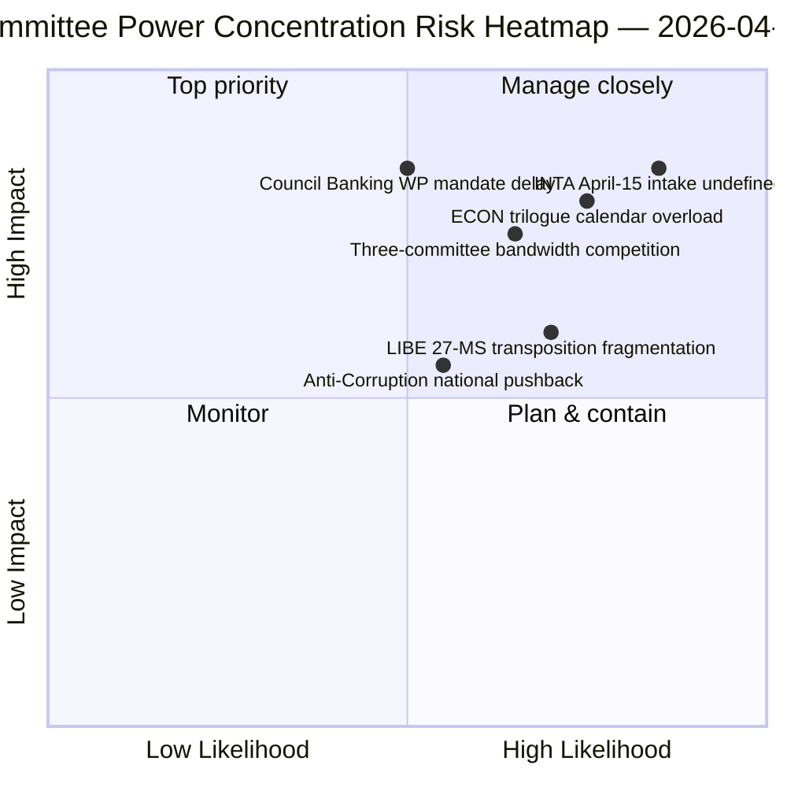

<!-- SPDX-FileCopyrightText: 2026 Hack23 AB -->
<!-- SPDX-License-Identifier: Apache-2.0 -->

# Executive Brief — Committee Reports: Easter Recess Day 11 Retrospective | 2026-04-06

**Classification:** OSINT — Public Parliamentary Record
**Confidence:** 🟡 MEDIUM (recess — no fresh committee activity; pre-recess retrospective 🟢 HIGH)
**Run:** `analysis/daily/2026-04-06/committee-reports/` (05:03 UTC)
**Coverage:** Easter Recess Day 11/18 — committee-power retrospective on pre-recess corpus
**Generated:** 2026-05-16 (retrospective brief, no new MCP calls)
**Primary sources:** Pre-recess adopted-texts corpus (TA-10-2026-0090/0091/0092 ECON; TA-10-2026-0094 LIBE; TA-10-2026-0096 INTA); 20 analysis files.

---

## 🎯 BLUF

**This Easter Monday committee-reports run produces the **committee-power retrospective on the pre-recess corpus**, the analytical complement to the breaking-news cluster on the same date: where breaking-runs documented the dual-track coalition pattern, the committee-reports run documents the *committee-level concentration* that enabled it.** Three committees produced Q1 2026's most consequential output: **ECON** (Banking Union triple package: SRMR3 TA-10-2026-0092 + DGSD2 TA-10-2026-0090 + BRRD3 TA-10-2026-0091 — completion of multi-year Banking Union dossiers affecting the entire EU banking sector), **LIBE** (Anti-Corruption Directive TA-10-2026-0094 — first cross-EU criminal-law instrument since the European Public Prosecutor's Office), and **INTA** (US tariff response TA-10-2026-0096 — the file that activates April 15). The run's distinguishing contribution is the **committee-power-concentration finding**: three committees hold disproportionate Q2 institutional weight, with ECON dominating the Q2 trilogue calendar (Banking Union → Council mandates → Commission interpretation), LIBE owning the 27-MS transposition trajectory through Q2-Q4, and INTA absorbing the operational-implementation oversight role on April 15. The retrospective is published into a degraded API environment (4/8 feeds active) but rests on primary feed-confirmed records.

---

## 🧭 3 Decisions This Brief Supports

| # | Decision | Who decides | Deadline | Evidence |
|:-:|----------|-------------|:--------:|----------|
| 1 | **ECON Q2 trilogue scheduling reservation** — Banking Union triple package requires reserved Council bandwidth | ECON chair + Council Banking WP | by April 14 | §Finding 1 (ECON dominance) |
| 2 | **LIBE 27-MS transposition coordination** — first cross-EU criminal-law instrument needs national-parliament liaison | LIBE chair + national-parliament reps | rolling Q2-Q4 | §Finding 2 (LIBE first-mover) |
| 3 | **INTA scrutiny intake design** — implementation-stage role activates April 15; intake process undefined | INTA chair + coordinators | by April 14 | §Finding 3 (INTA operational role) |

---

## 📰 60-Second Read

- 🔴 **Three-committee Q1 dominance** — ECON · LIBE · INTA.
- 🟠 **ECON Banking Union triple** — SRMR3 + DGSD2 + BRRD3 (multi-year completion).
- 🟢 **LIBE Anti-Corruption** — first cross-EU criminal-law instrument since EPPO.
- 🟡 **INTA US tariff** — operational implementation activates April 15.
- 🔵 **236 adopted texts in cumulative corpus** — verifiable via one-week feed.
- 🟣 **20 analysis files** — committee-level methodology applied per file.
- 🩷 **API 4/8 feeds active** — degraded but committee data accessible.
- ⚪ **Confidence MEDIUM** — recess; pre-recess corpus high; forward forecast medium.

---

## 🏛️ Committee Power Concentration (run's distinguishing contribution)

| Committee | Flagship Q1 file(s) | Q2 institutional weight | Q2-Q4 trajectory |
|-----------|---------------------|-------------------------|------------------|
| **ECON** | TA-0090 / 0091 / 0092 (Banking Union triple) | Trilogue calendar dominance | Multi-year Banking Union completion → Council mandates Q2 |
| **LIBE** | TA-0094 (Anti-Corruption) | 27-MS transposition oversight | Q2-Q4 rolling transposition; national-parliament liaison |
| **INTA** | TA-0096 (US tariff) | Operational implementation oversight | T-0 April 15; scrutiny-window negotiation |

---

## ⚠️ Risk Snapshot

---

## 🔮 Top Forward Triggers (next 14 days)

1. **April 14 — Committee Week opens** — three-committee bandwidth competition begins.
2. **April 15 — TA-10-2026-0096 activates** — INTA operational role.
3. **April 17 — ECB rate decision** — ECON committee external trigger.
4. **Late April — Council Banking WP mandate** — ECON trilogue gate.
5. **Q2 — 27-MS transposition rolling kick-off** — LIBE oversight activation.

---

## 🛡️ Source-Quality Assessment

- **Pre-recess corpus (A1):** primary feed records; TA-IDs verifiable.
- **Three-committee concentration (A2):** committee-power methodology; medium confidence on relative weighting.
- **20 analysis files (A2):** systematic per-file methodology.
- **Net confidence:** 🟢 HIGH on Q1 records; 🟡 MEDIUM on Q2 weight forecast.

---

## 📎 Run Artifacts

| Layer | Artifact | Why |
|-------|----------|-----|
| Article | `article.md` (1,234 lines) | Public-facing committee-reports narrative |
| Synthesis | `existing/synthesis-summary.md` | Three-committee finding (authoritative) |
| Methods | classification · existing · risk-scoring · threat-assessment | Standard committee-reports methodology |
| Companion | breaking (00:33) · breaking-2 (06:45) · breaking-3 (12:15) · breaking-4 (18:18) · motions · propositions | Easter Monday cluster |

---

**Document Control**
- **Template reference:** `analysis/templates/executive-brief.md`
- **Artifact path:** `analysis/daily/2026-04-06/committee-reports/executive-brief.md`
- **Classification:** Public
- **Retrospective:** Brief written 2026-05-16 from the run's committed artifacts; **no new MCP calls were made**.
