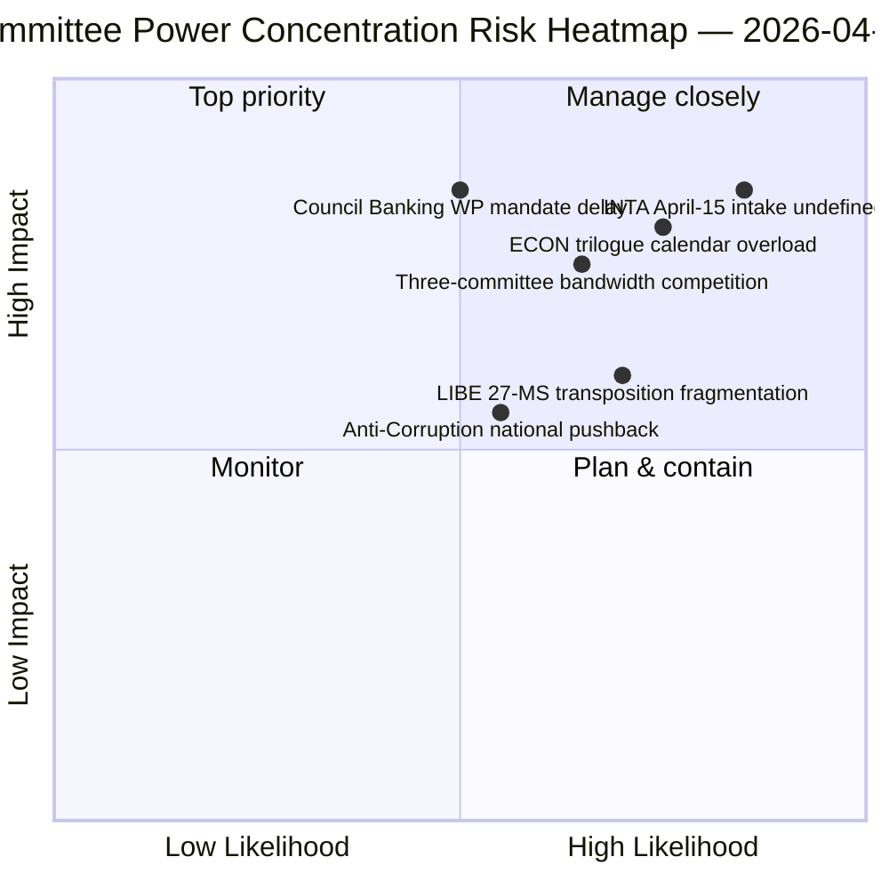

<!-- SPDX-FileCopyrightText: 2026 Hack23 AB -->
<!-- SPDX-License-Identifier: Apache-2.0 -->

# إحاطة تنفيذية — تقارير اللجان: مراجعة استعادية ليوم 11 من عطلة عيد الفصح | 2026-04-06

**التصنيف:** OSINT — سجل برلماني عام
**مستوى الثقة:** 🟡 متوسط (عطلة — لا نشاط جديد للجان؛ مراجعة ما قبل العطلة 🟢 عالٍ)
**التشغيل:** `analysis/daily/2026-04-06/committee-reports/` (05:03 UTC)
**التغطية:** عطلة عيد الفصح اليوم 11/18 — تحليل استعادي لقوة اللجان على المجموعة المستندية السابقة للعطلة
**تاريخ الإنشاء:** 2026-05-16 (إحاطة استعادية، لا استدعاءات MCP جديدة)
**المصادر الأساسية:** مجموعة النصوص المعتمدة قبل العطلة (TA-10-2026-0090/0091/0092 ECON؛ TA-10-2026-0094 LIBE؛ TA-10-2026-0096 INTA)؛ 20 ملف تحليلي.

---

## 🎯 BLUF

**يُنتج تشغيل يوم الإثنين من عيد الفصح هذا التحليل الاستعادي لقوة اللجان على المجموعة المستندية السابقة للعطلة — المكمّل التحليلي لتجمّع الأخبار العاجلة في التاريخ نفسه: حيث وثّقت تشغيلات الأخبار العاجلة نمط الائتلاف ثنائي المسار، توثّق تشغيلة تقارير اللجان *التركيز على مستوى اللجان* الذي أتاح ذلك.** أنتجت ثلاث لجان النتائج الأكثر أهمية في الربع الأول من 2026: **ECON** (الحزمة الثلاثية للاتحاد المصرفي: SRMR3 TA-10-2026-0092 + DGSD2 TA-10-2026-0090 + BRRD3 TA-10-2026-0091 — إتمام ملفات الاتحاد المصرفي متعددة السنوات المؤثرة في القطاع المصرفي للاتحاد الأوروبي بأسره)، و**LIBE** (توجيه مكافحة الفساد TA-10-2026-0094 — أول أداة جنائية أوروبية شاملة منذ النيابة العامة الأوروبية EPPO)، و**INTA** (استجابة التعريفات الأمريكية TA-10-2026-0096 — الملف الذي يُفعَّل في 15 أبريل). المساهمة المميزة لهذا التشغيل هي **نتيجة تركيز قوة اللجان**: تحتل ثلاث لجان ثقلاً مؤسسياً غير متناسب في الربع الثاني، مع هيمنة ECON على طاقة تقويم المفاوضات الثلاثية للربع الثاني (الاتحاد المصرفي ← تفويضات المجلس ← تفسير المفوضية)، وامتلاك LIBE مسار التحويل لدى 27 دولة عضو عبر الربعين الثالث والرابع، وتحمّل INTA دور الإشراف على التنفيذ التشغيلي اعتباراً من 15 أبريل. تُنشر المراجعة الاستعادية في بيئة API متدهورة (4/8 تدفقات نشطة) لكنها تستند إلى سجلات مؤكدة من التدفقات الأساسية.

---

## 🧭 3 قرارات تدعمها هذه الإحاطة

| # | القرار | من يقرر | الموعد النهائي | الأدلة |
|:-:|--------|---------|:-------------:|--------|
| 1 | **حجز جدول المفاوضات الثلاثية للربع الثاني لـ ECON** — تتطلب الحزمة الثلاثية للاتحاد المصرفي طاقة محجوزة في المجلس | رئيس ECON + فريق عمل المجلس المصرفي | قبل 14 أبريل | §نتيجة 1 (هيمنة ECON) |
| 2 | **تنسيق تحويل 27 دولة عضو لـ LIBE** — تتطلب أول أداة جنائية أوروبية شاملة ارتباطاً بالبرلمانات الوطنية | رئيس LIBE + ممثلو البرلمانات الوطنية | متواصل الربع الثاني–الرابع | §نتيجة 2 (LIBE كمبادر أول) |
| 3 | **تصميم استقبال تدقيق INTA** — تُفعَّل مرحلة التنفيذ في 15 أبريل؛ عملية الاستقبال غير محددة | رئيس INTA + المنسقون | قبل 14 أبريل | §نتيجة 3 (الدور التشغيلي لـ INTA) |

---

## 📰 قراءة في 60 ثانية

- 🔴 **هيمنة ثلاث لجان في الربع الأول** — ECON · LIBE · INTA.
- 🟠 **ECON الثلاثية للاتحاد المصرفي** — SRMR3 + DGSD2 + BRRD3 (إتمام متعدد السنوات).
- 🟢 **LIBE مكافحة الفساد** — أول أداة جنائية أوروبية شاملة منذ EPPO.
- 🟡 **INTA التعريفة الأمريكية** — يُفعَّل التنفيذ التشغيلي في 15 أبريل.
- 🔵 **236 نصاً معتمداً في المجموعة التراكمية** — قابل للتحقق عبر التدفق الأسبوعي.
- 🟣 **20 ملف تحليلي** — منهجية مستوى اللجان مطبقة لكل ملف.
- 🩷 **API 4/8 تدفقات نشطة** — متدهور لكن بيانات اللجان متاحة.
- ⚪ **مستوى الثقة متوسط** — عطلة؛ مجموعة ما قبل العطلة عالية؛ التوقعات المستقبلية متوسطة.

---

## 🏛️ تركيز قوة اللجان (المساهمة المميزة للتشغيل)

| اللجنة | الملف/الملفات الرائدة الربع الأول | الثقل المؤسسي الربع الثاني | المسار الربع الثاني–الرابع |
|--------|----------------------------------|---------------------------|---------------------------|
| **ECON** | TA-0090 / 0091 / 0092 (الثلاثية للاتحاد المصرفي) | هيمنة تقويم المفاوضات الثلاثية | إتمام الاتحاد المصرفي متعدد السنوات → تفويضات المجلس الربع الثاني |
| **LIBE** | TA-0094 (مكافحة الفساد) | إشراف تحويل 27 دولة عضو | الربع الثاني–الرابع تحويل متواصل؛ ارتباط برلماني وطني |
| **INTA** | TA-0096 (التعريفة الأمريكية) | إشراف التنفيذ التشغيلي | T-0 في 15 أبريل؛ تفاوض نافذة التدقيق |

---

## ⚠️ لقطة المخاطر

---

## 🔮 أبرز المحفزات المستقبلية (14 يوماً القادمة)

1. **14 أبريل — افتتاح أسبوع اللجان** — تبدأ منافسة طاقة اللجان الثلاث.
2. **15 أبريل — تفعيل TA-10-2026-0096** — الدور التشغيلي لـ INTA.
3. **17 أبريل — قرار أسعار الفائدة للبنك المركزي الأوروبي** — محفز خارجي لـ ECON.
4. **أواخر أبريل — تفويض فريق عمل المجلس المصرفي** — بوابة مفاوضات ECON الثلاثية.
5. **الربع الثاني — انطلاق تحويل 27 دولة عضو المتواصل** — تفعيل إشراف LIBE.

---

## 🛡️ تقييم جودة المصادر

- **مجموعة ما قبل العطلة (A1):** سجلات التدفق الأساسية؛ معرّفات TA-ID قابلة للتحقق.
- **تركيز اللجان الثلاث (A2):** منهجية قوة اللجان؛ ثقة متوسطة في الترجيح النسبي.
- **20 ملف تحليلي (A2):** منهجية منهجية لكل ملف.
- **مستوى الثقة الصافي:** 🟢 عالٍ في سجلات الربع الأول؛ 🟡 متوسط في توقعات وزن الربع الثاني.

---

## 📎 مخرجات التشغيل

| الطبقة | المخرج | السبب |
|--------|--------|-------|
| المقال | `article.md` (1,234 سطراً) | السرد العام لتقارير اللجان |
| التوليف | `existing/synthesis-summary.md` | نتيجة اللجان الثلاث (سلطوي) |
| المناهج | classification · existing · risk-scoring · threat-assessment | منهجية تقارير اللجان القياسية |
| الرفيق | breaking (00:33) · breaking-2 (06:45) · breaking-3 (12:15) · breaking-4 (18:18) · motions · propositions | تجمّع يوم الإثنين من عيد الفصح |

---

**ضبط الوثيقة**
- **مرجع القالب:** `analysis/templates/executive-brief.md`
- **مسار المخرج:** `analysis/daily/2026-04-06/committee-reports/executive-brief.md`
- **التصنيف:** عام
- **الاستعادة:** الإحاطة مكتوبة في 2026-05-16 من المخرجات المؤرشفة للتشغيل؛ **لم تُجرَ استدعاءات MCP جديدة**.
