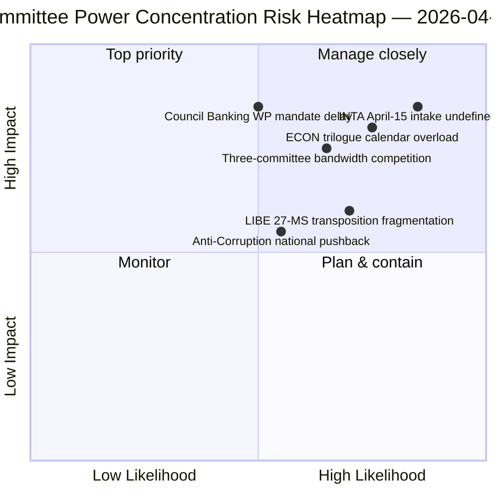

<!-- SPDX-FileCopyrightText: 2026 Hack23 AB -->
<!-- SPDX-License-Identifier: Apache-2.0 -->

# Ledelsesresumé — Udvalgsrapporter: Påskeferie Dag 11 Retrospektiv | 2026-04-06

**Klassifikation:** OSINT — Offentligt parlamentarisk optegnelse
**Konfidensniveau:** 🟡 MIDDEL (ferie — ingen ny udvalgsaktivitet; pre-ferie retrospektiv 🟢 HØJ)
**Kørsel:** `analysis/daily/2026-04-06/committee-reports/` (05:03 UTC)
**Dækning:** Påskeferie Dag 11/18 — retrospektiv udvalgsmagtanalyse af pre-ferie-korpus
**Genereret:** 2026-05-16 (retrospektivt resumé, ingen nye MCP-kald)
**Primære kilder:** Pre-ferie vedtagne tekster (TA-10-2026-0090/0091/0092 ECON; TA-10-2026-0094 LIBE; TA-10-2026-0096 INTA); 20 analysefiler.

---

## 🎯 BLUF

**Denne kørsel 2. påskedag producerer den retrospektive udvalgsmagtanalyse af pre-ferie-korpusset — det analytiske komplement til breaking-klyngen på samme dato: hvor breaking-kørslerne dokumenterede det tosporskoalitionsmønster, dokumenterer udvalgsrapportkørslen den *udvalgsniveaukoncentration*, der muliggjorde det.** Tre udvalg producerede Q1 2026's mest konsekvente output: **ECON** (Bankunionens tredobbeltpakke: SRMR3 TA-10-2026-0092 + DGSD2 TA-10-2026-0090 + BRRD3 TA-10-2026-0091 — afslutning af flerårige bankunionssager med indvirkning på hele EU's banksektor), **LIBE** (Anti-korruptionsdirektiv TA-10-2026-0094 — det første tværeuropæiske strafferetsinstrument siden den Europæiske anklagemyndighed EPPO), og **INTA** (USA-toldrespons TA-10-2026-0096 — den fil der aktiveres den 15. april). Kørslens særlige bidrag er **udvalgsmagt-koncentrationsfundet**: tre udvalg besidder en uforholdsmæssig Q2 institutionel vægt, idet ECON dominerer Q2-trilogkalenderens kapacitet (Bankunionen → Rådets mandater → Kommissionens fortolkning), LIBE ejer den 27-MS-transponeringsforløb gennem Q2–Q4, og INTA absorberer den operationelle implementeringstilsynsrolle fra den 15. april. Det retrospektive resumé offentliggøres i et forringet API-miljø (4/8 feeds aktive) men hviler på primære feedbekræftede poster.

---

## 🧭 3 Beslutninger dette resumé understøtter

| # | Beslutning | Beslutningstager | Deadline | Dokumentation |
|:-:|-----------|-----------------|:--------:|---------------|
| 1 | **ECON Q2-trilogtidsplanreservation** — Bankunionens tredobbeltpakke kræver reserveret rådskapacitet | ECON-formand + Rådets bankarbeidsgruppe | inden 14. april | §Fund 1 (ECON-dominans) |
| 2 | **LIBE 27-MS-transponeringskoordinering** — første tværeuropæiske strafferetsinstrument kræver liaison til nationale parlamenter | LIBE-formand + nationale parlamentsrepræsentanter | løbende Q2–Q4 | §Fund 2 (LIBE som førstemover) |
| 3 | **INTA kontrolindtag design** — implementeringsfasen aktiveres 15. april; indtag er udefinieret | INTA-formand + koordinatorer | inden 14. april | §Fund 3 (INTA operativ rolle) |

---

## 📰 60-sekunders læsning

- 🔴 **Tre-udvalgs Q1-dominans** — ECON · LIBE · INTA.
- 🟠 **ECON Bankunionens tredobbelt** — SRMR3 + DGSD2 + BRRD3 (flerårig afslutning).
- 🟢 **LIBE Anti-korruption** — første tværeuropæiske strafferetsinstrument siden EPPO.
- 🟡 **INTA USA-told** — operationel implementering aktiveres 15. april.
- 🔵 **236 vedtagne tekster i kumulativt korpus** — verificerbar via ugedatafeed.
- 🟣 **20 analysefiler** — udvalgsniveaumetodik anvendt per fil.
- 🩷 **API 4/8 feeds aktive** — forringet men udvalgsdata tilgængeligt.
- ⚪ **Konfidensniveau MIDDEL** — ferie; pre-ferie-korpus højt; fremadrettet prognose middel.

---

## 🏛️ Udvalgsmagtkoncentration (kørslens særlige bidrag)

| Udvalg | Flagskibssag(er) Q1 | Q2 institutionel vægt | Q2–Q4-forløb |
|--------|---------------------|----------------------|--------------|
| **ECON** | TA-0090 / 0091 / 0092 (Bankunionens tredobbelt) | Trilogkalender-dominans | Flerårig bankunionsafslutning → Rådets mandater Q2 |
| **LIBE** | TA-0094 (Anti-korruption) | 27-MS-transponeringstilsyn | Q2–Q4 løbende transponering; nationalt parlamentarisk liaison |
| **INTA** | TA-0096 (USA-told) | Operationelt implementeringstilsyn | T-0 15. april; kontrolvinduforhandling |

---

## ⚠️ Risikooversigt

---

## 🔮 Top fremadrettede udløsere (næste 14 dage)

1. **14. april — Udvalgsugen åbner** — tre-udvalgs kapacitetskonkurrence begynder.
2. **15. april — TA-10-2026-0096 aktiveres** — INTA's operationelle rolle.
3. **17. april — ECB's rentebeslutning** — ECON's eksterne udløser.
4. **Sent april — Rådets bankarbeidsgruppe mandat** — ECON's trilogport.
5. **Q2 — 27-MS-transponering løbende kickoff** — LIBE's tilsynsaktivering.

---

## 🛡️ Kildekvurdering

- **Pre-ferie-korpus (A1):** primære feedposter; TA-ID'er verificerbare.
- **Tre-udvalgskoncentration (A2):** udvalgsmagt-metodik; middel konfidens på relativ vægtning.
- **20 analysefiler (A2):** systematisk per-fil-metodik.
- **Netto konfidensniveau:** 🟢 HØJ på Q1-poster; 🟡 MIDDEL på Q2-vægtprognose.

---

## 📎 Kørselsprodukter

| Lag | Produkt | Hvorfor |
|-----|---------|---------|
| Artikel | `article.md` (1.234 linjer) | Offentligt udvalgsrapportnarrativ |
| Syntese | `existing/synthesis-summary.md` | Tre-udvalgsfund (autoritativt) |
| Metoder | classification · existing · risk-scoring · threat-assessment | Standard udvalgsrapportmetodik |
| Ledsager | breaking (00:33) · breaking-2 (06:45) · breaking-3 (12:15) · breaking-4 (18:18) · motions · propositions | Påskemandagsklynge |

---

**Dokumentkontrol**
- **Skabelonreference:** `analysis/templates/executive-brief.md`
- **Artefaktsti:** `analysis/daily/2026-04-06/committee-reports/executive-brief.md`
- **Klassifikation:** Offentlig
- **Retrospektiv:** Resumé skrevet 2026-05-16 fra kørslens arkiverede artefakter; **ingen nye MCP-kald blev foretaget**.
