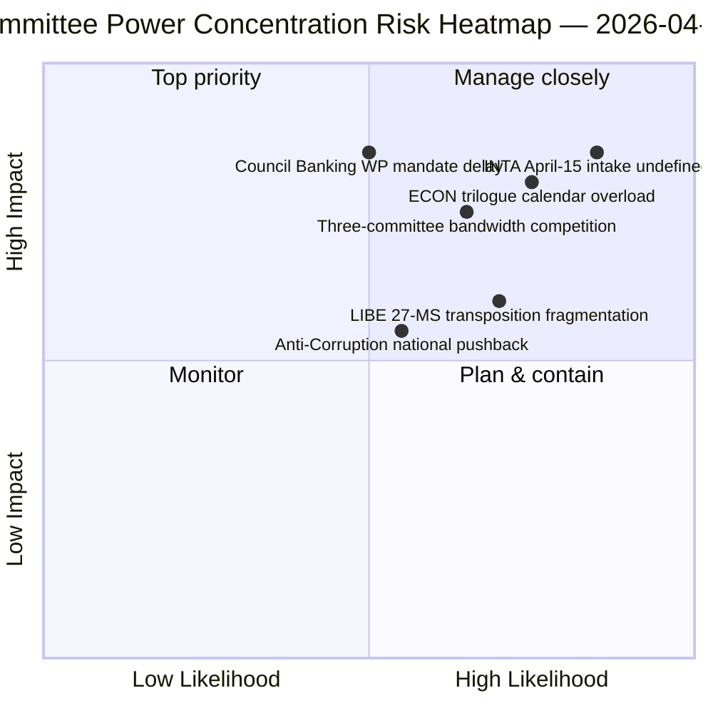

<!-- SPDX-FileCopyrightText: 2026 Hack23 AB -->
<!-- SPDX-License-Identifier: Apache-2.0 -->

# Exekutiv-Briefing — Ausschussberichte: Osterferien Tag 11 Retrospektive | 2026-04-06

**Klassifizierung:** OSINT — Öffentliche parlamentarische Aufzeichnung
**Vertrauensniveau:** 🟡 MITTEL (Ferien — keine neue Ausschussaktivität; Pre-Ferien-Retrospektive 🟢 HOCH)
**Lauf:** `analysis/daily/2026-04-06/committee-reports/` (05:03 UTC)
**Abdeckung:** Osterferien Tag 11/18 — retrospektive Ausschussmachtanalyse des Pre-Ferien-Korpus
**Erstellt:** 2026-05-16 (retrospektives Briefing, keine neuen MCP-Aufrufe)
**Primärquellen:** Pre-Ferien-Korpus angenommener Texte (TA-10-2026-0090/0091/0092 ECON; TA-10-2026-0094 LIBE; TA-10-2026-0096 INTA); 20 Analysedateien.

---

## 🎯 BLUF

**Dieser Ostermontag-Lauf produziert die retrospektive Ausschussmachtanalyse des Pre-Ferien-Korpus — das analytische Komplement zum Breaking-Cluster am selben Datum: wo die Breaking-Läufe das doppelspurige Koalitionsmuster dokumentierten, dokumentiert der Ausschussberichtslauf die *Ausschussebenenkonzentration*, die dies ermöglichte.** Drei Ausschüsse produzierten Q1 2026's folgenreichste Ergebnisse: **ECON** (Bankenunions-Dreierpaket: SRMR3 TA-10-2026-0092 + DGSD2 TA-10-2026-0090 + BRRD3 TA-10-2026-0091 — Abschluss mehrjähriger Bankenunionsdossiers, die den gesamten EU-Bankensektor betreffen), **LIBE** (Anti-Korruptionsrichtlinie TA-10-2026-0094 — das erste EU-weite Strafrechtsinstument seit der Europäischen Staatsanwaltschaft EPPO), und **INTA** (US-Zollreaktion TA-10-2026-0096 — die Datei, die am 15. April aktiviert wird). Der besondere Beitrag des Laufs ist der **Ausschussmacht-Konzentrationsbefund**: Drei Ausschüsse besitzen überproportionales institutionelles Gewicht in Q2, wobei ECON die Q2-Trilog-Kalenderkapazität dominiert (Bankenunion → Ratsmandate → Kommissionsauslegung), LIBE den 27-MS-Transpositionspfad durch Q2–Q4 besitzt, und INTA die operative Implementierungsaufsichtsrolle ab dem 15. April übernimmt. Das retrospektive Briefing wird in einer degradierten API-Umgebung (4/8 Feeds aktiv) veröffentlicht, basiert aber auf primären feed-bestätigten Einträgen.

---

## 🧭 3 Entscheidungen, die dieses Briefing unterstützt

| # | Entscheidung | Entscheidungsträger | Frist | Nachweis |
|:-:|-------------|---------------------|:-----:|----------|
| 1 | **ECON Q2-Trilog-Terminplanung** — Bankenunions-Dreierpaket erfordert reservierte Ratskapazität | ECON-Vorsitzender + Rats-Bankarbeitsgruppe | bis 14. April | §Befund 1 (ECON-Dominanz) |
| 2 | **LIBE 27-MS-Transpositionskoordinierung** — erstes EU-weites Strafrechtsinstrument erfordert Verbindung zu nationalen Parlamenten | LIBE-Vorsitzender + Nationalparlamentsvertreter | laufend Q2–Q4 | §Befund 2 (LIBE als Erstmover) |
| 3 | **INTA-Prüfungsaufnahme-Design** — Implementierungsphase aktiviert sich am 15. April; Aufnahme nicht definiert | INTA-Vorsitzender + Koordinatoren | bis 14. April | §Befund 3 (INTA operative Rolle) |

---

## 📰 60-Sekunden-Lektüre

- 🔴 **Drei-Ausschuss-Q1-Dominanz** — ECON · LIBE · INTA.
- 🟠 **ECON Bankenunions-Dreierpaket** — SRMR3 + DGSD2 + BRRD3 (mehrjähriger Abschluss).
- 🟢 **LIBE Anti-Korruption** — erstes EU-weites Strafrechtsinstrument seit EPPO.
- 🟡 **INTA US-Zoll** — operative Implementierung aktiviert sich am 15. April.
- 🔵 **236 angenommene Texte im kumulativen Korpus** — über Wochenfeed überprüfbar.
- 🟣 **20 Analysedateien** — Ausschussebenen-Methodik per Datei angewendet.
- 🩷 **API 4/8 Feeds aktiv** — degradiert aber Ausschussdaten zugänglich.
- ⚪ **Vertrauensniveau MITTEL** — Ferien; Pre-Ferien-Korpus hoch; Vorwärtsprognose mittel.

---

## 🏛️ Ausschussmacht-Konzentration (besonderer Beitrag des Laufs)

| Ausschuss | Flaggschiff-Akte(n) Q1 | Institutionelles Gewicht Q2 | Trajektorie Q2–Q4 |
|-----------|-----------------------|------------------------------|-------------------|
| **ECON** | TA-0090 / 0091 / 0092 (Bankenunions-Dreierpaket) | Trilog-Kalender-Dominanz | Mehrjähriger Bankenunionsabschluss → Ratsmandate Q2 |
| **LIBE** | TA-0094 (Anti-Korruption) | 27-MS-Transpositionsaufsicht | Q2–Q4 laufende Transposition; nationales parlamentarisches Liaison |
| **INTA** | TA-0096 (US-Zoll) | Operative Implementierungsaufsicht | T-0 15. April; Prüffensterverhandlung |

---

## ⚠️ Risiko-Schnappschuss

---

## 🔮 Top Vorwärts-Auslöser (nächste 14 Tage)

1. **14. April — Ausschusswoche beginnt** — Drei-Ausschuss-Bandbreitenkonkurrenz beginnt.
2. **15. April — TA-10-2026-0096 aktiviert sich** — INTAs operative Rolle.
3. **17. April — EZB-Zinsentscheidung** — ECONs externer Auslöser.
4. **Ende April — Rats-Bankarbeitsgruppe Mandat** — ECONs Trilog-Tor.
5. **Q2 — 27-MS-Transposition laufender Kickoff** — LIBEs Aufsichtsaktivierung.

---

## 🛡️ Quellenqualitätsbewertung

- **Pre-Ferien-Korpus (A1):** primäre Feed-Einträge; TA-IDs überprüfbar.
- **Drei-Ausschuss-Konzentration (A2):** Ausschussmacht-Methodik; mittleres Vertrauen in relative Gewichtung.
- **20 Analysedateien (A2):** systematische Per-Datei-Methodik.
- **Netto-Vertrauensniveau:** 🟢 HOCH für Q1-Einträge; 🟡 MITTEL für Q2-Gewichtsprognose.

---

## 📎 Lauf-Artefakte

| Ebene | Artefakt | Warum |
|-------|----------|-------|
| Artikel | `article.md` (1.234 Zeilen) | Öffentliches Ausschussberichtsnarrativ |
| Synthese | `existing/synthesis-summary.md` | Drei-Ausschuss-Befund (autoritativ) |
| Methoden | classification · existing · risk-scoring · threat-assessment | Standard-Ausschussberichtsmethodik |
| Begleiter | breaking (00:33) · breaking-2 (06:45) · breaking-3 (12:15) · breaking-4 (18:18) · motions · propositions | Ostermontags-Cluster |

---

**Dokumentkontrolle**
- **Vorlagereferenz:** `analysis/templates/executive-brief.md`
- **Artefaktpfad:** `analysis/daily/2026-04-06/committee-reports/executive-brief.md`
- **Klassifizierung:** Öffentlich
- **Retrospektive:** Briefing erstellt am 2026-05-16 aus den archivierten Artefakten des Laufs; **es wurden keine neuen MCP-Aufrufe gemacht**.
