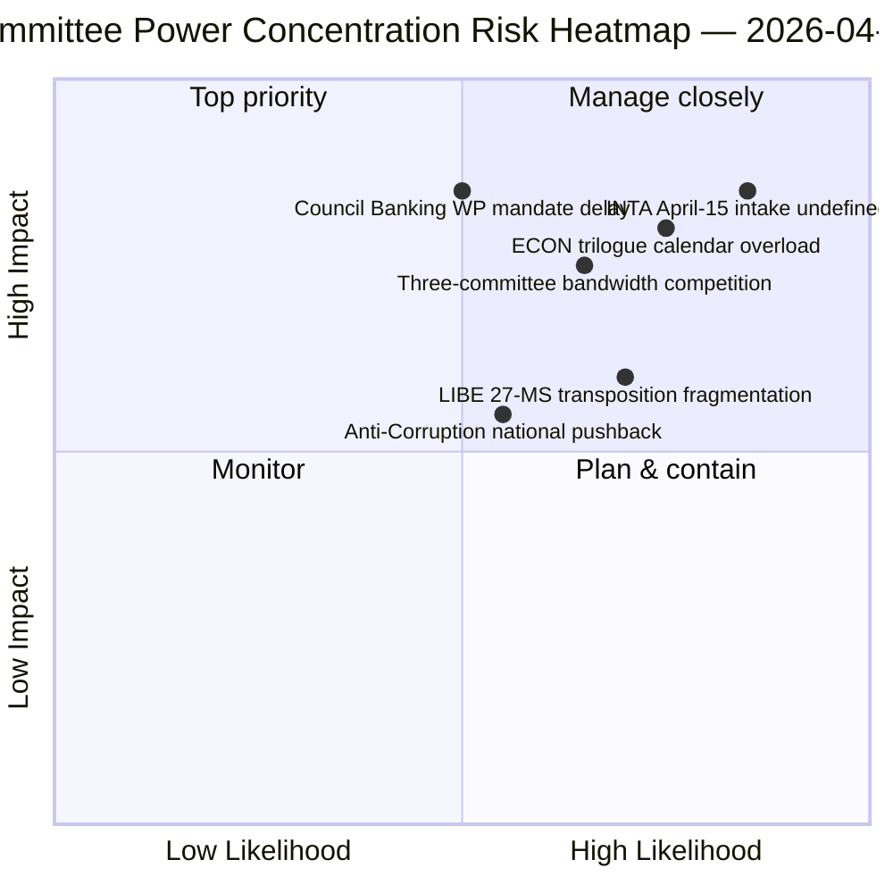

<!-- SPDX-FileCopyrightText: 2026 Hack23 AB -->
<!-- SPDX-License-Identifier: Apache-2.0 -->

# Nota Informativa Ejecutiva — Informes de Comisiones: Retrospectiva Día 11 del Receso de Semana Santa | 2026-04-06

**Clasificación:** OSINT — Registro parlamentario público
**Nivel de confianza:** 🟡 MEDIO (receso — sin nueva actividad de comisiones; retrospectiva pre-receso 🟢 ALTO)
**Ejecución:** `analysis/daily/2026-04-06/committee-reports/` (05:03 UTC)
**Cobertura:** Receso de Semana Santa Día 11/18 — análisis retrospectivo del poder de comisiones del corpus pre-receso
**Generada:** 2026-05-16 (nota retrospectiva, sin nuevas llamadas MCP)
**Fuentes primarias:** Corpus pre-receso de textos adoptados (TA-10-2026-0090/0091/0092 ECON; TA-10-2026-0094 LIBE; TA-10-2026-0096 INTA); 20 archivos de análisis.

---

## 🎯 BLUF

**Esta ejecución del Lunes de Pascua produce el análisis retrospectivo del poder de comisiones del corpus pre-receso — el complemento analítico del clúster de noticias urgentes en la misma fecha: donde las ejecuciones urgentes documentaron el patrón de coalición de doble vía, la ejecución de informes de comisiones documenta la *concentración a nivel de comisiones* que lo hizo posible.** Tres comisiones produjeron los resultados más consecuentes del T1 2026: **ECON** (paquete triple de la Unión Bancaria: SRMR3 TA-10-2026-0092 + DGSD2 TA-10-2026-0090 + BRRD3 TA-10-2026-0091 — finalización de expedientes plurianuales de la Unión Bancaria que afectan a todo el sector bancario de la UE), **LIBE** (Directiva anticorrupción TA-10-2026-0094 — el primer instrumento penal paneuropeo desde la Fiscalía Europea EPPO), y **INTA** (respuesta arancelaria estadounidense TA-10-2026-0096 — el expediente que se activa el 15 de abril). La contribución distintiva de la ejecución es el **hallazgo de concentración del poder de las comisiones**: tres comisiones ostentan un peso institucional T2 desproporcionado, con ECON dominando el ancho de banda del calendario de trílogos T2 (Unión Bancaria → mandatos del Consejo → interpretación de la Comisión), LIBE siendo propietaria de la trayectoria de transposición de los 27 EM a través de T2–T4, y la INTA absorbiendo el papel de supervisión de la implementación operativa a partir del 15 de abril. La retrospectiva se publica en un entorno API degradado (4/8 flujos activos) pero descansa en registros primarios confirmados por flujos.

---

## 🧭 3 Decisiones que esta nota apoya

| # | Decisión | Quien decide | Plazo | Evidencia |
|:-:|---------|-------------|:-----:|-----------|
| 1 | **Reserva del calendario de trílogos T2 de ECON** — el paquete triple de la Unión Bancaria requiere capacidad del Consejo reservada | Presidente ECON + Grupo de trabajo bancario del Consejo | antes del 14 de abril | §Hallazgo 1 (dominancia ECON) |
| 2 | **Coordinación de transposición de 27 EM de LIBE** — primer instrumento penal paneuropeo necesita enlace con parlamentos nacionales | Presidente LIBE + representantes de parlamentos nacionales | continuo T2–T4 | §Hallazgo 2 (LIBE como primer motor) |
| 3 | **Diseño de admisión de escrutinio INTA** — la fase de implementación se activa el 15 de abril; proceso de admisión no definido | Presidente INTA + coordinadores | antes del 14 de abril | §Hallazgo 3 (papel operativo INTA) |

---

## 📰 Lectura de 60 segundos

- 🔴 **Dominancia de tres comisiones en T1** — ECON · LIBE · INTA.
- 🟠 **Triple ECON Unión Bancaria** — SRMR3 + DGSD2 + BRRD3 (finalización plurianual).
- 🟢 **LIBE Anticorrupción** — primer instrumento penal paneuropeo desde la EPPO.
- 🟡 **INTA Arancel EE.UU.** — implementación operativa se activa el 15 de abril.
- 🔵 **236 textos adoptados en el corpus acumulativo** — verificable a través del feed semanal.
- 🟣 **20 archivos de análisis** — metodología a nivel de comisiones aplicada por archivo.
- 🩷 **API 4/8 flujos activos** — degradado pero datos de comisiones accesibles.
- ⚪ **Nivel de confianza MEDIO** — receso; corpus pre-receso alto; pronóstico prospectivo medio.

---

## 🏛️ Concentración del poder de las comisiones (contribución distintiva de la ejecución)

| Comisión | Expediente(s) insignia T1 | Peso institucional T2 | Trayectoria T2–T4 |
|----------|--------------------------|----------------------|-------------------|
| **ECON** | TA-0090 / 0091 / 0092 (Triple Unión Bancaria) | Dominancia calendario trílogos | Finalización plurianual Unión Bancaria → mandatos del Consejo T2 |
| **LIBE** | TA-0094 (Anticorrupción) | Supervisión transposición 27 EM | T2–T4 transposición continua; enlace parlamentario nacional |
| **INTA** | TA-0096 (Arancel EE.UU.) | Supervisión implementación operativa | T-0 15 de abril; negociación ventana de escrutinio |

---

## ⚠️ Instantánea de riesgos

---

## 🔮 Principales desencadenantes prospectivos (próximos 14 días)

1. **14 de abril — Apertura de la semana de comisiones** — competencia de ancho de banda entre tres comisiones comienza.
2. **15 de abril — TA-10-2026-0096 se activa** — papel operativo de INTA.
3. **17 de abril — Decisión de tipos del BCE** — desencadenante externo de ECON.
4. **Finales de abril — Mandato del Grupo de trabajo bancario del Consejo** — puerta trílogo de ECON.
5. **T2 — Arranque continuo de transposición de 27 EM** — activación de supervisión de LIBE.

---

## 🛡️ Evaluación de la calidad de las fuentes

- **Corpus pre-receso (A1):** registros primarios de flujos; TA-IDs verificables.
- **Concentración de tres comisiones (A2):** metodología de poder de comisiones; confianza media en la ponderación relativa.
- **20 archivos de análisis (A2):** metodología sistemática por archivo.
- **Nivel de confianza neto:** 🟢 ALTO en registros T1; 🟡 MEDIO en pronóstico de peso T2.

---

## 📎 Artefactos de la ejecución

| Capa | Artefacto | Por qué |
|------|-----------|---------|
| Artículo | `article.md` (1.234 líneas) | Narrativa pública de informes de comisiones |
| Síntesis | `existing/synthesis-summary.md` | Hallazgo de tres comisiones (autoritativo) |
| Métodos | classification · existing · risk-scoring · threat-assessment | Metodología estándar de informes de comisiones |
| Compañero | breaking (00:33) · breaking-2 (06:45) · breaking-3 (12:15) · breaking-4 (18:18) · motions · propositions | Clúster del Lunes de Pascua |

---

**Control documental**
- **Referencia de plantilla:** `analysis/templates/executive-brief.md`
- **Ruta del artefacto:** `analysis/daily/2026-04-06/committee-reports/executive-brief.md`
- **Clasificación:** Pública
- **Retrospectiva:** Nota redactada el 2026-05-16 a partir de los artefactos archivados de la ejecución; **no se realizaron nuevas llamadas MCP**.
