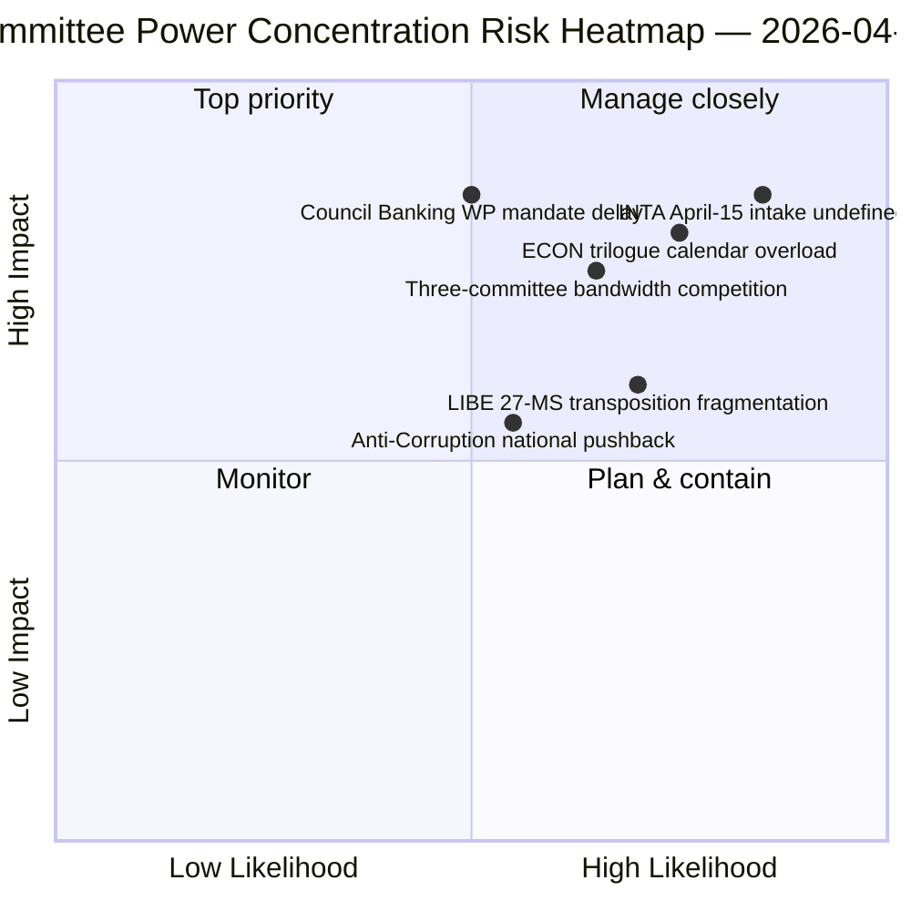

<!-- SPDX-FileCopyrightText: 2026 Hack23 AB -->
<!-- SPDX-License-Identifier: Apache-2.0 -->

# Johdon yhteenveto — Valiokuntaraportit: Pääsiäistauko Päivä 11 Retrospektiivi | 2026-04-06

**Luokittelu:** OSINT — Julkinen parlamentaarinen asiakirja
**Luotettavuustaso:** 🟡 KOHTALAINEN (loma — ei uutta valiokuntaaktiviteettia; pre-loma retrospektiivi 🟢 KORKEA)
**Ajo:** `analysis/daily/2026-04-06/committee-reports/` (05:03 UTC)
**Kattavuus:** Pääsiäistauko Päivä 11/18 — valiokuntavalta-analyysin retrospektiivi pre-loma-korpuksesta
**Luotu:** 2026-05-16 (retrospektiivinen yhteenveto, ei uusia MCP-kutsuja)
**Ensisijaiset lähteet:** Pre-loma hyväksytyt tekstit (TA-10-2026-0090/0091/0092 ECON; TA-10-2026-0094 LIBE; TA-10-2026-0096 INTA); 20 analyysiasiakirjaa.

---

## 🎯 BLUF

**Tämä Toinen Pääsiäispäivän ajo tuottaa pre-loma-korpuksen valiokuntavaltaa koskevan retrospektiivisen analyysin — breaking-klusterin analyyttinen täydennys samana päivänä: siinä missä breaking-ajot dokumentoivat kaksoisraiteisen koaliomallin, valiokuntaraporttiajo dokumentoi sen mahdollistaneen *valiokuntatasoiseen keskittymiseen*.** Kolme valiokuntaa tuotti Q1 2026:n merkittävimmän tuloksen: **ECON** (Pankkiunionin kolmoispaketti: SRMR3 TA-10-2026-0092 + DGSD2 TA-10-2026-0090 + BRRD3 TA-10-2026-0091 — monivuotisten pankkiunioniasioiden päättäminen, joka vaikuttaa koko EU:n pankkisektoriin), **LIBE** (Korruption vastainen direktiivi TA-10-2026-0094 — ensimmäinen EU-laajuinen rikoslainsäädäntöinstrumentti Euroopan syyttäjänviraston EPPO:n jälkeen), ja **INTA** (USA:n tullitoimenpide TA-10-2026-0096 — asiakirja, joka aktivoituu 15. huhtikuuta). Ajon erityinen panos on **valiokuntavalta-konsentraatiotutkimus**: kolmella valiokunnalla on suhteettoman suuri institutionaalinen paino Q2:lla, ECON:n dominoidessa Q2:n trilogikalenterin kapasiteettia (Pankkiunioni → Neuvoston mandaatit → Komission tulkinta), LIBE:n omistaessa 27-MS-transponointipolun Q2–Q4:n läpi, ja INTA:n ottaessa operatiivisen toteutusvalvontaroolin 15. huhtikuuta alkaen. Retrospektiivinen yhteenveto julkaistaan heikentyneen API-ympäristön (4/8 feed-virtaa aktiivisena) olosuhteissa, mutta se perustuu ensisijaisiin feed-vahvistettuihin tietueisiin.

---

## 🧭 3 Päätöstä, joita tämä yhteenveto tukee

| # | Päätös | Päätöksentekijä | Määräaika | Perustelu |
|:-:|--------|-----------------|:----------:|-----------|
| 1 | **ECON Q2-trilogikalenterivaraus** — Pankkiunionin kolmoispaketti edellyttää varattua neuvoston kapasiteettia | ECON:n puheenjohtaja + Neuvoston pankkityöryhmä | 14. huhtikuuta mennessä | §Havainto 1 (ECON-dominanssi) |
| 2 | **LIBE 27-MS-transponointikoordinointi** — ensimmäinen EU-laajuinen rikoslainsäädäntöinstrumentti edellyttää yhteystyötä kansallisten parlamenttien kanssa | LIBE:n puheenjohtaja + kansallisten parlamenttien edustajat | jatkuvasti Q2–Q4 | §Havainto 2 (LIBE edelläkävijänä) |
| 3 | **INTA valvontavirran suunnittelu** — toteutusvaihe aktivoituu 15. huhtikuuta; virta ei ole määritelty | INTA:n puheenjohtaja + koordinaattorit | 14. huhtikuuta mennessä | §Havainto 3 (INTA:n operatiivinen rooli) |

---

## 📰 60 sekunnin tiivistelmä

- 🔴 **Kolmen valiokunnan Q1-dominanssi** — ECON · LIBE · INTA.
- 🟠 **ECON Pankkiunionin kolmoinen** — SRMR3 + DGSD2 + BRRD3 (monivuotinen loppuunsaattaminen).
- 🟢 **LIBE Korruption vastainen** — ensimmäinen EU-laajuinen rikoslainsäädäntöinstrumentti EPPO:n jälkeen.
- 🟡 **INTA USA:n tulli** — operatiivinen toteutus aktivoituu 15. huhtikuuta.
- 🔵 **236 hyväksyttyä tekstiä kumulatiivisessa korpuksessa** — todennettavissa viikkofedin kautta.
- 🟣 **20 analyysiasiakirjaa** — valiokuntatasoinen metodologia sovellettuna per asiakirja.
- 🩷 **API 4/8 feed-virtaa aktiivisena** — heikentynyt mutta valiokuntatiedot saatavilla.
- ⚪ **Luotettavuustaso KOHTALAINEN** — loma; pre-loma-korpus korkea; ennakoiva ennuste kohtalainen.

---

## 🏛️ Valiokuntavaltakeskittymä (ajon erityinen panos)

| Valiokunta | Lippulaiva-asiat Q1 | Q2 institutionaalinen paino | Q2–Q4-kehityskaari |
|------------|---------------------|-----------------------------|---------------------|
| **ECON** | TA-0090 / 0091 / 0092 (Pankkiunionin kolmoinen) | Trilogikalenterin dominanssi | Monivuotinen pankkiunionin loppuunsaattaminen → Neuvoston mandaatit Q2 |
| **LIBE** | TA-0094 (Korruption vastainen) | 27-MS-transponointisenvalvonta | Q2–Q4 jatkuva transponointi; kansallinen parlamentaarinen yhteystyö |
| **INTA** | TA-0096 (USA:n tulli) | Operatiivinen toteutusvalvonta | T-0 15. huhtikuuta; valvontaikkunaneuvottelu |

---

## ⚠️ Riskitiivistelmä

---

## 🔮 Top eteenpäin suuntautuvat laukaisijat (seuraavat 14 päivää)

1. **14. huhtikuuta — Valiokuntaviikko alkaa** — kolmen valiokunnan kapasiteettikilpailu alkaa.
2. **15. huhtikuuta — TA-10-2026-0096 aktivoituu** — INTA:n operatiivinen rooli.
3. **17. huhtikuuta — EKP:n korkopäätös** — ECON:n ulkoinen laukaisija.
4. **Huhtikuun lopussa — Neuvoston pankkityöryhmän mandaatti** — ECON:n trilogportti.
5. **Q2 — 27-MS-transponoinnin jatkuva käynnistys** — LIBE:n valvonnan aktivointi.

---

## 🛡️ Lähdekvaliteetin arviointi

- **Pre-loma-korpus (A1):** ensisijaiset feed-tietueet; TA-ID:t todennettavissa.
- **Kolmen valiokunnan keskittymä (A2):** valiokuntavaltametodologia; kohtalainen luottavuus suhteelliseen painottamiseen.
- **20 analyysiasiakirjaa (A2):** systemaattinen per-asiakirja-metodologia.
- **Nettoluotettavuustaso:** 🟢 KORKEA Q1-tietueille; 🟡 KOHTALAINEN Q2-painoennusteelle.

---

## 📎 Ajon tuotokset

| Taso | Tuotos | Miksi |
|------|--------|-------|
| Artikkeli | `article.md` (1 234 riviä) | Julkinen valiokuntaraporttikertomus |
| Synteesi | `existing/synthesis-summary.md` | Kolmen valiokunnan havainto (auktoritatiivinen) |
| Menetelmät | classification · existing · risk-scoring · threat-assessment | Standardivaliokuntaraporttimetodologia |
| Kumppani | breaking (00:33) · breaking-2 (06:45) · breaking-3 (12:15) · breaking-4 (18:18) · motions · propositions | Pääsiäismaanantain klusteri |

---

**Asiakirjahallinta**
- **Mallireferenssi:** `analysis/templates/executive-brief.md`
- **Artefakttipolku:** `analysis/daily/2026-04-06/committee-reports/executive-brief.md`
- **Luokittelu:** Julkinen
- **Retrospektiivi:** Yhteenveto kirjoitettu 2026-05-16 ajon arkistoiduista artefakteista; **uusia MCP-kutsuja ei tehty**.
