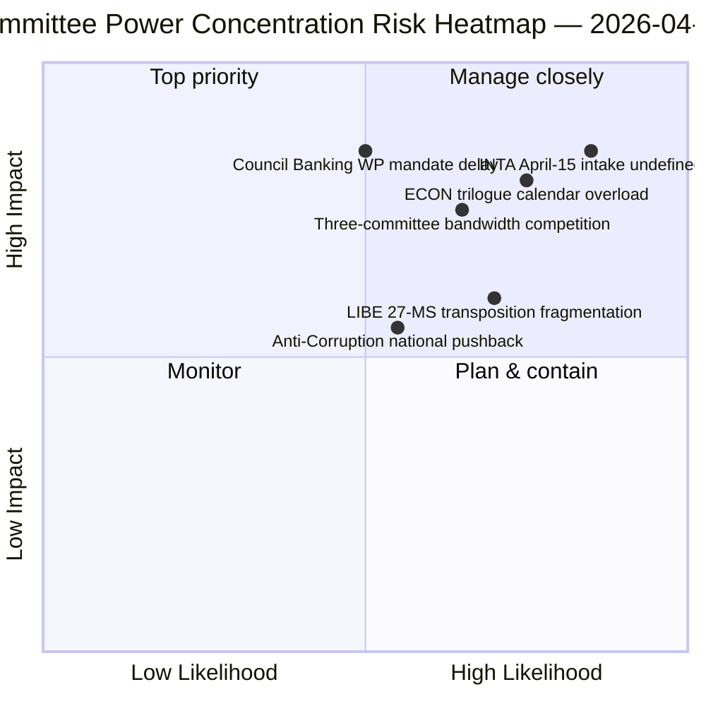

<!-- SPDX-FileCopyrightText: 2026 Hack23 AB -->
<!-- SPDX-License-Identifier: Apache-2.0 -->

# Note de synthèse — Rapports de commissions : Rétrospective Jour 11 du congé de Pâques | 2026-04-06

**Classification :** OSINT — Document parlementaire public
**Niveau de confiance :** 🟡 MOYEN (congé — aucune nouvelle activité de commission ; rétrospective pré-congé 🟢 ÉLEVÉ)
**Exécution :** `analysis/daily/2026-04-06/committee-reports/` (05:03 UTC)
**Couverture :** Congé de Pâques Jour 11/18 — analyse rétrospective du pouvoir des commissions sur le corpus pré-congé
**Générée :** 2026-05-16 (note rétrospective, aucun nouvel appel MCP)
**Sources primaires :** Corpus de textes adoptés pré-congé (TA-10-2026-0090/0091/0092 ECON ; TA-10-2026-0094 LIBE ; TA-10-2026-0096 INTA) ; 20 fichiers d'analyse.

---

## 🎯 BLUF

**Cette exécution du Lundi de Pâques produit l'analyse rétrospective du pouvoir des commissions sur le corpus pré-congé — le complément analytique du cluster d'actualités urgentes à la même date : là où les exécutions urgentes documentaient le schéma de coalition à deux voies, l'exécution des rapports de commissions documente la *concentration au niveau des commissions* qui l'a rendu possible.** Trois commissions ont produit les résultats les plus conséquents du T1 2026 : **ECON** (triple paquet Union bancaire : SRMR3 TA-10-2026-0092 + DGSD2 TA-10-2026-0090 + BRRD3 TA-10-2026-0091 — achèvement de dossiers pluriannuels d'Union bancaire affectant l'ensemble du secteur bancaire de l'UE), **LIBE** (Directive anti-corruption TA-10-2026-0094 — premier instrument pénal transeuropéen depuis le Parquet européen EPPO), et **INTA** (réponse tarifaire américaine TA-10-2026-0096 — le dossier qui s'active le 15 avril). La contribution distinctive de l'exécution est la **conclusion sur la concentration du pouvoir des commissions** : trois commissions détiennent un poids institutionnel T2 disproportionné, avec ECON dominant la bande passante du calendrier de trilogues T2 (Union bancaire → mandats du Conseil → interprétation de la Commission), LIBE possédant la trajectoire de transposition des 27 EM à travers T2–T4, et INTA absorbant le rôle de supervision de la mise en œuvre opérationnelle à partir du 15 avril. La rétrospective est publiée dans un environnement API dégradé (4/8 flux actifs) mais repose sur des enregistrements primaires confirmés par les flux.

---

## 🧭 3 Décisions que cette note soutient

| # | Décision | Décideur | Échéance | Preuve |
|:-:|---------|----------|:--------:|--------|
| 1 | **Réservation du calendrier des trilogues T2 pour ECON** — le triple paquet Union bancaire nécessite une capacité réservée du Conseil | Président ECON + Groupe de travail bancaire du Conseil | avant le 14 avril | §Constat 1 (dominance ECON) |
| 2 | **Coordination de la transposition des 27 EM par LIBE** — premier instrument pénal transeuropéen nécessite une liaison avec les parlements nationaux | Président LIBE + représentants des parlements nationaux | continu T2–T4 | §Constat 2 (LIBE premier entrant) |
| 3 | **Conception de l'admission du contrôle INTA** — la phase de mise en œuvre s'active le 15 avril ; procédure d'admission non définie | Président INTA + coordinateurs | avant le 14 avril | §Constat 3 (rôle opérationnel INTA) |

---

## 📰 Lecture en 60 secondes

- 🔴 **Dominance des trois commissions au T1** — ECON · LIBE · INTA.
- 🟠 **Triple Union bancaire ECON** — SRMR3 + DGSD2 + BRRD3 (achèvement pluriannuel).
- 🟢 **Anti-Corruption LIBE** — premier instrument pénal transeuropéen depuis l'EPPO.
- 🟡 **Tarif douanier US INTA** — mise en œuvre opérationnelle activée le 15 avril.
- 🔵 **236 textes adoptés dans le corpus cumulatif** — vérifiable via le flux hebdomadaire.
- 🟣 **20 fichiers d'analyse** — méthodologie de niveau commission appliquée par fichier.
- 🩷 **API 4/8 flux actifs** — dégradé mais données des commissions accessibles.
- ⚪ **Niveau de confiance MOYEN** — congé ; corpus pré-congé élevé ; prévision prospective moyenne.

---

## 🏛️ Concentration du pouvoir des commissions (contribution distinctive de l'exécution)

| Commission | Dossier(s) phare T1 | Poids institutionnel T2 | Trajectoire T2–T4 |
|------------|---------------------|-------------------------|-------------------|
| **ECON** | TA-0090 / 0091 / 0092 (Triple Union bancaire) | Dominance calendrier trilogues | Achèvement pluriannuel Union bancaire → mandats du Conseil T2 |
| **LIBE** | TA-0094 (Anti-Corruption) | Supervision transposition 27 EM | T2–T4 transposition continue ; liaison parlementaire nationale |
| **INTA** | TA-0096 (Tarif douanier US) | Supervision mise en œuvre opérationnelle | T-0 15 avril ; négociation de la fenêtre de contrôle |

---

## ⚠️ Instantané des risques

---

## 🔮 Principaux déclencheurs prospectifs (14 prochains jours)

1. **14 avril — Ouverture de la semaine des commissions** — compétition de bande passante entre les trois commissions.
2. **15 avril — Activation de TA-10-2026-0096** — rôle opérationnel INTA.
3. **17 avril — Décision de taux de la BCE** — déclencheur externe pour ECON.
4. **Fin avril — Mandat du Groupe de travail bancaire du Conseil** — porte triloguede ECON.
5. **T2 — Lancement continu de la transposition des 27 EM** — activation de la supervision LIBE.

---

## 🛡️ Évaluation de la qualité des sources

- **Corpus pré-congé (A1) :** enregistrements primaires de flux ; TA-IDs vérifiables.
- **Concentration des trois commissions (A2) :** méthodologie du pouvoir des commissions ; confiance moyenne sur la pondération relative.
- **20 fichiers d'analyse (A2) :** méthodologie systématique par fichier.
- **Niveau de confiance net :** 🟢 ÉLEVÉ sur les enregistrements T1 ; 🟡 MOYEN sur la prévision du poids T2.

---

## 📎 Artefacts de l'exécution

| Couche | Artefact | Pourquoi |
|--------|----------|---------|
| Article | `article.md` (1 234 lignes) | Narrative publique des rapports de commissions |
| Synthèse | `existing/synthesis-summary.md` | Constat des trois commissions (autoritatif) |
| Méthodes | classification · existing · risk-scoring · threat-assessment | Méthodologie standard des rapports de commissions |
| Compagnon | breaking (00:33) · breaking-2 (06:45) · breaking-3 (12:15) · breaking-4 (18:18) · motions · propositions | Cluster du Lundi de Pâques |

---

**Contrôle documentaire**
- **Référence du modèle :** `analysis/templates/executive-brief.md`
- **Chemin d'artefact :** `analysis/daily/2026-04-06/committee-reports/executive-brief.md`
- **Classification :** Publique
- **Rétrospective :** Note rédigée le 2026-05-16 à partir des artefacts archivés de l'exécution ; **aucun nouvel appel MCP n'a été effectué**.
