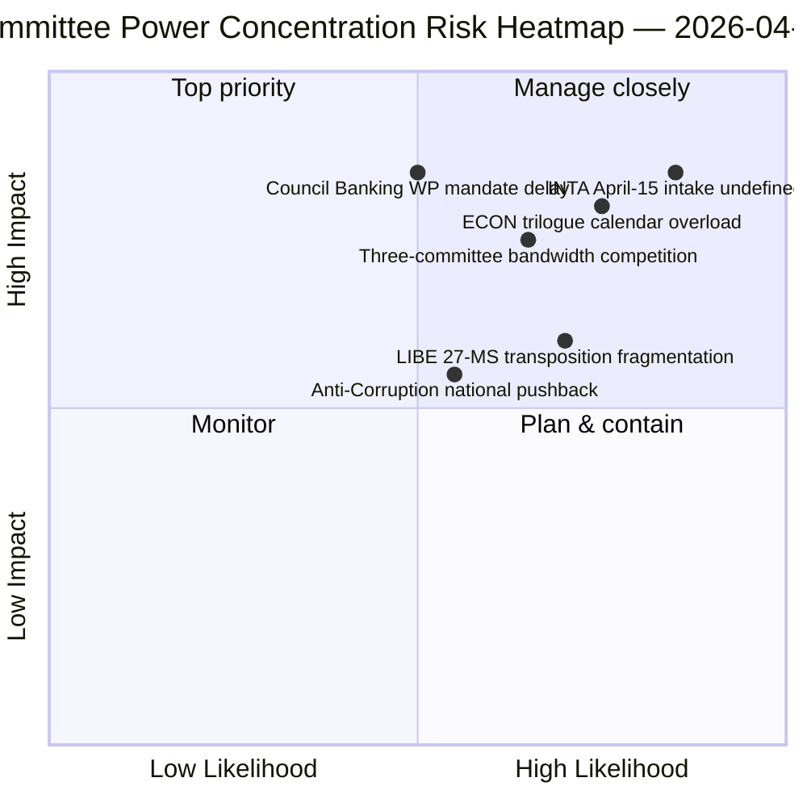

<!-- SPDX-FileCopyrightText: 2026 Hack23 AB -->
<!-- SPDX-License-Identifier: Apache-2.0 -->

# סיכום מנהלים — דוחות ועדות: סקירה רטרוספקטיבית יום 11 של חופשת הפסחא | 2026-04-06

**סיווג:** OSINT — תיעוד פרלמנטרי ציבורי
**רמת אמינות:** 🟡 בינוני (חופשה — אין פעילות ועדות חדשה; סקירה רטרוספקטיבית לפני החופשה 🟢 גבוה)
**הרצה:** `analysis/daily/2026-04-06/committee-reports/` (05:03 UTC)
**כיסוי:** חופשת פסחא יום 11/18 — ניתוח רטרוספקטיבי של כוח הוועדות על המאגר שלפני החופשה
**נוצר:** 2026-05-16 (סיכום רטרוספקטיבי, ללא קריאות MCP חדשות)
**מקורות ראשוניים:** מאגר טקסטים שאומצו לפני החופשה (TA-10-2026-0090/0091/0092 ECON; TA-10-2026-0094 LIBE; TA-10-2026-0096 INTA); 20 קבצי ניתוח.

---

## 🎯 BLUF

**הרצה זו של יום שני של פסחא מפיקה את הניתוח הרטרוספקטיבי של כוח הוועדות על המאגר שלפני החופשה — המשלים האנליטי לאשכול חדשות הדחיפות באותו תאריך: כאשר הרצות הדחיפות תיעדו את דפוס הקואליציה הדו-מסלולי, הרצת דוחות הוועדות מתעדת את *הריכוז ברמת הוועדות* שאיפשר זאת.** שלוש ועדות הפיקו את התוצאות המשמעותיות ביותר של הרבעון הראשון 2026: **ECON** (חבילת האיחוד הבנקאי המשולשת: SRMR3 TA-10-2026-0092 + DGSD2 TA-10-2026-0090 + BRRD3 TA-10-2026-0091 — השלמת תיקי האיחוד הבנקאי הרב-שנתיים המשפיעים על כלל המגזר הבנקאי באיחוד האירופי), **LIBE** (הנחיית מלחמה בשחיתות TA-10-2026-0094 — כלי הפלילי הפאן-אירופי הראשון מאז התביעה הציבורית האירופית EPPO), ו-**INTA** (תגובת המכסים האמריקאית TA-10-2026-0096 — התיק שמופעל ב-15 באפריל). התרומה הייחודית של ההרצה היא **הממצא על ריכוז כוח הוועדות**: שלוש ועדות מחזיקות משקל מוסדי לא פרופורציונלי ברבעון השני, כאשר ECON שולטת ברוחב הפס של לוח השנה של המשא ומתן המשולש ברבעון השני (איחוד בנקאי → מנדטים של המועצה → פרשנות הנציבות), LIBE מחזיקה במסלול ההשתלה של 27 המדינות החברות דרך הרבעון השני עד הרביעי, ו-INTA קולטת את תפקיד הפיקוח על הביצוע המבצעי החל מ-15 באפריל. הסקירה הרטרוספקטיבית מתפרסמת בסביבת API מדורגת למטה (4/8 זרמים פעילים) אך נשענת על רשומות שאושרו מזרמים ראשוניים.

---

## 🧭 3 החלטות שסיכום זה תומך בהן

| # | החלטה | מי מחליט | דד-ליין | ראיות |
|:-:|-------|---------|:--------:|-------|
| 1 | **הזמנת לוח המשא ומתן המשולש ברבעון השני של ECON** — חבילת האיחוד הבנקאי המשולשת דורשת קיבולת מועצה שמורה | יו"ר ECON + קבוצת העבודה הבנקאית של המועצה | עד 14 באפריל | §ממצא 1 (שליטת ECON) |
| 2 | **תיאום השתלת 27 המדינות החברות של LIBE** — כלי הפלילי הפאן-אירופי הראשון דורש קשר עם פרלמנטים לאומיים | יו"ר LIBE + נציגי פרלמנטים לאומיים | רציף רבעון שני–רביעי | §ממצא 2 (LIBE כמובילה ראשונה) |
| 3 | **תכנון קבלת הבדיקה של INTA** — שלב הביצוע מופעל ב-15 באפריל; תהליך הקבלה אינו מוגדר | יו"ר INTA + מתאמים | עד 14 באפריל | §ממצא 3 (תפקיד INTA המבצעי) |

---

## 📰 קריאה של 60 שניות

- 🔴 **שליטת שלוש ועדות ברבעון הראשון** — ECON · LIBE · INTA.
- 🟠 **ECON חבילת איחוד בנקאי משולשת** — SRMR3 + DGSD2 + BRRD3 (השלמה רב-שנתית).
- 🟢 **LIBE מלחמה בשחיתות** — כלי פלילי פאן-אירופי ראשון מאז EPPO.
- 🟡 **INTA מכס אמריקאי** — ביצוע מבצעי מופעל ב-15 באפריל.
- 🔵 **236 טקסטים שאומצו במאגר המצטבר** — ניתן לאימות דרך הזרם השבועי.
- 🟣 **20 קבצי ניתוח** — מתודולוגיה ברמת ועדה מיושמת לכל קובץ.
- 🩷 **API 4/8 זרמים פעילים** — מדורג למטה אך נתוני ועדות נגישים.
- ⚪ **רמת אמינות בינוני** — חופשה; מאגר לפני החופשה גבוה; תחזית קדימה בינונית.

---

## 🏛️ ריכוז כוח הוועדות (תרומה ייחודית של ההרצה)

| ועדה | תיק/תיקי דגל ברבעון הראשון | משקל מוסדי ברבעון השני | מסלול רבעון שני–רביעי |
|------|---------------------------|------------------------|----------------------|
| **ECON** | TA-0090 / 0091 / 0092 (חבילת איחוד בנקאי משולשת) | שליטה בלוח השנה של המשא ומתן | השלמת האיחוד הבנקאי הרב-שנתית → מנדטים של המועצה ברבעון השני |
| **LIBE** | TA-0094 (מלחמה בשחיתות) | פיקוח על השתלת 27 מדינות חברות | רבעון שני–רביעי השתלה רציפה; קשר פרלמנטרי לאומי |
| **INTA** | TA-0096 (מכס אמריקאי) | פיקוח על ביצוע מבצעי | T-0 15 באפריל; משא ומתן על חלון בדיקה |

---

## ⚠️ תמונת מצב סיכונים

---

## 🔮 טריגרים עתידיים מובילים (14 הימים הקרובים)

1. **14 באפריל — שבוע הוועדות נפתח** — תחרות רוחב הפס בין שלוש הוועדות מתחילה.
2. **15 באפריל — TA-10-2026-0096 מופעל** — התפקיד המבצעי של INTA.
3. **17 באפריל — החלטת הריבית של הבנק המרכזי האירופי** — טריגר חיצוני של ECON.
4. **סוף אפריל — מנדט קבוצת העבודה הבנקאית של המועצה** — שער המשא ומתן המשולש של ECON.
5. **רבעון שני — הפעלה רציפה של השתלת 27 מדינות חברות** — הפעלת פיקוח LIBE.

---

## 🛡️ הערכת איכות מקורות

- **מאגר לפני החופשה (A1):** רשומות זרם ראשוניות; מזהי TA-ID ניתנים לאימות.
- **ריכוז שלוש הוועדות (A2):** מתודולוגיית כוח ועדות; אמינות בינונית על המשקל היחסי.
- **20 קבצי ניתוח (A2):** מתודולוגיה שיטתית לכל קובץ.
- **רמת אמינות נטו:** 🟢 גבוה על רשומות רבעון ראשון; 🟡 בינוני על תחזית משקל רבעון שני.

---

## 📎 תוצרי ההרצה

| שכבה | תוצר | מדוע |
|------|------|------|
| מאמר | `article.md` (1,234 שורות) | נרטיב דוחות הוועדות לציבור |
| סינתזה | `existing/synthesis-summary.md` | ממצא שלוש הוועדות (סמכותי) |
| שיטות | classification · existing · risk-scoring · threat-assessment | מתודולוגיית דוחות ועדות סטנדרטית |
| מלווה | breaking (00:33) · breaking-2 (06:45) · breaking-3 (12:15) · breaking-4 (18:18) · motions · propositions | אשכול יום שני של פסחא |

---

**בקרת מסמכים**
- **הפניה לתבנית:** `analysis/templates/executive-brief.md`
- **נתיב תוצר:** `analysis/daily/2026-04-06/committee-reports/executive-brief.md`
- **סיווג:** ציבורי
- **רטרוספקטיבי:** סיכום נכתב ב-2026-05-16 מהתוצרים המאורכבים של ההרצה; **לא בוצעו קריאות MCP חדשות**.
