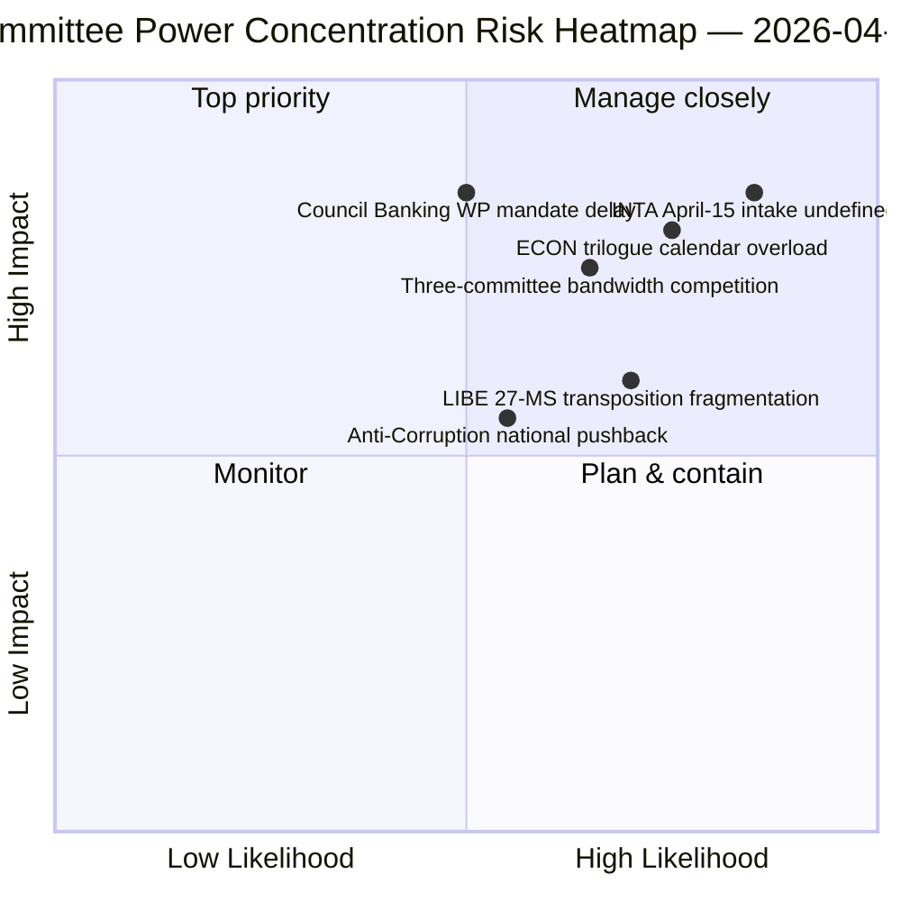

<!-- SPDX-FileCopyrightText: 2026 Hack23 AB -->
<!-- SPDX-License-Identifier: Apache-2.0 -->

# エグゼクティブ・ブリーフィング — 委員会報告：イースター休会第11日 回顧的総括 | 2026-04-06

**分類：** OSINT — 公開議会文書
**信頼度：** 🟡 中程度（休会中 — 新たな委員会活動なし；休会前回顧 🟢 高）
**実行：** `analysis/daily/2026-04-06/committee-reports/` (05:03 UTC)
**対象範囲：** イースター休会第11/18日 — 休会前コーパスに関する委員会権力の回顧的分析
**生成日：** 2026-05-16（回顧的ブリーフィング、新MCP呼び出しなし）
**主要ソース：** 休会前採択テキストコーパス（TA-10-2026-0090/0091/0092 ECON；TA-10-2026-0094 LIBE；TA-10-2026-0096 INTA）；分析ファイル20件。

---

## 🎯 BLUF

**この復活祭月曜日の実行は、休会前コーパスに関する委員会権力の回顧的分析を生成します — 同日の速報クラスターの分析的補完として機能します：速報の実行が二重トラック連立パターンを記録した一方、委員会報告の実行はそれを可能にした*委員会レベルの集中*を記録します。** 3つの委員会が2026年第1四半期の最も重要な成果を生み出しました：**ECON**（銀行同盟三位一体パッケージ：SRMR3 TA-10-2026-0092 + DGSD2 TA-10-2026-0090 + BRRD3 TA-10-2026-0091 — EU銀行セクター全体に影響を与える複数年にわたる銀行同盟案件の完了）、**LIBE**（汚職防止指令 TA-10-2026-0094 — 欧州検察庁EPPO以来初めての汎欧州刑事法制度）、および**INTA**（米国関税対応 TA-10-2026-0096 — 4月15日に発動するファイル）。この実行の独自の貢献は**委員会権力集中の知見**です：3つの委員会が第2四半期において不均衡な機関的重みを持ち、ECONが第2四半期の三者協議カレンダーの帯域幅を支配し（銀行同盟 → 理事会の指令 → 欧州委員会の解釈）、LIBEが第2〜4四半期にかけて27加盟国の移行経路を保有し、INTAが4月15日以降の運用的実施監督の役割を担います。この回顧的ブリーフィングは劣化したAPI環境（4/8フィードが稼働）で公開されますが、プライマリフィードで確認されたレコードに基づいています。

---

## 🧭 このブリーフィングが支える3つの意思決定

| # | 意思決定 | 決定者 | 期限 | 根拠 |
|:-:|---------|--------|:----:|------|
| 1 | **ECON第2四半期三者協議日程予約** — 銀行同盟三位一体パッケージには理事会の予約済み帯域幅が必要 | ECON委員長 + 理事会銀行作業部会 | 4月14日まで | §知見1（ECON優位） |
| 2 | **LIBE 27加盟国移行調整** — 初の汎欧州刑事法制度には各国議会との連絡が必要 | LIBE委員長 + 各国議会代表 | Q2〜Q4を通じて継続的 | §知見2（LIBEが先駆者として） |
| 3 | **INTA精査受付デザイン** — 実施段階は4月15日に発動；受付プロセス未定義 | INTA委員長 + コーディネーター | 4月14日まで | §知見3（INTAの運用的役割） |

---

## 📰 60秒で読む

- 🔴 **3委員会のQ1支配** — ECON · LIBE · INTA。
- 🟠 **ECON銀行同盟三位一体** — SRMR3 + DGSD2 + BRRD3（複数年の完了）。
- 🟢 **LIBE汚職防止** — EPPO以来初の汎欧州刑事法制度。
- 🟡 **INTA米国関税** — 4月15日に運用的実施が発動。
- 🔵 **累積コーパスで236の採択テキスト** — 週次フィードで検証可能。
- 🟣 **20分析ファイル** — ファイルごとに委員会レベルの手法を適用。
- 🩷 **API 4/8フィード稼働中** — 劣化しているが委員会データはアクセス可能。
- ⚪ **信頼度中程度** — 休会中；休会前コーパスは高；将来予測は中程度。

---

## 🏛️ 委員会権力の集中（実行の独自の貢献）

| 委員会 | Q1の主要案件 | Q2の機関的重み | Q2〜Q4の軌跡 |
|--------|------------|--------------|-------------|
| **ECON** | TA-0090 / 0091 / 0092（銀行同盟三位一体） | 三者協議カレンダー支配 | 複数年の銀行同盟完了 → Q2の理事会指令 |
| **LIBE** | TA-0094（汚職防止） | 27加盟国移行監督 | Q2〜Q4継続的移行；各国議会連絡 |
| **INTA** | TA-0096（米国関税） | 運用的実施監督 | T-0 4月15日；精査ウィンドウ交渉 |

---

## ⚠️ リスク概況

---

## 🔮 主要な将来のトリガー（今後14日間）

1. **4月14日 — 委員会週間開始** — 3委員会の帯域幅競争が始まる。
2. **4月15日 — TA-10-2026-0096が発動** — INTAの運用的役割。
3. **4月17日 — ECB金利決定** — ECONの外部トリガー。
4. **4月下旬 — 理事会銀行作業部会の指令** — ECONの三者協議ゲート。
5. **Q2 — 27加盟国移行の継続的開始** — LIBEの監督発動。

---

## 🛡️ ソース品質評価

- **休会前コーパス（A1）：** プライマリフィードレコード；TA-IDは検証可能。
- **3委員会集中（A2）：** 委員会権力手法；相対的重みへの信頼度は中程度。
- **20分析ファイル（A2）：** ファイルごとの体系的手法。
- **正味信頼度：** 🟢 Q1レコードについては高；🟡 Q2重み予測については中程度。

---

## 📎 実行成果物

| レイヤー | 成果物 | 理由 |
|---------|--------|------|
| 記事 | `article.md`（1,234行） | 委員会報告の公開ナレーティブ |
| 統合 | `existing/synthesis-summary.md` | 3委員会の知見（権威的） |
| 手法 | classification · existing · risk-scoring · threat-assessment | 標準的な委員会報告手法 |
| 関連 | breaking (00:33) · breaking-2 (06:45) · breaking-3 (12:15) · breaking-4 (18:18) · motions · propositions | 復活祭月曜日クラスター |

---

**文書管理**
- **テンプレート参照：** `analysis/templates/executive-brief.md`
- **成果物パス：** `analysis/daily/2026-04-06/committee-reports/executive-brief.md`
- **分類：** 公開
- **回顧的：** ブリーフィングは実行のアーカイブ成果物から2026-05-16に作成；**新たなMCP呼び出しは行われませんでした。**
