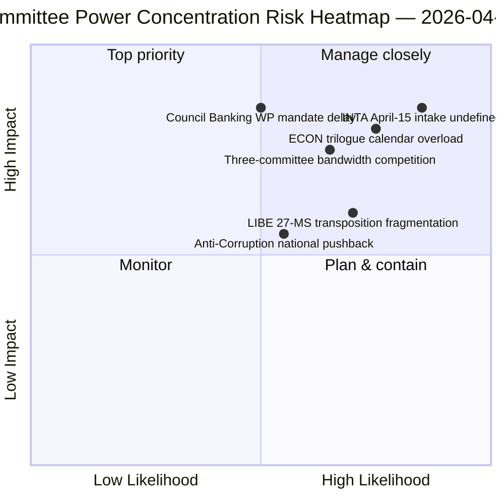

<!-- SPDX-FileCopyrightText: 2026 Hack23 AB -->
<!-- SPDX-License-Identifier: Apache-2.0 -->

# 집행부 브리핑 — 위원회 보고서: 부활절 휴회 11일차 회고 총괄 | 2026-04-06

**분류:** OSINT — 공개 의회 기록
**신뢰도:** 🟡 중간（휴회 중 — 새로운 위원회 활동 없음；휴회 전 회고 🟢 높음）
**실행:** `analysis/daily/2026-04-06/committee-reports/` (05:03 UTC)
**커버리지:** 부활절 휴회 11/18일 — 휴회 전 코퍼스에 대한 위원회 권력 회고 분석
**생성일:** 2026-05-16（회고 브리핑, 새로운 MCP 호출 없음）
**주요 출처:** 휴회 전 채택 텍스트 코퍼스（TA-10-2026-0090/0091/0092 ECON；TA-10-2026-0094 LIBE；TA-10-2026-0096 INTA）；분석 파일 20개.

---

## 🎯 BLUF

**이번 부활절 월요일 실행은 휴회 전 코퍼스에 대한 위원회 권력 회고 분석을 생성합니다 — 같은 날짜의 속보 클러스터의 분석적 보완으로서：속보 실행이 이중 트랙 연립 패턴을 기록한 반면, 위원회 보고서 실행은 그것을 가능하게 한 *위원회 수준의 집중*을 기록합니다.** 세 위원회가 2026년 1분기의 가장 중요한 결과를 생산했습니다：**ECON**（은행동맹 삼위일체 패키지：SRMR3 TA-10-2026-0092 + DGSD2 TA-10-2026-0090 + BRRD3 TA-10-2026-0091 — EU 은행 부문 전체에 영향을 미치는 다년간 은행동맹 사안의 완료）, **LIBE**（반부패 지침 TA-10-2026-0094 — 유럽검찰청 EPPO 이후 첫 범유럽 형사법 수단）, 그리고 **INTA**（미국 관세 대응 TA-10-2026-0096 — 4월 15일 발동되는 파일）. 이번 실행의 독특한 기여는 **위원회 권력 집중 결과**입니다：세 위원회가 2분기에 불균형적인 기관 비중을 보유하며, ECON이 2분기 삼자 협의 일정 대역폭을 지배하고（은행동맹 → 이사회 위임 → 집행위원회 해석）, LIBE가 2분기에서 4분기에 걸쳐 27개 회원국 전치 경로를 보유하고, INTA가 4월 15일부터 운영적 이행 감독 역할을 맡습니다. 회고 브리핑은 저하된 API 환경（4/8 피드 활성）에서 게시되지만 기본 피드 확인 레코드에 기반합니다.

---

## 🧭 이 브리핑이 지원하는 3가지 결정

| # | 결정 | 결정자 | 기한 | 근거 |
|:-:|-----|-------|:----:|------|
| 1 | **ECON 2분기 삼자 협의 일정 예약** — 은행동맹 삼위일체 패키지에는 예약된 이사회 대역폭이 필요 | ECON 의장 + 이사회 은행 작업반 | 4월 14일까지 | §결과 1（ECON 우위） |
| 2 | **LIBE 27개 회원국 전치 조정** — 첫 범유럽 형사법 수단에는 각국 의회와의 연락이 필요 | LIBE 의장 + 각국 의회 대표 | 2분기~4분기 지속 | §결과 2（LIBE가 선두 주자로서） |
| 3 | **INTA 검토 접수 설계** — 이행 단계가 4월 15일 발동；접수 프로세스 미정의 | INTA 의장 + 코디네이터 | 4월 14일까지 | §결과 3（INTA의 운영적 역할） |

---

## 📰 60초 읽기

- 🔴 **3위원회 1분기 우위** — ECON · LIBE · INTA.
- 🟠 **ECON 은행동맹 삼위일체** — SRMR3 + DGSD2 + BRRD3（다년간 완료）.
- 🟢 **LIBE 반부패** — EPPO 이후 첫 범유럽 형사법 수단.
- 🟡 **INTA 미국 관세** — 4월 15일 운영적 이행 발동.
- 🔵 **누적 코퍼스에서 채택 텍스트 236개** — 주간 피드를 통해 검증 가능.
- 🟣 **분석 파일 20개** — 파일별 위원회 수준 방법론 적용.
- 🩷 **API 4/8 피드 활성** — 저하됐지만 위원회 데이터 접근 가능.
- ⚪ **신뢰도 중간** — 휴회；휴회 전 코퍼스 높음；미래 전망 중간.

---

## 🏛️ 위원회 권력 집중（실행의 독특한 기여）

| 위원회 | 1분기 대표 안건 | 2분기 기관 비중 | 2~4분기 궤적 |
|-------|--------------|--------------|------------|
| **ECON** | TA-0090 / 0091 / 0092（은행동맹 삼위일체） | 삼자 협의 일정 지배 | 다년간 은행동맹 완료 → 2분기 이사회 위임 |
| **LIBE** | TA-0094（반부패） | 27개 회원국 전치 감독 | 2~4분기 지속 전치；각국 의회 연락 |
| **INTA** | TA-0096（미국 관세） | 운영적 이행 감독 | T-0 4월 15일；검토 창구 협상 |

---

## ⚠️ 리스크 스냅샷

---

## 🔮 주요 미래 트리거（향후 14일）

1. **4월 14일 — 위원회 주간 개최** — 세 위원회의 대역폭 경쟁 시작.
2. **4월 15일 — TA-10-2026-0096 발동** — INTA의 운영적 역할.
3. **4월 17일 — ECB 금리 결정** — ECON의 외부 트리거.
4. **4월 말 — 이사회 은행 작업반 위임** — ECON의 삼자 협의 게이트.
5. **2분기 — 27개 회원국 전치 지속 개시** — LIBE 감독 발동.

---

## 🛡️ 출처 품질 평가

- **휴회 전 코퍼스（A1）:** 기본 피드 레코드；TA-ID 검증 가능.
- **세 위원회 집중（A2）:** 위원회 권력 방법론；상대적 가중치에 대한 신뢰도 중간.
- **분석 파일 20개（A2）:** 파일별 체계적 방법론.
- **순 신뢰도:** 🟢 1분기 레코드에 대해 높음；🟡 2분기 가중치 예측에 대해 중간.

---

## 📎 실행 산출물

| 레이어 | 산출물 | 이유 |
|-------|--------|------|
| 기사 | `article.md`（1,234줄） | 위원회 보고서 공개 내러티브 |
| 종합 | `existing/synthesis-summary.md` | 세 위원회 결과（권위적） |
| 방법론 | classification · existing · risk-scoring · threat-assessment | 표준 위원회 보고서 방법론 |
| 동반 | breaking (00:33) · breaking-2 (06:45) · breaking-3 (12:15) · breaking-4 (18:18) · motions · propositions | 부활절 월요일 클러스터 |

---

**문서 관리**
- **템플릿 참조:** `analysis/templates/executive-brief.md`
- **산출물 경로:** `analysis/daily/2026-04-06/committee-reports/executive-brief.md`
- **분류:** 공개
- **회고:** 브리핑은 실행의 보관된 산출물에서 2026-05-16에 작성；**새로운 MCP 호출은 수행되지 않았습니다.**
