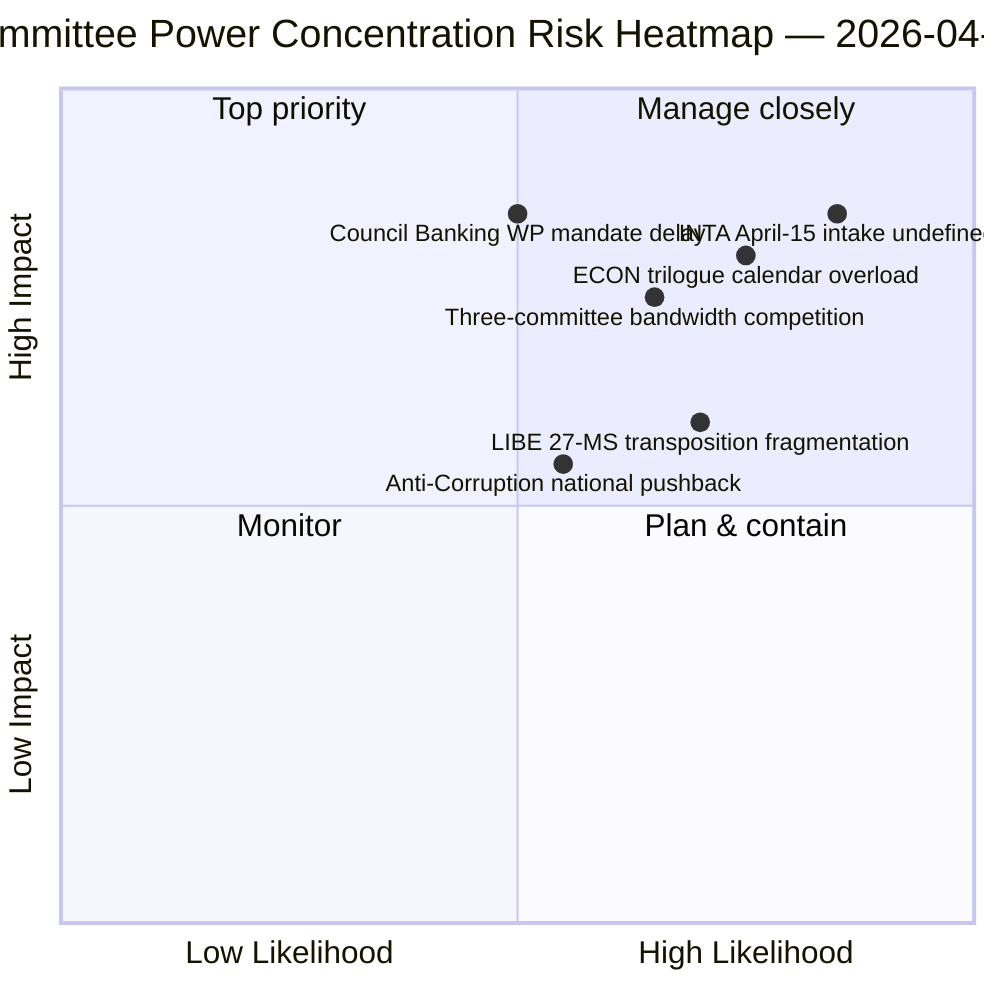

<!-- SPDX-FileCopyrightText: 2026 Hack23 AB -->
<!-- SPDX-License-Identifier: Apache-2.0 -->

# Uitvoerende Briefing — Commissierapporten: Paasreces Dag 11 Retrospectief | 2026-04-06

**Classificatie:** OSINT — Openbaar parlementair document
**Betrouwbaarheidsniveau:** 🟡 GEMIDDELD (reces — geen nieuwe commissieactiviteit; pre-reces retrospectief 🟢 HOOG)
**Run:** `analysis/daily/2026-04-06/committee-reports/` (05:03 UTC)
**Dekking:** Paasreces Dag 11/18 — retrospectieve commissiemachtanalyse van het pre-reces corpus
**Gegenereerd:** 2026-05-16 (retrospectieve briefing, geen nieuwe MCP-aanroepen)
**Primaire bronnen:** Pre-reces corpus aangenomen teksten (TA-10-2026-0090/0091/0092 ECON; TA-10-2026-0094 LIBE; TA-10-2026-0096 INTA); 20 analysebestanden.

---

## 🎯 BLUF

**Deze Tweede Paasdag-run produceert de retrospectieve commissiemachtanalyse van het pre-reces corpus — het analytische complement van het breaking-cluster op dezelfde datum: waar de breaking-runs het dubbelspoorcoalitiepatroon documenteerden, documenteert de commissierapportenrun de *concentratie op commissieniveau* die dit mogelijk maakte.** Drie commissies produceerden Q1 2026's meest consequente output: **ECON** (Bankenunie drievoudige pakket: SRMR3 TA-10-2026-0092 + DGSD2 TA-10-2026-0090 + BRRD3 TA-10-2026-0091 — voltooiing van meerjarige bankenuniedossiers die de gehele EU-bankensector raken), **LIBE** (Anti-Corruptierichtlijn TA-10-2026-0094 — het eerste pan-Europese strafrechtsinstrument sinds het Europees Openbaar Ministerie EPPO), en **INTA** (US tariefrespons TA-10-2026-0096 — het dossier dat op 15 april wordt geactiveerd). De onderscheidende bijdrage van de run is de **bevinding van concentratie van commissiemacht**: drie commissies bezitten disproportioneel Q2 institutioneel gewicht, waarbij ECON de Q2-trilogkalenderbandbreedde domineert (Bankenunie → Raadsmandaten → Commissie-interpretatie), LIBE het 27-LS-transpositietraject door Q2–Q4 bezit, en INTA de operationele implementatietoezichtsrol absorbeert vanaf 15 april. Het retrospectief wordt gepubliceerd in een gedegradeerde API-omgeving (4/8 feeds actief) maar berust op primaire feed-bevestigde records.

---

## 🧭 3 Beslissingen die deze briefing ondersteunt

| # | Beslissing | Wie beslist | Deadline | Bewijs |
|:-:|-----------|------------|:--------:|--------|
| 1 | **ECON Q2-trilogagendareservering** — Bankenunie drievoudige pakket vereist gereserveerde Raadscapaciteit | ECON-voorzitter + Raadsbankwerkgroep | voor 14 april | §Bevinding 1 (ECON-dominantie) |
| 2 | **LIBE 27-LS-transpositiecoördinatie** — eerste pan-Europees strafrechtsinstrument vereist liaison met nationale parlementen | LIBE-voorzitter + nationale parlementsvertegenwoordigers | doorlopend Q2–Q4 | §Bevinding 2 (LIBE als eerste mover) |
| 3 | **INTA scrutinie-intakeontwerp** — implementatiefase activeert 15 april; intakeproces niet gedefinieerd | INTA-voorzitter + coördinatoren | voor 14 april | §Bevinding 3 (INTA operationele rol) |

---

## 📰 60-seconden lezen

- 🔴 **Drie-commissies Q1-dominantie** — ECON · LIBE · INTA.
- 🟠 **ECON Bankenunie drievoudige pakket** — SRMR3 + DGSD2 + BRRD3 (meerjarige voltooiing).
- 🟢 **LIBE Anti-Corruptie** — eerste pan-Europees strafrechtsinstrument sinds EPPO.
- 🟡 **INTA US-tarief** — operationele implementatie activeert 15 april.
- 🔵 **236 aangenomen teksten in cumulatief corpus** — verifieerbaar via weekfeed.
- 🟣 **20 analysebestanden** — commissieniveau methodologie toegepast per bestand.
- 🩷 **API 4/8 feeds actief** — gedegradeerd maar commissiedata toegankelijk.
- ⚪ **Betrouwbaarheidsniveau GEMIDDELD** — reces; pre-reces corpus hoog; vooruitkijkende prognose gemiddeld.

---

## 🏛️ Concentratie van commissiemacht (onderscheidende bijdrage van de run)

| Commissie | Vlaggenschip Q1-dossier(s) | Q2 institutioneel gewicht | Q2–Q4-traject |
|-----------|---------------------------|--------------------------|---------------|
| **ECON** | TA-0090 / 0091 / 0092 (Bankenunie drievoudige pakket) | Trilogagenda-dominantie | Meerjarige Bankenunie voltooiing → Raadsmandaten Q2 |
| **LIBE** | TA-0094 (Anti-Corruptie) | 27-LS-transpositietoezicht | Q2–Q4 doorlopende transpositie; nationaal parlementaire liaison |
| **INTA** | TA-0096 (US-tarief) | Operationeel implementatietoezicht | T-0 15 april; scrutinievelsteronderhandeling |

---

## ⚠️ Risicosnapshot

---

## 🔮 Top vooruitkijkende triggers (komende 14 dagen)

1. **14 april — Commissieweek opent** — drie-commissie bandbreedteconcurrentie begint.
2. **15 april — TA-10-2026-0096 activeert** — INTA's operationele rol.
3. **17 april — ECB-rentebeslissing** — ECON's externe trigger.
4. **Eind april — Raad Bankwerkgroep mandaat** — ECON's trilogpoort.
5. **Q2 — 27-LS-transpositie doorlopende kickoff** — LIBE's toezichtactivering.

---

## 🛡️ Bronkwaliteitsbeoordeling

- **Pre-reces corpus (A1):** primaire feedrecords; TA-ID's verifieerbaar.
- **Drie-commissie concentratie (A2):** commissiemacht methodologie; gemiddeld vertrouwen in relatieve weging.
- **20 analysebestanden (A2):** systematische per-bestand methodologie.
- **Netto betrouwbaarheidsniveau:** 🟢 HOOG voor Q1-records; 🟡 GEMIDDELD voor Q2-gewichtsprognose.

---

## 📎 Run-artefacten

| Laag | Artefact | Waarom |
|------|----------|--------|
| Artikel | `article.md` (1.234 regels) | Publiek commissierapportennarratief |
| Synthese | `existing/synthesis-summary.md` | Drie-commissie bevinding (autoritatief) |
| Methoden | classification · existing · risk-scoring · threat-assessment | Standaard commissierapportenmethodologie |
| Begeleider | breaking (00:33) · breaking-2 (06:45) · breaking-3 (12:15) · breaking-4 (18:18) · motions · propositions | Tweede Paasdag cluster |

---

**Documentbeheer**
- **Sjabloonreferentie:** `analysis/templates/executive-brief.md`
- **Artefactpad:** `analysis/daily/2026-04-06/committee-reports/executive-brief.md`
- **Classificatie:** Openbaar
- **Retrospectief:** Briefing geschreven op 2026-05-16 vanuit de gearchiveerde artefacten van de run; **er werden geen nieuwe MCP-aanroepen gedaan**.
