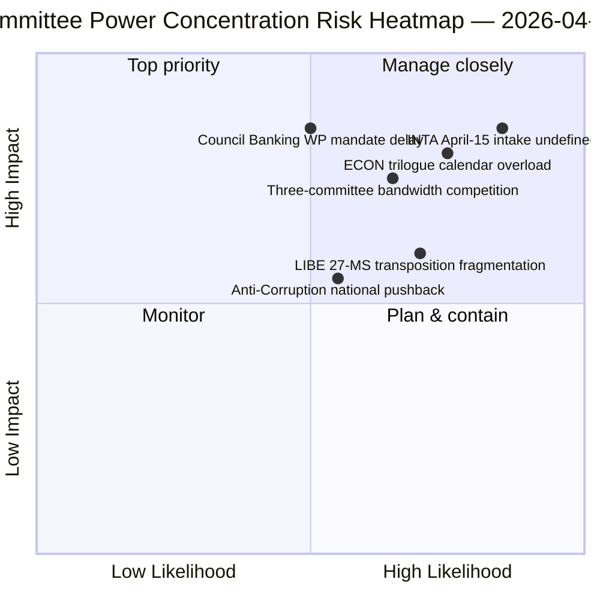

<!-- SPDX-FileCopyrightText: 2026 Hack23 AB -->
<!-- SPDX-License-Identifier: Apache-2.0 -->

# Ledelsesbriefing — Komitérapporter: Påskeferie Dag 11 Retrospektiv | 2026-04-06

**Klassifisering:** OSINT — Offentlig parlamentarisk protokoll
**Konfidensnivå:** 🟡 MIDDELS (ferie — ingen ny komitéaktivitet; pre-ferie retrospektiv 🟢 HØY)
**Kjøring:** `analysis/daily/2026-04-06/committee-reports/` (05:03 UTC)
**Dekning:** Påskeferie Dag 11/18 — retrospektiv komitémaktanalyse av pre-ferie-korpus
**Generert:** 2026-05-16 (retrospektiv briefing, ingen nye MCP-kall)
**Primærkilder:** Pre-ferie vedtatte tekster (TA-10-2026-0090/0091/0092 ECON; TA-10-2026-0094 LIBE; TA-10-2026-0096 INTA); 20 analysefiler.

---

## 🎯 BLUF

**Denne 2. påskedags kjøring gir den retrospektive komitémaktanalysen av pre-ferie-korpuset — det analytiske komplementet til breaking-klyngen på samme dato: der breaking-kjøringene dokumenterte det tosporskoalisjonsmønsteret, dokumenterer komitérapportkjøringen den *komiténivåkonsentrasjonen* som muliggjorde det.** Tre komitéer produserte Q1 2026's mest konsekvente output: **ECON** (Bankunionens tredobbeltpakke: SRMR3 TA-10-2026-0092 + DGSD2 TA-10-2026-0090 + BRRD3 TA-10-2026-0091 — fullføring av flerårige bankunionssaker som påvirker hele EUs banksektor), **LIBE** (Antikorrupsjonsdirektiv TA-10-2026-0094 — det første tvereuropeiske strafferettsinstrumentet siden den europeiske påtalemyndighet EPPO), og **INTA** (USA-tollrespons TA-10-2026-0096 — filen som aktiveres 15. april). Kjøringens særegne bidrag er **komitémakt-konsentrasjonsfunnet**: tre komitéer innehar uforholdsmessig Q2 institusjonell tyngde, med ECON som dominerer Q2-trilogkalenderens båndbredde (Bankunionen → Rådets mandater → Kommisjonens tolkning), LIBE som eier den 27-MS-transponeringsveien gjennom Q2–Q4, og INTA som absorberer den operative gjennomføringstilsynsrollen fra 15. april. Det retrospektive brevet publiseres i et degradert API-miljø (4/8 feeds aktive) men hviler på primære feed-bekreftede poster.

---

## 🧭 3 Beslutninger denne briefingen støtter

| # | Beslutning | Beslutningstaker | Frist | Dokumentasjon |
|:-:|-----------|-----------------|:-----:|---------------|
| 1 | **ECON Q2-trilogkalenderreservasjon** — Bankunionens tredobbeltpakke krever reservert rådskapasitet | ECON-leder + Rådets bankarbeidsgruppe | innen 14. april | §Funn 1 (ECON-dominans) |
| 2 | **LIBE 27-MS-transponeringskoordinering** — første tvereuropeiske strafferettsinstrument krever liaison med nasjonale parlamenter | LIBE-leder + nasjonalparlamentariske representanter | løpende Q2–Q4 | §Funn 2 (LIBE som førstemover) |
| 3 | **INTA kontrollinntakdesign** — gjennomføringsfasen aktiveres 15. april; inntak udefinert | INTA-leder + koordinatorer | innen 14. april | §Funn 3 (INTA operativ rolle) |

---

## 📰 60-sekunders lesning

- 🔴 **Tre-komité Q1-dominans** — ECON · LIBE · INTA.
- 🟠 **ECON Bankunionens tredobbelt** — SRMR3 + DGSD2 + BRRD3 (flerårig fullføring).
- 🟢 **LIBE Antikorrupsjon** — første tvereuropeiske strafferettsinstrument siden EPPO.
- 🟡 **INTA USA-toll** — operativ gjennomføring aktiveres 15. april.
- 🔵 **236 vedtatte tekster i kumulativt korpus** — verifiserbart via ukentlig feed.
- 🟣 **20 analysefiler** — komiténivåmetodikk anvendt per fil.
- 🩷 **API 4/8 feeds aktive** — degradert men komitédata tilgjengelig.
- ⚪ **Konfidensnivå MIDDELS** — ferie; pre-ferie-korpus høyt; fremadrettet prognose middels.

---

## 🏛️ Komitémaktkonsentrasjon (kjøringens særegne bidrag)

| Komité | Flaggskipssak(er) Q1 | Q2 institusjonell tyngde | Q2–Q4-forløp |
|--------|----------------------|--------------------------|--------------|
| **ECON** | TA-0090 / 0091 / 0092 (Bankunionens tredobbelt) | Trilogkalender-dominans | Flerårig bankunionsfullføring → Rådets mandater Q2 |
| **LIBE** | TA-0094 (Antikorrupsjon) | 27-MS-transponeringtilsyn | Q2–Q4 løpende transponering; nasjonalt parlamentarisk liaison |
| **INTA** | TA-0096 (USA-toll) | Operativt gjennomføringstilsyn | T-0 15. april; kontrolvinduforhandling |

---

## ⚠️ Risikooversikt

---

## 🔮 Topp fremoverpekende utløsere (neste 14 dager)

1. **14. april — Komitéuken åpner** — tre-komités båndbreddekonkurranse begynner.
2. **15. april — TA-10-2026-0096 aktiveres** — INTAs operative rolle.
3. **17. april — ECBs rentebeslutning** — ECONs eksterne utløser.
4. **Sent april — Rådets bankarbeidsgruppe mandat** — ECONs trilogport.
5. **Q2 — 27-MS-transponering løpende oppstart** — LIBEs tilsynsaktivering.

---

## 🛡️ Kildekvalitetsvurdering

- **Pre-ferie-korpus (A1):** primære feedposter; TA-ID-er verifiserbare.
- **Tre-komitékonsentrasjon (A2):** komitémakt-metodikk; middelskonfidensgrad på relativ vekting.
- **20 analysefiler (A2):** systematisk per-fil-metodikk.
- **Netto konfidensnivå:** 🟢 HØY på Q1-poster; 🟡 MIDDELS på Q2-vektprognose.

---

## 📎 Kjøringsartefakter

| Lag | Artefakt | Hvorfor |
|-----|----------|---------|
| Artikkel | `article.md` (1 234 linjer) | Offentlig komitérapportnarrativ |
| Syntese | `existing/synthesis-summary.md` | Tre-komitéfunn (autoritativt) |
| Metoder | classification · existing · risk-scoring · threat-assessment | Standard komitérapportmetodikk |
| Ledsager | breaking (00:33) · breaking-2 (06:45) · breaking-3 (12:15) · breaking-4 (18:18) · motions · propositions | Påskemandagsklynge |

---

**Dokumentkontroll**
- **Malreferanse:** `analysis/templates/executive-brief.md`
- **Artefaktsti:** `analysis/daily/2026-04-06/committee-reports/executive-brief.md`
- **Klassifisering:** Offentlig
- **Retrospektiv:** Briefing skrevet 2026-05-16 fra kjøringens arkiverte artefakter; **ingen nye MCP-kall ble foretatt**.
